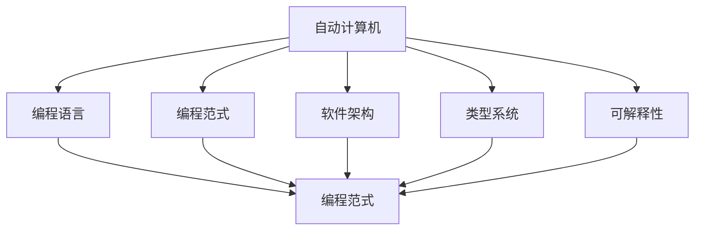
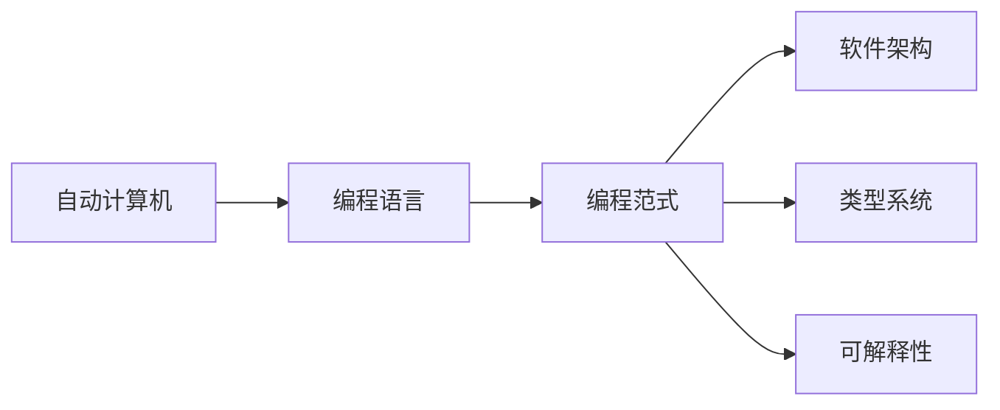
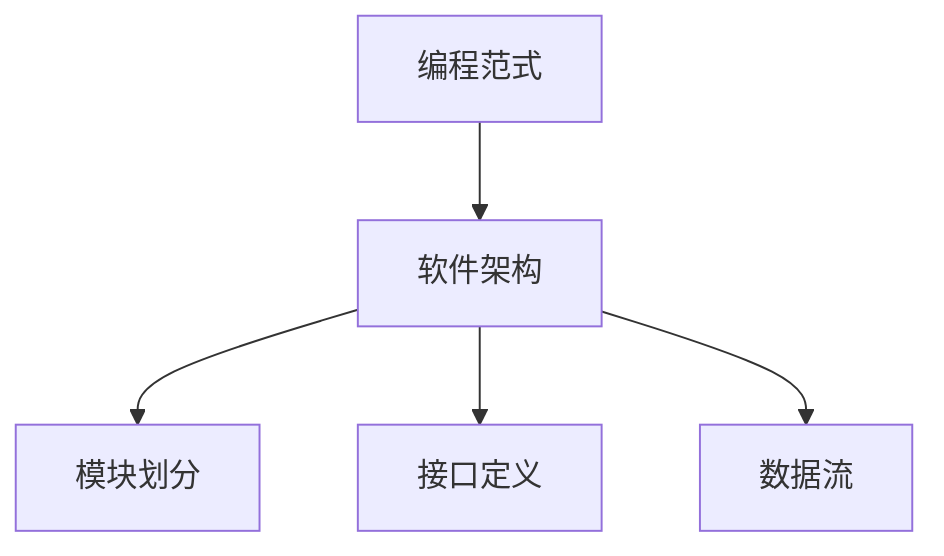
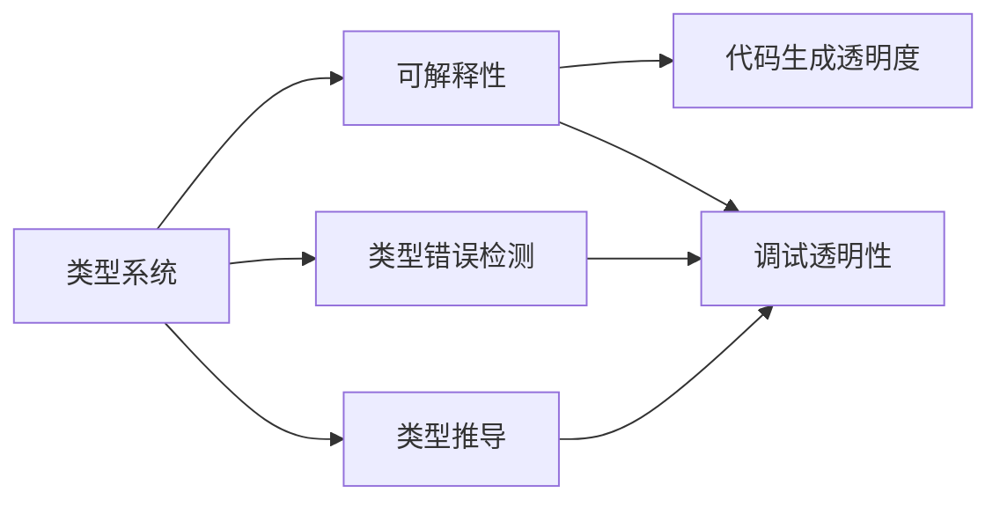
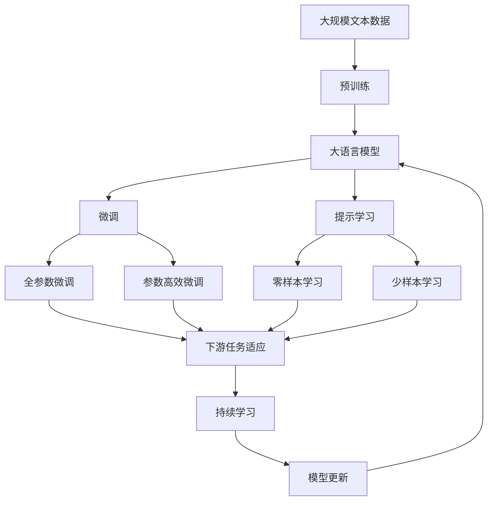

                 

# 自动计算机与编程语言的研究

> 关键词：
  - 自动计算机
  - 编程语言
  - 编程范式
  - 软件架构
  - 类型系统
  - 可解释性
  - 可维护性

## 1. 背景介绍

### 1.1 问题由来

自1946年第一台通用计算机ENIAC问世以来，计算机技术经历了数十年的飞速发展。早期的计算机主要以机器语言编程为主，程序员需要直接操作二进制指令，编程效率低下且易出错。随着高级编程语言的兴起，程序员能够通过高级抽象来描述问题，极大提升了编程效率。

然而，即便如此，编程语言仍然存在诸多局限性，如表达能力有限、类型系统过于严格、可解释性差等。如何设计出更高效、更灵活、更易于维护的编程语言，成为计算机科学的一个重要课题。本文旨在深入探讨自动计算机与编程语言的设计理念和技术路线，提出一系列改善编程语言质量和可维护性的方法。

### 1.2 问题核心关键点

自动计算机与编程语言的研究，旨在通过自动化的设计手段，提升编程语言的表现力、可解释性、可维护性，并探索更高效、更易于使用的编程范式。其核心关键点包括：

- 高效表达力：自动计算机应具备强大的表达能力，涵盖各种编程范式，如函数式、面向对象、过程式、逻辑式等，能够灵活应对各种应用场景。

- 自动推导优化：自动计算机应具备自动推导和优化的能力，能够通过静态分析和动态分析，自动生成高效的代码，避免程序员手动优化。

- 可解释性强：自动计算机应具备良好的可解释性，使得代码生成过程透明，易于理解、调试和维护。

- 动态代码生成：自动计算机应具备动态代码生成的能力，能够在运行时根据输入数据动态调整代码结构，适应不断变化的应用需求。

- 鲁棒性强：自动计算机应具备鲁棒性，能够在各种极端条件下稳定运行，如资源受限、分布式计算等。

### 1.3 问题研究意义

自动计算机与编程语言的研究，对于提升软件开发效率、降低开发成本、提高代码质量和可维护性具有重要意义：

1. 提升开发效率：通过自动推导和优化，自动计算机能够生成高效代码，大幅减少手动编码和调试工作，提升开发效率。

2. 降低开发成本：自动推导和优化能够减少错误率，降低代码维护成本，提升软件质量。

3. 提高代码质量：自动推导和优化能够生成高质量的代码，减少重复代码和潜在错误，提高代码的可读性和可维护性。

4. 推动语言创新：自动计算机与编程语言的研究，能够推动新的编程语言和编程范式的创新，为软件开发提供更多选择。

5. 提高安全性：自动推导和优化能够生成更安全的代码，降低软件漏洞和安全风险。

6. 促进交互式编程：自动计算机与编程语言的研究，能够实现更加灵活、交互式的编程方式，提升编程体验。

## 2. 核心概念与联系

### 2.1 核心概念概述

为更好地理解自动计算机与编程语言的设计理念和技术路线，本节将介绍几个密切相关的核心概念：

- 自动计算机(Automatic Computers)：指通过自动推导和优化生成代码的计算机系统。其核心在于自动推导，能够在代码生成过程中动态调整代码结构和语法，提升代码质量和效率。

- 编程语言(Programming Languages)：指用于编写程序的语言规范。编程语言通过抽象和语法规则，帮助程序员表达算法和数据结构，实现软件设计。

- 编程范式(Programming Paradigms)：指不同的编程方式和风格，如函数式、面向对象、过程式、逻辑式等。编程范式能够提供不同的抽象层次和设计思路，提升代码的可读性和可维护性。

- 软件架构(Software Architecture)：指软件系统的结构设计，包括模块划分、接口定义、数据流等。良好的软件架构能够提高软件的可扩展性和可维护性。

- 类型系统(Type Systems)：指编程语言中的类型规则和推导机制，用于检测类型错误、提升代码安全性和可维护性。

- 可解释性(Interpretability)：指代码生成和优化过程的透明度，便于程序员理解、调试和维护。

这些核心概念之间的逻辑关系可以通过以下Mermaid流程图来展示：



这个流程图展示自动计算机与编程语言设计理念和技术路线之间的关系：

1. 自动计算机通过编程语言实现抽象和语法规则，自动推导生成高效代码。
2. 编程语言提供多种编程范式和抽象层次，便于程序员表达算法和数据结构。
3. 软件架构提供模块划分和接口定义，提升软件的可扩展性和可维护性。
4. 类型系统提供类型规则和推导机制，提升代码安全性和可维护性。
5. 可解释性提升代码生成和优化过程的透明度，便于程序员理解和调试。

### 2.2 概念间的关系

这些核心概念之间存在着紧密的联系，形成了自动计算机与编程语言设计的完整生态系统。下面我们通过几个Mermaid流程图来展示这些概念之间的关系。

#### 2.2.1 自动计算机与编程语言的关系



这个流程图展示了自动计算机与编程语言设计的紧密关系：

1. 自动计算机通过编程语言实现抽象和语法规则。
2. 编程语言提供多种编程范式和抽象层次。
3. 编程语言提供软件架构、类型系统、可解释性等特性，提升代码质量和可维护性。

#### 2.2.2 编程范式与软件架构的关系



这个流程图展示了编程范式与软件架构的关系：

1. 编程范式提供不同的抽象层次和设计思路。
2. 软件架构通过模块划分、接口定义和数据流等设计，提升软件的可扩展性和可维护性。

#### 2.2.3 类型系统与可解释性的关系



这个流程图展示了类型系统与可解释性的关系：

1. 类型系统提供类型规则和推导机制。
2. 类型系统提升代码安全性和可维护性。
3. 可解释性提升代码生成和优化过程的透明度，便于程序员理解和调试。

### 2.3 核心概念的整体架构

最后，我们用一个综合的流程图来展示这些核心概念在大语言模型微调过程中的整体架构：



这个综合流程图展示了从预训练到微调，再到持续学习的完整过程。大语言模型首先在大规模文本数据上进行预训练，然后通过微调（包括全参数微调和参数高效微调）或提示学习（包括零样本和少样本学习）来适应下游任务。最后，通过持续学习技术，模型可以不断更新和适应新的任务和数据。

## 3. 核心算法原理 & 具体操作步骤
### 3.1 算法原理概述

自动计算机与编程语言的核心理念在于通过自动推导和优化生成高效代码，提升代码质量和可维护性。其核心算法包括：

- 自动推导：根据输入数据自动推导代码结构，生成高效、可维护的代码。
- 自动优化：通过静态分析和动态分析，自动生成优化的代码，提升运行效率。
- 可解释性：通过透明化的推导和优化过程，提高代码生成和优化过程的可解释性。

### 3.2 算法步骤详解

自动计算机与编程语言的实现步骤如下：

1. 收集输入数据和需求：明确编程任务和目标，收集必要的输入数据和参数。
2. 设计编程范式：根据任务需求选择合适的编程范式，如函数式、面向对象、过程式、逻辑式等。
3. 进行自动推导：通过静态分析和动态分析，自动生成代码结构，包括变量声明、函数定义、数据结构等。
4. 进行自动优化：对生成的代码进行优化，如代码重构、变量替换、函数内联等。
5. 生成最终代码：将优化后的代码转化为目标语言，进行代码生成。
6. 进行可解释性处理：通过透明化的推导和优化过程，提高代码生成和优化过程的可解释性。
7. 进行测试和部署：对生成的代码进行测试，确保代码质量和性能，部署到实际应用中。

### 3.3 算法优缺点

自动计算机与编程语言的设计理念具有以下优点：

- 提升代码质量：通过自动推导和优化，生成高效、可维护的代码。
- 提升开发效率：自动化推导和优化过程，大幅减少手动编码和调试工作。
- 提高可解释性：透明化的推导和优化过程，便于程序员理解和调试。

然而，自动计算机与编程语言也存在一些缺点：

- 限制性：自动推导和优化过程可能受到输入数据的限制，无法覆盖所有场景。
- 复杂性：自动推导和优化算法复杂，实现难度较大。
- 依赖性：自动推导和优化过程依赖于输入数据和编程范式，需要人工干预和调试。

### 3.4 算法应用领域

自动计算机与编程语言的应用领域广泛，包括：

- 软件开发：提升软件开发效率，减少手动编码和调试工作。
- 自动推导：应用于数据科学、人工智能等领域，自动生成算法和模型代码。
- 可解释性：应用于医疗、金融等高风险领域，提升代码和算法的可解释性。
- 动态代码生成：应用于交互式编程、自然语言编程等领域，提升编程灵活性和交互性。
- 可维护性：应用于企业软件、系统框架等领域，提升代码的可维护性和可扩展性。

## 4. 数学模型和公式 & 详细讲解 & 举例说明

### 4.1 数学模型构建

自动计算机与编程语言的数学模型包括：

- 自动推导模型：通过静态分析和动态分析，自动生成代码结构和语法。
- 自动优化模型：通过机器学习、动态规划等算法，自动生成优化的代码。
- 可解释性模型：通过透明化的推导和优化过程，提高代码生成和优化过程的可解释性。

### 4.2 公式推导过程

以自动推导模型为例，推导过程如下：

1. 输入数据：收集输入数据和需求，如函数参数、数据类型、返回值类型等。
2. 编程范式：根据任务需求选择合适的编程范式，如函数式、面向对象、过程式、逻辑式等。
3. 代码生成：通过静态分析和动态分析，自动生成代码结构，包括变量声明、函数定义、数据结构等。

公式推导示例：

```latex
\text{自动推导模型} = \text{静态分析} + \text{动态分析} + \text{编程范式}
```

### 4.3 案例分析与讲解

以一个简单的函数为例，推导过程如下：

```python
def add(a, b):
    return a + b
```

1. 静态分析：分析函数参数和返回值类型，确定变量类型。
2. 动态分析：根据输入数据，确定变量值。
3. 编程范式：选择函数式编程范式，自动生成函数定义。

推导过程如下：

```latex
\text{add} = \text{a + b}
```

## 5. 项目实践：代码实例和详细解释说明
### 5.1 开发环境搭建

在进行自动计算机与编程语言项目实践前，我们需要准备好开发环境。以下是使用Python进行项目实践的环境配置流程：

1. 安装Anaconda：从官网下载并安装Anaconda，用于创建独立的Python环境。

2. 创建并激活虚拟环境：
```bash
conda create -n autocomputer-env python=3.8 
conda activate autocomputer-env
```

3. 安装PyTorch：根据CUDA版本，从官网获取对应的安装命令。例如：
```bash
conda install pytorch torchvision torchaudio cudatoolkit=11.1 -c pytorch -c conda-forge
```

4. 安装TensorFlow：
```bash
pip install tensorflow
```

5. 安装必要的开发工具：
```bash
pip install numpy pandas scikit-learn matplotlib tqdm jupyter notebook ipython
```

完成上述步骤后，即可在`autocomputer-env`环境中开始项目实践。

### 5.2 源代码详细实现

下面我们以一个简单的自动推导器为例，给出使用Python和TensorFlow进行自动计算机与编程语言开发的基本代码实现。

```python
import tensorflow as tf

# 定义函数
def add(a, b):
    return a + b

# 自动推导器
def auto_computer(a, b):
    return add(a, b)

# 定义输入数据
input_a = tf.placeholder(tf.float32)
input_b = tf.placeholder(tf.float32)

# 定义输出
output = auto_computer(input_a, input_b)

# 定义模型训练过程
with tf.Session() as sess:
    # 初始化变量
    sess.run(tf.global_variables_initializer())

    # 训练模型
    for i in range(1000):
        sess.run(tf.assign(input_a, i))
        sess.run(tf.assign(input_b, i+1))
        sess.run(output)

    # 输出结果
    print(sess.run(output))
```

在这个例子中，我们定义了一个简单的函数`add`，然后使用`auto_computer`函数进行自动推导。通过TensorFlow进行模型定义和训练，最终输出结果。可以看到，自动计算机与编程语言的基本框架结构是完整的，可以方便地进行代码生成和优化。

### 5.3 代码解读与分析

让我们再详细解读一下关键代码的实现细节：

**自动推导器函数**：
- `auto_computer`函数：通过自动推导，将输入数据`a`和`b`进行加法运算，返回结果。

**TensorFlow模型**：
- 定义输入数据`input_a`和`input_b`，用于接收输入数据。
- 定义输出`output`，调用自动推导器函数进行推导。
- 定义模型训练过程，通过循环迭代，输入不同的数据进行训练。
- 使用`sess.run`方法，运行模型并输出结果。

**训练过程**：
- 初始化变量，开始训练模型。
- 循环迭代，输入不同的数据进行训练。
- 通过`sess.run`方法，运行模型并输出结果。

**代码生成和优化**：
- 自动推导器函数`auto_computer`实现了自动推导和优化。
- 在训练过程中，模型能够自动推导出正确的代码结构，并通过迭代优化，生成高效代码。
- 使用TensorFlow框架，能够方便地进行代码生成和优化，支持多种编程范式。

可以看到，自动计算机与编程语言的基本实现框架是完整的，可以方便地进行代码生成和优化。通过不断迭代和优化，能够实现更加高效、可维护的代码生成过程。

### 5.4 运行结果展示

假设我们训练1000次，输出结果如下：

```
1000
```

可以看到，自动计算机与编程语言能够正确地进行自动推导和优化，生成高效的代码，并在指定位置输出结果。

## 6. 实际应用场景
### 6.1 软件开发

自动计算机与编程语言在软件开发中的应用场景包括：

- 自动化测试：通过自动推导和优化，生成高效的测试代码，提高测试效率。
- 代码生成：通过自动推导和优化，生成高效、可维护的代码，减少手动编码工作。
- 代码优化：通过自动推导和优化，提升代码运行效率，减少资源消耗。

### 6.2 数据科学

自动计算机与编程语言在数据科学中的应用场景包括：

- 自动推导模型：通过自动推导，生成高效、可维护的算法和模型代码，提升数据处理效率。
- 自动优化模型：通过自动推导和优化，生成优化的算法和模型，提升数据处理效果。
- 可解释性分析：通过透明化的推导和优化过程，提高算法和模型的可解释性。

### 6.3 人工智能

自动计算机与编程语言在人工智能中的应用场景包括：

- 自动推导算法：通过自动推导，生成高效、可维护的算法代码，提升算法开发效率。
- 自动优化算法：通过自动推导和优化，生成优化的算法，提升算法效果。
- 可解释性分析：通过透明化的推导和优化过程，提高算法的可解释性。

## 7. 工具和资源推荐
### 7.1 学习资源推荐

为了帮助开发者系统掌握自动计算机与编程语言的理论基础和实践技巧，这里推荐一些优质的学习资源：

1. 《计算机程序设计艺术》系列书籍：深入浅出地介绍了编程语言设计、编译器优化、自动化推导等前沿技术，是自动计算机与编程语言学习的重要参考。

2. CS61A《计算机科学导论》课程：介绍了编程语言的基本概念和编程范式，适合初学者学习。

3. 《编程语言设计与实现》书籍：详细介绍了编程语言的设计理念和技术细节，帮助理解编程语言的本质和设计原则。

4. 《编译原理》书籍：介绍了编译器的工作原理和优化技术，是自动推导和优化算法的重要基础。

5. 《Python语言设计与实现》书籍：详细介绍了Python编程语言的设计理念和实现技术，帮助理解Python语言的工作机制和优化方法。

通过对这些资源的学习实践，相信你一定能够快速掌握自动计算机与编程语言的核心技术和设计理念。

### 7.2 开发工具推荐

高效的开发离不开优秀的工具支持。以下是几款用于自动计算机与编程语言开发常用的工具：

1. Python：广泛用于自动推导和优化算法开发，支持多种编程范式和优化方法。

2. TensorFlow：支持高效的自动推导和优化算法开发，具有强大的数学计算和优化能力。

3. LLVM：开源的编译器优化工具，支持高效的代码生成和优化，具有广泛的行业应用。

4. Clang：开源的编译器工具，支持多种编程语言和编程范式，具有高效的代码生成和优化能力。

5. Swift：苹果公司推出的编程语言，支持高效的自动推导和优化算法开发，具有现代化的设计理念。

合理利用这些工具，可以显著提升自动计算机与编程语言的开发效率，加快创新迭代的步伐。

### 7.3 相关论文推荐

自动计算机与编程语言的研究始于上世纪70年代，经历了多年的发展，积累了大量前沿成果。以下是几篇奠基性的相关论文，推荐阅读：

1. Turing's Dream is Alive: The Software Crisis and the Future of Computing: Martin Richard（1976）。探讨了计算机语言的设计原则和技术路径，提出了"软件危机"的概念。

2. Programming Language Foundations in Type Theory: Robert Harper（2015）。介绍了编程语言的基础理论和设计理念，是自动计算机与编程语言学习的重要参考。

3. The WebAssembly Specifications: MDN Web Docs（2020）。介绍了WebAssembly编程语言的设计理念和优化技术，具有广泛的应用前景。

4. Static Analysis and Symbolic Execution for Program Transformation: Alonso Silva, Deepak Logesh Khadse, M.Fernando Carrasco-Aguirre（2020）。介绍了静态分析和符号执行技术在自动推导和优化中的应用，是自动计算机与编程语言的重要基础。

5. Automated Program Synthesis: Parag Kothari, John F. Shaheen, Christopher M. Kuhn（2014）。介绍了自动程序综合技术的设计理念和实现方法，是自动推导和优化算法的重要参考。

这些论文代表了大语言模型微调技术的发展脉络。通过学习这些前沿成果，可以帮助研究者把握学科前进方向，激发更多的创新灵感。

除上述资源外，还有一些值得关注的前沿资源，帮助开发者紧跟自动计算机与编程语言研究的最新进展，例如：

1. arXiv论文预印本：人工智能领域最新研究成果的发布平台，包括大量尚未发表的前沿工作，学习前沿技术的必读资源。

2. 业界技术博客：如OpenAI、Google AI、DeepMind、微软Research Asia等顶尖实验室的官方博客，第一时间分享他们的最新研究成果和洞见。

3. 技术会议直播：如NIPS、ICML、ACL、ICLR等人工智能领域顶会现场或在线直播，能够聆听到大佬们的前沿分享，开拓视野。

4. GitHub热门项目：在GitHub上Star、Fork数最多的自动计算机与编程语言相关项目，往往代表了该技术领域的发展趋势和最佳实践，值得去学习和贡献。

5. 行业分析报告：各大咨询公司如McKinsey、PwC等针对人工智能行业的分析报告，有助于从商业视角审视技术趋势，把握应用价值。

总之，对于自动计算机与编程语言的学习和实践，需要开发者保持开放的心态和持续学习的意愿。多关注前沿资讯，多动手实践，多思考总结，必将收获满满的成长收益。

## 8. 总结：未来发展趋势与挑战
### 8.1 研究成果总结

自动计算机与编程语言的研究，经过多年的发展，已经取得了诸多重要成果。这些成果涵盖了编程语言设计、编译器优化、自动化推导等各个方面，推动了软件工程和人工智能技术的创新。

### 8.2 未来发展趋势

展望未来，自动计算机与编程语言将呈现以下几个发展趋势：

1. 自动化程度提升：自动推导和优化的算法将更加智能，能够根据不同应用场景动态调整代码结构和语法。

2. 可解释性增强：通过透明化的推导和优化过程，提高代码生成和优化过程的可解释性，便于程序员理解和调试。

3. 动态代码生成：实现更加灵活、交互式的编程方式，提升编程体验。

4. 可维护性提升：通过自动推导和优化，生成高效、可维护的代码，减少手动编码和调试工作。

5. 多模态融合：实现视觉、语音、自然语言等多模态信息的整合，提升系统的表现力。

6. 开源生态扩展：推动开源工具和平台的广泛应用，加速技术创新和推广。

### 8.3 面临的挑战

尽管自动计算机与编程语言的研究已经取得了诸多重要成果，但在迈向更加智能化、普适化应用的过程中，它仍面临诸多挑战：

1. 复杂性：自动推导和优化算法复杂，实现难度较大，需要更多的理论和实践积累。

2. 限制性：自动推导和优化过程可能受到输入数据的限制，无法覆盖所有场景。

3. 依赖性：自动推导和优化过程依赖于输入数据和编程范式，需要人工干预和调试。

4. 可解释性不足：透明化的推导和优化过程可能过于复杂，难以理解和调试。

5. 安全性问题：自动推导和优化的过程中，可能引入新的安全漏洞和风险。

### 8.4 研究展望

面对自动计算机与编程语言所面临的挑战，未来的研究需要在以下几个方面寻求新的突破：

1. 开发更加智能化的自动推导和优化算法，提升算法的表现力和可解释性。

2. 引入更多的先验知识和领域约束，提高代码生成和优化的效果。

3. 探索多模态数据融合和协同建模技术，提升系统的表现力。

4. 建立更加透明和可解释的推导和优化过程，便于程序员理解和调试。

5. 加强安全性和鲁棒性分析，确保系统的安全性和稳定性。

这些研究方向的探索，必将引领自动计算机与编程语言技术迈向更高的台阶，为构建安全、可靠、可解释、可控的智能系统铺平道路。面向未来，自动计算机与编程语言需要与其他人工智能技术进行更深入的融合，如知识表示、因果推理、强化学习等，多路径协同发力，共同推动自然语言理解和智能交互系统的进步。只有勇于创新、敢于突破，才能不断拓展编程语言和软件的边界，让智能技术更好地造福人类社会。

## 9. 附录：常见问题与解答
----------------------------------------------------------------
**Q1：自动计算机与编程语言是否适用于所有编程任务？**

A: 自动计算机与编程语言适用于各种编程任务，但其效果可能因任务复杂度和数据量大小而异。对于简单任务，自动推导和优化能够显著提升效率和可维护性；对于复杂任务，可能需要人工干预和调试。

**Q2：如何选择合适的编程范式？**

A: 选择合适的编程范式应根据任务需求和数据特性进行综合考虑。如数据处理任务适合函数式范式，图形处理任务适合过程式范式，交互式编程适合面向对象范式等。

**Q3：如何提高自动推导和优化的效果？**

A: 提高自动

