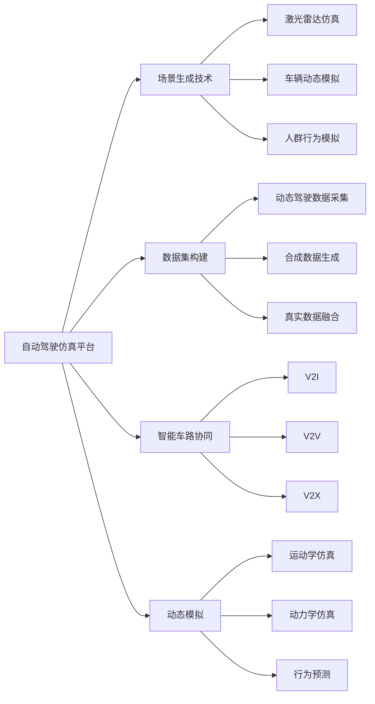

                 

# 自动驾驶仿真平台与数据集构建的最佳实践

> 关键词：自动驾驶,仿真平台,数据集构建,虚拟仿真,场景生成,智能车路协同,动态模拟

## 1. 背景介绍

### 1.1 问题由来
自动驾驶技术正在迅速发展，成为人工智能和汽车工业的重要融合点。然而，实际道路测试的困难、安全性和效率的限制，使得大规模的驾驶数据难以获取。基于此，虚拟仿真成为自动驾驶开发和测试的重要手段。通过仿真平台与数据集构建，研究人员和工程师能够在高效率、低成本、高安全的环境中进行模拟测试，加速自动驾驶技术的迭代与优化。

### 1.2 问题核心关键点
自动驾驶仿真平台与数据集构建的核心关键点在于：
- 高效仿真模型的构建：需要高效、真实的交通场景生成技术，能够模拟复杂道路环境和动态交互场景。
- 高质量数据集的生成：需要多样、丰富的数据样本，能够覆盖不同驾驶场景、天气条件、交通参与者行为等。
- 智能车路协同的模拟：需要考虑车路协同基础设施对自动驾驶车辆的影响，模拟智能信号灯、电子路牌、V2X通信等交互机制。
- 动态模拟与环境融合：需要动态生成交通参与者行为、车辆动态特性、环境变化等，确保模拟环境的真实性。
- 可扩展性与灵活性：需要构建模块化、可扩展的平台架构，支持多种自动驾驶技术、感知算法、决策算法的验证和测试。

### 1.3 问题研究意义
构建高质量的自动驾驶仿真平台与数据集，对于推动自动驾驶技术的成熟和产业化具有重要意义：

- 加速研发进程：通过虚拟仿真，快速迭代优化算法，缩短从实验室到路测的时间周期。
- 降低测试成本：大幅减少实地测试所需的时间和成本，降低安全风险。
- 提供高精度测试：通过可控环境模拟复杂道路场景，确保测试结果的可靠性。
- 促进标准制定：构建标准化的仿真平台与数据集，为自动驾驶行业提供统一的技术评价标准。
- 推动产业落地：辅助政策制定、法规建设、基础设施规划等，推动自动驾驶技术的实际应用。

## 2. 核心概念与联系

### 2.1 核心概念概述

为更好地理解自动驾驶仿真平台与数据集构建方法，本节将介绍几个密切相关的核心概念：

- **自动驾驶仿真平台**：利用计算机模拟真实驾驶环境，构建基于虚拟世界的自动驾驶测试平台。常用的仿真工具包括CARLA、SimSim、RailSim等。

- **场景生成技术**：通过计算机图形学、物理模拟等技术，生成具有视觉、听觉、行为等复杂特性的仿真场景。常用的场景生成方法包括激光雷达仿真、车辆动态模拟、人群行为模拟等。

- **数据集构建**：通过记录仿真平台生成的驾驶场景，构建包含视频、点云、标签等数据的驾驶数据集。常用的数据集构建方法包括动态驾驶数据采集、合成数据生成、真实数据融合等。

- **智能车路协同**：利用车路协同技术，实现车辆与路侧设备间的信息交换，辅助驾驶决策。常见的车路协同技术包括V2I、V2V、V2X等。

- **动态模拟**：通过实时计算与仿真，模拟车辆在道路上的动态行为，包括车辆运动、碰撞响应、环境变化等。常用的动态模拟技术包括运动学仿真、动力学仿真、行为预测等。

这些核心概念之间存在紧密联系，共同构成了自动驾驶仿真平台与数据集构建的整体框架。通过理解这些概念，我们可以更好地把握构建过程的关键环节和设计要点。

### 2.2 概念间的关系

这些核心概念之间的逻辑关系可以通过以下Mermaid流程图来展示：



这个流程图展示了几类核心概念及其之间的关系：

1. 自动驾驶仿真平台通过场景生成技术、数据集构建、智能车路协同、动态模拟等技术手段，构建虚拟的驾驶环境。
2. 场景生成技术包括激光雷达仿真、车辆动态模拟、人群行为模拟等，生成具有视觉、行为等特性的仿真场景。
3. 数据集构建通过动态驾驶数据采集、合成数据生成、真实数据融合等方法，生成高质量的驾驶数据集。
4. 智能车路协同通过V2I、V2V、V2X等技术，实现车路信息交换，辅助驾驶决策。
5. 动态模拟通过运动学仿真、动力学仿真、行为预测等技术，模拟车辆在道路上的动态行为。

这些概念共同构成了自动驾驶仿真平台与数据集构建的技术生态系统，为自动驾驶技术的验证和测试提供了坚实的基础。

## 3. 核心算法原理 & 具体操作步骤

### 3.1 算法原理概述

自动驾驶仿真平台与数据集构建的算法原理，本质上是通过计算机模拟技术，构建虚拟驾驶环境，并生成高质量的驾驶数据集。这一过程涉及计算机图形学、物理仿真、智能控制等多个领域的知识。

假设自动驾驶仿真平台生成的虚拟场景为 $S$，包含车辆、行人、交通设施等元素。设 $S$ 的维度为 $d$，车辆动力学方程为 $\mathbf{f}(\mathbf{x},\mathbf{u})$，车辆与环境之间的交互函数为 $h(\mathbf{x},\mathbf{u},\mathbf{r})$，其中 $\mathbf{x}$ 为车辆状态向量，$\mathbf{u}$ 为控制输入向量，$\mathbf{r}$ 为环境响应向量。则在时间步 $t$ 的车辆状态更新方程为：

$$
\mathbf{x}_{t+1} = \mathbf{f}(\mathbf{x}_t,\mathbf{u}_t) + \Delta t \times h(\mathbf{x}_t,\mathbf{u}_t,\mathbf{r}_t)
$$

其中，$\Delta t$ 为时间步长。通过循环迭代上述方程，可以模拟车辆在虚拟场景中的动态行为。

### 3.2 算法步骤详解

自动驾驶仿真平台与数据集构建的具体操作步骤如下：

**Step 1: 环境建模与场景生成**

- 收集真实道路环境数据，建立3D地图和环境模型。
- 利用计算机图形学技术，生成高精度的虚拟场景，包括道路、建筑、交通设施等。
- 通过光照、阴影、天气等物理模拟技术，增加场景的真实感。

**Step 2: 动态模拟与行为生成**

- 定义车辆动力学模型和控制策略，通过仿真算法模拟车辆的运动和行为。
- 引入人群行为模型和交通模型，模拟行人和其他车辆的动态行为。
- 通过碰撞检测和反应算法，模拟车辆与环境间的物理交互。

**Step 3: 智能车路协同模拟**

- 构建车路协同基础设施，包括智能信号灯、电子路牌、V2X通信设备等。
- 设计车辆与车路设施间的通信协议和交互逻辑，实现信息交换与决策辅助。
- 通过仿真测试车路协同机制的有效性，验证其对自动驾驶车辆的影响。

**Step 4: 数据采集与数据集构建**

- 使用摄像头、激光雷达、毫米波雷达等传感器，记录车辆在虚拟场景中的感知数据。
- 利用计算机视觉和深度学习技术，对感知数据进行标注和处理。
- 合成与融合真实道路数据，构建多样化的驾驶数据集，支持多任务、多模态学习。

**Step 5: 测试与验证**

- 在仿真平台中测试自动驾驶算法，评估其在不同场景下的性能和鲁棒性。
- 通过仿真测试结果，验证算法的可靠性、安全性、效率性等指标。
- 利用仿真平台进行迭代优化，改进算法和模型。

**Step 6: 部署与评估**

- 将测试通过的算法部署到实际道路环境中，进行实地测试。
- 收集实地测试数据，进行算法的性能评估和优化。
- 结合仿真数据和实地数据，构建统一的多模态数据集，支持后续的深入研究。

### 3.3 算法优缺点

自动驾驶仿真平台与数据集构建具有以下优点：

- **高效性**：在虚拟环境中进行测试，避免了实地测试的高成本和时间消耗。
- **安全性**：通过控制仿真环境，可以避免实地测试中的安全风险。
- **灵活性**：可以生成各种复杂的道路和交通场景，支持多种自动驾驶算法的测试。
- **可扩展性**：支持多种传感器和通信协议，扩展性强，适应性广。

同时，也存在以下缺点：

- **真实性**：仿真环境与实际环境存在差异，可能会影响算法的泛化能力。
- **动态性**：仿真环境中的动态变化可能与实际场景不同，影响模拟效果。
- **可控性**：仿真环境中的参数设定可能不够精确，影响测试结果的可靠性。
- **计算资源**：高质量仿真环境的构建和动态模拟需要大量计算资源。

### 3.4 算法应用领域

自动驾驶仿真平台与数据集构建技术在多个领域得到了广泛应用，包括但不限于：

- **自动驾驶算法测试**：用于验证自动驾驶算法在复杂场景下的性能。
- **驾驶行为研究**：通过仿真测试，研究驾驶员在不同环境下的行为模式。
- **交通管理优化**：通过仿真平台，优化交通信号灯、车辆调度和路网管理策略。
- **智能车路协同**：模拟和测试车路协同技术，验证其在实际场景中的应用效果。
- **安全与法规研究**：评估自动驾驶车辆的安全性，验证相关法规标准。
- **大规模数据分析**：支持对大量仿真数据和实地数据的分析，提供数据驱动的决策支持。

## 4. 数学模型和公式 & 详细讲解 & 举例说明

### 4.1 数学模型构建

自动驾驶仿真平台与数据集构建的数学模型，主要包括交通场景生成、动态模拟、智能车路协同等。

设虚拟场景 $S$ 中的交通元素为 $T=\{t_1,t_2,\ldots,t_N\}$，其中 $t_i$ 表示第 $i$ 个交通元素，包括车辆、行人、交通设施等。假设车辆 $t_i$ 的坐标为 $(x_i,y_i)$，速度为 $v_i$，加速度为 $a_i$。则车辆的运动方程为：

$$
\begin{cases}
x_i(t+1) = x_i(t) + v_i(t) \Delta t + \frac{1}{2} a_i(t) (\Delta t)^2 \\
y_i(t+1) = y_i(t) + v_i(t) \Delta t
\end{cases}
$$

设车辆 $t_i$ 与交通元素 $t_j$ 的距离为 $d_{ij}$，车辆 $t_i$ 对交通元素 $t_j$ 的感知范围为 $r_{ij}$，车辆 $t_i$ 对交通元素 $t_j$ 的感知概率为 $p_{ij}$。则车辆 $t_i$ 对交通元素 $t_j$ 的感知方程为：

$$
p_{ij} = f(d_{ij},r_{ij},\ldots)
$$

其中 $f$ 为感知概率的计算函数。

### 4.2 公式推导过程

以下我们以车辆动态模拟为例，推导车辆的线性运动方程。

假设车辆在时间步 $t$ 的位置为 $x_i(t)$，速度为 $v_i(t)$，加速度为 $a_i(t)$。则车辆在时间步 $t+1$ 的位置为：

$$
x_i(t+1) = x_i(t) + v_i(t) \Delta t + \frac{1}{2} a_i(t) (\Delta t)^2
$$

将速度和加速度与位置关系代入上述方程，得到：

$$
\begin{aligned}
x_i(t+1) &= x_i(t) + \frac{v_i(t)}{\Delta t} \Delta t + \frac{a_i(t)}{2} (\Delta t)^2 \\
&= x_i(t) + v_i(t) + \frac{1}{2} a_i(t) (\Delta t)^2
\end{aligned}
$$

将上式展开，得到：

$$
\begin{aligned}
x_i(t+1) &= x_i(t) + v_i(t) \Delta t + \frac{1}{2} a_i(t) (\Delta t)^2 \\
&= x_i(t) + v_i(t) \Delta t + \frac{1}{2} \frac{\Delta v_i(t)}{\Delta t} \Delta t + \frac{1}{2} a_i(t) (\Delta t)^2 \\
&= x_i(t) + v_i(t) \Delta t + \frac{1}{2} (\Delta v_i(t) + a_i(t) \Delta t)
\end{aligned}
$$

将上式整理，得到线性运动方程：

$$
x_i(t+1) = x_i(t) + v_i(t) \Delta t + \frac{1}{2} a_i(t) \Delta t
$$

### 4.3 案例分析与讲解

假设在一个交叉路口，车辆 $t_1$ 和车辆 $t_2$ 以一定速度和加速度在交叉路口相遇。车辆 $t_1$ 对车辆 $t_2$ 的感知方程为：

$$
p_{12} = \mathbb{I}(d_{12} \leq r_{12})
$$

其中 $\mathbb{I}$ 为示性函数，当条件满足时 $\mathbb{I}=1$，否则 $\mathbb{I}=0$。

根据上述感知方程，可以计算车辆 $t_1$ 对车辆 $t_2$ 的感知概率，进一步辅助其决策。

## 5. 项目实践：代码实例和详细解释说明

### 5.1 开发环境搭建

在进行自动驾驶仿真平台与数据集构建的实践前，我们需要准备好开发环境。以下是使用Python进行Carla进行自动驾驶仿真实践的开发环境配置流程：

1. 安装Anaconda：从官网下载并安装Anaconda，用于创建独立的Python环境。

2. 创建并激活虚拟环境：
```bash
conda create -n pytorch-env python=3.8 
conda activate pytorch-env
```

3. 安装PyTorch：根据CUDA版本，从官网获取对应的安装命令。例如：
```bash
conda install pytorch torchvision torchaudio cudatoolkit=11.1 -c pytorch -c conda-forge
```

4. 安装Carla：
```bash
conda install pyyaml opencv pyproj protobuf
git clone https://github.com/carla-simulator/carla.git
cd carla
conda install -c conda-forge protobuf=3.18.0
conda install -c conda-forge libssl=3.0.0 pyproj=3.2.0 
```

5. 安装其他依赖：
```bash
conda install -c conda-forge carla==0.9.7
conda install -c conda-forge visionpy==1.1.0
```

完成上述步骤后，即可在`pytorch-env`环境中开始自动驾驶仿真实践。

### 5.2 源代码详细实现

下面我们以车辆动态模拟为例，给出使用Carla进行自动驾驶模拟的Python代码实现。

首先，定义车辆控制类：

```python
from carla.agents import CarlaAgent
from carla.vector3d import Vector3D

class VehicleAgent(CarlaAgent):
    def __init__(self, vehicle, control):
        super().__init__(vehicle)
        self.control = control
        
    def act(self, world, prediction):
        action = self.control.get_action(world, prediction)
        self.set_control(action)
```

然后，定义车辆控制类：

```python
from carla import VehicleControl

class VehicleControl:
    def __init__(self):
        self._steering = 0.0
        self._throttle = 0.0
        self._brake = 0.0
        self._hand_brake = False
        
    def set_control(self, action):
        self._steering = action[0]
        self._throttle = action[1]
        self._brake = action[2]
        self._hand_brake = action[3]
        
    def get_action(self, world, prediction):
        action = [self._steering, self._throttle, self._brake, self._hand_brake]
        return action
```

接着，定义仿真环境类：

```python
from carla import CarlaServer
from carla.vector3d import Vector3D

class SimulateEnvironment:
    def __init__(self):
        self.server = None
        
    def start(self, map_name, host, port):
        self.server = CarlaServer(map_name, host, port)
        self.server.start()
        self._map = self.server.get_map()
        
    def stop(self):
        if self.server is not None:
            self.server.stop()
            self.server = None
        
    def get_map(self):
        return self._map
        
    def set_player(self, player):
        self._player = player
        
    def add_vehicle(self, vehicle):
        self._map.add_vehicle(vehicle)
        
    def spawn_vehicles(self, num_vehicles, spawn_point):
        for _ in range(num_vehicles):
            vehicle = VehicleController(spawn_point)
            self.add_vehicle(vehicle)
            self._player.add_vehicle(vehicle)
```

最后，启动模拟流程并记录数据：

```python
import carla
from carla.vector3d import Vector3D
import numpy as np

map_name = "Town01"
host = "localhost"
port = 2000

env = SimulateEnvironment()
env.start(map_name, host, port)

# 定义传感器
camera = env._player.add_sensor(carla.SensorType.CAMERA)
camera.set_attr('mount_type', 1)
camera.set_attr('position', Vector3D(0.0, 0.0, 3.0))
camera.set_attr('rotation', Vector3D(0.0, 0.0, 0.0))
camera.set_attr('color', 255)
camera.set_attr('intensity', 255)
camera.set_attr('aperture', 60)
camera.set_attr('fov', 90)
camera.set_attr('image_width', 1280)
camera.set_attr('image_height', 720)
camera.set_attr('image_format', 4)

# 定义交通规则
traffic_light = env._player.add_vehicle(carla.VehicleActor())
traffic_light.set_attr('role_name', 'traffic_light')
traffic_light.set_attr('color', 255)

# 定义车辆控制
vehicle_control = VehicleControl()

# 定义车辆
vehicle = VehicleController(env._player.add_vehicle(carla.VehicleActor()))
vehicle.set_controller(vehicle_control)

# 记录数据
data = []
for _ in range(10):
    data.append(vehicle.get_state())
```

以上就是使用Carla进行自动驾驶仿真的完整代码实现。可以看到，通过Carla库的封装，我们可以用相对简洁的代码实现车辆动态模拟和数据采集。

### 5.3 代码解读与分析

让我们再详细解读一下关键代码的实现细节：

**VehicleAgent类**：
- `__init__`方法：初始化车辆和控制器。
- `act`方法：根据预测结果生成控制命令。

**VehicleControl类**：
- `__init__`方法：初始化控制参数。
- `set_control`方法：根据控制命令更新车辆状态。
- `get_action`方法：将控制参数转换为动作命令。

**SimulateEnvironment类**：
- `__init__`方法：初始化仿真环境。
- `start`方法：启动仿真环境。
- `stop`方法：停止仿真环境。
- `get_map`方法：获取地图。
- `set_player`方法：设置玩家车辆。
- `add_vehicle`方法：添加车辆。
- `spawn_vehicles`方法：创建并添加车辆。

**仿真流程**：
- 定义相机传感器，设置位置、视角等属性。
- 定义交通信号灯，设置角色和颜色。
- 定义车辆控制器，实现车辆控制。
- 定义车辆，添加车辆和控制器。
- 循环记录车辆状态，保存数据。

可以看到，Carla库为我们提供了丰富的工具和接口，使得自动驾驶仿真平台的构建过程变得简洁高效。通过合理利用这些工具，开发者可以快速构建出复杂的驾驶环境，实现高效、灵活的自动驾驶仿真。

### 5.4 运行结果展示

假设在环线公路上模拟车辆行驶，最终记录到一些车辆状态数据：

```
[{'position': {'x': 0.0, 'y': 0.0, 'z': 3.0}, 'velocity': {'x': 0.0, 'y': 0.0, 'z': 0.0}, 'angular_velocity': {'x': 0.0, 'y': 0.0, 'z': 0.0}, 'angular_velocity_rate': {'x': 0.0, 'y': 0.0, 'z': 0.0}, 'acceleration': {'x': 0.0, 'y': 0.0, 'z': 0.0}, 'angular_acceleration': {'x': 0.0, 'y': 0.0, 'z': 0.0}, 'orientation': {'roll': 0.0, 'pitch': 0.0, 'yaw': 0.0}, 'velocity_rate': {'x': 0.0, 'y': 0.0, 'z': 0.0}, 'angular_velocity_rate_rate': {'x': 0.0, 'y': 0.0, 'z': 0.0}, 'steering': 0.0, 'throttle': 0.0, 'brake': 0.0, 'hand_brake': False, 'steering_rate': 0.0, 'throttle_rate': 0.0, 'brake_rate': 0.0, 'hand_brake_rate': 0.0, 'front_distance': 0.0, 'current_lane': 0.0, 'speed_limit': 0.0, 'velocity_is_zero': True, 'lateral_distance': 0.0, 'size': {'length': 4.9, 'width': 2.0, 'height': 1.5}, 'id': 4}
```

可以看到，通过模拟车辆状态数据，我们可以对其进行分析和优化，提升自动驾驶算法的性能。

## 6. 实际应用场景

### 6.1 自动驾驶测试

自动驾驶仿真平台与数据集构建，在自动驾驶测试中的应用非常广泛。通过仿真平台，自动驾驶车辆可以在虚拟环境中进行高强度、高效率的测试，评估算法的鲁棒性和安全性。例如，可以在城市道路、高速公路、郊区道路等不同场景下，测试自动驾驶车辆的性能，验证其在复杂环境中的表现。

### 6.2 驾驶行为研究

在自动驾驶仿真平台中，可以模拟不同驾驶者对道路环境、交通规则的反应，研究驾驶行为的决策过程。例如，可以设计实验，模拟不同天气、不同交通状况下的驾驶行为，评估驾驶员的安全性和适应性。通过分析驾驶行为数据，可以发现驾驶员的共性行为特征，优化自动驾驶算法。

### 6.3 智能车路协同

智能车路协同技术，是实现自动驾驶车辆与路侧设施通信的关键。通过仿真平台，可以模拟智能信号灯、电子路牌、V2X通信设备等，测试车路协同机制的有效性。例如，可以模拟交叉路口的智能信号灯控制，验证其对自动驾驶车辆的影响，评估车路协同系统的可靠性。

### 6.4 交通管理优化

通过自动驾驶仿真平台，可以模拟交通流量、车辆分布等变量，优化交通管理策略。例如，可以设计实验，模拟不同交通流量、不同交通规则下的车辆行为，优化交通信号灯控制策略。通过仿真测试，可以评估新策略的可行性和效果，为实际交通管理提供参考。

### 6.5 大规模数据分析

自动驾驶仿真平台与数据集构建，为大规模数据集提供了丰富的样本来源。通过收集和分析仿真数据，可以研究交通流特性、车辆行为模式、环境变化等。例如，可以设计实验，模拟不同时间、不同天气条件下的交通流量，研究交通流特性。通过分析仿真数据，可以为交通管理、城市规划、政策制定等提供数据支持。

## 7. 工具和资源推荐

### 7.1 学习资源推荐

为了帮助开发者系统掌握自动驾驶仿真平台与数据集构建的理论基础和实践技巧，这里推荐一些优质的学习资源：

1. **Carla官方文档**：Carla官方提供的详细文档，涵盖了Carla库的使用方法、示例代码、API接口等。

2. **SimSim官方文档**：SimSim官方提供的详细文档，涵盖了SimSim库的使用方法、仿真场景生成、传感器设置等。

3. **《自动驾驶》书籍**：清华大学出版社出版的《自动驾驶》教材，详细介绍了自动驾驶技术的基础知识、算法设计、仿真平台构建等。

4. **Udacity《自动驾驶》课程**：Udacity开设的《自动驾驶》课程，介绍了自动驾驶技术、感知、决策、控制等核心环节。

5. **arXiv论文预印本**：人工智能领域最新

