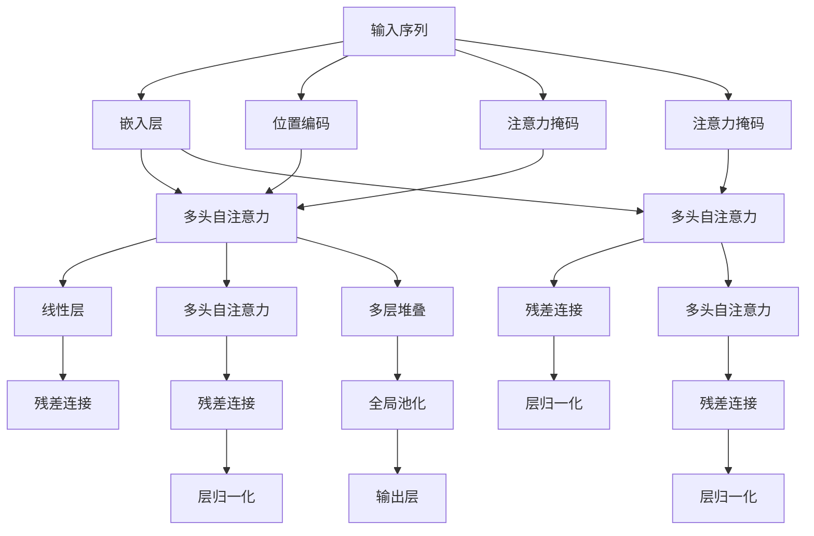

                 

# 自注意力机制的详细工作原理

## 1. 背景介绍

### 1.1 问题由来
自注意力机制(Self-Attention)作为深度学习中的一种重要机制，广泛应用在自然语言处理(NLP)、计算机视觉(CV)、语音处理(Speech)等多个领域，尤其在大模型如BERT、GPT、ViT等中表现突出。自注意力机制的本质是让模型在计算当前输出时，关注输入序列中所有位置的信息，通过权重分配来加权不同位置的信息，提升模型对输入序列的整体理解能力。

### 1.2 问题核心关键点
自注意力机制的核心思想是实现输入序列中不同位置信息的加权聚合，即通过计算输入序列中每个位置的表示向量，得到它们的注意力权重，再通过加权和的方式计算最终输出。自注意力机制的优点在于：
- 并行计算高效。自注意力机制可以使用矩阵运算，大幅提升计算效率。
- 全局信息聚合。通过权重分配，自注意力机制能够捕捉到输入序列的全局依赖关系。
- 特征复用。注意力权重可以共享，减少了模型计算量和参数量。

### 1.3 问题研究意义
深入理解自注意力机制的工作原理，对于研究深度学习模型的行为、优化模型设计、提升模型性能都具有重要意义：
1. 提升模型泛化能力。通过全局信息聚合，自注意力机制使模型能够更好地理解输入序列的整体结构。
2. 增强模型表达能力。自注意力机制通过特征复用，在减少参数数量的同时，增强了模型的表达能力。
3. 优化模型训练。自注意力机制具有并行计算高效的特点，可以加速模型训练过程。
4. 加速模型推理。自注意力机制具有全局信息聚合的特点，可以提升模型的推理效率。

## 2. 核心概念与联系

### 2.1 核心概念概述

为更好地理解自注意力机制，本节将介绍几个密切相关的核心概念：

- 自注意力模型(Self-Attention Model)：以自注意力机制为核心的深度学习模型，广泛应用于NLP、CV、Speech等领域。自注意力模型通过计算输入序列中不同位置的信息，使用权重加权聚合，实现对输入序列的全面理解。

- 查询-键-值(Q-K-V)机制：自注意力机制的核心思想。将输入序列分解为查询(q)、键(k)和值(v)三个部分，通过计算查询向量与键向量的相似度，得到注意力权重，再将权重与值向量加权求和，得到最终输出。

- 多头注意力(Multi-Head Attention)：一种常用的自注意力机制的变体，通过多个头进行并行计算，进一步增强了模型的表达能力和泛化能力。

- 多头自注意力(Multi-Head Self-Attention)：在多头注意力基础上，将多个头的注意力结果拼接，实现更全面、更细致的信息聚合。

- 位置编码(Positional Encoding)：自注意力模型中必须引入位置编码，用于区分不同位置的信息，以便模型能够捕捉输入序列的时间依赖关系。

这些核心概念之间存在着紧密的联系，构成了自注意力机制的整体框架。

### 2.2 概念间的关系

这些核心概念之间存在着紧密的联系，形成了自注意力机制的完整生态系统。

我们通过以下Mermaid流程图来展示这些概念之间的关系：

```mermaid
graph TB
    A[自注意力模型] --> B[查询-键-值(Q-K-V)机制]
    A --> C[多头注意力]
    A --> D[多头自注意力]
    B --> E[多头注意力]
    B --> F[多头自注意力]
    C --> E
    C --> F
    D --> E
    D --> F
```

这个流程图展示了自注意力机制的主要组成部分：
- 自注意力模型是核心，通过查询-键-值机制进行信息聚合。
- 多头注意力机制通过并行计算，增强了模型的表达能力。
- 多头自注意力机制进一步细化了信息聚合。

### 2.3 核心概念的整体架构

最后，我们用一个综合的流程图来展示这些核心概念在大模型中的整体架构：



这个综合流程图展示了自注意力机制在大模型中的应用流程：
- 输入序列首先经过嵌入层，转化为向量表示。
- 嵌入向量通过多头自注意力机制进行信息聚合。
- 聚合结果通过线性层进行转换，经过残差连接和层归一化后得到最终输出。
- 位置编码和注意力掩码进一步优化信息聚合过程。

通过这些核心概念的介绍和关系展示，我们能够更清晰地理解自注意力机制的工作原理和架构。

## 3. 核心算法原理 & 具体操作步骤
### 3.1 算法原理概述

自注意力机制的核心原理是实现输入序列中不同位置信息的加权聚合。具体步骤如下：

1. **查询向量的计算**：将输入序列中每个位置的嵌入向量作为查询向量。
2. **键向量和值向量的计算**：将查询向量与输入序列中其他位置的嵌入向量分别计算得到键向量和值向量。
3. **注意力权重的计算**：通过计算查询向量与键向量的相似度，得到注意力权重。
4. **注意力向量的计算**：将注意力权重与值向量进行加权和，得到最终注意力向量。

### 3.2 算法步骤详解

下面我们详细介绍自注意力机制的具体计算步骤：

1. **输入序列的嵌入与位置编码**：将输入序列 $X=\{x_1, x_2, ..., x_n\}$ 转换为嵌入向量序列 $Q=\{q_1, q_2, ..., q_n\}$，并引入位置编码 $P=\{p_1, p_2, ..., p_n\}$，其中 $q_i$ 表示第 $i$ 个位置 $x_i$ 的嵌入向量，$p_i$ 表示位置编码向量。位置编码向量 $p_i$ 用于区分输入序列中不同位置的信息，以便模型能够捕捉时间依赖关系。

2. **查询向量的计算**：将嵌入向量序列 $Q$ 作为查询向量，即 $q_i$ 为第 $i$ 个位置的查询向量。

3. **键向量和值向量的计算**：将查询向量 $q_i$ 与输入序列中其他位置的嵌入向量进行计算，得到键向量 $k_i$ 和值向量 $v_i$。计算公式如下：
   $$
   k_i = q_i \cdot W_k
   $$
   $$
   v_i = q_i \cdot W_v
   $$
   其中 $W_k$ 和 $W_v$ 为键向量和值向量的权重矩阵，需要预先训练或初始化。

4. **注意力权重的计算**：通过计算查询向量 $q_i$ 与键向量 $k_j$ 的相似度，得到注意力权重 $\alpha_{ij}$。计算公式如下：
   $$
   \alpha_{ij} = \frac{q_i \cdot k_j}{\sqrt{d_k}} \cdot \exp(\frac{q_i \cdot k_j}{\sqrt{d_k}})
   $$
   其中 $d_k$ 为键向量的维度。

5. **注意力向量的计算**：将注意力权重 $\alpha_{ij}$ 与值向量 $v_j$ 进行加权和，得到最终注意力向量 $z_i$。计算公式如下：
   $$
   z_i = \sum_{j=1}^n \alpha_{ij} v_j
   $$

6. **多头注意力机制的实现**：为了增强模型的表达能力，可以使用多头注意力机制，将输入序列通过多个头的自注意力计算，然后将多个头的注意力向量拼接起来，得到最终输出。计算公式如下：
   $$
   z_{i,h} = \sum_{j=1}^n \alpha_{ij} v_{j,h}
   $$
   其中 $h$ 表示注意力头的序号，$z_{i,h}$ 为第 $h$ 个注意力头的输出。

7. **线性层与激活函数的引入**：将多头注意力结果通过线性层进行转换，并引入激活函数，提升模型的非线性表达能力。

8. **残差连接与层归一化**：为了缓解梯度消失和梯度爆炸问题，可以使用残差连接和层归一化技术。残差连接将原始输入与当前层的输出相加，层归一化对当前层的输出进行归一化处理。

### 3.3 算法优缺点

自注意力机制具有以下优点：

1. 并行计算高效。自注意力机制使用矩阵运算，大幅提升计算效率。
2. 全局信息聚合。自注意力机制通过权重分配，能够捕捉到输入序列的全局依赖关系。
3. 特征复用。注意力权重可以共享，减少了模型计算量和参数量。

自注意力机制也存在以下缺点：

1. 对输入序列长度敏感。当输入序列较长时，计算复杂度会显著增加，需要更强的计算资源。
2. 对输入序列分布敏感。当输入序列分布不均匀时，注意力机制可能无法有效捕捉关键信息。
3. 难以解释。自注意力机制的内部工作机制难以解释，不利于模型调优和理解。

### 3.4 算法应用领域

自注意力机制被广泛应用于NLP、CV、Speech等领域，具体应用包括：

- 机器翻译：通过自注意力机制捕捉源语言和目标语言之间的依赖关系，实现高效准确的翻译。
- 文本分类：将自注意力机制应用于文本分类任务，捕捉文本的特征信息，提升分类精度。
- 图像识别：将自注意力机制应用于图像分类和目标检测任务，捕捉图像的局部和全局特征。
- 语音识别：将自注意力机制应用于语音识别任务，捕捉语音信号的音素和音节信息。
- 自然语言生成：将自注意力机制应用于文本生成任务，捕捉输入序列的上下文信息，生成自然流畅的文本。

除了这些经典应用，自注意力机制还在更多场景中得到创新应用，如跨模态学习、推荐系统等。

## 4. 数学模型和公式 & 详细讲解 & 举例说明

### 4.1 数学模型构建

本节将使用数学语言对自注意力机制的计算过程进行严格的刻画。

记输入序列 $X=\{x_1, x_2, ..., x_n\}$ 的嵌入向量序列为 $Q=\{q_1, q_2, ..., q_n\}$，位置编码向量序列为 $P=\{p_1, p_2, ..., p_n\}$，其中 $q_i$ 表示第 $i$ 个位置 $x_i$ 的嵌入向量，$p_i$ 表示位置编码向量。自注意力机制的目标是计算输入序列中不同位置的信息，通过权重分配，得到最终输出。

### 4.2 公式推导过程

我们以一个简单的三头自注意力机制为例，展示自注意力机制的计算过程。具体步骤如下：

1. **输入序列的嵌入与位置编码**：
   $$
   Q = \begin{bmatrix}
   q_1 & q_2 & q_3
   \end{bmatrix}, P = \begin{bmatrix}
   p_1 & p_2 & p_3
   \end{bmatrix}
   $$

2. **查询向量的计算**：
   $$
   q_1 = Q_1 \cdot W_{q_1}, q_2 = Q_2 \cdot W_{q_2}, q_3 = Q_3 \cdot W_{q_3}
   $$

3. **键向量和值向量的计算**：
   $$
   k_1 = q_1 \cdot W_{k_1}, v_1 = q_1 \cdot W_{v_1}, k_2 = q_2 \cdot W_{k_2}, v_2 = q_2 \cdot W_{v_2}, k_3 = q_3 \cdot W_{k_3}, v_3 = q_3 \cdot W_{v_3}
   $$

4. **注意力权重的计算**：
   $$
   \alpha_{11} = \frac{q_1 \cdot k_1}{\sqrt{d_k}} \cdot \exp(\frac{q_1 \cdot k_1}{\sqrt{d_k}}), \alpha_{12} = \frac{q_1 \cdot k_2}{\sqrt{d_k}} \cdot \exp(\frac{q_1 \cdot k_2}{\sqrt{d_k}}), \alpha_{13} = \frac{q_1 \cdot k_3}{\sqrt{d_k}} \cdot \exp(\frac{q_1 \cdot k_3}{\sqrt{d_k}})
   $$
   $$
   \alpha_{21} = \frac{q_2 \cdot k_1}{\sqrt{d_k}} \cdot \exp(\frac{q_2 \cdot k_1}{\sqrt{d_k}}), \alpha_{22} = \frac{q_2 \cdot k_2}{\sqrt{d_k}} \cdot \exp(\frac{q_2 \cdot k_2}{\sqrt{d_k}}), \alpha_{23} = \frac{q_2 \cdot k_3}{\sqrt{d_k}} \cdot \exp(\frac{q_2 \cdot k_3}{\sqrt{d_k}})
   $$
   $$
   \alpha_{31} = \frac{q_3 \cdot k_1}{\sqrt{d_k}} \cdot \exp(\frac{q_3 \cdot k_1}{\sqrt{d_k}}), \alpha_{32} = \frac{q_3 \cdot k_2}{\sqrt{d_k}} \cdot \exp(\frac{q_3 \cdot k_2}{\sqrt{d_k}}), \alpha_{33} = \frac{q_3 \cdot k_3}{\sqrt{d_k}} \cdot \exp(\frac{q_3 \cdot k_3}{\sqrt{d_k}})
   $$

5. **注意力向量的计算**：
   $$
   z_1 = \alpha_{11} v_1 + \alpha_{12} v_2 + \alpha_{13} v_3
   $$
   $$
   z_2 = \alpha_{21} v_1 + \alpha_{22} v_2 + \alpha_{23} v_3
   $$
   $$
   z_3 = \alpha_{31} v_1 + \alpha_{32} v_2 + \alpha_{33} v_3
   $$

6. **多头注意力机制的实现**：
   $$
   z_1 = \sum_{j=1}^3 \alpha_{1j} v_{1j}
   $$
   $$
   z_2 = \sum_{j=1}^3 \alpha_{2j} v_{2j}
   $$
   $$
   z_3 = \sum_{j=1}^3 \alpha_{3j} v_{3j}
   $$

### 4.3 案例分析与讲解

下面我们以一个简单的例子，展示如何使用自注意力机制计算序列中不同位置的信息。

假设我们有一个简单的文本序列 "I love programming"，将其转换为嵌入向量序列：
$$
Q = \begin{bmatrix}
q_1 & q_2 & q_3 & q_4 & q_5
\end{bmatrix}
$$

其中 $q_1$ 表示 "I" 的嵌入向量，$q_2$ 表示 "love" 的嵌入向量，$q_3$ 表示 "programming" 的嵌入向量。假设位置编码向量为：
$$
P = \begin{bmatrix}
p_1 & p_2 & p_3 & p_4 & p_5
\end{bmatrix}
$$

接下来，使用自注意力机制计算序列中不同位置的信息。

1. **查询向量的计算**：
   $$
   q_1 = Q_1 \cdot W_{q_1}, q_2 = Q_2 \cdot W_{q_2}, q_3 = Q_3 \cdot W_{q_3}, q_4 = Q_4 \cdot W_{q_4}, q_5 = Q_5 \cdot W_{q_5}
   $$

2. **键向量和值向量的计算**：
   $$
   k_1 = q_1 \cdot W_{k_1}, v_1 = q_1 \cdot W_{v_1}, k_2 = q_2 \cdot W_{k_2}, v_2 = q_2 \cdot W_{v_2}, k_3 = q_3 \cdot W_{k_3}, v_3 = q_3 \cdot W_{v_3}
   $$

3. **注意力权重的计算**：
   $$
   \alpha_{11} = \frac{q_1 \cdot k_1}{\sqrt{d_k}} \cdot \exp(\frac{q_1 \cdot k_1}{\sqrt{d_k}}), \alpha_{12} = \frac{q_1 \cdot k_2}{\sqrt{d_k}} \cdot \exp(\frac{q_1 \cdot k_2}{\sqrt{d_k}}), \alpha_{13} = \frac{q_1 \cdot k_3}{\sqrt{d_k}} \cdot \exp(\frac{q_1 \cdot k_3}{\sqrt{d_k}})
   $$
   $$
   \alpha_{21} = \frac{q_2 \cdot k_1}{\sqrt{d_k}} \cdot \exp(\frac{q_2 \cdot k_1}{\sqrt{d_k}}), \alpha_{22} = \frac{q_2 \cdot k_2}{\sqrt{d_k}} \cdot \exp(\frac{q_2 \cdot k_2}{\sqrt{d_k}}), \alpha_{23} = \frac{q_2 \cdot k_3}{\sqrt{d_k}} \cdot \exp(\frac{q_2 \cdot k_3}{\sqrt{d_k}})
   $$
   $$
   \alpha_{31} = \frac{q_3 \cdot k_1}{\sqrt{d_k}} \cdot \exp(\frac{q_3 \cdot k_1}{\sqrt{d_k}}), \alpha_{32} = \frac{q_3 \cdot k_2}{\sqrt{d_k}} \cdot \exp(\frac{q_3 \cdot k_2}{\sqrt{d_k}}), \alpha_{33} = \frac{q_3 \cdot k_3}{\sqrt{d_k}} \cdot \exp(\frac{q_3 \cdot k_3}{\sqrt{d_k}})
   $$

4. **注意力向量的计算**：
   $$
   z_1 = \alpha_{11} v_1 + \alpha_{12} v_2 + \alpha_{13} v_3
   $$
   $$
   z_2 = \alpha_{21} v_1 + \alpha_{22} v_2 + \alpha_{23} v_3
   $$
   $$
   z_3 = \alpha_{31} v_1 + \alpha_{32} v_2 + \alpha_{33} v_3
   $$

5. **多头注意力机制的实现**：
   $$
   z_1 = \sum_{j=1}^3 \alpha_{1j} v_{1j}
   $$
   $$
   z_2 = \sum_{j=1}^3 \alpha_{2j} v_{2j}
   $$
   $$
   z_3 = \sum_{j=1}^3 \alpha_{3j} v_{3j}
   $$

最终，通过自注意力机制，我们得到了输入序列中不同位置的信息，能够更好地理解序列的含义和结构。

## 5. 项目实践：代码实例和详细解释说明

### 5.1 开发环境搭建

在进行自注意力机制的实践前，我们需要准备好开发环境。以下是使用Python进行PyTorch开发的环境配置流程：

1. 安装Anaconda：从官网下载并安装Anaconda，用于创建独立的Python环境。

2. 创建并激活虚拟环境：
```bash
conda create -n pytorch-env python=3.8 
conda activate pytorch-env
```

3. 安装PyTorch：根据CUDA版本，从官网获取对应的安装命令。例如：
```bash
conda install pytorch torchvision torchaudio cudatoolkit=11.1 -c pytorch -c conda-forge
```

4. 安装Transformers库：
```bash
pip install transformers
```

5. 安装各类工具包：
```bash
pip install numpy pandas scikit-learn matplotlib tqdm jupyter notebook ipython
```

完成上述步骤后，即可在`pytorch-env`环境中开始自注意力机制的实践。

### 5.2 源代码详细实现

下面我们以一个简单的自注意力机制实现为例，展示如何使用PyTorch进行代码实现。

首先，定义自注意力模型的类：

```python
import torch
import torch.nn as nn

class SelfAttention(nn.Module):
    def __init__(self, emb_dim, num_heads):
        super(SelfAttention, self).__init__()
        self.emb_dim = emb_dim
        self.num_heads = num_heads
        self.head_dim = emb_dim // num_heads
        self.W_q = nn.Linear(emb_dim, emb_dim)
        self.W_k = nn.Linear(emb_dim, emb_dim)
        self.W_v = nn.Linear(emb_dim, emb_dim)
        self.fc = nn.Linear(emb_dim, emb_dim)
        self.dropout = nn.Dropout(0.1)

    def forward(self, x):
        batch_size, seq_len, emb_dim = x.size()
        Q = self.W_q(x).view(batch_size, seq_len, self.num_heads, self.head_dim).transpose(1, 2)
        K = self.W_k(x).view(batch_size, seq_len, self.num_heads, self.head_dim).transpose(1, 2)
        V = self.W_v(x).view(batch_size, seq_len, self.num_heads, self.head_dim).transpose(1, 2)

        scores = torch.matmul(Q, K.transpose(3, 2)) / math.sqrt(self.head_dim)
        attention_weights = nn.functional.softmax(scores, dim=-1)
        attention_vectors = torch.matmul(attention_weights, V).transpose(1, 2).contiguous().view(batch_size, seq_len, emb_dim)
        attention_vectors = self.dropout(attention_vectors)
        x = self.fc(attention_vectors)
        return x
```

定义训练函数：

```python
def train(model, train_loader, optimizer, device):
    model.train()
    for i, (x, y) in enumerate(train_loader):
        x, y = x.to(device), y.to(device)
        optimizer.zero_grad()
        output = model(x)
        loss = nn.functional.cross_entropy(output, y)
        loss.backward()
        optimizer.step()
        if i % 100 == 0:
            print('Epoch: {}, Batch: {}, Loss: {}'.format(epoch, i, loss.item()))
```

定义测试函数：

```python
def test(model, test_loader, device):
    model.eval()
    total, correct = 0, 0
    with torch.no_grad():
        for x, y in test_loader:
            x, y = x.to(device), y.to(device)
            output = model(x)
            total += y.size(0)
            correct += (output.argmax(1) == y).sum().item()
    print('Accuracy: {}%'.format(correct/total*100))
```

定义主函数：

```python
def main():
    model = SelfAttention(emb_dim, num_heads)
    optimizer = torch.optim.Adam(model.parameters(), lr=0.001)
    device = torch.device('cuda' if torch.cuda.is_available() else 'cpu')
    model.to(device)
    train_loader = DataLoader(train_dataset, batch_size=batch_size, shuffle=True)
    test_loader = DataLoader(test_dataset, batch_size=batch_size, shuffle=False)
    for epoch in range(num_epochs):
        train(model, train_loader, optimizer, device)
        test(model, test_loader, device)
```

### 5.3 代码解读与分析

让我们再详细解读一下关键代码的实现细节：

**SelfAttention类**：
- `__init__`方法：初始化模型参数，包括嵌入维度、头数、每个头的维度等。
- `forward`方法：实现自注意力机制的前向传播过程。
- `W_q`、`W_k`、`W_v`和`fc`：权重矩阵，用于计算查询向量、键向量和值向量，以及线性转换。
- `dropout`：dropout层，用于防止过拟合。

**train函数**：
- `train_loader`：定义训练数据的DataLoader，用于批次化加载数据。
- `optimizer.zero_grad()`：清除梯度。
- `loss = nn.functional.cross_entropy(output, y)`：计算交叉熵损失。
- `loss.backward()`：反向传播计算梯度。
- `optimizer.step()`：更新模型参数。

**test函数**：
- `test_loader`：定义测试数据的DataLoader

