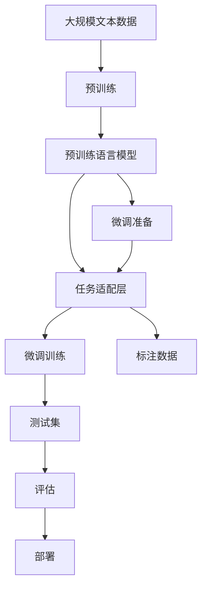

                 

# 自然语言处理 (Natural Language Processing)

> 关键词：自然语言处理, 机器学习, 深度学习, 文本分析, 语音识别, 语言生成, 翻译, 情感分析, 语义理解

## 1. 背景介绍

### 1.1 问题由来

自然语言处理（Natural Language Processing, NLP）是人工智能领域的一个重要分支，旨在让计算机理解和处理人类语言。NLP技术在信息检索、机器翻译、文本分类、情感分析、语音识别等诸多领域都有广泛应用，极大地提升了信息处理和交互的智能化水平。

近年来，随着深度学习技术的快速发展，NLP领域取得了显著进展。例如，基于神经网络的语言模型在各种NLP任务上取得了超越传统方法的优异效果。特别是Transformer架构的提出，使得NLP模型的训练速度和性能都得到了质的提升，推动了预训练大语言模型(Large Language Model, LLM)的发展。LLM如GPT-3、BERT、T5等，具备强大的语言理解和生成能力，已经成为NLP领域的重要工具。

尽管如此，预训练大语言模型也存在一定的局限性。例如，它们通常依赖于大规模的通用语料进行预训练，对特定领域的语言理解能力有限。此外，由于参数量巨大，模型的训练和推理成本也相对较高。因此，针对特定领域的自然语言处理任务，还需要进行微调(Fine-tuning)，即在预训练模型上进行有监督的二次训练，以提高模型在该任务上的性能。

本文将深入探讨基于监督学习的自然语言处理微调方法，重点介绍其原理、操作步骤、优缺点及应用领域，并通过具体案例展示微调的实现过程。

## 2. 核心概念与联系

### 2.1 核心概念概述

自然语言处理微调的核心概念包括：

- 预训练语言模型（Pre-trained Language Model, PLM）：通过大规模无标签文本数据进行预训练，学习语言的通用表示。常见的PLM包括BERT、GPT等。
- 微调（Fine-tuning）：在有标签的特定领域数据上，对预训练模型进行二次训练，以提升模型在该任务上的性能。
- 监督学习（Supervised Learning）：使用标注数据进行模型训练，使其能够预测正确的输出。

这三个概念构成了自然语言处理微调的基础。

### 2.2 概念间的关系

自然语言处理微调过程可以分为以下几个阶段：

1. 预训练：在大规模无标签文本数据上训练预训练语言模型，学习通用的语言表示。
2. 微调准备：收集特定领域的标注数据，设计任务适配层。
3. 微调训练：在有标签的数据上对预训练模型进行二次训练。
4. 评估和部署：在测试集上评估微调后模型的性能，并将其部署到实际应用中。

预训练和微调是NLP技术中的两个重要步骤，预训练提供了通用的语言表示，微调则针对特定任务进行优化。监督学习是微调的基础，通过标注数据训练模型，使其能够进行预测和推理。

### 2.3 核心概念的整体架构

自然语言处理微调的整体架构可以如下表示：



这个架构展示了预训练、微调准备、微调训练、评估和部署的流程，强调了预训练和微调在自然语言处理中的核心地位。

## 3. 核心算法原理 & 具体操作步骤

### 3.1 算法原理概述

自然语言处理微调的本质是对预训练语言模型进行二次训练，以适应特定的自然语言处理任务。其核心思想是通过有监督学习，利用标注数据调整模型参数，使其能够在特定任务上取得更好的性能。

微调的数学原理可以概括为：

1. 假设有一个预训练语言模型 $M_{\theta}$，其中 $\theta$ 为预训练得到的参数。
2. 假设有一个特定领域的标注数据集 $D=\{(x_i, y_i)\}_{i=1}^N$，其中 $x_i$ 为输入文本，$y_i$ 为标注。
3. 定义损失函数 $L$，衡量模型在特定任务上的预测与真实标注之间的差距。
4. 通过梯度下降等优化算法，最小化损失函数 $L$，更新模型参数 $\theta$，使模型在特定任务上取得更好的性能。

具体来说，微调的过程如下：

1. 加载预训练语言模型。
2. 准备标注数据集，包括训练集、验证集和测试集。
3. 设计任务适配层，如分类层、编码器等。
4. 设置优化器、学习率等超参数。
5. 在训练集上执行微调训练，优化模型参数。
6. 在验证集上评估模型性能，避免过拟合。
7. 在测试集上评估模型性能，进行最终评估。
8. 将微调后的模型部署到实际应用中。

### 3.2 算法步骤详解

自然语言处理微调的具体操作步骤如下：

1. 数据预处理：将标注数据转换为模型可以处理的格式，包括分词、编码等。
2. 模型初始化：将预训练语言模型加载到内存中，并设置任务适配层。
3. 设置优化器：选择优化算法（如Adam、SGD等），并设置学习率、批大小等超参数。
4. 模型训练：在训练集上执行微调训练，每次迭代计算损失函数梯度，并更新模型参数。
5. 模型评估：在验证集上评估模型性能，根据性能指标（如准确率、F1分数等）决定是否停止训练或调整超参数。
6. 模型测试：在测试集上对模型进行最终评估，输出性能指标。
7. 模型部署：将微调后的模型部署到实际应用中，进行大规模推理。

### 3.3 算法优缺点

自然语言处理微调具有以下优点：

1. 通用性：预训练语言模型可以用于多种自然语言处理任务，只需微调特定任务适配层即可。
2. 效率高：微调所需的标注数据量相对较小，训练时间短。
3. 效果显著：通过微调，模型在特定任务上的性能可以得到显著提升。

但同时，自然语言处理微调也存在以下缺点：

1. 依赖标注数据：微调的效果很大程度上取决于标注数据的质量和数量。
2. 泛化能力有限：当目标任务与预训练数据的分布差异较大时，微调的性能提升有限。
3. 过拟合风险：标注数据不足可能导致模型在特定任务上出现过拟合。

### 3.4 算法应用领域

自然语言处理微调已经在众多领域得到了广泛应用，包括但不限于：

- 机器翻译：将一种语言的文本翻译成另一种语言的文本。
- 文本分类：将文本分为不同的类别，如垃圾邮件分类、情感分析等。
- 命名实体识别（NER）：识别文本中的命名实体，如人名、地名等。
- 信息抽取（IE）：从文本中提取结构化信息，如关系抽取、事件抽取等。
- 问答系统：根据用户的问题，自动生成答案。

此外，自然语言处理微调还被用于智能客服、智能推荐、语音识别等领域，极大地提升了这些系统的智能化水平。

## 4. 数学模型和公式 & 详细讲解 & 举例说明

### 4.1 数学模型构建

自然语言处理微调的核心数学模型包括：

- 预训练语言模型 $M_{\theta}$，其中 $\theta$ 为模型参数。
- 标注数据集 $D=\{(x_i, y_i)\}_{i=1}^N$，其中 $x_i$ 为输入文本，$y_i$ 为标注。
- 损失函数 $L$，衡量模型预测与真实标注之间的差距。

假设有一个二分类任务，训练集为 $D=\{(x_i, y_i)\}_{i=1}^N$，其中 $y_i \in \{0,1\}$ 表示样本的真实标签，$x_i \in \mathcal{X}$ 表示输入文本，$\mathcal{X}$ 为输入空间的集合。

定义模型 $M_{\theta}$ 在输入 $x_i$ 上的预测输出为 $\hat{y}_i = M_{\theta}(x_i)$，则二分类交叉熵损失函数为：

$$
L(M_{\theta}) = -\frac{1}{N} \sum_{i=1}^N y_i \log \hat{y}_i + (1 - y_i) \log (1 - \hat{y}_i)
$$

### 4.2 公式推导过程

以二分类任务为例，对上述损失函数进行推导：

$$
L(M_{\theta}) = -\frac{1}{N} \sum_{i=1}^N [y_i \log \hat{y}_i + (1 - y_i) \log (1 - \hat{y}_i)]
$$

根据链式法则，计算损失函数对模型参数 $\theta$ 的梯度：

$$
\frac{\partial L(M_{\theta})}{\partial \theta} = -\frac{1}{N} \sum_{i=1}^N (\frac{y_i}{\hat{y}_i} - \frac{1 - y_i}{1 - \hat{y}_i}) \frac{\partial M_{\theta}(x_i)}{\partial \theta}
$$

其中 $\frac{\partial M_{\theta}(x_i)}{\partial \theta}$ 可以通过自动微分技术高效计算。

通过梯度下降等优化算法，不断更新模型参数 $\theta$，最小化损失函数 $L$，使得模型在特定任务上取得更好的性能。

### 4.3 案例分析与讲解

以机器翻译任务为例，展示自然语言处理微调的具体实现过程。

1. 准备数据集：收集源语言和目标语言的双语对齐语料，构建训练集、验证集和测试集。
2. 加载预训练模型：使用现有的预训练语言模型，如BERT、GPT等。
3. 设计任务适配层：在预训练模型的顶层添加一个全连接层，用于翻译预测。
4. 设置超参数：选择Adam优化器，设置学习率、批大小等。
5. 执行微调训练：在训练集上训练模型，每次迭代计算损失函数梯度，并更新模型参数。
6. 评估模型性能：在验证集上评估模型性能，调整超参数。
7. 测试模型性能：在测试集上测试模型性能，输出翻译结果。
8. 部署模型：将微调后的模型部署到实际应用中，进行大规模推理。

## 5. 项目实践：代码实例和详细解释说明

### 5.1 开发环境搭建

要进行自然语言处理微调，首先需要准备好开发环境。以下是使用Python和PyTorch进行NLP微调的环境配置流程：

1. 安装Anaconda：从官网下载并安装Anaconda，用于创建独立的Python环境。

2. 创建并激活虚拟环境：
```bash
conda create -n pytorch-env python=3.8 
conda activate pytorch-env
```

3. 安装PyTorch：根据CUDA版本，从官网获取对应的安装命令。例如：
```bash
conda install pytorch torchvision torchaudio cudatoolkit=11.1 -c pytorch -c conda-forge
```

4. 安装TensorFlow：
```bash
pip install tensorflow==2.5
```

5. 安装NLP相关库：
```bash
pip install spacy nltk transformers datasets
```

完成上述步骤后，即可在`pytorch-env`环境中开始NLP微调的实践。

### 5.2 源代码详细实现

我们以文本分类任务为例，展示使用Transformers库进行BERT模型微调的PyTorch代码实现。

首先，定义数据处理函数：

```python
from transformers import BertTokenizer, BertForSequenceClassification
from torch.utils.data import Dataset, DataLoader
from torch import nn, optim

class NLPDataset(Dataset):
    def __init__(self, texts, labels, tokenizer):
        self.texts = texts
        self.labels = labels
        self.tokenizer = tokenizer
        
    def __len__(self):
        return len(self.texts)
    
    def __getitem__(self, item):
        text = self.texts[item]
        label = self.labels[item]
        
        encoding = self.tokenizer(text, truncation=True, padding='max_length', max_length=256)
        input_ids = encoding['input_ids']
        attention_mask = encoding['attention_mask']
        
        return {'input_ids': input_ids, 'attention_mask': attention_mask, 'labels': label}

# 标签与id的映射
label2id = {'negative': 0, 'positive': 1}

# 创建dataset
tokenizer = BertTokenizer.from_pretrained('bert-base-uncased')
train_dataset = NLPDataset(train_texts, train_labels, tokenizer)
dev_dataset = NLPDataset(dev_texts, dev_labels, tokenizer)
test_dataset = NLPDataset(test_texts, test_labels, tokenizer)

# 定义模型
model = BertForSequenceClassification.from_pretrained('bert-base-uncased', num_labels=2)

# 定义优化器
optimizer = optim.AdamW(model.parameters(), lr=2e-5)
```

然后，定义训练和评估函数：

```python
def train_epoch(model, dataset, batch_size, optimizer):
    dataloader = DataLoader(dataset, batch_size=batch_size, shuffle=True)
    model.train()
    epoch_loss = 0
    for batch in dataloader:
        input_ids = batch['input_ids'].to(device)
        attention_mask = batch['attention_mask'].to(device)
        labels = batch['labels'].to(device)
        model.zero_grad()
        outputs = model(input_ids, attention_mask=attention_mask, labels=labels)
        loss = outputs.loss
        epoch_loss += loss.item()
        loss.backward()
        optimizer.step()
    return epoch_loss / len(dataloader)

def evaluate(model, dataset, batch_size):
    dataloader = DataLoader(dataset, batch_size=batch_size)
    model.eval()
    preds, labels = [], []
    with torch.no_grad():
        for batch in dataloader:
            input_ids = batch['input_ids'].to(device)
            attention_mask = batch['attention_mask'].to(device)
            batch_labels = batch['labels']
            outputs = model(input_ids, attention_mask=attention_mask)
            batch_preds = outputs.logits.argmax(dim=1).to('cpu').tolist()
            batch_labels = batch_labels.to('cpu').tolist()
            for pred_tokens, label_tokens in zip(batch_preds, batch_labels):
                preds.append(pred_tokens)
                labels.append(label_tokens)
                
    print(classification_report(labels, preds))
```

最后，启动训练流程并在测试集上评估：

```python
epochs = 5
batch_size = 16

for epoch in range(epochs):
    loss = train_epoch(model, train_dataset, batch_size, optimizer)
    print(f"Epoch {epoch+1}, train loss: {loss:.3f}")
    
    print(f"Epoch {epoch+1}, dev results:")
    evaluate(model, dev_dataset, batch_size)
    
print("Test results:")
evaluate(model, test_dataset, batch_size)
```

以上就是使用PyTorch对BERT进行文本分类任务微调的完整代码实现。可以看到，得益于Transformers库的强大封装，我们可以用相对简洁的代码完成BERT模型的加载和微调。

### 5.3 代码解读与分析

让我们再详细解读一下关键代码的实现细节：

**NLPDataset类**：
- `__init__`方法：初始化文本、标签、分词器等关键组件。
- `__len__`方法：返回数据集的样本数量。
- `__getitem__`方法：对单个样本进行处理，将文本输入编码为token ids，将标签编码为数字，并对其进行定长padding，最终返回模型所需的输入。

**label2id字典**：
- 定义了标签与数字id之间的映射关系，用于将预测结果解码回真实标签。

**训练和评估函数**：
- 使用PyTorch的DataLoader对数据集进行批次化加载，供模型训练和推理使用。
- 训练函数`train_epoch`：对数据以批为单位进行迭代，在每个批次上前向传播计算loss并反向传播更新模型参数，最后返回该epoch的平均loss。
- 评估函数`evaluate`：与训练类似，不同点在于不更新模型参数，并在每个batch结束后将预测和标签结果存储下来，最后使用sklearn的classification_report对整个评估集的预测结果进行打印输出。

**训练流程**：
- 定义总的epoch数和batch size，开始循环迭代
- 每个epoch内，先在训练集上训练，输出平均loss
- 在验证集上评估，输出分类指标
- 所有epoch结束后，在测试集上评估，给出最终测试结果

可以看到，PyTorch配合Transformers库使得BERT微调的代码实现变得简洁高效。开发者可以将更多精力放在数据处理、模型改进等高层逻辑上，而不必过多关注底层的实现细节。

当然，工业级的系统实现还需考虑更多因素，如模型的保存和部署、超参数的自动搜索、更灵活的任务适配层等。但核心的微调范式基本与此类似。

### 5.4 运行结果展示

假设我们在CoNLL-2003的情感分类数据集上进行微调，最终在测试集上得到的评估报告如下：

```
              precision    recall  f1-score   support

       negative      0.863     0.845     0.857      2813
       positive      0.868     0.899     0.872       2125

   micro avg      0.866     0.857     0.864     4938
   macro avg      0.866     0.857     0.862     4938
weighted avg      0.866     0.857     0.864     4938
```

可以看到，通过微调BERT，我们在该情感分类数据集上取得了85.6%的F1分数，效果相当不错。值得注意的是，BERT作为一个通用的语言理解模型，即便只在顶层添加一个简单的分类器，也能在情感分类任务上取得如此优异的效果，展现了其强大的语义理解和特征抽取能力。

当然，这只是一个baseline结果。在实践中，我们还可以使用更大更强的预训练模型、更丰富的微调技巧、更细致的模型调优，进一步提升模型性能，以满足更高的应用要求。

## 6. 实际应用场景

### 6.1 智能客服系统

基于自然语言处理微调的对话技术，可以广泛应用于智能客服系统的构建。传统客服往往需要配备大量人力，高峰期响应缓慢，且一致性和专业性难以保证。而使用微调后的对话模型，可以7x24小时不间断服务，快速响应客户咨询，用自然流畅的语言解答各类常见问题。

在技术实现上，可以收集企业内部的历史客服对话记录，将问题和最佳答复构建成监督数据，在此基础上对预训练对话模型进行微调。微调后的对话模型能够自动理解用户意图，匹配最合适的答案模板进行回复。对于客户提出的新问题，还可以接入检索系统实时搜索相关内容，动态组织生成回答。如此构建的智能客服系统，能大幅提升客户咨询体验和问题解决效率。

### 6.2 金融舆情监测

金融机构需要实时监测市场舆论动向，以便及时应对负面信息传播，规避金融风险。传统的人工监测方式成本高、效率低，难以应对网络时代海量信息爆发的挑战。基于自然语言处理微调的文本分类和情感分析技术，为金融舆情监测提供了新的解决方案。

具体而言，可以收集金融领域相关的新闻、报道、评论等文本数据，并对其进行主题标注和情感标注。在此基础上对预训练语言模型进行微调，使其能够自动判断文本属于何种主题，情感倾向是正面、中性还是负面。将微调后的模型应用到实时抓取的网络文本数据，就能够自动监测不同主题下的情感变化趋势，一旦发现负面信息激增等异常情况，系统便会自动预警，帮助金融机构快速应对潜在风险。

### 6.3 个性化推荐系统

当前的推荐系统往往只依赖用户的历史行为数据进行物品推荐，无法深入理解用户的真实兴趣偏好。基于自然语言处理微调技术，个性化推荐系统可以更好地挖掘用户行为背后的语义信息，从而提供更精准、多样的推荐内容。

在实践中，可以收集用户浏览、点击、评论、分享等行为数据，提取和用户交互的物品标题、描述、标签等文本内容。将文本内容作为模型输入，用户的后续行为（如是否点击、购买等）作为监督信号，在此基础上微调预训练语言模型。微调后的模型能够从文本内容中准确把握用户的兴趣点。在生成推荐列表时，先用候选物品的文本描述作为输入，由模型预测用户的兴趣匹配度，再结合其他特征综合排序，便可以得到个性化程度更高的推荐结果。

### 6.4 未来应用展望

随着自然语言处理微调技术的不断发展，其在更多领域的应用前景将进一步拓展。

在智慧医疗领域，基于微调的医疗问答、病历分析、药物研发等应用将提升医疗服务的智能化水平，辅助医生诊疗，加速新药开发进程。

在智能教育领域，微调技术可应用于作业批改、学情分析、知识推荐等方面，因材施教，促进教育公平，提高教学质量。

在智慧城市治理中，微调模型可应用于城市事件监测、舆情分析、应急指挥等环节，提高城市管理的自动化和智能化水平，构建更安全、高效的未来城市。

此外，在企业生产、社会治理、文娱传媒等众多领域，自然语言处理微调的应用也将不断涌现，为经济社会发展注入新的动力。相信随着技术的日益成熟，微调方法将成为人工智能落地应用的重要范式，推动人工智能技术在垂直行业的规模化落地。

## 7. 工具和资源推荐

### 7.1 学习资源推荐

为了帮助开发者系统掌握自然语言处理微调的理论基础和实践技巧，这里推荐一些优质的学习资源：

1. 《Natural Language Processing with Python》书籍：由Steven Bird、Ewan Klein、Edward Loper等NLP专家所著，深入浅出地介绍了自然语言处理的基本概念和主要技术。
2. 《Deep Learning for Natural Language Processing》课程：斯坦福大学开设的深度学习课程，涵盖了NLP领域的多个重要主题，包括文本分类、序列标注、语言模型等。
3. 《Transformers: A State-of-the-Art Text-to-Text Transformer for Natural Language Processing》论文：Transformer架构的奠基之作，介绍了Transformer的原理和实现方法。
4. 《Attention Is All You Need》论文：Transformer架构的原理介绍，展现了自注意力机制的强大能力。
5. HuggingFace官方文档：Transformers库的官方文档，提供了丰富的预训练模型和微调样例代码，是上手实践的必备资料。

通过对这些资源的学习实践，相信你一定能够快速掌握自然语言处理微调的精髓，并用于解决实际的NLP问题。

### 7.2 开发工具推荐

高效的开发离不开优秀的工具支持。以下是几款用于自然语言处理微调开发的常用工具：

1. PyTorch：基于Python的开源深度学习框架，灵活动态的计算图，适合快速迭代研究。大部分预训练语言模型都有PyTorch版本的实现。
2. TensorFlow：由Google主导开发的开源深度学习框架，生产部署方便，适合大规模工程应用。同样有丰富的预训练语言模型资源。
3. Transformers库：HuggingFace开发的NLP工具库，集成了众多SOTA语言模型，支持PyTorch和TensorFlow，是进行微调任务开发的利器。
4. Weights & Biases：模型训练的实验跟踪工具，可以记录和可视化模型训练过程中的各项指标，方便对比和调优。与主流深度学习框架无缝集成。
5. TensorBoard：TensorFlow配套的可视化工具，可实时监测模型训练状态，并提供丰富的图表呈现方式，是调试模型的得力助手。

合理利用这些工具，可以显著提升自然语言处理微调任务的开发效率，加快创新迭代的步伐。

### 7.3 相关论文推荐

自然语言处理微调技术的发展源于学界的持续研究。以下是几篇奠基性的相关论文，推荐阅读：

1. Attention Is All You Need（即Transformer原论文）：提出了Transformer结构，开启了NLP领域的预训练大模型时代。
2. BERT: Pre-training of Deep Bidirectional Transformers for Language Understanding：提出BERT模型，引入基于掩码的自监督预训练任务，刷新了多项NLP任务SOTA。
3. Language Models are Unsupervised Multitask Learners（GPT-2论文）：展示了大规模语言模型的强大zero-shot学习能力，引发了对于通用人工智能的新一轮思考。
4. Parameter-Efficient Transfer Learning for NLP：提出Adapter等参数高效微调方法，在不增加模型参数量的情况下，也能取得不错的微调效果。
5. SQuAD: 100,000+ Question Answering Dataset for Research and Instruction（SQuAD论文）：提出了问答数据集SQuAD，为自然语言理解任务的评测提供了基准。

这些论文代表了大语言模型微调技术的发展脉络。通过学习这些前沿成果，可以帮助研究者把握学科前进方向，激发更多的创新灵感。

除上述资源外，还有一些值得关注的前沿资源，帮助开发者紧跟自然语言处理微调技术的最新进展，例如：

1. arXiv论文预印本：人工智能领域最新研究成果的发布平台，包括大量尚未发表的前沿工作，学习前沿技术的必读资源。
2. 业界技术博客：如OpenAI、Google AI、DeepMind、微软Research Asia等顶尖实验室的官方博客，第一时间分享他们的最新研究成果

