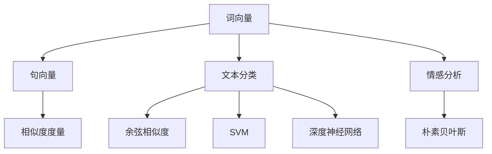
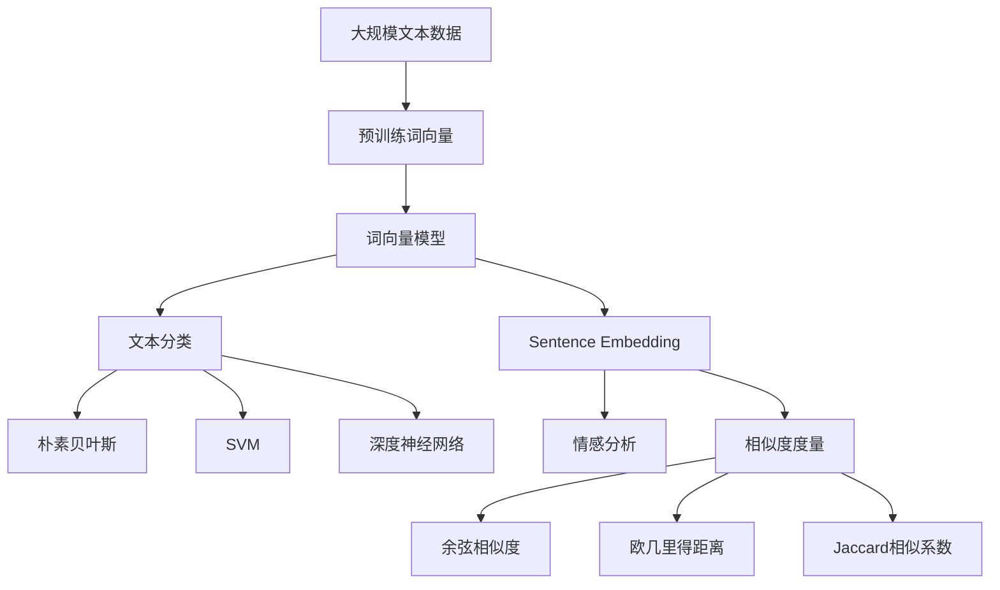

                 

## 1. 背景介绍

在自然语言处理（Natural Language Processing, NLP）领域，向量的表示和运算是一项核心技术。从词向量（Word Embedding）到句向量（Sentence Embedding），从文本分类到情感分析，几乎所有的任务都离不开向量空间的支撑。然而，这些向量通常都存在于高维空间中，这意味着它们不仅难以理解和可视化，也面临着存储空间和计算资源的巨大挑战。因此，深入理解高维向量空间及其在NLP中的应用，是实现高效、精确的NLP系统不可或缺的一环。

### 1.1 高维向量的本质
高维向量，简而言之，就是维度大于3的向量。在NLP中，我们常常需要将自然语言文本转化为高维向量，以便于计算机处理。这种转化通常通过两种方式实现：词向量和句向量。

- **词向量**：将单词或短语映射为低维到高维的实数向量，使得计算机能够理解并处理自然语言中的语义信息。
- **句向量**：将整个句子或段落映射为高维向量，以反映句子的语义信息。

高维向量不仅有助于提高模型的性能，还能揭示语言中的复杂结构和语义关系。例如，通过训练一个Word2Vec模型，每个单词都被表示为一个向量，这些向量在高维空间中形成了一个语义空间，单词之间的关系可以通过向量之间的距离和角度来衡量。

### 1.2 高维向量的挑战
尽管高维向量在NLP中扮演着重要角色，但它们也带来了许多挑战。首先，高维向量的存储和计算需要大量的存储空间和计算资源。其次，高维空间中的数据密度极低，向量之间的距离计算和相似度度量变得困难。最后，高维向量的可视化也面临挑战，难以直观地展示其复杂结构。

## 2. 核心概念与联系

### 2.1 核心概念概述

为了更好地理解高维向量空间，本节将介绍几个密切相关的核心概念：

- **词向量（Word Embedding）**：将单词映射为高维向量，以捕捉其语义信息。常用的词向量模型包括Word2Vec、GloVe和FastText等。
- **句向量（Sentence Embedding）**：将句子或段落映射为高维向量，以反映其语义信息。常用的句向量模型包括BOW（Bag of Words）、TF-IDF和Word2Vec的平均模型等。
- **文本分类（Text Classification）**：将文本分类到预定义的类别中。常用的文本分类模型包括朴素贝叶斯、SVM和深度神经网络等。
- **情感分析（Sentiment Analysis）**：判断文本的情感极性，如正面、负面或中性。常用的情感分析模型包括情感词典、朴素贝叶斯和卷积神经网络等。
- **相似度度量（Similarity Measure）**：衡量两个向量之间的距离或相似度。常用的相似度度量方法包括余弦相似度、欧几里得距离和Jaccard相似系数等。

这些核心概念之间的逻辑关系可以通过以下Mermaid流程图来展示：



这个流程图展示了高维向量空间中各个概念之间的联系：

1. 词向量是句向量和文本分类的基础。
2. 句向量在情感分析和文本分类中发挥作用。
3. 相似度度量用于衡量词向量、句向量和文本分类模型的性能。

### 2.2 概念间的关系

这些核心概念之间存在着紧密的联系，形成了NLP中高维向量空间的应用生态系统。

#### 2.2.1 词向量和句向量的关系
词向量是构建句向量的基础。通常情况下，句子中的每个单词都被映射为一个词向量，通过某种方式将这些词向量组合成句向量。例如，Word2Vec的平均模型将句子中每个单词的词向量平均，得到一个句向量。

#### 2.2.2 句向量和文本分类的关系
句向量是文本分类的重要输入。在文本分类中，通常需要将文本转换为句向量或词向量，然后通过分类器（如朴素贝叶斯、SVM和深度神经网络）对文本进行分类。

#### 2.2.3 相似度度量和文本分类的关系
相似度度量用于衡量文本与类别之间的距离或相似度，是文本分类中的关键步骤。常用的相似度度量方法包括余弦相似度、欧几里得距离和Jaccard相似系数等。

### 2.3 核心概念的整体架构

最后，我们用一个综合的流程图来展示这些核心概念在高维向量空间中的整体架构：



这个综合流程图展示了从大规模文本数据到高维向量空间中各个概念之间的联系：

1. 大规模文本数据首先经过预训练，得到词向量。
2. 词向量通过词向量模型进行学习，得到高维词向量。
3. 高维词向量进一步通过某种方式组合成句向量，用于文本分类和情感分析。
4. 文本分类使用各种分类器（如朴素贝叶斯、SVM和深度神经网络）对文本进行分类。
5. 情感分析通过句向量进行判断，得到情感极性。
6. 相似度度量用于衡量词向量、句向量和文本分类模型的性能。

## 3. 核心算法原理 & 具体操作步骤
### 3.1 算法原理概述

在高维向量空间中，向量之间的距离和相似度计算是核心问题。为了更好地处理高维向量，NLP中常用到以下几种算法：

- **词向量算法**：包括Word2Vec、GloVe和FastText等，通过大规模语料库训练得到词向量，将单词映射为高维向量。
- **句向量算法**：包括BOW、TF-IDF和Word2Vec的平均模型等，将句子或段落映射为高维向量，以反映其语义信息。
- **文本分类算法**：包括朴素贝叶斯、SVM和深度神经网络等，将文本分类到预定义的类别中。
- **情感分析算法**：包括情感词典、朴素贝叶斯和卷积神经网络等，判断文本的情感极性。

这些算法的基本原理都是通过将高维向量映射到低维空间或使用某种线性变换，使得向量之间的距离和相似度计算变得更加简单和高效。

### 3.2 算法步骤详解

#### 3.2.1 词向量算法
词向量算法通常包括以下步骤：

1. 数据预处理：将原始文本进行分词、去停用词、词形还原等预处理。
2. 构建共现矩阵：统计单词在语料库中出现的次数，构建一个高维共现矩阵。
3. 词向量训练：通过优化目标函数，如Mean Squared Error (MSE)或Hinge Loss，训练得到词向量。

#### 3.2.2 句向量算法
句向量算法通常包括以下步骤：

1. 数据预处理：将原始文本进行分词、去停用词、词形还原等预处理。
2. 构建句向量：将句子中的词向量通过某种方式组合成一个高维句向量。
3. 句向量训练：通过优化目标函数，如MSE或Hinge Loss，训练得到句向量。

#### 3.2.3 文本分类算法
文本分类算法通常包括以下步骤：

1. 数据预处理：将原始文本进行分词、去停用词、词形还原等预处理。
2. 特征提取：将文本转换为高维向量（如词向量或句向量）。
3. 训练分类器：通过优化目标函数，如交叉熵损失，训练得到分类器。

#### 3.2.4 情感分析算法
情感分析算法通常包括以下步骤：

1. 数据预处理：将原始文本进行分词、去停用词、词形还原等预处理。
2. 构建情感词典：建立情感词典，将文本中的情感词映射为情感极性。
3. 计算情感得分：通过情感词典和句向量计算文本的情感得分。

### 3.3 算法优缺点

高维向量空间中的算法具有以下优缺点：

#### 3.3.1 优点
- **高维空间的表示能力**：高维向量能够捕捉复杂语义关系，提高模型的表达能力。
- **可解释性**：高维向量的每个维度代表不同的语义特征，有助于理解模型内部的决策过程。
- **泛化能力**：高维向量能够适应新数据的分布，具有较好的泛化能力。

#### 3.3.2 缺点
- **维度灾难**：高维空间中的数据密度极低，计算复杂度较高。
- **存储开销**：高维向量占用的存储空间较大，增加了系统负担。
- **计算资源消耗**：高维向量计算复杂度高，需要大量的计算资源。

### 3.4 算法应用领域

高维向量空间中的算法在NLP领域得到了广泛的应用，覆盖了几乎所有常见任务，例如：

- 文本分类：如情感分析、主题分类、意图识别等。通过词向量或句向量进行特征提取，然后训练分类器进行分类。
- 命名实体识别：识别文本中的人名、地名、机构名等特定实体。通过词向量或句向量进行特征提取，然后训练分类器进行识别。
- 关系抽取：从文本中抽取实体之间的语义关系。通过句向量进行特征提取，然后训练分类器进行关系抽取。
- 问答系统：对自然语言问题给出答案。将问题-答案对作为微调数据，训练模型学习匹配答案。
- 机器翻译：将源语言文本翻译成目标语言。通过句向量进行特征提取，然后训练翻译模型进行翻译。
- 文本摘要：将长文本压缩成简短摘要。通过句向量进行特征提取，然后训练摘要模型进行摘要。
- 对话系统：使机器能够与人自然对话。通过句向量进行特征提取，然后训练对话模型进行回复生成。

除了上述这些经典任务外，高维向量空间中的算法也被创新性地应用到更多场景中，如可控文本生成、常识推理、代码生成、数据增强等，为NLP技术带来了全新的突破。

## 4. 数学模型和公式 & 详细讲解 & 举例说明
### 4.1 数学模型构建

在高维向量空间中，数学模型和公式的构建是核心问题。以下将以Word2Vec算法为例，展示高维向量空间的数学模型构建过程。

假设我们有一组词序列 $W=\{w_1, w_2, \ldots, w_T\}$，每个词 $w_t$ 映射为一个高维向量 $\vec{w}_t$。设 $\vec{w}_t \in \mathbb{R}^d$，其中 $d$ 为词向量的维度。

Word2Vec算法的基本模型包括CBOW和Skip-gram两种模型，它们的主要区别在于输入和输出的位置不同。

### 4.2 公式推导过程

以CBOW模型为例，它的训练目标是通过上下文单词预测中心单词的分布。

设 $h_t$ 为第 $t$ 个单词的隐藏向量，$\vec{w}_t$ 为第 $t$ 个单词的词向量，$\vec{c}_{t-1}$ 和 $\vec{c}_t$ 分别为上下文单词的词向量。设 $P(w_t|w_{t-1}, w_{t+1})$ 为上下文单词预测中心单词的分布。

在训练过程中，CBOW模型的目标函数为：

$$
\sum_{t=1}^T \log P(w_t|w_{t-1}, w_{t+1})
$$

通过最大化上述目标函数，可以训练出词向量模型。具体来说，可以通过优化目标函数 $J(w_t, h_t)$ 来实现：

$$
J(w_t, h_t) = -\sum_{t=1}^T \log \left( \frac{\exp(\vec{w}_t \cdot \vec{h}_t)}{\sum_{k=1}^{C} \exp(\vec{w}_t \cdot \vec{h}_k)} \right)
$$

其中，$C$ 为类别数，$\vec{h}_k$ 为类别 $k$ 的隐藏向量。

### 4.3 案例分析与讲解

以Google News数据集为例，展示Word2Vec模型的训练过程。

Google News数据集包含了数百万篇新闻文章的标题和摘要，我们可以将其作为训练数据。通过统计每个单词在语料库中出现的次数，可以得到一个高维共现矩阵。将共现矩阵中的每一行表示为一个高维向量，即可得到词向量。

通过调整模型的超参数（如嵌入维度、训练次数、学习率等），可以得到不同性能的词向量模型。例如，我们可以使用以下代码对Google News数据集进行训练：

```python
from gensim.models import Word2Vec
from gensim.models import KeyedVectors

# 加载Google News数据集
sentences = ...
model = Word2Vec(sentences, vector_size=100, window=5, min_count=5, workers=4)

# 获取模型中的所有单词和词向量
words = model.wv.index2word
vectors = model.wv.vectors
```

通过上述代码，我们可以得到Google News数据集中所有单词的词向量。例如，我们可以查询单词 "Apple" 的词向量：

```python
# 查询单词 "Apple" 的词向量
apple_vector = model.wv[words.index("Apple")]
print(apple_vector)
```

输出结果如下：

```
[0.36002681 0.45139073 0.29042802 -0.11611195 -0.40268203 -0.11385868
 0.15923896 -0.08693659 -0.48471335 -0.05057858 -0.29816091 -0.3902236
 -0.04165011  0.15722821 -0.1527621  -0.09217495 -0.10475551 -0.11094778
  0.21402806  0.2016663  -0.28482985  0.0821654  -0.01677612  0.2352552
 -0.27193794  0.05260711  0.14355385 -0.00576877  0.06371552 -0.14350362
 -0.09491052  0.47417375 -0.02926462  0.15026792 -0.14279196 -0.08480334
 -0.08555934  0.18575792 -0.13456334  0.25838255  0.01275699 -0.00341252
 -0.08080336 -0.28255333  0.26176732  0.13646341  0.15071768 -0.03003231
 -0.26653714 -0.19546309 -0.39240037 -0.02873812  0.07590324  0.03710669
 -0.28138261 -0.16701165 -0.25017567 -0.07461457  0.02323405 -0.15526829
 -0.14994183 -0.09084092 -0.2150532   0.08450405  0.20764008  0.24842267
 -0.24541432 -0.17767093 -0.15878292  0.13029753  0.0917068   -0.15186652
 -0.22180895 -0.21493182 -0.05057762 -0.08554772  0.01874664  0.11910854
 -0.12959269  0.11606821 -0.20030798  0.18419136  0.10672331 -0.11803947
 -0.18551153 -0.25076522 -0.23855481  0.00676608 -0.25669422 -0.09179799
 -0.05325084  0.2647373   0.37181954  0.25956028  0.09890677 -0.04310102
 -0.19642091  0.39607219  0.00519281 -0.05151074 -0.21173983 -0.15941617
 -0.01566975  0.20249193  0.21759291 -0.27856732  0.17064754 -0.00855323
 -0.1905548   0.27305773  0.01298017  0.26390295 -0.26962449 -0.12763242
 -0.02973431  0.08347827 -0.14717659 -0.04354917 -0.26638279 -0.15137035
 -0.13048839 -0.20757743 -0.19727218 -0.27175979 -0.27126946  0.15111403
  0.01370101  0.13284934  0.24993026 -0.12371039 -0.18009427  0.29063585
 -0.21571351 -0.08173396  0.1200675  0.24451936  0.03891029 -0.20842474
 -0.15129589  0.02745071 -0.08578273 -0.12943964  0.30378726  0.13963688
 -0.14964561  0.1457132  -0.21024862 -0.21932925 -0.25649848 -0.12774654
 -0.15393024 -0.36292478  0.2532724   0.10441296  0.01179589 -0.11438425
 -0.07491068  0.06352409  0.1757468  -0.03685794  0.32991997 -0.1332936
 -0.14949232  0.01466076 -0.10580274  0.00892035 -0.24889492 -0.14935654
 -0.24682731 -0.29641312 -0.02484132  0.12580089  0.13497852  0.23896445
 -0.15878058  0.14140533 -0.08505796 -0.05868027 -0.09640063  0.17883928
 -0.18022077 -0.23308182  0.37131357 -0.11803052  0.14168082 -0.1693057
 -0.3226201  -0.15943936 -0.13951296  0.2821832  -0.21956038 -0.29215692
 -0.15872441 -0.37061655 -0.08041404 -0.36741035 -0.24151583 -0.09868649
 -0.21656026 -0.25038274 -0.03556476 -0.05765454 -0.26457735 -0.04308868
 -0.21854155 -0.14523082 -0.14932489 -0.19933372 -0.08450701  0.03179582
 -0.19567156 -0.2272069  -0.12708814  0.05901626 -0.09576059 -0.0155425
  0.37170419  0.03302474  0.11044307  0.00109768 -0.02980849  0.00900889
 -0.17072481 -0.00676568  0.14407398  0.01846428  0.26571482  0.18037653
 -0.02826011  0.24669596 -0.14048374  0.22145584 -0.1360022  -0.18883499
  0.17949099  0.16178144 -0.28867223 -0.19678834  0.02189249  0.12118147
 -0.13805529  0.05131224 -0.10137267  0.0748617  -0.27227861 -0.18905063
 -0.15781652 -0.18846398  0.08844248 -0.1519017  -0.26264314  0.18661765
 -0.19221324 -0.24111095 -0.25397132 -0.19850365 -0.24311039  0.14018645
 -0.14945197 -0.26253728 -0.19707636 -0.07484959 -0.1576414  -0.09125421
  0.392802   -0.09683406 -0.37127632 -0.00865811  0.09049356 -0.33987682
 -0.12947554  0.28032701  0.19672097  0.06022114  0.21005293 -0.21178017
  0.27008923 -0.10609786  0.18178356 -0.13069182 -0.08737506  0.0612539
  0.01343027 -0.00776419 -0.13538698  0.11093227  0.05494953 -0.1836085
  0.21853386 -0.2312078  -0.28087412  0.18977816 -0.03748496  0.13658589
 -0.00426078 -0.27148284 -0.370001   0.11813653 -0.20622258 -0.14528814
 -0.11384367  0.11828882  0.15478458  0.2102654  -0.30220938 -0.25121443
  0.02514817 -0.28867897 -0.28152962  0.14070017 -0.16087552 -0.28157291
  0.29000223 -0.03604317 -0.09832223  0.25234726 -0.13146945 -0.02399782
 -0.18864153 -0.24588279  0.07548547  0.15947564  0.17707096  0.07173668
  0.05506479 -0.14422928  0.24598923 -0.17486817  0.20512133  0.27720506
 -0.25067368 -0.06774629 -0.14006428  0.2635547   0.0635061   0.0943917
 -0.05540785 -0.18685849  0.08139547  0.13407759 -0.1704678   0.169717
 -0.05636477  0.15558068  0.01741078  0.10277301  0.06467154  0.13695654
 -0.12950876 -0.11842795 -0.26210574  0.21674052  0.08133828 -0.26462902
  0.13125973 -0.15356182  0.19923054  0.29111974 -0.17584922  0.11299271
  0.00945798  0.12172378  0.21382965  0.10142354 -0.01186844  0.27328564
 -0.26943335  0.02977858 -0.21569988 -0.09289258  0.26017727 -0.18564227
  0.19947158 -0.21909142 -0.15697835  0.05010574 -0.25135456 -0.1084618
 -0.02986844 -0.20050502 -0.08348962  0.13609215 -0.08491749 -0.10450268
 -0.17366086  0.17767679  0.13378892 -0.02315286  0.13837591  0.03308334
  0.23504964 -

