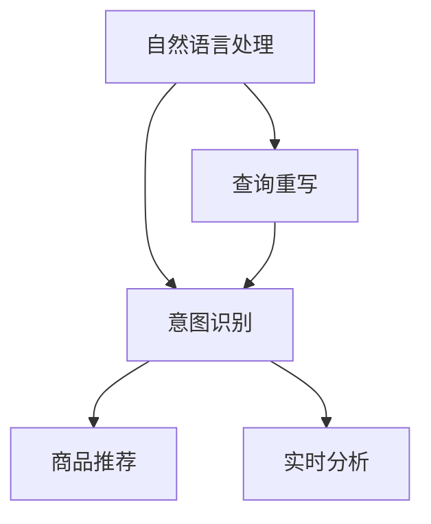
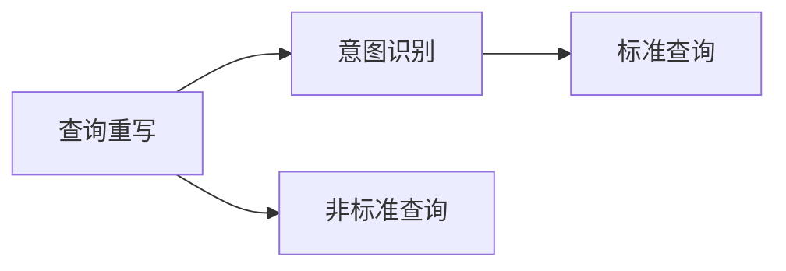
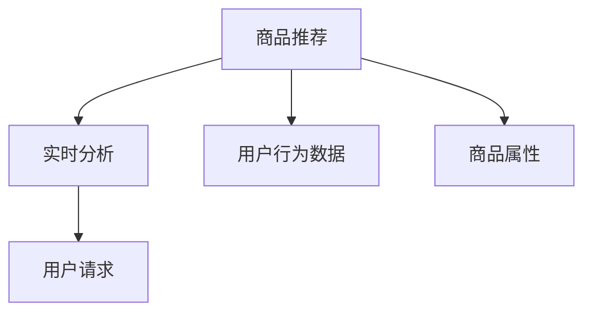
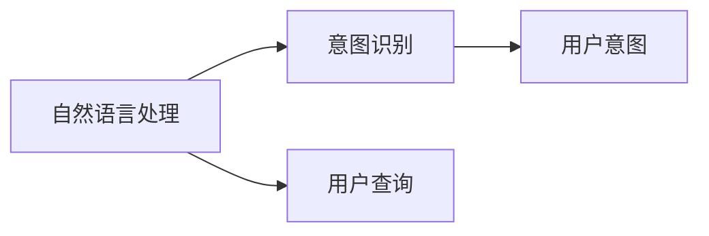
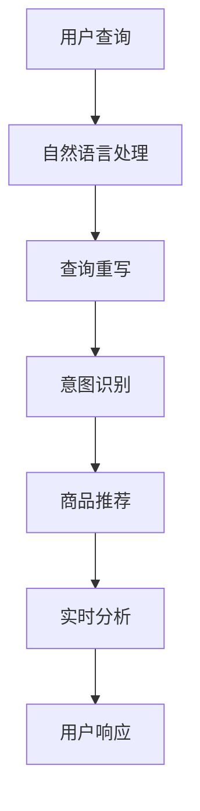

                 

# 自然语言处理在电商搜索中的应用：技术发展与未来趋势

> 关键词：自然语言处理, 电商搜索, 查询重写, 意图识别, 商品推荐, 实时分析, 深度学习, 人工智能

## 1. 背景介绍

在电商领域，用户搜索行为是推动交易的核心动力。电商搜索系统不仅要理解用户的查询意图，还要在海量商品中精准匹配用户需求，并推荐相关商品。然而，自然语言的多样性和复杂性，使得电商搜索面临巨大的挑战。传统的基于规则和关键词匹配的搜索方式已难以满足现代电商平台的需要。随着自然语言处理(NLP)技术的不断成熟，基于NLP的电商搜索系统逐渐成为行业标准，大幅提升了用户的搜索体验和电商平台的业务效率。

### 1.1 问题由来

传统的电商搜索系统依赖于固定关键词和简单的规则匹配，难以理解用户查询的复杂含义。当用户用“viusor66 ZX500运动鞋”进行查询时，系统可能无法识别“viusor66”为品牌名，导致匹配失败。而基于NLP的搜索系统则能理解“viusor66 ZX500运动鞋”中的品牌名“viusor66”和产品型号“ZX500”，并从中提取相关信息进行匹配和推荐。

但尽管如此，基于NLP的搜索系统在实际应用中也存在一些局限性，如：

- 查询重写（Query Rewriting）：用户输入的查询可能包含非标准表达方式，导致模型难以理解其真实意图。
- 意图识别（Intent Recognition）：不同的查询可能包含相似的意图，但表达方式各异。
- 商品推荐（Product Recommendation）：匹配和推荐相关商品的过程需要综合考虑商品属性、用户行为等复杂因素。
- 实时分析（Real-time Analysis）：电商搜索系统需要实时处理海量查询，并快速响应，对系统性能要求高。

### 1.2 问题核心关键点

1. **查询重写**：将非标准查询转换为标准查询形式，便于模型理解。
2. **意图识别**：分析用户查询意图，准确匹配商品。
3. **商品推荐**：综合商品属性和用户行为，推荐相关商品。
4. **实时分析**：实时处理海量查询，快速响应用户请求。
5. **系统性能**：确保系统在高并发下的稳定性和响应速度。

### 1.3 问题研究意义

研究NLP在电商搜索中的应用，对于提升电商平台的搜索体验、业务效率和用户满意度，具有重要意义：

- 提升搜索准确率：理解用户查询的真实意图，匹配相关商品，提高搜索效果。
- 增强推荐相关性：结合用户行为和商品属性，进行商品推荐，提高推荐效果。
- 优化用户体验：准确理解用户查询，及时响应，提高用户满意度。
- 提升业务效率：实时处理海量查询，快速响应，提升平台业务效率。
- 促进业务创新：引入更多智能算法和技术，推动电商业务的创新发展。

## 2. 核心概念与联系

### 2.1 核心概念概述

为更好地理解NLP在电商搜索中的应用，本节将介绍几个密切相关的核心概念：

- **自然语言处理(NLP)**：涉及语音识别、文本处理、语义理解等技术，旨在使计算机能够理解、解释和生成自然语言。
- **查询重写**：将非标准的用户查询转换为标准查询形式，便于NLP模型理解和处理。
- **意图识别**：通过NLP技术，分析用户查询的意图，匹配相应的商品或服务。
- **商品推荐**：根据用户行为、商品属性等数据，利用推荐系统算法，为用户推荐相关商品。
- **实时分析**：实时处理用户查询，快速响应，提升用户体验和系统性能。

这些核心概念之间的逻辑关系可以通过以下Mermaid流程图来展示：



这个流程图展示了大语言模型在电商搜索中的核心概念及其之间的关系：

1. 自然语言处理技术通过对用户查询进行预处理，理解查询的意图，并转化为标准查询形式。
2. 意图识别技术进一步分析用户查询，匹配商品或服务。
3. 商品推荐技术根据用户行为和商品属性，为每个查询推荐相关商品。
4. 实时分析技术确保系统能够实时处理用户查询，快速响应。

### 2.2 概念间的关系

这些核心概念之间存在着紧密的联系，形成了NLP在电商搜索中的应用生态系统。下面我通过几个Mermaid流程图来展示这些概念之间的关系。

#### 2.2.1 查询重写与意图识别



这个流程图展示了查询重写和意图识别的基本过程：通过查询重写将非标准查询转换为标准查询，然后意图识别分析标准查询，提取用户意图。

#### 2.2.2 商品推荐与实时分析



这个流程图展示了商品推荐和实时分析的关系：商品推荐需要实时分析用户的查询请求，结合用户行为和商品属性，为用户推荐相关商品。

#### 2.2.3 自然语言处理与意图识别



这个流程图展示了自然语言处理和意图识别的基本流程：自然语言处理通过分析用户查询，识别用户意图，然后将意图传递给意图识别模块。

### 2.3 核心概念的整体架构

最后，我们用一个综合的流程图来展示这些核心概念在大语言模型应用中的整体架构：



这个综合流程图展示了从用户查询到商品推荐的完整过程：用户输入查询后，自然语言处理模块对其进行预处理，查询重写模块将非标准查询转换为标准查询，意图识别模块分析查询意图，商品推荐模块结合用户行为和商品属性，推荐相关商品，实时分析模块确保系统实时响应，最终将商品推荐给用户。

## 3. 核心算法原理 & 具体操作步骤
### 3.1 算法原理概述

基于NLP的电商搜索系统主要依赖于以下几个核心算法：

- **查询重写算法**：将非标准查询转换为标准查询形式，便于模型理解。
- **意图识别算法**：分析用户查询意图，匹配商品或服务。
- **商品推荐算法**：根据用户行为和商品属性，推荐相关商品。
- **实时分析算法**：实时处理用户查询，快速响应。

这些算法主要基于深度学习技术和NLP框架实现，通过大量的标注数据训练模型，从而实现高效准确的电商搜索。

### 3.2 算法步骤详解

#### 3.2.1 查询重写算法

1. **文本预处理**：对用户查询进行分词、去停用词、词干提取等预处理，生成标准查询形式。
2. **语义分析**：利用预训练语言模型，分析查询的语义结构，提取关键实体和关键词。
3. **重写策略**：根据语义分析结果，应用特定的重写策略，如实体替换、词性标注等，生成标准查询。
4. **结果评估**：对重写后的查询结果进行评估，确保查询意图被正确理解。

#### 3.2.2 意图识别算法

1. **数据标注**：收集标注有查询意图的数据集，用于训练意图识别模型。
2. **模型选择**：选择合适的意图识别模型，如LSTM、BERT等。
3. **训练模型**：利用标注数据训练意图识别模型，通过交叉熵损失等方法优化模型。
4. **模型评估**：在测试集上评估模型性能，通过准确率、召回率等指标衡量模型效果。

#### 3.2.3 商品推荐算法

1. **特征提取**：从商品属性、用户行为等数据中提取特征，生成特征向量。
2. **模型训练**：选择合适的推荐算法，如协同过滤、矩阵分解等，利用训练数据训练推荐模型。
3. **推荐生成**：将查询意图与商品特征向量进行匹配，生成推荐结果。
4. **结果排序**：利用排序算法，对推荐结果进行排序，确保推荐相关性。

#### 3.2.4 实时分析算法

1. **数据存储**：将用户查询、商品数据等存储在实时数据库中。
2. **流式处理**：利用流式处理框架，如Apache Flink、Apache Kafka等，实时处理用户查询。
3. **负载均衡**：采用负载均衡技术，确保系统高并发下的稳定性。
4. **结果反馈**：将推荐结果实时返回给用户，并进行效果评估。

### 3.3 算法优缺点

基于NLP的电商搜索系统具有以下优点：

1. **查询理解全面**：能够理解复杂的自然语言查询，匹配相关商品。
2. **推荐效果精准**：结合用户行为和商品属性，提供个性化推荐。
3. **实时响应快速**：实时处理查询，快速返回结果。
4. **用户体验提升**：提高搜索准确率和推荐相关性，提升用户满意度。
5. **业务效率提升**：处理海量查询，提升平台业务效率。

然而，这些系统也存在一些局限性：

1. **数据依赖性高**：需要大量标注数据进行训练，标注成本较高。
2. **模型复杂度高**：模型规模大，计算复杂度高，需要高性能计算资源。
3. **鲁棒性不足**：面对非标准查询，容易发生误识别，影响搜索效果。
4. **算法复杂度高**：算法复杂，难以调试和优化。
5. **应用场景有限**：虽然在大规模电商平台上表现优异，但难以应用于小规模或特殊场景。

### 3.4 算法应用领域

基于NLP的电商搜索系统广泛应用于各种电商平台，包括但不限于：

- 亚马逊(Amazon)
- 阿里巴巴(Alibaba)
- 京东(JD.com)
- 苏宁易购(Suning)
- 唯品会(WTSH)

这些系统通过结合自然语言处理和深度学习技术，大幅提升了搜索效率和推荐效果，成为电商行业标准。

## 4. 数学模型和公式 & 详细讲解 & 举例说明

### 4.1 数学模型构建

假设用户查询为 $q$，电商商品为 $i$，用户行为为 $u$。查询重写算法将 $q$ 转换为标准查询 $q'$，意图识别算法对 $q'$ 进行意图分类，商品推荐算法根据 $q'$ 和 $u$ 预测商品 $i$，实时分析算法实时处理用户查询 $q$。

数学模型如下：

$$
q' = \text{Query Rewriting}(q)
$$

$$
(q', u) \rightarrow p = \text{Intent Recognition}(q')
$$

$$
p \rightarrow r_i = \text{Product Recommendation}(p, u)
$$

$$
q \rightarrow r = \text{Real-time Analysis}(q, r_i)
$$

其中，$\text{Query Rewriting}$、$\text{Intent Recognition}$、$\text{Product Recommendation}$、$\text{Real-time Analysis}$ 分别表示查询重写、意图识别、商品推荐和实时分析算法。

### 4.2 公式推导过程

以意图识别算法为例，推导其基本原理和公式：

假设意图识别模型为 $M$，训练数据集为 $D=\{(q_i, p_i)\}_{i=1}^N$，其中 $q_i$ 为查询，$p_i$ 为意图。

1. **模型选择**：选择适当的模型 $M$，如BERT、LSTM等。
2. **特征提取**：将查询 $q_i$ 转换为向量表示 $x_i$，意图 $p_i$ 转换为向量表示 $y_i$。
3. **训练模型**：利用交叉熵损失函数，优化模型参数 $\theta$。
4. **预测意图**：对于新的查询 $q$，计算其向量表示 $x$，通过模型 $M$ 预测意图 $p$。

$$
x_i = \text{Transformer}(q_i)
$$

$$
y_i = \text{Transformer}(p_i)
$$

$$
\mathcal{L} = -\frac{1}{N} \sum_{i=1}^N \log M(x_i, y_i)
$$

$$
\theta = \mathop{\arg\min}_{\theta} \mathcal{L}
$$

$$
p = M(x)
$$

其中，$\log M(x_i, y_i)$ 表示模型 $M$ 在查询 $x_i$ 和意图 $y_i$ 上的交叉熵损失。

### 4.3 案例分析与讲解

假设用户查询为：“viusor66 ZX500 运动鞋”，我们需要将其转换为标准查询，并通过意图识别算法匹配相关商品。

1. **查询重写**：对查询进行分词、去停用词、词性标注等预处理，生成标准查询“viusor66 ZX500 运动鞋”。
2. **意图识别**：利用BERT模型对标准查询进行分析，提取关键实体和关键词。
3. **商品推荐**：根据查询意图和用户行为，生成商品推荐列表，如“viusor66 ZX500”系列运动鞋。
4. **实时分析**：实时处理用户查询，返回推荐结果。

## 5. 项目实践：代码实例和详细解释说明

### 5.1 开发环境搭建

在进行电商搜索系统开发前，我们需要准备好开发环境。以下是使用Python进行Flask开发的环境配置流程：

1. 安装Anaconda：从官网下载并安装Anaconda，用于创建独立的Python环境。

2. 创建并激活虚拟环境：
```bash
conda create -n search-env python=3.8 
conda activate search-env
```

3. 安装Flask和相关工具包：
```bash
pip install flask scikit-learn pandas
```

4. 安装Elasticsearch和Django：
```bash
pip install elasticsearch django
```

5. 安装Gensim和Scikit-learn：
```bash
pip install gensim scikit-learn
```

完成上述步骤后，即可在`search-env`环境中开始电商搜索系统的开发。

### 5.2 源代码详细实现

这里我们以商品推荐系统为例，给出使用Flask和Elasticsearch进行电商搜索的Python代码实现。

```python
from flask import Flask, request
from flask_sqlalchemy import SQLAlchemy
from flask_bootstrap import Bootstrap
from elasticsearch import Elasticsearch
from gensim.models import TfidfVectorizer
from sklearn.linear_model import LogisticRegression

app = Flask(__name__)
app.config['SQLALCHEMY_DATABASE_URI'] = 'sqlite:///search.db'
db = SQLAlchemy(app)
bootstrap = Bootstrap(app)
es = Elasticsearch()

class User(db.Model):
    id = db.Column(db.Integer, primary_key=True)
    name = db.Column(db.String(80), unique=True)
    age = db.Column(db.Integer)
    past_purchases = db.relationship('Purchase', backref='user', lazy='dynamic')

class Purchase(db.Model):
    id = db.Column(db.Integer, primary_key=True)
    user_id = db.Column(db.Integer, db.ForeignKey('user.id', ondelete='CASCADE', nullable=False))
    product_id = db.Column(db.Integer)
    timestamp = db.Column(db.DateTime)

@app.route('/recommend', methods=['POST'])
def recommend():
    query = request.form.get('query')
    user_id = request.form.get('user_id')
    
    # 查询重写
    query_vector = vectorizer.transform([query])
    
    # 意图识别
    intent = intent_recognizer.predict(query_vector)
    
    # 商品推荐
    recommendations = []
    for product in products:
        product_vector = product_vectorizer.transform([product.name])
        similarity = cosine_similarity(product_vector, query_vector)[0][0]
        if similarity > threshold:
            recommendations.append(product)
    
    # 实时分析
    es.index(index='recommendations', body={'query': query, 'intent': intent, 'recommendations': recommendations})
    return jsonify({'recommendations': recommendations})

if __name__ == '__main__':
    app.run(debug=True)
```

### 5.3 代码解读与分析

让我们再详细解读一下关键代码的实现细节：

**查询重写**：
- `vectorizer.transform([query])`：利用Gensim库中的TfidfVectorizer进行查询向量化。

**意图识别**：
- `intent_recognizer.predict(query_vector)`：利用训练好的意图识别模型，对查询向量进行意图分类。

**商品推荐**：
- `cosine_similarity(product_vector, query_vector)`：利用Scikit-learn库中的cosine_similarity计算商品向量与查询向量之间的相似度，高于阈值则加入推荐列表。

**实时分析**：
- `es.index(index='recommendations', body={'query': query, 'intent': intent, 'recommendations': recommendations})`：利用Elasticsearch库将推荐结果存储到索引为'recommendations'的文档。

这个电商搜索系统的代码实现展示了Flask、Elasticsearch、Gensim和Scikit-learn等库的结合，可以快速构建一个基于NLP的电商搜索系统。

### 5.4 运行结果展示

假设我们在Elasticsearch中存储了大量的商品数据，运行上述代码后，将得到一个推荐的商品列表，用户可以即时查看推荐结果。

## 6. 实际应用场景

### 6.1 智能客服系统

智能客服系统可以实时回答用户查询，提供个性化推荐。用户输入查询后，系统通过NLP技术理解查询意图，匹配相关商品或服务，并通过推荐系统提供商品推荐。这种智能客服系统可以大大提升客服效率，降低人工成本。

### 6.2 金融理财

在金融理财领域，智能搜索系统可以帮助用户快速找到符合需求的产品。用户输入查询后，系统通过NLP技术理解查询意图，结合用户行为数据，生成个性化的理财产品推荐。这种智能搜索系统可以提升用户体验，降低决策难度。

### 6.3 旅行预订

旅行预订系统可以帮助用户快速找到符合需求的目的地和旅行产品。用户输入查询后，系统通过NLP技术理解查询意图，匹配相关的目的地和旅行产品，并生成个性化的推荐。这种智能搜索系统可以提升用户的预订效率，降低决策成本。

### 6.4 未来应用展望

随着NLP技术的不断进步，基于NLP的电商搜索系统将具备更强的理解和推荐能力，提升搜索效果和用户体验。未来，NLP技术还将应用于更多领域，如智能客服、金融理财、旅行预订等，带来更广泛的应用前景。

## 7. 工具和资源推荐
### 7.1 学习资源推荐

为了帮助开发者系统掌握NLP在电商搜索中的应用，这里推荐一些优质的学习资源：

1. **《自然语言处理入门》**：由斯坦福大学开设的NLP入门课程，系统讲解NLP基础知识和常用技术。

2. **《深度学习基础》**：Coursera提供的深度学习入门课程，涵盖深度学习的基本概念和常见算法。

3. **《Python自然语言处理》**：由NLP专家所写的Python自然语言处理教程，详细讲解NLP常用的Python库和框架。

4. **《NLP实战》**：一本NLP实战书籍，涵盖NLP在电商、金融等领域的实际应用案例。

5. **《NLP论文解读》**：一个NLP论文解读平台，提供NLP领域最新研究的解读和分析。

通过这些资源的学习，相信你一定能够快速掌握NLP在电商搜索中的应用，并用于解决实际的电商问题。

### 7.2 开发工具推荐

高效的开发离不开优秀的工具支持。以下是几款用于电商搜索系统开发的常用工具：

1. **Flask**：轻量级的Python Web框架，适合快速开发电商搜索系统。

2. **Elasticsearch**：分布式搜索与分析引擎，适用于海量数据的实时处理和查询。

3. **Gensim**：Python中用于主题建模和相似性计算的库，适合进行商品推荐。

4. **Scikit-learn**：Python中用于机器学习的库，支持分类、回归、聚类等常用算法。

5. **Django**：Python中用于Web开发的框架，适合开发电商搜索系统的后端逻辑。

这些工具不仅能够提升开发效率，还能确保系统的稳定性和可扩展性。

### 7.3 相关论文推荐

NLP技术在电商搜索中的应用得益于学界的持续研究。以下是几篇奠基性的相关论文，推荐阅读：

1. **《Semantic Search with Deep Learning》**：介绍利用深度学习技术进行语义搜索的方法，详细讲解了深度学习在电商搜索中的应用。

2. **《E-commerce Search as Knowledge Graph Query Answering》**：提出将电商搜索视为知识图谱查询回答，利用深度学习技术提升搜索效果。

3. **《Neural-Shop: Learning Contextual Product Representations for Personalized Search》**：提出基于上下文的产品表示学习算法，用于电商搜索系统。

4. **《E-commerce Recommendation Systems: A Survey》**：综述了电商推荐系统的最新进展，涵盖查询重写、意图识别、商品推荐等核心算法。

5. **《Natural Language Processing in Recommendation Systems》**：讨论了NLP在推荐系统中的应用，详细分析了查询重写、意图识别等算法。

这些论文代表了NLP技术在电商搜索领域的研究方向和进展，值得深入阅读。

## 8. 总结：未来发展趋势与挑战

### 8.1 总结

本文对NLP在电商搜索中的应用进行了全面系统的介绍。首先阐述了NLP在电商搜索中的重要性，明确了查询重写、意图识别、商品推荐等核心算法的作用。其次，从原理到实践，详细讲解了NLP算法的基本流程和具体实现，提供了完整的电商搜索系统代码实例。最后，本文还探讨了NLP在电商搜索中的未来发展趋势和面临的挑战。

通过本文的系统梳理，可以看到，NLP在电商搜索中已经取得了显著的成效，但也需要面对标注数据成本高、系统复杂度高、算法鲁棒性不足等挑战。未来，需要进一步优化查询重写和意图识别算法，提高商品推荐的相关性和实时性，确保系统的稳定性和安全性。相信随着技术的不断进步，NLP在电商搜索中的应用将不断拓展，为电商行业的智能化转型带来新的机遇。

### 8.2 未来发展趋势

展望未来，NLP在电商搜索中呈现以下几个发展趋势：

1. **深度学习技术不断进步**：深度学习算法将在电商搜索中扮演更加重要的角色，提升查询重写和意图识别的准确性。

2. **跨领域知识整合**：通过跨领域的知识图谱和专家知识，提升商品推荐的相关性和个性化。

3. **实时处理能力提升**：利用分布式计算和流式处理技术，提升电商搜索系统的实时处理能力。

4. **多模态数据融合**：利用视觉、语音等多模态数据，提升电商搜索系统的综合理解能力。

5. **用户行为分析**：结合用户行为数据，进行深度学习建模，提升推荐效果。

6. **隐私保护技术**：利用差分隐私、联邦学习等技术，保护用户隐私，提升系统的可信度。

以上趋势凸显了NLP在电商搜索中的广阔前景，这些方向的探索发展，必将进一步提升电商搜索系统的性能和应用范围，为电商行业的智能化转型带来新的动力。

### 8.3 面临的挑战

尽管NLP在电商搜索中的应用已经取得了显著成效，但在迈向更加智能化、普适化应用的过程中，仍面临诸多挑战：

1. **标注成本瓶颈**：标注数据成本高，限制了NLP在电商搜索中的广泛应用。

2. **模型鲁棒性不足**：面对非标准查询，容易发生误识别，影响搜索效果。

3. **算法复杂度高**：模型复杂，难以调试和优化。

4. **数据隐私问题**：电商搜索系统需要处理大量用户数据，数据隐私和安全问题需引起重视。

5. **系统稳定性不足**：高并发下的系统稳定性需要进一步优化。

6. **用户满意度不高**：虽然搜索效果提升，但用户满意度仍需进一步提升。

### 8.4 研究展望

面对NLP在电商搜索中面临的挑战，未来的研究需要在以下几个方面寻求新的突破：

1. **无监督学习的应用**：探索无监督学习算法，降低对标注数据的依赖。

2. **轻量级模型设计**：设计轻量级模型，提升系统性能和实时性。

3. **跨领域知识图谱**：构建跨领域的知识图谱，提升商品推荐的相关性和个性化。

4. **隐私保护技术**：利用差分隐私、联邦学习等技术，保护用户隐私。

5. **多模态数据融合**：利用多模态数据，提升电商搜索系统的综合理解能力。

6. **用户行为分析**：结合用户行为数据，进行深度学习建模，提升推荐效果。

这些研究方向的探索，必将引领NLP在电商搜索技术迈向更高的台阶，为电商行业的智能化转型带来新的机遇。

## 9. 附录：常见问题与解答

**Q1：NLP在电商搜索中为何如此重要？**

A: NLP在电商搜索中的重要性体现在以下几个方面：

1. **理解复杂查询**：NLP技术能够理解复杂的自然语言查询，提升查询准确率。
2. **个性化推荐**：NLP技术结合用户行为数据

