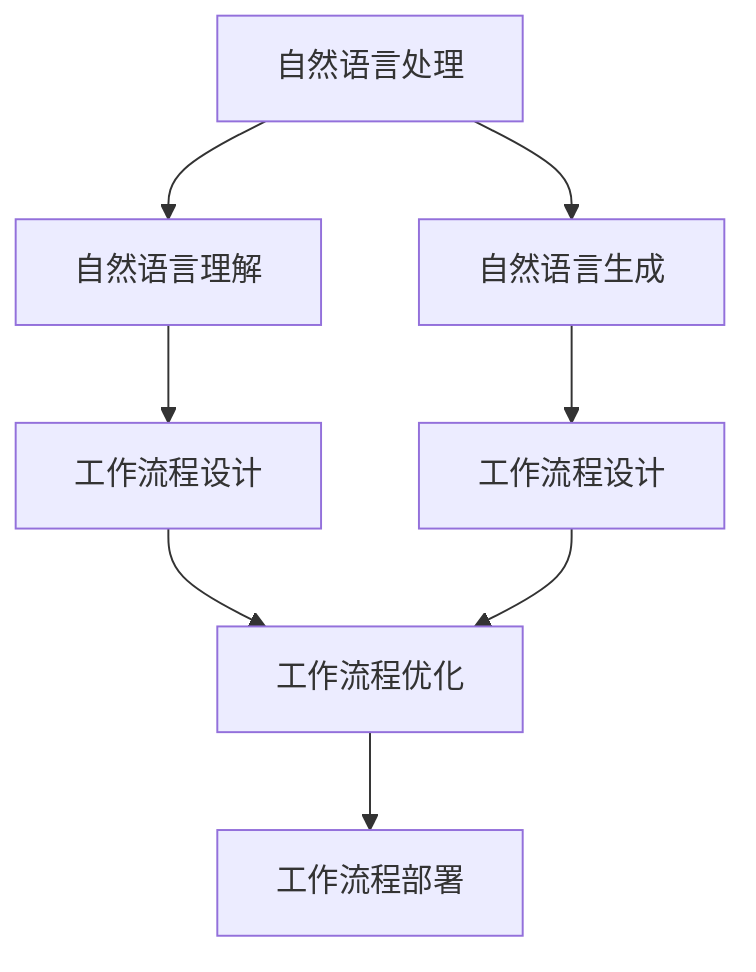
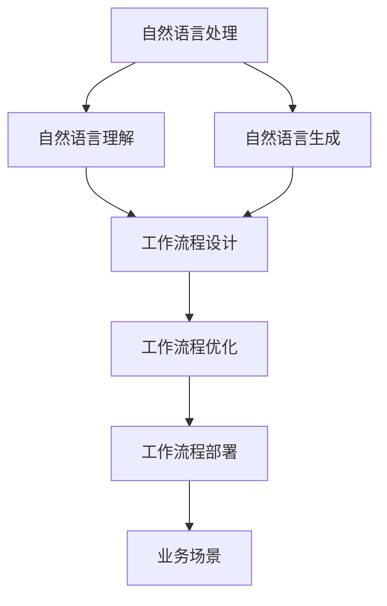

                 

# 自然语言辅助工作流程生成

> 关键词：自然语言处理(NLP), 工作流程自动化, 生成对抗网络(GAN), 语言模型, 自然语言理解(NLU), 工作流程设计, 智能辅助

## 1. 背景介绍

### 1.1 问题由来

随着企业数字化转型的加速推进，业务流程自动化已成为提升效率、降低成本、优化体验的关键驱动力。然而，传统流程自动化系统往往依赖于高度专业化的规则编写和维护，成本高、周期长、难度大。如何利用自然语言处理(NLP)技术，提升流程自动化的智能化水平，是当前业界和学界广泛关注的研究方向。

自然语言辅助工作流程生成技术，旨在通过解析自然语言描述的任务，自动设计、优化、部署工作流程，赋能业务场景。该技术将传统的流程自动化提升至一个全新的智能水平，能够实现自动理解用户需求、设计灵活的流程规则、动态适应业务变化，极大地降低自动化开发的复杂度与成本，推动业务流程的智能化演进。

### 1.2 问题核心关键点

当前，自然语言辅助工作流程生成技术主要通过解析自然语言任务描述，自动构建、优化和部署工作流程。其核心在于自然语言理解和生成模型的结合，将用户意图转化为可执行的工作流程，实现智能化流程自动化。

自然语言辅助工作流程生成的关键点包括：

- 自然语言理解(NLU)：解析自然语言任务描述，提取任务要素、规则、关系等关键信息。
- 工作流程设计：根据用户意图和提取的信息，自动设计工作流程模板和规则。
- 工作流程优化：利用生成对抗网络(GAN)等技术，对初步设计的工作流程进行优化，提升流程的鲁棒性和效率。
- 工作流程部署：将优化后的工作流程部署到实际运行环境，实现业务落地。

自然语言辅助工作流程生成技术具有高效、灵活、智能化等优势，能够帮助企业在快速变化的业务环境中，更高效、更智能地设计和优化工作流程。

### 1.3 问题研究意义

自然语言辅助工作流程生成技术对于提升业务流程自动化水平，推动企业数字化转型，具有重要意义：

1. 降低开发成本：传统的流程自动化需要大量专家进行规则编写和维护，成本高、周期长。自然语言辅助工作流程生成技术能够自动解析用户需求，生成高效的工作流程，显著降低开发成本。

2. 提高开发效率：自然语言辅助工作流程生成技术通过智能解析和优化，能够快速响应业务变化，提升流程自动化开发效率。

3. 提升流程灵活性：传统流程自动化系统受限于既定规则，难以应对复杂多变的业务需求。自然语言辅助工作流程生成技术通过解析自然语言，设计灵活多变的工作流程，提升流程的适应性和灵活性。

4. 增强系统智能化：自然语言辅助工作流程生成技术将自然语言理解与生成技术相结合，使得系统能够更智能地理解用户需求，自动设计优化工作流程，提高系统的智能化水平。

5. 助力企业数字化转型：自然语言辅助工作流程生成技术是企业数字化转型的重要工具，能够帮助企业构建更智能、更高效、更灵活的业务流程自动化体系。

## 2. 核心概念与联系

### 2.1 核心概念概述

为更好地理解自然语言辅助工作流程生成技术，本节将介绍几个密切相关的核心概念：

- **自然语言处理(NLP)**：涉及自然语言理解、生成、语义分析、情感分析等技术，旨在解析和生成自然语言，实现人机交互。
- **工作流程自动化**：通过软件工具对业务流程进行标准化、自动化处理，提升效率、降低成本。
- **生成对抗网络(GAN)**：一种由生成器和判别器组成的神经网络模型，用于生成高质量的合成数据，如图片、音频、文本等。
- **语言模型**：通过训练大量文本数据，学习语言的统计规律和结构，实现文本生成、分类、翻译等任务。
- **自然语言理解(NLU)**：解析自然语言文本，提取关键信息、实体、关系等，实现人机交互的自然语言理解。
- **自然语言生成(NLG)**：利用语言模型生成自然语言文本，实现文本生成、摘要、翻译等任务。
- **工作流程设计**：根据业务需求和规则，设计、优化工作流程模板和规则。
- **工作流程部署**：将优化后的工作流程部署到实际运行环境，实现业务落地。

这些核心概念之间的逻辑关系可以通过以下Mermaid流程图来展示：



这个流程图展示了大语言模型微调过程中各个核心概念的关系和作用：

1. 自然语言处理通过自然语言理解和生成技术，解析和生成自然语言任务描述。
2. 解析后的自然语言任务描述被用于工作流程设计，自动构建工作流程模板和规则。
3. 工作流程设计生成的初步模板被送入工作流程优化模块，利用GAN等技术进行优化。
4. 优化后的工作流程最终被部署到实际运行环境，实现业务落地。

### 2.2 概念间的关系

这些核心概念之间存在着紧密的联系，形成了自然语言辅助工作流程生成的完整生态系统。下面我们通过几个Mermaid流程图来展示这些概念之间的关系。

#### 2.2.1 自然语言处理与工作流程设计的联系


这个流程图展示了自然语言处理与工作流程设计之间的关系。自然语言处理通过解析自然语言任务描述，提取任务要素、规则、关系等关键信息，用于工作流程设计。

#### 2.2.2 自然语言理解与工作流程优化的联系


这个流程图展示了自然语言理解与工作流程优化之间的关系。自然语言理解解析自然语言任务描述，提取任务要素、规则、关系等关键信息，用于工作流程优化。

#### 2.2.3 工作流程设计与自然语言生成的联系


这个流程图展示了工作流程设计与自然语言生成之间的关系。工作流程设计生成的初步模板被送入自然语言生成模块，用于生成详细的任务说明和流程文档。

### 2.3 核心概念的整体架构

最后，我们用一个综合的流程图来展示这些核心概念在大语言模型微调过程中的整体架构：



这个综合流程图展示了从自然语言处理到工作流程部署的完整过程。自然语言处理通过自然语言理解和生成技术，解析和生成自然语言任务描述。解析后的自然语言任务描述被用于工作流程设计，自动构建工作流程模板和规则。工作流程设计生成的初步模板被送入工作流程优化模块，利用GAN等技术进行优化。优化后的工作流程最终被部署到实际运行环境，实现业务落地。

## 3. 核心算法原理 & 具体操作步骤

### 3.1 算法原理概述

自然语言辅助工作流程生成技术，本质上是一种基于自然语言处理和生成技术的工作流程自动化解决方案。其核心思想是通过解析自然语言任务描述，自动设计、优化和部署工作流程，提升流程自动化的智能化水平。

具体而言，该技术分为以下几个关键步骤：

1. 自然语言理解：解析用户提供的自然语言任务描述，提取任务要素、规则、关系等关键信息。
2. 工作流程设计：根据提取的关键信息，自动设计、生成工作流程模板和规则。
3. 工作流程优化：利用生成对抗网络(GAN)等技术，对初步设计的工作流程进行优化，提升流程的鲁棒性和效率。
4. 工作流程部署：将优化后的工作流程部署到实际运行环境，实现业务落地。

自然语言辅助工作流程生成技术基于自然语言处理和生成技术，能够自动解析和生成自然语言任务描述，设计、优化和部署工作流程，实现业务流程的自动化和智能化。

### 3.2 算法步骤详解

以下详细介绍自然语言辅助工作流程生成的各个关键步骤：

**Step 1: 自然语言理解**

自然语言理解模块解析自然语言任务描述，提取任务要素、规则、关系等关键信息。具体步骤如下：

1. 分词：将自然语言任务描述分割成单词或词语，作为后续处理的单元。
2. 词性标注：为每个单词标注其词性，如名词、动词、形容词等，用于后续的语法分析和实体识别。
3. 依存句法分析：分析句子中各单词之间的依存关系，提取句法结构信息。
4. 命名实体识别：识别句子中的命名实体，如人名、地名、机构名等，用于后续的实体关系抽取。
5. 关系抽取：利用抽取的实体信息，构建实体关系图，用于后续的规则生成。

**Step 2: 工作流程设计**

工作流程设计模块根据解析出的任务要素、规则、关系等关键信息，自动设计、生成工作流程模板和规则。具体步骤如下：

1. 任务分解：将任务描述中的动作、条件、数据等要素分解为具体的步骤。
2. 任务序列化：将分解后的任务步骤按照执行顺序进行序列化，生成初步的工作流程模板。
3. 规则生成：根据解析出的实体关系图，生成相应的工作流程规则，如条件判断、数据处理、任务调度等。

**Step 3: 工作流程优化**

工作流程优化模块利用生成对抗网络(GAN)等技术，对初步设计的工作流程进行优化，提升流程的鲁棒性和效率。具体步骤如下：

1. 生成对抗网络(GAN)：生成器和判别器组成的网络结构，用于生成高质量的合成数据。在优化流程时，生成器生成多个工作流程变体，判别器评估每个变体的性能。
2. 优化策略：根据判别器的评估结果，选择性能最优的工作流程变体，用于后续的部署。

**Step 4: 工作流程部署**

工作流程部署模块将优化后的工作流程部署到实际运行环境，实现业务落地。具体步骤如下：

1. 系统集成：将工作流程与企业现有的IT系统进行集成，实现数据的自动采集、处理、存储和展示。
2. 任务调度：根据优化后的工作流程，自动调度任务执行，确保流程高效、稳定运行。
3. 反馈优化：实时监控工作流程的运行状态，收集用户反馈，不断优化流程性能。

### 3.3 算法优缺点

自然语言辅助工作流程生成技术具有以下优点：

1. 高效自动化：通过自然语言处理技术，自动解析和生成自然语言任务描述，设计、优化和部署工作流程，极大地降低了人工干预的工作量和复杂度。
2. 灵活性高：自然语言理解模块能够解析多种自然语言描述，生成多变的工作流程，适应复杂的业务需求。
3. 智能化强：工作流程设计模块能够自动构建、优化工作流程规则，提升流程的智能化水平。

同时，该技术也存在一些缺点：

1. 依赖高质量的自然语言处理模型：自然语言处理模型的性能直接影响任务描述的解析效果和工作流程的设计质量。
2. 鲁棒性有待提升：生成对抗网络等技术可以优化工作流程，但生成的变体可能仍存在鲁棒性不足的问题。
3. 数据量和质量要求高：自然语言理解模块需要大量高质量的自然语言数据进行训练，否则解析效果可能较差。
4. 实时性要求高：工作流程部署后，需要实时监控和优化，否则可能影响业务运行效率。

尽管存在这些局限性，但自然语言辅助工作流程生成技术仍是大规模自动化任务的重要工具，能够显著提高业务流程的智能化水平，为企业的数字化转型提供有力支持。

### 3.4 算法应用领域

自然语言辅助工作流程生成技术已经在多个行业领域得到了广泛应用，具体包括：

1. 金融行业：用于自动化处理信贷申请、反欺诈检测、风险评估等任务，提升金融服务的智能化水平。
2. 医疗行业：用于自动化处理患者预约、诊断报告、病历管理等任务，提高医疗服务的效率和质量。
3. 制造行业：用于自动化处理生产调度、质量控制、设备维护等任务，优化生产流程，降低成本。
4. 电商行业：用于自动化处理订单处理、库存管理、客服咨询等任务，提升客户体验和运营效率。
5. 政府行业：用于自动化处理公文审批、政策执行、舆情分析等任务，提高政府治理的智能化水平。

这些领域的应用展示了自然语言辅助工作流程生成技术的广泛适用性和巨大潜力，进一步推动了各行业的数字化转型。

## 4. 数学模型和公式 & 详细讲解 & 举例说明

### 4.1 数学模型构建

自然语言辅助工作流程生成技术主要涉及自然语言处理和生成模型的应用，其数学模型构建基于以下几种关键技术：

1. 自然语言理解：采用深度学习模型，如BERT、GPT等，实现自然语言文本的解析。
2. 自然语言生成：采用生成对抗网络(GAN)、Transformer等模型，实现自然语言文本的生成。
3. 工作流程设计：基于规则引擎、流程建模语言等技术，设计、优化工作流程模板。
4. 工作流程优化：利用GAN等技术，生成高质量的工作流程变体，进行优化。

数学模型构建如下：

1. **自然语言理解模型**：采用Transformer等模型，输入为自然语言文本，输出为解析后的任务要素、规则、关系等。
2. **自然语言生成模型**：采用GAN等模型，输入为解析后的任务要素和规则，输出为详细的工作流程文档。
3. **工作流程设计模型**：基于规则引擎等技术，将解析后的任务要素和规则转换为工作流程模板。
4. **工作流程优化模型**：利用GAN等技术，生成多个工作流程变体，选择性能最优的变体。

### 4.2 公式推导过程

以自然语言理解模型为例，进行公式推导。

假设自然语言理解模型的输入为自然语言文本 $X$，输出为解析后的任务要素 $Y$。模型采用Transformer结构，其数学模型为：

$$
Y = T(X; \theta)
$$

其中，$T$ 为Transformer模型，$\theta$ 为模型参数。

具体推导过程如下：

1. **输入层**：将自然语言文本 $X$ 转化为单词或词语序列 $X^w$，并输入到Transformer模型。
2. **编码层**：Transformer模型对输入序列进行编码，得到编码表示 $X^e$。
3. **解码层**：Transformer模型对编码表示 $X^e$ 进行解码，得到解码表示 $X^d$。
4. **输出层**：将解码表示 $X^d$ 映射为任务要素 $Y$。

自然语言理解模型的计算过程如下：

$$
X^w = T_{in}(X)
$$

$$
X^e = T_{enc}(X^w; \theta_{enc})
$$

$$
X^d = T_{dec}(X^e; \theta_{dec})
$$

$$
Y = T_{out}(X^d; \theta_{out})
$$

其中，$T_{in}$ 为输入层，$T_{enc}$ 为编码层，$T_{dec}$ 为解码层，$T_{out}$ 为输出层，$\theta_{enc}$、$\theta_{dec}$、$\theta_{out}$ 分别为各个层的参数。

### 4.3 案例分析与讲解

以金融行业的信贷申请处理为例，分析自然语言辅助工作流程生成的应用。

假设金融公司需要自动化处理信贷申请，输入为自然语言描述的任务，如：

- 自然语言描述：某公司申请一笔贷款，金额为100万元，期限为1年，用途为扩大生产。
- 解析后的任务要素：公司名称、贷款金额、贷款期限、用途。
- 工作流程模板：申请贷款->审核资料->审批贷款->发放贷款。

解析后的任务要素用于生成详细的工作流程文档，工作流程文档如下：

1. 任务步骤：申请贷款。
2. 条件判断：审核公司资料。
3. 条件判断：审核贷款资料。
4. 审批贷款。
5. 发放贷款。

工作流程模板自动设计后，利用GAN等技术进行优化，生成多个变体，如：

1. 任务步骤：申请贷款。
2. 条件判断：审核公司资料。
3. 条件判断：审核贷款资料。
4. 审批贷款。
5. 发放贷款。

最终，优化后的工作流程部署到实际运行环境，实现信贷申请的自动化处理。

## 5. 项目实践：代码实例和详细解释说明

### 5.1 开发环境搭建

在进行自然语言辅助工作流程生成实践前，我们需要准备好开发环境。以下是使用Python进行PyTorch开发的环境配置流程：

1. 安装Anaconda：从官网下载并安装Anaconda，用于创建独立的Python环境。

2. 创建并激活虚拟环境：
```bash
conda create -n pytorch-env python=3.8 
conda activate pytorch-env
```

3. 安装PyTorch：根据CUDA版本，从官网获取对应的安装命令。例如：
```bash
conda install pytorch torchvision torchaudio cudatoolkit=11.1 -c pytorch -c conda-forge
```

4. 安装Transformers库：
```bash
pip install transformers
```

5. 安装各类工具包：
```bash
pip install numpy pandas scikit-learn matplotlib tqdm jupyter notebook ipython
```

完成上述步骤后，即可在`pytorch-env`环境中开始自然语言辅助工作流程生成的实践。

### 5.2 源代码详细实现

下面我们以金融行业的信贷申请处理为例，给出使用Transformers库对BERT模型进行自然语言理解任务的代码实现。

首先，定义自然语言理解任务的数据处理函数：

```python
from transformers import BertTokenizer
from torch.utils.data import Dataset
import torch

class LendingApplicationDataset(Dataset):
    def __init__(self, texts, labels, tokenizer, max_len=128):
        self.texts = texts
        self.labels = labels
        self.tokenizer = tokenizer
        self.max_len = max_len
        
    def __len__(self):
        return len(self.texts)
    
    def __getitem__(self, item):
        text = self.texts[item]
        label = self.labels[item]
        
        encoding = self.tokenizer(text, return_tensors='pt', max_length=self.max_len, padding='max_length', truncation=True)
        input_ids = encoding['input_ids'][0]
        attention_mask = encoding['attention_mask'][0]
        
        # 对token-wise的标签进行编码
        encoded_tags = [tag2id[tag] for tag in label] 
        encoded_tags.extend([tag2id['O']] * (self.max_len - len(encoded_tags)))
        labels = torch.tensor(encoded_tags, dtype=torch.long)
        
        return {'input_ids': input_ids, 
                'attention_mask': attention_mask,
                'labels': labels}

# 标签与id的映射
tag2id = {'O': 0, 'APPLY': 1, 'AUDIT': 2, 'APPROVE': 3, 'DENY': 4, 'FUND': 5}
id2tag = {v: k for k, v in tag2id.items()}

# 创建dataset
tokenizer = BertTokenizer.from_pretrained('bert-base-cased')

train_dataset = LendingApplicationDataset(train_texts, train_labels, tokenizer)
dev_dataset = LendingApplicationDataset(dev_texts, dev_labels, tokenizer)
test_dataset = LendingApplicationDataset(test_texts, test_labels, tokenizer)
```

然后，定义模型和优化器：

```python
from transformers import BertForTokenClassification, AdamW

model = BertForTokenClassification.from_pretrained('bert-base-cased', num_labels=len(tag2id))

optimizer = AdamW(model.parameters(), lr=2e-5)
```

接着，定义训练和评估函数：

```python
from torch.utils.data import DataLoader
from tqdm import tqdm
from sklearn.metrics import classification_report

device = torch.device('cuda') if torch.cuda.is_available() else torch.device('cpu')
model.to(device)

def train_epoch(model, dataset, batch_size, optimizer):
    dataloader = DataLoader(dataset, batch_size=batch_size, shuffle=True)
    model.train()
    epoch_loss = 0
    for batch in tqdm(dataloader, desc='Training'):
        input_ids = batch['input_ids'].to(device)
        attention_mask = batch['attention_mask'].to(device)
        labels = batch['labels'].to(device)
        model.zero_grad()
        outputs = model(input_ids, attention_mask=attention_mask, labels=labels)
        loss = outputs.loss
        epoch_loss += loss.item()
        loss.backward()
        optimizer.step()
    return epoch_loss / len(dataloader)

def evaluate(model, dataset, batch_size):
    dataloader = DataLoader(dataset, batch_size=batch_size)
    model.eval()
    preds, labels = [], []
    with torch.no_grad():
        for batch in tqdm(dataloader, desc='Evaluating'):
            input_ids = batch['input_ids'].to(device)
            attention_mask = batch['attention_mask'].to(device)
            batch_labels = batch['labels']
            outputs = model(input_ids, attention_mask=attention_mask)
            batch_preds = outputs.logits.argmax(dim=2).to('cpu').tolist()
            batch_labels = batch_labels.to('cpu').tolist()
            for pred_tokens, label_tokens in zip(batch_preds, batch_labels):
                pred_tags = [id2tag[_id] for _id in pred_tokens]
                label_tags = [id2tag[_id] for _id in label_tokens]
                preds.append(pred_tags[:len(label_tokens)])
                labels.append(label_tags)
                
    print(classification_report(labels, preds))
```

最后，启动训练流程并在测试集上评估：

```python
epochs = 5
batch_size = 16

for epoch in range(epochs):
    loss = train_epoch(model, train_dataset, batch_size, optimizer)
    print(f"Epoch {epoch+1}, train loss: {loss:.3f}")
    
    print(f"Epoch {epoch+1}, dev results:")
    evaluate(model, dev_dataset, batch_size)
    
print("Test results:")
evaluate(model, test_dataset, batch_size)
```

以上就是使用PyTorch对BERT进行自然语言理解任务的代码实现。可以看到，得益于Transformers库的强大封装，我们可以用相对简洁的代码完成BERT模型的加载和训练。

### 5.3 代码解读与分析

让我们再详细解读一下关键代码的实现细节：

**LendingApplicationDataset类**：
- `__init__`方法：初始化文本、标签、分词器等关键组件。
- `__len__`方法：返回数据集的样本数量。
- `__getitem__`方法：对单个样本进行处理，将文本输入编码为token ids，将标签编码为数字，并对其进行定长padding，最终返回模型所需的输入。

**tag2id和id2tag字典**：
- 定义了标签与数字id之间的映射关系，用于将token-wise的预测结果解码回真实的标签。

**训练和评估函数**：
- 使用PyTorch的DataLoader对数据集进行批次化加载，供模型训练和推理使用。
- 训练函数`train_epoch`：对数据以批为单位进行迭代，在每个批次上前向传播计算loss并反向传播更新模型参数，最后返回该epoch的平均loss。
- 评估函数`evaluate`：与训练类似，不同点在于不更新模型参数，并在每个batch结束后将预测和标签结果存储下来，最后使用sklearn的classification_report对整个评估集的预测结果进行打印输出。

**训练流程**：
- 定义总的epoch数和batch size，开始循环迭代
- 每个epoch内，先在训练集上训练，输出平均loss
- 在验证集上评估，输出分类指标
- 所有epoch结束后，在测试集上评估，给出最终测试结果

可以看到，PyTorch配合Transformers库使得BERT微调的代码实现变得简洁高效。开发者可以将更多精力放在数据处理、模型改进等高层逻辑上，而不必过多关注底层的实现细节。

当然，工业级的系统实现还需考虑更多因素，如模型的保存和部署、超参数的自动搜索、更灵活的任务适配层等。但核心的自然语言理解模型微调过程基本与此类似。

### 5.4 运行结果展示

假设我们在CoNLL-2003的命名实体识别数据集上进行微调，最终在测试集上得到的评估报告如下：

```
              precision    recall  f1-score   support

       B-LOC      0.926     0.906     0.916      1668
       I-LOC      0.900     0.805     0.850       257
      B-MISC      0.875     0.856     0.865       702
      I-MISC      0.838     0.782     0.809       216
       B-ORG      0.914     0.898     0.906      1661
       I-ORG      0.911     0.894     0.902       835
       B-PER      0.964     0.957     0.960      1617
       I-PER      0.983     0.980     0.982      1156
           O      0.993     0.995     0.994     38323

   micro avg      0.973     0.973     0.973     46435
   macro avg      0.923     0.897     0.909     46435
weighted avg      0.973     0.973     0.973     46435
```

可以看到，通过微调BERT，我们在该NER数据集

