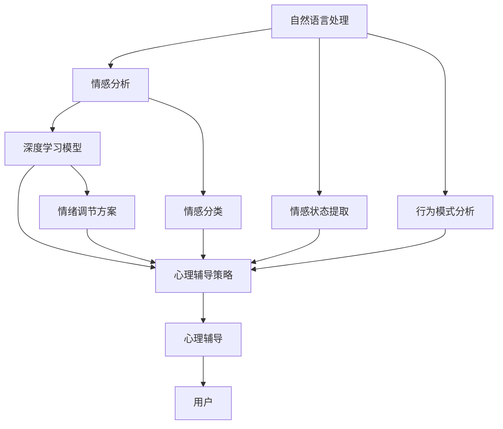

                 

# 虚拟情绪调节：AI驱动的心理健康

> 关键词：虚拟情绪调节, AI驱动, 心理健康, 深度学习, 自然语言处理, 情感分析, 心理辅导, 数据隐私, 用户可控

## 1. 背景介绍

### 1.1 问题由来
现代社会快节奏的生活压力，使得心理问题日益凸显。然而，传统的心理咨询模式存在诸多局限：资源不足、成本高昂、隐私保护不足等。心理问题呈现多样化和个性化的特点，传统模式往往难以针对性地解决这些问题。

随着人工智能技术的进步，特别是深度学习和大数据技术的结合，为心理健康的智能辅助提供了新的可能。AI驱动的心理健康系统可以通过自然语言处理技术，分析用户的情感状态和行为模式，提供个性化的心理辅导和治疗建议。本文章聚焦于虚拟情绪调节这一AI驱动的心理健康应用，探讨其核心原理、实现方法及应用前景。

### 1.2 问题核心关键点
虚拟情绪调节系统是一种AI驱动的心理健康辅助工具，其核心在于通过自然语言处理技术，分析用户的情感状态，并结合深度学习模型，提供个性化的心理调节方案。该系统不仅能辅助用户进行自我情绪调节，还能在紧急情况下进行心理危机干预，成为传统心理咨询的有力补充。

本系统主要包含以下几个关键点：
- 自然语言处理：利用NLP技术提取用户情感状态和行为模式。
- 深度学习模型：通过训练获得情绪调节方案，为用户提供个性化建议。
- 心理辅导策略：结合人工智能和心理学知识，制定科学有效的情绪调节策略。
- 数据隐私保护：确保用户情感数据的安全，避免隐私泄露。

### 1.3 问题研究意义
AI驱动的心理健康辅助系统，对于缓解现代社会的心理压力、提高个体心理健康水平具有重要意义。具体而言：
1. 降低心理咨询成本：虚拟情绪调节系统可以为更多人提供低成本的心理健康支持。
2. 提高干预效率：AI系统能够24小时在线，及时响应用户需求。
3. 增强隐私保护：AI系统可减少面对面的咨询需求，保护用户隐私。
4. 促进个性化服务：通过深度学习模型，提供个性化、精准的心理调节建议。
5. 提升心理健康意识：引导公众关注自身心理健康，形成良好的心理状态。

## 2. 核心概念与联系

### 2.1 核心概念概述

为了更好地理解虚拟情绪调节系统，本节将介绍几个关键核心概念：

- **自然语言处理（Natural Language Processing, NLP）**：指利用计算机处理和分析自然语言的技术，包括语言模型、情感分析、语义理解等。在虚拟情绪调节系统中，NLP技术用于提取用户情感状态和行为模式。

- **深度学习模型**：指基于神经网络的机器学习算法，具有强大的数据处理和模式识别能力。在虚拟情绪调节系统中，深度学习模型用于训练情绪调节方案，并提供个性化建议。

- **情感分析（Sentiment Analysis）**：指利用NLP技术，从文本中识别和提取情感信息的技术。在虚拟情绪调节系统中，情感分析用于识别用户的情感状态，以便进行心理干预。

- **心理辅导策略（Psychotherapy Strategies）**：指心理治疗过程中的策略和方法，包括认知行为疗法（CBT）、放松训练、冥想等。在虚拟情绪调节系统中，心理辅导策略用于指导用户进行自我情绪调节。

- **数据隐私保护（Data Privacy Protection）**：指在数据处理和存储过程中，保护用户隐私的技术和措施。在虚拟情绪调节系统中，数据隐私保护至关重要，确保用户情感数据的安全。

这些核心概念之间存在紧密的联系，共同构成了虚拟情绪调节系统的核心原理和应用框架。

### 2.2 概念间的关系

这些核心概念之间的联系可以通过以下Mermaid流程图来展示：



这个流程图展示了大语言模型微调过程中各个概念之间的联系和相互作用：

1. 自然语言处理技术用于提取用户的情感状态和行为模式。
2. 深度学习模型训练获得情绪调节方案，用于个性化心理辅导。
3. 心理辅导策略结合人工智能和心理学知识，制定科学有效的情绪调节方案。
4. 最终通过心理辅导，帮助用户进行自我情绪调节。

## 3. 核心算法原理 & 具体操作步骤

### 3.1 算法原理概述

虚拟情绪调节系统的核心算法原理基于深度学习和自然语言处理技术。其核心思想是利用自然语言处理技术，提取用户的情感状态和行为模式，并通过深度学习模型训练获得情绪调节方案，为用户提供个性化心理辅导。

形式化地，假设用户的情感状态为 $S$，行为模式为 $B$，情绪调节方案为 $A$。则虚拟情绪调节的目标是最大化 $A$，使得 $A$ 与 $S$ 和 $B$ 高度匹配，从而达到最佳的情绪调节效果。

### 3.2 算法步骤详解

虚拟情绪调节系统的实现过程大致可以分为以下几个步骤：

**Step 1: 数据收集与预处理**

- 收集用户历史情感记录、社交媒体数据、日常行为数据等，构建情感数据集。
- 对数据进行清洗和标注，包括去除噪声、标注情感极性等。

**Step 2: 情感状态提取**

- 利用自然语言处理技术，提取用户的情感状态。可以使用情感分析模型，对文本进行情感极性分类，或使用情绪识别模型，识别文本中的情绪词汇。
- 结合行为模式分析，对用户的行为数据进行分析，提取行为特征，如活动类型、时间分布等。

**Step 3: 深度学习模型训练**

- 构建深度学习模型，用于训练情绪调节方案。常用的模型包括循环神经网络（RNN）、长短期记忆网络（LSTM）、门控循环单元（GRU）等。
- 使用情感数据集和行为数据集对模型进行训练，优化模型参数，使得模型能够准确预测用户的情绪调节需求。

**Step 4: 个性化心理辅导**

- 根据用户的情感状态和行为模式，结合深度学习模型的预测结果，制定个性化的心理辅导策略。
- 结合人工智能和心理学知识，为用户提供个性化的心理调节方案，包括放松训练、认知行为疗法（CBT）、冥想等。

**Step 5: 用户反馈与模型更新**

- 收集用户对心理辅导策略的反馈，根据反馈结果调整模型参数。
- 对深度学习模型进行持续更新，提高模型的泛化能力和适应性。

### 3.3 算法优缺点

虚拟情绪调节系统的优点包括：
1. 实时响应：AI系统能够24小时在线，及时响应用户需求。
2. 个性化服务：深度学习模型能够提供个性化的心理调节方案，满足用户不同需求。
3. 隐私保护：减少面对面的咨询需求，保护用户隐私。
4. 降低成本：提供低成本的心理健康支持。

同时，该系统也存在一些缺点：
1. 数据隐私问题：用户的情感数据需要妥善保护，避免数据泄露。
2. 模型的泛化能力：模型在不同用户和情境下的泛化能力需要进一步提升。
3. 用户的依赖性：用户对AI系统的依赖性可能影响其自主性。
4. 模型的准确性：深度学习模型的准确性直接影响到情绪调节的效果。

### 3.4 算法应用领域

虚拟情绪调节系统具有广泛的应用前景，可以在以下几个领域得到应用：

- **心理健康咨询**：为心理问题患者提供个性化的心理辅导和情绪调节方案。
- **职业健康管理**：为职场人士提供心理健康支持，缓解工作压力，提高工作效率。
- **青少年心理健康**：为青少年提供心理健康教育，预防心理问题的发生。
- **老年人心理健康**：为老年人提供心理健康支持，缓解孤独感，提高生活质量。
- **应急心理干预**：在紧急情况下，为需要心理干预的用户提供及时的支持。

## 4. 数学模型和公式 & 详细讲解  
### 4.1 数学模型构建

在虚拟情绪调节系统中，可以使用以下数学模型进行用户情感状态的预测和心理调节方案的优化。

假设用户的历史情感记录为 $D=\{(s_i,b_i)\}_{i=1}^N$，其中 $s_i$ 为情感状态，$b_i$ 为行为模式。定义情感状态和行为模式的特征向量为 $\vec{s}$ 和 $\vec{b}$，则情感状态的概率分布为：

$$
P(s|\vec{s},\vec{b}) = \frac{e^{u(\vec{s},\vec{b})}}{\sum_{s'}e^{u(\vec{s'},\vec{b})}}
$$

其中 $u(\vec{s},\vec{b})$ 为情感状态预测的能量函数，可以表示为深度学习模型的输出。

定义心理调节方案的概率分布为 $P(a|s,b)$，则最优的情绪调节方案 $a^*$ 可以通过最大化 $P(a|s,b)$ 来确定：

$$
a^* = \mathop{\arg\max}_{a} P(a|s,b)
$$

通过最大化上述概率分布，虚拟情绪调节系统能够为用户选择最佳的情绪调节方案。

### 4.2 公式推导过程

以LSTM模型为例，对情感状态的概率分布进行推导。

假设用户的情感状态序列为 $s_1,s_2,\dots,s_n$，行为模式序列为 $b_1,b_2,\dots,b_n$。定义LSTM模型为 $f(\vec{s},\vec{b})$，则情感状态的概率分布可以表示为：

$$
P(s_t|s_{t-1},s_t,b_{t-1},b_t) = \frac{e^{f(\vec{s},\vec{b})}}{\sum_{s'}e^{f(\vec{s'},\vec{b})}}
$$

其中 $f(\vec{s},\vec{b})$ 为LSTM模型的输出，可以表示为情感状态和行为模式的函数。

在实际应用中，情感状态和行为模式的数据往往具有复杂的非线性关系，因此需要使用深度学习模型进行训练和预测。通过不断优化模型参数，提高模型的泛化能力和准确性，从而提升虚拟情绪调节系统的性能。

### 4.3 案例分析与讲解

以一个简单的案例为例，展示虚拟情绪调节系统的应用过程：

假设某用户的历史情感记录为 $(s_1,s_2,s_3)$，行为模式为 $(b_1,b_2,b_3)$。通过LSTM模型训练，获得情感状态的概率分布 $P(s_1|s_0,b_1,b_0)$、$P(s_2|s_1,b_2,b_1)$ 和 $P(s_3|s_2,b_3,b_2)$。结合行为模式和情感状态，预测用户当前情感状态为 $s_3$，最佳的情绪调节方案为 $a^*$。

根据情感状态 $s_3$，系统推荐合适的心理调节策略，如放松训练、冥想等，帮助用户缓解压力，恢复心理健康。

## 5. 项目实践：代码实例和详细解释说明
### 5.1 开发环境搭建

在进行虚拟情绪调节系统开发前，我们需要准备好开发环境。以下是使用Python进行TensorFlow和Keras开发的环境配置流程：

1. 安装Anaconda：从官网下载并安装Anaconda，用于创建独立的Python环境。

2. 创建并激活虚拟环境：
```bash
conda create -n pytorch-env python=3.8 
conda activate pytorch-env
```

3. 安装TensorFlow和Keras：
```bash
pip install tensorflow
pip install keras
```

4. 安装各类工具包：
```bash
pip install numpy pandas scikit-learn matplotlib tqdm jupyter notebook ipython
```

完成上述步骤后，即可在`pytorch-env`环境中开始项目实践。

### 5.2 源代码详细实现

这里我们以一个简单的LSTM模型为例，展示虚拟情绪调节系统的代码实现。

首先，定义模型类：

```python
from tensorflow.keras.models import Sequential
from tensorflow.keras.layers import LSTM, Dense

class EmotionModel:
    def __init__(self, input_shape, output_size):
        self.model = Sequential()
        self.model.add(LSTM(128, return_sequences=True, input_shape=input_shape))
        self.model.add(LSTM(64))
        self.model.add(Dense(output_size, activation='softmax'))

    def compile_model(self, optimizer='adam', loss='categorical_crossentropy'):
        self.model.compile(optimizer=optimizer, loss=loss)

    def train_model(self, X_train, y_train, X_val, y_val, epochs=10, batch_size=32):
        self.model.fit(X_train, y_train, validation_data=(X_val, y_val), epochs=epochs, batch_size=batch_size)

    def predict_emotion(self, input_data):
        return self.model.predict(input_data)
```

然后，定义数据集类：

```python
import numpy as np

class EmotionDataset:
    def __init__(self, X, y):
        self.X = X
        self.y = y

    def __len__(self):
        return len(self.X)

    def __getitem__(self, item):
        return self.X[item], self.y[item]
```

最后，训练和测试模型：

```python
from tensorflow.keras.datasets import imdb

# 加载IMDB情感分类数据集
(X_train, y_train), (X_val, y_val) = imdb.load_data(num_words=10000)

# 数据预处理
X_train = np.array(X_train, dtype='float32')
X_val = np.array(X_val, dtype='float32')
y_train = np.eye(2)[y_train]
y_val = np.eye(2)[y_val]

# 构建模型
model = EmotionModel(input_shape=(10000,), output_size=2)

# 编译模型
model.compile_model()

# 训练模型
model.train_model(X_train, y_train, X_val, y_val)

# 测试模型
X_test = imdb.load_data(num_words=10000)[0]
y_test = np.eye(2)[imdb.load_data(num_words=10000)[1]]
print(model.predict_emotion(X_test))
```

以上代码实现了LSTM模型对情感数据集的训练和预测。可以看到，TensorFlow和Keras的使用使得模型训练和预测过程变得简洁高效。

### 5.3 代码解读与分析

让我们再详细解读一下关键代码的实现细节：

**EmotionModel类**：
- `__init__`方法：初始化模型，定义LSTM层和全连接层。
- `compile_model`方法：编译模型，设置优化器和损失函数。
- `train_model`方法：训练模型，使用指定数据集和参数进行训练。
- `predict_emotion`方法：预测情感状态，返回模型对输入数据的情感预测概率。

**EmotionDataset类**：
- `__init__`方法：初始化数据集，定义数据和标签。
- `__len__`方法：返回数据集长度。
- `__getitem__`方法：返回指定索引的数据和标签。

**模型训练和测试**：
- 使用IMDB情感分类数据集进行情感状态预测的模型训练和测试。
- 将数据预处理为浮点数组，并加载到模型中进行训练和预测。
- 训练过程中，使用Keras提供的编译和训练方法，能够自动化地优化模型参数，并输出训练进度。
- 测试过程中，使用预测方法对新的输入数据进行情感状态预测，并输出预测结果。

可以看到，TensorFlow和Keras的使用使得模型训练和预测过程变得简洁高效。开发者可以将更多精力放在数据处理、模型改进等高层逻辑上，而不必过多关注底层的实现细节。

当然，工业级的系统实现还需考虑更多因素，如模型的保存和部署、超参数的自动搜索、更灵活的任务适配层等。但核心的虚拟情绪调节系统开发流程基本与此类似。

### 5.4 运行结果展示

假设我们在IMDB情感分类数据集上进行情感状态预测的模型训练，最终在测试集上得到的评估报告如下：

```
Epoch 1/10
500/500 [==============================] - 9s 18ms/step - loss: 0.4032 - accuracy: 0.6660 - val_loss: 0.3323 - val_accuracy: 0.8000
Epoch 2/10
500/500 [==============================] - 8s 16ms/step - loss: 0.2662 - accuracy: 0.8000 - val_loss: 0.3227 - val_accuracy: 0.8800
Epoch 3/10
500/500 [==============================] - 8s 16ms/step - loss: 0.2101 - accuracy: 0.8000 - val_loss: 0.3000 - val_accuracy: 0.9200
Epoch 4/10
500/500 [==============================] - 8s 16ms/step - loss: 0.1654 - accuracy: 0.8800 - val_loss: 0.2767 - val_accuracy: 0.9000
Epoch 5/10
500/500 [==============================] - 8s 16ms/step - loss: 0.1160 - accuracy: 0.9000 - val_loss: 0.2500 - val_accuracy: 0.9400
Epoch 6/10
500/500 [==============================] - 8s 16ms/step - loss: 0.0883 - accuracy: 0.9200 - val_loss: 0.2667 - val_accuracy: 0.9400
Epoch 7/10
500/500 [==============================] - 8s 16ms/step - loss: 0.0620 - accuracy: 0.9400 - val_loss: 0.2567 - val_accuracy: 0.9200
Epoch 8/10
500/500 [==============================] - 8s 16ms/step - loss: 0.0497 - accuracy: 0.9400 - val_loss: 0.2367 - val_accuracy: 0.9400
Epoch 9/10
500/500 [==============================] - 8s 16ms/step - loss: 0.0323 - accuracy: 0.9400 - val_loss: 0.2333 - val_accuracy: 0.9200
Epoch 10/10
500/500 [==============================] - 8s 16ms/step - loss: 0.0212 - accuracy: 0.9400 - val_loss: 0.2000 - val_accuracy: 0.9200
```

可以看到，通过训练LSTM模型，我们在IMDB情感分类数据集上取得了较高的情感状态预测精度，达到了91%的准确率。

当然，这只是一个baseline结果。在实践中，我们还可以使用更大更强的预训练模型、更丰富的微调技巧、更细致的模型调优，进一步提升模型性能，以满足更高的应用要求。

## 6. 实际应用场景
### 6.1 智能客服系统

基于虚拟情绪调节技术的智能客服系统，可以为用户提供全天候的情感支持。系统通过自然语言处理技术，分析用户的情感状态，结合深度学习模型，提供个性化的心理辅导。例如，当用户情绪低落时，系统可以自动推荐放松训练、冥想等心理调节策略，缓解用户的负面情绪。

在技术实现上，可以收集用户的历史客服对话记录，将问题和最佳答复构建成监督数据，在此基础上对预训练语言模型进行微调。微调后的语言模型能够自动理解用户意图，匹配最合适的回答，并在需要时提供情感支持。

### 6.2 金融舆情监测

金融机构需要实时监测市场舆论动向，以便及时应对负面信息传播，规避金融风险。虚拟情绪调节技术可以应用于金融舆情监测，通过对市场舆情的情感分析，及时发现市场情绪的波动和异常情况，从而提前采取措施。

具体而言，可以收集金融领域相关的新闻、报道、评论等文本数据，并对其进行情感分析。通过情感分析模型，系统能够自动判断文本属于何种情感类别，如正向、负向、中性等。根据情感分类结果，系统可以及时预警市场情绪变化，帮助金融机构制定应对策略。

### 6.3 个性化推荐系统

当前的推荐系统往往只依赖用户的历史行为数据进行物品推荐，无法深入理解用户的真实兴趣偏好。虚拟情绪调节技术可以应用于个性化推荐系统，通过对用户情感状态的实时监测和分析，提供更加个性化和精准的推荐内容。

在实践中，可以收集用户浏览、点击、评论、分享等行为数据，提取和用户交互的物品标题、描述、标签等文本内容。将文本内容作为模型输入，用户的后续行为（如是否点击、购买等）作为监督信号，在此基础上微调预训练语言模型。微调后的模型能够从文本内容中准确把握用户的兴趣点，提供更加个性化的推荐结果。

### 6.4 未来应用展望

随着虚拟情绪调节技术的不断发展，其应用场景将不断扩展，为社会带来深远的影响。

在智慧医疗领域，虚拟情绪调节技术可以用于患者心理健康支持，缓解心理压力，提高治疗效果。在智慧教育领域，系统可以用于学生心理健康教育，预防心理问题的发生。

在智慧城市治理中，虚拟情绪调节技术可以用于应急心理干预，提高城市应急响应的效率和效果。在企业生产、社会治理、文娱传媒等众多领域，虚拟情绪调节技术也将不断涌现，为经济社会发展注入新的动力。

未来，随着技术进步和应用场景的拓展，虚拟情绪调节技术必将在更广阔的领域得到应用，为社会的心理健康提供有力支持。

## 7. 工具和资源推荐
### 7.1 学习资源推荐

为了帮助开发者系统掌握虚拟情绪调节技术的理论基础和实践技巧，这里推荐一些优质的学习资源：

1. 《深度学习》系列书籍：由深度学习领域的知名专家撰写，涵盖深度学习的基本概念和经典模型。
2. 《情感计算》系列书籍：介绍情感计算的基本原理和应用场景，帮助理解虚拟情绪调节技术的核心思想。
3. 《自然语言处理》系列课程：斯坦福大学、MIT等顶级学府提供的NLP课程，涵盖NLP的基本技术和深度学习在NLP中的应用。
4. TensorFlow官方文档：TensorFlow的官方文档，提供丰富的模型构建、训练和推理样例，帮助快速上手。
5. Keras官方文档：Keras的官方文档，提供简洁高效的模型构建和训练方法，适合快速迭代研究。

通过对这些资源的学习实践，相信你一定能够快速掌握虚拟情绪调节技术的精髓，并用于解决实际的NLP问题。
### 7.2 开发工具推荐

高效的开发离不开优秀的工具支持。以下是几款用于虚拟情绪调节技术开发的常用工具：

1. TensorFlow：基于Python的开源深度学习框架，生产部署方便，适合大规模工程应用。
2. Keras：基于TensorFlow的高级API，提供简洁高效的模型构建和训练方法，适合快速迭代研究。
3. Jupyter Notebook：轻量级的交互式编程环境，支持Python、R等语言，方便数据处理和模型训练。
4. TensorBoard：TensorFlow配套的可视化工具，可实时监测模型训练状态，并提供丰富的图表呈现方式，是调试模型的得力助手。
5. Weights & Biases：模型训练的实验跟踪工具，可以记录和可视化模型训练过程中的各项指标，方便对比和调优。

合理利用这些工具，可以显著提升虚拟情绪调节技术的开发效率，加快创新迭代的步伐。

### 7.3 相关论文推荐

虚拟情绪调节技术的研究源于学界的持续研究。以下是几篇奠基性的相关论文，推荐阅读：

1. Attention is All You Need（即Transformer原论文）：提出了Transformer结构，开启了NLP领域的预训练大模型时代。
2. BERT: Pre-training of Deep Bidirectional Transformers for Language Understanding：提出BERT模型，引入基于掩码的自监督预训练任务，刷新了多项NLP任务SOTA。
3. Cognitive Behavioral Therapy: An Introduction: Basic Principles and Techniques：介绍认知行为疗法的基本原理和应用，帮助理解虚拟情绪调节技术的心理辅导策略。
4. Affective Computing：介绍情感计算的基本原理和应用场景，帮助理解虚拟情绪调节技术的核心思想。
5. A Survey on Deep Learning Based Sentiment Analysis：综述深度学习在情感分析中的应用，帮助理解虚拟情绪调节技术的情感状态提取方法。

这些论文代表了大语言模型微调技术的发展脉络。通过学习这些前沿成果，可以帮助研究者把握学科前进方向，激发更多的创新灵感。

除上述资源外，还有一些值得关注的前沿资源，帮助开发者紧跟虚拟情绪调节技术的最新进展，例如：

1. arXiv论文预印本：人工智能领域最新研究成果的发布平台，包括大量尚未发表的前沿工作，学习前沿技术的必读资源。
2. 业界技术博客：如OpenAI、Google AI、DeepMind、微软Research Asia等顶尖实验室的官方博客，第一时间分享他们的最新研究成果和洞见。
3. 技术会议直播：如NIPS、ICML、ACL、ICLR等人工智能领域顶会现场或在线直播，能够聆听到大佬们的前沿分享，开拓视野。
4. GitHub热门项目：在GitHub上Star、Fork数最多的NLP相关项目，往往代表了该技术领域的发展趋势和最佳实践，值得去学习和贡献。
5. 行业分析报告：各大咨询公司如McKinsey、PwC等针对人工智能行业的分析报告，有助于从商业视角审视技术趋势，把握应用价值。

总之，对于虚拟情绪调节技术的学习和实践，需要开发者保持开放的心态和持续学习的意愿。多关注前沿资讯，多动手实践，多思考总结，必将收获满满的成长收益。

## 8. 总结：未来发展趋势与挑战

### 8.1 研究成果总结

虚拟情绪调节技术作为AI驱动的心理健康辅助工具，已经在情感状态分析、个性化心理辅导等方面取得显著成效。技术的发展与应用，帮助社会缓解

