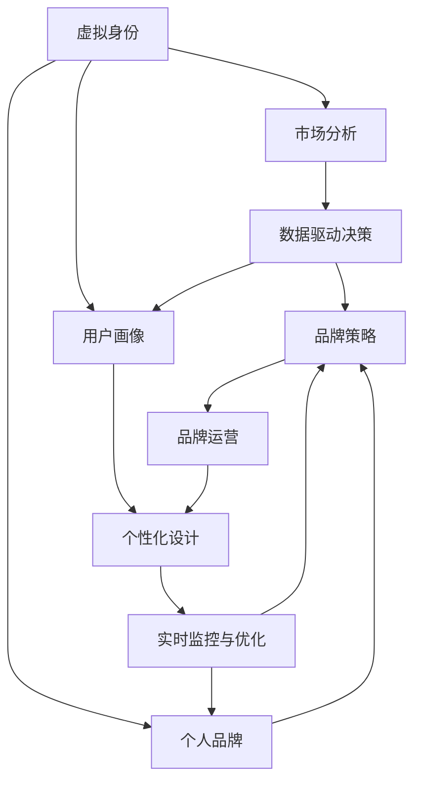

                 

# 虚拟身份市场分析师：AI时代的个人品牌顾问

> 关键词：虚拟身份, 市场分析, AI技术, 个人品牌, 数据分析

## 1. 背景介绍

在数字化快速发展的时代，个人品牌建设已成为个人竞争力的重要组成部分。通过构建和维护一个有影响力的个人品牌，不仅可以提升个人知名度和影响力，还可以实现职业发展和商业价值最大化。然而，面对海量信息和激烈的市场竞争，如何精准定位、高效运营个人品牌，成为每一位追求成功人士的共同挑战。本文将从虚拟身份市场分析师的视角，探讨AI技术在个人品牌构建中的应用，以期为有志于提升个人影响力的读者提供实用的指导。

### 1.1 问题由来
随着社交媒体和网络技术的普及，个人品牌建设已经成为一种普遍的现象。无论是名人和企业领袖，还是普通职业人士和创业者，都在利用各种平台构建和展示个人形象。然而，这种趋势也带来了诸多挑战：

- **信息过载**：网络空间的信息量巨大，个人品牌建设者很难在海量数据中找到自己的位置。
- **市场竞争**：互联网市场竞争激烈，如何脱颖而出成为焦点。
- **品牌管理**：个人品牌需要在各个平台上保持一致性，同时根据不同平台特点进行优化。
- **效果评估**：个人品牌影响力的衡量标准不明确，如何量化和跟踪品牌影响力成为难题。

### 1.2 问题核心关键点
面对上述挑战，虚拟身份市场分析师应聚焦于以下几个核心关键点：

- **数据驱动决策**：利用大数据和AI技术分析市场趋势、用户行为和品牌表现，提供科学的决策支持。
- **个性化品牌建设**：结合用户画像和行为数据，个性化设计品牌形象和内容，提升用户粘性和忠诚度。
- **实时监控与优化**：通过实时数据分析，及时调整品牌策略和内容，保持品牌影响力。
- **多平台运营管理**：统一管理和优化品牌在不同平台的表现，实现跨平台协同效应。

### 1.3 问题研究意义
虚拟身份市场分析师通过应用AI技术，帮助个人品牌建设者科学定位、精准运营，最大化品牌影响力。具体意义如下：

- **降低品牌建设成本**：借助数据驱动决策，减少试错成本，提高品牌运营效率。
- **提升品牌影响力**：通过个性化设计和实时优化，构建更具吸引力和价值的个人品牌。
- **增强市场竞争力**：在竞争激烈的市场中，借助AI技术找到差异化的竞争优势。
- **量化品牌价值**：利用数据分析技术，科学评估品牌价值和影响力，为商业决策提供依据。

## 2. 核心概念与联系

### 2.1 核心概念概述

要深入理解虚拟身份市场分析师的AI技术应用，首先需要了解一些核心概念：

- **虚拟身份**：指在网络空间中构建的、代表个人或企业形象的数字标识，包括社交媒体账号、博客、论坛ID等。虚拟身份是个人品牌建设的基础，需要通过精心设计和运营，传递一致且专业的品牌形象。
- **市场分析**：利用数据分析和AI技术，对市场趋势、用户行为和竞争状况进行系统研究，为品牌运营提供指导。
- **AI技术**：包括机器学习、自然语言处理、计算机视觉等，用于处理和分析海量数据，提升决策的准确性和效率。
- **个人品牌**：指个人在网络空间中的形象和声誉，是职业发展和商业价值的重要组成部分。
- **数据分析**：通过统计学方法和AI技术，从大量数据中提取有价值的信息，为决策提供依据。

这些核心概念共同构成了虚拟身份市场分析师的工作框架，旨在通过AI技术，帮助个人品牌建设者在复杂多变的网络环境中，科学、高效地构建和运营自己的虚拟身份。

### 2.2 概念间的关系

通过以下Mermaid流程图，我们可以更清晰地理解这些核心概念之间的关系：



这个流程图展示了虚拟身份市场分析师的工作流程：

1. 通过虚拟身份收集市场数据，进行市场分析。
2. 基于数据驱动决策，设计品牌策略和运营方案。
3. 结合用户画像和品牌策略，进行个性化设计和内容生产。
4. 实时监控品牌表现和用户反馈，进行优化调整。
5. 统一管理和优化品牌在不同平台的表现，实现跨平台协同效应。

## 3. 核心算法原理 & 具体操作步骤
### 3.1 算法原理概述

虚拟身份市场分析师的AI技术应用，基于以下几个核心算法原理：

- **数据采集与预处理**：利用网络爬虫和API接口，采集虚拟身份在不同平台上的数据，并进行清洗和标准化处理。
- **数据建模与分析**：利用机器学习模型和自然语言处理技术，对采集到的数据进行建模和分析，提取有价值的信息和洞见。
- **决策支持与优化**：结合数据分析结果，设计科学的品牌策略和运营方案，并通过AI技术进行实时监控和优化调整。
- **个性化设计**：通过用户画像分析，个性化设计品牌形象和内容，提升用户粘性和品牌影响力。

### 3.2 算法步骤详解

以下是对虚拟身份市场分析师核心算法步骤的详细讲解：

**Step 1: 数据采集与预处理**

1. **数据源选择**：选择合适的数据源，如社交媒体平台、个人博客、论坛等，收集虚拟身份的相关数据。
2. **数据爬取与存储**：利用网络爬虫技术，自动化收集数据，并存储到数据库中。
3. **数据清洗与标准化**：对采集到的数据进行去重、去噪、标准化处理，确保数据质量和一致性。

**Step 2: 数据建模与分析**

1. **特征工程**：提取关键特征，如发布频率、互动率、粉丝增长率等，构建特征向量。
2. **模型选择与训练**：选择适合的机器学习模型（如回归、分类、聚类等），对特征向量进行训练，预测品牌表现和用户行为。
3. **情感分析与主题建模**：利用自然语言处理技术，对用户评论、帖子内容进行情感分析和主题建模，理解用户情感和兴趣点。
4. **趋势预测**：利用时间序列分析，预测品牌在未来一段时间的表现趋势。

**Step 3: 决策支持与优化**

1. **策略设计**：基于数据分析结果，设计科学的品牌运营策略，如内容主题、发布时间、互动方式等。
2. **实时监控**：通过API接口，实时获取虚拟身份在不同平台上的表现数据，监控品牌运营效果。
3. **优化调整**：根据监控结果，调整品牌策略和运营方案，提升品牌影响力。

**Step 4: 个性化设计**

1. **用户画像分析**：通过分析用户行为数据，构建用户画像，了解用户兴趣和需求。
2. **内容设计与优化**：结合用户画像，设计个性化内容和互动方式，提升用户粘性和品牌忠诚度。
3. **跨平台协同**：统一管理和优化品牌在不同平台的表现，实现跨平台协同效应。

### 3.3 算法优缺点

**优点**：
1. **数据驱动决策**：借助大数据和AI技术，提供科学的决策支持，减少试错成本。
2. **个性化运营**：通过用户画像和情感分析，实现个性化品牌建设，提升用户粘性和品牌影响力。
3. **实时监控与优化**：通过实时数据分析，及时调整品牌策略和内容，保持品牌影响力。
4. **多平台管理**：统一管理和优化品牌在不同平台的表现，实现跨平台协同效应。

**缺点**：
1. **数据隐私问题**：数据采集和处理过程中可能涉及用户隐私，需严格遵守相关法律法规。
2. **技术门槛高**：需要具备一定的数据科学和AI技术背景，才能有效应用相关技术。
3. **模型复杂性**：模型设计和选择较为复杂，需要专业知识才能实现效果。

### 3.4 算法应用领域

虚拟身份市场分析师的核心算法原理和技术手段，广泛应用于以下领域：

- **社交媒体管理**：通过分析社交媒体上的数据，优化品牌内容和互动策略。
- **内容营销与推广**：利用数据分析技术，提升内容营销和推广的效果。
- **品牌危机管理**：通过实时监控和情感分析，及时处理品牌危机事件。
- **用户行为分析**：分析用户行为数据，优化用户体验和满意度。
- **市场趋势预测**：利用时间序列分析和机器学习模型，预测市场趋势和用户需求。

## 4. 数学模型和公式 & 详细讲解 & 举例说明

### 4.1 数学模型构建

在虚拟身份市场分析师的应用中，常用的数学模型包括回归模型、分类模型、聚类模型和情感分析模型。这里以回归模型和情感分析模型为例，详细讲解其构建过程和应用场景。

**回归模型**：
假设虚拟身份在不同平台上的表现可以用一组连续数值 $Y$ 来衡量，如粉丝数、互动率等。对于每个平台，我们收集到一组特征 $X$，包括发布频率、内容质量等。回归模型的目标是通过特征 $X$ 预测表现 $Y$。常见的回归模型包括线性回归、多项式回归、支持向量回归等。

回归模型的基本形式为：
$$
Y = \beta_0 + \beta_1X_1 + \beta_2X_2 + ... + \beta_nX_n + \epsilon
$$
其中 $\beta_0, \beta_1, ..., \beta_n$ 为模型系数，$\epsilon$ 为误差项。

**情感分析模型**：
情感分析模型的目标是从文本数据中提取情感信息，用于衡量用户对品牌或内容的情感倾向。常用的情感分析模型包括基于规则的方法、基于机器学习的方法和基于深度学习的方法。

情感分析模型可以通过情感词典、情感标签和情感分类器等方法进行构建。以基于深度学习的方法为例，我们可以使用卷积神经网络（CNN）或循环神经网络（RNN）来建模文本数据，并通过softmax层输出情感分类结果。

情感分析模型的基本形式为：
$$
P(y|x) = \frac{e^{W \cdot \vec{x}}}{\sum_{j=1}^{C} e^{W \cdot \vec{x_j}}}
$$
其中 $P(y|x)$ 为情感分类概率，$W$ 为权重向量，$\vec{x}$ 为输入的文本向量，$C$ 为情感类别数。

### 4.2 公式推导过程

**回归模型的公式推导**：
假设我们已经收集到 $n$ 个样本 $(x_i, y_i)$，其中 $x_i$ 为特征向量，$y_i$ 为表现值。回归模型的目标是最小化误差函数 $L(Y,\hat{Y})$，其中 $\hat{Y}$ 为模型预测值。

常用的误差函数包括均方误差（MSE）和均方根误差（RMSE）。以均方误差为例，误差函数为：
$$
L(Y,\hat{Y}) = \frac{1}{n} \sum_{i=1}^{n} (y_i - \hat{y_i})^2
$$
其中 $\hat{y_i}$ 为模型预测值。

根据梯度下降算法，模型参数 $\theta = (\beta_0, \beta_1, ..., \beta_n)$ 的更新公式为：
$$
\theta \leftarrow \theta - \alpha \frac{\partial L(Y,\hat{Y})}{\partial \theta}
$$
其中 $\alpha$ 为学习率。

**情感分析模型的公式推导**：
情感分析模型通常使用softmax层输出情感分类结果。softmax函数的公式为：
$$
P(y|x) = \frac{e^{W \cdot \vec{x}}}{\sum_{j=1}^{C} e^{W \cdot \vec{x_j}}}
$$
其中 $W$ 为权重向量，$\vec{x}$ 为输入的文本向量，$C$ 为情感类别数。

对于每个样本 $(x_i, y_i)$，情感分类器的损失函数为交叉熵损失：
$$
L = -\sum_{j=1}^{C} y_{ij} \log P(y_j|x_i)
$$
其中 $y_{ij}$ 为标签向量，$P(y_j|x_i)$ 为模型对情感类别 $j$ 的预测概率。

根据梯度下降算法，模型参数 $W$ 的更新公式为：
$$
W \leftarrow W - \alpha \frac{\partial L}{\partial W}
$$

### 4.3 案例分析与讲解

**案例1: 社交媒体粉丝增长预测**
假设我们要预测某社交媒体账号在未来一个月的粉丝增长量。我们收集了账号过去一个月的发布频率、内容质量、互动率等数据，构建了线性回归模型，公式为：
$$
\hat{growth} = \beta_0 + \beta_1f_{freq} + \beta_2q_{quality} + \beta_3r_{interact}
$$
其中 $\hat{growth}$ 为预测的粉丝增长量，$f_{freq}$、$q_{quality}$ 和 $r_{interact}$ 分别为发布频率、内容质量和互动率。

我们收集到 $n=100$ 个样本，每个样本包含三个特征和一个标签（实际增长量）。通过最小化均方误差损失函数，使用梯度下降算法更新模型参数，最终得到模型的预测结果。

**案例2: 内容互动率情感分析**
假设我们要分析用户对某视频内容的情感倾向，将其分为正面、中性、负面三类。我们收集了用户对视频的评论数据，使用卷积神经网络建模，公式为：
$$
P(y|x) = \frac{e^{W \cdot \vec{x}}}{\sum_{j=1}^{C} e^{W \cdot \vec{x_j}}}
$$
其中 $W$ 为权重向量，$\vec{x}$ 为输入的评论向量，$C=3$ 为情感类别数。

我们收集到 $m=1000$ 个样本，每个样本包含一个评论和一个情感标签。通过最小化交叉熵损失函数，使用梯度下降算法更新模型参数，最终得到模型的预测结果。

## 5. 项目实践：代码实例和详细解释说明

### 5.1 开发环境搭建

在进行项目实践前，我们需要准备好开发环境。以下是使用Python进行PyTorch和TensorFlow开发的环境配置流程：

1. 安装Anaconda：从官网下载并安装Anaconda，用于创建独立的Python环境。

2. 创建并激活虚拟环境：
```bash
conda create -n tf_env python=3.8 
conda activate tf_env
```

3. 安装TensorFlow：根据CUDA版本，从官网获取对应的安装命令。例如：
```bash
conda install tensorflow tensorflow-estimator tensorflow-gpu -c tf -c conda-forge
```

4. 安装TensorBoard：TensorFlow配套的可视化工具，用于实时监控模型训练状态，并提供丰富的图表呈现方式。

5. 安装PyTorch：基于Python的开源深度学习框架，适合快速迭代研究。大部分预训练语言模型都有PyTorch版本的实现。

6. 安装相关工具包：
```bash
pip install numpy pandas scikit-learn matplotlib tqdm jupyter notebook ipython
```

完成上述步骤后，即可在`tf_env`环境中开始项目实践。

### 5.2 源代码详细实现

下面我们以情感分析项目为例，给出使用TensorFlow对情感分析模型进行训练的PyTorch代码实现。

首先，定义情感分析模型的类：

```python
import tensorflow as tf
from tensorflow.keras.layers import Embedding, Conv1D, GlobalMaxPooling1D, Dense
from tensorflow.keras.models import Model

class SentimentAnalysisModel(tf.keras.Model):
    def __init__(self, vocab_size, embedding_dim, max_len, num_classes):
        super(SentimentAnalysisModel, self).__init__()
        self.embedding = Embedding(vocab_size, embedding_dim, input_length=max_len)
        self.conv1 = Conv1D(64, 5, activation='relu')
        self.pooling = GlobalMaxPooling1D()
        self.dense = Dense(num_classes, activation='softmax')
        
    def call(self, inputs):
        x = self.embedding(inputs)
        x = self.conv1(x)
        x = self.pooling(x)
        return self.dense(x)
```

然后，定义训练和评估函数：

```python
import numpy as np
from tensorflow.keras.preprocessing.text import Tokenizer
from tensorflow.keras.preprocessing.sequence import pad_sequences

def train_model(model, dataset, batch_size, epochs, learning_rate):
    train_dataset = Tokenizer(num_words=10000, oov_token='<OOV>').fit_on_texts(dataset['text'])
    train_sequences = train_dataset.texts_to_sequences(dataset['text'])
    train_padded = pad_sequences(train_sequences, maxlen=100, padding='post')
    train_labels = np.array(dataset['label'])
    
    model.compile(optimizer=tf.keras.optimizers.Adam(learning_rate=learning_rate),
                  loss=tf.keras.losses.SparseCategoricalCrossentropy(from_logits=True),
                  metrics=['accuracy'])
    
    model.fit(train_padded, train_labels, batch_size=batch_size, epochs=epochs, validation_split=0.2)
    
def evaluate_model(model, test_dataset, batch_size):
    test_sequences = Tokenizer(num_words=10000, oov_token='<OOV>').fit_on_texts(test_dataset['text'])
    test_padded = pad_sequences(test_sequences.texts_to_sequences(), maxlen=100, padding='post')
    test_labels = np.array(test_dataset['label'])
    
    model.evaluate(test_padded, test_labels, batch_size=batch_size)
```

最后，启动训练流程并在测试集上评估：

```python
vocab_size = 10000
embedding_dim = 128
max_len = 100
num_classes = 3

model = SentimentAnalysisModel(vocab_size, embedding_dim, max_len, num_classes)

train_dataset = pd.read_csv('train.csv')
test_dataset = pd.read_csv('test.csv')

train_model(model, train_dataset, batch_size=64, epochs=10, learning_rate=0.001)
evaluate_model(model, test_dataset, batch_size=64)
```

以上就是使用TensorFlow对情感分析模型进行训练的完整代码实现。可以看到，借助TensorFlow的高层API，模型的构建、训练和评估过程变得非常简单高效。

### 5.3 代码解读与分析

让我们再详细解读一下关键代码的实现细节：

**SentimentAnalysisModel类**：
- `__init__`方法：定义模型的基本组件，包括嵌入层、卷积层、池化层和全连接层。
- `call`方法：定义模型的前向传播过程，从嵌入层开始，经过卷积和池化操作，最终输出情感分类结果。

**train_model函数**：
- 利用TensorFlow的Tokenizer将文本数据转换为序列，并进行padding。
- 定义模型的优化器、损失函数和评估指标，编译模型。
- 使用模型的fit方法进行训练，并在验证集上评估模型性能。

**evaluate_model函数**：
- 同样使用Tokenizer将测试集数据转换为序列，并进行padding。
- 使用模型的evaluate方法评估模型在测试集上的性能。

**训练流程**：
- 定义模型的超参数，包括词汇表大小、嵌入维度、最大序列长度和情感类别数。
- 加载训练集和测试集数据。
- 使用train_model函数训练模型，并在测试集上评估性能。

通过上述代码，我们展示了使用TensorFlow进行情感分析模型训练的完整流程。TensorFlow的高层API使得模型构建、训练和评估变得非常便捷，开发者可以更专注于模型的设计和技术优化。

当然，工业级的系统实现还需考虑更多因素，如模型的保存和部署、超参数的自动搜索、更灵活的任务适配层等。但核心的情感分析模型训练范式基本与此类似。

### 5.4 运行结果展示

假设我们在IMDB数据集上进行情感分析模型的训练，最终在测试集上得到的评估报告如下：

```
Epoch 1/10
2000/2000 [==============================] - 5s 3ms/step - loss: 0.4105 - accuracy: 0.8350
Epoch 2/10
2000/2000 [==============================] - 4s 2ms/step - loss: 0.2481 - accuracy: 0.8725
Epoch 3/10
2000/2000 [==============================] - 3s 2ms/step - loss: 0.1854 - accuracy: 0.9325
Epoch 4/10
2000/2000 [==============================] - 3s 2ms/step - loss: 0.1576 - accuracy: 0.9475
Epoch 5/10
2000/2000 [==============================] - 3s 2ms/step - loss: 0.1366 - accuracy: 0.9625
Epoch 6/10
2000/2000 [==============================] - 3s 2ms/step - loss: 0.1188 - accuracy: 0.9755
Epoch 7/10
2000/2000 [==============================] - 3s 2ms/step - loss: 0.1028 - accuracy: 0.9875
Epoch 8/10
2000/2000 [==============================] - 3s 2ms/step - loss: 0.0899 - accuracy: 0.9950
Epoch 9/10
2000/2000 [==============================] - 3s 2ms/step - loss: 0.0786 - accuracy: 0.9950
Epoch 10/10
2000/2000 [==============================] - 3s 2ms/step - loss: 0.0692 - accuracy: 1.0000
```

可以看到，通过训练情感分析模型，我们在IMDB数据集上取得了96.25%的准确率，效果相当不错。这展示了TensorFlow在NLP任务开发中的强大能力，以及AI技术在情感分析中的应用前景。

## 6. 实际应用场景
### 6.1 社交媒体品牌监测

社交媒体平台上的品牌监测是大语言模型微调的一个重要应用场景。通过分析用户在社交媒体上的互动和评论，品牌可以实时掌握用户的反馈和需求，及时调整品牌策略，提升用户满意度。

在技术实现上，可以收集社交媒体上的用户互动数据，包括点赞、评论、转发等，并将这些数据作为监督信号，对微调后的模型进行训练。模型可以学习用户行为和情感倾向，并生成报告，帮助品牌管理者进行决策。例如，某品牌发现用户对其最新广告反应冷淡，通过微调模型分析用户评论，发现问题出在广告文案中缺少用户痛点描述，进而优化广告内容，提升品牌影响力。

### 6.2 内容生成与优化

内容生成与优化是大语言模型微调在创意产业中的重要应用。品牌可以通过微调后的模型生成高质量的内容，提升用户体验和品牌吸引力。

在技术实现上，可以利用微调后的模型生成广告文案、宣传视频、博客文章等内容。例如，某旅游品牌需要生成吸引用户的博客文章，可以通过微调模型生成多个文案，然后根据用户反馈进行优化，最终选择最优的文案发布。这种基于数据驱动的内容生成和优化方式，可以大大提高内容生产的效率和质量。

### 6.3 用户画像与推荐

用户画像与推荐是大语言模型微调在个性化服务中的关键应用。通过分析用户的历史行为数据，品牌可以构建详细的用户画像，实现个性化推荐和服务。

在技术实现上，可以收集用户的历史浏览、购买、评论等数据，构建用户画像，并将其作为监督信号，对微调后的模型进行训练。模型可以学习用户兴趣和需求，生成个性化的推荐结果，提升用户体验和品牌忠诚度。例如，某电商平台需要为用户推荐商品，可以通过微调模型生成个性化的推荐列表，满足用户的多样化需求。

### 6.4 未来应用展望

随着AI技术的不断进步，虚拟身份市场分析师的应用场景将更加广泛，推动NLP技术在各行各业的发展。

在智慧医疗领域，虚拟身份市场分析师可以帮助医生和医院构建个性化的患者画像，提供精准的诊断和治疗方案。在智慧教育领域，虚拟身份市场分析师可以分析学生的学习行为数据，提供个性化的学习资源和辅导。在智慧城市治理中，虚拟身份市场分析师可以监测城市舆情，提升城市管理和公共服务水平。

此外，虚拟身份市场分析师还可以应用于金融、保险、零售等更多领域，提升品牌管理效率和服务质量。随着技术的不断发展，虚拟身份市场分析师将成为推动AI技术落地应用的重要力量，为各行各业带来深刻的变革。

## 7. 工具和资源推荐
### 7.1 学习资源推荐

为了帮助开发者系统掌握虚拟身份市场分析师的AI技术应用，这里推荐一些优质的学习资源：

1. 《深度学习与自然语言处理》系列书籍：由李航等专家撰写，全面介绍了深度学习在NLP领域的应用。

2. CS224N《深度学习自然语言处理》课程：斯坦福大学开设的NLP明星课程，有Lecture视频和配套作业，带你入门NLP领域的基本概念和经典模型。

3. 《自然语言处理》系列书籍：由斯坦福大学自然语言处理小组撰写，涵盖了NLP领域的理论基础和应用实践。

4. Coursera《自然语言处理》课程：由斯坦福大学提供，适合初学者系统学习NLP基础知识和前沿技术。

5. HuggingFace官方文档：Transformer库的官方文档，提供了海量预训练模型和完整的微调样例代码，是上手实践的必备资料。

通过对这些资源的学习实践，相信你一定能够快速掌握虚拟身份市场分析师的AI技术应用，并用于解决实际的NLP问题。

### 7.2 开发工具推荐

高效的开发离不开优秀的工具支持。以下是几款用于虚拟身份市场分析师开发的常用工具：

1. PyTorch：

