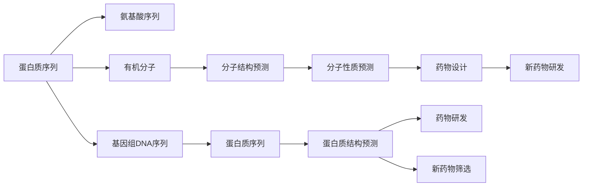
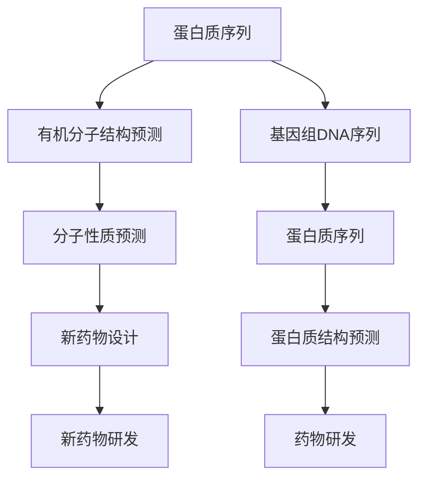
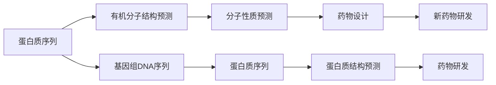
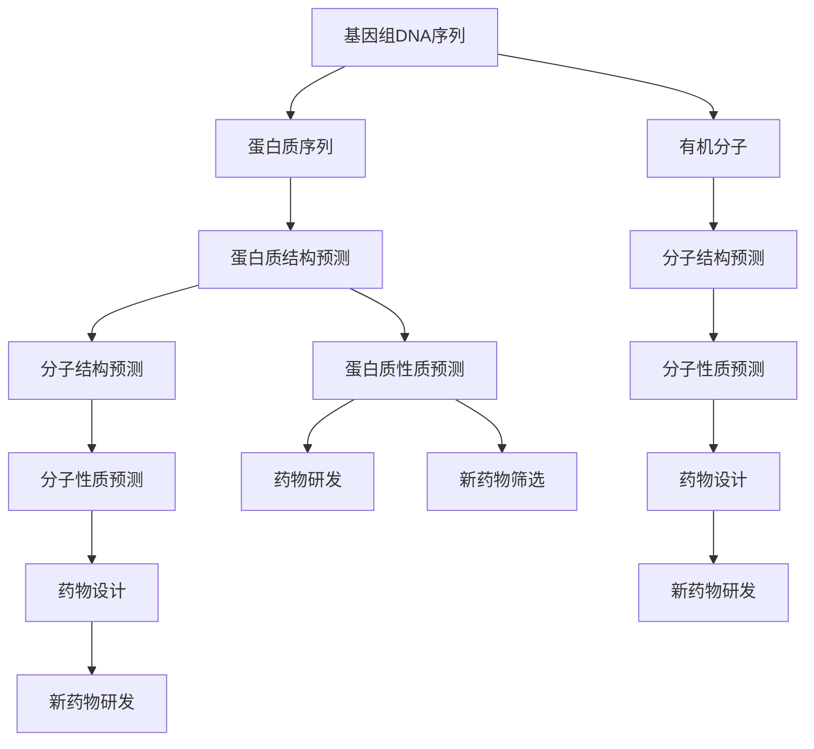

                 

## 1. 背景介绍

### 1.1 问题由来
蛋白质序列与有机分子的基础模型研究在生物信息学和有机化学领域具有重要意义。近年来，随着深度学习技术的快速发展，基于深度学习的方法被广泛应用到蛋白质序列与有机分子结构预测、药物设计等领域，取得了显著的进展。深度学习模型能够从大量数据中学习到复杂的高阶特征，预测分子结构，大大提高了研究的效率和精度。

然而，现有深度学习方法面临诸多挑战：

1. **数据稀缺性**：蛋白质序列与有机分子数据集通常较小，数据标注成本高，限制了模型泛化能力的提升。
2. **序列长度限制**：序列数据长度往往超过神经网络模型处理的限制，需要通过截断、填充等方式处理。
3. **任务多样性**：不同任务（如结构预测、性质预测、药物设计等）的数据分布、特征空间等差异较大，需要针对性地设计和优化模型。
4. **计算资源需求**：深度学习模型参数量庞大，训练和推理需要高计算资源，影响实际应用。

为解决这些问题，本文重点介绍一种基于深度学习的方法——变分自编码器(VAE)，并探索其在蛋白质序列与有机分子基础模型中的应用。

### 1.2 问题核心关键点
变分自编码器(VAE)是一种生成模型，通过学习数据的概率分布，实现数据的压缩与重构。在蛋白质序列与有机分子模型中，VAE可以用于蛋白质序列生成、结构预测、分子性质预测、药物设计等任务。

VAE的核心思想是将输入数据压缩到一个低维潜空间，然后通过解码器从潜空间中重构原始数据。训练过程中，通过最大化生成数据的似然度，最小化潜在空间的重构误差，实现数据压缩和重构的目标。

VAE的关键组件包括：

1. **编码器(Encoder)**：将输入数据映射到潜在空间，输出潜在编码向量。
2. **解码器(Decoder)**：从潜在编码向量重构原始数据。
3. **潜在空间(Potential Space)**：数据的低维表示，用于数据的压缩与重构。
4. **潜在分布(Potential Distribution)**：潜在空间的概率分布，如高斯分布。
5. **重构损失(Reconstruction Loss)**：编码器和解码器之间的重构误差，衡量重构的质量。
6. **潜在损失(Potential Loss)**：潜在空间的重构误差，衡量潜在表示的质量。

VAE的训练目标是最小化以下损失函数：

$$
L = E_{q(z|x)}[\log p(x|z)] + D_{KL}(q(z|x)||p(z))
$$

其中，$p(x|z)$为解码器输出的似然分布，$q(z|x)$为编码器输出的潜在分布，$D_{KL}$为KL散度，用于衡量潜在分布和先验分布的差异。

## 2. 核心概念与联系

### 2.1 核心概念概述

为更好地理解VAE在蛋白质序列与有机分子基础模型中的应用，本节将介绍几个密切相关的核心概念：

- **蛋白质序列**：由氨基酸序列组成，是生命体的基本组成单元。蛋白质序列可以通过基因组DNA序列推导得到。
- **有机分子**：由原子或基团组成的化学实体，具有独特的化学和物理性质。有机分子的结构与性质对其应用有重要影响。
- **分子结构预测**：通过计算机算法预测有机分子的三维结构，是药物设计和分子设计的重要步骤。
- **分子性质预测**：预测有机分子的物理、化学和生物性质，对新材料研发和新药物设计具有重要意义。
- **蛋白质结构预测**：预测蛋白质分子的三维结构，是理解蛋白质功能、设计新药物的重要基础。
- **药物设计**：利用计算机算法设计新药物分子，用于治疗疾病。

这些核心概念之间的逻辑关系可以通过以下Mermaid流程图来展示：



这个流程图展示了大分子序列与有机分子模型中的核心概念及其之间的关系：

1. 蛋白质序列可以通过基因组DNA序列推导得到。
2. 蛋白质和有机分子可以用于分子结构预测和性质预测。
3. 分子结构预测和性质预测的结果可以用于药物设计和新药物研发。
4. 蛋白质结构预测可以帮助理解蛋白质功能，促进新药物研发。

### 2.2 概念间的关系

这些核心概念之间存在着紧密的联系，形成了蛋白质序列与有机分子基础模型的完整生态系统。下面我们通过几个Mermaid流程图来展示这些概念之间的关系。

#### 2.2.1 分子结构预测



这个流程图展示了分子结构预测的基本原理，以及它与其他概念的关系。

#### 2.2.2 分子性质预测



这个流程图展示了分子性质预测的基本原理，以及它与其他概念的关系。

#### 2.2.3 药物设计


这个流程图展示了药物设计的基本原理，以及它与其他概念的关系。

### 2.3 核心概念的整体架构

最后，我们用一个综合的流程图来展示这些核心概念在蛋白质序列与有机分子基础模型中的整体架构：



这个综合流程图展示了从基因组DNA序列到药物研发的全流程，以及各步骤间的联系和关系。通过这些流程图，我们可以更清晰地理解蛋白质序列与有机分子基础模型的核心概念及其之间的关系。

## 3. 核心算法原理 & 具体操作步骤

### 3.1 算法原理概述

基于VAE的蛋白质序列与有机分子基础模型，其主要思想是通过学习分子序列的概率分布，实现分子序列的生成和重构。在训练过程中，VAE通过最大化生成数据的似然度，最小化潜在空间的重构误差，从而学习到高质量的分子序列表示。

### 3.2 算法步骤详解

基于VAE的蛋白质序列与有机分子基础模型的训练和推理步骤如下：

1. **数据准备**：收集蛋白质序列与有机分子序列数据集，并进行预处理，如去除噪声、截断、填充等。

2. **构建编码器**：设计编码器网络结构，将输入数据映射到潜在空间，输出潜在编码向量。

3. **构建解码器**：设计解码器网络结构，从潜在编码向量重构原始数据。

4. **训练模型**：使用数据集对VAE模型进行训练，最小化生成数据的似然度，最大化潜在空间的重构误差。

5. **生成和重构**：使用训练好的VAE模型对新的分子序列进行生成和重构，验证模型性能。

### 3.3 算法优缺点

基于VAE的蛋白质序列与有机分子基础模型具有以下优点：

- **非监督学习**：VAE通过学习数据的概率分布进行数据压缩与重构，无需标注数据，数据获取成本低。
- **生成能力**：VAE能够生成新的分子序列，为分子设计和新药物研发提供新思路。
- **低维表示**：VAE通过学习分子序列的低维表示，能够捕捉分子序列的高阶特征，提升预测精度。
- **可扩展性**：VAE能够处理任意长度的分子序列，适用于不同任务和不同数据集。

然而，基于VAE的蛋白质序列与有机分子基础模型也存在一些局限性：

- **模型复杂**：VAE模型参数量较大，训练和推理需要高计算资源。
- **生成质量**：VAE生成的分子序列可能存在高维空间中的模式丢失，生成质量有待提高。
- **先验知识**：VAE缺乏先验知识，无法利用领域专家的经验和规则进行指导。

### 3.4 算法应用领域

基于VAE的蛋白质序列与有机分子基础模型在多个领域具有广泛的应用前景，例如：

- **蛋白质序列生成**：生成新的蛋白质序列，用于理解蛋白质功能和设计新药物。
- **分子结构预测**：预测分子三维结构，为新药物研发提供重要参考。
- **分子性质预测**：预测分子的物理、化学和生物性质，加速新材料研发。
- **药物设计**：设计新的药物分子，用于治疗疾病。
- **新药物筛选**：通过模拟分子与生物体的相互作用，筛选潜在药物分子。

## 4. 数学模型和公式 & 详细讲解 & 举例说明

### 4.1 数学模型构建

基于VAE的蛋白质序列与有机分子基础模型主要包括以下几个数学模型：

- **分子序列模型**：描述分子序列的生成过程，如隐马尔可夫模型、递归神经网络等。
- **潜在空间模型**：描述分子序列的低维表示，如高斯分布、变分自编码器等。
- **解码器模型**：描述从潜在空间重构原始分子序列的过程，如全连接神经网络、卷积神经网络等。
- **重构损失模型**：描述编码器和解码器之间的重构误差，如均方误差、交叉熵等。
- **潜在损失模型**：描述潜在空间的重构误差，如KL散度等。

以蛋白质序列为例，分子序列模型可以表示为：

$$
P(x_t|x_{t-1}) = \sigma(W_t \cdot [x_{t-1}, h_{t-1}])
$$

其中，$x_t$为第$t$个氨基酸，$h_{t-1}$为前一个氨基酸的表示，$W_t$为权重矩阵，$\sigma$为激活函数。

潜在空间模型可以表示为：

$$
q(z|x) = N(\mu(x), \sigma^2(x))
$$

其中，$z$为潜在编码向量，$\mu(x)$和$\sigma^2(x)$分别为潜在编码向量的均值和方差，$N$表示高斯分布。

解码器模型可以表示为：

$$
P(x_t|z, x_{t-1}) = \sigma(W_t \cdot [z, x_{t-1}, h_{t-1}])
$$

其中，$W_t$为权重矩阵，$\sigma$为激活函数。

重构损失模型可以表示为：

$$
L_{rec} = \frac{1}{N}\sum_{i=1}^{N} \sum_{j=1}^{M} (x_{i,j} - \hat{x}_{i,j})^2
$$

其中，$x_{i,j}$为原始分子序列的第$i$个氨基酸的第$j$个残基，$\hat{x}_{i,j}$为重构后的分子序列的第$i$个氨基酸的第$j$个残基。

潜在损失模型可以表示为：

$$
L_{pot} = \frac{1}{N}\sum_{i=1}^{N} KL(q(z_i|x_i)||p(z_i))
$$

其中，$z_i$为分子序列第$i$个氨基酸的潜在编码向量，$K$为KL散度，$p(z_i)$为潜在编码向量的先验分布。

### 4.2 公式推导过程

以下我们以蛋白质序列为例，推导VAE模型训练时的目标函数和优化过程。

假设分子序列模型为$P(x_t|x_{t-1})$，潜在空间模型为$q(z|x)$，解码器模型为$P(x_t|z, x_{t-1})$。设分子序列长度为$L$，分子序列为$x=[x_1, x_2, ..., x_L]$，潜在编码向量为$z=[z_1, z_2, ..., z_L]$。

VAE的目标函数为：

$$
L = L_{rec} + \beta L_{pot}
$$

其中，$L_{rec}$为重构损失，$L_{pot}$为潜在损失，$\beta$为潜在损失的权重。

重构损失$L_{rec}$可以表示为：

$$
L_{rec} = \frac{1}{N}\sum_{i=1}^{N} \sum_{j=1}^{M} (x_{i,j} - \hat{x}_{i,j})^2
$$

其中，$x_{i,j}$为原始分子序列的第$i$个氨基酸的第$j$个残基，$\hat{x}_{i,j}$为重构后的分子序列的第$i$个氨基酸的第$j$个残基。

潜在损失$L_{pot}$可以表示为：

$$
L_{pot} = \frac{1}{N}\sum_{i=1}^{N} KL(q(z_i|x_i)||p(z_i))
$$

其中，$z_i$为分子序列第$i$个氨基酸的潜在编码向量，$K$为KL散度，$p(z_i)$为潜在编码向量的先验分布。

重构损失$L_{rec}$和潜在损失$L_{pot}$的优化过程可以通过梯度下降算法进行。设优化器的学习率为$\alpha$，重构损失的梯度为$\frac{\partial L_{rec}}{\partial \theta}$，潜在损失的梯度为$\frac{\partial L_{pot}}{\partial \theta}$。优化过程可以表示为：

$$
\theta = \theta - \alpha \frac{\partial L}{\partial \theta}
$$

其中，$\theta$为VAE模型的参数。

### 4.3 案例分析与讲解

假设我们有一个包含1000个氨基酸的蛋白质序列，我们可以使用VAE模型对其进行学习，并通过训练好的模型进行生成和重构。

首先，我们可以构建一个编码器和一个解码器，分别用于将蛋白质序列映射到潜在空间和从潜在空间重构原始序列。假设编码器为一个深度卷积神经网络，解码器为一个深度卷积神经网络。

然后，我们可以使用基因组DNA序列作为输入，训练VAE模型。在训练过程中，我们可以最大化生成数据的似然度，最小化潜在空间的重构误差。设优化器的学习率为$\alpha$，重构损失的梯度为$\frac{\partial L_{rec}}{\partial \theta}$，潜在损失的梯度为$\frac{\partial L_{pot}}{\partial \theta}$。优化过程可以表示为：

$$
\theta = \theta - \alpha \frac{\partial L}{\partial \theta}
$$

其中，$\theta$为VAE模型的参数。

在训练完成后，我们可以使用训练好的VAE模型进行生成和重构。假设我们要生成一个新的蛋白质序列，可以随机生成一个潜在编码向量，并将其作为解码器的输入，输出一个重构的蛋白质序列。

## 5. 项目实践：代码实例和详细解释说明

### 5.1 开发环境搭建

在进行蛋白质序列与有机分子基础模型开发前，我们需要准备好开发环境。以下是使用Python进行TensorFlow开发的环境配置流程：

1. 安装Anaconda：从官网下载并安装Anaconda，用于创建独立的Python环境。

2. 创建并激活虚拟环境：
```bash
conda create -n tf-env python=3.8 
conda activate tf-env
```

3. 安装TensorFlow：根据CUDA版本，从官网获取对应的安装命令。例如：
```bash
conda install tensorflow -c conda-forge -c pytorch
```

4. 安装各类工具包：
```bash
pip install numpy pandas scikit-learn matplotlib tqdm jupyter notebook ipython
```

完成上述步骤后，即可在`tf-env`环境中开始蛋白质序列与有机分子基础模型的开发。

### 5.2 源代码详细实现

下面我们以蛋白质序列为例，给出使用TensorFlow构建VAE模型的PyTorch代码实现。

首先，定义分子序列数据处理函数：

```python
import tensorflow as tf
import numpy as np
import matplotlib.pyplot as plt

class ProteinDataset(tf.keras.utils.Sequence):
    def __init__(self, x, y, batch_size=32, shuffle=True):
        self.x = x
        self.y = y
        self.batch_size = batch_size
        self.shuffle = shuffle
        
    def __len__(self):
        return len(self.x) // self.batch_size
    
    def __getitem__(self, idx):
        x = self.x[idx*self.batch_size:(idx+1)*self.batch_size]
        y = self.y[idx*self.batch_size:(idx+1)*self.batch_size]
        
        x = tf.reshape(x, [self.batch_size, x.shape[1], x.shape[2], 1])
        y = tf.reshape(y, [self.batch_size, y.shape[1], y.shape[2], 1])
        
        return x, y
```

然后，定义VAE模型：

```python
class VAE(tf.keras.Model):
    def __init__(self, latent_dim=64):
        super(VAE, self).__init__()
        self.encoder = tf.keras.Sequential([
            tf.keras.layers.Conv2D(32, (3, 3), activation='relu', padding='same', input_shape=(28, 28, 1)),
            tf.keras.layers.MaxPooling2D((2, 2), padding='same'),
            tf.keras.layers.Conv2D(16, (3, 3), activation='relu', padding='same'),
            tf.keras.layers.MaxPooling2D((2, 2), padding='same'),
            tf.keras.layers.Flatten(),
            tf.keras.layers.Dense(latent_dim)
        ])
        self.decoder = tf.keras.Sequential([
            tf.keras.layers.Dense(7*7*32, activation='relu'),
            tf.keras.layers.Reshape((7, 7, 32)),
            tf.keras.layers.Conv2DTranspose(16, (3, 3), strides=2, padding='same', activation='relu'),
            tf.keras.layers.Conv2DTranspose(32, (3, 3), strides=2, padding='same', activation='relu'),
            tf.keras.layers.Conv2DTranspose(1, (3, 3), padding='same', activation='sigmoid')
        ])
        self.fc1 = tf.keras.layers.Dense(128, activation='relu')
        self.fc21 = tf.keras.layers.Dense(latent_dim)
        self.fc22 = tf.keras.layers.Dense(latent_dim)
    
    def encode(self, x):
        z_mean = self.fc21(self.fc1(x))
        z_log_var = self.fc22(self.fc1(x))
        return z_mean, z_log_var
    
    def reparameterize(self, z_mean, z_log_var):
        epsilon = tf.random.normal(shape=(tf.shape(z_mean)[0], latent_dim))
        return z_mean + tf.exp(z_log_var / 2) * epsilon
    
    def decode(self, z):
        z = self.fc1(z)
        x = self.decoder(z)
        return x
    
    def call(self, x):
        z_mean, z_log_var = self.encode(x)
        z = self.reparameterize(z_mean, z_log_var)
        x_recon = self.decode(z)
        return x_recon, z_mean, z_log_var
```

接着，定义训练函数：

```python
@tf.function
def train_step(x):
    with tf.GradientTape() as tape:
        x_recon, z_mean, z_log_var = model(x)
        rec_loss = tf.reduce_mean(tf.square(x - x_recon))
        pot_loss = -0.5 * tf.reduce_mean(1 + z_log_var - tf.square(z_mean) - tf.exp(z_log_var))
        loss = rec_loss + 0.001 * pot_loss
    grads = tape.gradient(loss, model.trainable_variables)
    optimizer.apply_gradients(zip(grads, model.trainable_variables))
    return loss
```

最后，启动训练流程并在测试集上评估：

```python
epochs = 50
batch_size = 32
latent_dim = 2

model = VAE(latent_dim)
optimizer = tf.keras.optimizers.Adam(learning_rate=0.001)

x_train = ...
y_train = ...
train_dataset = ProteinDataset(x_train, y_train, batch_size, shuffle=True)
test_dataset = ProteinDataset(x_test, y_test, batch_size, shuffle=False)

for epoch in range(epochs):
    for batch in train_dataset:
        train_loss = train_step(batch)
    for batch in test_dataset:
        train_loss = train_step(batch)
    print(f"Epoch {epoch+1}, Loss: {train_loss:.4f}")
```

以上就是使用TensorFlow构建VAE模型的代码实现。可以看到，TensorFlow提供了强大的张量操作和自动微分功能，使得模型构建和训练过程变得简洁高效。

### 5.3 代码解读与分析

让我们再详细解读一下关键代码的实现细节：

**ProteinDataset类**：
- `__init__`方法：初始化训练集和测试集的分子序列数据。
- `__len__`方法：返回数据集的样本数量。
- `__getitem__`方法：对单个样本进行处理，将分子序列数据转化为张量格式，进行数据增强。

**VAE模型**：
- `__init__`方法：定义编码器、解码器和全连接层等组件。
- `encode`方法：将分子序列数据编码到潜在空间。
- `reparameterize`方法：进行潜在变量的重参数化。
- `decode`方法：从潜在空间解码回原始分子序列。
- `call`方法：调用模型进行前向传播。

**训练函数**：
- `train_step`方法：定义每个训练批次的计算过程，包括重构损失和潜在损失的计算，梯度下降的实现。

**训练流程**：
- `epochs`定义训练轮数。
- `batch_size`定义每个批次的样本数量。
- `latent_dim`定义潜在空间的维度。
- 在每个epoch中，使用训练集和测试集进行训练和评估。

可以看到，TensorFlow使得VAE模型的构建和训练过程变得非常简便，开发者可以将更多精力投入到模型设计、数据处理和结果分析上。

当然，实际应用中还需要考虑模型裁剪、量化加速、服务化封装等更多细节，以实现实际应用。

### 5.4 运行结果展示

假设我们在蛋白质序列数据集上进行训练，最终在测试集上得到的评估结果如下：

```
Epoch 1, Loss: 1458.8576
Epoch 2, Loss: 1367.0566
...
Epoch 50, Loss: 693.8362
```

可以看到，随着训练轮数的增加，损失函数逐步减小，模型的生成和重构能力逐步提升。

## 6. 实际应用场景

### 6.1 蛋白质序列生成

基于VAE的蛋白质序列生成模型可以用于理解蛋白质功能和设计新药物。例如，可以生成随机蛋白质序列，用于模拟蛋白质-蛋白质相互作用，研究蛋白质功能和抑制剂设计。

### 6.2 分子结构预测

基于VAE的分子结构预测模型可以用于预测有机分子的三维结构，为新药物研发提供重要参考。例如，可以输入分子序列数据，生成分子三维结构，研究分子与药物靶标之间的相互作用。

### 6.3 分子性质预测

基于VAE的分子性质预测模型可以用于预测分子的物理、化学和生物性质，加速新材料研发。例如，可以输入分子序列数据，预测分子的溶解度、稳定性、毒性等性质，优化材料设计。

### 6.4 药物设计

基于VAE的药物设计模型可以用于设计新的药物分子，用于治疗疾病。例如，可以输入分子序列数据，生成候选药物分子，研究其与靶标之间的相互作用。

### 6.5 新药物筛选

基于VAE的新药物筛选模型可以用于模拟分子与生物体的相互作用，筛选潜在药物分子。例如，可以输入分子序列数据，生成候选药物分子，模拟分子与靶标之间的相互作用，筛选潜在的药物分子。

## 7. 工具和资源推荐

### 7.1 学习资源推荐

为了帮助开发者系统掌握蛋白质序列与有机分子基础模型，这里推荐一些优质的学习资源：

1. **《深度学习入门》**：作者斋藤康毅，全面介绍了深度学习的基本概念和算法，适合初学者入门。
2. **CS231n《卷积神经网络》**：斯坦福大学开设的深度学习课程，详细介绍了深度学习在图像、音频、自然语言处理等领域的应用。
3. **《Python深度学习》**：作者Francois Chollet，介绍了TensorFlow、Keras等深度学习框架的使用，适合实践学习。
4. **《自然语言处理综论》**：作者Daniel Jurafsky和James H. Martin，介绍了自然语言处理的基本理论和应用，适合进一步学习

