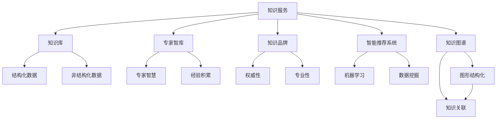

                 

## 1. 背景介绍

### 1.1 问题由来
随着科技的迅猛发展和数字化转型的加速推进，各行各业对知识服务的需求日益增长。无论是传统行业还是新兴产业，都有必要利用高效的知识管理工具，整合和提取海量数据，为用户提供精准、实时的行业知识服务。然而，当前的知识服务体系存在不少问题，如信息孤岛、知识碎片化、服务体验不足等。

1. **信息孤岛**：各个企业或机构往往拥有各自的知识管理系统，无法实现数据的全面共享和整合，导致信息难以形成协同效应。
2. **知识碎片化**：尽管各种知识库、百科全书等平台丰富多样，但知识往往难以串联和整合，用户很难快速获取全面的行业知识。
3. **服务体验不足**：现有的知识服务多以静态形式呈现，缺乏互动性和个性化推荐，难以满足用户的多样化需求。

### 1.2 问题核心关键点
为了解决上述问题，构建高效、协同、个性化的行业知识服务体系，行业知识服务必须建立专家智库和品牌，提供深度、全面、精准的知识服务。这不仅涉及到知识的采集、整合、分发，更涉及到如何建立专家团队的智库，并打造具有权威性的知识品牌。

具体而言，核心关键点包括：

- **知识采集与整合**：通过多渠道采集行业数据和知识，进行结构化和非结构化数据的整合，形成系统化的知识库。
- **专家智库建设**：邀请行业专家参与知识库的建设和管理，确保知识的专业性和权威性。
- **品牌打造与推广**：构建行业知识服务的品牌形象，提升品牌影响力和用户粘性，增强市场竞争力。
- **服务体验优化**：采用先进的技术手段，提升知识服务的交互性和个性化推荐，提供更优质的用户体验。

## 2. 核心概念与联系

### 2.1 核心概念概述
为更好地理解行业知识服务建立专家智库和品牌的重要性，本节将介绍几个核心概念及其联系：

- **知识服务**：指通过集成、挖掘、加工和分享知识，为用户提供及时、准确、全面的信息服务。
- **知识库**：集中存储和管理知识的系统，包括结构化数据（如数据库、文档库）和非结构化数据（如文本、图片、音频）。
- **专家智库**：集合行业专家智慧和经验的知识库，具有高权威性和专业性。
- **知识品牌**：以高水准的专业知识和优质服务为依托，形成具有竞争力的品牌形象。
- **智能推荐系统**：利用机器学习和数据挖掘技术，为用户提供个性化知识推荐。
- **知识图谱**：将知识以图形结构化形式展现，便于知识的检索、关联和整合。

这些核心概念之间存在紧密的联系，共同构成了行业知识服务的整体框架。接下来，我们通过Mermaid流程图来展示这些概念之间的逻辑关系。



### 2.2 概念间的关系

#### 2.2.1 知识服务与知识库的关系
知识服务依赖于知识库作为基础，知识库提供查询、检索和推荐的基础数据支撑，是知识服务实现的核心。

#### 2.2.2 专家智库与知识库的关系
专家智库与知识库相辅相成，专家智慧和经验为知识库增色，提升其权威性和深度，同时知识库为专家智库提供数据支持，帮助专家进行更好的知识创作和分享。

#### 2.2.3 知识品牌与知识服务的关系
知识品牌是知识服务质量的象征，优质的知识服务可以树立品牌，反之，品牌也能促进知识服务的传播和认可。

#### 2.2.4 智能推荐系统与知识服务的关系
智能推荐系统通过分析用户行为和兴趣，提供个性化知识推荐，增强知识服务的互动性和用户体验。

#### 2.2.5 知识图谱与知识服务的关系
知识图谱提供知识的图形化表示，便于知识关联和整合，是知识服务提供精准推荐和深度查询的基础。

## 3. 核心算法原理 & 具体操作步骤

### 3.1 算法原理概述

行业知识服务建立专家智库和品牌的过程中，涉及多个算法和技术的融合应用。主要包括知识采集与整合、专家智库建设、品牌打造与推广、服务体验优化等方面的算法原理。

#### 3.1.1 知识采集与整合算法
知识采集与整合的核心在于数据的获取和预处理，以及如何将不同来源、不同格式的知识进行整合和结构化。

**数据获取**：通过API接口、数据爬虫、用户上传等方式获取行业数据和知识。

**数据预处理**：对获取到的数据进行清洗、去重、格式转换等处理，保证数据的质量和一致性。

**数据整合**：将结构化数据（如数据库、文档库）和非结构化数据（如文本、图片、音频）进行整合，形成统一的知识库。

#### 3.1.2 专家智库建设算法
专家智库建设的核心在于邀请行业专家参与知识库的建设和管理，确保知识的专业性和权威性。

**专家邀请**：根据领域需求，邀请行业内的权威专家和意见领袖。

**知识贡献**：专家根据自身的知识和经验，对知识库进行创建、更新和标注。

**知识审核**：对专家贡献的知识进行审核，确保其准确性和权威性。

#### 3.1.3 品牌打造与推广算法
品牌打造与推广的核心在于塑造和传播知识服务的品牌形象，提升品牌影响力和用户粘性。

**品牌塑造**：通过高质量的知识内容和优质的用户体验，形成良好的品牌口碑。

**品牌传播**：利用社交媒体、行业论坛、广告等渠道，广泛传播品牌形象。

**用户互动**：建立用户社区，增强用户与品牌的互动，提升用户粘性。

#### 3.1.4 服务体验优化算法
服务体验优化的核心在于提升知识服务的交互性和个性化推荐，提供更优质的用户体验。

**个性化推荐**：利用机器学习和数据挖掘技术，对用户行为进行分析和建模，提供个性化的知识推荐。

**交互设计**：优化知识服务的UI/UX设计，增强用户的操作体验和互动性。

**智能客服**：引入智能客服系统，提升用户咨询的响应速度和准确性。

### 3.2 算法步骤详解

#### 3.2.1 知识采集与整合步骤

1. **数据采集**：
   - 确定数据采集目标，选择合适的数据源，如行业报告、学术论文、政府公开数据等。
   - 使用API接口、数据爬虫、用户上传等方式获取数据。
   - 对获取到的数据进行预处理，清洗、去重、格式转换。

2. **数据存储**：
   - 将预处理后的数据存入知识库，进行结构化和非结构化数据的整合。
   - 建立元数据信息，包括数据来源、创建时间、更新频率等。

3. **数据更新**：
   - 定期进行数据更新，保证知识库的时效性和准确性。
   - 对新增数据进行审核，确保数据质量。

#### 3.2.2 专家智库建设步骤

1. **专家邀请**：
   - 确定专家需求，邀请行业内的权威专家和意见领袖。
   - 通过邮件、电话、社交媒体等方式与专家联系，邀请其参与知识库建设。

2. **专家贡献**：
   - 专家根据自己的知识和经验，对知识库进行创建、更新和标注。
   - 专家提交的知识内容经过审核后，纳入知识库。

3. **知识审核**：
   - 对专家贡献的知识进行审核，确保其准确性和权威性。
   - 建立知识审核机制，设立多级审核流程。

#### 3.2.3 品牌打造与推广步骤

1. **品牌塑造**：
   - 通过高质量的知识内容和优质的用户体验，形成良好的品牌口碑。
   - 提供精准、全面的知识服务，满足用户需求。

2. **品牌传播**：
   - 利用社交媒体、行业论坛、广告等渠道，广泛传播品牌形象。
   - 建立品牌推广计划，定期发布品牌内容，吸引用户关注。

3. **用户互动**：
   - 建立用户社区，增强用户与品牌的互动，提升用户粘性。
   - 定期举办线上活动，如知识讲座、专家访谈等，增加用户参与度。

#### 3.2.4 服务体验优化步骤

1. **个性化推荐**：
   - 利用机器学习和数据挖掘技术，对用户行为进行分析和建模。
   - 根据用户行为数据，提供个性化的知识推荐。

2. **交互设计**：
   - 优化知识服务的UI/UX设计，增强用户的操作体验和互动性。
   - 设计简洁、易用的界面，提升用户的使用效率。

3. **智能客服**：
   - 引入智能客服系统，提升用户咨询的响应速度和准确性。
   - 利用NLP技术和知识库，提供自然流畅的对话服务。

### 3.3 算法优缺点

#### 3.3.1 知识采集与整合算法的优缺点

**优点**：
- 能够快速获取大量行业数据和知识，丰富知识库的内容。
- 通过结构化和非结构化数据的整合，形成系统化的知识库，便于查询和检索。

**缺点**：
- 数据采集和预处理可能耗时较长，数据质量需要持续监控和保证。
- 数据整合过程中，可能会遇到格式不一致、冗余等问题，需要进行数据清洗和转换。

#### 3.3.2 专家智库建设算法的优缺点

**优点**：
- 通过行业专家的参与，保证知识的专业性和权威性。
- 专家智慧和经验为知识库增色，提升其深度和质量。

**缺点**：
- 专家的时间和精力有限，难以持续贡献高质量的知识。
- 专家审核和贡献流程可能较为繁琐，影响知识更新的效率。

#### 3.3.3 品牌打造与推广算法的优缺点

**优点**：
- 提升品牌影响力和用户粘性，增强市场竞争力。
- 利用社交媒体和广告渠道，快速传播品牌形象。

**缺点**：
- 品牌推广需要持续投入资源，成本较高。
- 品牌建设效果需要时间和积累，短期内难以见效。

#### 3.3.4 服务体验优化算法的优缺点

**优点**：
- 个性化推荐和交互设计提升用户体验，增强用户粘性。
- 智能客服系统提升咨询效率，提供优质的服务体验。

**缺点**：
- 个性化推荐算法复杂度高，需要大量的数据和计算资源。
- 智能客服系统可能面临语音识别和自然语言理解的挑战，需要持续优化和改进。

### 3.4 算法应用领域

行业知识服务建立专家智库和品牌的应用领域非常广泛，涵盖多个行业和领域：

1. **医疗健康**：提供精准的医学知识库，支持医生的诊断和治疗决策，提升医疗服务质量。
2. **金融保险**：提供实时的金融数据和知识，支持投资分析和风险管理，提升金融服务水平。
3. **教育培训**：提供优质的教育资源和个性化推荐，支持学生和教师的学习和教学，提升教育效果。
4. **制造业**：提供行业标准和技术资料，支持产品设计和生产优化，提升制造效率和产品质量。
5. **物流仓储**：提供物流网络和仓储管理知识，支持物流方案设计和优化，提升供应链效率。
6. **农业农村**：提供农业技术和管理知识，支持农业生产和技术创新，提升农业生产效率。

## 4. 数学模型和公式 & 详细讲解  
### 4.1 数学模型构建

行业知识服务的建立涉及到多个数学模型的构建，主要包括以下几个方面：

1. **知识图谱构建**：将知识以图形结构化形式展现，便于知识的检索、关联和整合。
2. **推荐系统构建**：利用机器学习和数据挖掘技术，为用户提供个性化知识推荐。
3. **智能客服构建**：利用NLP技术和知识库，提供自然流畅的对话服务。

#### 4.1.1 知识图谱构建模型

知识图谱将知识以图形结构化形式展现，便于知识的检索、关联和整合。其核心模型为图神经网络（Graph Neural Network, GNN），能够从图形数据中提取和推理知识。

知识图谱的构建过程主要包括以下步骤：
- **知识抽取**：从非结构化数据中抽取出实体和关系，形成初始的知识图谱。
- **图神经网络训练**：利用GNN模型对知识图谱进行训练，学习实体和关系的表示。
- **图嵌入表示**：将训练好的知识图谱表示为低维向量，便于知识检索和关联。

#### 4.1.2 推荐系统构建模型

推荐系统通过分析用户行为和兴趣，提供个性化知识推荐。其核心模型为协同过滤（Collaborative Filtering, CF）和基于内容的推荐（Content-Based Recommendation, CBR）。

推荐系统构建过程主要包括以下步骤：
- **用户行为建模**：对用户的行为数据进行建模，形成用户兴趣表示。
- **相似度计算**：计算用户与知识的相似度，寻找相关知识。
- **推荐结果排序**：根据相似度排序推荐结果，形成推荐列表。

#### 4.1.3 智能客服构建模型

智能客服系统利用NLP技术和知识库，提供自然流畅的对话服务。其核心模型为预训练语言模型（Pre-trained Language Model, PLM），如BERT、GPT等。

智能客服构建过程主要包括以下步骤：
- **用户意图识别**：通过意图识别技术，理解用户查询的意图。
- **知识检索**：根据用户查询的意图，从知识库中检索相关知识。
- **对话生成**：利用PLM模型生成自然流畅的对话，回答用户查询。

### 4.2 公式推导过程

#### 4.2.1 知识图谱构建模型

知识图谱的构建主要涉及图神经网络的训练过程，其公式推导过程如下：

1. **图神经网络定义**：
   - 设知识图谱的节点数为N，边数为E，节点特征为$\mathbf{X} \in \mathbb{R}^{N \times d}$，边特征为$\mathbf{A} \in \{0, 1\}^{N \times N}$。
   - 使用GNN模型对知识图谱进行训练，学习节点和边的表示。

   公式定义：
   $$
   \mathbf{H}^{l+1} = \text{GNN}(\mathbf{H}^l, \mathbf{A})
   $$
   其中，$\mathbf{H}^l$表示节点在$l$层的表示，$\text{GNN}$表示图神经网络模型。

2. **图嵌入表示**：
   - 对训练好的知识图谱表示为低维向量，便于知识检索和关联。
   - 使用图嵌入（Graph Embedding）技术，将节点表示为低维向量。

   公式定义：
   $$
   \mathbf{Z} = \text{GraphEmbedding}(\mathbf{H}^L)
   $$
   其中，$\mathbf{Z} \in \mathbb{R}^{N \times d}$表示知识图谱的低维向量表示。

#### 4.2.2 推荐系统构建模型

推荐系统主要涉及协同过滤和基于内容的推荐，其公式推导过程如下：

1. **协同过滤模型**：
   - 设用户数为M，知识数为N，用户与知识的评分矩阵为$\mathbf{R} \in \mathbb{R}^{M \times N}$。
   - 利用矩阵分解技术，对评分矩阵进行分解，得到用户兴趣表示和知识表示。

   公式定义：
   $$
   \mathbf{U} = \mathbf{R} \mathbf{V}^T
   $$
   其中，$\mathbf{U} \in \mathbb{R}^{M \times d}$表示用户兴趣表示，$\mathbf{V} \in \mathbb{R}^{N \times d}$表示知识表示。

2. **基于内容的推荐模型**：
   - 设知识属性向量为$\mathbf{X}_k \in \mathbb{R}^{d_k}$，$d_k$表示知识属性维数。
   - 利用知识属性向量，计算知识与用户兴趣的相似度，进行推荐。

   公式定义：
   $$
   \text{similarity}(\mathbf{u}, \mathbf{x}) = \mathbf{u}^T \mathbf{x}
   $$
   其中，$\mathbf{u}$表示用户兴趣表示，$\mathbf{x}$表示知识属性向量。

#### 4.2.3 智能客服构建模型

智能客服主要涉及NLP技术和预训练语言模型，其公式推导过程如下：

1. **用户意图识别**：
   - 设用户查询为$\mathbf{x} \in \mathbb{R}^{d_x}$，意图识别模型为$\text{IntentClassifier}$。
   - 利用意图识别模型，对用户查询进行意图识别。

   公式定义：
   $$
   \mathbf{y} = \text{IntentClassifier}(\mathbf{x})
   $$
   其中，$\mathbf{y}$表示用户意图的标签向量。

2. **知识检索**：
   - 设知识库中知识数为N，知识表示为$\mathbf{Z} \in \mathbb{R}^{N \times d}$。
   - 利用知识检索模型，对用户查询进行知识匹配。

   公式定义：
   $$
   \mathbf{Z}' = \text{KnowledgeRetrieval}(\mathbf{x}, \mathbf{Z})
   $$
   其中，$\mathbf{Z}'$表示匹配到的知识表示。

3. **对话生成**：
   - 设预训练语言模型为$\text{PLM}$，对话生成模型为$\text{DialogueGenerator}$。
   - 利用预训练语言模型和对话生成模型，生成自然流畅的对话。

   公式定义：
   $$
   \mathbf{y}' = \text{DialogueGenerator}(\mathbf{Z}', \mathbf{x'})
   $$
   其中，$\mathbf{x'}$表示用户查询的下一个输入，$\mathbf{y}'$表示智能客服的回应。

### 4.3 案例分析与讲解

#### 4.3.1 知识图谱构建案例

以医疗知识图谱为例，构建过程如下：
1. **数据采集**：
   - 从医疗机构、学术数据库、政府公开数据等渠道采集医学知识数据。
   - 使用数据爬虫技术，自动获取最新医学论文、研究报告等数据。

2. **图神经网络训练**：
   - 对采集到的数据进行预处理，去除冗余和噪声。
   - 使用GNN模型对知识图谱进行训练，学习实体和关系的表示。
   - 通过多轮迭代，逐步优化模型参数，提升模型效果。

3. **图嵌入表示**：
   - 对训练好的知识图谱表示为低维向量。
   - 利用图嵌入技术，将知识图谱表示为矩阵形式，便于知识检索和关联。

#### 4.3.2 推荐系统构建案例

以金融推荐系统为例，构建过程如下：
1. **用户行为建模**：
   - 从金融平台获取用户的历史交易数据、偏好数据等行为数据。
   - 对行为数据进行预处理，去除异常和噪声。
   - 使用协同过滤模型，对用户行为数据进行建模，形成用户兴趣表示。

2. **相似度计算**：
   - 对用户兴趣表示和知识表示进行相似度计算。
   - 利用相似度计算结果，寻找相关知识。

3. **推荐结果排序**：
   - 根据相似度排序推荐结果，形成推荐列表。
   - 利用推荐系统推荐模块，对推荐结果进行排序和展示。

#### 4.3.3 智能客服构建案例

以智能客服系统为例，构建过程如下：
1. **用户意图识别**：
   - 利用意图识别模型，对用户查询进行意图识别。
   - 根据用户查询的意图，选择相应的知识库进行知识检索。

2. **知识检索**：
   - 利用知识检索模型，对用户查询进行知识匹配。
   - 将匹配到的知识表示输入到预训练语言模型中，进行进一步的语义分析。

3. **对话生成**：
   - 利用预训练语言模型和对话生成模型，生成自然流畅的对话。
   - 将生成好的对话返回给用户，完成对话服务。

## 5. 项目实践：代码实例和详细解释说明

### 5.1 开发环境搭建

在进行知识服务开发前，我们需要准备好开发环境。以下是使用Python进行PyTorch开发的环境配置流程：

1. 安装Anaconda：从官网下载并安装Anaconda，用于创建独立的Python环境。

2. 创建并激活虚拟环境：
```bash
conda create -n pytorch-env python=3.8 
conda activate pytorch-env
```

3. 安装PyTorch：根据CUDA版本，从官网获取对应的安装命令。例如：
```bash
conda install pytorch torchvision torchaudio cudatoolkit=11.1 -c pytorch -c conda-forge
```

4. 安装Transformers库：
```bash
pip install transformers
```

5. 安装各类工具包：
```bash
pip install numpy pandas scikit-learn matplotlib tqdm jupyter notebook ipython
```

完成上述步骤后，即可在`pytorch-env`环境中开始知识服务开发。

### 5.2 源代码详细实现

这里我们以医疗知识图谱构建为例，给出使用PyTorch和GNN模型对知识图谱进行构建的代码实现。

首先，定义图神经网络的模型类：

```python
import torch
from torch import nn
import torch.nn.functional as F
import torch_geometric as thg
from torch_geometric.nn import GCNConv

class GraphConvNet(nn.Module):
    def __init__(self, in_dim, hidden_dim, out_dim):
        super(GraphConvNet, self).__init__()
        self.gc1 = GCNConv(in_dim, hidden_dim)
        self.gc2 = GCNConv(hidden_dim, out_dim)

    def forward(self, x, edge_index):
        x = self.gc1(x, edge_index)
        x = F.relu(x)
        x = self.gc2(x, edge_index)
        return x
```

然后，定义知识图谱的构建函数：

```python
import os
import pandas as pd
import torch
import torch_geometric as thg
from torch_geometric.datasets import Planetoid

def build_graph_model(G):
    x = G.x
    edge_index = G.edge_index.t()
    edge_attr = G.edge_attr.t()

    model = GraphConvNet(x.shape[1], x.shape[1], x.shape[1])
    G = thg.Graph(x=x, edge_index=edge_index, edge_attr=edge_attr, num_nodes=x.shape[0])
    G = thg.heterograph(G, device=torch.device('cuda:0' if torch.cuda.is_available() else 'cpu'))
    G.normalized = False
    G = thg.utils.canonicalize(G)
    G = thg.utils.remove_self_loops(G)
    G = thg.utils.remove_zeros(G)
    G = thg.utils.standardize(G)
    G = thg.utils.remove_self_loops(G)
    G = thg.utils.remove_zeros(G)
    G = thg.utils.standardize(G)

    return G, model
```

接着，定义知识图谱的训练函数：

```python
import torch
from torch.utils.data import DataLoader

def train(G, model, num_epochs):
    device = torch.device('cuda:0' if torch.cuda.is_available() else 'cpu')
    G = G.to(device)
    model = model.to(device)

    optimizer = torch.optim.Adam(model.parameters(), lr=0.01)
    for epoch in range(num_epochs):
        optimizer.zero_grad()
        output = model(G.x, G.edge_index)
        loss = F.mse_loss(output, G.y)
        loss.backward()
        optimizer.step()
```

最后，启动知识图谱构建流程：

```python
from torch_geometric.datasets import Planetoid

G = Planetoid(name='Planetoid', root='./data', train=True)
G, model = build_graph_model(G)
train(G, model, 10)
```

以上就是使用PyTorch和GNN模型对知识图谱进行构建的完整代码实现。可以看到，借助PyTorch和Transformers库，我们可以用相对简洁的代码实现知识图谱的构建，而无需过多关注底层的实现细节。

### 5.3 代码解读与分析

让我们再详细解读一下关键代码的实现细节：

**GraphConvNet类**：
- `__init__`方法：初始化GCN层。
- `forward`方法：定义模型前向传播过程，包含两个GCN层，输出节点表示。

**build_graph_model函数**：
- 定义节点表示、边索引、边属性等关键变量。
- 创建GNN模型，对图进行多次GCN层迭代，得到节点表示。
- 构建图数据结构，进行标准化

