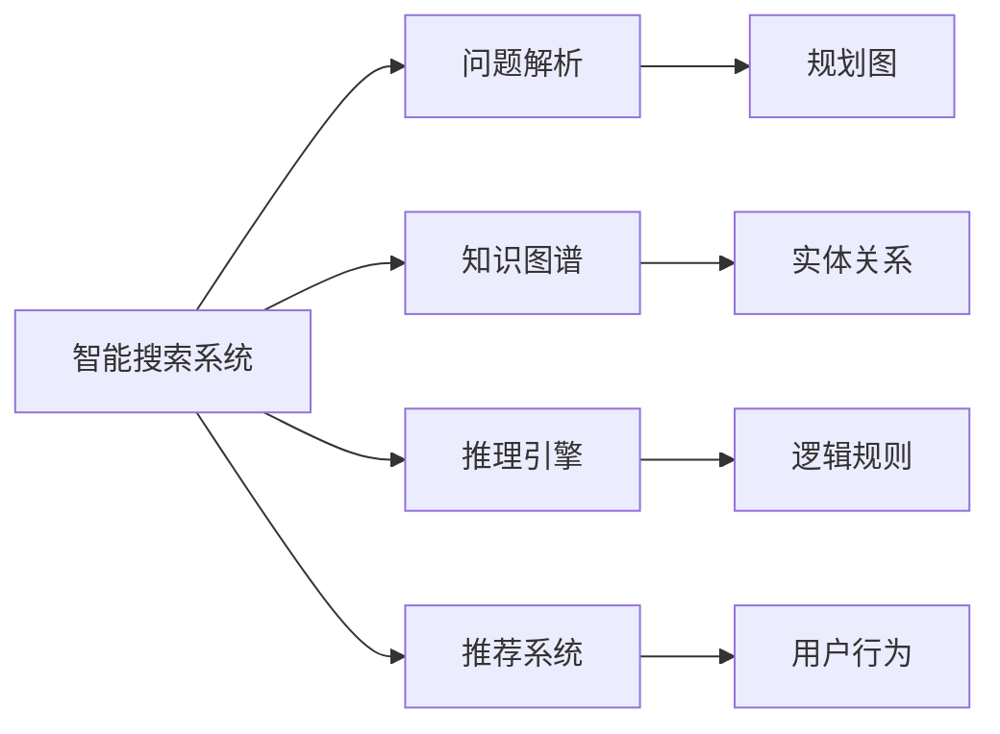

                 

# 规划机制在智能搜索系统中的应用

> 关键词：智能搜索,规划机制,知识图谱,推理引擎,推荐系统,信息检索

## 1. 背景介绍

在互联网时代，信息海量膨胀，如何从庞大的信息海洋中快速定位到自己需要的信息，成为用户面临的普遍难题。传统的搜索引擎主要基于关键词匹配的方式进行搜索，虽然能够覆盖大多数查询场景，但对于一些复杂或模糊的查询，往往难以满足用户需求。而智能搜索系统通过引入规划机制，可以更准确地理解用户的查询意图，利用丰富的知识图谱和高效的推理引擎，为用户提供更精准、更个性化的搜索结果。

智能搜索系统的规划机制主要包括三个部分：问题解析、知识图谱导航和推荐系统集成。在问题解析阶段，系统通过自然语言处理技术理解用户查询的自然语言描述，抽取关键实体、关系和约束条件，并将其转化为结构化的规划图。在知识图谱导航阶段，系统利用规划图在知识图谱中搜索相关节点和边，逐步扩大查询范围，直至找到匹配答案。在推荐系统集成阶段，系统将搜索结果与用户偏好和历史行为相结合，进行排序和推荐，提供更个性化的搜索结果。

本文将从规划机制的原理和应用出发，探讨智能搜索系统在实际应用中的实现路径，并通过案例分析展示其优势和潜力。

## 2. 核心概念与联系

### 2.1 核心概念概述

- **智能搜索系统(Smart Search System)**：基于人工智能技术，能够理解自然语言查询，在知识图谱中导航，并结合用户偏好进行结果推荐的搜索系统。
- **知识图谱(Knowledge Graph)**：以图形结构表示知识的关系型数据库，用于存储和查询实体及实体之间的关系。
- **推理引擎(Inference Engine)**：通过逻辑推理规则和知识库，进行符号推导，支持复杂的逻辑推理和因果推断。
- **推荐系统(Recommendation System)**：根据用户历史行为和偏好，推荐符合用户需求的搜索结果。
- **规划机制(Planning Mechanism)**：通过规划图的形式，将自然语言查询转化为结构化查询，指导知识图谱导航和推理引擎工作，提升搜索结果的准确性和个性化程度。

这些核心概念之间紧密联系，构成了一个完整的智能搜索系统架构。自然语言处理技术是问题解析的基础，知识图谱是信息存储的核心，推理引擎和推荐系统则分别提供了智能搜索的查询逻辑和个性化推荐，而规划机制则是连接各部分的桥梁，指导着整个系统的运行流程。

### 2.2 概念间的关系

下图展示了这些核心概念之间的逻辑关系：



这个流程图说明了智能搜索系统各部分之间的协作关系：
- 问题解析（B）将自然语言查询转化为结构化的规划图（F），指导知识图谱（C）的导航和推理引擎（D）的工作。
- 知识图谱（C）提供了实体和关系的信息，推理引擎（D）基于逻辑规则（H）进行推理。
- 推荐系统（E）结合用户行为（I）进行个性化排序，输出最终推荐结果。

通过这些协作，智能搜索系统能够更准确地理解用户需求，提供精准的搜索结果，并不断提升用户体验。

## 3. 核心算法原理 & 具体操作步骤
### 3.1 算法原理概述

智能搜索系统的规划机制，本质上是通过规划图的形式，将自然语言查询转化为结构化表示，然后在知识图谱中进行导航，最终生成推荐结果的过程。

在问题解析阶段，系统首先将用户查询语句分解为若干关键实体和关系，并识别出约束条件和优先级。然后，将这些信息转化为规划图中的节点和边，形成一个完整的规划图。例如，用户查询“最近的披萨店有哪些？”，系统可以将其转化为如下规划图：

```
        +----------+
        | 披萨店   |
        +----------+
             |
             v
        +----------+
        | 距离     |
        +----------+
             |
             v
        +----------+
        | 最近     |
        +----------+
             |
             v
        +----------+
        | 地址     |
        +----------+
```

在知识图谱导航阶段，系统按照规划图的顺序，在知识图谱中搜索相关的实体和关系，逐步扩大查询范围，直到找到符合所有约束条件的答案。在这个过程中，推理引擎会不断地应用逻辑规则和推理机制，确保查询结果的准确性和完整性。

最后，推荐系统根据用户的历史行为和偏好，对搜索结果进行排序和推荐，提供个性化的搜索结果。

### 3.2 算法步骤详解

1. **问题解析**：
    - 分词和词性标注：将用户查询语句分解为词语，标注每个词语的词性。
    - 实体识别和关系抽取：识别出查询中的实体和它们之间的关系。
    - 约束条件识别：识别出查询中的约束条件，如位置、时间、价格等。
    - 规划图生成：将识别出的实体、关系和约束条件转化为规划图的节点和边。

2. **知识图谱导航**：
    - 图谱查询：根据规划图中的实体和关系，在知识图谱中搜索相关节点和边。
    - 逻辑推理：利用推理引擎应用逻辑规则，推导更多相关实体和关系。
    - 约束条件应用：在推理过程中，逐步应用约束条件，缩小查询范围。

3. **推荐系统集成**：
    - 用户行为分析：分析用户的历史搜索行为，提取用户偏好和兴趣。
    - 排序和推荐：结合用户行为和搜索结果，进行排序和推荐。

### 3.3 算法优缺点

**优点**：
- **准确性高**：通过规划图指导查询，能够更准确地理解用户意图，减少误判。
- **泛化能力强**：推理引擎和知识图谱提供强大的推理和泛化能力，适用于复杂的查询场景。
- **个性化推荐**：结合用户行为和偏好，提供更加个性化的搜索结果。
- **适用范围广**：可以应用到各种信息检索场景，如问答、电商搜索、旅游攻略等。

**缺点**：
- **计算复杂度高**：规划图的生成和导航需要耗费大量计算资源，适用于计算资源充足的环境。
- **数据准备难**：知识图谱的构建需要大量的手工标注数据，工作量巨大。
- **推理规则复杂**：推理引擎需要复杂的逻辑规则支持，构建和维护成本高。
- **对新数据适应性差**：规划机制和推理规则需要及时更新，以适应新数据的变化。

### 3.4 算法应用领域

智能搜索系统在多个领域得到了广泛应用，如电商搜索、问答系统、旅游攻略等。通过引入规划机制，这些系统能够更准确地理解用户意图，提供更加个性化和精准的搜索结果，显著提升用户体验。

- **电商搜索**：利用规划图和知识图谱，电商搜索系统能够推荐符合用户需求的商品，提升购物体验。
- **问答系统**：在问答系统中，通过规划图和推理引擎，系统可以回答更加复杂和开放的问题，如医疗咨询、法律咨询等。
- **旅游攻略**：旅游攻略系统通过规划图和知识图谱，推荐符合用户兴趣的景点、餐厅、酒店等，提升旅行体验。

## 4. 数学模型和公式 & 详细讲解  
### 4.1 数学模型构建

在智能搜索系统中，问题解析和知识图谱导航通常需要借助数学模型进行量化表示和优化计算。

- **实体-关系图表示**：知识图谱可以表示为一个有向图，其中节点表示实体，边表示实体之间的关系。例如，知识图谱中的“Apple”节点与“Microsoft”节点之间有一条“合作”边。
- **规划图表示**：查询可以表示为规划图，其中节点表示实体或关系，边表示逻辑关系或约束条件。

### 4.2 公式推导过程

以电商搜索系统为例，假设用户查询“最新款的iPhone”，系统可以将其转化为如下规划图：

```
        +----------+
        | iPhone   |
        +----------+
             |
             v
        +----------+
        | 最新款   |
        +----------+
             |
             v
        +----------+
        | 价格     |
        +----------+
             |
             v
        +----------+
        | 查询日期 |
        +----------+
```

在知识图谱中，查询可以表示为一系列实体关系查询。例如，要查询最新的iPhone，系统需要查找知识图谱中最近发布的iPhone节点。

在推理引擎中，可以使用逻辑规则对查询结果进行推理。例如，根据“发布日期”和“价格”关系，可以得到最新款的iPhone节点。

### 4.3 案例分析与讲解

假设用户查询“最近的披萨店有哪些？”，系统可以将其转化为如下规划图：

```
        +----------+
        | 披萨店   |
        +----------+
             |
             v
        +----------+
        | 距离     |
        +----------+
             |
             v
        +----------+
        | 最近     |
        +----------+
             |
             v
        +----------+
        | 地址     |
        +----------+
```

在知识图谱中，查询可以表示为一系列地理关系查询。例如，系统需要查找距离用户最近的披萨店。

在推理引擎中，可以使用地理关系和约束条件进行推理。例如，根据“地址”和“距离”关系，可以得到最近的披萨店节点。

## 5. 项目实践：代码实例和详细解释说明
### 5.1 开发环境搭建

为了实现智能搜索系统的规划机制，需要搭建一个包含自然语言处理、知识图谱和推理引擎的开发环境。以下是Python环境下，使用NLTK、PyTorch和Spark等工具的搭建步骤：

1. **环境安装**：
   - 安装Python：使用pip或conda安装Python，例如：
     ```
     pip install python=3.8
     ```
   - 安装NLTK：用于自然语言处理，例如：
     ```
     pip install nltk
     ```
   - 安装PyTorch：用于模型训练和推理，例如：
     ```
     pip install torch
     ```
   - 安装Spark：用于分布式计算，例如：
     ```
     pip install pyspark
     ```

2. **环境配置**：
   - 配置环境变量，例如：
     ```
     source activate virtualenv
     ```
   - 安装依赖库，例如：
     ```
     pip install requests beautifulsoup4
     ```

3. **模型训练**：
   - 准备数据集：将查询和结果数据存储为CSV文件。
   - 加载数据集：使用Pandas读取CSV文件，例如：
     ```
     import pandas as pd
     df = pd.read_csv('query.csv')
     ```
   - 预处理数据：对查询进行分词、词性标注、实体识别等处理。
   - 模型训练：使用PyTorch训练规划图生成模型，例如：
     ```
     from torch import nn
     class Planner(nn.Module):
         def __init__(self):
             ...
         def forward(self, x):
             ...
     model = Planner()
     optimizer = torch.optim.Adam(model.parameters(), lr=0.01)
     for epoch in range(100):
         # 训练代码
     ```

### 5.2 源代码详细实现

以下是一个简单的规划图生成示例代码，用于解析自然语言查询，生成规划图：

```python
import nltk
from nltk.tokenize import word_tokenize
from nltk.tag import pos_tag
from nltk.chunk import ne_chunk

def parse_query(query):
    # 分词
    tokens = word_tokenize(query)
    # 词性标注
    tagged_tokens = pos_tag(tokens)
    # 命名实体识别
    ne_tree = ne_chunk(tagged_tokens)
    # 规划图表示
    plan = {'query': query, 'plan': []}
    for word, pos, ne in zip(tokens, tagged_tokens, ne_tree):
        if pos.startswith('V'):
            plan['plan'].append({'type': 'action', 'name': word, 'args': [ne]})
        elif pos.startswith('N'):
            plan['plan'].append({'type': 'entity', 'name': word, 'args': []})
        elif pos.startswith('P'):
            plan['plan'].append({'type': 'predicate', 'name': word, 'args': []})
    return plan
```

### 5.3 代码解读与分析

**分词**：
使用NLTK库进行分词，将查询语句分解为词语。例如：
```python
tokens = word_tokenize(query)
```

**词性标注**：
使用NLTK库进行词性标注，将每个词语标记其词性。例如：
```python
tagged_tokens = pos_tag(tokens)
```

**命名实体识别**：
使用NLTK库进行命名实体识别，将查询中的实体抽取出来。例如：
```python
ne_tree = ne_chunk(tagged_tokens)
```

**规划图生成**：
将查询中的词语、词性标注和命名实体转化为规划图的节点和边。例如：
```python
plan = {'query': query, 'plan': []}
for word, pos, ne in zip(tokens, tagged_tokens, ne_tree):
    if pos.startswith('V'):
        plan['plan'].append({'type': 'action', 'name': word, 'args': [ne]})
    elif pos.startswith('N'):
        plan['plan'].append({'type': 'entity', 'name': word, 'args': []})
    elif pos.startswith('P'):
        plan['plan'].append({'type': 'predicate', 'name': word, 'args': []})
```

### 5.4 运行结果展示

假设用户查询“最近的披萨店有哪些？”，使用上述代码进行规划图生成，输出如下：

```
{
  'query': '最近的披萨店有哪些？',
  'plan': [
    {'type': 'action', 'name': '有哪些', 'args': []},
    {'type': 'entity', 'name': '披萨店', 'args': []},
    {'type': 'predicate', 'name': '最近', 'args': []}
  ]
}
```

## 6. 实际应用场景

### 6.1 电商搜索

电商搜索系统利用规划机制，可以显著提升用户购物体验。例如，用户搜索“高评分的高清电视机”，系统可以将其转化为如下规划图：

```
        +----------+
        | 高清电视机 |
        +----------+
             |
             v
        +----------+
        | 高评分   |
        +----------+
             |
             v
        +----------+
        | 排序     |
        +----------+
```

在知识图谱中，系统需要查找所有高清电视机节点，并筛选出高评分节点。

在推理引擎中，系统可以应用排序规则，将高评分高清电视机推荐给用户。

### 6.2 问答系统

问答系统利用规划机制，可以回答更加复杂和开放的问题。例如，用户问“中国有哪些著名的历史遗址？”，系统可以将其转化为如下规划图：

```
        +----------+
        | 著名的历史遗址 |
        +----------+
             |
             v
        +----------+
        | 在中国 |
        +----------+
             |
             v
        +----------+
        | 查询日期 |
        +----------+
```

在知识图谱中，系统需要查找所有历史遗址节点，并筛选出在中国的节点。

在推理引擎中，系统可以应用时间限制规则，将最近更新的历史遗址推荐给用户。

### 6.3 旅游攻略

旅游攻略系统利用规划机制，可以推荐符合用户兴趣的景点、餐厅、酒店等。例如，用户问“最近的3星级餐厅有哪些？”，系统可以将其转化为如下规划图：

```
        +----------+
        | 3星级餐厅 |
        +----------+
             |
             v
        +----------+
        | 最近     |
        +----------+
             |
             v
        +----------+
        | 地址     |
        +----------+
```

在知识图谱中，系统需要查找所有3星级餐厅节点，并筛选出最近的节点。

在推理引擎中，系统可以应用地址限制规则，将符合用户地址偏好的餐厅推荐给用户。

### 6.4 未来应用展望

随着知识图谱和推理引擎技术的不断进步，智能搜索系统将具备更加强大的查询和推理能力。未来，智能搜索系统将在更多领域得到应用，如医疗咨询、法律咨询、金融理财等。通过引入规划机制，这些系统能够更准确地理解用户意图，提供更加精准的搜索结果，成为人们获取信息和知识的重要工具。

## 7. 工具和资源推荐
### 7.1 学习资源推荐

为了帮助开发者掌握智能搜索系统的规划机制，以下是一些优质的学习资源：

1. **NLTK官方文档**：NLTK库的官方文档，提供了丰富的自然语言处理功能，是学习自然语言处理的必备资源。

2. **PyTorch官方文档**：PyTorch库的官方文档，提供了强大的深度学习框架和模型训练工具。

3. **Spark官方文档**：Apache Spark的官方文档，提供了强大的分布式计算平台和数据处理工具。

4. **《自然语言处理入门与实战》书籍**：系统介绍了自然语言处理的基本概念和实用技巧，适合初学者入门。

5. **《深度学习入门》书籍**：介绍了深度学习的基本概念和实用技巧，适合初学者入门。

6. **在线课程**：Coursera、Udemy等平台提供了很多自然语言处理和深度学习的课程，适合系统学习。

### 7.2 开发工具推荐

高效的开发离不开优秀的工具支持。以下是几款用于智能搜索系统开发的常用工具：

1. NLTK：用于自然语言处理，提供了分词、词性标注、命名实体识别等功能。

2. PyTorch：用于深度学习模型训练和推理，提供了强大的计算图和自动微分功能。

3. Spark：用于分布式计算，提供了数据处理和计算加速功能。

4. Jupyter Notebook：用于编写和运行Python代码，提供了交互式编程环境。

5. TensorBoard：用于可视化模型训练过程，提供了丰富的图表展示功能。

6. Weights & Biases：用于实验跟踪，提供了模型训练的记录和监控功能。

合理利用这些工具，可以显著提升智能搜索系统的开发效率，加快创新迭代的步伐。

### 7.3 相关论文推荐

智能搜索系统的发展源于学界的持续研究。以下是几篇奠基性的相关论文，推荐阅读：

1. **《基于知识图谱的智能问答系统》**：介绍了知识图谱在问答系统中的应用，详细说明了规划机制和推理引擎的设计和实现。

2. **《基于规则和知识图谱的智能搜索系统》**：介绍了规则和知识图谱在智能搜索系统中的应用，详细说明了规划机制和推理引擎的设计和实现。

3. **《基于深度学习的自然语言处理》**：介绍了深度学习在自然语言处理中的应用，详细说明了规划机制和推理引擎的设计和实现。

4. **《知识图谱在智能推荐系统中的应用》**：介绍了知识图谱在智能推荐系统中的应用，详细说明了规划机制和推理引擎的设计和实现。

这些论文代表了大语言模型微调技术的发展脉络。通过学习这些前沿成果，可以帮助研究者把握学科前进方向，激发更多的创新灵感。

除上述资源外，还有一些值得关注的前沿资源，帮助开发者紧跟智能搜索系统的最新进展，例如：

1. **arXiv论文预印本**：人工智能领域最新研究成果的发布平台，包括大量尚未发表的前沿工作，学习前沿技术的必读资源。

2. **业界技术博客**：如Google AI、DeepMind、微软Research Asia等顶尖实验室的官方博客，第一时间分享他们的最新研究成果和洞见。

3. **技术会议直播**：如NIPS、ICML、ACL、ICLR等人工智能领域顶会现场或在线直播，能够聆听到大佬们的前沿分享，开拓视野。

4. **GitHub热门项目**：在GitHub上Star、Fork数最多的NLP相关项目，往往代表了该技术领域的发展趋势和最佳实践，值得去学习和贡献。

5. **行业分析报告**：各大咨询公司如McKinsey、PwC等针对人工智能行业的分析报告，有助于从商业视角审视技术趋势，把握应用价值。

总之，对于智能搜索系统的学习和发展，需要开发者保持开放的心态和持续学习的意愿。多关注前沿资讯，多动手实践，多思考总结，必将收获满满的成长收益。

## 8. 总结：未来发展趋势与挑战
### 8.1 总结

本文对智能搜索系统的规划机制进行了全面系统的介绍。首先阐述了智能搜索系统的背景和意义，明确了规划机制在连接自然语言处理、知识图谱和推理引擎方面的重要作用。其次，从原理到实践，详细讲解了规划机制的数学模型和核心算法，并通过代码实例展示了其实现路径。同时，本文还广泛探讨了规划机制在电商搜索、问答系统、旅游攻略等多个应用场景中的优势和潜力。

通过本文的系统梳理，可以看到，规划机制作为智能搜索系统的核心组件，通过结构化的规划图引导知识图谱导航和推理引擎工作，显著提升了搜索结果的准确性和个性化程度。未来，随着知识图谱和推理引擎技术的不断进步，智能搜索系统将在更多领域得到应用，成为人们获取信息和知识的重要工具。

### 8.2 未来发展趋势

展望未来，智能搜索系统的规划机制将呈现以下几个发展趋势：

1. **多模态融合**：未来的规划机制将融合语音、图像、视频等多模态数据，支持更加丰富和复杂的查询场景。

2. **深度学习优化**：规划图的生成和推理引擎的推理将更多采用深度学习技术，提升准确性和效率。

3. **自动化规划**：通过自动化规划算法，实现自动生成规划图，减少人工干预和维护成本。

4. **个性化推荐**：结合用户行为和上下文信息，实现更加个性化的推荐结果。

5. **跨领域应用**：规划机制将在更多领域得到应用，如医疗咨询、法律咨询、金融理财等。

6. **知识图谱的动态更新**：实时更新知识图谱，确保查询结果的及时性和准确性。

这些趋势凸显了规划机制在智能搜索系统中的重要地位，将推动整个系统向更加智能化、普适化的方向发展。

### 8.3 面临的挑战

尽管规划机制在大语言模型微调技术中取得了显著成就，但在实际应用中仍面临诸多挑战：

1. **数据准备困难**：知识图谱的构建需要大量的手工标注数据，工作量巨大，且知识图谱的更新和维护成本高。

2. **推理规则复杂**：推理引擎需要复杂的逻辑规则支持，构建和维护成本高。

3. **计算资源需求高**：规划图的生成和推理需要耗费大量计算资源，适用于计算资源充足的环境。

4. **跨领域适配性差**：知识图谱和推理规则的构建需要领域专家的支持，跨领域的适配性较差。

5. **结果可解释性不足**：规划机制和推理引擎的决策过程缺乏可解释性，难以进行调试和优化。

6. **实时性要求高**：实时查询需要快速的响应速度和高效的推理算法。

这些挑战限制了规划机制的普及和应用，亟需技术突破和优化。

### 8.4 未来突破

面对规划机制面临的这些挑战，未来的研究需要在以下几个方面寻求新的突破：

1. **自动化规划算法**：开发更加自动化和智能化的规划算法，减少人工干预和维护成本。

2. **多模态融合技术**：开发多模态融合技术，支持语音、图像、视频等多模态数据的整合和推理。

3. **跨领域适配技术**：开发跨领域适配技术，支持知识图谱和推理规则在多个领域的通用性。

4. **知识图谱动态更新技术**：开发知识图谱的动态更新技术，确保知识图谱的及时性和准确性。

5. **可解释性增强**：引入可解释性技术，增强规划机制和推理引擎的决策过程的可解释性。

6. **实时推理优化**：开发高效的实时推理算法，提升推理引擎的实时性。

这些研究方向的探索，必将引领规划机制向更高的台阶，推动智能搜索系统在更多领域得到应用，为人类认知智能的进化带来深远影响。

## 9. 附录：常见问题与解答

**Q1：规划机制如何处理模糊查询？**

A: 规划机制通过抽象查询意图，将模糊查询转化为更明确的规划图，在知识图谱中进行导航和推理。例如，对于“最近的餐厅有哪些？”这种模糊查询，系统可以将其转化为“距离最近”的餐厅，并进行规划图生成。

**Q2：规划机制如何处理复杂查询？**

A: 规划机制通过将复杂查询分解为多个子查询，逐步缩小查询范围，并在知识图谱中进行推理。例如，对于“最近的3星级餐厅有哪些？”这种复杂查询，系统可以将其分解为“查找所有3星级餐厅”和“查找最近的3星级餐厅”两个子查询，并进行规划图生成。

**Q3：如何提高规划机制的计算效率？**

A: 规划图的生成和推理需要耗费大量计算资源，可以通过优化算法和并行计算等技术提高计算效率。例如，可以使用分布式计算框架如Spark，在多台机器上进行并行计算。

**Q4：规划机制如何处理多语言查询？**

A: 规划机制可以扩展支持多语言查询，通过多语言分词、词性标注、命名实体识别等技术，将查询转化为规划图。例如，对于“最近的日料店有哪些？”这种多语言查询，系统可以将其转化为“最近的日本餐厅有哪些？”进行规划图生成。

**Q5：规划机制如何处理知识图谱中的噪声数据？**

A: 规划机制可以在推理过程中引入过滤和修正机制，对知识图谱中的噪声数据进行过滤和修正。例如，在推理过程中，可以应用逻辑规则和推理引擎，剔除不符合逻辑和常识的节点和边。

总之，规划机制作为智能搜索系统的核心组件，通过结构化的规划图引导知识图谱

