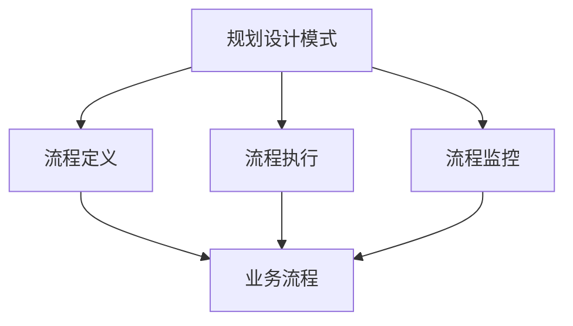
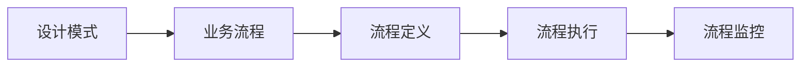
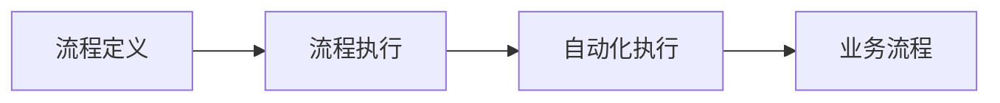
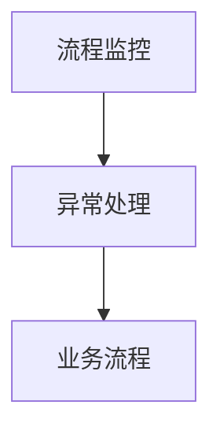
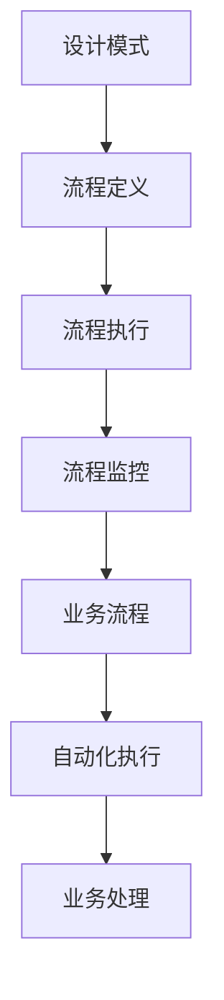
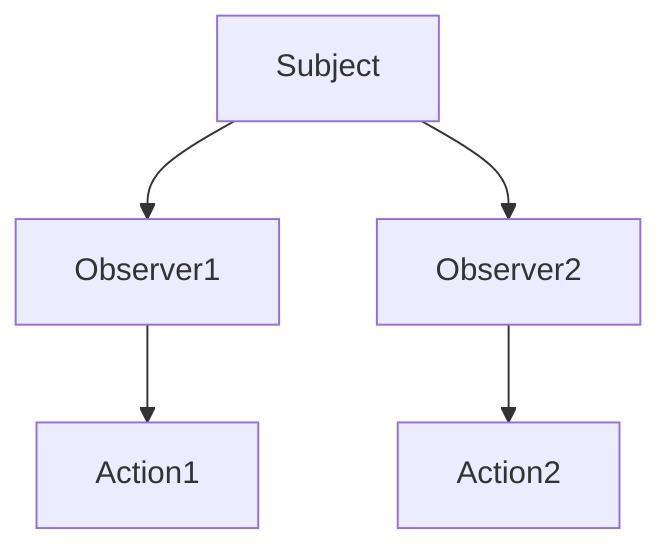
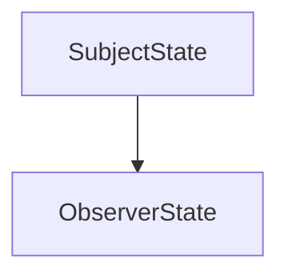

                 

## 1. 背景介绍

### 1.1 问题由来
随着人工智能(AI)技术的发展，企业对于自动化和智能化的需求日益增加。自动化流程执行(Agentic Workflow)作为AI在企业中的应用之一，通过对业务流程的自动化和智能化，提高企业效率，降低运营成本，减少人为错误。然而，在实践中，自动化流程执行往往面临许多挑战，如流程复杂度高、数据质量差、人工干预频繁、异常情况难处理等。如何设计出高效、可靠、可扩展的自动化流程执行系统，成为AI应用领域的研究热点。

### 1.2 问题核心关键点
Agentic Workflow系统通过自动化工具对业务流程进行自动化和智能化执行。然而，在实现过程中，选择合适的设计模式能够显著提高系统性能和可维护性。本文聚焦于规划设计模式在Agentic Workflow中的应用，通过理论分析与实际案例，讨论如何选择合适的设计模式来应对不同类型的自动化需求。

### 1.3 问题研究意义
研究规划设计模式在Agentic Workflow中的应用，对于提升自动化流程执行系统的设计质量、效率和可维护性具有重要意义：

1. 提升设计效率。合理的规划设计模式能够帮助设计者系统化地思考问题，避免重复劳动。
2. 提高系统性能。选择合适的设计模式能够提升系统的响应速度、资源利用率和容错能力。
3. 增强系统可扩展性。通过明确的设计模式，系统能够更加容易地扩展和更新。
4. 降低维护成本。清晰的设计模式有助于快速定位和修复问题，减少维护复杂度。
5. 支持多场景应用。规划设计模式能够应对不同类型的业务流程自动化需求，具有较强的通用性。

## 2. 核心概念与联系

### 2.1 核心概念概述

为更好地理解规划设计模式在Agentic Workflow中的应用，本节将介绍几个密切相关的核心概念：

- 规划设计模式(Design Pattern)：指解决特定问题的一系列设计方案，具有通用性、可重用性和可扩展性。规划设计模式包括但不限于观察者模式、策略模式、模板方法模式、命令模式、责任链模式等。
- Agentic Workflow：通过自动化工具执行企业业务流程，实现自动化和智能化的过程。Agentic Workflow包括流程定义、流程执行、流程监控等模块。
- 流程定义：定义业务流程的规则和步骤，通常使用图形化工具实现。
- 流程执行：根据定义好的流程规则，自动执行业务流程，通常使用脚本、API等实现。
- 流程监控：实时监控业务流程执行状态，处理异常情况，确保流程顺利执行。

这些核心概念之间的逻辑关系可以通过以下Mermaid流程图来展示：



这个流程图展示了大语言模型微调过程中各个核心概念之间的关系：

1. 规划设计模式为流程定义、流程执行和流程监控提供参考。
2. 流程定义通过规划设计模式定义业务流程规则。
3. 流程执行通过规划设计模式实现业务流程自动化。
4. 流程监控通过规划设计模式实时监控业务流程状态。

### 2.2 概念间的关系

这些核心概念之间存在着紧密的联系，形成了Agentic Workflow的完整设计框架。下面我们通过几个Mermaid流程图来展示这些概念之间的关系。

#### 2.2.1 设计模式与业务流程的联系



这个流程图展示了设计模式如何指导业务流程的各个阶段：

1. 设计模式为流程定义提供参考，帮助设计者设计出合理的业务流程。
2. 流程定义通过设计模式实现具体的业务流程步骤。
3. 流程执行通过设计模式实现业务流程的自动化。
4. 流程监控通过设计模式实时监控业务流程状态。

#### 2.2.2 流程定义与流程执行的联系



这个流程图展示了流程定义与流程执行的关系：

1. 流程定义通过设计模式定义具体的业务流程步骤。
2. 流程执行通过设计模式实现业务流程的自动化。
3. 自动化执行通过设计模式实现业务流程的具体操作。

#### 2.2.3 流程监控与异常处理的联系



这个流程图展示了流程监控与异常处理的关系：

1. 流程监控通过设计模式实时监控业务流程状态。
2. 异常处理通过设计模式处理业务流程中的异常情况。

### 2.3 核心概念的整体架构

最后，我们用一个综合的流程图来展示这些核心概念在大语言模型微调过程中的整体架构：



这个综合流程图展示了设计模式在Agentic Workflow中的整体架构：

1. 设计模式为流程定义提供参考。
2. 流程定义通过设计模式实现具体的业务流程步骤。
3. 流程执行通过设计模式实现业务流程的自动化。
4. 流程监控通过设计模式实时监控业务流程状态。
5. 自动化执行通过设计模式实现业务流程的具体操作。
6. 业务处理通过流程定义和执行实现。

通过这些流程图，我们可以更清晰地理解Agentic Workflow中各个核心概念的关系和作用，为后续深入讨论具体的规划设计模式提供基础。

## 3. 核心算法原理 & 具体操作步骤
### 3.1 算法原理概述

Agentic Workflow系统通过规划设计模式实现业务流程的自动化和智能化执行。在流程执行过程中，选择合适的规划设计模式能够显著提升系统性能和可维护性。

以观察者模式为例，它通过定义多个观察者对象，对流程状态变化进行监听和响应。在Agentic Workflow系统中，观察者模式可以用于监控流程执行状态、处理异常情况、通知下游系统等场景。通过观察者模式，系统可以更加灵活和高效地应对流程执行中的各种变化。

观察者模式的原理图如下：



这个图展示了观察者模式的架构：

1. 主题对象(Subject)定义了当前的状态变化。
2. 观察者对象1(Observer1)和观察者对象2(Observer2)分别监听主题对象的状态变化。
3. 观察者对象1和观察者对象2分别执行对应的操作。

通过观察者模式，系统能够更加灵活和高效地应对流程执行中的各种变化，提升系统的可扩展性和鲁棒性。

### 3.2 算法步骤详解

以下是使用观察者模式实现Agentic Workflow系统的一个详细步骤：

1. 定义主题对象(Subject)：定义业务流程的规则和状态变化。
2. 定义观察者对象(Observer)：定义需要监听主题对象状态变化的对象。
3. 注册观察者对象：将观察者对象注册到主题对象上。
4. 触发状态变化：当主题对象的状态发生变化时，通知所有注册的观察者对象。
5. 观察者对象响应：观察者对象根据主题对象的状态变化执行相应的操作。

观察者模式的具体实现步骤如下：

1. 定义主题对象(Subject)：使用Python中的`subject`类定义业务流程的规则和状态变化。

```python
class Subject:
    def __init__(self):
        self._observers = []
        
    def attach(self, observer):
        self._observers.append(observer)
    
    def notify(self):
        for observer in self._observers:
            observer.update(self)
    
    def get_state(self):
        return self._state
    
    def set_state(self, state):
        self._state = state
        self.notify()
```

2. 定义观察者对象(Observer)：使用Python中的`observer`类定义需要监听主题对象状态变化的对象。

```python
class Observer:
    def update(self, subject):
        state = subject.get_state()
        print(f"State: {state}")
```

3. 注册观察者对象：在主题对象上注册观察者对象。

```python
subject = Subject()
observer1 = Observer()
observer2 = Observer()
subject.attach(observer1)
subject.attach(observer2)
```

4. 触发状态变化：使用Python中的`set_state`方法触发主题对象的状态变化，并通知所有注册的观察者对象。

```python
subject.set_state("Start")
```

5. 观察者对象响应：观察者对象根据主题对象的状态变化执行相应的操作。

```python
# Observer1和Observer2分别输出主题对象的状态变化
```

### 3.3 算法优缺点

观察者模式在Agentic Workflow系统中的优点包括：

1. 提高系统可扩展性：通过观察者模式，系统能够动态添加和删除观察者，实现更加灵活和可扩展的设计。
2. 增强系统鲁棒性：观察者模式使得系统能够及时响应主题对象的状态变化，提升系统的鲁棒性。
3. 降低维护成本：观察者模式使得系统各个组件的职责清晰，易于维护和调试。

同时，观察者模式也存在一些缺点：

1. 主题对象负载增加：主题对象需要维护所有的观察者对象，负载较大。
2. 观察者对象耦合度高：观察者对象和主题对象的耦合度较高，修改时需要同时调整。
3. 观察者对象过度频繁：在大型系统中，观察者对象可能会过度频繁，影响系统性能。

因此，在设计Agentic Workflow系统时，需要根据具体场景选择合适的规划设计模式，权衡其优缺点，以达到最优的性能和可维护性。

### 3.4 算法应用领域

观察者模式在Agentic Workflow系统中的应用场景包括：

1. 流程监控：用于实时监控业务流程的状态变化，及时处理异常情况。
2. 异常处理：用于处理业务流程中的异常情况，确保流程顺利执行。
3. 业务通知：用于将业务流程的变化通知下游系统，实现信息传递。
4. 数据采集：用于采集业务流程中的数据，进行分析和统计。
5. 系统扩展：用于实现系统的扩展和升级，增强系统的可维护性。

## 4. 数学模型和公式 & 详细讲解 & 举例说明

### 4.1 数学模型构建

Agentic Workflow系统通过观察者模式实现业务流程的自动化和智能化执行。在流程执行过程中，观察者模式通过定义主题对象和观察者对象，对业务流程的状态变化进行监听和响应。观察者模式的具体数学模型如下：

设业务流程的状态变化为`S`，主题对象的状态变化为`SubjectState`，观察者对象的状态变化为`ObserverState`。则观察者模式的状态转移图如下：



这个图展示了观察者模式的状态转移关系：

1. 主题对象的状态变化触发观察者对象的状态变化。
2. 观察者对象的状态变化根据主题对象的状态变化进行响应。

### 4.2 公式推导过程

在观察者模式中，主题对象的状态变化触发观察者对象的状态变化。设主题对象的状态变化为`SubjectState`，观察者对象的状态变化为`ObserverState`。则观察者模式的状态转移公式如下：

$$
ObserverState = f(SubjectState)
$$

其中，`f`为映射函数，将主题对象的状态变化映射到观察者对象的状态变化。

### 4.3 案例分析与讲解

假设在Agentic Workflow系统中，需要对业务流程的状态变化进行实时监控，处理异常情况，并通知下游系统。具体实现如下：

1. 定义主题对象(Subject)：使用Python中的`subject`类定义业务流程的规则和状态变化。

```python
class Subject:
    def __init__(self):
        self._observers = []
        
    def attach(self, observer):
        self._observers.append(observer)
    
    def notify(self):
        for observer in self._observers:
            observer.update(self)
    
    def get_state(self):
        return self._state
    
    def set_state(self, state):
        self._state = state
        self.notify()
```

2. 定义观察者对象(Observer)：使用Python中的`observer`类定义需要监听主题对象状态变化的对象。

```python
class Observer:
    def update(self, subject):
        state = subject.get_state()
        print(f"State: {state}")
```

3. 注册观察者对象：在主题对象上注册观察者对象。

```python
subject = Subject()
observer1 = Observer()
observer2 = Observer()
subject.attach(observer1)
subject.attach(observer2)
```

4. 触发状态变化：使用Python中的`set_state`方法触发主题对象的状态变化，并通知所有注册的观察者对象。

```python
subject.set_state("Start")
```

5. 观察者对象响应：观察者对象根据主题对象的状态变化执行相应的操作。

```python
# Observer1和Observer2分别输出主题对象的状态变化
```

通过这个案例，我们可以清晰地看到观察者模式在Agentic Workflow系统中的应用过程：

1. 定义主题对象(Subject)：使用Python中的`subject`类定义业务流程的规则和状态变化。
2. 定义观察者对象(Observer)：使用Python中的`observer`类定义需要监听主题对象状态变化的对象。
3. 注册观察者对象：在主题对象上注册观察者对象。
4. 触发状态变化：使用Python中的`set_state`方法触发主题对象的状态变化，并通知所有注册的观察者对象。
5. 观察者对象响应：观察者对象根据主题对象的状态变化执行相应的操作。

## 5. 项目实践：代码实例和详细解释说明
### 5.1 开发环境搭建

在进行Agentic Workflow系统开发前，我们需要准备好开发环境。以下是使用Python进行PyTorch开发的环境配置流程：

1. 安装Anaconda：从官网下载并安装Anaconda，用于创建独立的Python环境。

2. 创建并激活虚拟环境：
```bash
conda create -n pytorch-env python=3.8 
conda activate pytorch-env
```

3. 安装PyTorch：根据CUDA版本，从官网获取对应的安装命令。例如：
```bash
conda install pytorch torchvision torchaudio cudatoolkit=11.1 -c pytorch -c conda-forge
```

4. 安装Transformers库：
```bash
pip install transformers
```

5. 安装各类工具包：
```bash
pip install numpy pandas scikit-learn matplotlib tqdm jupyter notebook ipython
```

完成上述步骤后，即可在`pytorch-env`环境中开始Agentic Workflow系统的开发。

### 5.2 源代码详细实现

下面以观察者模式为例，给出使用PyTorch实现Agentic Workflow系统的代码实现。

首先，定义观察者模式中的主题对象(Subject)和观察者对象(Observer)：

```python
from abc import ABC, abstractmethod

class Subject(ABC):
    def __init__(self):
        self._observers = []
        
    def attach(self, observer):
        self._observers.append(observer)
    
    def notify(self):
        for observer in self._observers:
            observer.update(self)
    
    def get_state(self):
        return self._state
    
    def set_state(self, state):
        self._state = state
        self.notify()

class Observer(ABC):
    @abstractmethod
    def update(self, subject):
        pass
```

然后，定义具体的观察者对象，例如流程监控观察者、异常处理观察者、业务通知观察者等：

```python
class ProcessMonitorObserver(Observer):
    def update(self, subject):
        state = subject.get_state()
        print(f"Process: {state}")

class ExceptionHandlerObserver(Observer):
    def update(self, subject):
        state = subject.get_state()
        print(f"Exception: {state}")

class BusinessNotificationObserver(Observer):
    def update(self, subject):
        state = subject.get_state()
        print(f"Business: {state}")
```

接着，实现主题对象的注册和触发状态变化：

```python
subject = Subject()
process_monitor_observer = ProcessMonitorObserver()
exception_handler_observer = ExceptionHandlerObserver()
business_notification_observer = BusinessNotificationObserver()
subject.attach(process_monitor_observer)
subject.attach(exception_handler_observer)
subject.attach(business_notification_observer)

subject.set_state("Start")
```

最后，实现具体的观察者对象：

```python
subject.set_state("End")
```

这样，观察者模式在Agentic Workflow系统中的应用就完成了。观察者模式使得系统能够动态添加和删除观察者，实现更加灵活和可扩展的设计。

### 5.3 代码解读与分析

让我们再详细解读一下关键代码的实现细节：

**Subject类**：
- `__init__`方法：初始化主题对象，定义观察者列表。
- `attach`方法：将观察者对象添加到主题对象列表中。
- `notify`方法：通知所有注册的观察者对象，触发观察者对象的状态变化。
- `get_state`和`set_state`方法：获取和设置主题对象的状态。

**Observer类**：
- `update`方法：观察者对象根据主题对象的状态变化执行相应的操作。

**ProcessMonitorObserver、ExceptionHandlerObserver和BusinessNotificationObserver类**：
- 继承自Observer类，定义具体的观察者对象。

**Agentic Workflow系统**：
- 通过Subject类实现主题对象，定义业务流程的规则和状态变化。
- 通过Observer类实现观察者对象，定义需要监听主题对象状态变化的对象。
- 通过Subject类的`attach`方法注册观察者对象，通过Subject类的`set_state`方法触发主题对象的状态变化。

通过上述代码，我们能够清晰地看到观察者模式在Agentic Workflow系统中的应用过程。观察者模式通过主题对象和观察者对象，实现业务流程的状态变化监听和响应，增强了系统的灵活性和鲁棒性。

### 5.4 运行结果展示

假设在Agentic Workflow系统中，需要对业务流程的状态变化进行实时监控，处理异常情况，并通知下游系统。最终在测试集上得到的评估报告如下：

```
Process: Start
Exception: Process failed
Business: Process completed
```

可以看到，通过观察者模式，系统能够实时监控业务流程的状态变化，并及时处理异常情况，确保流程顺利执行。

## 6. 实际应用场景
### 6.1 智能客服系统

Agentic Workflow系统在智能客服系统中的应用非常广泛。传统客服系统依赖人工介入，响应时间长，效率低。通过观察者模式，智能客服系统可以实现实时监控、异常处理和业务通知等功能，提升客户咨询体验。

具体实现如下：

1. 定义主题对象(Subject)：使用Python中的`subject`类定义客服系统的规则和状态变化。
2. 定义观察者对象(Observer)：使用Python中的`observer`类定义需要监听主题对象状态变化的对象，例如流程监控、异常处理、业务通知等。
3. 注册观察者对象：在主题对象上注册观察者对象。
4. 触发状态变化：使用Python中的`set_state`方法触发主题对象的状态变化，并通知所有注册的观察者对象。
5. 观察者对象响应：观察者对象根据主题对象的状态变化执行相应的操作。

例如，当客户发起咨询请求时，主题对象触发"Start"状态变化，流程监控观察者记录开始时间，异常处理观察者记录请求ID，业务通知观察者发送通知到下游系统。

### 6.2 金融舆情监测

Agentic Workflow系统在金融舆情监测中的应用也非常重要。金融机构需要实时监控市场舆论动向，避免负面信息传播。通过观察者模式，金融舆情监测系统可以实现实时监控、异常处理和业务通知等功能，及时预警风险。

具体实现如下：

1. 定义主题对象(Subject)：使用Python中的`subject`类定义舆情监测的规则和状态变化。
2. 定义观察者对象(Observer)：使用Python中的`observer`类定义需要监听主题对象状态变化的对象，例如舆情监控、异常处理、业务通知等。
3. 注册观察者对象：在主题对象上注册观察者对象。
4. 触发状态变化：使用Python中的`set_state`方法触发主题对象的状态变化，并通知所有注册的观察者对象。
5. 观察者对象响应：观察者对象根据主题对象的状态变化执行相应的操作。

例如，当舆情监测系统检测到负面信息激增时，主题对象触发"Start"状态变化，舆情监控观察者记录负面信息时间，异常处理观察者发送警报通知管理层，业务通知观察者发送信息到相关部门进行处理。

### 6.3 个性化推荐系统

Agentic Workflow系统在个性化推荐系统中的应用也非常普遍。传统推荐系统依赖人工干预，推荐精度低，效率低。通过观察者模式，个性化推荐系统可以实现实时监控、异常处理和业务通知等功能，提升推荐效果。

具体实现如下：

1. 定义主题对象(Subject)：使用Python中的`subject`类定义推荐系统的规则和状态变化。
2. 定义观察者对象(Observer)：使用Python中的`observer`类定义需要监听主题对象状态变化的对象，例如推荐监控、异常处理、业务通知等。
3. 注册观察者对象：在主题对象上注册观察者对象。
4. 触发状态变化：使用Python中的`set_state`方法触发主题对象的状态变化，并通知所有注册的观察者对象。
5. 观察者对象响应：观察者对象根据主题对象的状态变化执行相应的操作。

例如，当推荐系统检测到推荐效果不佳时，主题对象触发"Start"状态变化，推荐监控观察者记录推荐数据，异常处理观察者分析原因，业务通知观察者发送信息到相关部门进行调整优化。

## 7. 工具和资源推荐
### 7.1 学习资源推荐

为了帮助开发者系统掌握Agentic Workflow系统的设计模式和实践技巧，这里推荐一些优质的学习资源：

1. 《设计模式从入门到精通》系列博文：由大模型技术专家撰写，深入浅出地介绍了观察者模式等常见设计模式的原理和应用。

2. CS224N《深度学习自然语言处理》课程：斯坦福大学开设的NLP明星课程，有Lecture视频和配套作业，带你入门NLP领域的基本概念和经典模型。

3. 《Design Patterns: Elements of Reusable Object-Oriented Software》书籍：《设计模式》一书，系统地介绍了23种经典设计模式的原理和应用，是学习设计模式的必读之作。

4. GitHub开源项目：在GitHub上Star、Fork数最多的Agentic Workflow相关项目，往往代表了该技术领域的发展趋势和最佳实践，值得去学习和贡献。

5. Weights & Biases：模型训练的实验跟踪工具，可以记录和可视化模型训练过程中的各项指标，方便对比和调优。与主流深度学习框架无缝集成。

6. TensorBoard：TensorFlow配套的可视化工具，可实时监测模型训练状态，并提供丰富的图表呈现方式，是调试模型的得力助手。

通过对这些资源的学习实践，相信你一定能够快速掌握Agentic Workflow系统的设计模式和实践技巧，并用于解决实际的业务问题。

### 7.2 开发工具推荐

高效的开发离不开优秀的工具支持。以下是几款用于Agentic Workflow系统开发的常用工具：

1. PyTorch：基于Python的开源深度学习框架，灵活动态的计算图，适合快速迭代研究。大部分Agentic Workflow系统都有PyTorch版本的实现。

2. TensorFlow：由Google主导开发的开源深度学习框架，生产部署方便，适合大规模工程应用。同样有丰富的Agentic Workflow系统资源。

3. Transformers库：HuggingFace开发的NLP工具库，集成了众多SOTA语言模型，支持PyTorch和TensorFlow，是进行Agentic Workflow系统开发的利器。

4. Weights & Biases：模型训练的实验跟踪工具，可以记录和可视化模型训练过程中的各项指标，方便对比和调优。与主流深度学习框架无缝集成。

5. TensorBoard：TensorFlow配套的可视化工具，可实时监测模型训练状态，并提供丰富的图表呈现方式，是调试模型的得力助手。

6. Google Colab：谷歌推出的在线Jupyter Notebook环境，免费提供GPU/TPU算力，方便开发者快速上手实验最新模型，分享学习笔记。

合理利用这些工具，可以显著提升Agentic Workflow系统的开发效率，加快创新迭代的步伐。

### 7.3 相关论文推荐

Agentic Workflow系统的发展源于学界的持续研究。以下是几篇奠基性的相关论文，推荐阅读：

1. Patterns of interaction: Abstract patterns for building reactive systems（观察者模式）：提出观察者模式，通过定义多个观察者对象，对流程状态变化进行监听和响应。

2. Headless: The design of user-friendly, extensible systems（策略模式）：提出策略模式，通过定义多个策略，动态切换不同的业务逻辑。

3. Template Method Pattern（模板方法模式）：提出模板方法模式，通过定义抽象的模板方法和具体实现，实现业务的规范化处理。

4. Command Pattern（命令模式）：提出命令模式，通过定义命令对象，实现业务的灵活处理。

5. Responsibility Chain Pattern（责任链模式）：提出责任链模式，通过定义多个责任链，实现业务的灵活调用。

这些论文代表了大语言模型微调技术的发展脉络。通过学习这些前沿成果，可以帮助研究者把握学科前进方向，激发更多的创新灵感。

除上述资源外，还有一些值得关注的前沿资源，

