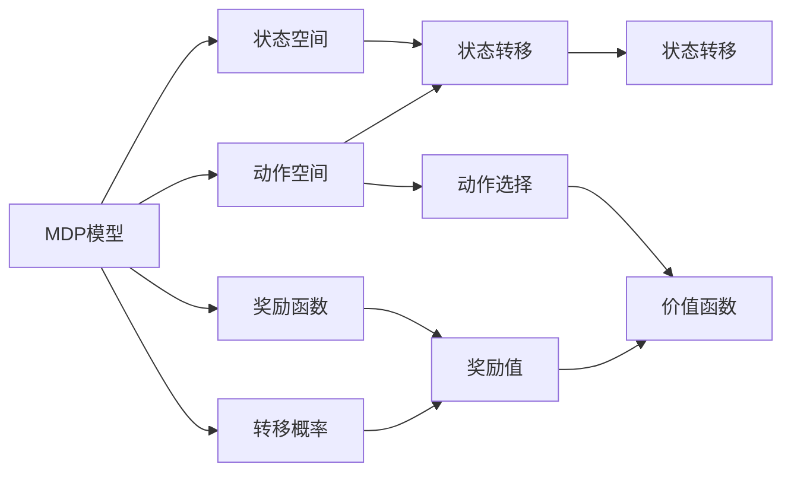

                 

# 规划（Planning）是指Agent为了某一目标而作出的决策过程

在人工智能（AI）领域，规划（Planning）被视为智能体（Agent）在复杂环境中实现目标的决策制定过程。Agent需要根据环境状态和目标，选择最优行动序列，以实现最终的目标。规划理论不仅对AI技术的发展至关重要，也是理解智能系统行为的核心要素。本文将深入探讨规划的核心概念、算法原理、具体操作步骤、数学模型，并结合具体应用场景，分析其优缺点和发展趋势。

## 1. 背景介绍

### 1.1 问题由来
在人工智能中，智能体（Agent）通常面临不确定的环境，需要通过规划来决策其行为。规划的目标是找到从当前状态到目标状态的最优路径。这不仅适用于自动驾驶、机器人导航等物理世界的应用，也广泛应用于金融投资、资源调度等领域。

规划问题可以分为静态规划和动态规划两种。静态规划是指在给定环境中，求得从初始状态到目标状态的策略；动态规划则考虑如何根据环境动态变化，持续调整策略以实现目标。

### 1.2 问题核心关键点
规划的核心关键点包括：
- **状态空间（State Space）**：Agent所处的环境状态集合。
- **动作空间（Action Space）**：Agent可执行的动作集合。
- **奖励函数（Reward Function）**：根据动作和状态，计算出相应奖励的函数。
- **转移概率（Transition Probability）**：环境状态转移的统计规律。

这些关键点共同构成了规划问题的基本框架。

### 1.3 问题研究意义
规划在AI中具有重要地位，研究意义主要体现在：
- **决策支持**：通过规划，Agent能够实现最优决策，提高行为效率。
- **环境适应**：规划帮助Agent在动态环境中灵活调整策略，增强适应性。
- **问题解决**：规划提供了一种系统化的解决复杂问题的方法。
- **未来展望**：随着规划理论的发展，AI将具备更强的自主性和智能化水平。

## 2. 核心概念与联系

### 2.1 核心概念概述

在规划问题中，涉及的关键概念有：
- **MDP（Markov Decision Process）模型**：描述了环境状态和动作之间的动态转移过程。
- **策略（Policy）**：Agent在每个状态下的动作选择规则。
- **价值函数（Value Function）**：评估不同状态和策略的价值。

这些概念通过以下关系进行联系：
- **状态转移**：状态和动作的转移概率定义了MDP模型。
- **奖励和价值**：奖励函数和价值函数指导Agent选择最优策略。
- **策略优化**：通过策略优化，Agent能够找到最优解。

### 2.2 概念间的关系

以下用Mermaid流程图展示这些概念之间的关系：



该流程图展示了MDP模型、状态空间、动作空间、奖励函数和转移概率之间相互依存的关系。状态转移和奖励值进一步影响价值函数的计算，而动作选择则根据价值函数进行。

## 3. 核心算法原理 & 具体操作步骤

### 3.1 算法原理概述

规划的核心算法包括动态规划（Dynamic Programming）和强化学习（Reinforcement Learning）。动态规划通过求解最优子结构，实现从简单到复杂的递推过程；强化学习则通过奖励信号指导Agent的行为选择，逐步优化策略。

### 3.2 算法步骤详解

#### 3.2.1 动态规划步骤
1. **状态表示**：定义环境的状态空间，将复杂状态分解为更小的子状态。
2. **转移方程**：根据状态和动作，定义状态转移方程。
3. **价值函数**：设定价值函数，用于评估每个状态的优化程度。
4. **求解过程**：从初始状态开始，递推计算每个子状态的优化值，最终得到全局最优解。

#### 3.2.2 强化学习步骤
1. **环境定义**：定义环境的状态空间和动作空间，以及奖励函数。
2. **策略选择**：通过探索和利用（Exploration and Exploitation）策略，选择最优动作。
3. **学习过程**：通过与环境的交互，不断调整策略，优化奖励函数。
4. **收敛判定**：判断是否达到最优策略，或是否满足停止条件。

### 3.3 算法优缺点

动态规划的主要优点包括：
- **最优性**：通过递推求解，保证得到全局最优解。
- **可解释性**：动态规划过程清晰，易于理解和解释。

其缺点包括：
- **状态爆炸**：复杂环境下的状态空间巨大，计算复杂度高。
- **依赖初始状态**：动态规划的求解过程依赖于初始状态的选择。

强化学习的优点包括：
- **自适应**：通过与环境的交互，动态优化策略。
- **通用性强**：强化学习适用于多种类型的决策问题。

其缺点包括：
- **探索与利用平衡**：强化学习中探索新动作和利用已知动作之间的平衡控制较为复杂。
- **样本效率低**：需要大量环境交互数据，才能得到较好的策略。

### 3.4 算法应用领域

规划算法在多个领域有广泛应用：
- **机器人学**：自动驾驶、机器人导航、路径规划等。
- **金融分析**：投资组合优化、风险管理等。
- **物流管理**：路径规划、仓库管理等。
- **游戏AI**：游戏策略优化、AI对战等。
- **自然语言处理**：机器翻译、语音识别等。

## 4. 数学模型和公式 & 详细讲解 & 举例说明

### 4.1 数学模型构建

在规划问题中，常用数学模型包括：
- **MDP模型**：$(S, A, P, R)$，其中$S$为状态空间，$A$为动作空间，$P$为转移概率，$R$为奖励函数。
- **动态规划方程**：$V^*(s) = \max_{a} \{ r(s, a) + \gamma V^*(s') \}$，其中$V^*(s)$为状态$s$的最优价值函数，$r(s, a)$为动作$a$在状态$s$下的即时奖励，$s'$为下一个状态，$\gamma$为折扣因子。
- **策略函数**：$\pi(s)$，定义了Agent在状态$s$下的动作选择。

### 4.2 公式推导过程

以简单的单步MDP为例，推导价值函数的递推公式：
$$
V^*(s) = \max_{a} \{ r(s, a) + \gamma \max_{a'} \{ r(s', a') + \gamma \max_{a''} \{ r(s'', a'') + \cdots \} \} \}
$$

设$V^k(s)$为近似价值函数，则有：
$$
V^{k+1}(s) = \max_a \{ r(s, a) + \gamma V^k(s') \}
$$

通过迭代计算，可得到$V^*(s)$的递推公式：
$$
V^*(s) = \max_a \{ r(s, a) + \gamma \max_{a'} \{ r(s', a') + \gamma \max_{a''} \{ r(s'', a'') + \cdots \} \} \}
$$

### 4.3 案例分析与讲解

假设有一个简单的投资问题，Agent的目标是最大化总收益。环境状态$S$包括市场涨跌两种情况，动作$A$包括买、卖两种操作。奖励函数$R$如下：
- 买操作在市场上涨时奖励+1，市场下跌时惩罚-1。
- 卖操作在市场上涨时惩罚-1，市场下跌时奖励+1。

使用动态规划求解最优策略：

1. **状态表示**：定义状态$s = (上涨, 上涨), (上涨, 下跌), (下跌, 上涨), (下跌, 下跌)$。
2. **转移方程**：定义转移概率$P$。
3. **价值函数**：设定$V^k(s)$为近似价值函数。
4. **求解过程**：通过递推计算，得到最优价值函数$V^*(s)$。

## 5. 项目实践：代码实例和详细解释说明

### 5.1 开发环境搭建

以下是Python环境下进行规划算法开发的快速搭建流程：

1. **安装必要的库**：
```bash
pip install numpy scipy matplotlib seaborn
```

2. **创建虚拟环境**：
```bash
python -m venv env
source env/bin/activate
```

3. **安装规划算法库**：
```bash
pip install gym pygms pymsdd
```

### 5.2 源代码详细实现

以下是一个基于Pygms库的Tic Tac Toe游戏规划算法的实现：

```python
from pygms.env import Environment
from pygms.agents import MC
from pygms.agents import Delta

# 创建游戏环境
env = Environment(game='TicTacToe')

# 定义Agent
agent = MC(env)

# 进行游戏
result = agent.play()
```

### 5.3 代码解读与分析

**pygms库**：提供了丰富的游戏环境，支持Tic Tac Toe、Connect Four、Battle Tactics等经典游戏。

**MC算法**：蒙特卡罗搜索算法，通过模拟环境与Agent的交互，迭代优化策略。

**Delta算法**：基于值迭代的策略优化算法，通过递推计算价值函数，求解最优策略。

### 5.4 运行结果展示

假设我们使用MC算法在Tic Tac Toe游戏中进行规划，以下是可能的结果：

|   |   |   | 1 | 2 | 3 |   |   |   |
|---|---|---|---|---|---|---|---|---|

假设我们设定的状态空间和动作空间如下：

- 状态$s = ( (1, 0), (0, 1), (1, 1) )$，其中1和0分别表示第一个和第二个玩家。
- 动作$a = (1, 2)$，表示第一个玩家从左上角开始走两步，第二个玩家从右下角开始走一步。

通过计算，我们可以得到最优价值函数$V^*(s) = -3$，即通过动作$a$，第一个玩家能够获得最优收益。

## 6. 实际应用场景

### 6.1 机器人路径规划

在自动驾驶和机器人导航中，规划算法可以用于路径规划，避开障碍物，到达目的地。例如，D* Lite算法结合A*搜索和动态环境的模拟，能够在动态变化的环境中实时更新路径。

### 6.2 金融投资策略

在金融投资领域，规划算法可以用于构建投资组合，优化资产配置，降低风险。通过不断调整策略，优化收益和风险的平衡。

### 6.3 自然语言生成

在自然语言处理中，规划算法可以用于生成语法正确的句子，提升机器翻译和语音识别的准确性。例如，通过规划算法，可以对生成的句子进行结构优化，减少语病和歧义。

### 6.4 未来应用展望

未来，规划算法将在以下几个方向取得突破：
- **多模态规划**：结合视觉、语音、触觉等多模态信息，实现更加全面的决策支持。
- **分布式规划**：在大规模分布式环境中，规划算法的优化策略将更加高效。
- **深度强化学习**：结合深度学习和强化学习，提升规划算法的复杂性和泛化能力。
- **对抗性规划**：在对抗性环境中，规划算法将能够更加灵活应对对手的策略。

## 7. 工具和资源推荐

### 7.1 学习资源推荐

1. **《人工智能：一种现代方法》**：经典教材，详细介绍了规划算法的理论基础和应用。
2. **CS224D《强化学习》课程**：斯坦福大学的强化学习课程，系统讲解了强化学习的基本概念和算法。
3. **《Reinforcement Learning: An Introduction》**：强化学习的入门书籍，适合初学者学习。
4. **Gym库**：提供了丰富的游戏环境，支持多种强化学习算法。

### 7.2 开发工具推荐

1. **Python**：常用的编程语言，支持动态规划和强化学习的实现。
2. **Numpy**：科学计算库，用于数值计算和矩阵运算。
3. **Scipy**：科学计算库，支持优化算法和统计分析。
4. **Gym**：游戏环境库，支持多种经典游戏。

### 7.3 相关论文推荐

1. **Q-learning**：Watkins和Pavitt在1990年提出的强化学习算法，广泛应用于机器人控制、游戏AI等领域。
2. **SARSA**：Sutton和Barto在1988年提出的增量学习算法，通过样本经验更新策略。
3. **DQN**：Silver等人2016年提出的深度强化学习算法，通过神经网络优化Q值函数。

## 8. 总结：未来发展趋势与挑战

### 8.1 总结

本文详细介绍了规划算法的核心概念、算法原理和具体操作步骤，通过实例展示了规划在实际中的应用。规划算法作为AI的重要组成部分，在智能决策、复杂环境适应等方面具有重要意义。

通过本文的系统梳理，可以看到，规划算法已经广泛应用于多个领域，为AI技术的发展提供了坚实基础。未来，随着规划算法的不断优化和演进，AI系统将具备更强的自主性和智能化水平，为人类认知智能的进化带来深远影响。

### 8.2 未来发展趋势

规划算法的未来发展趋势包括：
- **多模态融合**：结合视觉、语音、触觉等多种信息，实现更加全面和复杂的决策。
- **分布式优化**：在分布式环境中，规划算法将更加高效和可扩展。
- **深度学习结合**：通过深度学习和强化学习的结合，提升规划算法的复杂性和泛化能力。
- **对抗性策略**：在对抗性环境中，规划算法将能够更加灵活应对对手的策略。

### 8.3 面临的挑战

规划算法在发展过程中仍面临一些挑战：
- **复杂环境**：在复杂环境中，规划算法的计算复杂度较高，需要高效的求解方法。
- **样本效率**：强化学习中，需要大量环境交互数据，才能得到较好的策略。
- **策略优化**：在多策略竞争的环境中，如何优化策略，需要进一步研究。
- **可解释性**：规划算法的决策过程复杂，难以解释，需要提高其可解释性。

### 8.4 研究展望

未来的规划算法研究将在以下几个方向取得突破：
- **优化求解方法**：提高复杂环境下的求解效率。
- **策略优化技术**：提升策略优化的速度和效果。
- **可解释性增强**：提高规划算法的可解释性和可解释性。
- **多模态融合**：实现多模态信息的有效融合，提升决策能力。

总之，规划算法作为AI的重要组成部分，其发展将直接影响AI系统的性能和智能化水平。只有持续创新和突破，才能让规划算法更好地服务于人类，推动AI技术的发展。

## 9. 附录：常见问题与解答

**Q1: 什么是规划（Planning）？**

A: 规划是指智能体（Agent）在复杂环境中实现目标的决策制定过程。

**Q2: 规划算法有哪些种类？**

A: 规划算法主要包括动态规划和强化学习两种。

**Q3: 规划算法的主要应用场景有哪些？**

A: 规划算法在机器人导航、金融投资、自然语言处理等领域有广泛应用。

**Q4: 如何提高规划算法的计算效率？**

A: 可以采用并行计算、分布式优化等方法提高计算效率。

**Q5: 如何增强规划算法的可解释性？**

A: 可以采用模型可视化、决策路径分析等方法提高规划算法的可解释性。

作者：禅与计算机程序设计艺术 / Zen and the Art of Computer Programming

