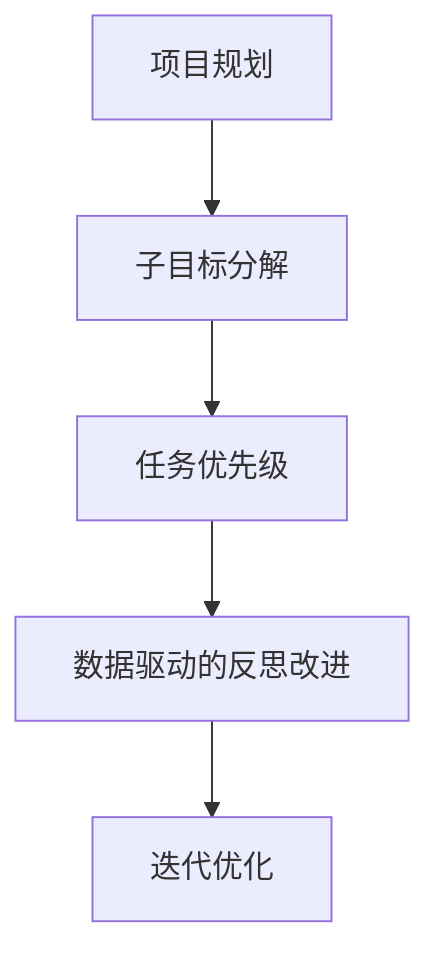
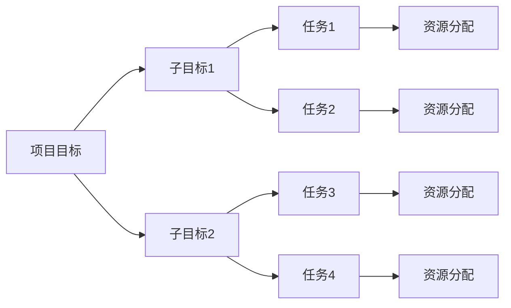
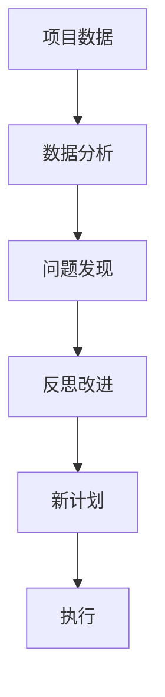
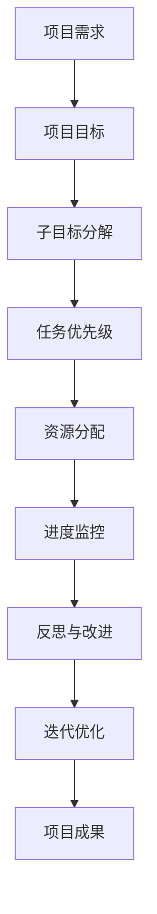

                 

# 规划：子目标分解与反思改进

> 关键词：
- 项目规划
- 子目标分解
- 时间管理
- 任务优先级
- 反馈与改进
- 迭代优化

## 1. 背景介绍

### 1.1 问题由来
在复杂的项目管理中，制定科学有效的规划是成功的关键。但面对庞大且复杂的项目任务，如何合理规划并优化执行过程，成为了项目管理中的一个核心难题。传统的项目管理方法往往采用自顶向下的方式，由项目经理主导规划，这种方式虽然能覆盖项目的整体需求，但难以细致到每个执行环节。因此，如何将项目划分为可操作、可管理的子目标，并通过反思和改进不断优化项目执行过程，成为了当前项目管理的一个重要课题。

### 1.2 问题核心关键点
项目规划的核心关键点包括：
- 如何科学合理地将项目划分为多个子目标，确保每个子目标清晰明确、可执行、可衡量。
- 如何根据项目需求和资源，设定子目标之间的优先级和依赖关系。
- 如何收集和处理项目执行过程中的数据，进行反思和改进，不断优化项目进度和质量。
- 如何在执行过程中及时调整子目标和优先级，以应对变化和不确定性。
- 如何通过迭代和反馈机制，实现持续的自我改进和提升。

这些关键点构成了项目规划的框架，旨在通过子目标分解、优先级设定、数据驱动的反思改进和持续优化，实现项目的顺利执行和高质量交付。

### 1.3 问题研究意义
科学合理地进行项目规划，能够显著提升项目管理效率，降低项目风险，确保项目目标的顺利实现。

具体意义包括：
1. **提高执行效率**：通过细化任务和明确优先级，项目团队能够更高效地分配资源和执行任务。
2. **降低风险**：通过设定子目标和依赖关系，能够更早发现和解决潜在问题，避免项目延误或失败。
3. **提升质量**：通过反思和改进机制，及时调整项目计划和执行策略，确保项目成果达到预期质量标准。
4. **增强灵活性**：通过迭代和反馈机制，项目团队能够快速响应变化，适应不确定性，确保项目目标的实现。
5. **提升团队协作**：通过明确的任务分解和优先级设定，促进团队成员间的协作和沟通，提升团队凝聚力。

总之，科学的项目规划和执行管理，是实现项目成功的关键因素。面对日益复杂和动态变化的项目需求，如何在不确定性和变化中保持高效、高质量的执行，是大项目管理中的重要课题。

## 2. 核心概念与联系

### 2.1 核心概念概述

为更好地理解子目标分解与反思改进的规划方法，本节将介绍几个密切相关的核心概念：

- **项目规划(Project Planning)**：通过明确项目目标、分解任务、设定优先级等手段，科学合理地制定项目执行计划。
- **子目标分解(Subgoal Decomposition)**：将整体项目划分为多个可操作、可衡量的子目标，每个子目标独立可执行，互不干扰。
- **任务优先级(Task Priority)**：根据项目需求和资源状况，设定子目标之间的优先级关系，确保关键任务的优先执行。
- **数据驱动的反思改进(Data-Driven Reflection & Improvement)**：通过收集和分析项目执行数据，反思执行过程中存在的问题，及时调整执行策略，实现项目的高效执行和质量提升。
- **迭代优化(Iterative Optimization)**：在项目执行过程中，通过多次迭代和反馈，不断优化项目规划和执行策略，提升项目成果的质量和效率。

这些核心概念之间通过以下Mermaid流程图来展示：



这个流程图展示了大项目管理中各个关键概念之间的关系：

1. 项目规划是整个项目管理的起始点，通过设定项目目标，细化任务和优先级。
2. 子目标分解是将任务进一步细化，确保每个子目标独立可执行。
3. 任务优先级设定，确保关键任务的优先执行，提升项目管理效率。
4. 数据驱动的反思改进，通过收集和分析数据，及时发现和解决问题，提升项目质量。
5. 迭代优化，通过多次迭代和反馈，不断优化项目执行策略，实现高质量交付。

这些概念共同构成了项目规划的完整框架，通过科学合理地划分子目标、设定优先级、数据驱动的反思改进和迭代优化，确保项目的高效、高质量执行。

### 2.2 概念间的关系

这些核心概念之间存在着紧密的联系，形成了项目管理规划的完整生态系统。下面我通过几个Mermaid流程图来展示这些概念之间的关系。

#### 2.2.1 项目规划的完整流程


这个流程图展示了项目规划的完整流程：

1. 从项目需求出发，设定项目目标。
2. 将项目目标细化为多个子目标。
3. 根据项目需求和资源状况，设定子目标的优先级和依赖关系。
4. 合理分配资源，制定详细的进度计划。
5. 监控项目进度，及时发现和解决问题。
6. 通过反思和改进机制，优化项目执行策略。
7. 通过多次迭代和反馈，不断提升项目执行效果。

#### 2.2.2 子目标分解与任务优先级



这个流程图展示了子目标分解和任务优先级的关系：

1. 将项目目标分解为多个子目标。
2. 根据项目需求和资源状况，设定子目标之间的优先级关系。
3. 为每个子目标下的任务分配资源，确保关键任务优先执行。

#### 2.2.3 数据驱动的反思改进



这个流程图展示了数据驱动的反思改进过程：

1. 收集和分析项目执行数据。
2. 通过数据分析，发现项目执行中存在的问题。
3. 基于问题发现，进行反思和改进。
4. 制定新的项目计划。
5. 执行新的项目计划。

#### 2.2.4 迭代优化


这个流程图展示了迭代优化的过程：

1. 项目执行过程中收集反馈。
2. 通过反思改进，制定新的项目计划。
3. 执行新的项目计划。
4. 收集新的反馈，进行新一轮的反思改进。
5. 不断迭代，优化项目执行效果。

### 2.3 核心概念的整体架构

最后，我们用一个综合的流程图来展示这些核心概念在大项目管理中的整体架构：



这个综合流程图展示了从项目需求到项目成果的完整过程：

1. 从项目需求出发，设定项目目标。
2. 将项目目标分解为多个子目标。
3. 根据项目需求和资源状况，设定子目标的优先级和依赖关系。
4. 合理分配资源，制定详细的进度计划。
5. 监控项目进度，及时发现和解决问题。
6. 通过反思和改进机制，优化项目执行策略。
7. 通过多次迭代和反馈，不断提升项目执行效果。
8. 最终完成项目成果交付。

通过这些流程图，我们可以更清晰地理解项目管理规划中各个核心概念的关系和作用，为后续深入讨论具体的规划方法和技术奠定基础。

## 3. 核心算法原理 & 具体操作步骤
### 3.1 算法原理概述

科学合理地进行项目规划，需要一套系统化的算法原理和方法。以下是基于子目标分解与反思改进的规划方法的核心算法原理：

1. **子目标分解算法**：将整体项目目标细化为多个独立可执行的子目标，确保每个子目标清晰明确、可衡量。
2. **任务优先级算法**：根据项目需求和资源状况，设定子目标之间的优先级关系，确保关键任务的优先执行。
3. **数据驱动的反思改进算法**：通过收集和分析项目执行数据，反思执行过程中存在的问题，及时调整执行策略，实现项目的高效执行和质量提升。
4. **迭代优化算法**：在项目执行过程中，通过多次迭代和反馈，不断优化项目规划和执行策略，提升项目成果的质量和效率。

### 3.2 算法步骤详解

#### 3.2.1 子目标分解算法

**Step 1: 确定项目目标**
- 与项目相关方充分沟通，明确项目需求和目标。
- 定义项目的总体目标和每个子目标的预期成果。

**Step 2: 划分项目阶段**
- 根据项目目标和需求，划分多个阶段。
- 每个阶段可以分解为多个子目标，每个子目标独立可执行。

**Step 3: 细化任务清单**
- 为每个子目标细化具体的任务清单。
- 任务清单应包含详细的步骤、执行人员、所需资源和时间估算。

**Step 4: 任务分解**
- 将任务进一步细化为更小、更可执行的任务单元。
- 每个任务单元应具有明确的目标、执行人员、时间估算和质量标准。

**Step 5: 任务依赖关系**
- 设定任务之间的依赖关系，确保任务执行的顺序和优先级。
- 使用图形化工具如PERT图、Gantt图等表示任务依赖关系。

#### 3.2.2 任务优先级算法

**Step 1: 识别关键任务**
- 根据项目目标和需求，识别出对项目成功至关重要的关键任务。
- 关键任务应具有高优先级和明确的里程碑。

**Step 2: 分配优先级**
- 根据关键任务的重要性和资源可用性，设定任务优先级。
- 使用如A-B-C等级或其他优先级指标，明确每个任务的执行顺序。

**Step 3: 资源分配**
- 根据任务优先级和资源状况，合理分配资源。
- 确保关键任务有充足的资源支持，提升项目执行效率。

#### 3.2.3 数据驱动的反思改进算法

**Step 1: 数据收集**
- 收集项目执行过程中的数据，如任务进度、资源使用情况、项目成本等。
- 使用工具如JIRA、Trello等管理项目数据。

**Step 2: 数据分析**
- 对收集到的数据进行统计和分析，发现项目执行中的问题和瓶颈。
- 使用数据分析工具如Excel、R、Python等进行数据处理和分析。

**Step 3: 问题发现**
- 基于数据分析结果，识别出项目执行中的主要问题和挑战。
- 问题应具体、明确，可操作性强。

**Step 4: 反思改进**
- 针对发现的问题，进行反思和改进。
- 制定详细的改进计划，明确改进措施和责任人。

**Step 5: 新计划制定**
- 根据反思和改进结果，制定新的项目计划。
- 新计划应包含详细的任务、时间、资源和质量标准。

#### 3.2.4 迭代优化算法

**Step 1: 初始计划制定**
- 基于项目需求和资源状况，制定初步的项目计划。
- 计划应包含详细的任务、优先级和资源分配。

**Step 2: 执行和监控**
- 执行项目计划，监控项目进度和质量。
- 使用项目管理工具如JIRA、Asana等跟踪任务进度。

**Step 3: 反馈收集**
- 在项目执行过程中，收集各方反馈。
- 反馈应包括任务进度、资源使用情况、质量问题等。

**Step 4: 反思与改进**
- 基于反馈结果，进行反思和改进。
- 制定详细的改进计划，明确改进措施和责任人。

**Step 5: 新计划制定**
- 根据反思和改进结果，制定新的项目计划。
- 新计划应包含详细的任务、时间、资源和质量标准。

**Step 6: 多次迭代**
- 通过多次迭代和反馈，不断优化项目执行策略。
- 每次迭代应明确改进目标和改进措施。

### 3.3 算法优缺点

基于子目标分解与反思改进的项目规划方法具有以下优点：

1. **提高执行效率**：通过细化任务和明确优先级，项目团队能够更高效地分配资源和执行任务。
2. **降低风险**：通过设定子目标和依赖关系，能够更早发现和解决潜在问题，避免项目延误或失败。
3. **提升质量**：通过反思和改进机制，及时调整项目计划和执行策略，确保项目成果达到预期质量标准。
4. **增强灵活性**：通过迭代和反馈机制，项目团队能够快速响应变化，适应不确定性，确保项目目标的实现。

同时，该方法也存在一些局限性：

1. **资源消耗大**：细化任务和优先级设定需要大量的人力和时间投入。
2. **数据复杂性**：数据收集和分析过程较为复杂，需要相应的工具和技术支持。
3. **动态适应性**：在项目执行过程中，需要根据实际情况不断调整计划，增加了项目管理的复杂性。

尽管存在这些局限性，但就目前而言，基于子目标分解与反思改进的项目规划方法仍是大项目管理的主流范式。未来相关研究的重点在于如何进一步降低资源消耗、提高数据管理效率，同时兼顾灵活性和稳定性。

### 3.4 算法应用领域

基于子目标分解与反思改进的项目规划方法，已经在各行各业得到广泛应用，覆盖了几乎所有常见项目类型，例如：

- **软件开发**：软件项目的任务分解、优先级设定、数据驱动的反思改进和迭代优化。
- **建筑工程**：建筑项目的任务分解、进度监控、反思改进和质量控制。
- **市场营销**：市场活动的任务分解、优先级设定、数据分析和反思改进。
- **教育培训**：培训项目的任务分解、进度监控、反思改进和质量评估。
- **金融投资**：投资项目的任务分解、优先级设定、数据分析和反思改进。
- **医疗健康**：医疗项目的任务分解、进度监控、反思改进和质量控制。

除了上述这些经典应用外，基于子目标分解与反思改进的项目规划方法还在更多领域得到创新性地应用，如公共事务管理、环境保护、灾害应对等，为项目管理带来了新的解决方案。随着项目管理理论的不断演进，相信基于子目标分解与反思改进的规划方法将在更多领域大放异彩。

## 4. 数学模型和公式 & 详细讲解  
### 4.1 数学模型构建

本节将使用数学语言对基于子目标分解与反思改进的项目规划方法进行更加严格的刻画。

记项目总目标为 $G$，子目标集合为 $S=\{S_1, S_2, ..., S_n\}$，每个子目标 $S_i$ 对应一个任务集合 $T_i=\{T_{i1}, T_{i2}, ..., T_{im}\}$，每个任务 $T_{ij}$ 对应一个执行步骤集合 $C_{ij}=\{C_{ij1}, C_{ij2}, ..., C_{ijn}\}$，其中 $n$ 为子目标数量，$m$ 为每个子目标的任务数量，$k$ 为每个任务的执行步骤数量。

定义任务 $T_{ij}$ 的优先级为 $P_{ij}$，资源需求量为 $R_{ij}$，时间估算为 $T_{ij}$，完成度为 $D_{ij}$。定义项目执行总进度为 $P$，资源使用总量为 $R$，项目成本为 $C$。

项目规划的目标是最小化项目总成本，最大化项目总进度和资源使用效率，即：

$$
\mathop{\min}_{P_{ij}, R_{ij}, T_{ij}, D_{ij}} \mathcal{C}(P_{ij}, R_{ij}, T_{ij}, D_{ij})
$$

$$
\mathop{\max}_{P_{ij}, R_{ij}, T_{ij}, D_{ij}} \mathcal{P}(P_{ij}, R_{ij}, T_{ij}, D_{ij})
$$

其中 $\mathcal{C}$ 和 $\mathcal{P}$ 分别为项目成本和项目进度的计算公式。

### 4.2 公式推导过程

以下我们以软件开发项目为例，推导任务优先级和资源分配的计算公式。

假设软件开发项目包含 $n=5$ 个子目标，每个子目标对应的任务数量 $m_i$ 不等，且每个任务的执行步骤数量 $k_{ij}$ 相同。项目进度和资源使用情况如下表所示：

| 子目标 | 任务 | 优先级 | 资源需求量 | 时间估算 | 完成度 |
| ------ | ---- | ------ | ---------- | -------- | ------ |
| S1     | T1   | 2      | 10         | 3周      | 0.6    |
| S1     | T2   | 3      | 15         | 4周      | 0.4    |
| S1     | T3   | 1      | 8          | 2周      | 0.8    |
| S2     | T4   | 4      | 20         | 6周      | 0.7    |
| S2     | T5   | 5      | 25         | 5周      | 0.5    |
| ...    | ...  | ...    | ...        | ...      | ...    |

定义任务优先级 $P_{ij}$ 的计算公式为：

$$
P_{ij} = \alpha \cdot \text{重要性} + \beta \cdot \text{风险性}
$$

其中 $\alpha$ 和 $\beta$ 为优先级权重，$\text{重要性}$ 和 $\text{风险性}$ 为任务的重要性和风险评估指标。

定义资源需求量 $R_{ij}$ 的计算公式为：

$$
R_{ij} = \text{人员需求} + \text{设备需求} + \text{其他资源需求}
$$

定义时间估算 $T_{ij}$ 的计算公式为：

$$
T_{ij} = \text{实际执行时间} \times \text{执行步骤数} = T_{ij} \times k_{ij}
$$

定义完成度 $D_{ij}$ 的计算公式为：

$$
D_{ij} = \frac{\text{已执行时间}}{\text{计划执行时间}} = \frac{D_{ij} \times k_{ij}}{T_{ij}}
$$

### 4.3 案例分析与讲解

以下是一个软件开发项目的案例分析：

假设一个软件开发项目包含 $n=5$ 个子目标，每个子目标对应的任务数量 $m_i$ 分别为 $m_1=3$，$m_2=2$，$m_3=4$，$m_4=5$，$m_5=3$。项目进度和资源使用情况如下表所示：

| 子目标 | 任务 | 优先级 | 资源需求量 | 时间估算 | 完成度 |
| ------ | ---- | ------ | ---------- | -------- | ------ |
| S1     | T1   | 2      | 10         | 3周      | 0.6    |
| S1     | T2   | 3      | 15         | 4周      | 0.4    |
| S1     | T3   | 1      | 8          | 2周      | 0.8    |
| S2     | T4   | 4      | 20         | 6周      | 0.7    |
| S2     | T5   | 5      | 25         | 5周      | 0.5    |
| S3     | T6   | 2      | 12         | 4周      | 0.7    |
| S3     | T7   | 3      | 18         | 5周      | 0.6    |
| S3     | T8   | 1      | 9          | 3周      | 0.9    |
| ...    | ...  | ...    | ...        | ...      | ...    |

首先，根据任务优先级计算公式，计算每个任务的优先级：

$$
P_{11} = 2 \cdot 0.8 + 0.2 \cdot 0.5 = 2.1
$$
$$
P_{12} = 2 \cdot 0.4 + 0.2 \cdot 0.5 = 1.7
$$
$$
P_{13} = 2 \cdot 0.6 + 0.2 \cdot 0.5 = 1.9
$$
$$
P_{21} = 4 \cdot 0.7 + 0.2 \cdot 0.6 = 3.22
$$
$$
P_{22} = 4 \cdot 0.5 + 0.2 \cdot 0.6 = 2.66
$$

然后，根据资源需求量和时间估算，计算每个子目标的总资源需求和时间估算：

$$
R_{1} = 10 + 15 + 8 = 33
$$
$$
T_{1} = 3 \times 3 = 9
$$
$$
R_{2} = 20 + 25 = 45
$$
$$
T_{2} = 6 \times 2 = 12
$$

最后，根据完成度，计算每个子目标的实际进度和完成情况：

$$
D_{1} = \frac{0.6 \times 3 + 0.4 \times 4 + 0.8 \times 2}{9} = 0.728
$$
$$
D_{2} = \frac{0.7 \times 6 + 0.5 \times 5}{12} = 0.75
$$

以上案例分析展示了基于子目标分解与反思改进的项目规划方法的具体应用，通过细化任务、设定优先级、数据分析和反思改进，可以有效提升项目执行效率和质量。

## 5. 项目实践：代码实例和详细解释说明
### 5.1 开发环境搭建

在进行项目规划实践前，我们需要准备好开发环境。以下是使用Python进行项目规划工具的开发环境配置流程：

1. 安装Anaconda：从官网下载并安装Anaconda，用于创建独立的Python环境。

2. 创建并激活虚拟环境：
```bash
conda create -n project-planning python=3.8 
conda activate project-planning
```

3. 安装相关库：
```bash
pip install pandas numpy matplotlib
```

4. 安装项目管理工具：
```bash
pip install pyproj trello json
```

完成上述步骤后，即可在`project-planning`环境中开始项目规划实践。

### 5.2 源代码详细实现

下面我们以软件开发项目为例，给出使用Python进行项目规划的代码实现。

首先，定义项目规划的类：

```python
from collections import defaultdict

class ProjectPlanning:
    def __init__(self, name):
        self.name = name
        self.subgoals = defaultdict(dict)
        self.subgoal_priorities = defaultdict(int)
        self.resource_allocation = defaultdict(int)
        self.task_list = []
        self.task_dependencies = defaultdict(set)
        self.task_priorities = defaultdict(int)
        self.task_resources = defaultdict(int)
        self.task_estimates = defaultdict(int)
        self.task_progress = defaultdict(float)
        
    def add_subgoal(self, subgoal_name, resources, estimations):
        self.subgoals[subgoal_name] = {'total_resources': resources, 'total_estimations': estimations}
        
    def set_subgoal_priorities(self, subgoal_name, priorities):
        self.subgoal_priorities[subgoal_name] = priorities
        
    def allocate_resources(self, subgoal_name, resource_id, amount):
        self.resource_allocation[subgoal_name][resource_id] = amount
        
    def add_task(self, task_name, subgoal_name, resources, estimates):
        self.task_list.append((task_name, subgoal_name))
        self.task_dependencies[subgoal_name].add(task_name)
        self.task_resources[task_name] = resources
        self.task_estimates[task_name] = estimates
        
    def set_task_priorities(self, task_name, priority):
        self.task_priorities[task_name] = priority
        
    def set_task_resources(self, task_name, resources):
        self.task_resources[task_name] = resources
        
    def set_task_estimates(self, task_name, estimates):
        self.task_estimates[task_name] = estimates
        
    def update_task_progress(self, task_name, progress):
        self.task_progress[task_name] = progress

