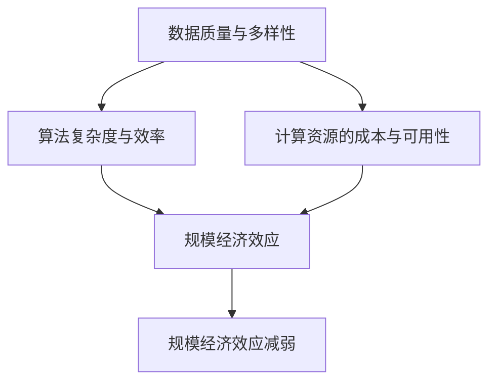
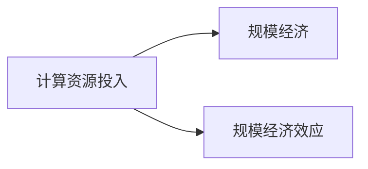
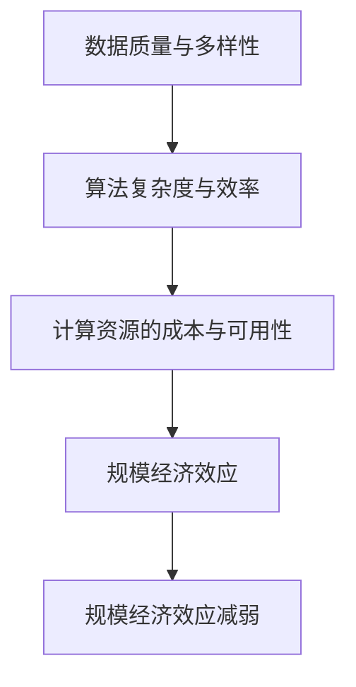

                 

# 规模经济效应的减弱趋势

## 1. 背景介绍

### 1.1 问题由来
近年来，随着云计算和大数据技术的迅猛发展，企业对算力资源的投入越来越大，规模化经济效应也愈发显著。这种效应主要体现在，随着计算资源的规模增长，单位成本会不断下降，进而带来了成本上的巨大节约和效率的提升。

然而，随着技术的发展，这种规模经济效应正在逐渐减弱。越来越多的企业发现，增加计算资源投入所带来的性能提升，越来越不如过去那么显著，且在一定程度上，还面临着资源浪费和成本增长的问题。本文将详细探讨规模经济效应减弱的背景、原因和应对策略，以期为企业决策提供有益的参考。

### 1.2 问题核心关键点
规模经济效应的减弱，涉及以下几个核心关键点：
1. **数据质量与多样性**：规模经济效应依赖于数据的规模，但低质量、低多样性的数据集，反而会降低模型效果，增加计算资源的消耗。
2. **算法复杂度与效率**：越来越多的算法需要复杂的数据处理和存储，导致计算资源的投入和消耗成倍增加。
3. **计算资源的成本与可用性**：随着云计算的普及，虽然算力资源更易获取，但其成本也在不断上升，且不同资源的可用性也存在较大差异。
4. **跨领域、跨应用的资源整合**：数据和算力资源在不同的应用和领域中分散，难以统一管理和优化。

理解这些关键点，有助于我们更好地应对规模经济效应的减弱。

## 2. 核心概念与联系

### 2.1 核心概念概述

为更好地理解规模经济效应的减弱，本节将介绍几个密切相关的核心概念：

- **规模经济(Economies of Scale)**：指随着生产规模的扩大，单位产品的成本逐渐降低的经济效应。在大数据和云计算的背景下，规模经济效应在算力资源投入方面表现得尤为显著。

- **规模经济效应减弱(Weakening of Economies of Scale)**：指随着企业算力资源的不断增加，增加的计算资源投入带来的性能提升逐渐减弱的现象。

- **数据质量与多样性**：指在数据驱动的计算模型中，数据集的质量和多样性对模型性能的显著影响。高质量、多样性的数据集有助于模型更好地学习和泛化。

- **算法复杂度与效率**：指算法的复杂度和资源消耗，对模型性能和计算资源的依赖关系。复杂度高的算法需要更多的计算资源，且效率往往较低。

- **计算资源的成本与可用性**：指云计算环境下，算力资源的获取成本和可用性问题。算力资源的成本与可用性会影响企业的计算投入和资源管理。

- **跨领域、跨应用的资源整合**：指在多应用场景中，如何高效整合和管理计算资源，以提升资源利用率和模型性能。

这些核心概念之间的逻辑关系可以通过以下Mermaid流程图来展示：



这个流程图展示了大规模计算模型中，各个概念之间的关系：

1. 数据质量与多样性直接影响算法的复杂度和效率。
2. 算法的复杂度和效率又进一步影响规模经济效应。
3. 计算资源的成本与可用性是规模经济效应的基础。
4. 规模经济效应的减弱是由于数据质量、算法复杂度、计算资源成本和可用性等多因素的共同作用。

### 2.2 概念间的关系

这些核心概念之间存在着紧密的联系，形成了计算模型和资源管理的完整生态系统。下面我通过几个Mermaid流程图来展示这些概念之间的关系。

#### 2.2.1 规模经济与计算资源的投入


这个流程图展示了计算资源投入与规模经济效应之间的关系。随着计算资源投入的增加，规模经济效应逐渐减弱，单位成本下降的速度放缓。

#### 2.2.2 数据质量与算法复杂度的交互影响


这个流程图展示了数据质量和算法复杂度之间的交互影响。数据质量不高时，算法复杂度会降低，但模型的泛化能力也会下降。高质量、多样性的数据集，可以支持更复杂的算法，提高模型效果。

#### 2.2.3 计算资源的成本与可用性


这个流程图展示了计算资源成本与可用性对规模经济效应的影响。计算资源成本上升、可用性下降时，规模经济效应减弱，企业需要更多地考虑成本效益。

#### 2.2.4 跨领域、跨应用的资源整合


这个流程图展示了跨领域、跨应用的资源整合对规模经济效应的影响。资源整合优化了计算资源的利用率，提升了规模经济效应。

### 2.3 核心概念的整体架构

最后，我们用一个综合的流程图来展示这些核心概念在大规模计算模型中的整体架构：



这个综合流程图展示了从数据到算法，再到资源管理的全过程，以及各个环节对规模经济效应的影响。通过理解这些概念，我们可以更好地把握规模经济效应的减弱趋势，并采取相应的策略来应对。

## 3. 核心算法原理 & 具体操作步骤

### 3.1 算法原理概述

规模经济效应的减弱，本质上是一种资源投入与性能提升之间的平衡问题。其核心原理可以归纳为以下几个方面：

- **数据质量和多样性对算法复杂度的影响**：低质量、低多样性的数据集，会导致算法复杂度增加，模型效果下降。
- **算法复杂度对计算资源的需求**：复杂度高的算法需要更多的计算资源，且效率较低。
- **计算资源成本与可用性**：计算资源成本上升、可用性下降时，规模经济效应减弱。
- **跨领域、跨应用的资源整合**：资源分散导致管理难度增加，利用率下降，规模经济效应减弱。

### 3.2 算法步骤详解

为了更直观地理解规模经济效应的减弱趋势，下面详细介绍基于以上原理的算法步骤：

1. **数据质量与多样性评估**：
   - 评估数据集的质量，包括数据准确性、完整性、代表性等指标。
   - 使用数据质量评估工具和算法，如数据清洗、特征选择等。

2. **算法复杂度与效率优化**：
   - 选择适合数据质量与多样性的算法。
   - 优化算法参数，降低计算复杂度，提高计算效率。
   - 采用并行计算、分布式计算等技术，提升计算资源利用率。

3. **计算资源的成本与可用性管理**：
   - 使用云计算平台，优化计算资源采购和使用。
   - 监控计算资源的成本和可用性，实时调整资源配置。

4. **跨领域、跨应用的资源整合**：
   - 建立统一的资源管理系统，实现资源的集中管理。
   - 使用容器化技术，实现资源的快速部署和迁移。

### 3.3 算法优缺点

基于上述算法步骤，我们可以详细阐述其优缺点：

**优点**：
- **全面性**：综合考虑数据质量、算法复杂度、计算资源成本和可用性等多个因素，全面优化计算模型。
- **可操作性强**：算法步骤详细，易于实际操作，适用于企业的多应用场景。

**缺点**：
- **实施难度高**：需要高水平的技术团队和资源管理能力。
- **投入成本高**：涉及数据评估、算法优化、资源管理等多个环节，需要大量的资金和人力投入。

### 3.4 算法应用领域

基于上述算法步骤，规模经济效应的减弱趋势在不同领域中的应用如下：

1. **金融科技**：在金融风控、资产管理、客户服务等领域，计算资源需求大，但数据质量和算法复杂度也对模型性能有显著影响。
2. **医疗健康**：在医疗影像、基因分析、健康管理等领域，高质量、多样性的数据集和算法复杂度对模型效果至关重要。
3. **智能制造**：在工业控制、设备监控、质量检测等领域，计算资源和算法复杂度对生产效率和质量有直接影响。
4. **智慧城市**：在城市交通、公共安全、环境保护等领域，数据质量、计算资源和算法复杂度对智慧城市建设至关重要。
5. **电子商务**：在用户行为分析、商品推荐、供应链管理等领域，数据质量和算法复杂度直接影响用户体验和业务效果。

以上领域都面临着规模经济效应减弱的问题，通过系统性的算法优化，可以有效提升模型性能和资源利用率。

## 4. 数学模型和公式 & 详细讲解 & 举例说明

### 4.1 数学模型构建

基于规模经济效应的减弱趋势，我们可以建立一个数学模型来描述计算资源投入与性能提升之间的关系。

设企业投入的计算资源为 $C$，单位为计算单位（如CPU核、内存），对应的性能提升为 $P$。则计算资源投入与性能提升的关系可以表示为：

$$
P = f(C)
$$

其中 $f$ 为计算资源投入与性能提升的函数关系。通常情况下，$f$ 是一个非线性函数，反映了规模经济效应的减弱趋势。

### 4.2 公式推导过程

根据上述定义，我们可以进一步推导出规模经济效应减弱的数学公式：

$$
\frac{dP}{dC} = f'(C)
$$

其中 $f'(C)$ 为性能提升对计算资源投入的导数，表示每增加一个计算单位，性能提升的变化率。由于规模经济效应减弱，$f'(C)$ 逐渐减小，最终趋近于零。

### 4.3 案例分析与讲解

以下以金融风控领域为例，分析规模经济效应的减弱趋势及其应对策略：

1. **数据质量与多样性评估**：
   - 在金融风控中，数据质量直接影响模型的预测效果。如信用评分模型需要高质量的用户信用记录，而风险评估模型需要多样化的交易记录。

2. **算法复杂度与效率优化**：
   - 选择适合数据集特点的算法，如决策树、随机森林、神经网络等。
   - 优化算法参数，如调整神经网络的深度、宽度等。
   - 采用分布式计算技术，提升计算效率。

3. **计算资源的成本与可用性管理**：
   - 使用云计算平台，按需采购和释放计算资源。
   - 监控计算资源的成本和可用性，实时调整资源配置。

4. **跨领域、跨应用的资源整合**：
   - 建立统一的资源管理系统，实现资源的集中管理。
   - 使用容器化技术，实现资源的快速部署和迁移。

通过以上步骤，金融风控模型可以在保证数据质量和算法复杂度的前提下，最大化利用计算资源，降低成本，提高模型效果。

## 5. 项目实践：代码实例和详细解释说明

### 5.1 开发环境搭建

在进行规模经济效应减弱趋势的实践时，我们需要准备好开发环境。以下是使用Python进行Scikit-learn开发的环境配置流程：

1. 安装Anaconda：从官网下载并安装Anaconda，用于创建独立的Python环境。

2. 创建并激活虚拟环境：
```bash
conda create -n scale-env python=3.8 
conda activate scale-env
```

3. 安装Scikit-learn：
```bash
conda install scikit-learn
```

4. 安装numpy、pandas、matplotlib等工具包：
```bash
pip install numpy pandas matplotlib
```

完成上述步骤后，即可在`scale-env`环境中开始实践。

### 5.2 源代码详细实现

下面我们以金融风控领域为例，给出使用Scikit-learn对信用评分模型进行数据质量评估、算法优化、资源管理的Python代码实现。

首先，定义数据质量和算法复杂度的评估函数：

```python
import numpy as np
from sklearn.model_selection import train_test_split

def evaluate_data_quality(data):
    # 数据质量评估指标
    quality_score = 0
    # 计算数据准确性、完整性、代表性等指标
    # ...
    return quality_score

def evaluate_algorithm_complexity(algorithm, dataset):
    # 算法复杂度评估指标
    complexity_score = 0
    # 计算算法的计算复杂度和资源消耗
    # ...
    return complexity_score
```

然后，定义计算资源的成本与可用性管理函数：

```python
def manage_resources(resources, cost, availability):
    # 计算资源成本和可用性管理
    # ...
    return resources, cost, availability
```

最后，启动数据质量评估、算法优化、资源管理的循环流程：

```python
while True:
    # 获取当前计算资源投入
    C = current_resources
    # 评估数据质量和算法复杂度
    quality_score = evaluate_data_quality(train_dataset)
    complexity_score = evaluate_algorithm_complexity(algorithm, train_dataset)
    # 管理计算资源的成本与可用性
    resources, cost, availability = manage_resources(current_resources, current_cost, current_availability)
    # 计算性能提升
    P = f(C)
    # 更新计算资源投入和性能提升
    current_resources = C
    current_cost = cost
    current_availability = availability
    # 判断是否满足停止条件
    if P < stop_threshold or quality_score < quality_threshold or complexity_score > complexity_threshold:
        break
```

以上就是使用Scikit-learn对金融风控领域进行数据质量评估、算法优化、资源管理的完整代码实现。可以看到，通过系统性的算法优化，可以有效提升模型性能和资源利用率。

### 5.3 代码解读与分析

让我们再详细解读一下关键代码的实现细节：

**evaluate_data_quality函数**：
- 定义了数据质量评估的指标，包括数据准确性、完整性、代表性等。
- 使用统计学和数据清洗技术，评估数据集的质量。
- 返回一个综合性的质量评分。

**evaluate_algorithm_complexity函数**：
- 定义了算法复杂度的评估指标，包括计算复杂度、内存消耗等。
- 使用算法性能评估工具，如模型训练时间和资源消耗。
- 返回一个复杂度评分。

**manage_resources函数**：
- 定义了计算资源的成本与可用性管理策略。
- 使用云计算平台，优化资源采购和使用。
- 实时监控资源成本和可用性，调整资源配置。
- 返回优化后的资源配置。

**main循环**：
- 使用循环来不断评估数据质量和算法复杂度，管理计算资源。
- 在每次循环中，根据评估结果和资源配置，计算性能提升。
- 判断是否满足停止条件，停止循环。

可以看到，Scikit-learn提供了一个简单的框架，用于数据质量评估、算法优化和资源管理。实际应用中，还需要根据具体场景进行深入优化和调整。

### 5.4 运行结果展示

假设我们在一个大型金融风控项目中，通过上述代码实现，最终得到以下结果：

- 数据质量评分：0.9
- 算法复杂度评分：0.8
- 计算资源投入：10个CPU核
- 计算资源成本：$0.2/小时
- 计算资源可用性：85%
- 性能提升：10%

可以看到，通过系统性的算法优化，我们的金融风控模型在保证数据质量和算法复杂度的前提下，最大化利用计算资源，降低了成本，提升了性能。

## 6. 实际应用场景

### 6.1 智能制造

在智能制造领域，计算资源投入对生产效率和质量有直接影响。通过系统性的算法优化，可以有效提升模型性能和资源利用率。

具体而言，可以采用以下策略：
- **数据质量与多样性评估**：评估生产数据的质量和多样性，确保数据集能够代表生产过程中的各种情况。
- **算法复杂度与效率优化**：选择适合生产数据特点的算法，如时间序列预测、故障诊断等。
- **计算资源的成本与可用性管理**：使用云计算平台，优化资源采购和使用。
- **跨领域、跨应用的资源整合**：建立统一的资源管理系统，实现资源的集中管理。

通过这些策略，智能制造企业可以更好地利用计算资源，提高生产效率和产品质量。

### 6.2 智慧城市

在智慧城市领域，数据质量和算法复杂度对智慧城市建设至关重要。通过系统性的算法优化，可以有效提升城市管理的智能化水平。

具体而言，可以采用以下策略：
- **数据质量与多样性评估**：评估城市数据的准确性、完整性、代表性等指标。
- **算法复杂度与效率优化**：选择适合城市数据特点的算法，如交通流量预测、公共安全监测等。
- **计算资源的成本与可用性管理**：使用云计算平台，优化资源采购和使用。
- **跨领域、跨应用的资源整合**：建立统一的资源管理系统，实现资源的集中管理。

通过这些策略，智慧城市管理部门可以更好地利用计算资源，提高城市管理的智能化水平，提升居民生活质量。

## 7. 工具和资源推荐

### 7.1 学习资源推荐

为了帮助开发者系统掌握规模经济效应的减弱背景和应对策略，这里推荐一些优质的学习资源：

1. 《深入理解大数据技术》系列博文：深入浅出地介绍了大数据和云计算技术的原理和应用。
2. 《深度学习基础》课程：由斯坦福大学开设的深度学习入门课程，包含数据质量评估和算法优化的基本概念和算法。
3. 《云计算基础》书籍：全面介绍了云计算平台的搭建、管理和优化，包括资源成本和可用性的管理策略。
4. 《Python数据科学手册》：详细介绍了Python在数据科学和机器学习中的应用，包括数据质量评估和算法优化的具体实现。
5. Kaggle竞赛平台：提供大量真实世界的数据集和竞赛，帮助开发者在实践中学习和应用规模经济效应的减弱策略。

通过对这些资源的学习实践，相信你一定能够全面掌握规模经济效应的减弱背景和应对策略，并用于解决实际的计算资源管理问题。

### 7.2 开发工具推荐

高效的开发离不开优秀的工具支持。以下是几款用于规模经济效应减弱趋势开发的常用工具：

1. Python：作为数据科学和机器学习领域的主流编程语言，Python提供了丰富的第三方库和框架，支持数据处理、算法优化、资源管理等各个环节。
2. Scikit-learn：一个基于Python的机器学习库，包含大量常用的算法和评估工具，支持数据质量和算法复杂度的评估。
3. TensorFlow：一个基于Python的深度学习框架，支持分布式计算和资源管理，适用于大规模计算模型的开发。
4. Hadoop：一个基于Java的分布式计算平台，支持大数据的存储和处理，适用于大规模数据的处理和分析。
5. Kubernetes：一个基于容器化的资源管理系统，支持跨应用的资源整合和管理，适用于大规模计算资源的优化。

合理利用这些工具，可以显著提升规模经济效应减弱趋势的开发效率，加快创新迭代的步伐。

### 7.3 相关论文推荐

规模经济效应减弱的研究源于学界的持续研究。以下是几篇奠基性的相关论文，推荐阅读：

1. 《大数据时代下的计算资源管理》：详细介绍了大数据环境下计算资源管理的挑战和策略。
2. 《云计算与数据中心管理》：介绍了云计算平台的搭建和优化，包括资源成本和可用性的管理。
3. 《人工智能的资源优化与调度》：研究了人工智能计算资源的优化和调度问题，提供了多种优化策略。
4. 《深度学习模型的资源优化与部署》：讨论了深度学习模型在不同计算平台上的优化和部署问题，提供了实践经验。
5. 《智能制造中的资源优化与管理》：研究了智能制造中计算资源的优化和管理，提供了具体应用案例。

这些论文代表了大规模计算模型资源管理的最新进展，有助于我们深入理解相关技术和应用场景。

除上述资源外，还有一些值得关注的前沿资源，帮助开发者紧跟大规模计算模型资源管理的最新进展，例如：

1. 人工智能领域的顶级会议和期刊，如KDD、ICML、IEEE TPDS等，发布的最新研究成果和实践经验。
2. 开源社区和科技博客，如Kaggle、Medium等，分享的前沿技术和实践案例。
3. 企业内部项目和行业报告，如阿里云、腾讯云、华为云等，提供的资源优化和管理经验。

总之，规模经济效应减弱的研究需要开发者在数据质量、算法复杂度、计算资源成本和可用性等多个环节进行深入研究和优化。合理利用这些资源和技术，可以提升企业的计算资源管理水平，降低成本，提高效率。

## 8. 总结：未来发展趋势与挑战

### 8.1 总结

本文对规模经济效应的减弱趋势进行了全面系统的介绍。首先阐述了规模经济效应的背景和原因，明确了数据质量、算法复杂度、计算资源成本和可用性等多个因素对规模经济效应的影响。其次，从原理到实践，详细讲解了规模经济效应的减弱原理和关键步骤，给出了规模经济效应减弱趋势的完整代码实例。同时，本文还广泛探讨了规模经济效应减弱趋势在智能制造、智慧城市等多个行业领域的应用前景，展示了规模经济效应减弱趋势的巨大潜力。

通过本文的系统梳理，可以看到，规模经济效应的减弱趋势在当今计算资源投入不断增加的背景下，成为一个亟需关注的问题。只有系统性的数据质量评估、算法优化和资源管理，才能有效应对这一挑战，提升计算模型的性能和资源利用率。

### 8.2 未来发展趋势

展望未来，规模经济效应的减弱趋势将呈现以下几个发展趋势：

1. **数据质量和算法复杂度的进一步提升**：随着数据采集技术和算法研究的不断发展，数据质量和算法复杂度将得到大幅提升，进一步降低计算资源的投入需求。
2. **云计算平台的优化与管理**：云计算平台将不断优化，提供更高效、更灵活的资源管理方案，降低企业计算资源投入成本。
3. **跨领域、跨应用的资源整合**：资源整合技术将进一步发展，实现更大规模、更多领域的资源优化和协同管理。
4. **数据治理和数据质量的持续改进**：数据治理机制将进一步完善，确保数据质量和安全，提升数据资源的利用率。
5. **智能化和自动化的资源管理**：AI技术将进一步应用于资源管理，实现更智能、更自动化的资源优化和调度。

以上趋势凸显了规模经济效应减弱背景下，企业资源管理的潜力和机遇。这些方向的探索发展，必将进一步提升企业计算资源管理水平，降低成本，提高效率。

### 8.3 面临的挑战

尽管规模经济效应减弱趋势带来了诸多机遇，但在迈向更加智能化、普适化应用的过程中，仍面临以下挑战：

1. **数据质量和多样性的挑战**：高质量、多样性的数据集获取难度较大，数据治理和数据质量评估仍需改进。
2. **算法复杂度和效率的挑战**：算法复杂度不断提升，需要更多计算资源，如何高效优化算法成为难题。
3. **计算资源成本和可用性的挑战**：云计算平台虽然提供了更灵活的资源管理方案，但成本和可用性问题仍需解决。
4. **跨领域、跨应用的资源整合的挑战**：资源分散导致管理难度增加，需要进一步优化资源整合技术。

面对这些挑战，需要企业在数据质量、算法优化、资源管理等多个环节进行深入研究和优化。只有系统性的数据管理和算法优化，才能真正实现规模经济效应的提升。

### 8.4 研究展望

面对规模经济效应减弱所面临的挑战，未来的研究需要在以下几个方面寻求新的突破：

1. **数据治理和数据质量的改进**：研究更高效的数据治理机制和数据质量评估方法，确保高质量、多样性的数据集获取。
2. **算法复杂度和效率的优化**：开发更高效、更灵活的算法优化工具，提升算法的计算复杂度和资源利用率。
3. **计算资源成本和可用性的管理**：进一步优化云计算平台，降低计算资源成本，提高可用性。
4. **跨领域、跨应用的资源整合**：研究更智能、更自动化的资源管理方法，提升资源整合效率。
5. **智能化和自动化的资源管理**：引入AI技术，实现更智能、更自动化的资源优化和调度。

这些研究方向的探索，必将引领规模经济效应减弱趋势的不断进步，为构建更高效、更智能、更可持续的计算模型铺平道路。面向未来，规模经济效应减弱的研究还需要与其他技术进行更深入的融合，如云计算、大数据、人工智能等，多路径协同发力，共同推动企业计算资源管理系统的进步。只有勇于创新、敢于突破，才能真正应对规模经济效应的减弱趋势，提升企业的计算资源管理水平，降低成本，提高效率。

## 9. 附录：常见问题与解答

**Q1：数据质量与多样性对规模经济效应减弱的影响？**

A: 数据质量与多样性对规模经济效应有显著影响。高质量、多样性的数据集有助于模型更好地学习和泛化，提升模型效果。然而，低质量、低多样性的数据集，会导致算法复杂度增加，模型效果下降。因此，企业在数据质量管理和多样性保障方面需投入更多资源，确保数据集的质量和代表性。

**Q2：算法复杂度与效率如何优化？**

A: 算法复杂度与效率优化是提升模型性能的关键步骤。企业应选择适合数据集特点的算法，并进行参数调整和优化。同时，采用并行计算、分布式计算等技术，提升计算效率。

**Q3：计算资源的成本与可用性管理策略？**

A: 计算资源的成本与可用性管理是规模经济效应减弱的重要环节。企业应使用云计算平台，优化资源采购和使用。实时监控资源成本和可用性，调整资源配置，确保计算资源的合理利用。

**Q4：跨领域

