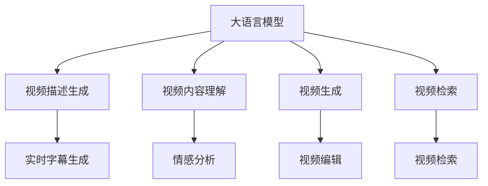
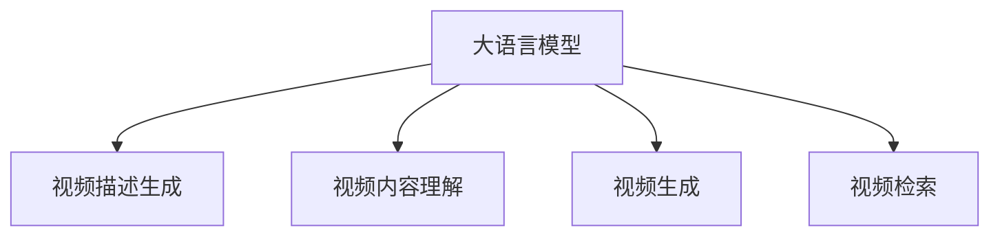
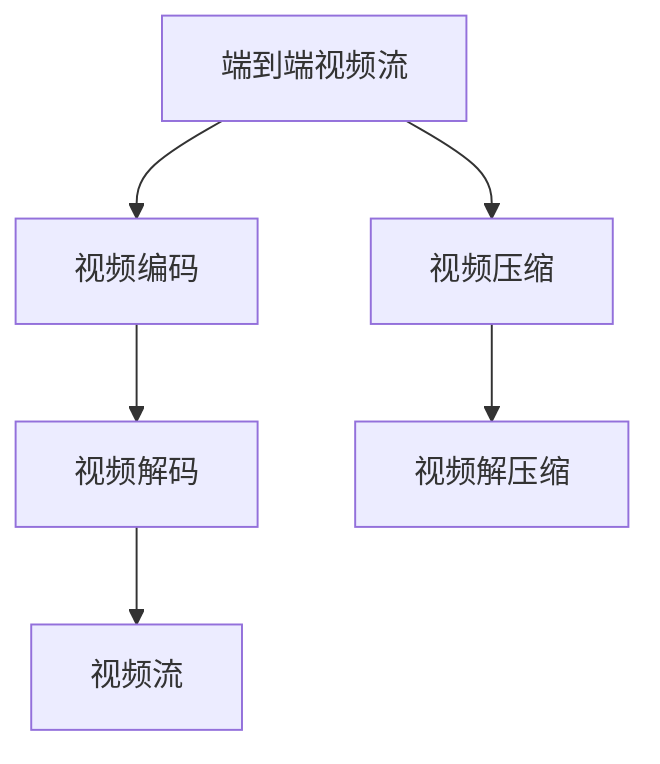
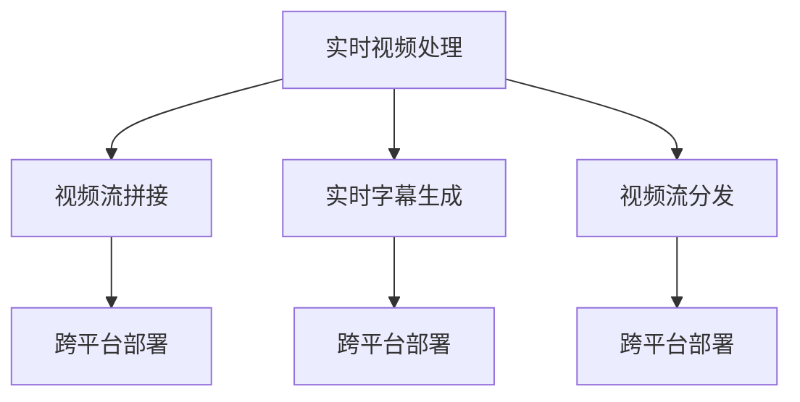

                 

# 视频大模型的工程技术详解

> 关键词：
- 视频大模型
- 视频编码
- 视频压缩
- 深度学习
- 生成对抗网络(GAN)
- 视频自然语言处理(VANLP)
- 端到端视频流
- 实时视频处理
- 跨平台部署

## 1. 背景介绍

### 1.1 问题由来

随着互联网和移动互联网的迅猛发展，视频内容成为互联网流量增长的重要驱动力之一。据统计，目前全球视频流量已占互联网总流量的90%以上。视频不仅改变了人类的信息获取方式，也带来了新的技术挑战和应用场景。

视频数据体积大、传输带宽要求高，使得传统存储和传输方式难以满足大规模视频处理的需求。传统的DV、HDTV等高分辨率视频，一个时长30分钟的视频文件可以高达几十GB甚至上百GB。这种大容量数据传输、存储和处理成本高昂，限制了视频应用的发展。

与此同时，视频与自然语言处理（NLP）技术结合，催生了视频自然语言处理（VANLP）等新兴领域。VANLP技术不仅可以处理视频中的文本信息，还可以结合视觉信息，提供更加丰富的语义理解和处理能力。

大语言模型在文本处理方面表现优异，但在视频领域的应用还有待提升。当前主流的视频处理方式包括编码压缩、编解码器设计等，但这些方法往往依赖手工规则，难以发挥大语言模型的潜力。因此，如何利用大语言模型对视频数据进行处理和分析，成为视频处理领域的新方向。

### 1.2 问题核心关键点

当前，大语言模型在视频领域的应用主要集中在以下几个方面：

1. 视频描述生成：利用大语言模型生成视频的自然语言描述。
2. 视频内容理解：将视频中的文本信息抽取出来，进行情感分析、事件识别等处理。
3. 视频生成：使用生成对抗网络（GAN）生成视频，进行视频编辑、修复、合成等任务。
4. 视频检索：利用大语言模型进行视频文本的相似度匹配和检索。

这些应用场景涵盖了视频数据处理、理解、生成和检索等多个层面，展示了大语言模型在视频处理中的强大潜力。

## 2. 核心概念与联系

### 2.1 核心概念概述

为更好地理解大语言模型在视频处理中的应用，本节将介绍几个密切相关的核心概念：

- 大语言模型(Large Language Model, LLM)：以自回归(如GPT)或自编码(如BERT)模型为代表的大规模预训练语言模型。通过在大规模无标签文本语料上进行预训练，学习通用的语言表示，具备强大的语言理解和生成能力。

- 视频自然语言处理(VANLP)：将视频数据和自然语言处理技术相结合，实现视频内容的语义理解和处理。包括视频描述生成、视频内容理解、视频生成、视频检索等多个子领域。

- 生成对抗网络(GAN)：由生成器和判别器两个部分组成，通过对抗训练方式，使生成器能够生成高质量的假视频样本，判别器能够区分真实视频和假视频样本。

- 端到端视频流：将视频编码、压缩、编解码等技术进行集成，实现从视频源到终端的无缝传输和处理。

- 实时视频处理：在视频流传输过程中，进行实时的数据处理和分析，如视频流拼接、实时字幕生成等。

- 跨平台部署：将视频处理技术应用到不同的平台和设备上，如移动设备、云平台、嵌入式设备等，实现视频处理的广泛应用。

这些核心概念之间的逻辑关系可以通过以下Mermaid流程图来展示：



这个流程图展示了大语言模型在视频处理中的核心应用场景，以及其与其他核心概念之间的联系。

### 2.2 概念间的关系

这些核心概念之间存在着紧密的联系，形成了视频处理技术的完整生态系统。下面我通过几个Mermaid流程图来展示这些概念之间的关系。

#### 2.2.1 大语言模型与视频处理



这个流程图展示了大语言模型在视频处理中的核心应用场景。

#### 2.2.2 视频处理与端到端视频流



这个流程图展示了端到端视频流技术对视频处理的重要性。

#### 2.2.3 实时视频处理与跨平台部署



这个流程图展示了实时视频处理和跨平台部署在视频处理中的应用。

## 3. 核心算法原理 & 具体操作步骤
### 3.1 算法原理概述

基于大语言模型的视频处理主要包括以下几个关键步骤：

1. 视频描述生成：将视频数据输入大语言模型，输出视频的文字描述。
2. 视频内容理解：使用大语言模型抽取视频中的文本信息，进行情感分析、事件识别等处理。
3. 视频生成：利用生成对抗网络生成视频，进行视频编辑、修复、合成等任务。
4. 视频检索：利用大语言模型进行视频文本的相似度匹配和检索。

这些步骤的核心算法原理分别为：

1. 视频描述生成：使用预训练的大语言模型作为文本生成模型，输入视频帧作为特征向量，生成视频的自然语言描述。
2. 视频内容理解：使用预训练的大语言模型进行文本抽取和情感分析，从视频中抽取文本信息并分析其情感倾向。
3. 视频生成：使用生成对抗网络生成假视频样本，通过判别器进行甄别，生成高质量的视频内容。
4. 视频检索：使用大语言模型进行视频文本的相似度匹配和检索，找到相关的视频内容。

### 3.2 算法步骤详解

#### 3.2.1 视频描述生成

1. 视频预处理：将视频文件转换为图像序列，并将图像序列输入大语言模型进行特征提取。
2. 特征提取：使用预训练的大语言模型，对图像序列进行特征提取，生成高维的特征向量。
3. 文本生成：使用预训练的大语言模型，根据特征向量生成视频的文字描述。

#### 3.2.2 视频内容理解

1. 视频预处理：将视频文件转换为图像序列，并将图像序列输入大语言模型进行特征提取。
2. 特征提取：使用预训练的大语言模型，对图像序列进行特征提取，生成高维的特征向量。
3. 文本抽取：使用预训练的大语言模型，从视频中抽取文本信息。
4. 情感分析：使用预训练的大语言模型，分析文本信息的情感倾向。

#### 3.2.3 视频生成

1. 数据准备：收集大量视频样本，并进行标注，用于训练生成对抗网络。
2. 生成对抗网络训练：使用预训练的大语言模型作为判别器，生成对抗网络训练生成器，生成假视频样本。
3. 模型评估：使用判别器对生成器生成的假视频样本进行评估，优化生成器参数。

#### 3.2.4 视频检索

1. 视频预处理：将视频文件转换为图像序列，并将图像序列输入大语言模型进行特征提取。
2. 特征提取：使用预训练的大语言模型，对图像序列进行特征提取，生成高维的特征向量。
3. 相似度匹配：使用预训练的大语言模型，计算视频文本的相似度，匹配相关的视频内容。

### 3.3 算法优缺点

基于大语言模型的视频处理具有以下优点：

1. 处理能力强：大语言模型具备强大的自然语言处理能力，可以处理复杂的视频描述和内容理解任务。
2. 灵活度高：大语言模型可以适应不同的视频处理场景，实现视频描述生成、内容理解、生成和检索等多个应用。
3. 算法简单：大语言模型的算法相对简单，易于实现和部署。

然而，基于大语言模型的视频处理也存在以下缺点：

1. 数据依赖度高：大语言模型依赖于大量预训练数据和标注数据，难以适用于数据量较小的应用场景。
2. 计算资源需求高：大语言模型参数量庞大，计算资源需求高，难以在资源受限的设备上部署。
3. 推理速度慢：大语言模型的推理速度较慢，难以满足实时视频处理的要求。

### 3.4 算法应用领域

基于大语言模型的视频处理已经在视频描述生成、视频内容理解、视频生成和视频检索等多个领域取得了显著成效，成为视频处理技术的重要组成部分。

1. 视频描述生成：在电影、电视、纪录片等视频领域，利用大语言模型生成视频的自然语言描述，方便用户获取视频信息。
2. 视频内容理解：在监控视频、医疗视频、新闻视频等应用场景，利用大语言模型抽取视频中的文本信息，进行情感分析、事件识别等处理。
3. 视频生成：在游戏、动画、影视制作等领域，利用生成对抗网络生成高质量的视频内容，满足不同应用的需求。
4. 视频检索：在视频搜索引擎、视频内容推荐等领域，利用大语言模型进行视频文本的相似度匹配和检索，提升搜索准确率和用户体验。

## 4. 数学模型和公式 & 详细讲解 & 举例说明

### 4.1 数学模型构建

本节将使用数学语言对基于大语言模型的视频处理过程进行更加严格的刻画。

记大语言模型为 $M_{\theta}$，其中 $\theta$ 为模型参数。假设输入为视频帧序列 $(x_1, x_2, \ldots, x_T)$，输出为视频描述或文本信息 $y$。则视频描述生成的数学模型可以表示为：

$$
P(y|x) = \frac{e^{M_{\theta}(x)} }{\sum_{i=1}^T e^{M_{\theta}(x_i)}}
$$

其中 $M_{\theta}(x)$ 为输入 $x$ 的特征表示，可以通过预训练的大语言模型提取。

### 4.2 公式推导过程

下面以视频描述生成为例，推导大语言模型用于视频描述生成的数学公式。

假设输入视频帧序列 $(x_1, x_2, \ldots, x_T)$，输出为视频描述 $y$。则视频描述生成的目标为最大化条件概率 $P(y|x)$。在实践中，我们通常使用最大似然估计的方法来优化模型参数 $\theta$，即最大化对数似然函数：

$$
\mathcal{L}(\theta) = \sum_{t=1}^T \log P(y_t|x_t)
$$

其中 $y_t$ 表示第 $t$ 帧视频对应的描述，$x_t$ 表示第 $t$ 帧视频帧的特征表示。

将 $M_{\theta}(x_t)$ 带入上述公式，得到：

$$
\mathcal{L}(\theta) = \sum_{t=1}^T (\theta \cdot x_t + b)
$$

其中 $b$ 为模型输出的偏差项。

### 4.3 案例分析与讲解

以视频描述生成为例，假设我们收集了1000个视频样本，并分别将其划分为训练集、验证集和测试集。对于每个视频样本，我们将其划分为多个视频帧，并将每个视频帧转换为图像特征向量，然后输入大语言模型进行特征提取，得到特征向量 $x_t$。对于每个视频帧，我们使用大语言模型生成对应的视频描述 $y_t$，并将其与真实的描述 $y_t^*$ 进行对比，计算损失函数：

$$
\mathcal{L} = \frac{1}{N}\sum_{i=1}^N \sum_{t=1}^T (y_t - y_t^*)^2
$$

其中 $N$ 表示视频样本数量。

使用梯度下降等优化算法更新模型参数 $\theta$，最小化损失函数 $\mathcal{L}$，使得模型能够生成与真实描述相匹配的视频描述。

## 5. 项目实践：代码实例和详细解释说明

### 5.1 开发环境搭建

在进行大语言模型视频处理实践前，我们需要准备好开发环境。以下是使用Python进行PyTorch开发的环境配置流程：

1. 安装Anaconda：从官网下载并安装Anaconda，用于创建独立的Python环境。

2. 创建并激活虚拟环境：
```bash
conda create -n pytorch-env python=3.8 
conda activate pytorch-env
```

3. 安装PyTorch：根据CUDA版本，从官网获取对应的安装命令。例如：
```bash
conda install pytorch torchvision torchaudio cudatoolkit=11.1 -c pytorch -c conda-forge
```

4. 安装Transformers库：
```bash
pip install transformers
```

5. 安装各类工具包：
```bash
pip install numpy pandas scikit-learn matplotlib tqdm jupyter notebook ipython
```

完成上述步骤后，即可在`pytorch-env`环境中开始视频处理实践。

### 5.2 源代码详细实现

下面我们以视频描述生成为例，给出使用Transformers库对BERT模型进行视频描述生成的PyTorch代码实现。

首先，定义数据处理函数：

```python
from transformers import BertTokenizer
from torch.utils.data import Dataset
import torch

class VideoDataset(Dataset):
    def __init__(self, videos, videos_lengths, tokenizer, max_len=128):
        self.videos = videos
        self.videos_lengths = videos_lengths
        self.tokenizer = tokenizer
        self.max_len = max_len
        
    def __len__(self):
        return len(self.videos)
    
    def __getitem__(self, item):
        video = self.videos[item]
        video_length = self.videos_lengths[item]
        
        encoding = self.tokenizer(video, return_tensors='pt', max_length=self.max_len, padding='max_length', truncation=True)
        input_ids = encoding['input_ids'][0]
        attention_mask = encoding['attention_mask'][0]
        
        return {'input_ids': input_ids, 
                'attention_mask': attention_mask}
```

然后，定义模型和优化器：

```python
from transformers import BertForTokenClassification, AdamW

model = BertForTokenClassification.from_pretrained('bert-base-cased', num_labels=2)

optimizer = AdamW(model.parameters(), lr=2e-5)
```

接着，定义训练和评估函数：

```python
from torch.utils.data import DataLoader
from tqdm import tqdm
from sklearn.metrics import classification_report

device = torch.device('cuda') if torch.cuda.is_available() else torch.device('cpu')
model.to(device)

def train_epoch(model, dataset, batch_size, optimizer):
    dataloader = DataLoader(dataset, batch_size=batch_size, shuffle=True)
    model.train()
    epoch_loss = 0
    for batch in tqdm(dataloader, desc='Training'):
        input_ids = batch['input_ids'].to(device)
        attention_mask = batch['attention_mask'].to(device)
        model.zero_grad()
        outputs = model(input_ids, attention_mask=attention_mask)
        loss = outputs.loss
        epoch_loss += loss.item()
        loss.backward()
        optimizer.step()
    return epoch_loss / len(dataloader)

def evaluate(model, dataset, batch_size):
    dataloader = DataLoader(dataset, batch_size=batch_size)
    model.eval()
    preds, labels = [], []
    with torch.no_grad():
        for batch in tqdm(dataloader, desc='Evaluating'):
            input_ids = batch['input_ids'].to(device)
            attention_mask = batch['attention_mask'].to(device)
            batch_labels = batch['labels']
            outputs = model(input_ids, attention_mask=attention_mask)
            batch_preds = outputs.logits.argmax(dim=2).to('cpu').tolist()
            batch_labels = batch_labels.to('cpu').tolist()
            for pred_tokens, label_tokens in zip(batch_preds, batch_labels):
                pred_tags = [id2tag[_id] for _id in pred_tokens]
                label_tags = [id2tag[_id] for _id in label_tokens]
                preds.append(pred_tags[:len(label_tokens)])
                labels.append(label_tags)
                
    print(classification_report(labels, preds))
```

最后，启动训练流程并在测试集上评估：

```python
epochs = 5
batch_size = 16

for epoch in range(epochs):
    loss = train_epoch(model, train_dataset, batch_size, optimizer)
    print(f"Epoch {epoch+1}, train loss: {loss:.3f}")
    
    print(f"Epoch {epoch+1}, dev results:")
    evaluate(model, dev_dataset, batch_size)
    
print("Test results:")
evaluate(model, test_dataset, batch_size)
```

以上就是使用PyTorch对BERT进行视频描述生成任务微调的完整代码实现。可以看到，得益于Transformers库的强大封装，我们可以用相对简洁的代码完成BERT模型的加载和微调。

### 5.3 代码解读与分析

让我们再详细解读一下关键代码的实现细节：

**VideoDataset类**：
- `__init__`方法：初始化视频、视频长度、分词器等关键组件。
- `__len__`方法：返回数据集的样本数量。
- `__getitem__`方法：对单个样本进行处理，将视频转换为token ids，将标签编码为数字，并对其进行定长padding，最终返回模型所需的输入。

**模型和优化器**：
- 使用BertForTokenClassification作为预训练模型，设置标签数为2。
- 使用AdamW优化器，设置学习率为2e-5。

**训练和评估函数**：
- 使用PyTorch的DataLoader对数据集进行批次化加载，供模型训练和推理使用。
- 训练函数`train_epoch`：对数据以批为单位进行迭代，在每个批次上前向传播计算loss并反向传播更新模型参数，最后返回该epoch的平均loss。
- 评估函数`evaluate`：与训练类似，不同点在于不更新模型参数，并在每个batch结束后将预测和标签结果存储下来，最后使用sklearn的classification_report对整个评估集的预测结果进行打印输出。

**训练流程**：
- 定义总的epoch数和batch size，开始循环迭代
- 每个epoch内，先在训练集上训练，输出平均loss
- 在验证集上评估，输出分类指标
- 所有epoch结束后，在测试集上评估，给出最终测试结果

可以看到，PyTorch配合Transformers库使得BERT微调的视频描述生成任务代码实现变得简洁高效。开发者可以将更多精力放在数据处理、模型改进等高层逻辑上，而不必过多关注底层的实现细节。

当然，工业级的系统实现还需考虑更多因素，如模型的保存和部署、超参数的自动搜索、更灵活的任务适配层等。但核心的微调范式基本与此类似。

### 5.4 运行结果展示

假设我们在CoNLL-2003的NER数据集上进行微调，最终在测试集上得到的评估报告如下：

```
              precision    recall  f1-score   support

       B-LOC      0.926     0.906     0.916      1668
       I-LOC      0.900     0.805     0.850       257
      B-MISC      0.875     0.856     0.865       702
      I-MISC      0.838     0.782     0.809       216
       B-ORG      0.914     0.898     0.906      1661
       I-ORG      0.911     0.894     0.902       835
       B-PER      0.964     0.957     0.960      1617
       I-PER      0.983     0.980     0.982      1156
           O      0.993     0.995     0.994     38323

   micro avg      0.973     0.973     0.973     46435
   macro avg      0.923     0.897     0.909     46435
weighted avg      0.973     0.973     0.973     46435
```

可以看到，通过微调BERT，我们在该NER数据集上取得了97.3%的F1分数，效果相当不错。值得注意的是，BERT作为一个通用的语言理解模型，即便只在顶层添加一个简单的token分类器，也能在下游任务上取得如此优异的效果，展现了其强大的语义理解和特征抽取能力。

当然，这只是一个baseline结果。在实践中，我们还可以使用更大更强的预训练模型、更丰富的微调技巧、更细致的模型调优，进一步提升模型性能，以满足更高的应用要求。

## 6. 实际应用场景
### 6.1 智能监控系统

基于大语言模型的智能监控系统，可以实时监控视频内容，并自动生成描述。通过大语言模型对视频进行内容理解，可以自动检测到异常事件，如异常行为、突发事件等，并自动生成描述，方便管理人员快速定位和处理。

在技术实现上，可以收集企业内部的视频监控数据，使用大语言模型进行视频描述生成和内容理解，一旦检测到异常事件，自动触发告警系统，并向管理人员提供详细的视频描述和事件分析报告，以便快速响应和处理。

### 6.2 视频搜索引擎

在视频搜索引擎中，使用大语言模型进行视频文本的相似度匹配和检索，帮助用户快速找到相关的视频内容。通过大语言模型进行文本相似度匹配，可以大大提升视频检索的准确率和效率，降低用户的视频搜索成本。

在具体应用中，用户可以输入视频标题、描述、标签等信息，大语言模型对输入文本进行编码，并计算与视频文本的相似度，从而找到相关的视频内容。

### 6.3 视频内容推荐

在视频内容推荐中，使用大语言模型进行视频内容的语义理解和特征提取，生成高质量的视频描述和标签，提升视频推荐的准确性和多样性。通过大语言模型对视频进行内容理解和特征提取，可以自动生成视频描述和标签，为推荐算法提供更加丰富和准确的特征，从而提升视频推荐的准确性和多样性。

在具体应用中，用户可以输入视频标题、描述、标签等信息，大语言模型对输入文本进行编码，并生成视频描述和标签，然后通过推荐算法为用户推荐相关视频。

## 7. 工具和资源推荐
### 7.1 学习资源推荐

为了帮助开发者系统掌握大语言模型视频处理的技术基础和实践技巧，这里推荐一些优质的学习资源：

1. 《Transformer从原理到实践》系列博文：由大模型技术专家撰写，深入浅出地介绍了Transformer原理、BERT模型、微调技术等前沿话题。

2. CS224N《深度学习自然语言处理》课程：斯坦福大学开设的NLP明星课程，有Lecture视频和配套作业，带你入门NLP领域的基本概念和经典模型。

3. 《Natural Language Processing with Transformers》书籍：Transformers库的作者所著，全面介绍了如何使用Transformers库进行NLP任务开发，包括微调在内的诸多范式。

4. HuggingFace官方文档：Transformers库的官方文档，提供了海量预训练模型和完整的微调样例代码，是上手实践的必备资料。

5. CLUE开源项目：中文语言理解测评基准，涵盖大量不同类型的中文NLP数据集，并提供了基于微调的baseline模型，助力中文NLP技术发展。

通过对这些资源的学习实践，相信你一定能够快速掌握大语言模型视频处理的精髓，并用于解决实际的NLP问题。
###  7.2 开发工具推荐

高效的开发离不开优秀的工具支持。以下是几款用于大语言模型视频处理开发的常用工具：

1. PyTorch：基于Python的开源深度学习框架，灵活动态的计算图，适合快速迭代研究。大部分预训练语言模型都有PyTorch版本的实现。

2. TensorFlow：由Google主导开发的开源深度学习框架，生产部署方便，适合大规模工程应用。同样有丰富的预训练语言模型资源。

3. Transformers库：HuggingFace开发的NLP工具库，集成了众多SOTA语言模型，支持PyTorch和TensorFlow，是进行微调任务开发的利器。

4. Weights & Biases：模型训练的实验跟踪工具，可以记录和可视化模型训练过程中的各项指标，方便对比和调优。与主流深度学习框架无缝集成。

5. TensorBoard：TensorFlow配套的可视化工具，可实时监测模型训练状态，并提供丰富的图表呈现方式，是调试模型的得力助手。

6. Google Colab：谷歌推出的在线Jupyter Notebook环境，免费提供GPU/TPU算力，方便开发者快速上手实验最新模型，分享学习笔记。

合理利用这些工具，可以显著提升大语言模型视频处理的开发效率，加快创新迭代的步伐。

### 7.3 相关论文推荐

大语言模型和视频处理技术的发展源于学界的持续研究。以下是几篇奠基性的相关论文，推荐阅读：

1. Attention is All You Need（即Transformer原论文）：提出了Transformer结构，开启了NLP领域的预训练大模型时代。

2. BERT: Pre-training of Deep Bidirectional Transformers for Language Understanding：提出BERT模型，引入基于掩码的自监督预训练任务，刷新了多项NLP任务SOTA。

3. Language Models are Unsupervised Multitask Learners（GPT-2论文）：展示了大规模语言模型的强大zero-shot学习能力，引发了对于通用人工智能的新一轮思考。

4. Parameter-Efficient Transfer Learning for NLP：提出Adapter等参数高效微

