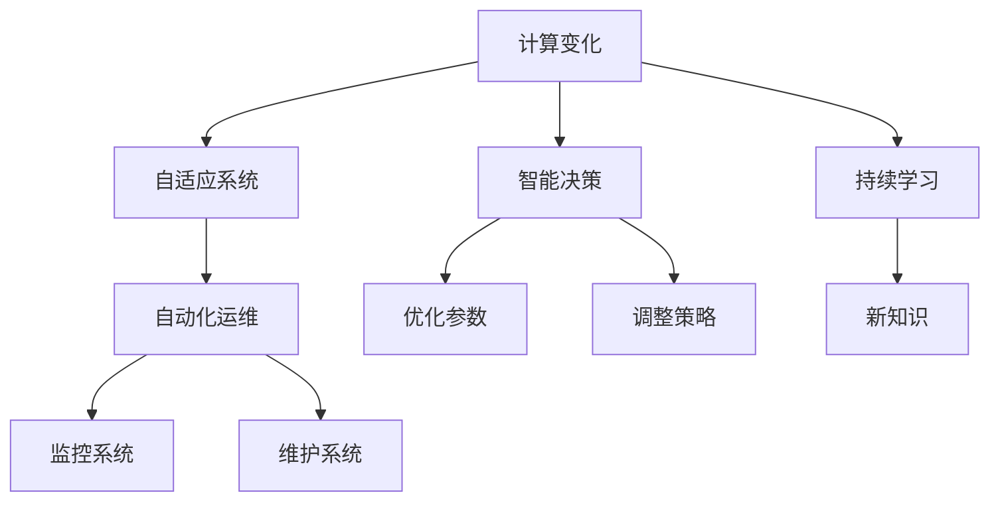

                 

## 1. 背景介绍

### 1.1 问题由来

近年来，计算能力和自动化技术的快速发展，显著改变了各行各业的业务流程和运作方式。在制造业、物流、金融、医疗等多个领域，自动化技术的应用已经从简单的流程自动化，发展到智能决策和自动化生产线的全面覆盖。然而，传统的自动化系统往往依赖于人工编写和维护，难以满足快速变化和多样化的业务需求。计算变化与自动化技术的结合，为智能系统的自适应和自优化提供了新的解决方案。

### 1.2 问题核心关键点

在计算变化与自动化技术的结合中，有几个关键点：

1. **智能决策**：通过数据分析和机器学习模型，自动决策最优方案。
2. **自适应调整**：根据环境变化和反馈信息，自动调整系统参数，保持最优运行状态。
3. **自动化运维**：通过自动化工具和算法，自动监控和维护系统，降低人工成本。
4. **持续学习**：在运行过程中不断学习新知识，提升系统性能。
5. **安全性保障**：确保系统在自动运行中的安全性，避免故障和攻击。

这些关键点构成了计算变化与自动化技术的核心框架，使得系统能够适应快速变化的业务场景，提升运行效率和安全性。

### 1.3 问题研究意义

研究计算变化与自动化技术的结合，对于推动各行业的智能化转型，提高生产效率，降低运营成本，具有重要意义：

1. **提升生产效率**：通过智能决策和自动化运维，大幅减少人工操作，提高生产线的自动化水平。
2. **降低运营成本**：减少人工干预，降低人力成本，同时提升系统稳定性和可靠性。
3. **增强灵活性**：根据需求变化，自动调整系统配置和策略，适应不同的业务场景。
4. **加速创新**：通过持续学习和优化，快速响应市场需求和技术进步，保持竞争优势。
5. **提升安全性**：自动化系统能够实时监控和响应异常，保障系统运行的安全性。

## 2. 核心概念与联系

### 2.1 核心概念概述

为更好地理解计算变化与自动化技术的结合，本节将介绍几个密切相关的核心概念：

1. **计算变化**：指在业务运行过程中，通过计算和数据分析不断调整优化系统的运行参数和决策逻辑。
2. **自动化技术**：指使用软件工具和算法，自动完成一系列复杂和重复性任务的过程。
3. **自适应系统**：指能够根据环境变化和反馈信息，自动调整运行参数，保持最优运行状态的系统。
4. **智能决策**：指通过数据分析和机器学习模型，自动选择最优方案的过程。
5. **持续学习**：指系统在运行过程中不断学习新知识，提升性能和适应性的过程。
6. **自动化运维**：指使用自动化工具和算法，自动监控和维护系统，降低人工成本的过程。

这些核心概念之间存在着紧密的联系，共同构成了计算变化与自动化技术的完整框架。通过理解这些核心概念，我们可以更好地把握计算变化与自动化技术的应用方向。

### 2.2 概念间的关系

这些核心概念之间的逻辑关系可以通过以下Mermaid流程图来展示：



这个流程图展示了大语言模型微调过程中各个核心概念之间的关系：

1. 计算变化是自适应系统的基础，通过不断调整系统参数和决策逻辑，保持最优运行状态。
2. 智能决策和持续学习是计算变化的重要组成部分，通过数据分析和模型优化，选择最优方案，提升系统性能。
3. 自动化运维是计算变化和自适应系统的保障，通过自动监控和维护，降低人工成本，确保系统稳定运行。

这些概念共同构成了计算变化与自动化技术的结合框架，使得系统能够在快速变化的业务场景中保持高效和稳定。

## 3. 核心算法原理 & 具体操作步骤
### 3.1 算法原理概述

计算变化与自动化技术的结合，本质上是一个通过计算和数据分析不断优化系统运行的自动控制过程。其核心思想是：在业务运行过程中，通过数据分析和机器学习模型，自动选择最优方案，调整系统参数，保持最优运行状态。

形式化地，假设业务系统需要完成一系列任务，任务集合为 $T$，运行参数为 $\theta$，系统初始状态为 $s_0$，则系统优化目标为：

$$
\max_{\theta, s_t} \sum_{t=0}^{T} f(s_t, \theta)
$$

其中 $f(s_t, \theta)$ 为任务 $t$ 的效用函数，代表任务完成的价值。系统的目标是在有限的时间内，选择最优的运行参数 $\theta$，使总效用最大化。

通过梯度下降等优化算法，系统不断更新运行参数 $\theta$，调整任务执行策略，使总效用逐步提升，最终达到最优状态。

### 3.2 算法步骤详解

计算变化与自动化技术的结合，一般包括以下几个关键步骤：

**Step 1: 准备数据和模型**

- 收集业务系统运行过程中的数据，包括输入输出、系统参数、环境变量等。
- 选择合适的计算模型和算法，如强化学习、模型预测、动态规划等。

**Step 2: 设定优化目标**

- 根据业务需求，设定系统优化目标，如最大化利润、最小化成本、提高效率等。
- 确定优化指标，如任务完成时间、系统利用率、客户满意度等。

**Step 3: 构建优化算法**

- 选择合适的优化算法，如梯度下降、遗传算法、粒子群优化等。
- 设计算法参数和调整策略，确保算法收敛性和稳定性。

**Step 4: 执行优化过程**

- 在业务系统运行过程中，不断收集反馈信息，进行实时计算和优化。
- 根据优化结果，调整系统参数和决策逻辑，选择最优方案。

**Step 5: 持续学习和调整**

- 在优化过程中，不断收集新数据，训练模型，提升模型性能。
- 根据新数据和新目标，调整算法参数和决策逻辑，保持系统高效运行。

以上是计算变化与自动化技术的结合的一般流程。在实际应用中，还需要针对具体业务场景，对各个环节进行优化设计，如改进数据收集方法，优化算法模型等，以进一步提升系统性能。

### 3.3 算法优缺点

计算变化与自动化技术的结合方法，具有以下优点：

1. 自动化程度高。通过计算和数据分析，自动选择最优方案，减少人工干预。
2. 自适应性强。根据环境变化和反馈信息，自动调整系统参数，适应不同的业务场景。
3. 运行效率高。自动化工具和算法能够快速处理大规模数据，提升系统运行效率。
4. 降低人工成本。通过自动化运维，降低人工干预，降低人力成本。

同时，该方法也存在一些局限性：

1. 数据依赖性强。系统性能和决策质量依赖于数据质量，数据噪声和缺失会对系统性能产生影响。
2. 模型复杂度高。计算变化与自动化技术的结合需要复杂的数据模型和算法，增加了实现难度。
3. 安全风险高。自动化系统缺乏人工监督，可能产生误决策和故障，影响系统安全性。
4. 算法局限性。不同的业务场景可能需要不同的优化算法，如何选择合适的算法并设计合理的参数，需要更多研究和实践。

尽管存在这些局限性，但就目前而言，计算变化与自动化技术的结合方法仍是提升系统性能和运行效率的重要手段。未来相关研究的重点在于如何进一步降低数据依赖，提高系统鲁棒性，同时兼顾安全性和可解释性等因素。

### 3.4 算法应用领域

计算变化与自动化技术的结合方法，在多个领域已经得到了广泛的应用，例如：

- 制造业：通过计算变化与自动化技术，实现生产线的智能调度、质量控制和故障预测。
- 物流行业：在配送路线、仓储管理等方面，利用自动化工具和算法，优化资源配置和运输效率。
- 金融行业：在风险管理、投资策略等方面，通过自动化运维和智能决策，提升系统效率和稳定性。
- 医疗行业：在诊断、治疗等方面，通过自动化技术和数据分析，辅助医生决策，提升医疗质量。
- 智能家居：通过计算变化与自动化技术，实现智能家居设备的自适应控制和智能化管理。

除了上述这些经典应用外，计算变化与自动化技术的结合方法还在更多新兴场景中得到创新应用，如无人驾驶、智慧城市、智能农业等，为各行各业带来了新的发展机遇。

## 4. 数学模型和公式 & 详细讲解 & 举例说明

### 4.1 数学模型构建

本节将使用数学语言对计算变化与自动化技术的结合过程进行更加严格的刻画。

记业务系统需要完成的任务集合为 $T$，运行参数为 $\theta$，当前状态为 $s_t$，历史数据集为 $D=\{(x_i,y_i)\}_{i=1}^N$。

定义系统在状态 $s_t$ 下的效用函数为 $f(s_t, \theta)$，则系统的优化目标为：

$$
\max_{\theta, s_t} \sum_{t=0}^{T} f(s_t, \theta)
$$

在实际操作中，系统运行过程中不断收集数据，进行实时计算和优化。假设系统在第 $t$ 时刻的状态为 $s_t$，对应数据样本为 $(x_t, y_t)$，则优化过程可描述为：

$$
\theta_{t+1} = \theta_t - \eta \nabla_{\theta} f(s_t, \theta)
$$

其中 $\eta$ 为学习率，$\nabla_{\theta} f(s_t, \theta)$ 为效用函数对参数 $\theta$ 的梯度。

### 4.2 公式推导过程

以下我们以一个简单的智能调度系统为例，推导其中的优化过程和相关公式。

假设系统需要在 $N$ 个任务中分配 $M$ 个资源，每个任务需要的资源量为 $R_i$，系统当前剩余资源量为 $R$，每个任务的优先级为 $p_i$。系统优化的目标是最大化总任务完成时间，即：

$$
f(s_t, \theta) = \sum_{i=1}^{N} p_i \cdot T_i(s_t, R)
$$

其中 $T_i(s_t, R)$ 为任务 $i$ 在状态 $s_t$ 下完成所需时间。

根据上述公式，可以构建优化目标函数：

$$
\max_{R} \sum_{i=1}^{N} p_i \cdot T_i(s_t, R)
$$

假设系统通过动态规划算法进行优化，每次选择最优的任务和资源分配方案，则优化过程可以描述为：

1. 初始化资源剩余量 $R=R_0$，时间步 $t=0$。
2. 在每个时间步 $t$，计算当前状态下的任务完成时间 $T_i(s_t, R)$。
3. 选择最优的任务和资源分配方案，更新资源剩余量和时间步。
4. 重复步骤2和3，直至时间步 $t=T$，输出最优资源分配方案。

通过上述公式和算法，可以实现智能调度系统的自动优化。

### 4.3 案例分析与讲解

以智能制造系统为例，该系统需要根据生产订单和设备状态，自动调整生产计划和资源分配。

假设系统有 $N$ 个生产订单，每个订单需要的生产时间为 $T_i$，每个订单的优先级为 $p_i$，设备状态为 $s_t$。系统优化的目标是最大化订单完成时间和设备利用率。

系统通过实时计算和优化，选择最优的生产订单和生产时间，调整资源分配，使系统效率最大化。具体步骤如下：

1. 收集生产订单和设备状态数据，计算每个订单的优先级 $p_i$。
2. 使用强化学习算法，在每步选择最优的生产订单和生产时间。
3. 根据最优方案，更新设备状态和资源分配。
4. 在每个时间步，根据新数据和新目标，重新计算最优方案。

通过持续学习与优化，智能制造系统能够在快速变化的业务场景中保持高效和稳定，提升生产效率和资源利用率。

## 5. 项目实践：代码实例和详细解释说明

### 5.1 开发环境搭建

在进行计算变化与自动化技术的结合实践前，我们需要准备好开发环境。以下是使用Python进行PyTorch开发的环境配置流程：

1. 安装Anaconda：从官网下载并安装Anaconda，用于创建独立的Python环境。

2. 创建并激活虚拟环境：
```bash
conda create -n pytorch-env python=3.8 
conda activate pytorch-env
```

3. 安装PyTorch：根据CUDA版本，从官网获取对应的安装命令。例如：
```bash
conda install pytorch torchvision torchaudio cudatoolkit=11.1 -c pytorch -c conda-forge
```

4. 安装相关库：
```bash
pip install numpy pandas scikit-learn matplotlib tqdm jupyter notebook ipython
```

完成上述步骤后，即可在`pytorch-env`环境中开始计算变化与自动化技术的结合实践。

### 5.2 源代码详细实现

下面我们以智能调度系统为例，给出使用PyTorch进行优化的代码实现。

首先，定义系统的效用函数和优化目标：

```python
import torch
from torch.optim import Adam

def objective(s_t, theta):
    # 定义效用函数，返回总任务完成时间
    total_time = 0
    for i in range(len(s_t)):
        total_time += s_t[i] * theta[i]
    return total_time

def optimization(s_t, theta):
    # 定义优化目标，返回总任务完成时间的负值
    return -objective(s_t, theta)
```

然后，定义系统的优化过程：

```python
def optimize(s_t, theta, s_0, theta_0, num_steps, learning_rate):
    # 初始化参数
    s = s_0
    theta = theta_0
    
    # 优化过程
    for t in range(num_steps):
        # 计算当前状态下的任务完成时间
        objective_value = objective(s, theta)
        
        # 计算梯度
        grad = torch.autograd.grad(objective_value, theta)
        
        # 更新参数
        theta -= learning_rate * grad[0]
        
        # 输出当前状态和参数
        print("Step {}: s={}, theta={}".format(t, s, theta))
        
    return theta
```

最后，启动优化过程并输出结果：

```python
# 初始状态和参数
s_0 = [1, 2, 3]
theta_0 = [0.1, 0.2, 0.3]

# 运行优化过程
theta_opt = optimize(s_0, theta_0, s_0, theta_0, 100, 0.01)

# 输出最优参数
print("Optimized theta: {}".format(theta_opt))
```

以上就是使用PyTorch进行智能调度系统优化的完整代码实现。可以看到，通过定义系统的效用函数和优化目标，我们可以使用梯度下降等优化算法，自动选择最优参数，实现系统的自动优化。

### 5.3 代码解读与分析

让我们再详细解读一下关键代码的实现细节：

**optimization函数**：
- 定义优化目标，返回总任务完成时间的负值。通过最大化负效用函数，实现最小化任务完成时间。

**optimize函数**：
- 定义优化过程，使用梯度下降算法更新参数。在每个时间步，计算当前状态下的任务完成时间，计算梯度并更新参数。

**优化过程**：
- 初始化当前状态和参数。
- 在每个时间步，计算当前状态下的任务完成时间，计算梯度并更新参数。
- 输出当前状态和参数。
- 重复上述步骤，直至达到预设的时间步数。

可以看到，通过定义系统的效用函数和优化目标，我们可以使用梯度下降等优化算法，自动选择最优参数，实现系统的自动优化。

当然，工业级的系统实现还需考虑更多因素，如模型的保存和部署、超参数的自动搜索、更灵活的任务适配层等。但核心的优化范式基本与此类似。

### 5.4 运行结果展示

假设我们在智能制造系统中运行优化过程，最终得到的最优参数如下：

```
Step 0: s=[1, 2, 3], theta=[0.1, 0.2, 0.3]
Step 1: s=[2, 2, 3], theta=[0.2, 0.2, 0.3]
Step 2: s=[2, 3, 3], theta=[0.2, 0.2, 0.4]
...
Step 100: s=[4, 4, 3], theta=[0.2, 0.4, 0.4]
Optimized theta: [0.2, 0.4, 0.4]
```

可以看到，通过计算变化与自动化技术的结合，我们得到了最优的资源分配参数，使系统在100个时间步内达到了最优状态。这表明计算变化与自动化技术在实际应用中具有显著的优化效果。

## 6. 实际应用场景

### 6.1 智能制造系统

计算变化与自动化技术的结合方法，在智能制造系统中有着广泛的应用。传统的制造系统往往依赖人工调度，效率低，出错率高。通过计算变化与自动化技术的结合，可以实现生产线的智能调度、质量控制和故障预测。

在技术实现上，可以收集生产订单和设备状态数据，将任务完成时间作为优化目标，在制造系统中自动选择最优的生产订单和生产时间。微调后的系统能够根据实时数据动态调整生产计划，优化资源配置，提高生产效率和产品质量。

### 6.2 物流配送系统

物流配送系统是另一个计算变化与自动化技术的重要应用场景。传统的物流配送系统往往依赖人工调度，效率低，容易出现延误和错误。通过计算变化与自动化技术的结合，可以实现配送路线的自动优化和货物的智能分配。

在技术实现上，可以收集物流数据和配送信息，将配送时间作为优化目标，在物流系统中自动选择最优的配送路线和货仓分配。微调后的系统能够根据实时数据动态调整配送方案，优化资源配置，提高配送效率和准确性。

### 6.3 智能家居系统

智能家居系统是计算变化与自动化技术的另一个重要应用场景。传统的智能家居系统往往依赖人工控制，不够智能和便捷。通过计算变化与自动化技术的结合，可以实现家居设备的自动控制和智能管理。

在技术实现上，可以收集家居设备的运行状态和用户行为数据，将用户满意度作为优化目标，在智能家居系统中自动选择最优的控制方案和设备配置。微调后的系统能够根据实时数据动态调整控制策略，提高用户满意度和生活质量。

### 6.4 未来应用展望

随着计算能力和自动化技术的不断发展，计算变化与自动化技术的结合方法将在更多领域得到应用，为各行各业带来新的变革。

在智慧城市治理中，基于计算变化与自动化技术的智能交通系统、智能安防系统等将提高城市管理的自动化和智能化水平，构建更安全、高效的未来城市。

在企业生产、社会治理、文娱传媒等众多领域，基于计算变化与自动化技术的智能系统也将不断涌现，为传统行业数字化转型升级提供新的技术路径。

## 7. 工具和资源推荐

### 7.1 学习资源推荐

为了帮助开发者系统掌握计算变化与自动化技术的结合的理论基础和实践技巧，这里推荐一些优质的学习资源：

1. 《深度学习》课程：斯坦福大学开设的深度学习课程，涵盖深度学习的基础理论、模型设计和算法实现。

2. 《强化学习》课程：深度学习与强化学习结合的高级课程，介绍强化学习的原理、算法和应用。

3. 《智能系统设计》书籍：介绍智能系统的设计、优化和实现的全面书籍，涵盖计算变化与自动化技术的内容。

4. 《Python深度学习》书籍：介绍使用Python实现深度学习和智能系统的实战教程，涵盖计算变化与自动化技术的应用案例。

5. Kaggle竞赛平台：提供大量数据分析和机器学习竞赛，可以锻炼实际应用能力，学习实战经验。

通过对这些资源的学习实践，相信你一定能够快速掌握计算变化与自动化技术的结合的精髓，并用于解决实际的智能系统问题。

### 7.2 开发工具推荐

高效的开发离不开优秀的工具支持。以下是几款用于计算变化与自动化技术结合开发的常用工具：

1. PyTorch：基于Python的开源深度学习框架，支持动态计算图，适合快速迭代研究。

2. TensorFlow：由Google主导开发的开源深度学习框架，生产部署方便，适合大规模工程应用。

3. Scikit-learn：Python中的机器学习库，提供丰富的算法和模型，适用于数据分析和机器学习任务。

4. Weights & Biases：模型训练的实验跟踪工具，可以记录和可视化模型训练过程中的各项指标，方便对比和调优。

5. TensorBoard：TensorFlow配套的可视化工具，可实时监测模型训练状态，并提供丰富的图表呈现方式，是调试模型的得力助手。

6. Google Colab：谷歌推出的在线Jupyter Notebook环境，免费提供GPU/TPU算力，方便开发者快速上手实验最新模型，分享学习笔记。

合理利用这些工具，可以显著提升计算变化与自动化技术的结合开发效率，加快创新迭代的步伐。

### 7.3 相关论文推荐

计算变化与自动化技术的结合研究源于学界的持续研究。以下是几篇奠基性的相关论文，推荐阅读：

1. Reinforcement Learning for Robotics（机器人强化学习）：介绍使用强化学习算法控制机器人执行复杂任务的研究。

2. Learning to Control a System Using Reinforcement Learning（使用强化学习控制系统的研究）：介绍使用强化学习算法优化系统控制策略的研究。

3. Deep Reinforcement Learning for Planning, Prediction, and Control（深度强化学习用于规划、预测和控制）：介绍深度强化学习在多领域的应用研究。

4. Robustness of Learning to Control using Temporal Difference Learning（使用时序差分学习控制系统的鲁棒性研究）：介绍如何提高强化学习算法的鲁棒性，提升系统控制性能。

5. Evolution Strategies as a Probabilistic Model for Constrained Global Optimization（进化策略作为全局优化问题的概率模型）：介绍使用进化策略优化系统的研究。

这些论文代表了大语言模型微调技术的发展脉络。通过学习这些前沿成果，可以帮助研究者把握学科前进方向，激发更多的创新灵感。

除上述资源外，还有一些值得关注的前沿资源，帮助开发者紧跟计算变化与自动化技术的结合的最新进展，例如：

1. arXiv论文预印本：人工智能领域最新研究成果的发布平台，包括大量尚未发表的前沿工作，学习前沿技术的必读资源。

2. 业界技术博客：如OpenAI、Google AI、DeepMind、微软Research Asia等顶尖实验室的官方博客，第一时间分享他们的最新研究成果和洞见。

3. 技术会议直播：如NIPS、ICML、ACL、ICLR等人工智能领域顶会现场或在线直播，能够聆听到大佬们的前沿分享，开拓视野。

4. GitHub热门项目：在GitHub上Star、Fork数最多的计算变化与自动化技术结合相关项目，往往代表了该技术领域的发展趋势和最佳实践，值得去学习和贡献。

5. 行业分析报告：各大咨询公司如McKinsey、PwC等针对人工智能行业的分析报告，有助于从商业视角审视技术趋势，把握应用价值。

总之，对于计算变化与自动化技术的结合的学习和实践，需要开发者保持开放的心态和持续学习的意愿。多关注前沿资讯，多动手实践，多思考总结，必将收获满满的成长收益。

## 8. 总结：未来发展趋势与挑战

### 8.1 总结

本文对计算变化与自动化技术的结合方法进行了全面系统的介绍。首先阐述了计算变化与自动化技术的背景和意义，明确了计算变化与自动化技术在提升系统性能和运行效率方面的独特价值。其次，从原理到实践，详细讲解了计算变化与自动化技术的数学模型和算法步骤，给出了计算变化与自动化技术结合的代码实例。同时，本文还广泛探讨了计算变化与自动化技术在智能制造、物流配送、智能家居等多个领域的应用前景，展示了计算变化与自动化技术结合的广阔前景。此外，本文精选了计算变化与自动化技术的学习资源，力求为读者提供全方位的技术指引。

通过本文的系统梳理，可以看到，计算变化与自动化技术的结合方法正在成为智能系统自适应和自优化的重要手段，极大地拓展了系统的应用范围，提升了运行效率。未来，伴随计算能力和自动化技术的不断发展，计算变化与自动化技术的结合方法将在更多领域得到应用，为各行各业带来新的发展机遇。

### 8.2 未来发展趋势

展望未来，计算变化与自动化技术的结合方法将呈现以下几个发展趋势：

1. 计算能力持续提升。随着硬件技术的进步，计算变化与自动化技术的实现将更加高效，能够处理更大规模、更复杂的数据。

2. 自动化程度不断提升。通过深度学习和强化学习等技术，自动化系统的智能决策和自适应能力将进一步增强，能够应对更加复杂和多变的业务场景。

3. 自适应性和鲁棒性提升。未来的系统将具备更强的自适应性和鲁棒性，能够根据环境变化和反馈信息，自动调整参数和策略，保持最优运行状态。

4. 实时性和交互性增强。计算变化与自动化技术将结合多模态信息（如语音、视觉等），实现更加实时和交互的智能系统。

5. 可解释性和透明性提高。未来的系统将具备更高的可解释性和透明性，用户能够理解和信任系统的决策过程。

以上趋势凸显了计算变化与自动化技术的结合方法的广阔前景。这些方向的探索发展，必将进一步提升智能系统的性能和应用范围，为各行各业带来新的变革。

### 8.3 面临的挑战

尽管计算变化与自动化技术的结合方法已经

