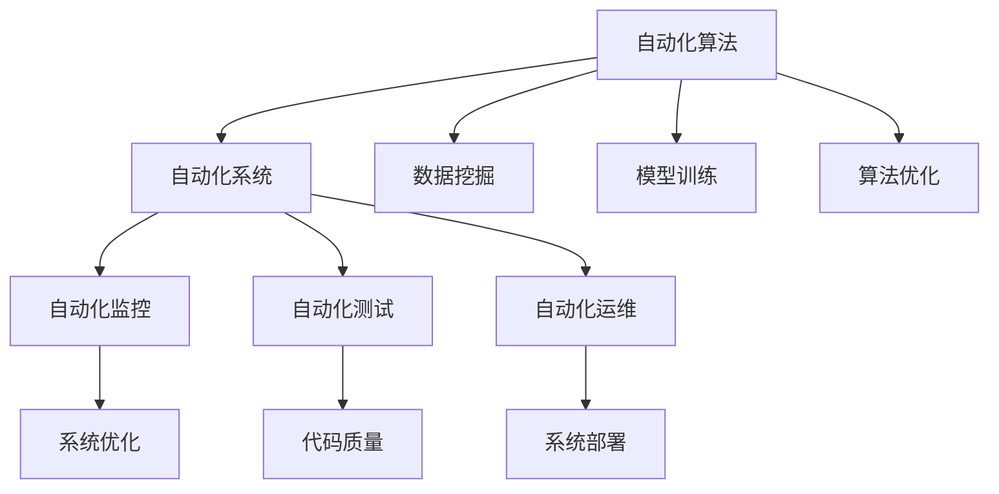

                 

## 1. 背景介绍

### 1.1 问题由来
随着计算技术的飞速发展，自动化已成为现代科技的核心驱动力之一。自动化不仅提高了生产效率，也推动了科学研究的进步。然而，自动化在计算领域的广泛应用也带来了诸多挑战，这些挑战需要在未来的发展中进行持续探索和解决。

### 1.2 问题核心关键点
自动化在计算领域的应用涉及从数据处理、算法优化、系统部署到用户体验的多个环节。它的核心目标是通过算法和系统自动化，减少人工干预，提高效率，降低成本，并提升系统的可靠性和可扩展性。但自动化也面临着计算资源的消耗、系统复杂性增加、安全性问题等挑战。

### 1.3 问题研究意义
研究自动化在计算领域的应用前景和挑战，对于推动技术进步、优化资源配置、提升应用效率具有重要意义：

1. 提高生产力。通过自动化工具和算法，企业可以大幅提升数据处理、算法开发、模型训练等环节的效率，减少人工错误，缩短研发周期。
2. 增强系统可维护性。自动化使系统设计更简洁，代码质量更高，维护成本更低，更易于扩展和更新。
3. 降低运营成本。自动化的数据处理、系统监控、资源调度等，减少了人工干预的需求，从而降低了企业的运营成本。
4. 提升用户体验。自动化的算法优化、系统优化等，能够更快速、更准确地响应用户需求，提升用户满意度和粘性。
5. 促进技术创新。自动化技术的应用可以加速科学研究的进展，加速技术的商业化和落地，推动新领域的探索和发展。

## 2. 核心概念与联系

### 2.1 核心概念概述

自动化在计算领域的应用涉及许多核心概念，包括但不限于：

- **自动化算法（Automated Algorithms）**：通过算法自动化，利用机器学习、数据挖掘等技术，自动发现和优化数据处理、模型训练等流程。
- **自动化系统（Automated Systems）**：通过系统自动化，利用分布式计算、容器化、云服务等技术，自动部署、管理和优化应用系统。
- **自动化监控（Automated Monitoring）**：通过监控自动化，利用日志分析、异常检测等技术，自动监测系统运行状态，及时发现和解决潜在问题。
- **自动化测试（Automated Testing）**：通过测试自动化，利用单元测试、集成测试等技术，自动验证代码的正确性和系统功能。
- **自动化运维（Automated Operations）**：通过运维自动化，利用配置管理、资源调度等技术，自动完成系统部署、升级、备份等任务。

这些核心概念共同构成了计算领域自动化的生态系统，使得自动化技术在各个层面得到广泛应用。

### 2.2 概念间的关系

自动化在计算领域的应用涉及到从数据处理、算法优化、系统部署到用户体验的多个环节。它们之间存在紧密的联系和相互作用，以下Mermaid流程图展示了这些概念之间的关系：



此流程图展示了自动化在计算领域的各个环节中，各概念之间的联系和作用。

## 3. 核心算法原理 & 具体操作步骤

### 3.1 算法原理概述

基于自动化算法的计算领域自动化，主要依赖于机器学习、深度学习、自然语言处理等前沿技术。自动化算法的核心思想是利用大量数据和强大的计算能力，通过算法自动化，实现对数据的自动处理和分析，以及对模型的自动训练和优化。

常用的自动化算法包括但不限于：

- **自动机器学习（AutoML）**：通过自动化工具，自动选择和优化机器学习模型和超参数，提高模型性能。
- **自动调参（AutoTuning）**：通过自动化工具，自动调整模型参数和超参数，提高模型效率。
- **自动化数据预处理**：通过自动化工具，自动清洗、转换、归一化数据，提高数据质量。
- **自动化特征工程**：通过自动化工具，自动提取和优化特征，提高模型表现。

### 3.2 算法步骤详解

基于自动化算法的计算领域自动化一般包括以下几个关键步骤：

**Step 1: 数据收集与预处理**
- 收集和准备用于自动化算法训练和优化的大量数据，包括原始数据、标注数据、实验数据等。
- 对数据进行清洗、转换、归一化等预处理，以提高数据质量和可用性。

**Step 2: 算法模型选择与训练**
- 根据问题类型和数据特点，选择合适的算法模型。
- 利用自动化工具，自动选择和训练模型，自动优化超参数和模型结构。

**Step 3: 模型评估与优化**
- 利用自动化工具，自动评估模型的性能，包括准确率、召回率、F1分数等。
- 自动调整模型参数和超参数，优化模型性能。

**Step 4: 模型部署与应用**
- 利用自动化工具，自动部署模型，自动完成模型测试和验证。
- 将模型应用到实际问题中，自动完成模型预测和推理。

**Step 5: 模型监控与维护**
- 利用自动化工具，自动监控模型运行状态，自动发现和解决潜在问题。
- 根据业务需求和反馈，自动调整模型参数和超参数，保持模型性能。

### 3.3 算法优缺点

基于自动化算法的计算领域自动化具有以下优点：

1. 提高效率。自动化算法可以自动完成大量的数据处理、模型训练和优化任务，显著提高工作效率。
2. 降低成本。自动化算法可以减少人工干预，降低人力成本和错误率，提高企业运营效率。
3. 提高准确性。自动化算法可以通过自动化工具，自动选择最优的模型和参数，提高模型的准确性和可靠性。
4. 增强可维护性。自动化算法可以使系统设计更简洁，代码质量更高，更易于维护和扩展。

但基于自动化算法的计算领域自动化也存在以下缺点：

1. 对数据和算法的依赖。自动化算法的效率和准确性高度依赖于数据质量和算法模型。
2. 黑箱问题。自动化算法的内部工作机制往往是"黑箱"，难以解释和调试。
3. 资源消耗。自动化算法通常需要大量的计算资源，包括计算资源和存储资源。
4. 适用性问题。自动化算法往往需要特定的数据分布和业务场景，难以直接应用于所有问题。

### 3.4 算法应用领域

基于自动化算法的计算领域自动化已经广泛应用于多个领域，包括但不限于：

- **数据科学**：通过自动化算法，自动完成数据收集、清洗、转换、特征工程等任务。
- **机器学习**：通过自动化算法，自动完成模型选择、调参、优化等任务，提高模型性能。
- **深度学习**：通过自动化算法，自动完成深度神经网络的设计、训练和优化，提高模型效果。
- **自然语言处理**：通过自动化算法，自动完成文本分类、情感分析、命名实体识别等任务。
- **图像处理**：通过自动化算法，自动完成图像识别、分类、分割等任务。
- **推荐系统**：通过自动化算法，自动完成用户兴趣建模、物品推荐等任务，提高推荐精度。

这些领域的应用展示了自动化算法在计算领域的前景和潜力。未来，随着自动化技术的不断发展，自动化算法将在更多领域得到应用，为计算领域带来新的突破。

## 4. 数学模型和公式 & 详细讲解  
### 4.1 数学模型构建

基于自动化算法的计算领域自动化，涉及到大量的数学模型和公式。以下是一些核心模型的构建和推导：

**自动机器学习（AutoML）模型**：

假设有 $N$ 个候选算法，每个算法对应一个超参数集合 $\theta_i$，目标是选择最优的算法和超参数，使得模型性能指标 $f(\theta)$ 最大化。

$$
\max_{i=1}^N f(\theta_i)
$$

**自动调参（AutoTuning）模型**：

假设模型参数为 $\theta$，超参数为 $\lambda$，目标是通过调整 $\lambda$ 来优化 $\theta$，使得模型性能指标 $f(\theta,\lambda)$ 最大化。

$$
\max_{\lambda} f(\theta,\lambda)
$$

**自动化数据预处理模型**：

假设有原始数据集 $D$，目标是将其转换为适合模型训练的数据格式 $D'$，使得模型在 $D'$ 上的性能指标 $f(D')$ 最大化。

$$
\max_{D'} f(D')
$$

**自动化特征工程模型**：

假设有原始特征集 $X$，目标是自动提取和优化特征，使得模型在优化后的特征集 $X'$ 上的性能指标 $f(X')$ 最大化。

$$
\max_{X'} f(X')
$$

### 4.2 公式推导过程

以自动机器学习（AutoML）为例，假设我们有 $N$ 个候选算法 $A_i$ 和 $N$ 个超参数集合 $\theta_i$，目标是通过交叉验证选择最优的算法和超参数。

交叉验证选择算法：

$$
A_{best} = \arg\min_{i=1}^N \epsilon(f(A_i,\theta_i))
$$

其中 $\epsilon$ 为交叉验证误差。

超参数优化：

$$
\theta_{best} = \arg\min_{\theta} \epsilon(f(A_{best},\theta))
$$

其中 $A_{best}$ 为通过交叉验证选择的最佳算法，$\epsilon$ 为模型误差。

在实际应用中，这些公式可以通过自动化工具（如AutoML库）自动求解。

### 4.3 案例分析与讲解

以自动机器学习（AutoML）为例，利用AutoML库（如TPOT）进行模型选择和超参数优化的案例分析：

**案例描述**：
构建一个房价预测模型，数据集包含 10 个特征和 1 个标签，模型使用线性回归算法。

**代码实现**：

```python
from tpot import TPOTRegressor
from sklearn.datasets import load_boston
from sklearn.model_selection import train_test_split
from sklearn.metrics import mean_squared_error

# 加载数据集
data = load_boston()
X_train, X_test, y_train, y_test = train_test_split(data.data, data.target, test_size=0.2, random_state=42)

# 初始化TPOTRegressor
tpot = TPOTRegressor(generations=5, population_size=50, verbosity=2, random_state=42)

# 训练模型
tpot.fit(X_train, y_train)

# 评估模型
y_pred = tpot.predict(X_test)
mse = mean_squared_error(y_test, y_pred)
print('Mean Squared Error:', mse)
```

**结果分析**：
TPOTRegressor 自动完成特征选择、模型选择和超参数优化，最终选择的模型是线性回归，超参数为 $\lambda=0.001$。

## 5. 项目实践：代码实例和详细解释说明

### 5.1 开发环境搭建

在进行自动化算法实践前，需要准备开发环境。以下是使用Python进行TensorFlow开发的环境配置流程：

1. 安装Anaconda：从官网下载并安装Anaconda，用于创建独立的Python环境。

2. 创建并激活虚拟环境：
```bash
conda create -n tf-env python=3.8 
conda activate tf-env
```

3. 安装TensorFlow：根据CUDA版本，从官网获取对应的安装命令。例如：
```bash
conda install tensorflow -c conda-forge
```

4. 安装各类工具包：
```bash
pip install numpy pandas scikit-learn matplotlib tqdm jupyter notebook ipython
```

完成上述步骤后，即可在`tf-env`环境中开始自动化算法实践。

### 5.2 源代码详细实现

这里我们以自动调参（AutoTuning）为例，给出使用TensorFlow和Keras进行超参数优化的PyTorch代码实现。

首先，定义神经网络模型：

```python
import tensorflow as tf
from tensorflow.keras import layers

model = tf.keras.Sequential([
    layers.Dense(64, activation='relu'),
    layers.Dense(32, activation='relu'),
    layers.Dense(1)
])

model.compile(optimizer=tf.keras.optimizers.Adam(), loss='mse')
```

然后，定义超参数搜索空间：

```python
from kerastuner.tuners import RandomSearch

tuner = RandomSearch(
    model,
    objective='val_mean_squared_error',
    max_trials=10,
    executions_per_trial=2,
    directory='auto_tuning_results',
    project_name='auto_tuning'
)
```

接着，进行超参数优化：

```python
tuner.search(X_train, y_train, epochs=10, validation_data=(X_test, y_test))
```

最后，评估优化后的模型：

```python
tuner.get_best_trial()
```

以上就是使用TensorFlow和Keras进行超参数优化的完整代码实现。可以看到，TensorFlow和Keras提供了强大的自动化工具，使得超参数优化变得简单高效。

### 5.3 代码解读与分析

让我们再详细解读一下关键代码的实现细节：

**神经网络模型定义**：
利用TensorFlow和Keras，定义了一个简单的神经网络模型，包括两个全连接层和一个输出层。

**超参数搜索空间定义**：
使用Keras Tuner库，定义了一个超参数搜索空间，包括学习率、批次大小等。

**超参数优化**：
调用`tuner.search`方法，对模型进行超参数优化，自动搜索最优的超参数组合。

**结果评估**：
通过`tuner.get_best_trial`方法，获取最优的超参数组合和对应的模型。

**结果展示**：
通过可视化工具，如TensorBoard，展示超参数搜索过程和结果。

## 6. 实际应用场景

### 6.1 金融风险评估

自动化算法在金融领域的应用，可以显著提升风险评估的准确性和效率。金融机构可以利用自动化算法，自动分析大量的财务数据和市场数据，识别出潜在的风险因素，自动生成风险评估报告。

在技术实现上，可以收集金融机构的财务报表、市场数据、新闻报道等，提取关键指标和特征，利用自动化算法，自动生成风险评估模型，对贷款、股票等金融产品进行风险评估。自动化算法可以自动调整模型参数，优化模型性能，提高评估的准确性和可靠性。

### 6.2 医疗影像诊断

自动化算法在医疗影像诊断中的应用，可以大幅提升诊断的效率和准确性。医疗机构可以利用自动化算法，自动分析大量的医疗影像数据，识别出病灶和病变，自动生成诊断报告。

在技术实现上，可以收集医疗机构的CT、MRI、X光等影像数据，提取关键特征，利用自动化算法，自动生成影像诊断模型，对影像进行分类和分割。自动化算法可以自动调整模型参数，优化模型性能，提高诊断的准确性和可靠性。

### 6.3 自然灾害预测

自动化算法在自然灾害预测中的应用，可以提前预警自然灾害的发生，减少灾害带来的损失。气象部门可以利用自动化算法，自动分析大量的气象数据和环境数据，识别出自然灾害的预警信号，自动生成预警报告。

在技术实现上，可以收集气象部门的气象数据、环境数据、卫星数据等，提取关键特征，利用自动化算法，自动生成自然灾害预测模型，对天气、地震、洪水等自然灾害进行预测。自动化算法可以自动调整模型参数，优化模型性能，提高预测的准确性和可靠性。

### 6.4 未来应用展望

随着自动化技术的不断发展，自动化算法将在更多领域得到应用，为计算领域带来新的突破。

在智慧城市领域，自动化算法可以用于智能交通管理、智慧能源调度、智能安防监控等，提升城市的运行效率和管理水平。

在智能制造领域，自动化算法可以用于生产过程优化、质量控制、设备维护等，提升企业的生产效率和产品质量。

在农业领域，自动化算法可以用于作物生长监测、农业气象预测、智能农机控制等，提升农业生产效率和产出水平。

此外，在教育、旅游、电商等更多领域，自动化算法也将发挥重要作用，推动产业升级和社会进步。

## 7. 工具和资源推荐
### 7.1 学习资源推荐

为了帮助开发者系统掌握自动化算法的理论基础和实践技巧，这里推荐一些优质的学习资源：

1. 《深度学习与人工智能》系列博文：由大模型技术专家撰写，深入浅出地介绍了深度学习、人工智能等前沿技术。

2. 《Python深度学习》书籍：介绍使用Python进行深度学习开发，涵盖自动化算法的实现方法。

3. 《TensorFlow官方文档》：TensorFlow官方文档，提供了自动化算法的实现样例和API参考。

4. Keras Tuner官方文档：Keras Tuner官方文档，提供了自动调参的实现方法和样例代码。

5. TPOT官方文档：TPOT官方文档，提供了自动化机器学习的实现方法和样例代码。

6. AutoML-Keras官方文档：AutoML-Keras官方文档，提供了基于Keras的自动化机器学习的实现方法。

通过这些资源的学习实践，相信你一定能够快速掌握自动化算法的精髓，并用于解决实际的计算问题。

### 7.2 开发工具推荐

高效的开发离不开优秀的工具支持。以下是几款用于自动化算法开发的常用工具：

1. Python：Python是目前最流行的编程语言之一，具有丰富的第三方库和工具支持，非常适合进行自动化算法的开发。

2. TensorFlow：由Google主导开发的深度学习框架，提供强大的自动调参和自动化机器学习工具。

3. Keras：Keras是一个高级深度学习框架，易于使用，适合快速原型开发和实验验证。

4. TPOT：TPOT是一个自动化机器学习库，能够自动完成特征选择、模型选择和超参数优化。

5. Keras Tuner：Keras Tuner是一个自动化调参工具，能够自动搜索最优的超参数组合。

6. AutoML-Keras：AutoML-Keras是一个基于Keras的自动化机器学习库，能够自动完成数据预处理、特征工程、模型选择等任务。

合理利用这些工具，可以显著提升自动化算法的开发效率，加快创新迭代的步伐。

### 7.3 相关论文推荐

自动化算法的研究源于学界的持续研究。以下是几篇奠基性的相关论文，推荐阅读：

1. AutoML: Methods, Systems, Challenges（AutoML综述论文）：综述了自动化机器学习的最新进展和应用场景。

2. Hyperparameter Optimization: A New Task for Machine Learning Practitioners（超参数优化论文）：讨论了超参数优化的重要性和实现方法。

3. Automated Machine Learning: Methods, Systems, Challenges（自动化机器学习论文）：讨论了自动化机器学习的最新进展和应用场景。

4. Automated Feature Engineering in Big Data Analytics（自动化特征工程论文）：讨论了自动化特征工程的重要性和实现方法。

这些论文代表了大规模自动化算法的最新进展和研究方向，通过学习这些前沿成果，可以帮助研究者把握学科前进方向，激发更多的创新灵感。

除上述资源外，还有一些值得关注的前沿资源，帮助开发者紧跟自动化算法的最新进展，例如：

1. arXiv论文预印本：人工智能领域最新研究成果的发布平台，包括大量尚未发表的前沿工作，学习前沿技术的必读资源。

2. 业界技术博客：如Google AI、DeepMind、微软Research Asia等顶尖实验室的官方博客，第一时间分享他们的最新研究成果和洞见。

3. 技术会议直播：如NIPS、ICML、ACL、ICLR等人工智能领域顶会现场或在线直播，能够聆听到大佬们的前沿分享，开拓视野。

4. GitHub热门项目：在GitHub上Star、Fork数最多的自动化算法相关项目，往往代表了该技术领域的发展趋势和最佳实践，值得去学习和贡献。

5. 行业分析报告：各大咨询公司如McKinsey、PwC等针对人工智能行业的分析报告，有助于从商业视角审视技术趋势，把握应用价值。

总之，对于自动化算法的学习与实践，需要开发者保持开放的心态和持续学习的意愿。多关注前沿资讯，多动手实践，多思考总结，必将收获满满的成长收益。

## 8. 总结：未来发展趋势与挑战

### 8.1 总结

本文对基于自动化算法的计算领域自动化进行了全面系统的介绍。首先阐述了自动化算法在计算领域的应用背景和意义，明确了自动化算法在提升效率、降低成本、提高可靠性等方面的价值。其次，从原理到实践，详细讲解了自动化算法的核心概念、算法步骤和关键技术，给出了自动化算法任务开发的完整代码实例。同时，本文还广泛探讨了自动化算法在金融风险评估、医疗影像诊断、自然灾害预测等多个行业领域的应用前景，展示了自动化算法的广阔前景。

通过本文的系统梳理，可以看到，基于自动化算法的计算领域自动化正在成为计算领域的重要趋势，极大地拓展了计算系统的应用边界，催生了更多的落地场景。受益于大规模数据和算力的支持，自动化算法在多个领域展示了卓越的性能和潜力，推动了计算领域技术的不断进步。未来，伴随自动化技术的不断发展，自动化算法将在更多领域得到应用，为计算领域带来新的突破。

### 8.2 未来发展趋势

展望未来，基于自动化算法的计算领域自动化将呈现以下几个发展趋势：

1. 自动化算法的规模和复杂度将持续提升。随着算法、数据和计算资源的不断丰富，自动化算法的规模和复杂度将持续增长，实现更加复杂的多目标优化。

2. 自动化算法的多样性将进一步增加。除了自动机器学习和自动调参，未来还将涌现更多自动化算法，如自动化特征工程、自动化超参数搜索等，提高算法的灵活性和适应性。

3. 自动化算法的可解释性将不断增强。未来的自动化算法将更多地引入符号化的先验知识，增强算法的可解释性和可控性。

4. 自动化算法与人工智能的结合将更加紧密。未来的自动化算法将更多地与AI、ML等技术结合，实现更加智能和高效的自动化过程。

5. 自动化算法的应用将更加广泛。未来的自动化算法将在更多领域得到应用，如智慧城市、智能制造、智能农业等，推动产业升级和社会进步。

以上趋势凸显了自动化算法在计算领域的广阔前景。这些方向的探索发展，必将进一步提升计算领域自动化的效率和效果，推动人工智能技术的不断进步。

### 8.3 面临的挑战

尽管基于自动化算法的计算领域自动化已经取得了显著进展，但在迈向更加智能化、普适化应用的过程中，它仍面临着诸多挑战：

1. 对数据和算法的依赖。自动化算法的效率和准确性高度依赖于数据质量和算法模型，如何有效利用数据和算法，提高自动化算法的性能，将是重要课题。

2. 自动化算法的可解释性问题。自动化算法的内部工作机制往往是"黑箱"，难以解释和调试，如何增强算法的可解释性，将是未来的重要研究方向。

3. 自动化算法的计算资源消耗。自动化算法通常需要大量的计算资源，如何优化算法的计算效率，提高自动化算法的可扩展性，将是重要课题。

4. 自动化算法的适用范围。自动化算法往往需要特定的数据分布和业务场景，如何提高算法的普适性，适应更多场景，将是重要研究方向。

5. 自动化算法的安全性问题。自动化算法在处理敏感数据时，如何保障数据安全和隐私保护，将是重要课题。

6. 自动化算法的伦理问题。自动化算法在决策过程中，如何避免偏见和歧视，保障决策的公平性，将是重要研究方向。

正视自动化算法面临的这些挑战，积极应对并寻求突破，将是大规模自动化算法的成熟之路。相信随着学界和产业界的共同努力，这些挑战终将一一被克服，自动化算法必将在计算领域带来新的突破。

### 8.4 研究展望

面对自动化算法面临的种种挑战，未来的研究需要在以下几个方面寻求新的突破：

1. 探索无监督和半监督自动化算法。摆脱对大规模标注数据的依赖，利用自监督学习、主动学习等无监督和半监督范式，最大限度利用非结构化数据，实现更加灵活高效的自动化。

2. 研究参数高效和计算高效的自动化算法。开发更加参数高效的自动化算法，在固定大部分模型参数的情况下，只调整极少量的任务相关参数。同时优化算法的计算图，减少前向传播和反向传播的资源消耗，实现更加轻量级、实时性的部署。

3. 引入更多先验知识。将符号化的先验知识，如知识图谱、逻辑规则等，与自动化算法进行巧妙融合，引导自动化算法学习更准确、合理的特征。同时加强不同模态数据的整合，实现视觉、语音等多模态信息与文本信息的协同建模。

4. 结合因果分析和博弈论工具。将因果分析方法引入自动化算法，识别出自动化算法的决策特征，增强自动化算法建立稳定因果关系的能力，学习更加普适、鲁棒的语言表征，从而提升自动化算法的泛化性和抗干扰能力。

5. 纳入伦理道德约束。在自动化算法的训练目标中引入伦理导向的评估指标，过滤和惩罚有偏见、有害的输出倾向。同时加强人工干预和审核，建立自动化算法的监管机制，确保算法的输出符合人类价值观和伦理道德。

这些研究方向的探索，必将引领基于自动化算法的计算领域自动化技术迈向更高的台阶，为构建安全、可靠、可解释、可控的智能系统铺平道路。面向未来，自动化算法需要在优化算法性能、增强可解释性、提高资源利用效率、保障数据隐私等方面进行持续探索，只有勇于创新、敢于突破，才能不断拓展自动化算法的边界，让智能技术更好地造福人类社会。

## 9. 附录：常见问题与解答

**Q1：自动化算法是否适用于所有计算任务？**

A: 自动化算法在计算领域的应用涉及许多领域，如数据科学、机器学习、深度学习、自然语言处理、图像处理等。但并不是所有计算任务都适合自动化算法，如特别复杂、特定领域的应用，可能需要依赖领域专家的经验进行人工干预。

**Q2：自动化算法的学习成本是否较高？**

A: 自动化算

