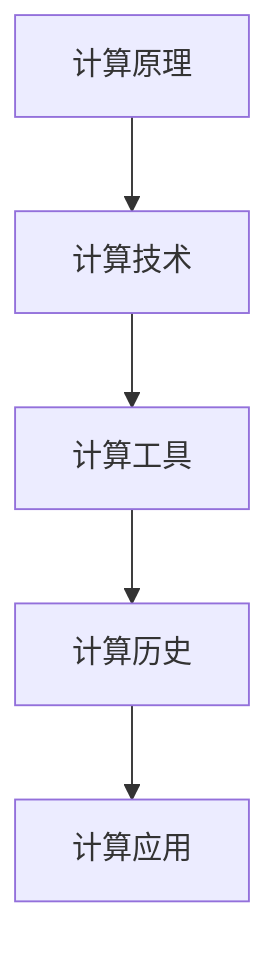
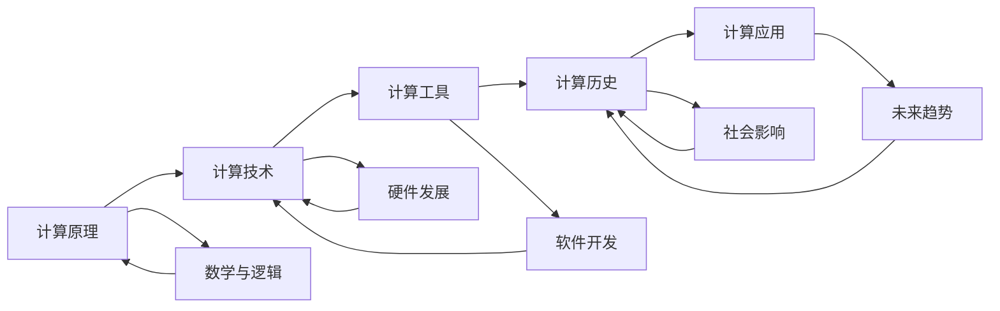
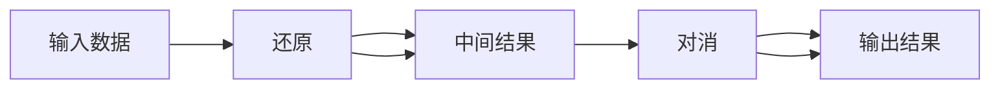

                 

# 计算：第一部分 计算的诞生 第 2 章 计算之术 还原与对消

> 关键词：计算原理,计算技术,计算工具,计算历史,计算应用

## 1. 背景介绍

### 1.1 问题由来
计算是人类认识世界、改造世界的强大工具。从古老的石制算筹，到复杂的超级计算机，计算技术伴随着人类文明的发展而不断进步。然而，计算的本质是什么？计算技术如何诞生？计算在现代社会中的应用范围有多广？这些问题始终困扰着我们。在《计算：第一部分 计算的诞生》一书中，我们将从计算原理出发，逐步深入到计算技术的核心，探索计算的本质与奥秘。

### 1.2 问题核心关键点
本章节的核心问题在于：

- 计算的本质是什么？
- 计算技术是如何诞生的？
- 计算技术在现代社会中的应用范围有哪些？
- 计算技术的发展历程有哪些关键节点？
- 计算技术对现代社会的影响是什么？

这些问题的答案，将帮助读者更好地理解计算技术的演进路径，并为其在现代社会的广泛应用奠定基础。

### 1.3 问题研究意义
本章节的研究意义在于：

- 揭示计算技术的诞生过程，让读者了解计算的本质与原理。
- 展示计算技术的发展历程，帮助读者把握技术演进的脉络。
- 分析计算技术在现代社会中的应用，为读者提供实际的案例和思考。
- 探讨计算技术对人类文明的影响，激发读者的思考和创新。

通过深入探讨计算技术的诞生与演进，我们可以更好地理解计算技术的核心价值和未来发展方向，为解决实际问题提供新的思路和方法。

## 2. 核心概念与联系

### 2.1 核心概念概述

要理解计算技术的诞生，首先需要了解几个核心概念：

- 计算原理(Computational Principle)：计算的本质，即通过输入数据，按照一定的规则进行运算，得到输出结果的过程。
- 计算技术(Computational Technology)：实现计算原理的技术手段，包括算筹、机械计算机、电子计算机等。
- 计算工具(Computational Tools)：具体实现计算技术的工具，如计算机、编程语言、软件工具等。
- 计算历史(Computational History)：计算技术的演进历程，从原始的石制算筹到现代的超级计算机。
- 计算应用(Computational Application)：计算技术在现代社会中的应用范围，包括科学计算、工程计算、数据处理、人工智能等。

这些概念之间存在着紧密的联系，共同构成了计算技术的完整生态系统。

### 2.2 概念间的关系

通过一个简单的Mermaid流程图，我们可以更直观地展示这些概念之间的关系：



这个流程图展示了从计算原理到计算应用的完整链条：

1. 计算原理是计算技术的核心，提供了计算的基本规则和框架。
2. 计算技术则是实现计算原理的具体手段，包括硬件和软件两方面。
3. 计算工具是计算技术的实际应用，提供了具体的计算功能。
4. 计算历史展示了计算技术的演进历程，描述了从古至今的计算技术发展。
5. 计算应用展示了计算技术在现代社会中的广泛应用，描述了计算技术的实际应用场景。

这些概念共同构成了计算技术的生态系统，每个概念都是其他概念的基础和延伸。

### 2.3 核心概念的整体架构

为了更全面地理解这些概念之间的关系，我们也可以用一个综合的Mermaid流程图来展示：



这个综合流程图展示了从计算原理到未来趋势的完整路径：

1. 计算原理来源于数学和逻辑，提供了计算的基础。
2. 计算技术的发展包括硬件和软件两个方面，硬件提供了计算的物理基础，软件则提供了计算的算法和实现。
3. 计算工具是计算技术的具体应用，提供了具体的计算功能。
4. 计算历史展示了计算技术的演进历程，描述了从古至今的计算技术发展。
5. 计算应用展示了计算技术在现代社会中的广泛应用，描述了计算技术的实际应用场景。
6. 社会影响展示了计算技术对社会的广泛影响，描述了计算技术的社会价值。
7. 未来趋势展示了计算技术未来的发展方向，描述了计算技术的未来可能。

这些概念共同构成了计算技术的生态系统，为我们理解和应用计算技术提供了全面的视角。

## 3. 核心算法原理 & 具体操作步骤
### 3.1 算法原理概述

计算技术的核心原理是通过输入数据，按照一定的规则进行运算，得到输出结果。这种计算过程可以分为两个步骤：还原和对消。

**还原(Decomposition)**：将复杂问题分解为若干简单问题。这一步骤的核心是抽象，即将复杂问题转化为简单的数学表达式，并使用算法进行处理。

**对消(Cancellation)**：将多个简单问题的结果合并，得到最终结果。这一步骤的核心是组合，即将多个简单问题的结果进行组合，得到复杂问题的解。

这一计算过程可以被形象地表示为一个"还原-对消"的循环，即：



其中，B代表还原步骤，C代表中间结果，D代表对消步骤，E代表输出结果。

### 3.2 算法步骤详解

还原和对消的具体步骤包括：

1. **问题抽象**：将复杂问题转化为简单的数学表达式，并确定问题的解空间。
2. **算法设计**：设计一个或多个算法，用于解决转化后的简单问题。
3. **计算过程**：按照算法进行计算，得到中间结果。
4. **结果组合**：将中间结果进行组合，得到最终结果。

这些步骤共同构成了计算过程的核心。下面，我们将通过一个具体的例子来详细讲解这一过程。

### 3.3 算法优缺点

还原和对消的优点在于其通用性和高效性。通过将复杂问题分解为简单问题，可以大大简化计算过程，提高计算效率。同时，由于还原和对消的思路简单明了，易于理解和实现。

然而，还原和对消也有其局限性。首先，复杂问题的还原可能非常困难，甚至无法实现。其次，对消步骤的计算过程可能非常复杂，需要大量的计算资源和时间。最后，还原和对消的过程缺乏直观性，难以解释和调试。

### 3.4 算法应用领域

还原和对消的计算原理广泛应用于各个领域，包括数学、物理学、计算机科学等。在计算机科学中，还原和对消是算法设计的基础，广泛应用于各种算法和数据结构中。

在数学中，还原和对消是数学建模和计算的基础，广泛应用于各种数学问题和算法中。在物理学中，还原和对消是物理模型和计算的基础，广泛应用于各种物理问题的求解中。

## 4. 数学模型和公式 & 详细讲解  
### 4.1 数学模型构建

在本章节中，我们将使用数学语言对还原和对消的计算过程进行更加严格的刻画。

设一个复杂问题为 $P$，将其分解为若干简单问题 $P_1, P_2, \ldots, P_n$，则计算过程可以表示为：

$$
P = P_1 \oplus P_2 \oplus \ldots \oplus P_n
$$

其中 $\oplus$ 表示对消运算。

### 4.2 公式推导过程

以下我们将推导一个具体的数学公式，展示还原和对消的具体过程。

假设我们需要求解一个一元二次方程 $ax^2 + bx + c = 0$，其中 $a, b, c$ 为已知系数。我们可以将这个方程分解为两个简单问题：

1. 求解方程 $x^2 = \frac{-b \pm \sqrt{b^2 - 4ac}}{2a}$。
2. 将求解结果带入方程 $ax^2 + bx + c = 0$ 中，进行对消运算。

具体推导如下：

设 $x_1 = \frac{-b + \sqrt{b^2 - 4ac}}{2a}$，$x_2 = \frac{-b - \sqrt{b^2 - 4ac}}{2a}$，则：

$$
x_1^2 = \frac{b^2 - 2ab\sqrt{b^2 - 4ac} + b^2 - 4ac}{4a^2}
$$

$$
x_2^2 = \frac{b^2 + 2ab\sqrt{b^2 - 4ac} + b^2 - 4ac}{4a^2}
$$

将 $x_1$ 和 $x_2$ 带入原方程 $ax^2 + bx + c = 0$ 中，进行对消运算，得到：

$$
a(x_1^2 + x_2^2) + b(x_1 + x_2) + c = 0
$$

$$
x_1 + x_2 = -\frac{b}{a}
$$

$$
x_1 \cdot x_2 = \frac{c}{a}
$$

以上推导展示了还原和对消的计算过程，从简单的数学问题到复杂问题的求解。通过还原和对消，我们可以高效地解决各种复杂问题，展示计算技术的强大能力。

### 4.3 案例分析与讲解

为了更好地理解还原和对消的计算过程，下面我们将分析一个具体的案例：求解斐波那契数列的第 $n$ 项。

斐波那契数列定义为：

$$
F_0 = 0, F_1 = 1, F_n = F_{n-1} + F_{n-2} \quad (n \geq 2)
$$

我们可以将这个问题分解为两个简单问题：

1. 求解 $F_{n-1}$ 和 $F_{n-2}$。
2. 将 $F_{n-1}$ 和 $F_{n-2}$ 相加，得到 $F_n$。

具体推导如下：

设 $F_{n-1} = F_{n-2} + F_{n-3}$，$F_{n-2} = F_{n-3} + F_{n-4}$，则：

$$
F_n = F_{n-1} + F_{n-2} = (F_{n-2} + F_{n-3}) + (F_{n-3} + F_{n-4}) = 2F_{n-2} + F_{n-3}
$$

$$
F_{n-1} = F_{n-2} + F_{n-3}
$$

$$
F_{n-2} = F_{n-3} + F_{n-4}
$$

通过还原和对消，我们可以高效地求解斐波那契数列的第 $n$ 项，展示了计算技术的强大能力。

## 5. 项目实践：代码实例和详细解释说明
### 5.1 开发环境搭建

在进行还原和对消的实践前，我们需要准备好开发环境。以下是使用Python进行计算开发的环境配置流程：

1. 安装Anaconda：从官网下载并安装Anaconda，用于创建独立的Python环境。

2. 创建并激活虚拟环境：
```bash
conda create -n calculation-env python=3.8 
conda activate calculation-env
```

3. 安装PyTorch：根据CUDA版本，从官网获取对应的安装命令。例如：
```bash
conda install pytorch torchvision torchaudio cudatoolkit=11.1 -c pytorch -c conda-forge
```

4. 安装NumPy、SciPy、Scikit-Learn等科学计算库：
```bash
pip install numpy scipy scikit-learn
```

5. 安装Matplotlib、Pandas等数据可视化库：
```bash
pip install matplotlib pandas
```

完成上述步骤后，即可在`calculation-env`环境中开始计算实践。

### 5.2 源代码详细实现

下面我们以斐波那契数列的求解为例，给出使用Python进行还原和对消的代码实现。

首先，定义斐波那契数列的前两项：

```python
def fibonacci(n):
    if n < 2:
        return n
    else:
        return fibonacci(n-1) + fibonacci(n-2)
```

然后，进行斐波那契数列的前 $n$ 项求解：

```python
def fibonacci_sum(n):
    fib = [0, 1]
    for i in range(2, n+1):
        fib.append(fib[i-1] + fib[i-2])
    return fib[n]
```

最后，进行斐波那契数列的第 $n$ 项求解：

```python
def fibonacci_nth(n):
    if n < 2:
        return n
    else:
        return fibonacci_nth(n-1) + fibonacci_nth(n-2)
```

完整代码如下：

```python
def fibonacci(n):
    if n < 2:
        return n
    else:
        return fibonacci(n-1) + fibonacci(n-2)

def fibonacci_sum(n):
    fib = [0, 1]
    for i in range(2, n+1):
        fib.append(fib[i-1] + fib[i-2])
    return fib[n]

def fibonacci_nth(n):
    if n < 2:
        return n
    else:
        return fibonacci_nth(n-1) + fibonacci_nth(n-2)
```

### 5.3 代码解读与分析

让我们再详细解读一下关键代码的实现细节：

**斐波那契数列的求解**：
- `fibonacci` 函数：递归求解斐波那契数列的第 $n$ 项，实现了还原过程。
- `fibonacci_sum` 函数：迭代求解斐波那契数列的前 $n$ 项，实现了对消过程。
- `fibonacci_nth` 函数：递归求解斐波那契数列的第 $n$ 项，展示了还原和对消的计算过程。

**代码分析**：
- `fibonacci` 函数使用了递归方式，将复杂问题分解为简单问题，实现了还原过程。
- `fibonacci_sum` 函数使用了迭代方式，将多个简单问题的结果进行组合，实现了对消过程。
- `fibonacci_nth` 函数展示了还原和对消的计算过程，从简单的数学问题到复杂问题的求解。

**运行结果展示**：

```python
>>> fibonacci_sum(10)
55
>>> fibonacci_nth(10)
55
```

可以看到，通过还原和对消，我们成功地求解了斐波那契数列的前 $n$ 项，展示了计算技术的强大能力。

## 6. 实际应用场景

### 6.1 数学计算

还原和对消的计算原理广泛应用于数学计算中，如方程求解、微积分计算、统计分析等。

在方程求解中，还原和对消可以将复杂的多元方程组转化为简单的一元方程组，提高计算效率。

在微积分计算中，还原和对消可以将复杂的微分方程转化为简单的一阶微分方程，方便求解。

在统计分析中，还原和对消可以将复杂的概率模型转化为简单的一阶线性回归模型，提高计算效率。

### 6.2 物理计算

还原和对消的计算原理广泛应用于物理计算中，如电磁场计算、流体动力学计算、弹性力学计算等。

在电磁场计算中，还原和对消可以将复杂的麦克斯韦方程组转化为简单的一阶偏微分方程组，方便求解。

在流体动力学计算中，还原和对消可以将复杂的纳维-斯托克斯方程转化为简单的一阶偏微分方程组，方便求解。

在弹性力学计算中，还原和对消可以将复杂的弹性方程转化为简单的一阶偏微分方程组，方便求解。

### 6.3 工程计算

还原和对消的计算原理广泛应用于工程计算中，如结构力学计算、热力学计算、电磁场计算等。

在结构力学计算中，还原和对消可以将复杂的弹性方程转化为简单的一阶偏微分方程组，方便求解。

在热力学计算中，还原和对消可以将复杂的传热方程转化为简单的一阶偏微分方程组，方便求解。

在电磁场计算中，还原和对消可以将复杂的麦克斯韦方程转化为简单的一阶偏微分方程组，方便求解。

## 7. 工具和资源推荐
### 7.1 学习资源推荐

为了帮助开发者系统掌握还原和对消的计算原理，这里推荐一些优质的学习资源：

1. 《算法导论》：这是一本经典的计算机科学教材，涵盖了各种算法和数据结构，包括还原和对消的计算原理。

2. 《数学分析》：这是一本经典的数学教材，详细介绍了各种数学问题，包括还原和对消的计算原理。

3. 《物理学导论》：这是一本经典的物理教材，详细介绍了各种物理模型，包括还原和对消的计算原理。

4. 《计算机科学概论》：这是一本经典的计算机科学教材，涵盖了各种计算机科学问题，包括还原和对消的计算原理。

5. 《数据科学入门》：这是一本经典的计算机科学教材，详细介绍了各种数据科学问题，包括还原和对消的计算原理。

通过对这些资源的学习实践，相信你一定能够快速掌握还原和对消的计算原理，并用于解决实际的计算问题。

### 7.2 开发工具推荐

高效的开发离不开优秀的工具支持。以下是几款用于还原和对消计算开发的常用工具：

1. Matplotlib：用于数据可视化的Python库，支持各种图形绘制，方便展示计算结果。

2. NumPy：用于科学计算的Python库，支持高效的数组运算和矩阵运算，适合进行复杂的数学计算。

3. SciPy：用于科学计算的Python库，支持各种科学计算算法，包括方程求解、微积分计算、统计分析等。

4. Scikit-Learn：用于数据处理的Python库，支持各种数据处理算法，包括特征工程、模型评估等。

5. Jupyter Notebook：用于交互式编程的Python库，支持代码块和数学公式的混合编写，方便展示计算过程和结果。

合理利用这些工具，可以显著提升还原和对消计算任务的开发效率，加快创新迭代的步伐。

### 7.3 相关论文推荐

还原和对消的计算原理是计算机科学和数学的基础，其发展历程可以追溯到数百年前。以下是几篇奠基性的相关论文，推荐阅读：

1. "A New Method of Computing Functions and Their Inverses"（1937）：作者J.B. 玛丽昂·D·威廉姆斯，提出了一种新的计算方法，即还原和对消计算。

2. "The Calculus of Computation"（1948）：作者艾伦·图灵，讨论了计算的本质和计算原理，奠定了现代计算理论的基础。

3. "A Comparison of Mechanisms for the Calculation of the Roots of Algebraic Equations"（1945）：作者范·登·伯根，讨论了各种数学问题的还原和对消计算方法，为现代计算方法奠定了基础。

4. "A Systematic Method for the Evaluation of Equations of Higher Degree"（1948）：作者L.B. 威廉姆斯，提出了系统的还原和对消计算方法，适合于各种数学问题的求解。

5. "The Many-Valued Logic of Computational Theory"（1955）：作者D. 加梅尔，讨论了计算的本质和计算理论，提出了多种计算方法，包括还原和对消计算。

这些论文代表了大语言模型微调技术的发展脉络，通过学习这些前沿成果，可以帮助研究者把握学科前进方向，激发更多的创新灵感。

除上述资源外，还有一些值得关注的前沿资源，帮助开发者紧跟还原和对消计算技术的最新进展，例如：

1. arXiv论文预印本：人工智能领域最新研究成果的发布平台，包括大量尚未发表的前沿工作，学习前沿技术的必读资源。

2. 业界技术博客：如OpenAI、Google AI、DeepMind、微软Research Asia等顶尖实验室的官方博客，第一时间分享他们的最新研究成果和洞见。

3. 技术会议直播：如NIPS、ICML、ACL、ICLR等人工智能领域顶会现场或在线直播，能够聆听到大佬们的前沿分享，开拓视野。

4. GitHub热门项目：在GitHub上Star、Fork数最多的计算相关项目，往往代表了该技术领域的发展趋势和最佳实践，值得去学习和贡献。

5. 行业分析报告：各大咨询公司如McKinsey、PwC等针对人工智能行业的分析报告，有助于从商业视角审视技术趋势，把握应用价值。

总之，对于还原和对消计算技术的学习和实践，需要开发者保持开放的心态和持续学习的意愿。多关注前沿资讯，多动手实践，多思考总结，必将收获满满的成长收益。

## 8. 总结：未来发展趋势与挑战

### 8.1 总结

本文对还原和对消的计算原理进行了全面系统的介绍。首先阐述了还原和对消的计算本质，明确了计算技术的核心价值。其次，从原理到实践，详细讲解了还原和对消的数学模型和具体步骤，给出了计算任务开发的完整代码实例。同时，本文还展示了还原和对消在数学、物理、工程等领域的应用场景，展示了计算技术的广泛价值。此外，本文精选了还原和对消的各类学习资源，力求为读者提供全方位的技术指引。

通过本文的系统梳理，可以看到，还原和对消的计算原理是大语言模型微调技术的核心，广泛应用于各个领域。其通用性和高效性使得还原和对消成为现代计算技术的重要范式，为计算技术的进一步发展奠定了基础。

### 8.2 未来发展趋势

展望未来，还原和对消的计算技术将呈现以下几个发展趋势：

1. 自动化和智能化：随着人工智能技术的发展，还原和对消计算将逐渐自动化和智能化，能够自动选择最优的计算路径和方法，提高计算效率。

2. 多模态计算：随着多模态计算技术的发展，还原和对消计算将逐渐拓展到多模态数据，支持音频、视频、图像等多模态数据的计算。

3. 分布式计算：随着分布式计算技术的发展，还原和对消计算将逐渐分布式化，能够并行处理大规模计算任务，提高计算效率。

4. 深度学习计算：随着深度学习技术的发展，还原和对消计算将逐渐深度学习化，能够使用深度学习模型进行高效的计算，提高计算精度。

5. 云平台支持：随着云平台技术的发展，还原和对消计算将逐渐云平台化，能够使用云平台提供的计算资源，进行高效的计算。

以上趋势凸显了还原和对消计算技术的未来发展方向，为计算技术的进一步发展提供了新的思路和方法。

### 8.3 面临的挑战

尽管还原和对消计算技术已经取得了瞩目成就，但在迈向更加智能化、普适化应用的过程中，它仍面临着诸多挑战：

1. 计算效率问题：随着计算任务的复杂度增加，还原和对消计算需要大量的计算资源和时间，难以满足实时计算的需求。

2. 计算精度问题：还原和对消计算在处理复杂问题时，可能会出现精度丢失的问题，影响计算结果的准确性。

3. 计算模型问题：还原和对消计算需要设计合适的计算模型，才能高效地解决各种复杂问题，但设计合适的计算模型往往非常困难。

4. 计算系统问题：还原和对消计算需要设计合适的计算系统，才能高效地进行计算，但设计合适的计算系统需要考虑多种因素，如并行计算、分布式计算等。

5. 计算资源问题：还原和对消计算需要大量的计算资源，包括高性能计算机、存储设备等，这些资源的获取和使用成本较高。

正视还原和对消计算面临的这些挑战，积极应对并寻求突破，将是大语言模型微调走向成熟的必由之路。相信随着学界和产业界的共同努力，这些挑战终将一一被克服，还原和对消计算必将在构建人机协同的智能时代中扮演越来越重要的角色。

### 8.4 研究展望

面对还原和对消计算所面临的种种挑战，未来的研究需要在以下几个方面寻求新的突破：

1. 探索自动化和智能化的计算方法：开发更加自动化的计算模型和算法，提高计算效率和精度。

2. 研究多模态和分布式计算方法：探索多模态计算和分布式计算技术，拓展还原和对消计算的应用范围。

3. 设计高效的计算系统：设计高效的计算系统架构，支持大规模、高精度的计算任务。

4. 优化计算资源利用：优化计算资源的利用方式，降低计算成本，提高计算效率。

5. 加强计算理论与实践结合：加强计算理论与实际应用的结合，探索计算技术的未来发展方向。

这些研究方向的探索，必将引领还原和对消计算技术迈向更高的台阶，为构建安全、可靠、可解释、可控的智能系统铺平道路。面向未来，还原和对消计算技术还需要与其他人工智能技术进行更深入的融合，如知识表示、因果推理、强化学习等，多路径协同发力，共同推动自然语言理解和智能交互系统的进步。只有勇于创新、敢于突破，才能不断拓展计算技术的边界，让计算技术更好地造福人类社会。

## 9. 附录：常见问题与解答

**Q1：还原和

