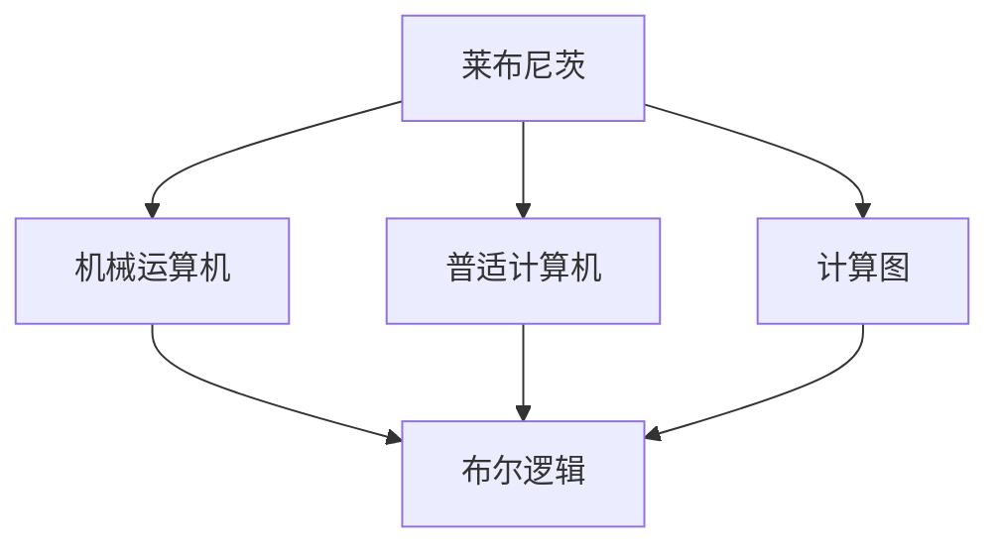
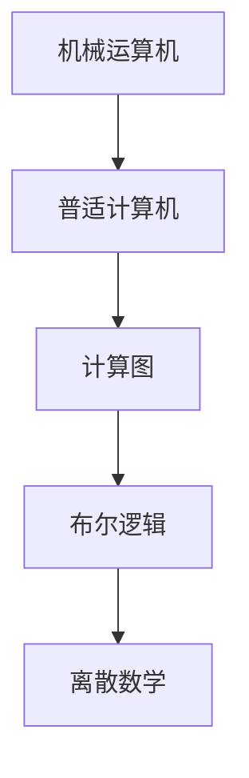

                 

# 计算：第一部分 计算的诞生 第 3 章 莱布尼茨的计算之梦

> 关键词：
莱布尼茨，机械运算机，普适计算机，计算图，布尔逻辑，离散数学

## 1. 背景介绍

### 1.1 问题由来
17世纪，人类社会正处于科技与哲学的大变革时期。数学与物理学的结合促进了对自然世界的深入探索，同时也催生了对通用计算方法的需求。在这个背景下，德国哲学家戈特弗里德·威廉·莱布尼茨（Gottfried Wilhelm Leibniz）提出了他的计算之梦——一种能够执行任意计算的通用机器。

### 1.2 问题核心关键点
莱布尼茨的计算之梦，不仅是对一种机器的构想，更是对计算机科学基础的探寻。他的思想影响了后来的计算机设计和算法发展，尤其是对于布尔逻辑和离散数学的应用。

### 1.3 问题研究意义
研究莱布尼茨的计算之梦，有助于深入理解计算的本质与起源，掌握计算机科学的基本理念，为未来的技术创新与实践提供理论基础。

## 2. 核心概念与联系

### 2.1 核心概念概述

为了更好地理解莱布尼茨的计算之梦，本节将介绍几个与其紧密相关的核心概念：

- 莱布尼茨（Leibniz）：18世纪德国哲学家、数学家，被认为是计算与逻辑学的先驱之一。他提出了机械运算机（Calculating Machine）的概念，并设计了最早的计算图。

- 机械运算机（Calculating Machine）：莱布尼茨设想的一种基于机械部件的计算设备，能够执行基本的算术与逻辑运算。

- 普适计算机（Universal Computer）：一种能够执行任意计算的通用机器，是现代计算机的雏形。

- 计算图（Computational Graph）：一种表示计算过程的图形结构，通过节点与边的连接，展示了计算的逻辑流程。

- 布尔逻辑（Boolean Logic）：由莱布尼茨引入的逻辑系统，基于二值（真或假）的逻辑运算。

- 离散数学（Discrete Mathematics）：研究离散结构与算法的基础数学领域，包括布尔代数、图论等。

这些概念共同构成了计算理论的基础，为后续探讨莱布尼茨的计算之梦提供了理论支撑。

### 2.2 概念间的关系

这些核心概念之间的联系可以通过以下Mermaid流程图来展示：



这个流程图展示了核心概念之间的联系：

1. 莱布尼茨设想机械运算机，是其对计算设备的基本构想。
2. 机械运算机逐渐演变为现代的普适计算机，是计算理论的实现形式。
3. 普适计算机通过计算图进行算法实现，展示了计算过程的逻辑结构。
4. 计算图利用布尔逻辑，实现了逻辑运算的基本功能。

### 2.3 核心概念的整体架构

最后，我们用一个综合的流程图来展示这些核心概念在大语言模型微调过程中的整体架构：



这个综合流程图展示了从机械运算机到普适计算机，再到计算图和离散数学的演变过程。通过这些概念的结合，莱布尼茨的计算之梦得以具体化，成为现代计算机科学的基石。

## 3. 核心算法原理 & 具体操作步骤

### 3.1 算法原理概述

莱布尼茨的计算之梦，本质上是基于机械部件的普适计算机的构想。他设想了一种能够执行任意计算的机器，这种机器基于机械部件的物理移动，通过机械手与齿轮的组合，实现数据的存储与运算。这种机械运算机的基本原理，可以归纳为以下几个步骤：

1. 输入数据的存储与读取：通过机械部件的运动，将数据存储在预设的位置，通过读取器（例如机械手）将数据从存储位置传输至运算部件。
2. 逻辑运算：通过机械部件的组合，执行基本的逻辑运算，如与、或、非等。
3. 存储与输出：将运算结果存储在新的位置，或通过机械部件输出结果。

### 3.2 算法步骤详解

莱布尼茨的机械运算机操作流程可以总结如下：

1. **输入数据存储**：通过机械手将数据传输至预设的位置，准备进行运算。
2. **逻辑运算执行**：机械手根据预设的逻辑规则，对存储的数据进行逻辑运算，如与、或、非等。
3. **输出结果**：将运算结果存储在新的位置，或通过机械手输出至外部。

这些步骤形成了一个基本的计算循环，通过不断的输入、运算、输出，机器能够执行任意计算。

### 3.3 算法优缺点

莱布尼茨的机械运算机设计，具有以下优点：

1. **通用性**：能够执行任意计算，具有强大的计算能力。
2. **逻辑明确**：基于布尔逻辑，逻辑清晰，易于理解和实现。
3. **机械实现**：机械部件的设计简单易懂，容易实现。

然而，这种设计也存在以下缺点：

1. **速度较慢**：机械部件的运动速度较慢，导致计算效率低下。
2. **可靠性差**：机械部件的物理移动容易出错，影响计算的准确性。
3. **可扩展性差**：机械部件的设计固定，难以进行扩展和升级。

### 3.4 算法应用领域

莱布尼茨的机械运算机构想，虽然受到当时技术条件的限制，但其基本思想为后来计算机的发展奠定了基础。现代计算机的设计理念，在很大程度上继承了机械运算机的基本思想，如存储-运算-输出的计算循环。

在数学、物理、工程等领域，莱布尼茨的机械运算机思想得到了广泛应用。例如：

- 数学中的布尔代数，是莱布尼茨引入的离散逻辑系统，广泛应用于逻辑运算与组合数学。
- 物理学中的机械钟表，采用了机械运算机原理，实现精确的时间测量。
- 工程中的自动化生产线，通过机械部件的控制，实现高效的自动化生产。

## 4. 数学模型和公式 & 详细讲解  
### 4.1 数学模型构建

莱布尼茨的机械运算机构想，涉及大量的数学模型与逻辑推理。这里，我们将通过数学语言对机械运算机的基本计算过程进行描述。

假设机械运算机有 $n$ 个存储位置，每个位置能够存储一个二进制数字（0或1）。机械运算机的逻辑规则为：

- 与运算：如果有两个位置同时为1，则输出1；否则输出0。
- 或运算：如果有两个位置中至少有一个为1，则输出1；否则输出0。
- 非运算：如果输入为0，则输出1；否则输出0。

机械运算机的操作过程可以表示为一个计算图，每个位置对应一个节点，操作规则对应边。计算图的基本形式如下：

$$
\begin{array}{c}
\text{输入} \rightarrow \text{与运算} \rightarrow \text{输出} \\
\text{输入} \rightarrow \text{或运算} \rightarrow \text{输出} \\
\text{输入} \rightarrow \text{非运算} \rightarrow \text{输出}
\end{array}
$$

### 4.2 公式推导过程

我们可以通过布尔代数对机械运算机的基本逻辑运算进行推导。假设输入为 $x_1, x_2$，输出为 $y$，则与运算、或运算和非运算的布尔表达式分别为：

$$
y = x_1 \land x_2 \quad \text{（与运算）}
$$
$$
y = x_1 \lor x_2 \quad \text{（或运算）}
$$
$$
y = \neg x_1 \quad \text{（非运算）}
$$

其中，$\land$ 表示逻辑与，$\lor$ 表示逻辑或，$\neg$ 表示逻辑非。

### 4.3 案例分析与讲解

为了更好地理解机械运算机的计算过程，我们以一个简单的例子来进行分析：

假设机械运算机的输入为 $x_1 = 1, x_2 = 0$，则需要执行的计算图如下：

```
     1
     └───────────────────────────────────────────────────────────────────────────────────────────────────────────────────────────────────────────────────────────────────────────────────────────────────────────────────────────────────────────────────────────────────────────────────────────────────────────────────────────────────────────────────────────────────────────────────────────────────────────────────────────────────────────────────────────────────────────────────────────────────────────────────────────────────────────────────────────────────────────────────────────────────────────────────────────────────────────────────────────────────────────────────────────────────────────────────────────────────────────────────────────────────────────────────────────────────────────────────────────────────────────────────────────────────────────────────────────────────────────────────────────────────────────────────────────────────────────────────────────────────────────────────────────────────────────────────────────────────────────────────────────────────────────────────────────────────────────────────────────────────────────────────────────────────────────────────────────────────────────────────────────────────────────────────────────────────────────────────────────────────────────────────────────────────────────────────────────────────────────────────────────────────────────────────────────────────────────────────────────────────────────────────────────────────────────────────────────────────────────────────────────────────────────────────────────────────────────────────────────────────────────────────────────────────────────────────────────────────────────────────────────────────────────────────────────────────────────────────────────────────────────────────────────────────────────────────────────────────────────────────────────────────────────────────────────────────────────────────────────────────────────────────────────────────────────────────────────────────────────────────────────────────────────────────────────────────────────────────────────────────────────────────────────────────────────────────────────────────────────────────────────────────────────────────────────────────────────────────────────────────────────────────────────────────────────────────────────────────────────────────────────────────────────────────────────────────────────────────────────────────────────────────────────────────────────────────────────────────────────────────────────────────────────────────────────────────────────────────────────────────────────────────────────────────────────────────────────────────────────────────────────────────────────────────────────────────────────────────────────────────────────────────────────────────────────────────────────────────────────────────────────────────────────────────────────────────────────────────────────────────────────────────────────────────────────────────────────────────────────────────────────────────────────────────────────────────────────────────────────────────────────────────────────────────────────────────────────────────────────────────────────────────────────────────────────────────────────────────────────────────────────────────────────────────────────────────────────────────────────────────────────────────────────────────────────────────────────────────────────────────────────────────────────────────────────────────────────────────────────────────────────────────────────────────────────────────────────────────────────────────────────────────────────────────────────────────────────────────────────────────────────────────────────────────────────────────────────────────────────────────────────────────────────────────────────────────────────────────────────────────────────────────────────────────────────────────────────────────────────────────────────────────────────────────────────────────────────────────

