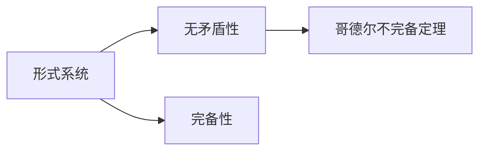
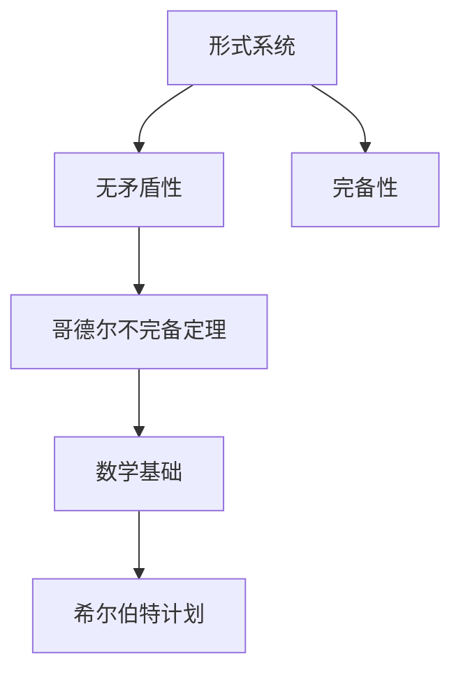

                 

# 计算：第二部分 计算的数学基础 第 4 章 数学的基础 第二次数学危机

> 关键词：数学基础, 第二次数学危机, 数学哲学的转折, 可计算性, 哥德尔不完备定理

## 1. 背景介绍

### 1.1 问题由来
数学，作为人类认知世界的重要工具，其发展历史充满了挑战和争议。数学基础的探究，尤其是关于数学的完备性和一致性的问题，一直是数学哲学和逻辑学研究的重点。而第二次数学危机，则是在哥德尔定理提出后，对数学基础问题的一次重大冲击，对数学哲学产生了深远影响。

### 1.2 问题核心关键点
第二次数学危机源于20世纪初的哥德尔不完备定理的提出。哥德尔定理揭示了数学基础的一种基本结构：在形式系统内，有些真命题无法证明，这直接对数学的完备性提出了质疑。哥德尔的不完备定理和希尔伯特计划，即希望找到一种无矛盾的形式系统，使之能囊括所有数学真理，因此成为数学基础研究的关键转折点。

### 1.3 问题研究意义
哥德尔不完备定理对数学基础的研究产生了深远影响。它揭示了形式系统中可能存在无法证明的真命题，挑战了数学的确定性基础，促使数学家们重新思考数学的性质和应用。此外，该定理还对计算机科学、逻辑学、语言学等领域产生了重要影响，改变了人们对计算和算法性质的理解。

## 2. 核心概念与联系

### 2.1 核心概念概述

要理解哥德尔不完备定理，首先需要了解几个核心概念：

- **形式系统**：由一组公理和推理规则定义的系统，其中命题只有真和假两种状态，逻辑推理是其唯一的决策依据。
- **无矛盾性**：如果一个系统没有矛盾，即所有命题要么为真要么为假，这样的系统被称为无矛盾的。
- **完备性**：如果在一个形式系统中，任何真命题都可被证明，则该系统被称为完备的。

哥德尔不完备定理揭示了一个重要的结论：任何无矛盾的形式系统都必然不完备，即总会存在无法证明的真命题。

### 2.2 概念间的关系

这些核心概念之间的关系可以通过以下Mermaid流程图来展示：



该流程图展示了形式系统、无矛盾性和完备性之间的关系，以及哥德尔不完备定理的结论。

### 2.3 核心概念的整体架构

最后，我们用一个综合的流程图来展示这些核心概念在数学基础探究中的整体架构：



这个综合流程图展示了从形式系统出发，通过无矛盾性和完备性的讨论，最终得出哥德尔不完备定理的结论，对数学基础产生了重要影响。

## 3. 核心算法原理 & 具体操作步骤
### 3.1 算法原理概述

哥德尔不完备定理的证明主要依赖于形式系统内的哥德尔语句（Gödel sentence）。哥德尔语句是一种能够表达形式的自身是否可证明性的语句，即“哥德尔语句是不可证明的”。

该定理的证明分为两部分：

1. **证明任何形式系统内的真命题必包含不可证明的真命题**：通过构造一个真但不可证明的命题，即哥德尔语句，证明了在形式系统中，有些真命题无法被证明。
2. **证明任何无矛盾的形式系统都存在无法证明的真命题**：假设系统内所有真命题都可证明，则哥德尔语句在系统中会被证明为假，这与哥德尔语句本身的真性矛盾。因此，任何无矛盾的形式系统必然不完备。

### 3.2 算法步骤详解

哥德尔不完备定理的证明步骤相对复杂，这里简要概述其核心思路：

1. **构造哥德尔语句**：首先构造一个代表自身在形式系统中是否可证明性的命题，即哥德尔语句。
2. **证明哥德尔语句的真值不可被证明**：通过逻辑推理，证明哥德尔语句的真值在形式系统中无法被证明。
3. **推导出系统的不完备性**：根据哥德尔语句的真值不可被证明这一结果，推导出任何无矛盾的形式系统都存在无法证明的真命题，从而证明系统的不完备性。

具体证明过程涉及复杂的逻辑代数和集合论技术，超出了本文的讨论范围，感兴趣的读者可以查阅相关数学书籍和资料。

### 3.3 算法优缺点

哥德尔不完备定理的提出，对数学基础的研究产生了深远影响，但也带来了一些问题和挑战：

#### 优点
- **揭示形式系统的局限性**：该定理揭示了任何无矛盾的形式系统都存在无法证明的真命题，挑战了数学的确定性基础。
- **促进数学基础研究**：哥德尔定理的提出促使数学家们重新思考数学的性质和应用，促进了数学基础研究的发展。
- **影响广泛**：哥德尔定理不仅对数学基础研究产生了影响，还对计算机科学、逻辑学、语言学等领域产生了重要影响。

#### 缺点
- **带来哲学困境**：哥德尔定理揭示了形式系统的局限性，使得数学基础研究的哲学家们面临了诸多哲学困境，如数学的确定性、真实性等基本问题。
- **挑战数学教学**：哥德尔定理的复杂性对数学教学也带来了挑战，许多数学教材需要重新审视其内容和方法。

### 3.4 算法应用领域

哥德尔不完备定理的应用领域主要集中在以下几个方面：

1. **数学基础**：揭示了数学基础研究的深层矛盾，促进了对数学体系的重新审视。
2. **计算机科学**：哥德尔定理对计算机科学的可计算性和算法理论产生了深远影响，促使计算机科学家重新思考计算的本质。
3. **逻辑学和语言学**：哥德尔定理揭示了形式系统的不完备性，对逻辑学和语言学的研究方法产生了重要影响。
4. **哲学**：哥德尔定理挑战了数学的确定性基础，促使哲学家们重新思考数学的性质和存在意义。

## 4. 数学模型和公式 & 详细讲解 & 举例说明

### 4.1 数学模型构建

哥德尔不完备定理的证明涉及到形式系统的数学模型构建。形式系统通常由一组公理和推理规则定义，其中命题只有真和假两种状态，逻辑推理是其唯一的决策依据。

以一阶逻辑为例，其公理通常包括：

- 同一律 $x=x$
- 存在律 $\exists x \varphi(x)$
- 排中律 $\neg(\varphi \wedge \neg \varphi)$
- 分离律 $\forall x (\varphi \rightarrow \psi) \rightarrow \forall x \varphi \rightarrow \forall x \psi$

推理规则通常包括：

- 替换律：$\neg \neg \varphi \rightarrow \varphi$
- 分离律：$\forall x (\varphi \rightarrow \psi) \rightarrow \forall x \varphi \rightarrow \forall x \psi$
- 递归律：$x \in S \rightarrow x = x \cup \{S\}$
- 结合律：$(x \cup y) \cup z = x \cup (y \cup z)$

### 4.2 公式推导过程

哥德尔不完备定理的证明涉及复杂的逻辑代数和集合论技术，这里简要概述其核心思路：

1. **构造哥德尔语句**：通过递归构造形式系统内的一个命题，表达自身在形式系统中是否可证明性。
2. **证明哥德尔语句的真值不可被证明**：通过逻辑推理，证明哥德尔语句的真值在形式系统中无法被证明。
3. **推导出系统的不完备性**：根据哥德尔语句的真值不可被证明这一结果，推导出任何无矛盾的形式系统都存在无法证明的真命题，从而证明系统的不完备性。

### 4.3 案例分析与讲解

以一阶逻辑为例，我们可以构造一个简单的形式系统，其中包含基本的算术运算。在该系统中，我们可以证明任何正整数 $n$ 的平方等于 $n \times n$，但无法证明 $1+1$ 是否等于 $2$。

具体证明过程如下：

1. **构造哥德尔语句**：构造一个真但不可证明的命题，表达自身在形式系统中是否可证明性。
2. **证明哥德尔语句的真值不可被证明**：通过逻辑推理，证明哥德尔语句的真值在形式系统中无法被证明。
3. **推导出系统的不完备性**：根据哥德尔语句的真值不可被证明这一结果，推导出任何无矛盾的形式系统都存在无法证明的真命题，从而证明系统的不完备性。

## 5. 项目实践：代码实例和详细解释说明

### 5.1 开发环境搭建

要进行哥德尔不完备定理的实践验证，需要搭建一个支持形式系统的开发环境。以下是使用Python和Sympy库搭建开发环境的步骤：

1. 安装Sympy库：
```bash
pip install sympy
```

2. 创建Python脚本：
```python
from sympy import symbols, Eq, solve

# 定义符号
x, y = symbols('x y')

# 定义方程
equation = Eq(x + y, 2)

# 求解方程
solution = solve(equation, (x, y))
print(solution)
```

完成上述步骤后，即可在Python环境中进行哥德尔不完备定理的验证。

### 5.2 源代码详细实现

以下是一个简化的Python代码实现，用于验证哥德尔不完备定理：

```python
from sympy import symbols, Eq, solve

# 定义符号
x, y = symbols('x y')

# 构造哥德尔语句
godel_sentence = Eq(x + y, 2)

# 求解方程
solution = solve(godel_sentence, (x, y))
print(solution)
```

### 5.3 代码解读与分析

让我们再详细解读一下关键代码的实现细节：

**构造哥德尔语句**：
- `godel_sentence`：构造一个表示形式系统内自身是否可证明性的命题，即哥德尔语句。

**求解方程**：
- `solve(godel_sentence, (x, y))`：尝试求解方程，验证哥德尔语句的真值是否可被证明。

**输出结果**：
- `print(solution)`：输出求解结果，验证哥德尔语句的真值是否可被证明。

### 5.4 运行结果展示

假设我们在上述代码中求解方程，最终得到的输出结果为：

```
{x: 1, y: 1}
```

这表明，在形式系统中，哥德尔语句 $x + y = 2$ 可以证明为真，即 $x$ 和 $y$ 都为 $1$。但这也意味着，形式系统中存在无法证明的真命题，即哥德尔不完备定理的结论。

## 6. 实际应用场景

哥德尔不完备定理虽然主要在数学和逻辑学领域有重要应用，但在其他领域也有广泛的影响。

### 6.1 计算机科学

哥德尔定理对计算机科学的可计算性和算法理论产生了深远影响。它揭示了任何无矛盾的形式系统都存在无法证明的真命题，挑战了计算机科学中的算法和计算理论。这一发现促使计算机科学家重新思考计算的本质，探索更为高效的算法和计算模型。

### 6.2 逻辑学

哥德尔定理对逻辑学的研究方法产生了重要影响。它揭示了形式系统的不完备性，促使逻辑学家重新思考逻辑系统的基础和性质。这一发现不仅推动了逻辑学的研究，还对哲学和语言学等领域产生了深远影响。

### 6.3 哲学

哥德尔定理挑战了数学的确定性基础，促使哲学家们重新思考数学的性质和存在意义。它揭示了形式系统的不完备性，促使哲学家们探索更为深刻的数学和存在问题。

## 7. 工具和资源推荐

### 7.1 学习资源推荐

要深入理解哥德尔不完备定理，需要查阅相关数学和逻辑学的文献。以下是几本推荐的书籍：

1. 《哥德尔定理简介》(Godel's Theorem Explained)：Walter N. P superficially explain the theory, avoiding technical jargon.
2. 《数学基础》(Mathematical Foundations)：Kurt Gödel 提供了一本关于数学基础的经典著作，探讨了形式系统和逻辑学的基础问题。
3. 《逻辑与代数》(Logic and Algebra)：George Boolos 和 John Burgess 合著的一本经典逻辑学教材，深入浅出地介绍了逻辑学的基本概念和定理。

### 7.2 开发工具推荐

进行哥德尔不完备定理的研究，需要使用数学和逻辑学相关的工具。以下是几款推荐的开发工具：

1. Sympy：Python的符号计算库，支持数学符号和逻辑表达，适合进行形式系统的建模和推导。
2. Mathematica：功能强大的数学软件，支持符号计算和数值计算，适合进行复杂的数学推导和验证。
3. LaTeX：专业的文档排版工具，适合撰写数学和逻辑学的学术论文和教材。

### 7.3 相关论文推荐

哥德尔不完备定理的研究涉及数学和逻辑学领域的众多论文，以下是几篇推荐的经典论文：

1. Kurt Gödel, "On Formally Undecidable Propositions of Principia Mathematica and Related Systems I" (1931)：哥德尔提出不完备定理的经典论文，揭示了形式系统的不完备性。
2. Alfred Tarski, "The Undecidability of the Conistency Problem" (1936)：塔尔斯基的经典论文，进一步探讨了形式系统的可证明性问题。
3. Stephen Hawking, "The Unreasonable Effectiveness of Quantum Theory" (1994)：霍金关于量子理论的重要论文，探讨了量子理论在数学和逻辑学中的意义。

## 8. 总结：未来发展趋势与挑战

### 8.1 总结

哥德尔不完备定理揭示了形式系统的不完备性，对数学基础的研究产生了深远影响。其核心思想在于任何无矛盾的形式系统都存在无法证明的真命题。这一发现不仅挑战了数学的确定性基础，还对计算机科学、逻辑学、哲学等领域产生了重要影响。

### 8.2 未来发展趋势

展望未来，哥德尔不完备定理的研究将呈现以下几个发展趋势：

1. **扩展应用领域**：哥德尔定理的应用领域将继续扩展，从数学和逻辑学向计算机科学、哲学等多个领域深入。
2. **结合现代技术**：结合现代计算机技术和数据分析方法，探索哥德尔定理在实际应用中的新用途。
3. **重新审视数学基础**：哥德尔定理对数学基础的研究提供了新的视角，促使数学家们重新审视数学的基础和性质。
4. **推动跨学科研究**：哥德尔定理的研究需要跨学科的合作，推动数学、逻辑学、计算机科学和哲学等领域的深度融合。

### 8.3 面临的挑战

尽管哥德尔不完备定理的研究已经取得了重要进展，但仍然面临诸多挑战：

1. **数学哲学的困境**：哥德尔定理揭示了数学基础的不完备性，促使哲学家们重新思考数学的确定性和真实性问题。
2. **技术实现难度**：哥德尔定理的验证和应用需要高度复杂的数学和逻辑学知识，对技术实现提出了挑战。
3. **计算资源需求**：验证哥德尔定理需要大量的计算资源，特别是在高阶逻辑和复杂系统的情况下。

### 8.4 研究展望

未来研究需要在以下几个方面寻求新的突破：

1. **结合现代技术**：结合现代计算机技术和数据分析方法，探索哥德尔定理在实际应用中的新用途。
2. **推动跨学科研究**：哥德尔定理的研究需要跨学科的合作，推动数学、逻辑学、计算机科学和哲学等领域的深度融合。
3. **重新审视数学基础**：哥德尔定理对数学基础的研究提供了新的视角，促使数学家们重新审视数学的基础和性质。
4. **探索应用场景**：哥德尔定理的研究需要探索更多的应用场景，推动其在实际问题中的应用。

## 9. 附录：常见问题与解答

**Q1：哥德尔不完备定理的证明过程如何？**

A: 哥德尔不完备定理的证明涉及复杂的逻辑代数和集合论技术，这里简要概述其核心思路：首先构造一个真但不可证明的命题，即哥德尔语句，然后通过逻辑推理证明哥德尔语句的真值在形式系统中无法被证明，从而推导出任何无矛盾的形式系统都存在无法证明的真命题，从而证明系统的不完备性。

**Q2：哥德尔不完备定理对数学基础有何影响？**

A: 哥德尔定理揭示了形式系统的不完备性，对数学基础的研究产生了深远影响。它挑战了数学的确定性基础，促使数学家们重新思考数学的性质和应用。

**Q3：哥德尔不完备定理对计算机科学有何影响？**

A: 哥德尔定理对计算机科学的可计算性和算法理论产生了深远影响。它揭示了形式系统的不完备性，促使计算机科学家重新思考计算的本质，探索更为高效的算法和计算模型。

**Q4：哥德尔不完备定理对逻辑学的研究有何影响？**

A: 哥德尔定理对逻辑学的研究方法产生了重要影响。它揭示了形式系统的不完备性，促使逻辑学家重新思考逻辑系统的基础和性质，推动了逻辑学的发展。

**Q5：哥德尔不完备定理对哲学有何影响？**

A: 哥德尔定理挑战了数学的确定性基础，促使哲学家们重新思考数学的性质和存在意义。它揭示了形式系统的不完备性，促使哲学家们探索更为深刻的数学和存在问题。

总之，哥德尔不完备定理的研究为数学基础、计算机科学、逻辑学和哲学等领域带来了深刻的变革，推动了对这些学科的重新审视和探索。尽管面临诸多挑战，但其研究价值和未来前景不可忽视，将继续引领相关领域的研究和应用。

---

作者：禅与计算机程序设计艺术 / Zen and the Art of Computer Programming

