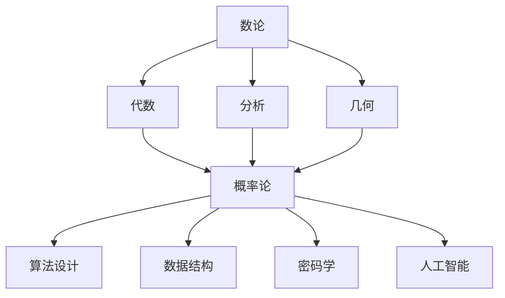
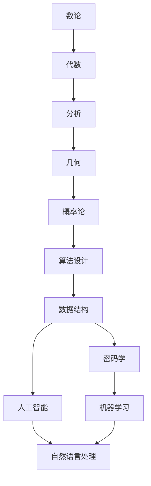

                 

# 计算：第二部分 计算的数学基础 第 4 章 数学的基础

## 1. 背景介绍

### 1.1 问题由来
在《计算：第一部分》中，我们探讨了计算的基本原理和算法，但所有算法的数学基础仍未涉及。本章将从数学基础的角度，深入讨论计算的本质，以及计算与数学之间的内在联系。

### 1.2 问题核心关键点
数学是计算的核心工具，理解数学是深入计算的基石。本章节将重点介绍计算机科学中常用的数学概念、定理和公式，帮助读者构建起计算的数学基础。

### 1.3 问题研究意义
构建计算机科学的数学基础，对于理解算法、设计高效的数据结构和开发可扩展的软件系统至关重要。本章的学习，将使读者具备必要的数学背景知识，从而更好地理解算法的本质，提高解决问题的能力。

## 2. 核心概念与联系

### 2.1 核心概念概述

为了更好地理解计算的数学基础，我们将介绍几个关键数学概念：

- **数论（Number Theory）**：研究自然数和整数的基本性质，包括质数、最大公约数、最小公倍数等。
- **代数（Algebra）**：研究各种代数结构，如群、环、域、向量空间等，以及它们之间的关系和运算。
- **分析（Analysis）**：研究实数和函数的性质，包括极限、连续性、可导性、积分、微分等。
- **几何（Geometry）**：研究空间形状、大小、位置和运动的基本规律，包括点、线、面、体等几何元素。
- **概率论（Probability Theory）**：研究随机事件的概率计算、随机变量的统计特性以及它们在信息处理中的应用。

这些数学概念之间存在紧密联系，形成了一个互相支撑的知识体系。在计算机科学中，它们被广泛应用于算法设计、数据结构、密码学、人工智能等领域。

### 2.2 概念间的关系

这些核心概念之间存在着错综复杂的关系，可以通过以下Mermaid流程图来展示：



这个流程图展示了数论、代数、分析、几何、概率论这些数学概念，在计算机科学中的应用范围。它们通过复杂的互相影响和交叉，共同支撑着计算机科学的数学基础。

### 2.3 核心概念的整体架构

最后，我们用一个综合的流程图来展示这些核心概念在大规模计算机科学应用中的整体架构：



这个综合流程图展示了从数论到人工智能的计算数学基础的全局结构。数论和代数是计算机科学的基础，分析、几何和概率论为更高级的算法设计和数据结构提供了必要的数学工具。这些概念共同构建起计算机科学的数学基础，支撑着机器学习、自然语言处理等高级应用的发展。

## 3. 核心算法原理 & 具体操作步骤
### 3.1 算法原理概述

计算机科学中的算法本质上是一种解决问题的方法，而这些问题往往与数学息息相关。因此，理解计算的数学基础对于算法的理解至关重要。

- **排序算法（Sorting Algorithms）**：如快速排序、归并排序等，依赖于数论中的比较排序原理。
- **搜索算法（Search Algorithms）**：如二分查找、深度优先搜索等，依赖于数论中的等价关系和序列等概念。
- **图论算法（Graph Algorithms）**：如最短路径算法、最小生成树算法等，依赖于图论中的图、顶点、边、连通性等概念。
- **线性代数（Linear Algebra）**：如矩阵乘法、特征值分解等，依赖于代数中的矩阵、线性方程组等概念。
- **微积分（Calculus）**：如梯度下降、神经网络的反向传播等，依赖于分析中的极限、导数、积分等概念。

### 3.2 算法步骤详解

以梯度下降算法为例，展示其核心步骤：

1. **初始化**：选择一个合适的初始点，设定学习率 $\alpha$。
2. **计算梯度**：对目标函数 $f(x)$ 求导数，得到梯度 $\nabla f(x)$。
3. **更新参数**：将当前参数 $x$ 沿着梯度 $\nabla f(x)$ 反方向移动 $\alpha$ 步长。
4. **重复迭代**：重复上述步骤，直到满足停止条件（如收敛、达到最大迭代次数等）。

### 3.3 算法优缺点

梯度下降算法具有以下优点：

- **简单高效**：算法结构简单，实现容易，计算代价低。
- **局部最优解**：在凸函数下，算法可以保证收敛到全局最优解。
- **可扩展性**：可以应用于大规模数据集和复杂模型。

同时，梯度下降算法也存在一些缺点：

- **局部最优**：当目标函数具有多个局部极小值时，算法可能陷入局部最优解。
- **依赖初始点**：初始点的选择对算法结果影响较大。
- **复杂度不稳定**：收敛速度取决于函数特性，可能存在震荡不收敛的情况。

### 3.4 算法应用领域

梯度下降算法广泛应用于机器学习中的模型训练、优化问题求解等领域。例如：

- **线性回归**：通过对损失函数求导，最小化误差。
- **神经网络**：反向传播算法，通过梯度下降更新权重和偏置。
- **优化问题**：如最小二乘法、最优化问题的求解等。

此外，梯度下降算法还用于计算机视觉中的图像处理、自然语言处理中的词嵌入训练等。

## 4. 数学模型和公式 & 详细讲解 & 举例说明

### 4.1 数学模型构建

在计算中，我们通常使用数学模型来抽象和描述问题，以寻找解决方案。一个典型的数学模型包括：

- **输入（Input）**：问题的原始数据。
- **输出（Output）**：问题的解决方案或目标。
- **约束（Constraints）**：问题的限制条件或假设。
- **优化目标（Objective Function）**：问题的优化目标，如最小化损失函数或最大化期望。

以线性回归为例，数学模型为：

$$
y = \theta_0 + \sum_{i=1}^n \theta_i x_i
$$

其中 $y$ 为目标输出，$x_i$ 为输入特征，$\theta_i$ 为权重参数，$\theta_0$ 为偏置。

### 4.2 公式推导过程

以矩阵乘法为例，展示其公式推导过程：

$$
A \cdot B = \begin{bmatrix}
    a_{11} & a_{12} \\
    a_{21} & a_{22}
\end{bmatrix} \cdot
\begin{bmatrix}
    b_{11} \\
    b_{12}
\end{bmatrix}
=
\begin{bmatrix}
    a_{11}b_{11} + a_{12}b_{21} \\
    a_{21}b_{11} + a_{22}b_{12}
\end{bmatrix}
$$

这个公式展示了矩阵乘法的定义和计算过程。

### 4.3 案例分析与讲解

以正定矩阵为例，展示其性质和应用：

- **性质**：正定矩阵的任意两个向量，其内积为正。
- **应用**：正定矩阵可以表示数据的相关性，应用于主成分分析、机器学习中的特征提取等领域。

## 5. 项目实践：代码实例和详细解释说明
### 5.1 开发环境搭建

在Python中，我们可以使用NumPy和SciPy库进行数学计算和线性代数操作。以下是Python开发环境的搭建步骤：

1. 安装Python：下载Python安装包，运行安装程序。
2. 安装NumPy和SciPy：在命令行中输入 `pip install numpy scipy` 即可安装。
3. 安装Jupyter Notebook：下载Jupyter Notebook安装包，运行安装程序。

完成以上步骤后，即可在Python环境中进行数学计算和算法实践。

### 5.2 源代码详细实现

以下是一个简单的Python代码示例，展示如何使用NumPy进行矩阵乘法：

```python
import numpy as np

# 定义矩阵A和B
A = np.array([[1, 2], [3, 4]])
B = np.array([[5, 6], [7, 8]])

# 矩阵乘法
C = np.dot(A, B)
print(C)
```

### 5.3 代码解读与分析

- **import numpy as np**：导入NumPy库，简化操作。
- **A = np.array([[1, 2], [3, 4]])**：定义矩阵A。
- **B = np.array([[5, 6], [7, 8]])**：定义矩阵B。
- **C = np.dot(A, B)**：使用NumPy的dot函数进行矩阵乘法，得到结果C。
- **print(C)**：输出结果C。

## 6. 实际应用场景

### 6.1 密码学

在密码学中，数学基础尤为关键。椭圆曲线密码学（ECC）、RSA算法等都是基于数论中的数学原理设计的。

- **椭圆曲线密码学**：利用椭圆曲线上的点进行加密和解密，具有高安全性和高效性。
- **RSA算法**：基于大素数分解难题，用于数字签名和密钥交换。

### 6.2 人工智能

在人工智能中，数学是核心驱动力。机器学习中的算法如线性回归、逻辑回归、神经网络等，都依赖于数学理论的支撑。

- **线性回归**：通过最小二乘法，寻找最优线性拟合。
- **逻辑回归**：利用sigmoid函数，进行二分类问题求解。
- **神经网络**：通过反向传播算法，优化权重和偏置，实现复杂函数的拟合。

### 6.3 游戏开发

在游戏开发中，数学算法被广泛应用于物理引擎、碰撞检测、渲染管线等领域。

- **物理引擎**：如刚体动力学、碰撞检测，依赖于牛顿力学和几何学的数学原理。
- **渲染管线**：如光照计算、阴影处理，依赖于线性代数和图形学中的数学模型。

## 7. 工具和资源推荐
### 7.1 学习资源推荐

为了帮助开发者系统掌握计算的数学基础，以下是一些优质的学习资源：

1. **《离散数学》**：介绍了数论、代数、逻辑等基础知识，是计算机科学入门必读。
2. **《线性代数及其应用》**：介绍了线性代数的基本概念和应用，适合进一步深入学习。
3. **《概率论与数理统计》**：介绍了概率论的基本理论和应用，是数据科学的基础课程。
4. **Coursera线性代数课程**：由斯坦福大学提供，讲解线性代数的核心概念和应用。
5. **Khan Academy数学课程**：免费的在线数学教育平台，覆盖数论、代数、几何等多个领域。

### 7.2 开发工具推荐

在开发中，使用一些数学工具可以显著提高效率和准确性。以下是一些推荐的开发工具：

1. **NumPy**：Python中的数学库，提供高效的多维数组和矩阵运算。
2. **SciPy**：基于NumPy的科学计算库，提供更多的数学和科学计算函数。
3. **SymPy**：符号计算库，支持代数运算、微积分、解方程等。
4. **MATLAB**：商业化的数学计算软件，支持强大的符号和数值计算。
5. **Mathematica**：商业化的数学计算软件，支持符号计算和科学计算。

### 7.3 相关论文推荐

以下是几篇奠基性的数学与计算相关的论文，推荐阅读：

1. **《计算机算法》**：由Donald Knuth撰写，经典计算机科学著作，涵盖算法设计和分析的方方面面。
2. **《数学之美》**：由吴军撰写，介绍了数学在计算机科学中的应用和重要性。
3. **《人工智能中的数学》**：由Simon Haykin撰写，介绍机器学习和深度学习中的数学基础。
4. **《离散数学及其应用》**：由Ronald L. Graham、Donald E. Knuth和Oren Patashnik撰写，详细介绍了离散数学的基本概念和应用。
5. **《线性代数及其应用》**：由Gilbert Strang撰写，详细介绍了线性代数的基本概念和应用。

## 8. 总结：未来发展趋势与挑战
### 8.1 研究成果总结

本章详细介绍了计算的数学基础，包括数论、代数、分析、几何和概率论等数学概念，以及它们在计算中的应用。这些数学概念相互交织，共同构建起计算机科学的数学基础，支撑着现代计算机科学的发展。

### 8.2 未来发展趋势

未来的计算数学基础研究将呈现以下几个趋势：

1. **跨学科融合**：数学与计算机科学的交叉融合将更加深入，推动更多领域的应用创新。
2. **算法优化**：随着硬件性能的提升，算法的优化和加速将成为新的研究方向。
3. **自动化算法设计**：利用数学模型和算法生成工具，自动设计高效算法。
4. **人工智能与数学的结合**：深度学习、强化学习等领域的数学基础研究将得到更多关注。

### 8.3 面临的挑战

虽然计算的数学基础已经取得了重要进展，但仍面临一些挑战：

1. **复杂度分析**：如何精确分析算法的复杂度，并给出更准确的性能估计。
2. **实际应用**：如何将理论研究成果转化为实用的算法和工具，解决实际问题。
3. **自动化**：如何利用自动化工具，加速算法设计和优化过程。
4. **跨领域融合**：如何将数学与不同学科的知识进行有效融合，推动学科交叉发展。

### 8.4 研究展望

未来的研究需要在以下几个方面取得突破：

1. **数学模型与算法设计**：构建更加全面和高效的数学模型，设计更加先进的算法。
2. **自动化算法设计工具**：开发自动化算法设计工具，加速算法创新和优化。
3. **跨学科研究**：推动数学与不同学科的交叉融合，产生更多创新应用。
4. **教育与普及**：加强数学教育的普及，提高公众的数学素养。

## 9. 附录：常见问题与解答

**Q1：数论和代数有哪些基本概念？**

A: 数论和代数是数学的两个重要分支，基本概念包括：

- **数论**：
  - 自然数、整数、有理数、实数、复数等基本概念。
  - 最大公约数、最小公倍数、质数、合数等。

- **代数**：
  - 群、环、域、向量空间等代数结构。
  - 多项式、矩阵、线性方程组等基本概念。

**Q2：概率论在计算中有什么应用？**

A: 概率论在计算中广泛应用，包括：

- **统计学**：如回归分析、假设检验等，利用随机变量的分布进行数据分析。
- **机器学习**：如贝叶斯分类器、决策树等，利用概率模型进行分类和预测。
- **信息论**：如熵、信息增益等，用于衡量信息量和算法复杂度。

**Q3：机器学习中的数学基础有哪些？**

A: 机器学习中的数学基础包括：

- **线性代数**：如矩阵运算、向量空间等，用于数据处理和模型表示。
- **微积分**：如导数、积分、优化等，用于算法设计和模型训练。
- **概率论**：如概率分布、期望、方差等，用于模型评估和算法优化。

**Q4：如何理解算法的数学基础？**

A: 理解算法的数学基础，需要掌握以下几个方面：

- **数学模型**：将实际问题抽象为数学模型，包括输入、输出、约束和优化目标。
- **数学推导**：理解算法背后的数学推导过程，如梯度下降、最小二乘法等。
- **数学应用**：将数学理论应用到具体算法中，如矩阵乘法、卷积运算等。

**Q5：如何学习计算的数学基础？**

A: 学习计算的数学基础，可以从以下几个方面入手：

- **基础课程**：如离散数学、线性代数、概率论等，打好数学基础。
- **数学工具**：如NumPy、SciPy等，提高数学计算和算法实现能力。
- **学习资源**：如书籍、课程、论文等，系统学习数学和计算理论。

---

作者：禅与计算机程序设计艺术 / Zen and the Art of Computer Programming

