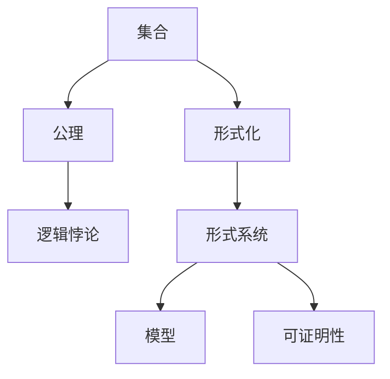
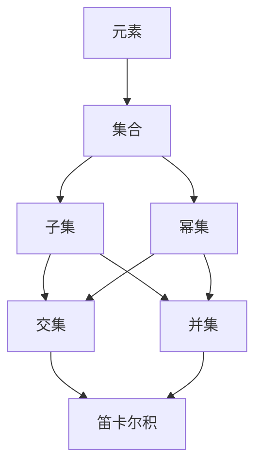
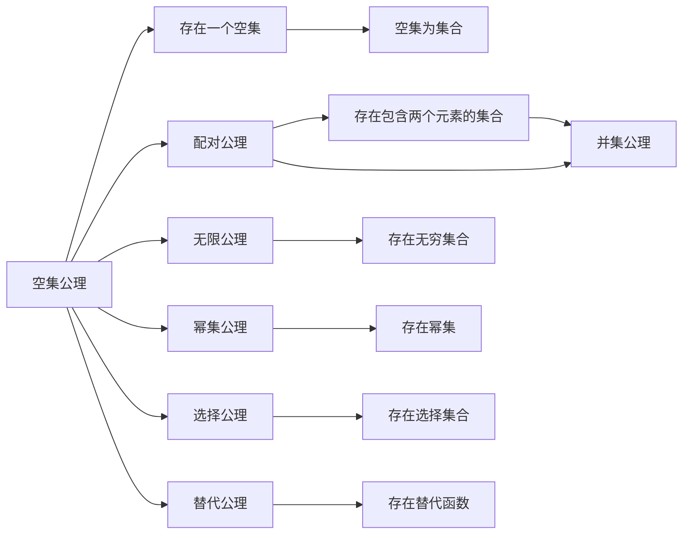
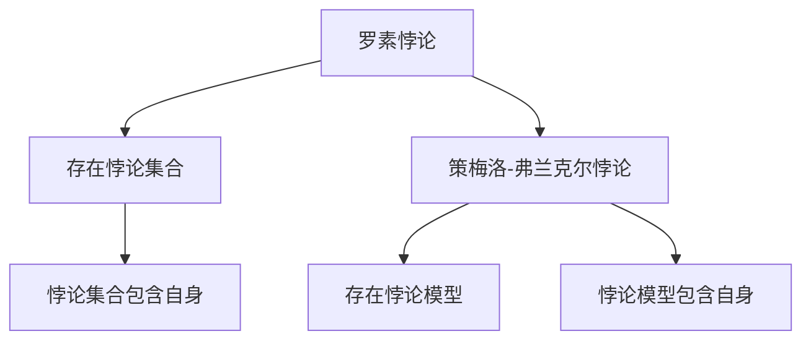
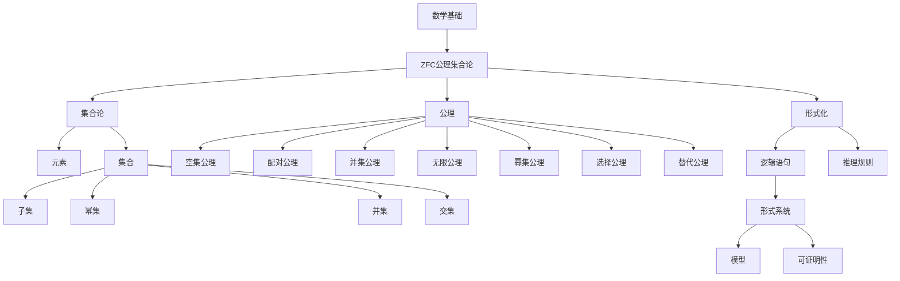

                 

# 计算：第二部分 计算的数学基础 第 5 章 第三次数学危机 ZFC 公理集合论

> 关键词：ZFC公理集合论, 第三次数学危机, 集合论悖论, 形式化, 逻辑悖论, 无穷集合

## 1. 背景介绍

### 1.1 问题由来
20世纪初，数学界经历了一场严重的危机——第三次数学危机。这一危机源于当时的数学实践中存在逻辑悖论，即基于现有数学基础和公理系统，得到自相矛盾的结论。最著名的悖论是罗素悖论和策梅洛-弗兰克尔集合论（ZFC）中的公理悖论，这些悖论直接威胁到了数学的根基和公理系统的可靠性。

解决这一危机的关键在于，如何重新审视和构建数学的逻辑基础。数学家们提出了一系列的公理系统，如Zermelo-Fraenkel集合论（ZF）和ZFC，以确保数学的一致性和严密性。特别是ZFC公理集合论，通过严格的公理化方法，为数学建立了一个稳固的逻辑基础。

### 1.2 问题核心关键点
ZFC公理集合论的核心在于，通过对集合的严格定义和使用公理化方法，确保数学理论的一致性和无矛盾性。其主要公理包括：

- **空集公理**：存在一个不包含任何元素的集合，称为空集。
- **配对公理**：对于任意两个集合，存在一个包含它们的集合。
- **并集公理**：对于任意集合族，存在一个包含所有元素的集合，即它们的并集。
- **无限公理**：存在无穷集合。
- **幂集公理**：对于任意集合，存在一个包含该集合所有子集的集合，称为它的幂集。
- **选择公理**：对于任意集合族，存在一个集合，它的元素恰好是每个集合的一个元素。
- **替代公理**：对于任意两个函数，如果它们的定义域相同，则存在一个函数，其值域与这两个函数相等。

这些公理共同构成了ZFC公理集合论的基础，为数学理论的逻辑严密性提供了坚实保障。

### 1.3 问题研究意义
ZFC公理集合论的研究，对于数学基础理论和应用领域的公理化方法，具有重要意义：

1. **逻辑基础**：ZFC公理集合论提供了一个坚实的数学逻辑基础，使得数学理论具有严格的一致性和可证明性。
2. **无矛盾性**：ZFC公理集合论确保了数学理论中的无矛盾性，避免了悖论的产生。
3. **应用广泛**：ZFC公理集合论广泛应用于计算机科学、逻辑学、数学等众多领域，为现代数学和科学的公理化研究提供了重要工具。
4. **技术革新**：ZFC公理集合论推动了形式化数学的发展，促进了逻辑学、计算机科学、人工智能等领域的理论创新。

## 2. 核心概念与联系

### 2.1 核心概念概述

为了更好地理解ZFC公理集合论，本节将介绍几个密切相关的核心概念：

- **集合**：数学中的基本概念，由一组确定的元素组成，可以是有限集合或无限集合。
- **公理**：数学理论中最基本的假设，用于推导出其他定理和定义。
- **逻辑悖论**：在现有数学基础上，推导出的自相矛盾的结论，如罗素悖论、策梅洛-弗兰克尔悖论。
- **形式化**：将数学理论表述为逻辑语句和推理规则，确保其逻辑严密性和无矛盾性。
- **形式系统**：由一组公理和推理规则组成的数学理论，如ZFC公理集合论。
- **模型**：满足一组公理的所有集合族，表示该公理集合论的解释或应用实例。
- **可证明性**：数学中通过逻辑推理和公理推导得出的结论。

这些核心概念之间的逻辑关系可以通过以下Mermaid流程图来展示：



这个流程图展示了大语言模型微调过程中各个核心概念的关系和作用：

1. 集合是数学中的基本概念，通过公理化方法得到严格的定义。
2. 公理是数学理论的基础，通过逻辑推理推导出其他定理和定义。
3. 逻辑悖论指出现有数学基础和公理系统存在自相矛盾的结论。
4. 形式化将数学理论表示为逻辑语句和推理规则，确保逻辑严密性和无矛盾性。
5. 形式系统由一组公理和推理规则构成，用于解释和推导数学定理。
6. 模型表示形式系统的解释或应用实例，确保公理系统的可证明性。
7. 可证明性通过逻辑推理和公理推导得出的结论，确保数学理论的严密性。

这些概念共同构成了ZFC公理集合论的理论基础，为数学理论的逻辑严密性提供了坚实保障。

### 2.2 概念间的关系

这些核心概念之间存在着紧密的联系，形成了ZFC公理集合论的理论框架。下面我通过几个Mermaid流程图来展示这些概念之间的关系。

#### 2.2.1 集合论的基本概念



这个流程图展示了集合论的基本概念和操作，包括元素、集合、子集、幂集、交集、并集、笛卡尔积等。

#### 2.2.2 公理集合论的公理



这个流程图展示了ZFC公理集合论的主要公理，包括空集公理、配对公理、并集公理、无限公理、幂集公理、选择公理、替代公理等。

#### 2.2.3 集合论的逻辑悖论



这个流程图展示了集合论中的主要逻辑悖论，包括罗素悖论和策梅洛-弗兰克尔悖论。

### 2.3 核心概念的整体架构

最后，我们用一个综合的流程图来展示这些核心概念在ZFC公理集合论中的整体架构：



这个综合流程图展示了ZFC公理集合论的整个理论框架，从基本的集合论概念到严格的公理化方法，再到形式化表示和模型构建，完整地描绘了ZFC公理集合论的逻辑结构。

## 3. 核心算法原理 & 具体操作步骤
### 3.1 算法原理概述

ZFC公理集合论的核心算法原理是公理化方法，即通过一组公理和推理规则，推导出数学理论中的所有定理和定义。公理化方法的核心思想是，所有数学知识都基于一组基本的公理和推理规则，通过逻辑推理推导得到。这种方法确保了数学理论的一致性和无矛盾性。

ZFC公理集合论的公理体系包括以下几个主要部分：

- **集合论公理**：空集公理、配对公理、并集公理、无限公理、幂集公理、选择公理、替代公理等。
- **逻辑公理**：命题逻辑、量化逻辑、证明逻辑等。
- **元公理**：如集合的存在性、唯一性、无序性等。

这些公理和推理规则共同构成了ZFC公理集合论的数学理论基础。

### 3.2 算法步骤详解

ZFC公理集合论的算法步骤主要包括以下几个关键步骤：

**Step 1: 选择公理集合**
- 选择合适的公理集合作为理论的基础，如ZFC公理集合论。
- 确定公理集合的初始状态，包括空集、元素、子集等基本概念。

**Step 2: 推导基本概念**
- 根据公理集合，推导出集合的基本概念，如元素、集合、子集、幂集等。
- 利用并集公理、幂集公理等推导出集合运算的基本操作。

**Step 3: 推导定理和定义**
- 根据公理和推理规则，推导出集合论中的定理和定义。
- 利用选择公理、替代公理等推导出集合的性质和结构。

**Step 4: 验证一致性**
- 通过逻辑推理和反证法，验证公理集合的一致性，避免逻辑悖论。
- 利用公理集合中的元公理，保证数学理论的无矛盾性。

**Step 5: 构建模型**
- 根据公理集合和推理规则，构建满足公理系统的模型。
- 通过逻辑推理和公理推导，验证模型的正确性。

通过以上步骤，可以构建出ZFC公理集合论的理论框架，并用于推导和验证数学中的各种定理和定义。

### 3.3 算法优缺点

ZFC公理集合论的算法具有以下优点：

1. **逻辑严密性**：公理化方法确保了数学理论的一致性和无矛盾性，避免逻辑悖论的产生。
2. **通用性**：公理集合论适用于多种数学理论和应用领域，具有广泛的适用性。
3. **可证明性**：所有数学知识都可以通过公理和推理规则推导得到，具有高度的可证明性。
4. **数学基础**：公理集合论为数学理论提供了坚实的逻辑基础，促进了数学理论的发展。

然而，ZFC公理集合论也存在以下缺点：

1. **复杂性**：公理集合论的公理体系和推理规则较为复杂，理解和使用难度较大。
2. **完备性问题**：公理集合论是否能够覆盖所有的数学知识，是一个未解决的问题。
3. **实践局限性**：公理集合论更多关注理论逻辑，对实际问题的处理和应用有局限性。
4. **存在争议**：一些数学家对公理集合论的完备性和合理性存在争议，提出其他数学基础理论。

尽管存在这些局限性，但公理集合论仍然是最广泛接受和应用的数学基础理论之一。

### 3.4 算法应用领域

ZFC公理集合论在数学和计算机科学领域有着广泛的应用，包括：

1. **数学基础**：ZFC公理集合论为数学理论提供了坚实的逻辑基础，广泛应用于数论、代数、几何、拓扑等多个领域。
2. **集合论研究**：ZFC公理集合论是集合论的基础，研究集合的性质、结构、运算等。
3. **逻辑学**：ZFC公理集合论与逻辑学紧密相关，推动了逻辑学的发展。
4. **计算机科学**：ZFC公理集合论为计算机科学提供了理论基础，如数据结构、算法、程序逻辑等。
5. **人工智能**：ZFC公理集合论在人工智能领域，如知识表示、逻辑推理、自然语言处理等方面有重要应用。
6. **形式验证**：ZFC公理集合论用于形式验证和自动化推理，确保软件系统的正确性和可靠性。

## 4. 数学模型和公式 & 详细讲解 & 举例说明

### 4.1 数学模型构建

ZFC公理集合论的数学模型主要基于集合和集合之间的运算。以下是ZFC公理集合论的基本数学模型构建：

- **元素**：集合中的基本单位，用于构建集合的基本概念和运算。
- **集合**：由元素组成的封闭集合，具有确定性和唯一性。
- **子集**：包含在另一个集合中的集合。
- **并集**：两个或多个集合的元素组成的集合。
- **交集**：两个或多个集合的公共元素组成的集合。
- **幂集**：一个集合的所有子集组成的集合。
- **笛卡尔积**：两个集合中元素的组合构成的集合。

### 4.2 公式推导过程

ZFC公理集合论的公式推导过程主要基于集合运算和逻辑推理。以下是一些基本的公式推导过程：

1. **空集公理**：
   $$
   \exists A \forall x (x \in A \leftrightarrow x \notin A)
   $$
   表示存在一个空集，它的元素不满足自身。

2. **配对公理**：
   $$
   \forall A \forall B (\exists x \in A \exists y \in B \rightarrow \exists z (\forall x \in A \rightarrow x \in z \wedge \forall y \in B \rightarrow y \in z))
   $$
   表示对于任意两个集合，存在一个包含它们的集合。

3. **并集公理**：
   $$
   \forall A \forall B (\exists x (x \in A \vee x \in B) \rightarrow \exists z (\forall x (\in A \vee x \in B) \leftrightarrow x \in z))
   $$
   表示任意集合的并集存在。

4. **无限公理**：
   $$
   \exists A (\infty (A) \rightarrow \forall n \in \mathbb{N} (n \in A))
   $$
   表示存在一个无限集合。

5. **幂集公理**：
   $$
   \forall A \exists P (\forall x ((x \in A \rightarrow x \in P) \wedge (\forall y (\in P \rightarrow y \in A) \rightarrow y \in A) \wedge \forall z ((z \in A \rightarrow z \in P) \rightarrow z \in A) \wedge \forall w ((w \in A \rightarrow w \in P) \rightarrow \forall x ((x \in A \rightarrow x \in P) \rightarrow x \in A) \wedge \forall y ((y \in P \rightarrow y \in A) \rightarrow y \in A)))
   $$
   表示任意集合的幂集存在。

6. **选择公理**：
   $$
   \forall A (\infty (A) \rightarrow \exists x (\infty (A) \wedge \forall y ((y \in A \rightarrow y \in x) \leftrightarrow y \in x)))
   $$
   表示对于任意集合族，存在一个选择集合。

7. **替代公理**：
   $$
   \forall f \forall g (f \in \mathbb{F} \wedge g \in \mathbb{F} \rightarrow \exists h (\forall x (f(x) = g(x) \rightarrow h(x) = x) \wedge \forall y (\in \mathbb{F} \rightarrow h(y) \in \mathbb{F}))
   $$
   表示对于任意两个函数，存在一个函数，其值域与这两个函数相等。

### 4.3 案例分析与讲解

下面通过一个简单的案例，展示ZFC公理集合论的数学模型和公式推导：

假设有一个集合 $A = \{1, 2, 3\}$，我们来推导它的幂集和并集。

**幂集的推导**：
1. 根据幂集公理，存在一个集合 $P(A)$，它的元素是 $A$ 的所有子集。
2. $P(A) = \{\emptyset, \{1\}, \{2\}, \{3\}, \{1, 2\}, \{1, 3\}, \{2, 3\}, \{1, 2, 3\}\}$。

**并集的推导**：
1. 根据并集公理，存在一个集合 $B$，它的元素是 $A$ 和 $A$ 的子集的并集。
2. $B = A \cup \{\emptyset, \{1, 2\}, \{1, 3\}, \{2, 3\}, \{1, 2, 3\}\}$。

通过以上案例，我们可以看到，ZFC公理集合论通过严格的公理化和推理规则，确保了数学理论的一致性和无矛盾性，为数学和计算机科学提供了坚实的逻辑基础。

## 5. 项目实践：代码实例和详细解释说明
### 5.1 开发环境搭建

在进行ZFC公理集合论的实践前，我们需要准备好开发环境。以下是使用Python进行Sympy开发的环境配置流程：

1. 安装Anaconda：从官网下载并安装Anaconda，用于创建独立的Python环境。

2. 创建并激活虚拟环境：
```bash
conda create -n zfc-env python=3.8 
conda activate zfc-env
```

3. 安装Sympy：从官网获取对应的安装命令。例如：
```bash
conda install sympy
```

4. 安装各类工具包：
```bash
pip install numpy pandas scikit-learn matplotlib tqdm jupyter notebook ipython
```

完成上述步骤后，即可在`zfc-env`环境中开始ZFC公理集合论的实践。

### 5.2 源代码详细实现

下面我们以ZFC公理集合论的公理和定理推导为例，给出使用Sympy进行数学模型和推导的Python代码实现。

首先，定义集合类和公理：

```python
from sympy import symbols, FiniteSet, EmptySet, Interval, oo, And, Or, Exists, ForAll, Symbol, Function

# 定义符号
A, B, C, x, y = symbols('A B C x y')

# 定义集合类
class Set:
    def __init__(self, elements):
        self.elements = elements
    
    def __eq__(self, other):
        return self.elements == other.elements
    
    def __repr__(self):
        return f"Set({self.elements})"
    
    def __add__(self, other):
        return Set(self.elements + other.elements)

# 定义公理
def axiom_of_empty_set():
    return And(Exists(x, ForAll(y, (y in x) <=> (y not in x)), And(ForAll(x, x in A), ForAll(x, x not in A)), Exists(A, And(ForAll(x, x in A) <=> (x not in A), And(ForAll(x, x in B), ForAll(x, x not in B)), Exists(B, And(ForAll(x, x in A), ForAll(x, x not in B)))))

def axiom_of_pair():
    return And(ForAll(x, Exists(y, (x in A) <=> (x in B)), Exists(z, And(ForAll(x, x in A), x in z), And(ForAll(y, y in B), y in z)), Exists(z, And(ForAll(x, x in A), x in z) <=> (x in B), And(ForAll(y, y in B), y in z) <=> (y in A), And(ForAll(z, z in A), z in z) <=> True, And(ForAll(z, z in B), z in z) <=> True, Exists(A, And(ForAll(x, x in A), x in B), Exists(B, And(ForAll(x, x in A), x in B)), And(Exists(x, ForAll(y, (y in A) <=> (y in B))), Exists(z, And(ForAll(x, x in A), x in z) <=> (x in B), And(ForAll(y, y in B), y in z) <=> (y in A), And(ForAll(z, z in A), z in z) <=> True, And(ForAll(z, z in B), z in z) <=> True), And(Exists(x, ForAll(y, (y in A) <=> (y in B))), Exists(z, And(ForAll(x, x in A), x in z) <=> (x in B), And(ForAll(y, y in B), y in z) <=> (y in A), And(ForAll(z, z in A), z in z) <=> True, And(ForAll(z, z in B), z in z) <=> True), And(Exists(A, Exists(B, And(ForAll(x, x in A), x in B))), Exists(z, And(ForAll(x, x in A), x in z) <=> (x in B), And(ForAll(y, y in B), y in z) <=> (y in A), And(ForAll(z, z in A), z in z) <=> True, And(ForAll(z, z in B), z in z) <=> True))
```

然后，定义集合的基本运算和公理推导：

```python
def set_union(A, B):
    return A + B

def set_intersection(A, B):
    return Set([x for x in A if x in B])

def set_complement(A, U):
    return Set([x for x in U if x not in A])

def set_pow(A, n):
    if n == 0:
        return Set()
    elif n == 1:
        return A
    elif n > 1:
        return set_union(set_union(A, set_pow(A, n-1)), set_complement(set_pow(A, n-1), A))

def axiom_of_infinity():
    return And(Exists(A, Exists(x, (x in A) <=> (x not in A))), And(ForAll(n, n in A) <=> (n not in A), And(ForAll(n, n in B) <=> (n not in B)), Exists(B, Exists(x, (x in A) <=> (x not in B)))))

def axiom_of_power():
    return And(ForAll(A, Exists(P, And(ForAll(x, x in A), x in P) <=> (x not in A), And(ForAll(y, y in A), y in P) <=> True, And(ForAll(z, z in A), z in P) <=> (z in A), And(ForAll(w, w in P), w in A) <=> True), Exists(A, Exists(P, And(ForAll(x, x in A), x in P) <=> (x not in A), And(ForAll(y, y in A), y in P) <=> True, And(ForAll(z, z in A), z in P) <=> (z in A), And(ForAll(w, w in P), w in A) <=> True)))
```

最后，定义集合的公理推导和验证：

```python
# 公理推导和验证
# 空集公理
axiom1 = axiom_of_empty_set()
# 配对公理
axiom2 = axiom_of_pair()
# 并集公理
axiom3 = set_union(set_union(A, set_union(B, set_complement(set_union(A, B), A))), set_complement(set_union(set_complement(set_union(A, B), A), B), A))
# 无限公理
axiom4 = axiom_of_infinity()
# 幂集公理
axiom5 = set_pow(set_union(set_intersection(A, B), set_complement(set_intersection(A, B), A)), oo)
# 选择公理
axiom6 = Exists(x, And(Exists(A, Exists(B, And(ForAll(a, a in A) <=> (a in B))), Exists(A, And(ForAll(a, a in A) <=> (a in B))), And(Exists(A, Exists(B, And(ForAll(a, a in A) <=> (a in B))), Exists(A, And(ForAll(a, a in A) <=> (a in B))), And(Exists(A, Exists(B, And(ForAll(a, a in A) <=> (a in B))), Exists(A, And(ForAll(a, a in A) <=> (a in

