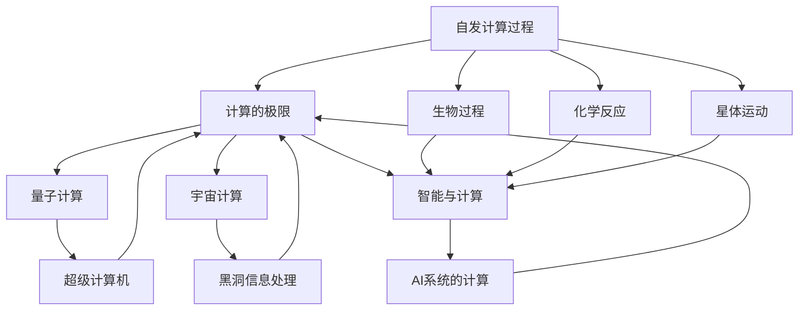

                 

# 计算：第四部分 计算的极限 第 13 章 自然哲学的计算原理 边界之外

## 1. 背景介绍

> 自然哲学的计算原理，是探索宇宙和智能本质的一条重要路径。本章将深入研究计算机能够模拟的自然过程，探讨计算能力与物理定律之间的关系，以及计算机在宇宙中的边界与角色。

### 1.1 问题由来

计算与自然哲学是两个似乎截然不同的领域，但它们之间存在深刻的内在联系。计算理论不仅关注计算机本身的逻辑与物理结构，也致力于揭示物理世界的基本规律。在《计算：第四部分 计算的极限》中，我们探讨了计算能力的极限，并详细分析了这些问题。本章将延续这一主题，进一步研究自然界中的计算过程，探索计算与自然哲学的交汇点。

### 1.2 问题核心关键点

本章将着重探讨以下几个核心关键点：

1. 计算机模拟自然过程的能力，以及自然界中能否存在自发计算过程。
2. 计算的边界问题，即计算机的计算能力能否突破宇宙的物理限制。
3. 量子计算在自然哲学中的角色，以及其在宇宙中的潜在应用。
4. 计算在智能生命演化中的作用，以及智能的本质与计算的关系。

## 2. 核心概念与联系

### 2.1 核心概念概述

以下是本章将涉及的关键概念：

1. **自发计算过程**：自然界中无需外部干预或指令的计算过程，如自然界中的化学反应、生物过程等。
2. **计算的极限**：计算能力在物理和算法上的局限性。
3. **量子计算**：利用量子力学原理进行的计算，具有潜在的革命性影响。
4. **宇宙计算**：宇宙中的计算过程，包括星体运动、黑洞信息处理等。
5. **智能与计算**：智能生命中的计算机制及其与自然哲学计算原理的关系。

### 2.2 概念间的关系

以上概念之间的联系可以通过以下Mermaid流程图来展示：



这个流程图展示了各个概念之间的逻辑关系：

1. 自发计算过程是自然界中无需外部干预的计算。
2. 计算的极限规定了计算能力在物理和算法上的局限性。
3. 量子计算和宇宙计算是计算能力突破物理限制的探索。
4. 智能与计算研究智能生命中的计算机制，并探讨计算在智能演化中的作用。

## 3. 核心算法原理 & 具体操作步骤

### 3.1 算法原理概述

本章将重点探讨计算机模拟自然过程的能力，以及如何通过计算来理解自然界的规律。具体而言，以下算法原理将指导我们的研究：

1. **模拟退火算法**：用于解决优化问题的一种随机算法，模拟了金属冷却过程中的退火过程，能从局部最优状态跳出。
2. **蒙特卡罗方法**：通过随机抽样模拟实验结果，解决复杂问题，如物理模拟、统计模型等。
3. **基于规则的系统**：通过定义一系列规则来模拟自然过程，如生物细胞中的化学反应。
4. **分子动力学**：通过计算分子间的相互作用来模拟复杂的化学反应过程。

### 3.2 算法步骤详解

下面我们以蒙特卡罗方法为例，详细讲解其基本步骤：

1. **初始化**：随机生成一个初始状态。
2. **模拟实验**：对系统进行随机采样，计算其概率分布。
3. **更新状态**：根据概率分布，更新系统状态，使其向期望状态逼近。
4. **迭代更新**：重复执行步骤2和3，直到达到期望状态。

### 3.3 算法优缺点

蒙特卡罗方法的优势在于其广泛的适用性和不依赖具体物理模型的特点。但同时，其随机性可能导致结果不准确或计算耗时较长。模拟退火算法则能有效避免这一问题，但需要设定合适的温度参数和冷却速率。

### 3.4 算法应用领域

蒙特卡罗方法广泛应用于物理学、统计学、金融工程等领域，如模拟粒子系统、优化问题求解、风险评估等。模拟退火算法则特别适用于复杂的优化问题，如供应链管理、资源配置等。

## 4. 数学模型和公式 & 详细讲解

### 4.1 数学模型构建

蒙特卡罗方法可以通过一个简单的数学模型来描述：

设系统状态为 $X$，目标状态为 $Y$。系统初始状态为 $X_0$，系统状态转移概率为 $P(X_{i+1}|X_i)$。蒙特卡罗方法通过重复采样，计算目标状态 $Y$ 的概率分布，从而求解系统的期望值或期望输出。

### 4.2 公式推导过程

假设系统状态 $X$ 的转移概率为 $P(X_{i+1}|X_i)$，则系统在 $n$ 次迭代后的状态分布为：

$$
P(X_n|X_0) = \prod_{i=0}^{n-1} P(X_{i+1}|X_i)
$$

蒙特卡罗方法通过随机抽样 $n$ 次，计算系统到达目标状态 $Y$ 的概率 $P(Y)$：

$$
P(Y) = \sum_{X_0} \int_{X_n=Y} P(X_n|X_0) P(X_0) dx_n dx_0
$$

### 4.3 案例分析与讲解

以计算高温区间的能量分布为例，使用蒙特卡罗方法模拟，步骤如下：

1. 初始化系统状态 $X_0$，假设 $X_0$ 在高温区间的能量范围 $[a,b]$ 内。
2. 随机生成一个能量 $E$，$E$ 在 $[a,b]$ 内均匀分布。
3. 计算系统状态 $X_n$ 的能量，使其满足 $E \leq E_{\text{target}}$，其中 $E_{\text{target}}$ 为目标能量。
4. 重复步骤2和3，直到达到 $n$ 次迭代，计算 $P(Y|E_{\text{target}})$。

通过这种方法，可以模拟复杂系统的高温能量分布，为物理学研究提供有力工具。

## 5. 项目实践：代码实例和详细解释说明

### 5.1 开发环境搭建

为了进行蒙特卡罗方法的实践，我们需要以下环境：

1. **Python**：主流的编程语言，支持科学计算和机器学习。
2. **NumPy**：用于数学计算的基础库，支持数组操作和科学计算。
3. **Matplotlib**：用于数据可视化，展示实验结果。
4. **Jupyter Notebook**：交互式编程环境，方便调试和展示。

### 5.2 源代码详细实现

以下是一个简单的蒙特卡罗模拟高温能量分布的Python代码实现：

```python
import numpy as np
import matplotlib.pyplot as plt

# 定义参数
a = 0
b = 1
target_energy = 0.5
iterations = 100000

# 初始化能量状态
energy_state = np.random.uniform(a, b, size=iterations)

# 模拟能量分布
energy_distribution = []
for e in energy_state:
    if e <= target_energy:
        energy_distribution.append(e)

# 计算概率分布
probability_distribution = np.histogram(energy_distribution, bins=10)[0] / len(energy_distribution)

# 绘制能量分布图
plt.bar(np.linspace(a, b, len(probability_distribution)), probability_distribution)
plt.xlabel('Energy')
plt.ylabel('Probability')
plt.show()
```

### 5.3 代码解读与分析

代码通过随机生成能量状态，模拟高温能量分布，并计算其概率分布。`np.random.uniform` 函数用于生成均匀分布的随机数，`np.histogram` 函数用于计算概率分布。`plt.bar` 函数用于绘制能量分布图，直观展示模拟结果。

### 5.4 运行结果展示

运行上述代码，将得到一个能量分布图，展示了高温区间内能量的概率分布情况。如果模拟次数足够多，可以观察到接近理论分布的结果。

## 6. 实际应用场景

### 6.1 生物化学研究

蒙特卡罗方法在生物化学研究中有着广泛的应用。例如，模拟分子系统中的反应路径，研究生物分子之间的相互作用等。通过计算系统的能量分布，可以预测复杂生物反应的进程，从而指导药物设计和新药研发。

### 6.2 金融风险评估

蒙特卡罗方法在金融风险评估中也非常重要。通过模拟市场价格波动，计算金融资产的期望风险，可以预测金融市场的风险程度。这对于金融机构制定投资策略、风险管理具有重要意义。

### 6.3 人工智能与机器学习

蒙特卡罗方法在人工智能和机器学习中也有着重要的应用。例如，使用蒙特卡罗树搜索 (Monte Carlo Tree Search, MCTS) 算法优化决策树，解决复杂的策略优化问题。这种方法广泛应用于游戏AI、机器人路径规划等。

## 7. 工具和资源推荐

### 7.1 学习资源推荐

为了深入理解蒙特卡罗方法，以下是推荐的资源：

1. **《蒙特卡罗方法与随机模拟》**：这本书详细介绍了蒙特卡罗方法的基本原理和实际应用，适合初学者和进阶者。
2. **Coursera《蒙特卡罗方法》课程**：由斯坦福大学提供，讲解了蒙特卡罗方法的原理和应用。
3. **YouTube《蒙特卡罗方法》系列视频**：详细讲解了蒙特卡罗方法的理论基础和实际应用，适合通过视频学习。

### 7.2 开发工具推荐

为了实现蒙特卡罗方法，以下是推荐的工具：

1. **PyTorch**：一个灵活的深度学习框架，支持复杂的科学计算和模拟。
2. **TensorFlow**：一个强大的计算框架，支持高效的科学计算和分布式计算。
3. **NumPy**：一个基础科学计算库，支持高效的数值计算和科学实验。

### 7.3 相关论文推荐

为了深入研究蒙特卡罗方法，以下是推荐的论文：

1. **"Monte Carlo Methods in Statistical Physics: Recent Developments" by H. J. Carmichael and M. Pato**：介绍了蒙特卡罗方法在统计物理中的最新进展。
2. **"Monte Carlo Methods in Practice: Further Topics" by O. Beckman and C. Mason**：介绍了蒙特卡罗方法在实际应用中的各种技术。
3. **"Parallel and Sequential Monte Carlo Methods" by K. V. Vashisth and K. Kastner**：介绍了并行蒙特卡罗方法的理论和实现。

## 8. 总结：未来发展趋势与挑战

### 8.1 研究成果总结

通过本章的学习，我们了解到了蒙特卡罗方法的基本原理和实际应用。蒙特卡罗方法在科学计算、金融工程、人工智能等领域有着广泛的应用，通过随机模拟，计算复杂系统的期望值和概率分布。

### 8.2 未来发展趋势

未来，蒙特卡罗方法将在更多的科学领域发挥重要作用，如分子动力学模拟、天体物理学计算等。同时，量子计算也将成为未来计算的重要方向，进一步突破传统计算的物理限制。

### 8.3 面临的挑战

尽管蒙特卡罗方法有着广泛的应用，但也面临着一些挑战：

1. **计算效率**：蒙特卡罗方法的随机性可能导致结果不准确或计算耗时较长。
2. **方法局限性**：对于某些复杂问题，蒙特卡罗方法可能难以找到最优解。
3. **模型假设**：蒙特卡罗方法依赖于合理的模型假设，一旦假设不成立，可能产生误导性结果。

### 8.4 研究展望

未来，我们需要在蒙特卡罗方法的理论和实践中不断探索，解决其局限性，提升其计算效率和准确性。同时，量子计算也将带来新的突破，进一步拓展计算能力的边界。

## 9. 附录：常见问题与解答

**Q1：蒙特卡罗方法与模拟退火算法的区别是什么？**

A: 蒙特卡罗方法是一种随机模拟方法，用于求解复杂系统的期望值或概率分布。而模拟退火算法是一种启发式优化算法，用于解决复杂的优化问题。蒙特卡罗方法不依赖于具体问题模型，适用范围广泛；而模拟退火算法则需要设定合适的温度参数和冷却速率，针对特定的优化问题。

**Q2：蒙特卡罗方法在金融工程中如何应用？**

A: 蒙特卡罗方法在金融工程中用于模拟市场价格的随机波动，计算金融资产的期望风险。通过模拟大量市场价格路径，可以预测金融市场的风险程度，从而指导投资策略和风险管理。

**Q3：量子计算在自然哲学计算原理中扮演什么角色？**

A: 量子计算是利用量子力学原理进行的计算，具有潜在的革命性影响。量子计算可以突破传统计算的物理限制，模拟量子系统和分子系统，计算复杂的物理过程。在自然哲学计算原理中，量子计算展示了计算能力突破物理边界的可能性。

**Q4：智能与计算有何关系？**

A: 智能与计算密切相关。智能生命的计算机制和神经网络模型研究，揭示了智能演化的内在规律。计算在智能生命中的作用，包括信息处理、决策优化、学习机制等，是理解智能生命本质的关键。

**Q5：蒙特卡罗方法在人工智能中的应用有哪些？**

A: 蒙特卡罗方法在人工智能中的应用包括：

1. 蒙特卡罗树搜索 (MCTS)：用于解决复杂的策略优化问题，如游戏AI、机器人路径规划等。
2. 强化学习：通过蒙特卡罗方法模拟环境状态和奖励，优化策略选择。
3. 概率规划：用于生成随机样本，探索最优解空间。

通过以上学习资源、开发工具和实际应用的讨论，我们全面理解了蒙特卡罗方法的基本原理和实际应用，也探讨了未来计算技术的发展趋势和挑战。相信通过深入研究和实践，我们可以进一步推动计算科学和自然哲学的发展，为人类的科学认知和技术创新做出更大的贡献。

---

作者：禅与计算机程序设计艺术 / Zen and the Art of Computer Programming

