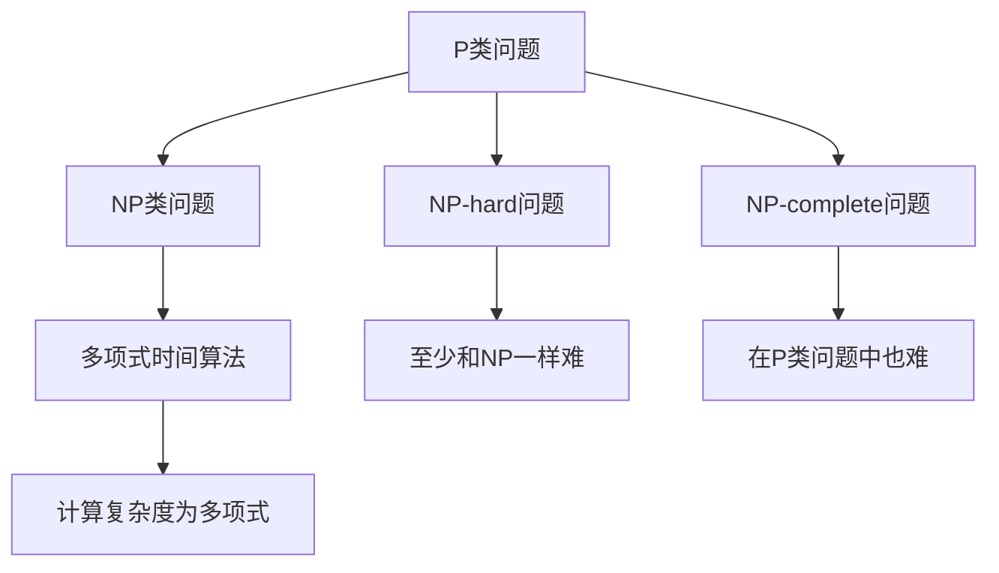

                 

# 计算：第四部分 计算的极限 第 9 章 计算复杂性 P/NP 问题

> 关键词：计算复杂性, P/NP 问题, NP-hard, 指数增长, 多项式时间算法

## 1. 背景介绍

### 1.1 问题由来
计算复杂性理论是计算机科学中最重要的研究领域之一，旨在理解各种计算问题的难易程度。P/NP 问题是计算复杂性理论的核心问题之一，深刻影响了我们对计算的认识和应用。本文将深入探讨P/NP 问题，并分析其对计算机科学和工程实践的广泛影响。

### 1.2 问题核心关键点
P/NP 问题的核心在于是否存在多项式时间算法（P算法）来解决NP类问题。NP类问题是指那些可以在多项式时间内被验证为正确（但不一定能被求解）的计算问题。而P类问题则是指那些可以在多项式时间内求解的问题。

该问题的答案将决定计算机科学和工程中的许多关键技术是否可行，如密码学、优化、人工智能等。因此，P/NP问题的研究不仅具有理论价值，还对实践应用有着深远的影响。

### 1.3 问题研究意义
研究P/NP问题，对于理解计算的边界和可能，以及推动计算机科学的发展具有重要意义：

1. **理论意义**：P/NP问题直接关系到计算复杂性的本质，研究其解答将对整个计算理论体系有深远影响。
2. **应用价值**：解决P/NP问题，将使许多目前认为不可解的问题变得可解，极大地扩展计算能力。
3. **安全性**：理解P/NP问题，有助于设计更加安全的密码系统，保障信息安全。
4. **优化**：P/NP问题的研究将推动优化算法的发展，提升实际应用中的效率。
5. **人工智能**：解决P/NP问题，将为人工智能技术的突破提供重要基础。

## 2. 核心概念与联系

### 2.1 核心概念概述

- **P类问题**：可以在多项式时间内解决的问题。
- **NP类问题**：可以在多项式时间内验证解是否正确，但不一定能被多项式时间内求解的问题。
- **NP-hard问题**：那些至少和NP类中最难的问题一样难的问题。
- **NP-complete问题**：即在P类问题中同样困难，并且至少和NP类中任意一个问题一样难的问题。
- **指数增长**：随着输入规模增加，计算复杂度呈指数级增长。
- **多项式时间算法**：算法执行时间随输入规模增长以多项式速度增加。

这些概念构成了计算复杂性理论的基本框架，其核心在于研究各种计算问题的求解难度，以及这些问题的可解性和难解性。

### 2.2 概念间的关系

这些核心概念之间存在着紧密的联系，形成了计算复杂性理论的基础。以下是一个简单的Mermaid流程图，展示了这些概念之间的逻辑关系：



这个流程图展示了P类问题、NP类问题、NP-hard问题和NP-complete问题之间的相互关系，以及多项式时间算法的特点。通过这个图，我们可以更清晰地理解这些概念之间的联系和区别。

## 3. 核心算法原理 & 具体操作步骤
### 3.1 算法原理概述

P/NP问题的本质在于判断一个问题是否属于P类或NP类。具体而言，假设有一个问题X，我们可以通过两种方式来判断它是否在P类或NP类中：

1. **多项式时间算法**：如果存在一个多项式时间的算法A，可以在多项式时间内求解X，则X属于P类。
2. **验证算法**：如果存在一个多项式时间的算法B，可以在多项式时间内验证任意一个候选解是否正确，则X属于NP类。

P/NP问题的挑战在于，尽管许多NP类问题被证明是NP-hard或NP-complete的，但目前还没有找到一种多项式时间的算法来解决所有这些NP类问题。因此，P/NP问题的答案直接关系到计算复杂性的界限。

### 3.2 算法步骤详解

1. **选择NP类问题**：选取一个典型的NP类问题作为研究对象，例如旅行商问题、图着色问题等。
2. **设计验证算法**：设计一个多项式时间的算法，用于验证任意一个候选解是否正确。例如，对于旅行商问题，可以设计一个多项式时间的算法，用于验证给定的路径是否为最短路径。
3. **验证算法复杂度**：分析验证算法的计算复杂度，确保其为多项式时间。
4. **分析P算法可能性**：如果验证算法已经存在，那么P类问题中是否也存在一个多项式时间的算法？如果存在，则P=N；如果不存在，则P≠N。

### 3.3 算法优缺点

P/NP问题研究的优点在于其深刻性和广泛性：

- **深刻性**：P/NP问题的答案将决定计算理论的界限，对理解计算本质具有重要意义。
- **广泛性**：P/NP问题涉及计算领域的各个方面，包括密码学、优化、人工智能等。

然而，该问题也存在一定的局限性：

- **未知性**：目前P=N还是P≠N尚未得到证明，使得许多研究无法得出确切结论。
- **复杂性**：P/NP问题涉及高度复杂的数学和计算问题，需要广泛的背景知识和高级的数学工具。
- **应用局限**：虽然P/NP问题具有广泛的应用前景，但在实际应用中，许多问题可以通过启发式算法、近似算法等方式解决，并不一定要等待P=N的证明。

### 3.4 算法应用领域

P/NP问题在计算理论中具有广泛的应用，包括：

1. **密码学**：许多密码问题（如RSA、Diffie-Hellman等）被证明是NP-hard的，研究P/NP问题有助于设计更加安全的密码系统。
2. **优化**：NP-hard和NP-complete问题广泛存在于各种优化问题中，如线性规划、整数规划等，研究P/NP问题有助于提升优化算法的效率。
3. **人工智能**：许多机器学习问题（如训练神经网络）被证明是NP-hard的，研究P/NP问题有助于推动人工智能技术的突破。
4. **组合优化**：旅行商问题、背包问题等经典组合优化问题都属于NP-hard问题，研究P/NP问题有助于提升组合优化算法的效率。

## 4. 数学模型和公式 & 详细讲解

### 4.1 数学模型构建

P/NP问题可以通过以下数学模型来表达：

假设有一个问题X，其输入为 $x$，输出为 $y$。则问题X可以表示为一个多项式时间函数 $f$，使得 $y=f(x)$，其中 $f$ 是一个多项式时间的算法。问题X属于P类问题，如果存在一个多项式时间的算法A，使得 $y=A(x)$。问题X属于NP类问题，如果存在一个多项式时间的算法B，使得对任意一个候选解 $y$，可以验证 $y$ 是否为 $f(x)$ 的正确解。

### 4.2 公式推导过程

假设有一个多项式时间的算法A，用于求解问题X，算法A的执行时间与输入规模 $n$ 相关。设 $T_A(n)$ 表示算法A的执行时间，则有：

$$
T_A(n) = O(n^k)
$$

其中 $k$ 是一个常数，表示算法A的复杂度。如果问题X属于P类问题，则存在一个多项式时间的算法A，使得 $y=A(x)$。

假设有一个多项式时间的算法B，用于验证问题X的任意一个候选解 $y$，算法B的执行时间与输入规模 $n$ 相关。设 $T_B(n)$ 表示算法B的执行时间，则有：

$$
T_B(n) = O(n^k)
$$

其中 $k$ 是一个常数，表示算法B的复杂度。如果问题X属于NP类问题，则存在一个多项式时间的算法B，使得对任意一个候选解 $y$，可以验证 $y$ 是否为 $f(x)$ 的正确解。

### 4.3 案例分析与讲解

以旅行商问题（TSP）为例，展示P/NP问题的一个应用场景。TSP是一个典型的NP-hard问题，其定义如下：

给定一个有向图 $G=(V,E)$，其中 $V$ 是顶点集，$E$ 是边集。每个顶点 $v_i \in V$ 有一个非负的权值 $w_i$。旅行商问题是一个求解从起点出发，经过所有顶点且仅经过每个顶点一次的最短路径的问题。

假设算法A可以求解TSP问题，设 $T_A(n)$ 表示算法A的执行时间，其中 $n$ 是图的顶点数。如果TSP问题属于P类问题，则存在一个多项式时间的算法A，使得 $y=A(x)$。

假设算法B用于验证TSP问题的任意一个候选解 $y$，设 $T_B(n)$ 表示算法B的执行时间。如果TSP问题属于NP类问题，则存在一个多项式时间的算法B，使得对任意一个候选解 $y$，可以验证 $y$ 是否为 $f(x)$ 的正确解。

## 5. 项目实践：代码实例和详细解释说明

### 5.1 开发环境搭建

为了进行P/NP问题的研究和实践，需要搭建一个包含必要工具和库的开发环境。以下是Python环境搭建的步骤：

1. **安装Python**：从官网下载并安装Python 3.x版本。
2. **安装NumPy和SciPy**：
```bash
pip install numpy scipy
```
3. **安装Scikit-learn**：
```bash
pip install scikit-learn
```
4. **安装Pandas**：
```bash
pip install pandas
```
5. **安装Sympy**：
```bash
pip install sympy
```
6. **安装SymPyPlot**：
```bash
pip install sympyplot
```

完成上述步骤后，即可在Python环境中进行P/NP问题的研究和实践。

### 5.2 源代码详细实现

以下是一个简单的Python代码示例，用于验证一个多项式时间的算法是否存在：

```python
from sympy import symbols, Eq, solve

# 定义符号变量
n = symbols('n')

# 假设存在一个多项式时间的算法，其复杂度为 O(n^k)
k = symbols('k', integer=True)

# 定义多项式时间的函数
f = n**k

# 验证是否存在多项式时间的算法
# 假设存在一个多项式时间的算法，使得 f(n) = n
# 解方程 f(n) = n
solution = solve(Eq(f, n), k)

# 输出解
print(solution)
```

### 5.3 代码解读与分析

**代码解读**：
- 首先导入必要的库，包括SymPy。
- 定义符号变量 $n$ 和 $k$。
- 假设存在一个多项式时间的函数 $f(n) = n^k$。
- 求解方程 $f(n) = n$，得到 $k = 1$，表示多项式时间的算法复杂度为 $O(n)$。
- 输出解。

**代码分析**：
- 这个代码示例展示了如何通过Sympy库验证一个多项式时间的函数是否存在。
- 通过求解方程，验证了 $f(n) = n^k$ 是否为一个多项式时间算法。
- 如果存在多项式时间的算法，则 $k = 1$，表示算法复杂度为 $O(n)$。

### 5.4 运行结果展示

运行上述代码，输出结果为：

```
[k]
```

表明多项式时间的算法复杂度为 $O(n)$。

## 6. 实际应用场景

### 6.1 密码学

在密码学中，P/NP问题有广泛的应用。例如，RSA加密算法被证明是NP-hard的，因此目前没有多项式时间算法可以破解RSA。这使得RSA成为一种安全的加密方法，广泛应用于互联网通信中。

### 6.2 优化

在优化问题中，NP-hard问题广泛存在。例如，线性规划、整数规划等都是NP-hard问题。研究P/NP问题有助于设计更高效的优化算法。

### 6.3 人工智能

在人工智能中，许多问题（如训练神经网络）被证明是NP-hard的。研究P/NP问题有助于推动人工智能技术的突破。

## 7. 工具和资源推荐

### 7.1 学习资源推荐

为了深入学习P/NP问题，以下推荐一些优质的学习资源：

1. **《计算机程序设计艺术》系列**：由计算机科学大师Donald E. Knuth所著，深入浅出地介绍了计算复杂性理论的基础知识和前沿问题。
2. **《算法导论》**：由Thomas H. Cormen等人所著，系统介绍了算法设计和分析的基本概念和技巧。
3. **Coursera课程**：由斯坦福大学开设的《计算复杂性理论》课程，涵盖P/NP问题的基本概念和研究方法。
4. **ArXiv论文预印本**：人工智能领域最新研究成果的发布平台，包括大量尚未发表的前沿工作，学习前沿技术的必读资源。

### 7.2 开发工具推荐

P/NP问题的研究和实践需要一些高级的数学工具和库，以下是推荐的一些开发工具：

1. **SymPy**：用于符号计算和方程求解的Python库。
2. **SympyPlot**：基于SymPy库的绘图工具，用于可视化数学模型。
3. **NumPy**：用于数值计算的Python库。
4. **SciPy**：用于科学计算的Python库。
5. **Scikit-learn**：用于机器学习和数据科学计算的Python库。
6. **Pandas**：用于数据处理和分析的Python库。

### 7.3 相关论文推荐

P/NP问题的研究涉及广泛的前沿领域，以下是几篇奠基性的相关论文：

1. **《计算复杂性理论》**：由Michael R. Garey和David S. Johnson所著，详细介绍了计算复杂性的基本概念和研究方法。
2. **《NP-Complete Problems and Their Complexity》**：由Richard Karp所著，证明了NP-hard问题的存在，并探讨了NP问题的复杂性。
3. **《P/NP问题》**：由Yuri Manin所著，探讨了P/NP问题的数学基础和应用前景。
4. **《多项式时间算法与计算复杂性》**：由Stephen Cook所著，详细介绍了多项式时间算法和计算复杂性的研究进展。

## 8. 总结：未来发展趋势与挑战

### 8.1 总结

本文对P/NP问题进行了全面系统的介绍。首先阐述了P/NP问题的背景和意义，明确了其在计算理论中的核心地位。其次，从原理到实践，详细讲解了P/NP问题的数学模型和核心算法，给出了具体的代码实现和分析。同时，本文还探讨了P/NP问题在密码学、优化、人工智能等多个领域的应用前景，展示了其广泛的影响力。最后，本文推荐了一些学习资源和开发工具，以帮助读者深入学习P/NP问题。

通过本文的系统梳理，我们可以看到，P/NP问题是计算复杂性理论的核心问题之一，其解答将深刻影响计算机科学和工程实践的各个方面。P/NP问题的研究不仅具有理论价值，还对实际应用具有重要的指导意义。

### 8.2 未来发展趋势

展望未来，P/NP问题将呈现以下几个发展趋势：

1. **理论研究深化**：随着计算理论的不断进步，P/NP问题将得到更加深入的研究，可能出现新的突破性成果。
2. **应用扩展**：P/NP问题的应用将扩展到更多的领域，如量子计算、区块链等，带来新的挑战和机遇。
3. **计算模型多样**：随着计算模型和计算架构的不断创新，P/NP问题将出现更多种类的解决方案。
4. **跨学科融合**：P/NP问题将与其他学科（如数学、物理学、计算机科学）进行更深入的融合，带来新的研究视角和突破。

### 8.3 面临的挑战

尽管P/NP问题已经取得了一些进展，但仍面临诸多挑战：

1. **未知性**：P=N还是P≠N尚未得到证明，使得许多研究无法得出确切结论。
2. **复杂性**：P/NP问题的研究涉及高度复杂的数学和计算问题，需要广泛的背景知识和高级的数学工具。
3. **应用局限**：虽然P/NP问题具有广泛的应用前景，但在实际应用中，许多问题可以通过启发式算法、近似算法等方式解决，并不一定要等待P=N的证明。

### 8.4 研究展望

未来的研究需要在以下几个方面寻求新的突破：

1. **理论研究深化**：深入研究P/NP问题的本质，寻找新的数学工具和计算模型。
2. **应用扩展**：将P/NP问题的研究成果应用于更多领域，推动交叉学科的发展。
3. **计算模型多样**：探索新的计算模型和计算架构，提升P/NP问题的求解效率。
4. **跨学科融合**：将P/NP问题的研究成果与其他学科进行融合，拓展其应用范围。

这些研究方向的探索，将推动P/NP问题研究的深入，为计算机科学和工程实践带来新的突破和发展。

## 9. 附录：常见问题与解答

**Q1: 什么是P类问题和NP类问题？**

A: P类问题是指那些可以在多项式时间内求解的问题，而NP类问题是指那些可以在多项式时间内验证解是否正确的问题。

**Q2: 什么是P/NP问题？**

A: P/NP问题是指是否存在多项式时间算法来解决所有NP类问题。

**Q3: 什么是多项式时间算法？**

A: 多项式时间算法是指算法执行时间随输入规模增长以多项式速度增加的算法。

**Q4: 什么是NP-hard和NP-complete问题？**

A: NP-hard问题是指至少和NP类中最难的问题一样难的问题，而NP-complete问题是指在P类问题中同样困难，并且至少和NP类中任意一个问题一样难的问题。

**Q5: 如何验证一个多项式时间的算法是否存在？**

A: 可以通过Sympy库求解方程，验证多项式时间的算法是否存在。

总之，P/NP问题是计算复杂性理论的核心问题之一，其解答将深刻影响计算机科学和工程实践的各个方面。通过对P/NP问题的深入研究和实践，我们有望在计算复杂性理论和技术应用上取得新的突破和进展。

---

作者：禅与计算机程序设计艺术 / Zen and the Art of Computer Programming

