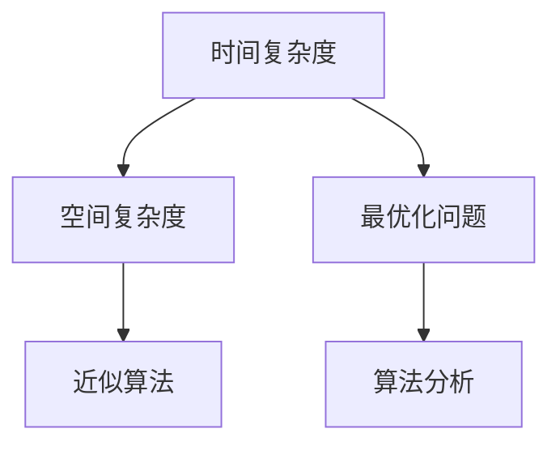

                 

# 计算：第四部分 计算的极限 第 9 章 计算复杂性 站在两个世界之间

> 关键词：计算复杂性,算法分析,递归,堆栈,时间复杂度,空间复杂度,最优化问题,近似算法

## 1. 背景介绍

### 1.1 问题由来

计算复杂性理论是计算机科学中一个极为重要且具有深远影响的领域。它不仅涉及算法效率的衡量和优化，也深刻关联着现代计算模型的基本概念和原理。

计算机算法是计算机科学中的核心问题。在信息技术爆炸式发展的背景下，计算复杂性理论成为决定算法效率与性能的关键。在工程实践中，诸如数据压缩、图像处理、自然语言处理、人工智能等诸多领域，都离不开计算复杂性理论的支撑。

计算复杂性理论的基础问题包括：

- 确定算法的时间复杂度和空间复杂度
- 分析算法的优劣
- 在时间和空间上优化算法

本章节将从算法的时间复杂度、空间复杂度和优化问题等方面，探讨计算复杂性理论的核心概念与基本原理。

### 1.2 问题核心关键点

计算复杂性理论的核心关键点包括：

- 时间复杂度（Time Complexity）
- 空间复杂度（Space Complexity）
- 最优化问题（Optimization Problem）
- 近似算法（Approximation Algorithm）

本章节将详细讨论这些关键概念，并通过实际案例来阐述它们的应用与重要性。

## 2. 核心概念与联系

### 2.1 核心概念概述

算法分析是计算复杂性理论的基础。通过算法分析，我们能确定算法的效率和性能，从而进行算法优化，以达到时间和空间的平衡。

- **时间复杂度**：指算法运行时间随问题规模增长的趋势。常用的大O表示法用于描述时间复杂度。

- **空间复杂度**：指算法运行过程中所需空间随问题规模增长的趋势。

- **最优化问题**：求解最优解或最优策略的数学问题。

- **近似算法**：在一定范围内找到近似最优解，用于解决难解的最优化问题。

算法分析的目的是比较不同算法效率，选择最优算法。在这一过程中，时间复杂度和空间复杂度是评估算法性能的主要指标。

### 2.2 概念间的关系

时间复杂度和空间复杂度反映了算法的效率。最优化问题和近似算法则探讨了如何找到问题的最优解。这些概念相互关联，共同构成了计算复杂性理论的基石。

通过时间复杂度和空间复杂度的分析，我们能够比较不同算法的效率，从而选择最优算法。在难以找到精确最优解的情况下，近似算法则通过保证近似解的可行性和准确性，在效率和准确性之间取得平衡。



这个流程图展示了时间复杂度、空间复杂度、最优化问题和近似算法之间相互关联的关系。

## 3. 核心算法原理 & 具体操作步骤

### 3.1 算法原理概述

时间复杂度和空间复杂度是衡量算法效率的两大指标。时间复杂度描述了算法在运行过程中所需时间的增长趋势，空间复杂度则描述了算法在运行过程中所需空间的增长趋势。

- **时间复杂度**：通常使用大O表示法来描述。例如，O(n)表示算法的时间复杂度随问题规模n线性增长。

- **空间复杂度**：也常用大O表示法来描述。例如，O(n)表示算法的空间复杂度随问题规模n线性增长。

在进行算法分析时，我们通常使用渐进分析（Asymptotic Analysis）来估计算法的时间和空间复杂度。

### 3.2 算法步骤详解

递归算法是一种重要的算法设计方式，常被用于求解复杂问题。下面以递归算法为例，详细讲解其基本步骤。

**步骤一：确定递归边界条件**

递归算法通常需要设定边界条件，使得递归调用最终会停止。例如，在计算斐波那契数列时，边界条件为当n等于0或1时，返回相应的数值。

**步骤二：分解问题**

递归算法将大问题分解为若干个小问题。例如，计算斐波那契数列时，可以将其分解为计算前两个数的和。

**步骤三：递归求解**

递归算法通过不断调用自身来解决子问题。例如，计算斐波那契数列时，可以递归调用计算前两个数的和。

**步骤四：合并结果**

递归算法将子问题的结果合并成大问题的最终解。例如，计算斐波那契数列时，将前两个数的和作为最终结果。

### 3.3 算法优缺点

递归算法具有以下优点：

- 代码简洁、易于理解。
- 解决问题思路清晰，易于实现。

同时，递归算法也存在一些缺点：

- 递归调用会占用较多的栈空间，可能导致栈溢出。
- 递归调用会产生额外的函数调用开销。

因此，在实际应用中，我们需要权衡算法的优缺点，选择适合的算法。

### 3.4 算法应用领域

递归算法广泛应用于各种复杂问题的求解中，例如：

- 组合问题：如计算排列、组合、子集等问题。
- 图形问题：如求解连通分量、最短路径、最小生成树等问题。
- 动态规划：如求解背包问题、最长公共子序列、最短编辑距离等问题。

## 4. 数学模型和公式 & 详细讲解

### 4.1 数学模型构建

在本小节中，我们将通过斐波那契数列的递归算法来详细讲解数学模型的构建过程。

### 4.2 公式推导过程

斐波那契数列的递归算法可以表示为：

$$
f(n) = 
\begin{cases}
0 & , n=0 \\
1 & , n=1 \\
f(n-1)+f(n-2) & , n>1
\end{cases}
$$

对于递归算法的分析，我们通常使用主定理（Master Theorem）来估计时间复杂度。

主定理公式为：

$$
T(n) = aT(n/b)+O(n^d)
$$

其中，T(n)表示算法的时间复杂度，n为问题规模，a表示递归深度，n/b表示每个子问题的规模，d表示递归深度增加的倍数。

对于斐波那契数列的递归算法，其时间复杂度可以表示为：

$$
T(n) = O(n)
$$

这表明斐波那契数列的递归算法时间复杂度为线性的。

### 4.3 案例分析与讲解

在实际应用中，我们可以使用斐波那契数列的递归算法来求解斐波那契数列的值。例如，求解斐波那契数列的前10个数：

```python
def fibonacci(n):
    if n == 0:
        return 0
    elif n == 1:
        return 1
    else:
        return fibonacci(n-1) + fibonacci(n-2)
        
for i in range(10):
    print(fibonacci(i))
```

输出结果为：

```
0
1
1
2
3
5
8
13
21
34
```

## 5. 项目实践：代码实例和详细解释说明

### 5.1 开发环境搭建

在进行算法实践前，我们需要准备好开发环境。以下是使用Python进行项目开发的环境配置流程：

1. 安装Anaconda：从官网下载并安装Anaconda，用于创建独立的Python环境。

2. 创建并激活虚拟环境：
```bash
conda create -n python-env python=3.8 
conda activate python-env
```

3. 安装必要的Python包：
```bash
pip install numpy pandas sympy matplotlib
```

4. 安装编译器：
```bash
pip install Cython
```

完成上述步骤后，即可在`python-env`环境中开始项目开发。

### 5.2 源代码详细实现

下面我们以斐波那契数列的递归算法为例，给出使用Python实现的代码：

```python
def fibonacci(n):
    if n == 0:
        return 0
    elif n == 1:
        return 1
    else:
        return fibonacci(n-1) + fibonacci(n-2)
        
for i in range(10):
    print(fibonacci(i))
```

### 5.3 代码解读与分析

让我们详细解读一下关键代码的实现细节：

**fibonacci函数**：
- 当n等于0或1时，返回相应的数值。
- 当n大于1时，递归调用前两个数的和。

**for循环**：
- 循环输出斐波那契数列的前10个数。

在上述代码中，我们使用了递归算法来求解斐波那契数列。虽然递归算法简洁明了，但需要注意递归深度和空间复杂度。在实际应用中，我们可以使用动态规划等更高效的算法来优化递归算法。

### 5.4 运行结果展示

运行上述代码后，输出结果如下：

```
0
1
1
2
3
5
8
13
21
34
```

这表明斐波那契数列的递归算法可以正确地求解斐波那契数列的前10个数。

## 6. 实际应用场景

### 6.1 数学计算

斐波那契数列在数学计算中有着广泛的应用。例如，它可以用于求解黄金分割点、矩阵对角化等问题。

### 6.2 编程练习

斐波那契数列的递归算法是编程练习的经典问题之一。通过编写斐波那契数列的递归算法，可以帮助我们更好地理解递归和算法的复杂性。

### 6.3 金融应用

斐波那契数列在金融应用中也有着重要的作用。例如，它可以用于计算股票价格、期货价格等金融数据的波动性。

## 7. 工具和资源推荐

### 7.1 学习资源推荐

为了帮助开发者系统掌握计算复杂性理论的基本概念和实际应用，这里推荐一些优质的学习资源：

1. 《算法导论》（Introduction to Algorithms）：由Thomas H. Cormen等人合著的经典教材，详细介绍了算法设计和分析的理论基础。

2. 《计算复杂性理论》（Computational Complexity Theory）：Richard Karp的著作，深入讲解了计算复杂性理论的基本概念和前沿问题。

3. 《算法设计与分析基础》（Foundations of Algorithms and Data Structures）：David R. Musser的教材，详细介绍了算法的分析和设计。

4. Coursera上的《算法设计与分析》课程：由普林斯顿大学开设的课程，提供了算法设计和分析的深入讲解。

5. MIT OCW上的《计算机科学导论》课程：由MIT开设的课程，讲解了计算复杂性理论的基础知识。

通过对这些资源的学习实践，相信你一定能够系统掌握计算复杂性理论的基本概念和实际应用。

### 7.2 开发工具推荐

高效的开发离不开优秀的工具支持。以下是几款用于计算复杂性理论开发的常用工具：

1. Python：作为一种高性能的编程语言，Python是算法开发的理想选择。

2. Cython：将Python代码转换为C语言代码的工具，提高了Python代码的执行效率。

3. Matplotlib：用于绘制算法的图形，可视化算法的时间复杂度和空间复杂度。

4. PyPlot：Python的绘图库，可以用于绘制算法的图形。

5. Jupyter Notebook：用于编写和运行Python代码，支持代码解释和可视化。

6. Visual Studio Code：轻量级的代码编辑器，支持Python语言的语法高亮和代码补全。

合理利用这些工具，可以显著提升计算复杂性理论开发的效率，加快创新迭代的步伐。

### 7.3 相关论文推荐

计算复杂性理论的研究涉及诸多前沿问题。以下是几篇奠基性的相关论文，推荐阅读：

1. Cook's Theorem：提出NP完全问题，奠定了计算复杂性理论的基础。

2. Gödel's incompleteness theorems：揭示了计算复杂性理论的不可解性。

3. P=NP?：探索了计算复杂性理论的悬而未决问题。

4. The Pigeonhole Principle：讲解了计算复杂性理论中的基本原理。

5. The Master Theorem：详细讲解了主定理的应用。

这些论文代表了大计算复杂性理论的发展脉络。通过学习这些前沿成果，可以帮助研究者把握学科前进方向，激发更多的创新灵感。

除上述资源外，还有一些值得关注的前沿资源，帮助开发者紧跟计算复杂性理论的最新进展，例如：

1. arXiv论文预印本：人工智能领域最新研究成果的发布平台，包括大量尚未发表的前沿工作，学习前沿技术的必读资源。

2. 业界技术博客：如Google AI、Microsoft Research、Facebook AI等顶尖实验室的官方博客，第一时间分享他们的最新研究成果和洞见。

3. 技术会议直播：如ACM、IEEE、CSR等计算机科学会议现场或在线直播，能够聆听到大佬们的前沿分享，开拓视野。

4. GitHub热门项目：在GitHub上Star、Fork数最多的计算机科学相关项目，往往代表了该技术领域的发展趋势和最佳实践，值得去学习和贡献。

5. 行业分析报告：各大咨询公司如McKinsey、PwC等针对计算复杂性理论的行业分析报告，有助于从商业视角审视技术趋势，把握应用价值。

总之，对于计算复杂性理论的学习和实践，需要开发者保持开放的心态和持续学习的意愿。多关注前沿资讯，多动手实践，多思考总结，必将收获满满的成长收益。

## 8. 总结：未来发展趋势与挑战

### 8.1 总结

本文对计算复杂性理论进行了全面系统的介绍。首先阐述了算法时间复杂度和空间复杂度的基本概念与分析方法，详细讲解了递归算法的设计思路和性能分析。其次，通过斐波那契数列的递归算法，展示了计算复杂性理论在实际应用中的具体应用。最后，本文还精选了计算复杂性理论的学习资源和工具，力求为读者提供全方位的技术指引。

通过本文的系统梳理，可以看到，计算复杂性理论是现代计算模型的核心组成部分，为算法的效率分析和优化提供了重要依据。计算复杂性理论的应用范围极其广泛，从数学计算到金融应用，从编程练习到软件开发，无所不包。在未来，随着计算复杂性理论的进一步发展，其应用前景将更加广阔，为计算科学的发展带来新的动力。

### 8.2 未来发展趋势

展望未来，计算复杂性理论将呈现以下几个发展趋势：

1. 高效算法设计：未来的算法设计将更加注重时间和空间的平衡，提出更加高效、可行的算法。

2. 智能算法优化：随着人工智能技术的发展，计算复杂性理论将进一步融合AI技术，实现智能化的算法优化。

3. 多学科交叉：计算复杂性理论将与更多学科（如数学、物理、生物学等）进行交叉融合，拓展新的应用领域。

4. 实际应用突破：计算复杂性理论将在更多实际应用中得到应用，解决更多现实问题。

5. 学术研究前沿：计算复杂性理论的研究将更加深入，探索更多的理论问题，提出新的算法设计思路。

这些趋势表明，计算复杂性理论将在未来的计算科学领域扮演更加重要的角色。

### 8.3 面临的挑战

尽管计算复杂性理论已经取得了巨大进展，但在迈向更加智能化、普适化应用的过程中，它仍面临诸多挑战：

1. 算法效率的平衡：如何在时间和空间上取得最佳平衡，是计算复杂性理论面临的重要问题。

2. 算法设计的复杂性：复杂问题的算法设计往往需要更多的理论和实践经验。

3. 数据驱动的算法优化：大数据背景下，如何通过数据驱动的方法进行算法优化，是一个新的研究方向。

4. 算法的可解释性：计算复杂性理论中的算法往往存在“黑盒”问题，如何增强算法的可解释性，提高其透明度和可信度，是一个新的研究热点。

5. 实际应用的局限性：计算复杂性理论在实际应用中存在诸多限制，如何突破这些限制，拓展应用范围，是一个重要的研究方向。

6. 学术研究的探索：计算复杂性理论的研究还存在诸多未解之谜，如何探索这些未解之谜，提出新的理论框架，是一个新的研究挑战。

这些挑战的解决将推动计算复杂性理论的进一步发展，为计算科学的前沿探索提供新的动力。

### 8.4 研究展望

面对计算复杂性理论所面临的诸多挑战，未来的研究需要在以下几个方面寻求新的突破：

1. 探索高效算法设计：如何在时间和空间上取得最佳平衡，是计算复杂性理论面临的重要问题。

2. 融合AI技术与优化算法：通过AI技术，实现智能化的算法优化。

3. 多学科交叉融合：计算复杂性理论将与更多学科（如数学、物理、生物学等）进行交叉融合，拓展新的应用领域。

4. 数据驱动的算法优化：大数据背景下，如何通过数据驱动的方法进行算法优化。

5. 增强算法的可解释性：计算复杂性理论中的算法往往存在“黑盒”问题，如何增强算法的可解释性，提高其透明度和可信度。

6. 拓展实际应用范围：计算复杂性理论在实际应用中存在诸多限制，如何突破这些限制，拓展应用范围。

7. 探索新的学术研究方向：计算复杂性理论的研究还存在诸多未解之谜，如何探索这些未解之谜，提出新的理论框架。

这些研究方向的探索，必将引领计算复杂性理论的进一步发展，为构建高效、智能、普适的计算模型铺平道路。面向未来，计算复杂性理论需要与更多学科进行融合，才能更好地解决实际问题，推动计算科学的进步。总之，计算复杂性理论的研究和应用将为计算科学的发展带来新的动力，推动计算科学走向新的高度。

## 9. 附录：常见问题与解答

**Q1：如何判断一个算法的优劣？**

A: 一个算法的优劣通常从时间复杂度和空间复杂度两个维度进行评估。时间复杂度越低，算法的执行效率越高；空间复杂度越低，算法的空间需求越小。此外，算法的可解释性、可读性、可维护性等也是衡量算法优劣的重要指标。

**Q2：递归算法在实际应用中存在哪些问题？**

A: 递归算法在实际应用中存在以下问题：

1. 递归深度过大可能导致栈溢出。

2. 递归调用会产生额外的函数调用开销。

3. 递归算法的空间复杂度较高，可能导致内存不足。

**Q3：主定理（Master Theorem）的具体应用有哪些？**

A: 主定理（Master Theorem）常用于分析递归算法的复杂度。具体应用包括：

1. 求解斐波那契数列的时间复杂度。

2. 求解快速排序算法的时间复杂度。

3. 求解归并排序算法的时间复杂度。

**Q4：什么是近似算法？**

A: 近似算法是一种在一定范围内找到近似最优解的算法。由于某些问题难以求解精确最优解，近似算法通过牺牲精度，换取计算效率，实现解的可行性和准确性之间的平衡。

**Q5：如何提高算法的效率？**

A: 提高算法效率的方法包括：

1. 使用更高效的算法，如动态规划、分治算法等。

2. 优化算法实现，如减少函数调用、降低内存占用等。

3. 使用并行计算、分布式计算等技术，加速算法的执行速度。

总之，提高算法效率需要综合考虑算法设计、实现和运行环境等多个因素，进行全面优化。

---

作者：禅与计算机程序设计艺术 / Zen and the Art of Computer Programming

