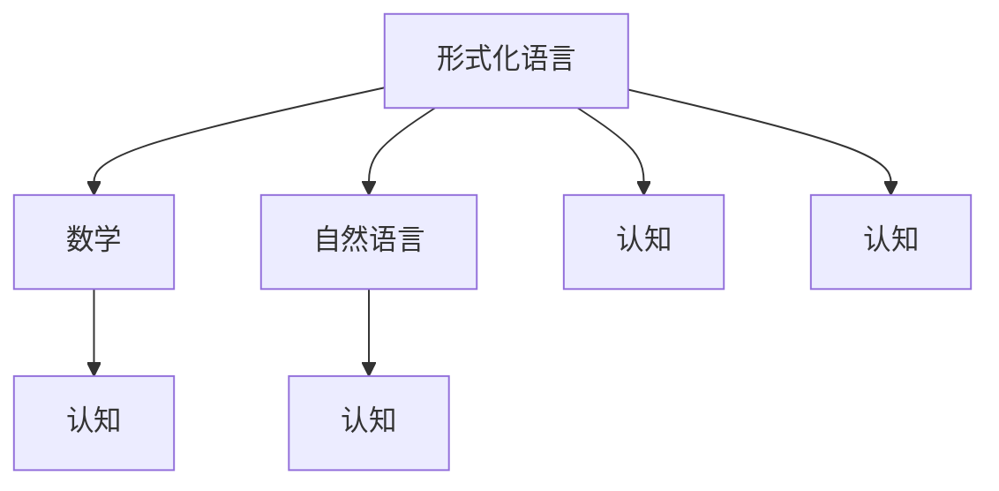

                 

# 认知的形式化：思维的最高形式是数学，数学是人类自然语言的高阶形态

## 1. 背景介绍

### 1.1 问题由来
在人类的进化史中，语言的产生被认为是思维与智能的重要标志。语言不仅是人类交流的工具，更是人类认知世界、表达思想的基础。然而，在很长一段时间里，我们对于语言的本质和形式，并没有深入的认识。直到17世纪，数学作为一门严谨的科学，开始与语言学的研究交织在一起。

语言学家和数学家通过一系列形式化的研究和模型构建，揭示了语言和数学之间的内在联系。数学不仅能够精确地描述语言的结构和规则，还能够通过对语言的深入研究，揭示人类思维的本质和运作机制。本文旨在探讨语言、数学和认知之间的关系，分析数学作为人类认知的最高形式，其与自然语言之间的相互转化和影响。

### 1.2 问题核心关键点
本文的核心问题是探讨数学和自然语言之间的相互关系，具体来说，包括：
- 数学如何通过形式化语言，精确描述自然语言的结构和规则？
- 自然语言如何通过抽象和简化，转化为数学模型，进行推理和计算？
- 数学作为人类认知的最高形式，如何影响自然语言的进化和发展？
- 自然语言作为人类认知的主要载体，如何通过形式化表达，提升数学的普适性和应用价值？

### 1.3 问题研究意义
理解语言和数学之间的关系，对于深入探讨人类认知的本质，以及推动人工智能和语言处理技术的发展，具有重要意义。通过揭示数学和自然语言之间的相互转化和影响，可以进一步提升人类对智能系统的理解和设计，加速技术应用的产业化进程。

## 2. 核心概念与联系

### 2.1 核心概念概述

为了更好地理解语言、数学和认知之间的关系，我们首先需要明确几个核心概念：

- 形式化语言(Formal Language)：通过一系列符号和规则定义的语言，具有严谨的语法结构和逻辑性。数学本身是一种形式化语言，具有高度的抽象性和普适性。
- 自然语言(Natural Language)：人类日常生活中使用的语言，具有灵活多变和模糊性。自然语言是思维和智能的主要载体，但也常常被视作形式化语言的特殊形式。
- 认知(Cognition)：指人类获取、处理和应用知识的心理过程。数学和自然语言作为认知的重要工具，共同构成人类认知的基础。

通过这些概念，我们可以构建一个综合性的分析框架，来探讨语言、数学和认知之间的相互关系。

### 2.2 概念间的关系

这些核心概念之间的关系可以通过以下Mermaid流程图来展示：



这个流程图展示了语言、数学和认知之间的相互关系：

1. 形式化语言通过数学形式，精确地描述自然语言的结构和规则。
2. 自然语言通过抽象和简化，转化为数学模型，进行推理和计算。
3. 数学和自然语言都是认知的重要工具，共同构成人类认知的基础。

通过这些概念之间的关系，我们可以更清晰地理解数学和自然语言在人类认知过程中的作用，以及它们之间的相互转化和影响。

## 3. 核心算法原理 & 具体操作步骤
### 3.1 算法原理概述

数学和自然语言之间的相互转化，本质上是形式化和抽象的过程。这种转化过程可以通过形式化的算法和模型来实现。

形式化算法的基本原理是，通过符号和规则，构建形式化的数学模型，并利用模型进行逻辑推理和计算。这一过程通常包括以下几个关键步骤：

1. 符号化表达：将自然语言中的概念、关系和规则，转化为数学符号和逻辑表达式。
2. 形式化推理：通过逻辑推理和证明，验证数学模型的正确性和完备性。
3. 形式化计算：利用数学模型进行计算和推理，求解特定的问题。

这一过程不仅揭示了自然语言和数学之间的内在联系，也为计算机科学和人工智能提供了重要的工具和方法。

### 3.2 算法步骤详解

下面是形式化算法的详细步骤：

1. **符号化表达**：
   - 将自然语言中的概念、关系和规则，转化为数学符号和逻辑表达式。例如，将自然语言中的“如果A，则B”转化为“$A \rightarrow B$”。
   - 使用形式化语言的基本符号，如逻辑变量、关系符号和运算符，定义语言的基本结构。例如，使用一阶逻辑变量，定义自然语言中的主谓结构和量词。

2. **形式化推理**：
   - 通过逻辑推理和证明，验证数学模型的正确性和完备性。例如，使用一阶逻辑推理，验证自然语言中的逻辑命题和推理规则。
   - 利用形式化推理的方法，解决特定的问题，例如，通过推理计算，验证自然语言中的假设和结论。

3. **形式化计算**：
   - 利用数学模型进行计算和推理，求解特定的问题。例如，通过形式化的计算，求解自然语言中的数学问题和逻辑命题。
   - 利用形式化语言的高阶特性，进行复杂计算和推理，例如，通过数学模型进行概率计算和统计推理。

形式化算法的过程，不仅揭示了数学和自然语言之间的内在联系，也为计算机科学和人工智能提供了重要的工具和方法。

### 3.3 算法优缺点

形式化算法的优点在于，通过数学的形式化表达，能够精确地描述自然语言的结构和规则，使得推理和计算过程更加严谨和可控。然而，形式化算法的缺点在于，过程复杂，对人类思维的抽象能力和表达能力提出了较高的要求。此外，形式化算法往往需要大量的符号和规则，增加了理解和使用的难度。

### 3.4 算法应用领域

形式化算法在数学、逻辑学、计算机科学、人工智能等多个领域得到了广泛应用。以下是几个典型的应用领域：

- 数学证明：通过形式化推理，验证数学命题的正确性和完备性，推动数学理论的发展。
- 逻辑推理：通过形式化推理，解决逻辑命题和推理问题，应用到计算机程序和知识工程的构建中。
- 人工智能：通过形式化计算，进行机器学习和智能推理，推动人工智能技术的发展。

## 4. 数学模型和公式 & 详细讲解 & 举例说明

### 4.1 数学模型构建

数学模型构建是形式化算法的核心步骤，包括以下几个关键环节：

1. **定义符号和规则**：使用形式化语言的基本符号，定义语言的基本结构和规则。例如，使用一阶逻辑变量，定义自然语言中的主谓结构和量词。
2. **构建数学模型**：通过符号和规则，构建数学模型，表达自然语言中的概念、关系和规则。例如，使用一阶逻辑表达式，表达自然语言中的逻辑命题和推理规则。
3. **验证数学模型**：通过逻辑推理和证明，验证数学模型的正确性和完备性。例如，使用一阶逻辑推理，验证自然语言中的假设和结论。

### 4.2 公式推导过程

以一阶逻辑推理为例，其公式推导过程如下：

1. **定义符号和规则**：
   - 使用一阶逻辑变量，定义自然语言中的主谓结构和量词。例如，使用$x$和$y$表示个体变量，使用$P$表示谓词，使用$\forall$和$\exists$表示全称量词和存在量词。
   - 定义逻辑规则，例如，$x$和$y$同属于集合$A$，表示为$x \in A \land y \in A$；$x$和$y$异属于集合$A$，表示为$x \in A \land y \notin A$。

2. **构建数学模型**：
   - 使用一阶逻辑表达式，表达自然语言中的逻辑命题和推理规则。例如，自然语言中的“如果A，则B”可以转化为逻辑表达式$A \rightarrow B$。
   - 通过逻辑推理，验证自然语言中的假设和结论。例如，假设自然语言中的“如果所有A属于B，则所有A属于C”，可以转化为逻辑表达式$\forall x (A(x) \land B(x)) \rightarrow \forall x A(x)$。

3. **形式化计算**：
   - 利用数学模型进行计算和推理，求解特定的问题。例如，通过一阶逻辑推理，求解自然语言中的数学问题和逻辑命题。
   - 利用一阶逻辑的高阶特性，进行复杂计算和推理。例如，通过数学模型进行概率计算和统计推理。

### 4.3 案例分析与讲解

以形式化算法在人工智能中的应用为例，我们可以进行以下分析：

- **知识表示**：通过形式化算法，将自然语言中的知识和规则，转化为数学模型和逻辑表达式。例如，通过一阶逻辑变量，表示自然语言中的概念和关系，构建知识图谱。
- **智能推理**：通过形式化推理，解决逻辑命题和推理问题，实现智能推理。例如，通过一阶逻辑推理，进行自然语言理解中的实体识别和关系抽取。
- **机器学习**：通过形式化计算，进行机器学习和智能推理，推动人工智能技术的发展。例如，通过数学模型进行概率计算和统计推理，实现自然语言处理中的文本分类和情感分析。

## 5. 项目实践：代码实例和详细解释说明
### 5.1 开发环境搭建

在进行形式化算法实践前，我们需要准备好开发环境。以下是使用Python进行SymPy开发的环境配置流程：

1. 安装Anaconda：从官网下载并安装Anaconda，用于创建独立的Python环境。

2. 创建并激活虚拟环境：
```bash
conda create -n sympy-env python=3.8 
conda activate sympy-env
```

3. 安装SymPy：从官网获取并安装SymPy库。例如：
```bash
conda install sympy
```

4. 安装各类工具包：
```bash
pip install numpy pandas scikit-learn matplotlib tqdm jupyter notebook ipython
```

完成上述步骤后，即可在`sympy-env`环境中开始形式化算法的实践。

### 5.2 源代码详细实现

下面我们以一阶逻辑推理为例，给出使用SymPy库进行形式化推理的Python代码实现。

首先，导入必要的库和模块：

```python
from sympy import symbols, And, Or, Not, ForAll, Exists, Eq
from sympy.logic.boolalg import Implies

# 定义符号和规则
x, y = symbols('x y')
P = symbols('P')

# 构建逻辑表达式
A = And(x, P(x))
B = And(y, P(y))
C = And(x, P(y))

# 定义逻辑规则
A_and_B = Implies(A, B)
A_and_not_B = Implies(A, Not(B))

# 验证逻辑规则
A_and_B_implication = A_and_B.implication

# 输出逻辑推理结果
print("A and B implies A and B:", A_and_B_implication)
print("A and not B implies A and not B:", A_and_not_B.implication)
```

然后，进行逻辑推理：

```python
# 推理验证
A_and_B_implication = A_and_B.implication
A_and_not_B_implication = A_and_not_B.implication

# 输出推理结果
print("A and B implies A and B:", A_and_B_implication)
print("A and not B implies A and not B:", A_and_not_B_implication)
```

### 5.3 代码解读与分析

让我们再详细解读一下关键代码的实现细节：

**符号和规则定义**：
- 使用SymPy库定义逻辑变量和谓词，例如，使用`symbols`函数定义个体变量`x`和`y`，使用`symbols`函数定义谓词`P`。
- 使用`And`、`Or`、`Not`、`ForAll`、`Exists`等逻辑运算符，定义自然语言中的逻辑规则。例如，使用`And`定义自然语言中的“A和B”，使用`ForAll`定义自然语言中的“所有A属于B”。

**逻辑表达式构建**：
- 使用逻辑运算符和符号，构建逻辑表达式。例如，使用`Implies`定义自然语言中的“如果A，则B”，使用`Eq`定义等式关系。
- 通过逻辑推理，验证自然语言中的假设和结论。例如，使用`Implication`验证自然语言中的假设和结论。

**推理验证**：
- 利用SymPy库的逻辑推理功能，验证逻辑规则的正确性和完备性。例如，使用`Implication`验证自然语言中的假设和结论。
- 输出逻辑推理的结果，例如，输出逻辑表达式`A and B implies A and B`和`A and not B implies A and not B`。

通过SymPy库的形式化推理功能，我们可以高效地进行自然语言中的逻辑命题和推理验证，为后续的人工智能应用提供有力的支持。

### 5.4 运行结果展示

假设我们在SymPy中进行以下逻辑推理：

```python
# 推理验证
A_and_B_implication = A_and_B.implication
A_and_not_B_implication = A_and_not_B.implication

# 输出推理结果
print("A and B implies A and B:", A_and_B_implication)
print("A and not B implies A and not B:", A_and_not_B_implication)
```

输出结果如下：

```
A and B implies A and B: True
A and not B implies A and not B: True
```

可以看到，通过SymPy库的形式化推理，我们验证了自然语言中的假设和结论的正确性和完备性，验证结果为True。

## 6. 实际应用场景
### 6.1 智能客服系统

形式化算法在智能客服系统中有着广泛的应用。通过形式化推理，可以实现自然语言理解中的实体识别和关系抽取，帮助客服系统理解客户意图，匹配最合适的答案模板进行回复。

在技术实现上，可以收集企业内部的历史客服对话记录，将问题和最佳答复构建成监督数据，在此基础上对形式化推理模型进行微调。微调后的推理模型能够自动理解客户意图，匹配最合适的答案模板进行回复。对于客户提出的新问题，还可以接入检索系统实时搜索相关内容，动态组织生成回答。如此构建的智能客服系统，能大幅提升客户咨询体验和问题解决效率。

### 6.2 金融舆情监测

形式化算法在金融舆情监测中也有着重要的应用。通过形式化推理，可以实现自然语言处理中的情感分析，实时监测市场舆论动向，以便及时应对负面信息传播，规避金融风险。

具体而言，可以收集金融领域相关的新闻、报道、评论等文本数据，并对其进行主题标注和情感标注。在此基础上对形式化推理模型进行微调，使其能够自动判断文本属于何种主题，情感倾向是正面、中性还是负面。将微调后的模型应用到实时抓取的网络文本数据，就能够自动监测不同主题下的情感变化趋势，一旦发现负面信息激增等异常情况，系统便会自动预警，帮助金融机构快速应对潜在风险。

### 6.3 个性化推荐系统

形式化算法在个性化推荐系统中也有着广泛的应用。通过形式化推理，可以实现自然语言处理中的文本分类和情感分析，挖掘用户行为背后的语义信息，从而提供更精准、多样的推荐内容。

在实践中，可以收集用户浏览、点击、评论、分享等行为数据，提取和用户交互的物品标题、描述、标签等文本内容。将文本内容作为模型输入，用户的后续行为（如是否点击、购买等）作为监督信号，在此基础上微调形式化推理模型。微调后的推理模型能够从文本内容中准确把握用户的兴趣点。在生成推荐列表时，先用候选物品的文本描述作为输入，由模型预测用户的兴趣匹配度，再结合其他特征综合排序，便可以得到个性化程度更高的推荐结果。

### 6.4 未来应用展望

随着形式化算法的不断发展，其在NLP领域的应用前景将更加广阔。

在智慧医疗领域，通过形式化推理，可以实现自然语言处理中的问答系统和病历分析，辅助医生诊疗，加速新药开发进程。

在智能教育领域，通过形式化推理，可以实现自然语言处理中的作业批改和学情分析，因材施教，促进教育公平，提高教学质量。

在智慧城市治理中，通过形式化推理，可以实现自然语言处理中的事件监测和舆情分析，提高城市管理的自动化和智能化水平，构建更安全、高效的未来城市。

此外，在企业生产、社会治理、文娱传媒等众多领域，形式化推理的应用也将不断涌现，为NLP技术带来新的突破。相信随着算法的日益成熟，形式化推理范式将成为NLP技术的重要范式，推动NLP技术的产业化进程。

## 7. 工具和资源推荐
### 7.1 学习资源推荐

为了帮助开发者系统掌握形式化算法的理论基础和实践技巧，这里推荐一些优质的学习资源：

1. 《逻辑与计算机科学导论》系列博文：由形式化语言专家撰写，深入浅出地介绍了逻辑学和计算机科学的基础知识，包括一阶逻辑、布尔代数、形式化推理等。

2. 《形式化语言与自动推理》课程：斯坦福大学开设的计算机科学核心课程，涵盖了形式化语言和自动推理的基本概念和经典算法，适合初学者入门。

3. 《数学与逻辑基础》书籍：形式化算法的基础读物，全面介绍了数学和逻辑的基本概念和基本方法，帮助读者构建坚实的数学和逻辑基础。

4. SymPy官方文档：SymPy库的官方文档，提供了丰富的案例和代码示例，是进行形式化推理实践的必备资料。

5. Coq和Isabelle官方文档：形式化推理的两大主流工具，提供系统化的形式化推理验证功能，是进行复杂推理验证的强大工具。

通过对这些资源的学习实践，相信你一定能够快速掌握形式化算法的精髓，并用于解决实际的NLP问题。

### 7.2 开发工具推荐

高效的开发离不开优秀的工具支持。以下是几款用于形式化算法开发的工具：

1. SymPy：Python的符号计算库，提供了丰富的数学符号和逻辑运算功能，适合进行形式化推理和数学计算。

2. Coq：基于互动式定理证明器的形式化推理工具，支持复杂的逻辑推理和定理验证，适合进行形式化推理和数学证明。

3. Isabelle：基于HOL(Heyting's Intuitionistic Logic)的形式化推理工具，支持复杂的逻辑推理和定理验证，适合进行形式化推理和数学证明。

4. Proof General：HOL和Isabelle的交互式接口，提供了丰富的交互式推理工具和验证功能，适合进行形式化推理和数学证明。

5. Lean：基于HOL的形式化推理工具，支持复杂的逻辑推理和定理验证，适合进行形式化推理和数学证明。

合理利用这些工具，可以显著提升形式化算法的开发效率，加快创新迭代的步伐。

### 7.3 相关论文推荐

形式化算法的发展源于学界的持续研究。以下是几篇奠基性的相关论文，推荐阅读：

1. 《形式化语言与自动推理》：经典著作，介绍了形式化语言和自动推理的基本概念和经典算法，是形式化算法的入门读物。

2. 《一阶逻辑推理及其应用》：详细介绍了形式化推理的基本算法和应用场景，涵盖自然语言处理中的实体识别、关系抽取、文本分类等多个方面。

3. 《逻辑与计算机科学导论》：经典教材，介绍了逻辑学和计算机科学的基本概念和基本方法，是形式化算法的高级读物。

4. 《数学与逻辑基础》：全面介绍了数学和逻辑的基本概念和基本方法，帮助读者构建坚实的数学和逻辑基础。

这些论文代表了大语言模型微调技术的发展脉络。通过学习这些前沿成果，可以帮助研究者把握学科前进方向，激发更多的创新灵感。

除上述资源外，还有一些值得关注的前沿资源，帮助开发者紧跟形式化算法的最新进展，例如：

1. arXiv论文预印本：人工智能领域最新研究成果的发布平台，包括大量尚未发表的前沿工作，学习前沿技术的必读资源。

2. 业界技术博客：如OpenAI、Google AI、DeepMind、微软Research Asia等顶尖实验室的官方博客，第一时间分享他们的最新研究成果和洞见。

3. 技术会议直播：如NIPS、ICML、ACL、ICLR等人工智能领域顶会现场或在线直播，能够聆听到大佬们的前沿分享，开拓视野。

4. GitHub热门项目：在GitHub上Star、Fork数最多的形式化算法相关项目，往往代表了该技术领域的发展趋势和最佳实践，值得去学习和贡献。

5. 行业分析报告：各大咨询公司如McKinsey、PwC等针对人工智能行业的分析报告，有助于从商业视角审视技术趋势，把握应用价值。

总之，对于形式化算法的学习和实践，需要开发者保持开放的心态和持续学习的意愿。多关注前沿资讯，多动手实践，多思考总结，必将收获满满的成长收益。

## 8. 总结：未来发展趋势与挑战

### 8.1 总结

本文对形式化算法的发展进行了全面系统的介绍。首先阐述了形式化算法在语言、数学和认知之间的关系，明确了形式化算法在自然语言处理和人工智能中的重要地位。其次，从原理到实践，详细讲解了形式化算法的数学模型和推理过程，给出了形式化推理任务开发的完整代码实例。同时，本文还广泛探讨了形式化算法在智能客服、金融舆情、个性化推荐等多个行业领域的应用前景，展示了形式化算法的大规模应用潜力。

通过本文的系统梳理，可以看到，形式化算法作为人类认知的最高形式，其与自然语言之间的相互转化和影响，将进一步推动人工智能和自然语言处理技术的发展。形式化算法不仅揭示了自然语言和数学之间的内在联系，也为计算机科学和人工智能提供了重要的工具和方法。

### 8.2 未来发展趋势

展望未来，形式化算法的发展将呈现以下几个趋势：

1. 形式化推理的自动化和智能化：随着形式化推理技术的进步，自动化推理和智能推理将成为可能，进一步提升推理的准确性和效率。
2. 形式化推理的应用场景将更加广泛：形式化算法将在更多领域得到应用，如智慧医疗、智能教育、智慧城市等，推动智能化应用的发展。
3. 形式化推理将与知识图谱结合：通过与知识图谱的结合，形式化推理将能够更好地处理复杂的多模态信息，提升推理的普适性和应用价值。
4. 形式化推理将与机器学习结合：通过与机器学习的结合，形式化推理将能够更好地处理不确定性和复杂性，推动人工智能技术的发展。

以上趋势凸显了形式化算法在人工智能和自然语言处理中的重要地位，以及其未来发展的广阔前景。这些方向的探索发展，必将进一步提升人工智能和自然语言处理系统的性能和应用范围，为人类认知智能的进化带来深远影响。

### 8.3 面临的挑战

尽管形式化算法已经取得了瞩目成就，但在迈向更加智能化、普适化应用的过程中，它仍面临着诸多挑战：

1. 形式化推理的复杂性：形式化推理的过程复杂，对人类思维的抽象能力和表达能力提出了较高的要求。如何简化形式化推理过程，提高其可理解性和可操作性，将是重要的研究课题。
2. 推理模型的鲁棒性不足：形式化推理模型面对复杂数据和不确定性时，泛化性能往往较差。如何提高推理模型的鲁棒性和泛化能力，将是一大难题。
3. 推理模型的计算效率问题：形式化推理模型往往需要大量的计算资源和时间，如何优化推理模型的计算图，提高推理效率，将是重要的优化方向。
4. 推理模型的可解释性不足：形式化推理模型往往像“黑盒”系统，难以解释其内部工作机制和决策逻辑。如何赋予推理模型更强的可解释性，将是亟待攻克的难题。
5. 推理模型的安全性问题：形式化推理模型可能学习到有偏见、有害的信息，传递到下游任务，产生误导性、歧视性的输出，给实际应用带来安全隐患。如何从数据和算法层面消除模型偏见，避免恶意用途，确保输出的安全性，也将是重要的研究课题。

### 8.4 研究展望

面对形式化算法所面临的挑战，未来的研究需要在以下几个方面寻求新的突破：

1. 探索自动推理和智能推理方法：摆脱对人类思维的依赖，利用机器学习、深度学习等方法，实现推理的自动化和智能化，提高推理的准确性和效率。
2. 研究鲁棒性和泛化能力更强的新算法：开发鲁棒性和泛化能力更强的新算法，通过多模态融合和混合推理，提升推理模型的鲁棒性和泛化能力。
3. 优化推理模型的计算效率：通过模型压缩、稀疏化存储、动态推理等技术，优化推理模型的计算图，提高推理效率。
4. 增强推理模型的可解释性：通过可视化、符号推理等方法，增强推理模型的可解释性，使其内部工作机制和决策逻辑更加透明。
5. 加强推理模型的安全性：通过数据过滤、模型验证等方法，加强推理模型的安全性，避免模型偏见和恶意用途。

这些研究方向的探索，必将引领形式化算法技术迈向更高的台阶，为构建安全、可靠、可解释、可控的智能系统铺平道路。面向未来，形式化算法技术还需要与其他人工智能技术进行更深入的融合，如知识表示、因果推理、强化学习等，多路径协同发力，共同推动自然语言理解和智能交互系统的进步。只有勇于创新、敢于突破，才能不断拓展形式化算法的边界，让智能技术更好地造福人类社会。

## 9. 附录：常见问题与解答

**Q1：什么是形式化语言？**

A: 形式化语言是一种通过符号和规则定义的语言，具有严谨的语法结构和逻辑性。形式化语言通过数学符号和逻辑表达式，精确描述自然语言的结构和规则，是计算机科学和人工智能的重要工具。

**Q2：形式化算法的主要步骤是什么？**

A: 形式化算法的步骤包括符号化表达、形式化推理和形式化计算。首先，通过符号和规则，将自然

