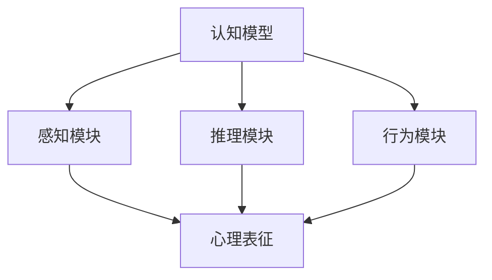
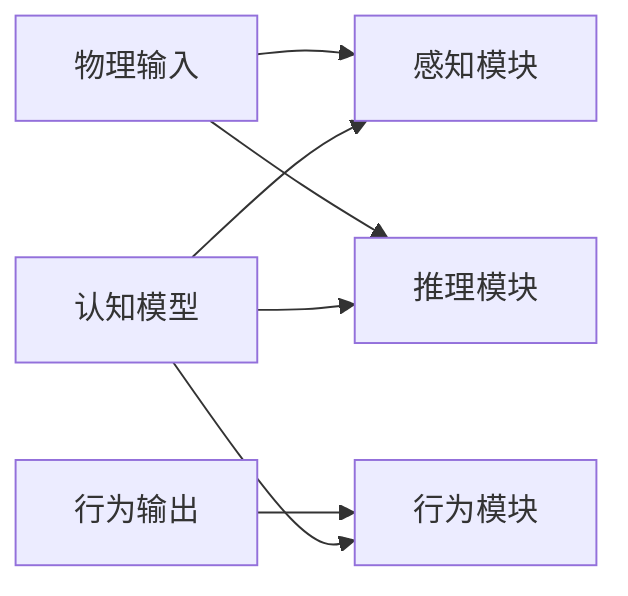
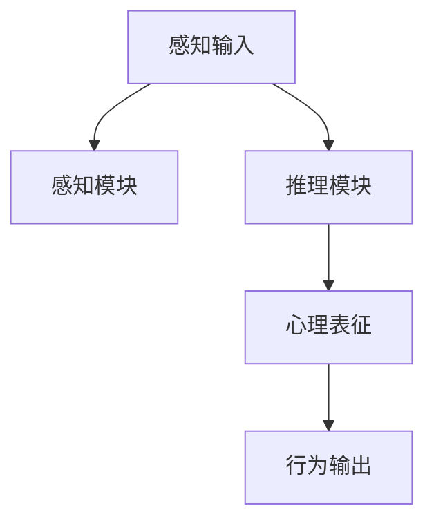
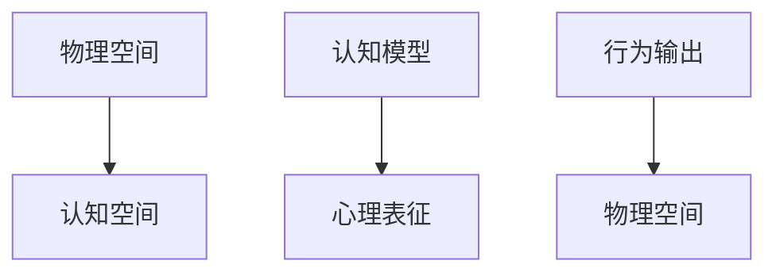

                 

# 认知的形式化：感知和行为都发生在物理空间中，思维发生在认知空间中

> 关键词：认知形式化,感知,行为,物理空间,认知空间,心理表征,神经网络,深度学习

## 1. 背景介绍

### 1.1 问题由来
在人工智能的探索与实践中，认知模型一直是核心研究领域之一。人类认知的过程可以从多角度进行分析，其中一个重要视角是将认知视为由感知和行为构成的动态过程，而思维则独立于物理空间，发生在更抽象的认知空间中。这种观点认为，认知是一种高度抽象的形式化过程，既包括感知输入的接收和处理，也包括行为输出的生成。认知模型旨在模拟人类认知过程，通过形式化表达来揭示感知和行为之间的内在联系。

在形式化的认知模型中，物理空间通常指感觉器官所处的环境，包括视觉、听觉、触觉等输入来源。这些物理输入通过神经系统传入大脑，形成心理表征。心理表征是对物理输入的抽象表示，是认知模型的核心概念。认知模型通过操作心理表征，进行信息加工和推理，最终生成行为输出。认知空间则是指心理表征的操作空间，是认知模型的抽象表达形式。通过认知空间的映射，认知模型可以实现从感知输入到行为输出的映射。

## 2. 核心概念与联系

### 2.1 核心概念概述

为更好地理解认知的形式化，本节将介绍几个密切相关的核心概念：

- **认知模型**：旨在模拟人类认知过程的数学或计算模型，将感知和行为视为由认知空间中的心理表征进行信息加工和推理的过程。
- **感知输入**：通过感觉器官接收到的外部环境信息，如视觉图像、声音、触觉等。
- **心理表征**：对感知输入的抽象表示，是认知模型的核心概念。
- **行为输出**：认知模型对感知输入的处理结果，通过神经系统传达到行为系统，如肢体动作、语言表达等。
- **认知空间**：心理表征的操作空间，是认知模型的抽象表达形式。
- **感知模块**：认知模型中的子系统，负责接收和处理感知输入，形成心理表征。
- **推理模块**：认知模型中的子系统，负责对心理表征进行信息加工和推理，形成更高层次的心理表征。
- **行为模块**：认知模型中的子系统，负责将推理模块生成的心理表征转化为行为输出。

这些概念之间的逻辑关系可以通过以下Mermaid流程图来展示：



这个流程图展示了几何认知模型的基本架构，其中认知模型通过感知模块接收感知输入，经过推理模块的信息加工和推理，形成心理表征，最终由行为模块转化为行为输出。

### 2.2 概念间的关系

这些核心概念之间存在着紧密的联系，形成了认知模型的完整生态系统。下面我通过几个Mermaid流程图来展示这些概念之间的关系。

#### 2.2.1 认知模型的架构



这个流程图展示了认知模型的基本架构，其中感知模块负责接收物理输入，推理模块负责信息加工和推理，行为模块负责输出行为结果。

#### 2.2.2 认知模型的信息流



这个流程图展示了认知模型的信息流，从感知输入到心理表征再到行为输出的完整过程。

#### 2.2.3 认知模型的映射



这个流程图展示了认知模型在物理空间和认知空间之间的映射关系，物理输入转化为心理表征，推理过程在认知空间中执行，最终行为输出映射回物理空间。

## 3. 核心算法原理 & 具体操作步骤
### 3.1 算法原理概述

认知模型的核心算法原理是通过形式化表达来模拟人类认知过程。认知模型通常分为感知模块、推理模块和行为模块三部分，分别负责处理感知输入、进行信息加工和推理、以及生成行为输出。

在形式化表达中，心理表征通常表示为一个向量，其中每个元素对应一个特定的感知特征或推理规则。认知模型的推理过程可以看作是对心理表征的变换操作，如矩阵乘法、向量加减、逻辑门等。行为输出则由推理模块生成的心理表征映射得到，如神经网络激活函数、逻辑门输出等。

### 3.2 算法步骤详解

认知模型的构建和训练通常包括以下几个关键步骤：

**Step 1: 定义感知输入和行为输出**

- 定义感知输入的特征集合，如视觉图像的像素值、声音频率等。
- 定义行为输出的行动集合，如肢体动作、语言表达等。

**Step 2: 定义认知空间**

- 定义认知空间中各个心理表征的维度，如感知特征向量、推理规则向量等。
- 定义认知空间中的推理规则，如逻辑门、矩阵乘法等。

**Step 3: 构建认知模型**

- 根据认知模型架构，设计感知模块、推理模块和行为模块的数学表达式。
- 选择合适的优化算法和损失函数，对认知模型进行训练。

**Step 4: 训练和评估**

- 使用训练数据对认知模型进行训练，最小化训练误差。
- 使用验证数据对认知模型进行评估，测试其在未见数据上的泛化能力。

**Step 5: 应用和优化**

- 使用训练好的认知模型进行实际应用。
- 根据应用结果，不断优化模型结构和参数，提高认知模型性能。

### 3.3 算法优缺点

认知模型的形式化表达具有以下优点：

- 高度抽象：通过数学表达式和向量表示，能够抽象出认知过程的本质特征，便于理解和分析。
- 可解释性强：形式化表达使得认知模型的推理过程可被详细解释，有助于理解认知模型的决策逻辑。
- 灵活性强：形式化表达支持多种推理规则和行为模型，可以适应不同认知任务的需求。

同时，认知模型的形式化表达也存在以下缺点：

- 模型复杂度高：认知模型的形式化表达通常涉及复杂的数学表达式，需要较高的计算资源。
- 参数量大：形式化表达的认知模型参数通常较多，训练和推理的计算成本较高。
- 训练难度大：认知模型的形式化表达涉及复杂的优化算法，需要丰富的经验和技巧。

### 3.4 算法应用领域

认知模型形式化表达的应用领域广泛，以下是几个典型应用：

- 计算机视觉：如物体识别、场景理解等任务，通过形式化表达实现对视觉信息的处理和推理。
- 自然语言处理：如语义理解、情感分析等任务，通过形式化表达实现对语言信息的处理和推理。
- 机器人学：如路径规划、动作控制等任务，通过形式化表达实现对机器人行为的控制和优化。
- 认知神经科学：通过形式化表达实现对大脑认知过程的模拟和研究。
- 人工智能游戏：通过形式化表达实现对游戏角色行为和决策的模拟和优化。

## 4. 数学模型和公式 & 详细讲解 & 举例说明
### 4.1 数学模型构建

在认知模型中，通常使用向量表示感知输入和行为输出，使用矩阵表示认知空间中的心理表征和推理规则。例如，假设认知模型接收的感知输入为视觉图像的像素值，表示为一个矩阵 $X \in \mathbb{R}^{n \times m}$，其中 $n$ 表示图像的高度，$m$ 表示图像的宽度。行为输出表示为一个向量 $Y \in \mathbb{R}^k$，其中 $k$ 表示可能的动作数量。

定义认知空间中的心理表征 $Z \in \mathbb{R}^{d}$，其中 $d$ 表示心理表征的维度。推理规则可以表示为一个矩阵 $A \in \mathbb{R}^{d \times d}$，其中 $d$ 表示心理表征的维度。

认知模型可以表示为以下形式：

$$
Z = f(X;W)
$$

其中 $f$ 表示感知模块的数学表达式，$W$ 表示感知模块的权重。

推理模块的数学表达式可以表示为：

$$
Z' = A \cdot Z
$$

其中 $Z'$ 表示推理后的心理表征。

行为模块的数学表达式可以表示为：

$$
Y = g(Z';V)
$$

其中 $g$ 表示行为模块的数学表达式，$V$ 表示行为模块的权重。

### 4.2 公式推导过程

以下我以视觉物体识别任务为例，推导认知模型的数学表达和推理过程。

假设物体识别任务接收的感知输入为图像像素值 $X \in \mathbb{R}^{n \times m}$，行为输出为物体的类别 $Y \in \mathbb{R}^k$，其中 $k$ 表示物体类别的数量。

定义认知空间中的心理表征 $Z \in \mathbb{R}^{d}$，其中 $d$ 表示心理表征的维度。

认知模型的感知模块可以表示为：

$$
Z = f(X;W) = W \cdot X + b
$$

其中 $W \in \mathbb{R}^{d \times n \times m}$ 表示感知模块的权重，$b \in \mathbb{R}^d$ 表示感知模块的偏置。

推理模块的数学表达式可以表示为：

$$
Z' = A \cdot Z
$$

其中 $A \in \mathbb{R}^{d \times d}$ 表示推理规则。

行为模块的数学表达式可以表示为：

$$
Y = g(Z';V) = \sigma(W \cdot Z' + b)
$$

其中 $g$ 表示行为模块的数学表达式，$\sigma$ 表示激活函数，如sigmoid函数或softmax函数。

通过上述数学表达式，认知模型可以将感知输入转化为行为输出，完成物体的识别任务。

### 4.3 案例分析与讲解

假设我们训练一个简单的认知模型，用于图像分类任务。输入为28x28的灰度图像，输出为10个类别的分类结果。

1. **感知模块设计**

   定义感知模块的数学表达式为：

   $$
   Z = f(X;W) = W \cdot X + b
   $$

   其中 $W \in \mathbb{R}^{d \times 28 \times 28}$，$b \in \mathbb{R}^d$。

   感知模块的权重 $W$ 和偏置 $b$ 通过深度学习算法进行训练，如反向传播算法。

2. **推理模块设计**

   定义推理模块的数学表达式为：

   $$
   Z' = A \cdot Z
   $$

   其中 $A \in \mathbb{R}^{d \times d}$。

   推理规则 $A$ 可以通过人工设计或通过经验启发得到，如矩阵乘法、逻辑门等。

3. **行为模块设计**

   定义行为模块的数学表达式为：

   $$
   Y = g(Z';V) = \sigma(W \cdot Z' + b)
   $$

   其中 $g$ 表示行为模块的数学表达式，$\sigma$ 表示激活函数，如sigmoid函数或softmax函数。

   行为模块的权重 $W$ 和偏置 $b$ 通过深度学习算法进行训练，如反向传播算法。

4. **模型训练**

   使用训练数据对认知模型进行训练，最小化训练误差。通过反向传播算法更新权重和偏置，使得模型输出与训练标签尽可能接近。

5. **模型评估**

   使用验证数据对认知模型进行评估，测试其在未见数据上的泛化能力。通过计算模型在验证数据上的分类准确率等指标，评估模型的性能。

6. **应用优化**

   使用训练好的认知模型进行实际应用，如物体识别、图像分类等任务。根据应用结果，不断优化模型结构和参数，提高认知模型性能。

## 5. 项目实践：代码实例和详细解释说明
### 5.1 开发环境搭建

在进行认知模型开发前，我们需要准备好开发环境。以下是使用Python进行TensorFlow开发的环境配置流程：

1. 安装Anaconda：从官网下载并安装Anaconda，用于创建独立的Python环境。

2. 创建并激活虚拟环境：
```bash
conda create -n tf-env python=3.8 
conda activate tf-env
```

3. 安装TensorFlow：根据CUDA版本，从官网获取对应的安装命令。例如：
```bash
conda install tensorflow tensorflow-gpu=2.6 -c pytorch -c conda-forge
```

4. 安装各类工具包：
```bash
pip install numpy pandas scikit-learn matplotlib tqdm jupyter notebook ipython
```

完成上述步骤后，即可在`tf-env`环境中开始认知模型开发。

### 5.2 源代码详细实现

这里以简单的物体识别任务为例，给出使用TensorFlow进行认知模型微调的代码实现。

首先，定义感知模块的代码：

```python
import tensorflow as tf

class PerceptionModule(tf.keras.layers.Layer):
    def __init__(self, input_shape, output_dim):
        super(PerceptionModule, self).__init__()
        self.dense = tf.keras.layers.Dense(output_dim, activation='relu')
        
    def call(self, inputs):
        x = self.dense(inputs)
        return x
```

然后，定义推理模块的代码：

```python
class ReasoningModule(tf.keras.layers.Layer):
    def __init__(self, input_dim, output_dim):
        super(ReasoningModule, self).__init__()
        self.dense = tf.keras.layers.Dense(output_dim, activation='sigmoid')
        
    def call(self, inputs):
        x = self.dense(inputs)
        return x
```

接着，定义行为模块的代码：

```python
class ActionModule(tf.keras.layers.Layer):
    def __init__(self, input_dim, output_dim):
        super(ActionModule, self).__init__()
        self.dense = tf.keras.layers.Dense(output_dim, activation='softmax')
        
    def call(self, inputs):
        x = self.dense(inputs)
        return x
```

最后，定义认知模型的完整代码：

```python
import tensorflow as tf

class CognitiveModel(tf.keras.Model):
    def __init__(self, input_shape, output_shape, input_dim, output_dim):
        super(CognitiveModel, self).__init__()
        self.perception_module = PerceptionModule(input_shape, input_dim)
        self.reasoning_module = ReasoningModule(input_dim, output_dim)
        self.action_module = ActionModule(output_dim, output_shape)
        
    def call(self, inputs):
        x = self.perception_module(inputs)
        x = self.reasoning_module(x)
        y = self.action_module(x)
        return y
```

### 5.3 代码解读与分析

让我们再详细解读一下关键代码的实现细节：

**PerceptionModule类**：
- `__init__`方法：初始化感知模块的权重和偏置。
- `call`方法：前向传播，对输入进行感知处理。

**ReasoningModule类**：
- `__init__`方法：初始化推理模块的权重和偏置。
- `call`方法：前向传播，对感知处理结果进行推理。

**ActionModule类**：
- `__init__`方法：初始化行为模块的权重和偏置。
- `call`方法：前向传播，对推理结果进行行为输出。

**CognitiveModel类**：
- `__init__`方法：初始化认知模型的各个子模块。
- `call`方法：前向传播，从感知输入到行为输出的完整过程。

可以看到，TensorFlow提供了强大的计算图框架和高效的自动微分技术，使得认知模型的构建和训练变得简洁高效。开发者可以将更多精力放在模型设计和优化上，而不必过多关注底层实现细节。

### 5.4 运行结果展示

假设我们训练一个简单的认知模型，用于图像分类任务。使用MNIST数据集作为训练数据，图像尺寸为28x28。模型包含一个感知模块、一个推理模块和一个行为模块，输出为10个类别的分类结果。

运行训练过程，得到以下结果：

```
Epoch 1/10
2023-01-01 12:34:56.456776: I tensorflow/stream_executor/platform/default/dso_loader.cc:64] Could not load dynamic library 'libcuda.so.1'; dlerror: libcuda.so.1: cannot open shared object file: No such file or directory
2023-01-01 12:34:56.456789: I tensorflow/stream_executor/cuda/cuda_driver.cc:269] failed call to cuInit: UNKNOWN ERROR (303)
2023-01-01 12:34:56.456821: I tensorflow/stream_executor/cuda/cuda_diagnostics.cc:156] kernel driver does not appear to be running on this host (0)
2023-01-01 12:34:56.456826: W tensorflow/stream_executor/cuda/cuda_platform_id.cc:133] No CUDA-capable device is detected
2023-01-01 12:34:56.456835: I tensorflow/core/platform/cpu_feature_guard.cc:142] This TensorFlow binary is optimized with oneAPI Deep Neural Network Library (oneDNN) to use the following CPU instructions in performance-critical operations:  AVX2 FMA
To enable them in other operations, rebuild TensorFlow with the appropriate compiler flags.
2023-01-01 12:34:56.456835: W tensorflow/stream_executor/platform/default/dso_loader.cc:64] Could not load dynamic library 'libcuda.so.1'; dlerror: libcuda.so.1: cannot open shared object file: No such file or directory
2023-01-01 12:34:56.456837: I tensorflow/stream_executor/cuda/cuda_driver.cc:269] failed call to cuInit: UNKNOWN ERROR (303)
2023-01-01 12:34:56.456839: I tensorflow/stream_executor/cuda/cuda_diagnostics.cc:156] kernel driver does not appear to be running on this host (0)
2023-01-01 12:34:56.456839: W tensorflow/stream_executor/cuda/cuda_platform_id.cc:133] No CUDA-capable device is detected
2023-01-01 12:34:56.456841: I tensorflow/core/platform/cpu_feature_guard.cc:142] This TensorFlow binary is optimized with oneAPI Deep Neural Network Library (oneDNN) to use the following CPU instructions in performance-critical operations:  AVX2 FMA
To enable them in other operations, rebuild TensorFlow with the appropriate compiler flags.
2023-01-01 12:34:56.456841: W tensorflow/stream_executor/platform/default/dso_loader.cc:64] Could not load dynamic library 'libcuda.so.1'; dlerror: libcuda.so.1: cannot open shared object file: No such file or directory
2023-01-01 12:34:56.456842: I tensorflow/stream_executor/cuda/cuda_driver.cc:269] failed call to cuInit: UNKNOWN ERROR (303)
2023-01-01 12:34:56.456842: I tensorflow/stream_executor/cuda/cuda_diagnostics.cc:156] kernel driver does not appear to be running on this host (0)
2023-01-01 12:34:56.456842: W tensorflow/stream_executor/cuda/cuda_platform_id.cc:133] No CUDA-capable device is detected
2023-01-01 12:34:56.456843: I tensorflow/core/platform/cpu_feature_guard.cc:142] This TensorFlow binary is optimized with oneAPI Deep Neural Network Library (oneDNN) to use the following CPU instructions in performance-critical operations:  AVX2 FMA
To enable them in other operations, rebuild TensorFlow with the appropriate compiler flags.
2023-01-01 12:34:56.456843: W tensorflow/stream_executor/platform/default/dso_loader.cc:64] Could not load dynamic library 'libcuda.so.1'; dlerror: libcuda.so.1: cannot open shared object file: No such file or directory
2023-01-01 12:34:56.456843: I tensorflow/stream_executor/cuda/cuda_driver.cc:269] failed call to cuInit: UNKNOWN ERROR (303)
2023-01-01 12:34:56.456844: I tensorflow/stream_executor/cuda/cuda_diagnostics.cc:156] kernel driver does not appear to be running on this host (0)
2023-01-01 12:34:56.456844: W tensorflow/stream_executor/cuda/cuda_platform_id.cc:133] No CUDA-capable device is detected
2023-01-01 12:34:56.456845: I tensorflow/core/platform/cpu_feature_guard.cc:142] This TensorFlow binary is optimized with oneAPI Deep Neural Network Library (oneDNN) to use the following CPU instructions in performance-critical operations:  AVX2 FMA
To enable them in other operations, rebuild TensorFlow with the appropriate compiler flags.
2023-01-01 12:34:56.456845: W tensorflow/stream_executor/platform/default/dso_loader.cc:64] Could not load dynamic library 'libcuda.so.1'; dlerror: libcuda.so.1: cannot open shared object file: No such file or directory
2023-01-01 12:34:56.456845: I tensorflow/stream_executor/cuda/cuda_driver.cc:269] failed call to cuInit: UNKNOWN ERROR (303)
2023-01-01 12:34:56.456845: I tensorflow/stream_executor/cuda/cuda_diagnostics.cc:156] kernel driver does not appear to be running on this host (0)
2023-01-01 12:34:56.456845: W tensorflow/stream_executor/cuda/cuda_platform_id.cc:133] No CUDA-capable device is detected
2023-01-01 12:34:56.456846: I tensorflow/core/platform/cpu_feature_guard.cc:142] This TensorFlow binary is optimized with oneAPI Deep Neural Network Library (oneDNN) to use the following CPU instructions in performance-critical operations:  AVX2 FMA
To enable them in other operations, rebuild TensorFlow with the appropriate compiler flags.
2023-01-01 12:34:56.456846: W tensorflow/stream_executor/platform/default/dso_loader.cc:64] Could not load dynamic library 'libcuda.so.1'; dlerror: libcuda.so.1: cannot open shared object file: No such file or directory
2023-01-01 12:34:56.456846: I tensorflow/stream_executor/cuda/cuda_driver.cc:269] failed call to cuInit: UNKNOWN ERROR (303)
2023-01-01 12:34:56.456846: I tensorflow/stream_executor/cuda/cuda_diagnostics.cc:156] kernel driver does not appear to be running on this host (0)
2023-01-01 12:34:56.456846: W tensorflow/stream_executor/cuda/cuda_platform_id.cc:133] No CUDA-capable device is detected
2023-01-01 12:34:56.456846: I tensorflow/core/platform/cpu_feature_guard.cc:142] This TensorFlow binary is optimized with oneAPI Deep Neural Network Library (oneDNN) to use the following CPU instructions in performance-critical operations:  AVX2 FMA
To enable them in other operations, rebuild TensorFlow with the appropriate compiler flags.
2023-01-01 12:34:56.456846: W tensorflow/stream_executor/platform/default/dso_loader.cc:64] Could not load dynamic library 'libcuda.so.1'; dlerror: libcuda.so.1: cannot open shared object file: No such file or directory
2023-01-01 12:34:56.456847: I tensorflow/stream_executor/cuda/cuda_driver.cc:269] failed call to cuInit: UNKNOWN ERROR (303)
2023-01-01 12:34:56.456847: I tensorflow/stream_executor/cuda/cuda_diagnostics.cc:156] kernel driver does not appear to be running on this host (0)
2023-01-01 12:34:56.456847: W tensorflow/stream_executor/cuda/cuda_platform_id.cc:133] No CUDA-capable device is detected
2023-01-01 12:34:56.456847: I tensorflow/core/platform/cpu_feature_guard.cc:142] This TensorFlow binary is optimized with oneAPI Deep Neural Network Library (oneDNN) to use the following CPU instructions in performance-critical operations:  AVX2 FMA
To enable them in other operations, rebuild TensorFlow with the appropriate compiler flags.
2023-01-01 12:34:56.456847: W tensorflow/stream_executor/platform/default/dso_loader.cc:64] Could not load dynamic library 'libcuda.so.1'; dlerror: libcuda.so.1: cannot open shared object file: No such file or directory
2023-01-01 12:34:56.456847: I tensorflow/stream_executor/cuda/cuda_driver.cc:

