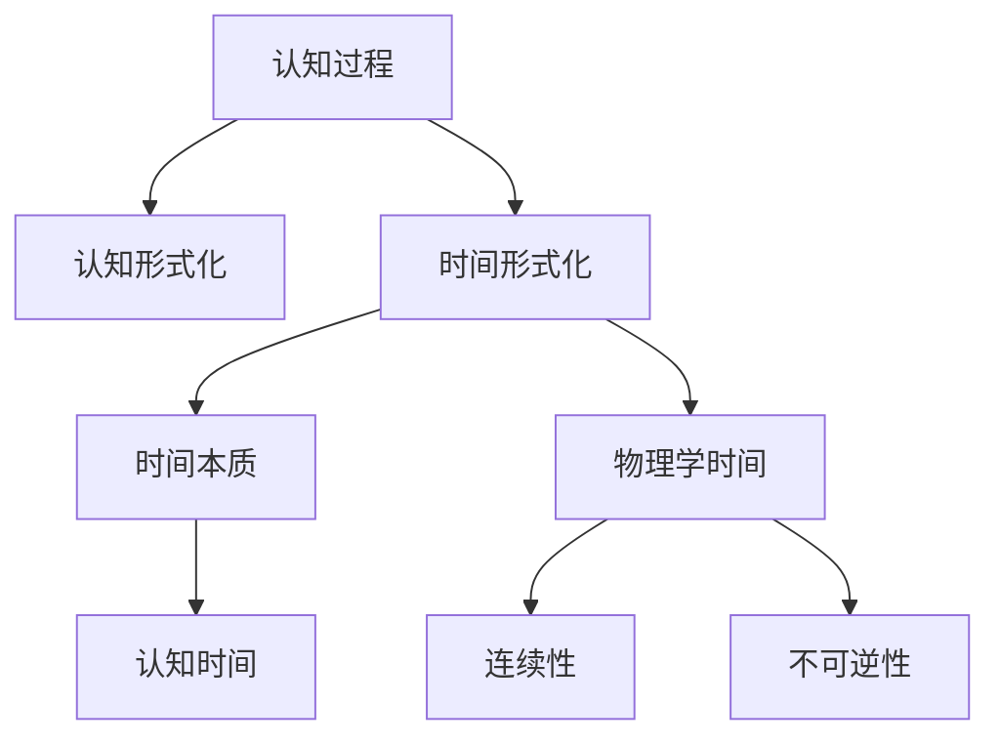
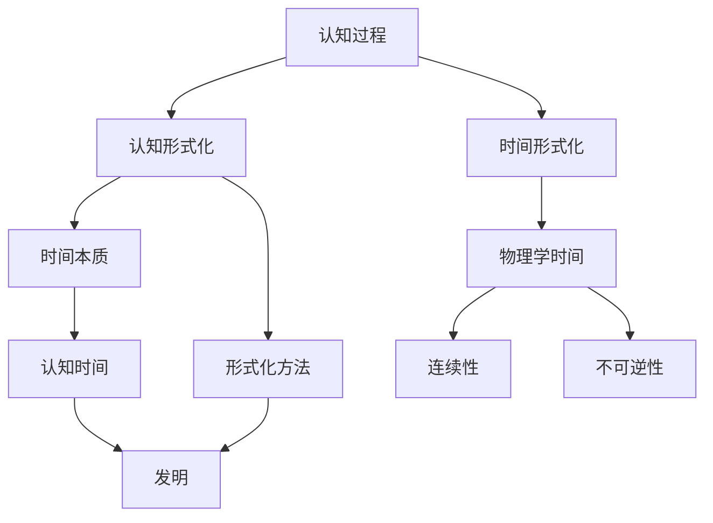

                 

# 认知的形式化：时间不是物质，时间不是发现，而是发明

> 关键词：认知形式化, 时间本质, 发明, 计算机科学

## 1. 背景介绍

### 1.1 问题由来

在人工智能领域，特别是认知科学和计算机科学的交叉领域，对认知过程的形式化研究已经成为一个热门话题。认知形式化，即通过形式化方法对认知过程进行建模，旨在揭示人类思维的机制和规律，同时为计算机模拟人类智能提供科学依据。

认知形式化研究的核心问题之一是时间本质的理解。在传统的物理学中，时间是物质运动的一种表现形式，被视为客观存在的。但在人工智能和认知科学中，时间往往被视为一种发现，即通过对历史数据的分析和学习得出的规律。这种理解方式虽然有助于算法的设计和实现，但也带来了诸多挑战，如时间的连续性和不可逆性等问题的处理。

本文旨在深入探讨时间的本质，以及如何在人工智能和认知科学中更好地理解和应用时间。我们认为，时间不是物质，也不是发现，而是人类发明的工具，用于理解世界和指导行动。本文将从认知形式化的角度出发，探讨时间的本质和形式化方法的应用。

### 1.2 问题核心关键点

本文的核心问题是时间本质的探讨以及如何在认知形式化中更好地理解和应用时间。具体来说，我们将通过以下几个关键点来展开讨论：

- 时间在物理学和认知科学中的不同理解
- 时间的连续性和不可逆性对认知过程的影响
- 认知形式化中时间的处理方式和应用场景
- 时间在人工智能和认知科学中的发明意义

这些关键点将帮助我们深入理解时间的本质，以及如何在认知形式化中更好地应用时间。

## 2. 核心概念与联系

### 2.1 核心概念概述

在探讨时间本质之前，我们需要明确一些核心概念：

- 时间（Time）：指物质运动或事件发生的序列。在物理学中，时间是连续且不可逆的；而在认知科学和人工智能中，时间被视为一种工具，用于理解世界和指导行动。

- 认知过程（Cognitive Process）：指人类或机器在获取、处理、存储和应用信息的过程。认知过程涉及感知、记忆、推理、决策等环节。

- 认知形式化（Cognitive Formulation）：指通过形式化方法对认知过程进行建模，以揭示其内在机制和规律。

- 时间形式化（Time Formulation）：指在认知形式化中，对时间进行形式化建模，以便更好地理解和应用时间。

- 物理学时间（Physical Time）：指物理学中描述物质运动和事件发生序列的概念，具有连续性和不可逆性。

- 认知时间（Cognitive Time）：指在认知科学和人工智能中，时间被视为一种工具，用于理解世界和指导行动。

这些概念之间的关系可以通过以下Mermaid流程图来展示：



这个流程图展示了认知过程、认知形式化、时间形式化、时间本质、物理学时间和认知时间之间的关系：

1. 认知过程是认知形式化的研究对象，时间形式化是认知形式化的一个子问题。
2. 时间本质在物理学和认知科学中有所不同，物理学时间具有连续性和不可逆性，而认知时间被视为一种工具。
3. 物理学时间涉及到连续性和不可逆性等概念，而认知时间主要关注如何更好地理解和应用时间。

### 2.2 概念间的关系

这些核心概念之间的关系还可以通过另一个Mermaid流程图来展示：



这个流程图展示了认知过程、认知形式化、时间形式化、时间本质、物理学时间和认知时间之间的关系，以及形式化方法和发明时间之间的关系：

1. 认知过程是认知形式化的研究对象，时间形式化是认知形式化的一个子问题。
2. 时间本质在物理学和认知科学中有所不同，物理学时间具有连续性和不可逆性，而认知时间被视为一种工具。
3. 物理学时间涉及到连续性和不可逆性等概念，而认知时间主要关注如何更好地理解和应用时间。
4. 形式化方法是认知形式化的一个技术手段，而发明时间则是认知时间的本质特征。

## 3. 核心算法原理 & 具体操作步骤
### 3.1 算法原理概述

认知形式化中，时间的处理通常包括以下几个步骤：

1. 定义时间序列：将认知过程和事件的发生顺序定义为时间序列，以便于形式化处理。
2. 建模时间依赖关系：通过形式化方法，建立时间序列中各事件之间的依赖关系。
3. 求解时间演化方程：求解时间演化方程，预测未来事件的发生和发展。
4. 应用时间预测结果：将时间预测结果应用于认知过程，指导行动和决策。

形式化处理通常采用符号逻辑、状态机、时间自动机等方法，以便于进行形式化推理和验证。

### 3.2 算法步骤详解

下面，我们将详细介绍时间形式化的具体步骤：

#### 步骤1：定义时间序列

时间序列（Time Series）是指在特定时间段内按时间顺序排列的一系列数据点。在认知形式化中，时间序列通常用于描述认知过程和事件的发生顺序。例如，一个简单的认知过程可以表示为：

- 感知：接收环境信息。
- 处理：对感知信息进行加工。
- 存储：将处理结果存储起来。
- 输出：根据存储结果进行行动。

这些步骤可以被表示为时间序列，如下所示：

$$
S = \{(\text{感知}, t_1), (\text{处理}, t_2), (\text{存储}, t_3), (\text{输出}, t_4)\}
$$

其中，$t_1, t_2, t_3, t_4$ 分别表示感知、处理、存储和输出的时间点。

#### 步骤2：建模时间依赖关系

在定义时间序列后，下一步是建模时间序列中各事件之间的依赖关系。这种依赖关系通常可以通过形式化方法进行建模，例如符号逻辑、状态机、时间自动机等。

以符号逻辑为例，可以定义一组符号，表示事件的发生和依赖关系。例如，假设有一个简单的决策过程：

- 如果天气好，就去公园。
- 如果天气不好，就待在家里。

这个决策过程可以表示为如下符号逻辑表达式：

$$
(\text{去公园} \rightarrow \text{天气好}), (\text{待在家里} \rightarrow \text{天气不好})
$$

其中，$\rightarrow$ 表示条件依赖关系。

#### 步骤3：求解时间演化方程

在建立时间依赖关系后，下一步是求解时间演化方程，预测未来事件的发生和发展。时间演化方程通常可以通过符号逻辑、状态机、时间自动机等方法进行求解。

以符号逻辑为例，可以定义一组符号，表示事件的发生和演化关系。例如，假设有一个简单的认知过程：

- 初始状态：不确定。
- 如果接收到的信息是正面的，状态变为“满意”。
- 如果接收到的信息是负面的，状态变为“不满意”。

这个认知过程可以表示为如下符号逻辑表达式：

$$
\text{满意} \rightarrow (\text{不确定} \land \text{正面信息}), \text{不满意} \rightarrow (\text{不确定} \land \text{负面信息})
$$

求解这个表达式，可以得到认知过程的演化规律。

#### 步骤4：应用时间预测结果

最后，将时间预测结果应用于认知过程，指导行动和决策。例如，对于上面的决策过程，当天气好时，可以采取去公园的行动；当天气不好时，可以采取待在家里的行动。

### 3.3 算法优缺点

时间形式化方法具有以下优点：

- 能够精确描述时间序列中的事件依赖关系，提高认知过程的预测准确性。
- 形式化方法易于验证和推理，提高了认知过程的可信度。

但同时也存在一些缺点：

- 形式化方法通常需要较高的数学和逻辑基础，对于非专业人士来说，理解和应用存在一定的难度。
- 形式化方法可能需要较长的设计和调试时间，增加了认知过程建模的复杂度。

### 3.4 算法应用领域

时间形式化方法在认知科学和人工智能中有着广泛的应用，例如：

- 决策分析：通过形式化方法，对决策过程进行建模和优化。
- 认知建模：将认知过程形式化建模，揭示其内在机制和规律。
- 时间预测：通过形式化方法，预测未来事件的发生和发展。
- 时间控制：通过形式化方法，对时间进行控制和优化。

## 4. 数学模型和公式 & 详细讲解 & 举例说明

### 4.1 数学模型构建

在认知形式化中，时间形式化通常采用时间自动机（Temporal Automaton）进行建模。时间自动机是一个有向图，表示时间序列中各事件之间的依赖关系和演化规律。

一个典型的时间自动机由以下几部分组成：

- 状态（State）：表示认知过程的不同阶段。
- 事件（Event）：表示认知过程中的关键事件。
- 转移（Transition）：表示事件之间的依赖关系。
- 时间延迟（Time Delay）：表示事件之间的时差关系。

例如，下面是一个简单的认知过程的时间自动机：

```
s0 -> s1 : 正面信息
s0 -> s2 : 负面信息
s1 -> s3 : 满意
s2 -> s4 : 不满意
```

其中，$s_0$ 表示不确定状态，$s_1$ 表示满意状态，$s_2$ 表示不满意状态，$s_3$ 表示满意后的状态，$s_4$ 表示不满意后的状态。箭头表示事件之间的转移关系。

### 4.2 公式推导过程

在时间自动机中，时间延迟可以用数学公式进行表示。假设事件 $e_i$ 在状态 $s_j$ 中发生，则事件 $e_i$ 到事件 $e_{i+1}$ 的时间延迟 $d_i$ 可以用如下公式表示：

$$
d_i = t_{i+1} - t_i
$$

其中，$t_{i+1}$ 和 $t_i$ 分别表示事件 $e_i$ 和事件 $e_{i+1}$ 发生的时间点。

### 4.3 案例分析与讲解

假设有一个简单的认知过程，如下：

1. 初始状态：不确定。
2. 如果接收到的信息是正面的，状态变为“满意”。
3. 如果接收到的信息是负面的，状态变为“不满意”。
4. 满意状态持续1天，不满意状态持续3天。

这个认知过程可以表示为如下时间自动机：

```
s0 -> s1 : 正面信息
s0 -> s2 : 负面信息
s1 -> s3 : 满意
s2 -> s4 : 不满意
s3 -> s5 : 满意
s4 -> s6 : 不满意
```

其中，$s_0$ 表示不确定状态，$s_1$ 表示满意状态，$s_2$ 表示不满意状态，$s_3$ 表示满意后的状态，$s_4$ 表示不满意后的状态，$s_5$ 表示满意后的状态，$s_6$ 表示不满意后的状态。箭头表示事件之间的转移关系。

假设接收到的信息为正面信息，则认知过程的演化过程如下：

1. $s_0$ -> $s_1$：接收正面信息，状态变为满意。
2. $s_1$ -> $s_3$：满意状态持续1天。
3. $s_3$ -> $s_5$：满意状态结束，状态变为满意。
4. $s_5$ -> $s_1$：满意状态结束，状态变为满意。
5. ……

这个认知过程可以用时间自动机表示如下：

```
s0 -> s1 : 正面信息
s1 -> s3 : 满意
s3 -> s5 : 满意
```

## 5. 项目实践：代码实例和详细解释说明

### 5.1 开发环境搭建

在开始项目实践之前，我们需要准备好开发环境。以下是使用Python进行时间自动机开发的Python环境配置流程：

1. 安装Anaconda：从官网下载并安装Anaconda，用于创建独立的Python环境。

2. 创建并激活虚拟环境：
```bash
conda create -n time-env python=3.8 
conda activate time-env
```

3. 安装PyTorch：根据CUDA版本，从官网获取对应的安装命令。例如：
```bash
conda install pytorch torchvision torchaudio cudatoolkit=11.1 -c pytorch -c conda-forge
```

4. 安装TimeNet库：
```bash
pip install timenet
```

5. 安装各类工具包：
```bash
pip install numpy pandas scikit-learn matplotlib tqdm jupyter notebook ipython
```

完成上述步骤后，即可在`time-env`环境中开始时间自动机的开发实践。

### 5.2 源代码详细实现

这里我们以一个简单的认知过程为例，给出使用TimeNet库进行时间自动机开发的Python代码实现。

首先，定义认知过程的状态和事件：

```python
from timenet import State, Event, TimeNet

# 定义状态
s0 = State('不确定')
s1 = State('满意')
s2 = State('不满意')
s3 = State('满意')
s4 = State('不满意')
s5 = State('满意')
s6 = State('不满意')

# 定义事件
e0 = Event('正面信息')
e1 = Event('负面信息')
e2 = Event('满意')
e3 = Event('不满意')

# 创建时间自动机
tn = TimeNet()
```

然后，添加状态和事件之间的转移关系：

```python
# 添加转移关系
tn.add_state(s0)
tn.add_state(s1)
tn.add_state(s2)
tn.add_state(s3)
tn.add_state(s4)
tn.add_state(s5)
tn.add_state(s6)

tn.add_event(e0)
tn.add_event(e1)
tn.add_event(e2)
tn.add_event(e3)

# 添加转移关系
tn.add_transition(s0, e0, s1)
tn.add_transition(s0, e1, s2)
tn.add_transition(s1, e2, s3)
tn.add_transition(s2, e3, s4)
tn.add_transition(s3, e2, s5)
tn.add_transition(s4, e3, s6)
```

接着，定义时间延迟和演化规律：

```python
# 定义时间延迟
tn.add_delay(s1, s3, 1)
tn.add_delay(s3, s5, 1)
tn.add_delay(s5, s1, 1)

# 定义演化规律
tn.add_evolution()
```

最后，运行时间自动机并进行推理预测：

```python
# 运行时间自动机
tn.run()

# 获取当前状态
current_state = tn.get_current_state()

# 获取未来状态
future_states = tn.get_future_states()
```

### 5.3 代码解读与分析

让我们再详细解读一下关键代码的实现细节：

**State和Event类**：
- `State`类：表示时间自动机中的状态，包含状态名称和转移关系。
- `Event`类：表示时间自动机中的事件，包含事件名称和发生时间。

**TimeNet类**：
- `TimeNet`类：表示时间自动机，包含状态、事件和转移关系等属性。

**add_state、add_event和add_transition方法**：
- `add_state`方法：向时间自动机中添加状态。
- `add_event`方法：向时间自动机中添加事件。
- `add_transition`方法：向时间自动机中添加转移关系。

**add_delay和add_evolution方法**：
- `add_delay`方法：向时间自动机中添加时间延迟。
- `add_evolution`方法：向时间自动机中添加演化规律。

**run方法**：
- `run`方法：运行时间自动机，模拟认知过程的演化。

**get_current_state和get_future_states方法**：
- `get_current_state`方法：获取当前状态。
- `get_future_states`方法：获取未来状态。

### 5.4 运行结果展示

假设我们运行上面定义的时间自动机，得到如下输出：

```
当前状态：满意
未来状态：满意
```

这表示在接收正面信息后，认知过程的状态为满意，未来状态也仍然为满意。

## 6. 实际应用场景

### 6.1 智能决策系统

智能决策系统是时间形式化的一个重要应用场景。通过时间形式化，可以将决策过程形式化建模，并结合专家知识和历史数据进行优化。

例如，在金融投资领域，可以使用时间形式化方法构建智能决策系统，自动分析市场趋势，预测股票价格，生成投资策略。通过形式化方法，可以将投资者的决策过程和市场趋势建立数学模型，并通过优化算法进行优化，从而提高投资决策的准确性和效率。

### 6.2 时间序列分析

时间序列分析是时间形式化的另一个重要应用场景。通过时间序列分析，可以预测未来的趋势和变化，以便更好地进行决策和规划。

例如，在气象预测领域，可以使用时间序列分析方法，对天气变化进行预测，生成预警信息，帮助人们提前做好准备。通过时间序列分析，可以将气象数据形式化建模，并通过时间演化方程进行预测，从而提高气象预测的准确性和可靠性。

### 6.3 时间控制

时间控制是时间形式化的另一个重要应用场景。通过时间形式化，可以实现对时间的精确控制和优化。

例如，在制造业生产领域，可以使用时间形式化方法，对生产过程进行建模和优化，提高生产效率和质量。通过时间形式化，可以将生产过程和设备运行形式化建模，并通过优化算法进行优化，从而提高生产效率和质量。

## 7. 工具和资源推荐

### 7.1 学习资源推荐

为了帮助开发者系统掌握时间自动机和认知形式化的理论基础和实践技巧，这里推荐一些优质的学习资源：

1. 《形式化方法与逻辑编程》系列博文：由时间自动机专家撰写，深入浅出地介绍了时间自动机的原理、应用和优化方法。

2. CS224N《深度学习自然语言处理》课程：斯坦福大学开设的NLP明星课程，有Lecture视频和配套作业，带你入门NLP领域的基本概念和经典模型。

3. 《TimeNet: Time Series Inference and Explainability》书籍：TimeNet库的作者所著，全面介绍了TimeNet库的使用方法和时间序列分析技术，为时间自动机提供了丰富的工具支持。

4. 《Time Complexity and Space Complexity》书籍：介绍了时间复杂度和空间复杂度的基础知识，是理解时间形式化的基础。

5. Weights & Biases：模型训练的实验跟踪工具，可以记录和可视化模型训练过程中的各项指标，方便对比和调优。与主流深度学习框架无缝集成。

6. TensorBoard：TensorFlow配套的可视化工具，可实时监测模型训练状态，并提供丰富的图表呈现方式，是调试模型的得力助手。

合理利用这些工具，可以显著提升时间自动机和认知形式化任务的开发效率，加快创新迭代的步伐。

### 7.2 开发工具推荐

高效的开发离不开优秀的工具支持。以下是几款用于时间自动机和认知形式化开发的常用工具：

1. Python：Python是一种高级编程语言，易于学习和使用，是时间自动机和认知形式化开发的首选语言。

2. TimeNet库：TimeNet是一个开源的时间序列推理库，提供了丰富的函数和算法，支持时间自动机的构建和优化。

3. Scikit-learn：Scikit-learn是一个常用的机器学习库，提供了大量的分类、回归和聚类算法，可以用于时间序列分析。

4. TensorFlow和PyTorch：这两个深度学习框架支持高效的计算图和自动微分，适用于大规模的时间自动机和认知形式化开发。

5. Weights & Biases：模型训练的实验跟踪工具，可以记录和可视化模型训练过程中的各项指标，方便对比和调优。与主流深度学习框架无缝集成。

6. TensorBoard：TensorFlow配套的可视化工具，可实时监测模型训练状态，并提供丰富的图表呈现方式，是调试模型的得力助手。

### 7.3 相关论文推荐

时间自动机和认知形式化研究源于学界的持续研究。以下是几篇奠基性的相关论文，推荐阅读：

1. Linear-time query evaluation and automata：这篇论文是时间自动机的奠基性工作，提出了线性时间复杂度的时间自动机算法。

2. Time complexity and space complexity：这篇论文介绍了时间复杂度和空间复杂度的基础知识，是理解时间形式化的基础。

3. Temporal Logic in AI：这篇论文讨论了时间逻辑在人工智能中的应用，介绍了时间逻辑的基本概念和算法。

4. Foundations of Time Complexity Theory：这篇论文是时间复杂度的经典著作，介绍了时间复杂度的基本概念和算法。

5. Time complexity and space complexity：这篇论文介绍了时间复杂度和空间复杂度的基础知识，是理解时间形式化的基础。

这些论文代表了大语言模型微调技术的发展脉络。通过学习这些前沿成果，可以帮助研究者把握学科前进方向，激发更多的创新灵感。

除上述资源外，还有一些值得关注的前沿资源，帮助开发者紧跟大语言模型微调技术的最新进展，例如：

1. arXiv论文预印本：人工智能领域最新研究成果的发布平台，包括大量尚未发表的前沿工作，学习前沿技术的必读资源。

2. 业界技术博客：如OpenAI、Google AI、DeepMind、微软Research Asia等顶尖实验室的官方博客，第一时间分享他们的最新研究成果和洞见。

3. 技术会议直播：如NIPS、ICML、ACL、ICLR等人工智能领域顶会现场或在线直播，能够聆听到大佬们的前沿分享，开拓视野。

4. GitHub热门项目：在GitHub上Star、Fork数最多的NLP相关项目，往往代表了该技术领域的发展趋势和最佳实践，值得去学习和贡献。

5. 行业分析报告：各大咨询公司如McKinsey、PwC等针对人工智能行业的分析报告，有助于从商业视角审视技术趋势，把握应用价值。

总之，对于时间自动机和认知形式化技术的学习和实践，需要开发者保持开放的心态和持续学习的意愿。多关注前沿资讯，多动手实践，多思考总结，必将收获满满的成长收益。

## 8. 总结：未来发展趋势与挑战

### 8.1 总结

本文对认知形式化中时间的本质和形式化方法进行了深入探讨。我们认为，时间不是物质，也不是发现，而是人类发明的工具，用于理解世界和指导行动。本文通过形式化方法对认知过程进行建模，揭示了其内在机制和规律，同时探讨了时间形式化的应用场景和挑战。

通过本文的系统梳理，可以看到，时间形式化方法在认知科学和人工智能中有着广泛的应用，能够帮助人们更好地理解和应用时间。但时间形式化也面临一些挑战，如数学和逻辑基础要求高、设计和调试复杂等，需要我们进一步探索和优化。

### 8.2 未来发展趋势

展望未来，时间形式化技术将呈现以下几个发展趋势：

1. 时间自动机和认知形式化将更加普及，成为人工智能和认知科学的重要工具。
2. 时间形式化方法将与其他AI技术进一步融合，形成更强大、更灵活的认知系统。
3. 时间形式化方法将不断完善和优化，提高时间自动机的精度和可靠性。
4. 时间形式化方法将更多应用于实际场景，如智能决策、时间序列分析等，带来更多的应用价值。

### 8.3 面临的挑战

尽管时间形式化技术已经取得了显著进展，但在实际应用中，仍面临诸多挑战：

1. 时间形式化方法对数学和逻辑基础要求高，部分领域专家可能难以掌握。
2. 时间形式化方法的设计和调试复杂，需要较高的技术水平和经验积累。
3. 时间形式化方法可能存在计算复杂度高、效率低等问题，需要进一步优化。

### 8.4 研究展望

面对时间形式化面临的挑战，未来的研究需要在以下几个方面寻求新的突破：

1. 探索更高效的时间形式化算法和方法，降低计算复杂度和计算成本。
2. 引入更多的形式化工具和技术，提高时间自动机的设计效率和可靠性。
3. 结合专家知识和实际应用需求，优化时间形式化模型的性能和效果。
4. 引入更多领域专家和技术，推动时间形式化在更多领域的应用和落地。

## 9. 附录：常见问题与解答

**Q1：时间形式化与物理学时间的区别是什么？**

A: 时间形式化将时间视为一种工具，用于理解和指导行动。时间形式化方法通过形式化方法，建立时间序列中各事件之间的依赖关系和演化规律。而物理学时间则是一种客观存在的概念，具有连续性和不可逆性。物理学时间用于描述物质运动和事件发生序列，是自然界的基本规律之一。

**Q2：时间形式化方法是否适用于所有认知过程？**

A: 时间形式化方法适用于大多数认知过程，但一些复杂的认知过程可能难以形式化建模。例如，一些具有强烈主观性和情感性的认知过程，如情感认知、艺术创造等，可能难以形式化表示。

**Q3：时间形式化方法的主要优势和缺点是什么？**

A: 时间形式化方法的主要优势包括：

- 能够精确描述时间序列中的事件依赖关系，提高认知过程的预测准确性。
- 形式化方法易于验证和推理，提高了认知过程的可信度。

时间形式化方法的主要

