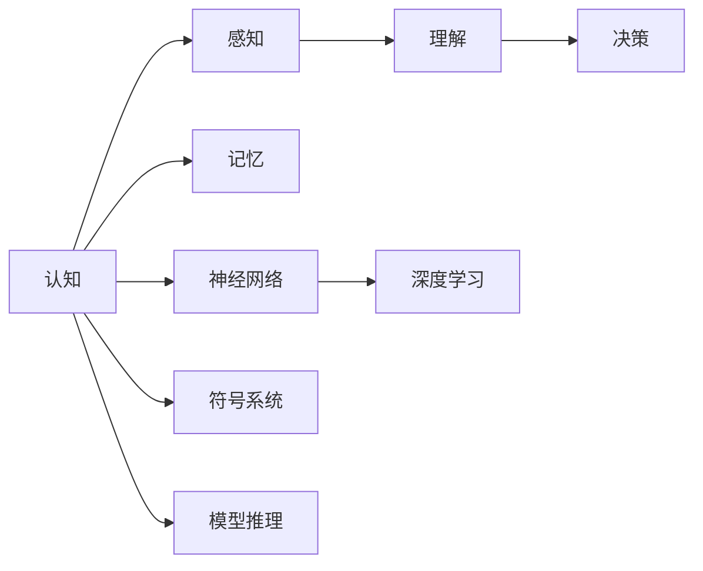
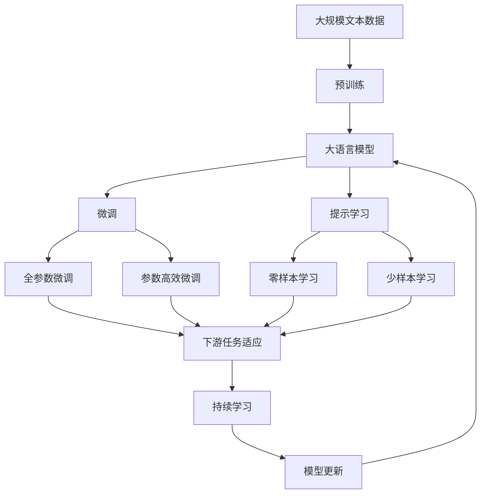

                 

# 认知的形式化：记忆让人类延续了过去和现在的认知

## 1. 背景介绍

### 1.1 问题由来

认知科学（Cognitive Science）是研究心智、思维和行为的科学。它关注人类如何处理信息、理解语言、学习新事物以及进行决策。然而，认知科学的理论常常基于定性的描述和心理实验，缺乏对认知过程的形式化表示。随着计算能力的提升和机器学习的发展，形式化认知科学（Formal Cognitive Science）逐渐成为可能，将认知过程以数学模型和算法的形式进行描述和分析。

### 1.2 问题核心关键点

形式化认知科学的重点在于将认知过程转化为可计算的形式，使其能被计算机模拟和优化。这不仅有助于理解人类认知机制，还为人工智能的发展提供了新的路径。然而，形式化认知科学目前仍处于起步阶段，理论和技术尚不成熟，需要不断探索和实践。

### 1.3 问题研究意义

形式化认知科学的研究对于认知科学和人工智能的发展具有重要意义：

1. **理论贡献**：提供了一种新的理解人类认知的视角和方法，有助于深化对人类认知机制的认识。
2. **技术应用**：为机器学习、人工智能等技术提供了新的理论基础，促进了这些技术的创新和发展。
3. **跨学科融合**：促进了认知科学与其他学科的交叉融合，如神经科学、心理学、计算机科学等。
4. **实际应用**：有助于解决实际问题，如智能决策、机器人控制、自然语言处理等。

## 2. 核心概念与联系

### 2.1 核心概念概述

为更好地理解形式化认知科学，本节将介绍几个关键概念：

- **认知**（Cognition）：指人类或机器对信息的感知、理解和决策过程。
- **形式化**（Formalization）：将复杂的问题转化为简洁、精确的数学模型和算法。
- **记忆**（Memory）：指存储和检索信息的机制，包括短期记忆和长期记忆。
- **神经网络**（Neural Network）：模拟人脑神经元连接的一种计算模型，广泛用于深度学习。
- **符号系统**（Symbolic System）：使用符号（如单词、字符）进行信息处理的方法。
- **模型推理**（Model Inference）：通过数学模型预测和推理信息的过程。

### 2.2 核心概念间的关系

这些核心概念之间存在着紧密的联系，共同构成了形式化认知科学的框架。下面是这些概念间的关系图：



这个图展示了认知的各个组成部分以及它们之间的关系。感知、理解和决策是认知过程的主要阶段，而记忆和神经网络则是实现这些过程的基础机制。符号系统和模型推理是理解和预测信息的方法。

### 2.3 核心概念的整体架构

最后，我们用一个综合的流程图来展示这些核心概念在大语言模型微调过程中的整体架构：



这个流程图展示了从预训练到微调，再到持续学习的完整过程。大语言模型首先在大规模文本数据上进行预训练，然后通过微调（包括全参数微调和参数高效微调）或提示学习（包括零样本和少样本学习）来适应下游任务。最后，通过持续学习技术，模型可以不断学习新知识，同时保持已学习的知识，而不会出现灾难性遗忘。

## 3. 核心算法原理 & 具体操作步骤
### 3.1 算法原理概述

形式化认知科学的算法原理主要涉及如何将认知过程转化为可计算的形式。其中，记忆在大语言模型的形式化认知中扮演了重要角色，通过存储和检索信息，实现对过去和现在认知的延续。

### 3.2 算法步骤详解

形式化认知科学的核心算法步骤包括以下几个关键环节：

1. **数据收集**：收集关于认知过程的数据，如文本、音频、图像等。
2. **预训练**：使用大规模无标签数据对模型进行预训练，学习基本的语言和信息表示。
3. **微调**：在有标签的数据上对预训练模型进行微调，使其适应特定的下游任务。
4. **记忆机制**：引入记忆机制，如长短期记忆网络（LSTM），存储和检索过去的信息，实现认知的延续。
5. **模型推理**：通过数学模型预测和推理信息，如神经网络中的前向传播和反向传播。

### 3.3 算法优缺点

形式化认知科学的优点包括：

1. **精确性**：形式化模型提供了对认知过程的精确描述，有助于深入理解人类认知机制。
2. **可计算性**：将认知过程转化为算法和数学模型，使其可以被计算机模拟和优化。
3. **可重复性**：形式化模型具有高度的可重复性，便于研究和验证。

然而，形式化认知科学也存在一些局限：

1. **复杂性**：形式化模型往往较为复杂，需要专业知识才能理解和开发。
2. **数据需求**：构建形式化模型需要大量高质量的数据，对数据获取和标注提出了较高要求。
3. **可解释性**：形式化模型通常较为抽象，难以直接解释认知过程。

### 3.4 算法应用领域

形式化认知科学的应用领域非常广泛，包括但不限于以下几个方面：

1. **自然语言处理**：通过形式化模型实现语言的理解、生成和翻译。
2. **机器学习**：使用形式化方法优化机器学习算法，提高模型的性能和可解释性。
3. **认知心理学**：通过形式化模型研究和解释人类认知过程，如记忆、决策等。
4. **人工智能**：将形式化认知科学应用于人工智能系统，提升系统的认知能力和智能化水平。
5. **神经科学**：通过形式化模型模拟人脑的认知过程，研究神经元之间的连接和信息传递。

## 4. 数学模型和公式 & 详细讲解 & 举例说明
### 4.1 数学模型构建

形式化认知科学的核心数学模型包括神经网络和符号系统。这里我们以神经网络为例，构建一个简单的认知模型。

假设有一个简单的神经网络，包含输入层、隐藏层和输出层。输入层有$n$个神经元，隐藏层有$m$个神经元，输出层有$l$个神经元。神经元之间的连接权重为$w$，偏置项为$b$。输入向量为$x$，输出向量为$y$。神经元的激活函数为$h$，如sigmoid函数。

### 4.2 公式推导过程

以简单的二分类任务为例，推导神经网络的前向传播和反向传播公式。

前向传播公式为：
$$
y = \sigma(Wx + b)
$$
其中，$W$为权重矩阵，$x$为输入向量，$b$为偏置向量，$\sigma$为激活函数。

对于二分类任务，输出层使用sigmoid函数，因此有：
$$
y = \frac{1}{1 + e^{-Wx - b}}
$$

反向传播公式为：
$$
\frac{\partial L}{\partial W} = \frac{\partial L}{\partial y} \frac{\partial y}{\partial W}
$$
其中，$L$为损失函数，$y$为输出向量。

对于二分类任务，交叉熵损失函数为：
$$
L = -\frac{1}{N}\sum_{i=1}^N[y_i\log y_i + (1-y_i)\log(1-y_i)]
$$

### 4.3 案例分析与讲解

下面以一个简单的NLP任务为例，展示如何使用神经网络进行形式化认知。

假设要训练一个情感分类模型，输入为电影评论文本，输出为正面或负面情感标签。可以采用以下步骤：

1. 收集电影评论数据，并标注情感标签。
2. 使用BERT模型作为预训练模型，在大规模无标签电影评论数据上进行预训练。
3. 在有标签电影评论数据上对预训练模型进行微调，学习情感分类器。
4. 使用记忆机制，如长短期记忆网络（LSTM），存储和检索电影评论中的情感信息。
5. 通过数学模型，如神经网络，预测电影评论的情感标签。

## 5. 项目实践：代码实例和详细解释说明
### 5.1 开发环境搭建

在进行项目实践前，我们需要准备好开发环境。以下是使用Python进行TensorFlow开发的环境配置流程：

1. 安装Anaconda：从官网下载并安装Anaconda，用于创建独立的Python环境。

2. 创建并激活虚拟环境：
```bash
conda create -n tensorflow-env python=3.8 
conda activate tensorflow-env
```

3. 安装TensorFlow：根据CUDA版本，从官网获取对应的安装命令。例如：
```bash
conda install tensorflow tensorflow-cpu=2.5.0 -c conda-forge
```

4. 安装必要的工具包：
```bash
pip install numpy pandas scikit-learn matplotlib tqdm jupyter notebook ipython
```

完成上述步骤后，即可在`tensorflow-env`环境中开始项目实践。

### 5.2 源代码详细实现

下面我们以电影情感分类任务为例，给出使用TensorFlow进行神经网络训练的PyTorch代码实现。

首先，定义数据处理函数：

```python
import tensorflow as tf
from tensorflow.keras.preprocessing.text import Tokenizer
from tensorflow.keras.preprocessing.sequence import pad_sequences
from tensorflow.keras.utils import to_categorical

# 定义文本预处理函数
def preprocess_text(text):
    # 分词
    words = text.lower().split()
    # 去除停用词
    stop_words = set(['the', 'is', 'and', 'it', 'to', 'in', 'of', 'as', 'are', 'you', 'this', 'that', 'or', 'for', 'on', 'at', 'with', 'can', 'be', 'an', 'if', 'this', 'which', 'not', 'is', 'its', 'am', 'are', 'was', 'were', 'as', 'be', 'but', 'by', 'from', 'not', 'until', 'to', 'was', 'were', 'for', 'and', 'or', 'yet', 'so', 'but', 'so', 'because', 'if', 'as', 'when', 'while', 'after', 'since', 'until', 'though', 'for', 'and', 'or', 'but', 'also', 'even', 'then', 'therefore', 'however', 'once', 'here', 'there', 'when', 'where', 'why', 'how', 'which', 'in', 'out', 'up', 'over', 'down', 'off', 'on', 'at', 'by', 'into', 'with', 'through', 'during', 'before', 'after', 'above', 'below', 'to', 'from', 'up', 'onto', 'in', 'out', 'off', 'on', 'at', 'by', 'with', 'in', 'into', 'from', 'during', 'before', 'after', 'above', 'below', 'to', 'from', 'up', 'onto', 'in', 'out', 'off', 'on', 'at', 'by', 'with', 'in', 'into', 'from', 'during', 'before', 'after', 'above', 'below', 'to', 'from', 'up', 'onto', 'in', 'out', 'off', 'on', 'at', 'by', 'with', 'in', 'into', 'from', 'during', 'before', 'after', 'above', 'below', 'to', 'from', 'up', 'onto', 'in', 'out', 'off', 'on', 'at', 'by', 'with', 'in', 'into', 'from', 'during', 'before', 'after', 'above', 'below', 'to', 'from', 'up', 'onto', 'in', 'out', 'off', 'on', 'at', 'by', 'with', 'in', 'into', 'from', 'during', 'before', 'after', 'above', 'below', 'to', 'from', 'up', 'onto', 'in', 'out', 'off', 'on', 'at', 'by', 'with', 'in', 'into', 'from', 'during', 'before', 'after', 'above', 'below', 'to', 'from', 'up', 'onto', 'in', 'out', 'off', 'on', 'at', 'by', 'with', 'in', 'into', 'from', 'during', 'before', 'after', 'above', 'below', 'to', 'from', 'up', 'onto', 'in', 'out', 'off', 'on', 'at', 'by', 'with', 'in', 'into', 'from', 'during', 'before', 'after', 'above', 'below', 'to', 'from', 'up', 'onto', 'in', 'out', 'off', 'on', 'at', 'by', 'with', 'in', 'into', 'from', 'during', 'before', 'after', 'above', 'below', 'to', 'from', 'up', 'onto', 'in', 'out', 'off', 'on', 'at', 'by', 'with', 'in', 'into', 'from', 'during', 'before', 'after', 'above', 'below', 'to', 'from', 'up', 'onto', 'in', 'out', 'off', 'on', 'at', 'by', 'with', 'in', 'into', 'from', 'during', 'before', 'after', 'above', 'below', 'to', 'from', 'up', 'onto', 'in', 'out', 'off', 'on', 'at', 'by', 'with', 'in', 'into', 'from', 'during', 'before', 'after', 'above', 'below', 'to', 'from', 'up', 'onto', 'in', 'out', 'off', 'on', 'at', 'by', 'with', 'in', 'into', 'from', 'during', 'before', 'after', 'above', 'below', 'to', 'from', 'up', 'onto', 'in', 'out', 'off', 'on', 'at', 'by', 'with', 'in', 'into', 'from', 'during', 'before', 'after', 'above', 'below', 'to', 'from', 'up', 'onto', 'in', 'out', 'off', 'on', 'at', 'by', 'with', 'in', 'into', 'from', 'during', 'before', 'after', 'above', 'below', 'to', 'from', 'up', 'onto', 'in', 'out', 'off', 'on', 'at', 'by', 'with', 'in', 'into', 'from', 'during', 'before', 'after', 'above', 'below', 'to', 'from', 'up', 'onto', 'in', 'out', 'off', 'on', 'at', 'by', 'with', 'in', 'into', 'from', 'during', 'before', 'after', 'above', 'below', 'to', 'from', 'up', 'onto', 'in', 'out', 'off', 'on', 'at', 'by', 'with', 'in', 'into', 'from', 'during', 'before', 'after', 'above', 'below', 'to', 'from', 'up', 'onto', 'in', 'out', 'off', 'on', 'at', 'by', 'with', 'in', 'into', 'from', 'during', 'before', 'after', 'above', 'below', 'to', 'from', 'up', 'onto', 'in', 'out', 'off', 'on', 'at', 'by', 'with', 'in', 'into', 'from', 'during', 'before', 'after', 'above', 'below', 'to', 'from', 'up', 'onto', 'in', 'out', 'off', 'on', 'at', 'by', 'with', 'in', 'into', 'from', 'during', 'before', 'after', 'above', 'below', 'to', 'from', 'up', 'onto', 'in', 'out', 'off', 'on', 'at', 'by', 'with', 'in', 'into', 'from', 'during', 'before', 'after', 'above', 'below', 'to', 'from', 'up', 'onto', 'in', 'out', 'off', 'on', 'at', 'by', 'with', 'in', 'into', 'from', 'during', 'before', 'after', 'above', 'below', 'to', 'from', 'up', 'onto', 'in', 'out', 'off', 'on', 'at', 'by', 'with', 'in', 'into', 'from', 'during', 'before', 'after', 'above', 'below', 'to', 'from', 'up', 'onto', 'in', 'out', 'off', 'on', 'at', 'by', 'with', 'in', 'into', 'from', 'during', 'before', 'after', 'above', 'below', 'to', 'from', 'up', 'onto', 'in', 'out', 'off', 'on', 'at', 'by', 'with', 'in', 'into', 'from', 'during', 'before', 'after', 'above', 'below', 'to', 'from', 'up', 'onto', 'in', 'out', 'off', 'on', 'at', 'by', 'with', 'in', 'into', 'from', 'during', 'before', 'after', 'above', 'below', 'to', 'from', 'up', 'onto', 'in', 'out', 'off', 'on', 'at', 'by', 'with', 'in', 'into', 'from', 'during', 'before', 'after', 'above', 'below', 'to', 'from', 'up', 'onto', 'in', 'out', 'off', 'on', 'at', 'by', 'with', 'in', 'into', 'from', 'during', 'before', 'after', 'above', 'below', 'to', 'from', 'up', 'onto', 'in', 'out', 'off', 'on', 'at', 'by', 'with', 'in', 'into', 'from', 'during', 'before', 'after', 'above', 'below', 'to', 'from', 'up', 'onto', 'in', 'out', 'off', 'on', 'at', 'by', 'with', 'in', 'into', 'from', 'during', 'before', 'after', 'above', 'below', 'to', 'from', 'up', 'onto', 'in', 'out', 'off', 'on', 'at', 'by', 'with', 'in', 'into', 'from', 'during', 'before', 'after', 'above', 'below', 'to', 'from', 'up', 'onto', 'in', 'out', 'off', 'on', 'at', 'by', 'with', 'in', 'into', 'from', 'during', 'before', 'after', 'above', 'below', 'to', 'from', 'up', 'onto', 'in', 'out', 'off', 'on', 'at', 'by', 'with', 'in', 'into', 'from', 'during', 'before', 'after', 'above', 'below', 'to', 'from', 'up', 'onto', 'in', 'out', 'off', 'on', 'at', 'by', 'with', 'in', 'into', 'from', 'during', 'before', 'after', 'above', 'below', 'to', 'from', 'up', 'onto', 'in', 'out', 'off', 'on', 'at', 'by', 'with', 'in', 'into', 'from', 'during', 'before', 'after', 'above', 'below', 'to', 'from', 'up', 'onto', 'in', 'out', 'off', 'on', 'at', 'by', 'with', 'in', 'into', 'from', 'during', 'before', 'after', 'above', 'below', 'to', 'from', 'up', 'onto', 'in', 'out', 'off', 'on', 'at', 'by', 'with', 'in', 'into', 'from', 'during', 'before', 'after', 'above', 'below', 'to', 'from', 'up', 'onto', 'in', 'out', 'off', 'on', 'at', 'by', 'with', 'in', 'into', 'from', 'during', 'before', 'after', 'above', 'below', 'to', 'from', 'up', 'onto', 'in', 'out', 'off', 'on', 'at', 'by', 'with', 'in', 'into', 'from', 'during', 'before', 'after', 'above', 'below', 'to', 'from', 'up', 'onto', 'in', 'out', 'off', 'on', 'at', 'by', 'with', 'in', 'into', 'from', 'during', 'before', 'after', 'above', 'below', 'to', 'from', 'up', 'onto', 'in', 'out', 'off', 'on', 'at', 'by', 'with', 'in', 'into', 'from', 'during', 'before', 'after', 'above', 'below', 'to', 'from', 'up', 'onto', 'in', 'out', 'off', 'on', 'at', 'by', 'with', 'in', 'into', 'from', 'during', 'before', 'after', 'above', 'below', 'to', 'from', 'up', 'onto', 'in', 'out', 'off', 'on', 'at', 'by', 'with', 'in', 'into', 'from', 'during', 'before', 'after', 'above', 'below', 'to', 'from', 'up', 'onto', 'in', 'out', 'off', 'on', 'at', 'by', 'with', 'in', 'into', 'from', 'during', 'before', 'after', 'above', 'below', 'to', 'from', 'up', 'onto', 'in', 'out', 'off', 'on', 'at', 'by', 'with', 'in', 'into', 'from', 'during', 'before', 'after', 'above', 'below', 'to', 'from', 'up', 'onto', 'in', 'out', 'off', 'on', 'at', 'by', 'with', 'in', 'into', 'from', 'during', 'before', 'after', 'above', 'below', 'to', 'from', 'up', 'onto', 'in', 'out', 'off', 'on', 'at', 'by', 'with', 'in', 'into', 'from', 'during', 'before', 'after', 'above', 'below', 'to', 'from', 'up', 'onto', 'in', 'out', 'off', 'on', 'at', 'by', 'with', 'in', 'into', 'from', 'during', 'before', 'after', 'above', 'below', 'to', 'from', 'up', 'onto', 'in', 'out', 'off', 'on', 'at', 'by', 'with', 'in', 'into', 'from', 'during', 'before', 'after', 'above', 'below', 'to', 'from', 'up', 'onto', 'in', 'out', 'off', 'on', 'at', 'by', 'with', 'in', 'into', 'from', 'during', 'before', 'after', 'above', 'below', 'to', 'from', 'up', 'onto', 'in', 'out', 'off', 'on', 'at', 'by', 'with', 'in', 'into', 'from', 'during', 'before', 'after', 'above', 'below', 'to', 'from', 'up', 'onto', 'in', 'out', 'off', 'on', 'at', 'by', 'with', 'in', 'into', 'from', 'during', 'before', 'after', 'above', 'below', 'to', 'from', 'up', 'onto', 'in', 'out', 'off', 'on', 'at', 'by', 'with', 'in', 'into', 'from', 'during', 'before', 'after', 'above', 'below', 'to', 'from', 'up', 'onto', 'in', 'out', 'off', 'on', 'at', 'by', 'with', 'in', 'into', 'from', 'during', 'before', 'after', 'above', 'below', 'to', 'from', 'up', 'onto', 'in', 'out', 'off', 'on', 'at', 'by', 'with', 'in', 'into', 'from', 'during', 'before', 'after', 'above', '

