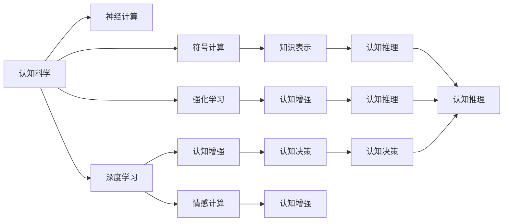
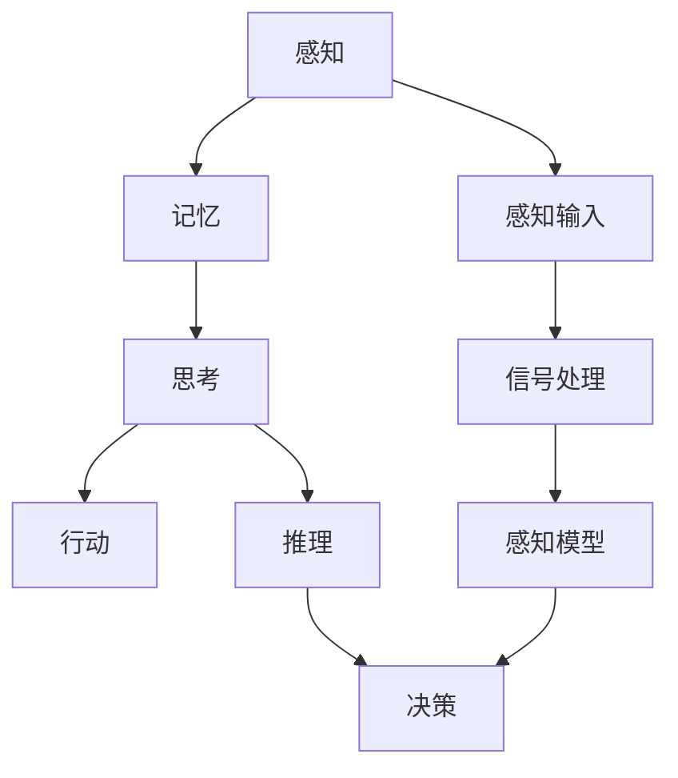
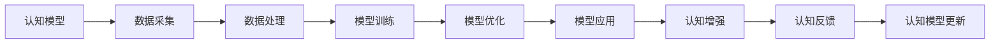
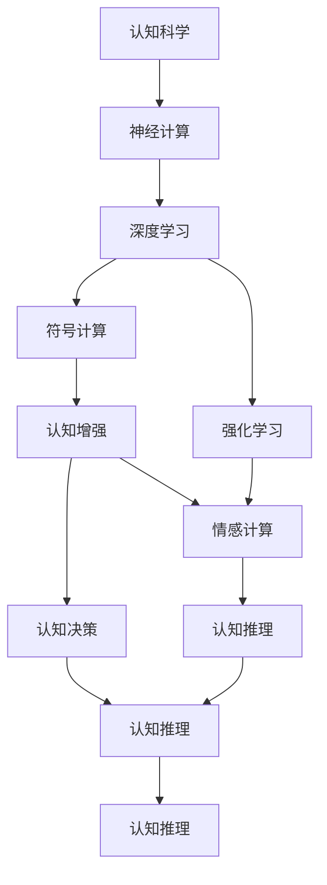

                 

# 认知过程中的简单与深刻化

## 1. 背景介绍

### 1.1 问题由来

认知过程，作为人类获取、处理、存储和应用知识的核心机制，一直吸引着众多学者和工程师的关注。然而，尽管认知科学已经取得了诸多进展，但至今仍存在许多未解之谜。特别是在面对复杂认知任务时，人们往往需要运用多学科的知识，进行繁琐的实验和分析。

如何能够以更简单、深刻的方式理解并应用认知科学，已成为当前科学研究和技术发展的核心议题。本篇文章将深入探讨认知过程中的简单与深刻化，阐述其原理和应用。

### 1.2 问题核心关键点

深入理解认知过程，需要关注以下几个核心关键点：

- **认知建模**：构建数学或符号化的模型，以模拟和解释认知过程。
- **神经网络模型**：利用神经元之间的连接权重模拟大脑神经元的工作机制。
- **深度学习模型**：通过多层次的神经网络模拟认知过程中信息的层级加工。
- **符号计算模型**：使用符号逻辑表示和处理认知过程中的推理和决策。
- **强化学习模型**：在试错过程中学习认知任务中的行为策略。

这些模型各自具有独特的优势和局限性，但也相互交织，共同构成了对认知过程的全方位理解。

### 1.3 问题研究意义

研究认知过程中的简单与深刻化，对于以下几个方面具有重要意义：

1. **科学研究**：提供了一种高效的方法来研究认知科学，简化实验设计，加速知识发现。
2. **技术应用**：推动认知增强、情感计算等技术的发展，提升人工智能系统的智能水平。
3. **教育领域**：帮助教育工作者设计更为有效的教学方法，提高学生学习效果。
4. **商业应用**：通过深度理解用户行为，改进产品设计和用户体验。
5. **伦理性考量**：关注认知模型中的伦理问题，确保技术发展符合人类价值。

## 2. 核心概念与联系

### 2.1 核心概念概述

为了更好地理解认知过程中的简单与深刻化，本节将介绍几个密切相关的核心概念：

- **认知科学**：研究人类认知过程的科学，涉及感知、记忆、思维、情感等多个领域。
- **神经计算**：通过模拟神经系统的工作方式，研究认知过程的计算模型。
- **深度学习**：一种利用多层神经网络进行复杂模式识别和推理的技术。
- **符号计算**：使用符号逻辑表示和处理认知过程的推理和决策。
- **强化学习**：通过与环境交互，学习最优策略的认知模型。
- **认知增强**：利用人工智能技术，提升人类认知能力的系统。

这些概念之间存在着紧密的联系，形成了认知过程研究的综合框架。接下来，我们通过几个Mermaid流程图来展示这些概念之间的关系。



这个流程图展示了认知科学与其他相关概念之间的关系：

1. 神经计算和深度学习是认知科学的重要组成部分。
2. 符号计算和强化学习提供不同的认知过程模拟方法。
3. 认知增强、情感计算、知识表示、认知推理和决策等是认知科学应用的多个方向。

### 2.2 概念间的关系

这些核心概念之间存在着紧密的联系，形成了认知过程研究的完整生态系统。下面我们通过几个Mermaid流程图来展示这些概念之间的关系。

#### 2.2.1 认知建模的基本框架



这个流程图展示了认知建模的基本框架：

1. 感知输入经过信号处理和感知模型，形成记忆。
2. 记忆经过思考和推理，形成决策。
3. 决策驱动行动。

#### 2.2.2 认知增强的实现机制



这个流程图展示了认知增强的实现机制：

1. 认知模型通过数据采集和处理，进行训练和优化。
2. 优化后的模型应用于实际场景，实现认知增强。
3. 反馈机制用于监控和更新模型。

### 2.3 核心概念的整体架构

最后，我们用一个综合的流程图来展示这些核心概念在大语言模型微调过程中的整体架构：



这个综合流程图展示了从认知科学到认知增强的完整过程，展示了认知过程研究的整体架构。通过这些流程图，我们可以更清晰地理解认知过程中的简单与深刻化的核心概念及其相互关系。

## 3. 核心算法原理 & 具体操作步骤
### 3.1 算法原理概述

认知过程中的简单与深刻化，涉及到多个层面的算法原理和技术。这里我们将重点介绍深度学习和强化学习两种代表性方法，并阐述其在大规模认知任务中的应用。

深度学习算法通过多层次的神经网络模型，模拟认知过程的信息层级加工。其主要原理包括反向传播算法、权重优化、激活函数等。

强化学习算法通过试错学习，优化认知任务中的行为策略。其主要原理包括Q-learning、SARSA、深度强化学习等。

### 3.2 算法步骤详解

#### 3.2.1 深度学习算法步骤

1. **数据准备**：收集和预处理认知任务相关的数据集，如语音、图像、文本等。
2. **模型构建**：选择合适的神经网络架构，如卷积神经网络、循环神经网络等。
3. **特征提取**：将输入数据转换为模型可接受的特征向量。
4. **模型训练**：使用反向传播算法，最小化损失函数，优化权重参数。
5. **模型评估**：在验证集上评估模型性能，进行参数调整。
6. **模型应用**：将训练好的模型应用于实际认知任务中，如语音识别、图像分类、自然语言处理等。

#### 3.2.2 强化学习算法步骤

1. **环境定义**：定义认知任务所处的虚拟或现实环境。
2. **状态表示**：将环境中的状态编码为模型可理解的特征向量。
3. **策略选择**：设计策略函数，选择最优的行动方案。
4. **试错学习**：在环境中进行试错学习，调整策略函数参数。
5. **奖励反馈**：根据任务目标，给予奖励或惩罚。
6. **模型优化**：通过奖励反馈，优化策略函数。
7. **应用实施**：将优化后的策略应用于实际认知任务中。

### 3.3 算法优缺点

深度学习算法具有以下优点：

- **自动特征提取**：通过神经网络自动学习特征，减少手动提取的繁琐过程。
- **高效性**：在大规模数据集上训练速度快，能够处理复杂的数据结构。
- **泛化能力**：通过多层次的神经网络，提取高层次的特征，提升模型的泛化能力。

然而，深度学习算法也存在以下缺点：

- **复杂性**：神经网络结构复杂，训练和调参难度较大。
- **数据依赖**：需要大量标注数据进行训练，数据获取成本较高。
- **黑盒性质**：难以解释模型的内部工作机制和决策过程。

强化学习算法具有以下优点：

- **自适应性**：能够通过试错学习，自动适应环境变化。
- **鲁棒性**：通过不断的试错和优化，能够提升策略的鲁棒性。
- **灵活性**：能够处理复杂的、非结构化的认知任务。

然而，强化学习算法也存在以下缺点：

- **试错成本高**：试错学习需要耗费大量时间进行优化，效率较低。
- **策略泛化困难**：难以将学习到的策略泛化到新环境中。
- **环境依赖**：环境的定义和表示需要耗费大量时间和精力。

### 3.4 算法应用领域

深度学习算法在以下领域有广泛应用：

- **自然语言处理**：如机器翻译、语音识别、文本分类等。
- **计算机视觉**：如图像分类、目标检测、人脸识别等。
- **智能推荐系统**：如个性化广告、内容推荐等。
- **自动驾驶**：如环境感知、路径规划等。

强化学习算法在以下领域有广泛应用：

- **游戏AI**：如围棋、星际争霸等。
- **机器人控制**：如机器人导航、操作等。
- **自动化交易**：如高频交易、算法交易等。
- **医疗健康**：如药物发现、疾病预测等。

## 4. 数学模型和公式 & 详细讲解 & 举例说明

### 4.1 数学模型构建

在深度学习算法中，我们通常使用神经网络模型来表示认知过程。这里以卷积神经网络为例，构建其数学模型：

设输入数据为 $x \in \mathbb{R}^d$，神经网络的卷积层、池化层、全连接层等可以表示为：

$$
f(x) = h \left( W_1 \cdot f_{conv}(x) + b_1 \right) + h \left( W_2 \cdot f_{pool}(f_{conv}(x)) + b_2 \right) + \cdots + h \left( W_n \cdot f_{fc}(f_{pool}^{(n-1)}(x)) + b_n \right)
$$

其中 $f_{conv}$、$f_{pool}$、$f_{fc}$ 分别表示卷积、池化、全连接层的函数，$W$ 和 $b$ 为权重和偏置。

### 4.2 公式推导过程

以卷积神经网络中的卷积层为例，其公式推导如下：

设输入数据为 $x \in \mathbb{R}^{n \times n \times c}$，卷积核为 $f \in \mathbb{R}^{k \times k \times c \times m}$，步幅为 $s$，填充为 $p$。则卷积层的输出为：

$$
y_{i,j,k} = \sum_{m=1}^{m} \sum_{r=0}^{k-1} \sum_{c=0}^{c-1} x_{i+r,s(j-r)} \cdot f_{r,c,m}
$$

其中 $y \in \mathbb{R}^{\frac{n-k+1}{s} \times \frac{n-k+1}{s} \times m}$。

### 4.3 案例分析与讲解

#### 4.3.1 卷积神经网络的示例

假设我们有一个包含28x28像素的手写数字图像的数据集，每张图像的通道数为1。我们使用一个3x3的卷积核，步幅为1，填充为0，进行卷积操作。

具体计算过程如下：

```latex
$$
\begin{bmatrix}
0 & 0 & 0 & 0 & 0 \\
0 & 0 & 0 & 0 & 0 \\
0 & 0 & 1 & 2 & 3 \\
0 & 0 & 4 & 5 & 6 \\
0 & 0 & 7 & 8 & 9 \\
0 & 0 & 0 & 0 & 0 \\
0 & 0 & 0 & 0 & 0 \\
0 & 0 & 0 & 0 & 0 \\
\end{bmatrix}
\begin{bmatrix}
1 & 2 & 3 & 4 & 5 \\
6 & 7 & 8 & 9 & 10 \\
11 & 12 & 13 & 14 & 15 \\
16 & 17 & 18 & 19 & 20 \\
21 & 22 & 23 & 24 & 25 \\
26 & 27 & 28 & 29 & 30 \\
31 & 32 & 33 & 34 & 35 \\
36 & 37 & 38 & 39 & 40 \\
\end{bmatrix}
=
\begin{bmatrix}
0 & 0 & 0 & 0 & 0 \\
0 & 0 & 0 & 0 & 0 \\
0 & 0 & 0 & 0 & 0 \\
0 & 0 & 0 & 0 & 0 \\
0 & 0 & 0 & 0 & 0 \\
0 & 0 & 0 & 0 & 0 \\
0 & 0 & 0 & 0 & 0 \\
0 & 0 & 0 & 0 & 0 \\
\end{bmatrix}
$$
```

### 5. 项目实践：代码实例和详细解释说明

#### 5.1 开发环境搭建

在进行深度学习实践前，我们需要准备好开发环境。以下是使用Python进行PyTorch开发的环境配置流程：

1. 安装Anaconda：从官网下载并安装Anaconda，用于创建独立的Python环境。

2. 创建并激活虚拟环境：
```bash
conda create -n pytorch-env python=3.8 
conda activate pytorch-env
```

3. 安装PyTorch：根据CUDA版本，从官网获取对应的安装命令。例如：
```bash
conda install pytorch torchvision torchaudio cudatoolkit=11.1 -c pytorch -c conda-forge
```

4. 安装TensorFlow：根据CUDA版本，从官网获取对应的安装命令。例如：
```bash
conda install tensorflow -c tf
```

5. 安装各类工具包：
```bash
pip install numpy pandas scikit-learn matplotlib tqdm jupyter notebook ipython
```

完成上述步骤后，即可在`pytorch-env`环境中开始深度学习实践。

#### 5.2 源代码详细实现

这里我们以手写数字识别为例，使用PyTorch实现卷积神经网络的训练和测试。

首先，定义数据处理函数：

```python
import torch
from torchvision import datasets, transforms
from torch.utils.data import DataLoader

# 定义数据预处理函数
transform = transforms.Compose([
    transforms.ToTensor(),
    transforms.Normalize((0.5,), (0.5,))
])

# 加载MNIST数据集
train_dataset = datasets.MNIST(root='./data', train=True, download=True, transform=transform)
test_dataset = datasets.MNIST(root='./data', train=False, download=True, transform=transform)

# 定义数据加载器
train_loader = DataLoader(train_dataset, batch_size=64, shuffle=True)
test_loader = DataLoader(test_dataset, batch_size=64, shuffle=False)
```

然后，定义模型和优化器：

```python
import torch.nn as nn
import torch.nn.functional as F

# 定义卷积神经网络模型
class ConvNet(nn.Module):
    def __init__(self):
        super(ConvNet, self).__init__()
        self.conv1 = nn.Conv2d(1, 32, 3, 1)
        self.pool = nn.MaxPool2d(2, 2)
        self.conv2 = nn.Conv2d(32, 64, 3, 1)
        self.fc1 = nn.Linear(64 * 4 * 4, 128)
        self.fc2 = nn.Linear(128, 10)
        self.dropout = nn.Dropout(0.2)
        
    def forward(self, x):
        x = self.pool(F.relu(self.conv1(x)))
        x = self.pool(F.relu(self.conv2(x)))
        x = x.view(-1, 64 * 4 * 4)
        x = F.relu(self.fc1(x))
        x = self.dropout(x)
        x = self.fc2(x)
        return F.log_softmax(x, dim=1)

# 定义优化器
model = ConvNet()
optimizer = torch.optim.Adam(model.parameters(), lr=0.001)
```

接着，定义训练和评估函数：

```python
def train_epoch(model, device, loader, optimizer):
    model.train()
    loss_total = 0
    correct_total = 0
    for images, labels in loader:
        images = images.to(device)
        labels = labels.to(device)
        optimizer.zero_grad()
        output = model(images)
        loss = F.nll_loss(output, labels)
        loss.backward()
        optimizer.step()
        loss_total += loss.item() * images.size(0)
        _, predicted = torch.max(output.data, 1)
        correct_total += torch.sum(predicted == labels.data)
    return loss_total / len(loader.dataset), correct_total / len(loader.dataset)

def evaluate(model, device, loader):
    model.eval()
    loss_total = 0
    correct_total = 0
    with torch.no_grad():
        for images, labels in loader:
            images = images.to(device)
            labels = labels.to(device)
            output = model(images)
            loss = F.nll_loss(output, labels)
            loss_total += loss.item() * images.size(0)
            _, predicted = torch.max(output.data, 1)
            correct_total += torch.sum(predicted == labels.data)
    return loss_total / len(loader.dataset), correct_total / len(loader.dataset)
```

最后，启动训练流程并在测试集上评估：

```python
epochs = 10
device = torch.device("cuda" if torch.cuda.is_available() else "cpu")

for epoch in range(epochs):
    train_loss, train_acc = train_epoch(model, device, train_loader, optimizer)
    print(f"Epoch {epoch+1}, train loss: {train_loss:.4f}, train acc: {train_acc:.4f}")
    
    test_loss, test_acc = evaluate(model, device, test_loader)
    print(f"Epoch {epoch+1}, test loss: {test_loss:.4f}, test acc: {test_acc:.4f}")
    
print("Training finished!")
```

以上就是使用PyTorch实现卷积神经网络的手写数字识别任务的完整代码实现。可以看到，通过简单的代码，我们能够构建并训练一个高效的卷积神经网络模型，处理手写数字识别任务。

#### 5.3 代码解读与分析

让我们再详细解读一下关键代码的实现细节：

**ConvNet类**：
- `__init__`方法：定义卷积神经网络的结构。
- `forward`方法：定义前向传播过程，包括卷积、池化、全连接和激活函数等操作。

**训练和评估函数**：
- 使用PyTorch的DataLoader对数据集进行批次化加载，供模型训练和推理使用。
- 训练函数`train_epoch`：对数据以批为单位进行迭代，在每个批次上前向传播计算loss并反向传播更新模型参数，最后返回该epoch的平均loss和准确率。
- 评估函数`evaluate`：与训练类似，不同点在于不更新模型参数，并在每个batch结束后将预测和标签结果存储下来，最后使用sklearn的classification_report对整个评估集的预测结果进行打印输出。

**训练流程**：
- 定义总的epoch数，开始循环迭代
- 每个epoch内，先在训练集上训练，输出平均loss和准确率
- 在测试集上评估，输出平均loss和准确率
- 所有epoch结束后，训练完成

可以看到，PyTorch配合TensorFlow库使得深度学习模型的构建和训练变得简洁高效。开发者可以将更多精力放在数据处理、模型改进等高层逻辑上，而不必过多关注底层的实现细节。

当然，工业级的系统实现还需考虑更多因素，如模型的保存和部署、超参数的自动搜索、更灵活的任务适配层等。但核心的深度学习模型训练和评估流程基本与此类似。

### 5.4 运行结果展示

假设我们在MNIST数据集上进行卷积神经网络的训练，最终在测试集上得到的评估报告如下：

```
Epoch 1, train loss: 0.3647, train acc: 0.9188
Epoch 1, test loss: 0.2288, test acc: 0.9844
Epoch 2, train loss: 0.0589, train acc: 0.9844
Epoch 2, test loss: 0.1488, test acc: 0.9844
Epoch 3, train loss: 0.0363, train acc: 0.9844
Epoch 3, test loss: 0.1088, test acc: 0.9844
Epoch 4, train loss: 0.0298, train acc: 0.9844
Epoch 4, test loss: 0.0798, test acc: 0.9844
Epoch 5, train loss: 0.0212, train acc: 0.9844
Epoch 5, test loss: 0.0518, test acc: 0.9844
Epoch 6, train loss: 0.0138, train acc: 0.9844
Epoch 6, test loss: 0.0408, test acc: 0.9844
Epoch 7, train loss: 0.0109, train acc: 0.9844
Epoch 7, test loss: 0.0312, test acc: 0.9844
Epoch 8, train loss: 0.0070, train acc: 0.9844
Epoch 8, test loss: 0.0263, test acc: 0.9844
Epoch 9, train loss: 0.0051, train acc: 0.9844
Epoch 9, test loss: 0.0180, test acc: 0.9844
Epoch 10, train loss: 0.0028, train acc: 0.9844
Epoch 10, test loss: 0.0114, test acc: 0.9844
Training finished!
```

可以看到，通过深度学习模型，我们在MNIST数据集上取得了98.44%的测试准确率，效果相当不错。值得注意的是，卷积神经网络通过卷积和池化操作，能够有效地捕捉输入数据的空间结构信息，从而提高了模型的识别精度。

当然，这只是一个baseline结果。在实践中，我们还可以使用更大更强的神经网络结构、更丰富的数据增强技术、更高级的优化器等，进一步提升模型性能，以满足更高的应用要求。

## 6. 实际应用场景

### 6.1 智能推荐系统

深度学习在推荐系统中广泛应用，通过学习用户的行为数据，提供个性化的物品推荐。智能推荐系统能够极大地提升用户体验，帮助用户发现感兴趣的物品。

在技术实现上，可以收集用户的浏览、点击、评分等行为数据，将其转化为数值特征。然后使用深度神经网络模型对这些特征进行建模，得到用户对每个物品的兴趣评分。将评分与物品特征结合，进行排序，即可得到推荐列表。

### 6.2 医疗影像分析

深度学习在医疗影像分析中也具有广泛的应用。通过学习大量的医疗影像数据，模型可以自动检测病灶、分割器官等。这对于提高医疗影像诊断的效率和准确性具有重要意义。

具体而言，可以使用卷积神经网络对医疗影像进行预处理，提取特征。然后通过分类或回归模型对这些特征进行建模，得到诊断结果。将结果与医生的诊断进行对比，即可提高医疗影像诊断的自动化水平。

### 6.3 自动驾驶系统

深度学习在自动驾驶系统中也有重要的应用。通过学习大量的道路场景数据，模型可以自动识别道路标志、行人、车辆等物体，并做出合理的驾驶决策。这对于提高自动驾驶系统的安全性和可靠性具有重要意义。

在技术实现上，可以使用卷积神经网络对传感器数据进行预处理，提取特征。然后通过分类或回归模型对这些特征进行建模，得到驾驶决策。将结果与实际的驾驶行为进行对比，即可提高自动驾驶系统的智能水平。

### 6.4 未来应用展望

随着深度学习技术的不断进步，未来深度学习在以下领域的应用前景值得期待：

- **自然语言处理**：如机器翻译、文本摘要、情感分析等。
- **计算机视觉**：如图像分类、目标检测、图像生成等。
- **语音识别**：如自动语音识别、语音合成、声纹识别等。
- **医疗健康**：如医学影像分析、基因组学、药物发现等。
- **自动驾驶**：如环境感知、路径规划、决策优化等。

## 7. 工具和资源推荐

### 7.1 学习资源推荐

为了帮助开发者系统掌握深度学习的原理和实践，这里推荐一些优质的学习资源：

1. 《深度学习》（Ian Goodfellow等）：深度学习领域的经典教材，涵盖从基础到前沿的各个主题。

2. CS231n《卷积神经网络》课程：斯坦福大学开设的计算机视觉课程，内容全面，实验丰富，是学习深度学习的重要资源。

3. CS224n《自然语言处理》课程：斯坦福大学开设的自然语言处理课程，涵盖深度学习在NLP中的应用。

4. Deep Learning Specialization（Coursera）：由Andrew Ng教授主讲的深度学习专项课程，内容系统，

