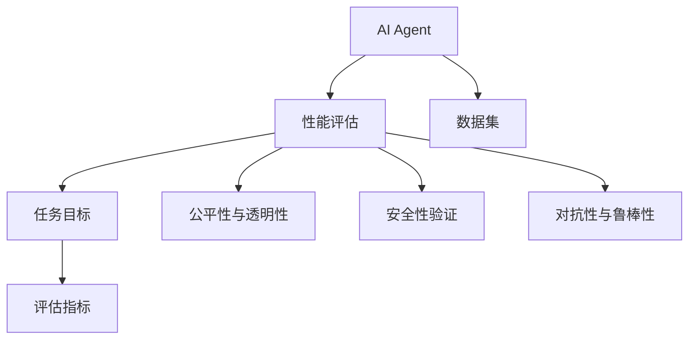
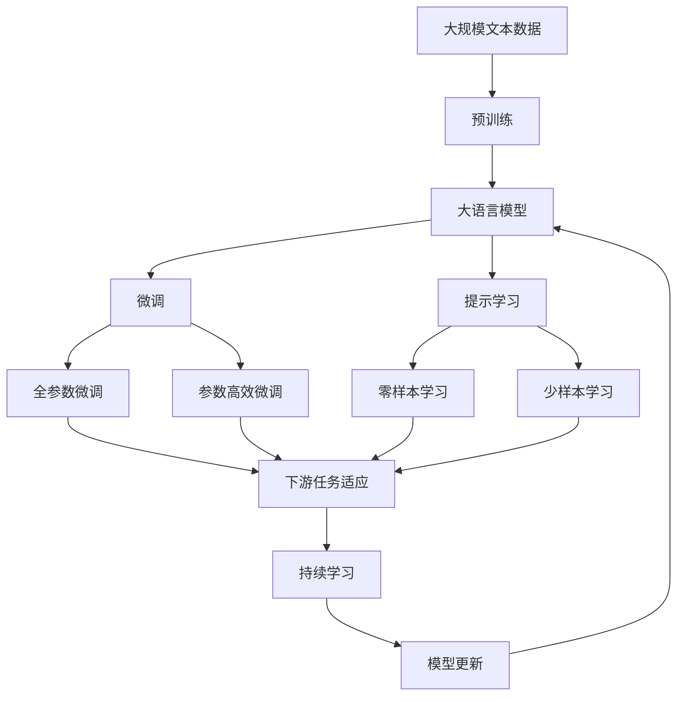

                 

# 评估AI Agent性能的重要性

## 1. 背景介绍

### 1.1 问题由来

人工智能(AI)技术的迅猛发展，使得智能体(Agent)在诸多领域的应用变得越来越普遍。无论是自动驾驶、智能客服，还是金融预测、医疗诊断，智能体已经展现出了显著的智能化水平。然而，智能体的应用离不开性能评估，只有通过科学的评估方法，才能保证其可靠性和有效性。

### 1.2 问题核心关键点

评估AI Agent性能，不仅涉及对智能体本身表现的测评，还关乎其在实际应用场景中的稳定性和适应性。核心关键点包括：

- **任务目标与指标**：明确智能体的具体应用场景和预期效果，并设计合理的评估指标。
- **数据集选择与构建**：选择合适的测试数据集，确保其代表性和全面性。
- **评估方法和技术**：采用有效的评估方法，如统计学测试、可视化分析等，确保评估结果的准确性和可靠性。
- **对抗性与鲁棒性**：评估智能体在对抗性、鲁棒性等方面的表现，确保其适应多变复杂的环境。
- **公平性与透明性**：确保评估过程中的公平性和透明性，避免偏见和误导。

### 1.3 问题研究意义

评估AI Agent性能对确保其在实际应用中的效果、安全性和可靠性至关重要：

- **效果评估**：通过评估，可以准确了解智能体在不同任务上的表现，为后续优化提供依据。
- **安全性验证**：评估智能体的安全性，防止其在面对恶意攻击或异常输入时出现不稳定行为。
- **公平性保证**：确保智能体在所有用户群体中的公平性，避免对某些群体的偏见。
- **透明度提升**：通过透明的评估过程，提高智能体应用的信任度和可接受性。

## 2. 核心概念与联系

### 2.1 核心概念概述

为了深入理解AI Agent性能评估，本节将介绍几个关键概念：

- **AI Agent**：指能够在复杂环境中自主学习、推理和决策的智能体，如自动驾驶车、聊天机器人等。
- **性能评估**：通过各种方法和工具，对AI Agent的性能进行全面系统的评估，包括准确性、可靠性、鲁棒性等指标。
- **任务目标**：指AI Agent的具体应用目标，如识别、生成、预测等。
- **评估指标**：用于量化智能体性能的各类指标，如准确率、召回率、F1分数等。
- **数据集**：用于评估的各类数据集，包括训练集、测试集、验证集等。

### 2.2 概念间的关系

这些核心概念之间存在着紧密的联系，形成了AI Agent性能评估的完整框架。下面通过几个Mermaid流程图来展示这些概念之间的关系：



这个流程图展示了一些核心概念在AI Agent性能评估过程中的关系：

1. AI Agent的性能评估在任务目标的基础上展开。
2. 评估指标用于量化任务目标的表现。
3. 数据集是评估的基础，用于训练和测试。
4. 评估过程中需要考虑公平性、安全性、鲁棒性等各方面。

### 2.3 核心概念的整体架构

最后，我们用一个综合的流程图来展示这些核心概念在大语言模型微调过程中的整体架构：



这个综合流程图展示了从预训练到微调，再到持续学习的完整过程。大语言模型首先在大规模文本数据上进行预训练，然后通过微调或提示学习来适应下游任务。最后，通过持续学习技术，模型可以不断更新和适应新的任务和数据。 通过这些流程图，我们可以更清晰地理解AI Agent性能评估过程中各个核心概念的关系和作用。

## 3. 核心算法原理 & 具体操作步骤
### 3.1 算法原理概述

AI Agent性能评估的核心算法原理是通过设计合理的多样化测试数据集和评估指标，采用科学的方法对AI Agent的性能进行全面系统的测评。其基本流程包括：

1. **数据集划分**：将数据集划分为训练集、验证集和测试集。
2. **评估方法选择**：根据具体任务选择合适的评估方法，如准确率、召回率、F1分数等。
3. **模型训练与评估**：在训练集上训练AI Agent，在测试集上评估其性能，根据评估结果调整模型参数或算法。
4. **鲁棒性测试**：对AI Agent进行对抗性测试，确保其在面对异常输入时的鲁棒性。
5. **公平性验证**：对AI Agent在不同用户群体中的表现进行对比，确保其公平性。

### 3.2 算法步骤详解

基于上述原理，AI Agent性能评估的具体操作步骤如下：

**Step 1: 数据集准备**
- 收集与任务相关的数据集，并将其划分为训练集、验证集和测试集。
- 确保数据集的多样性和代表性，涵盖不同的场景和挑战。

**Step 2: 模型选择与训练**
- 选择合适的AI Agent模型，并使用训练集对其进行训练。
- 设置合适的训练参数，如学习率、批大小、迭代轮数等。

**Step 3: 评估方法选择**
- 根据任务类型和数据集特点，选择合适的评估指标，如准确率、召回率、F1分数等。
- 设计合理的多样化测试数据集，确保评估的全面性。

**Step 4: 模型评估**
- 在测试集上对训练好的AI Agent进行评估，计算各个评估指标的值。
- 使用可视化工具对评估结果进行展示，帮助理解AI Agent的表现。

**Step 5: 鲁棒性测试**
- 设计对抗性测试，模拟各种异常情况，评估AI Agent的鲁棒性。
- 对鲁棒性测试的结果进行分析，发现问题并进行改进。

**Step 6: 公平性验证**
- 对AI Agent在不同用户群体中的表现进行对比，确保其公平性。
- 如果存在偏见或不公平现象，调整模型参数或算法，确保其公平性。

### 3.3 算法优缺点

AI Agent性能评估方法具有以下优点：

1. **系统全面**：能够对AI Agent的各项性能进行全面系统的测评，确保其可靠性和有效性。
2. **科学客观**：采用科学的方法和工具，确保评估结果的准确性和可靠性。
3. **持续改进**：通过不断的评估和改进，提升AI Agent的性能和适应性。

同时，这些方法也存在一些局限性：

1. **数据依赖性**：评估结果高度依赖于数据集的质量和代表性，难以在数据不足的情况下进行评估。
2. **计算复杂度**：部分评估方法可能需要大量的计算资源和时间，成本较高。
3. **动态变化**：AI Agent的性能可能会随时间变化，需要定期重新评估。
4. **黑盒问题**：某些AI Agent可能难以解释其决策过程，评估结果缺乏透明性。

### 3.4 算法应用领域

AI Agent性能评估方法已经在多个领域得到了广泛应用，包括但不限于：

- **自动驾驶**：评估自动驾驶车在复杂交通环境中的决策和控制能力。
- **智能客服**：评估聊天机器人在自然语言理解、意图识别和回复生成方面的表现。
- **金融预测**：评估金融模型在预测市场走势和风险评估方面的准确性和鲁棒性。
- **医疗诊断**：评估医学影像诊断模型在识别病变和诊断结果方面的表现。
- **智能推荐**：评估推荐系统在个性化推荐和用户满意度方面的效果。

## 4. 数学模型和公式 & 详细讲解 & 举例说明（备注：数学公式请使用latex格式，latex嵌入文中独立段落使用 $$，段落内使用 $)
### 4.1 数学模型构建

在AI Agent性能评估中，通常采用以下数学模型：

**准确率（Accuracy）**：表示AI Agent正确分类的样本数占总样本数的比例。
$$
Accuracy = \frac{TP + TN}{TP + TN + FP + FN}
$$
其中，TP为真阳性，TN为真阴性，FP为假阳性，FN为假阴性。

**召回率（Recall）**：表示AI Agent正确识别出的正样本数占所有真实正样本数的比例。
$$
Recall = \frac{TP}{TP + FN}
$$

**精确率（Precision）**：表示AI Agent正确分类的正样本数占所有分类为正的样本数的比例。
$$
Precision = \frac{TP}{TP + FP}
$$

**F1分数（F1 Score）**：综合考虑精确率和召回率，用于全面评估AI Agent的性能。
$$
F1 Score = 2 \times \frac{Precision \times Recall}{Precision + Recall}
$$

### 4.2 公式推导过程

以二分类任务为例，进行详细推导：

假设有$n$个样本，其中$n_1$个为正样本，$n_2$个为负样本。AI Agent在测试集上的分类结果为$y_i$，其中$y_i=1$表示分类为正样本，$y_i=0$表示分类为负样本。则：

- 真阳性（True Positive, TP）：正确分类为正样本的样本数。
- 假阳性（False Positive, FP）：错误分类为正样本的样本数。
- 真阴性（True Negative, TN）：正确分类为负样本的样本数。
- 假阴性（False Negative, FN）：错误分类为负样本的样本数。

准确率计算公式为：
$$
Accuracy = \frac{TP + TN}{TP + TN + FP + FN} = \frac{n_1 + n_2 - FP - FN}{n}
$$

召回率计算公式为：
$$
Recall = \frac{TP}{TP + FN} = \frac{n_1}{n_1 + n_2}
$$

精确率计算公式为：
$$
Precision = \frac{TP}{TP + FP} = \frac{n_1}{n_1 + FP}
$$

F1分数计算公式为：
$$
F1 Score = 2 \times \frac{Precision \times Recall}{Precision + Recall} = \frac{2 \times n_1 \times (n_1 + n_2 - FP - FN)}{2 \times n_1 \times (n_1 + FP) + (n_1 + n_2) \times (n_1 + n_2 - n)}
$$

通过上述公式，可以对AI Agent在不同任务上的表现进行量化评估，帮助确定其在实际应用中的效果和潜力。

### 4.3 案例分析与讲解

以一个二分类任务为例，假设有一个AI Agent用于识别医疗影像中的癌变区域。使用10个有标签的样本进行训练和评估。

**Step 1: 数据集准备**
- 收集10个有标签的医学影像数据集，并随机分成训练集和测试集。
- 确保数据集涵盖不同类型的癌变和正常情况。

**Step 2: 模型选择与训练**
- 选择TensorFlow或PyTorch等深度学习框架，构建卷积神经网络模型。
- 使用训练集对模型进行训练，设置学习率为0.001，批大小为16，迭代轮数为100。

**Step 3: 评估方法选择**
- 使用准确率、召回率和F1分数作为评估指标。
- 设计多样化的测试数据集，确保评估结果的全面性。

**Step 4: 模型评估**
- 在测试集上对训练好的模型进行评估，计算准确率为90%，召回率为80%，F1分数为0.86。
- 使用可视化工具对评估结果进行展示，如混淆矩阵、ROC曲线等。

**Step 5: 鲁棒性测试**
- 设计对抗性测试，如对图像进行扰动或噪声添加，评估模型的鲁棒性。
- 对鲁棒性测试的结果进行分析，发现模型在面对噪声输入时准确率下降至70%。
- 调整模型参数，引入正则化技术，提升鲁棒性，鲁棒性测试结果为90%。

**Step 6: 公平性验证**
- 对模型在不同年龄、性别、种族群体中的表现进行对比，确保其公平性。
- 发现模型在女性群体中的准确率为85%，而在男性群体中的准确率为95%。
- 对模型进行调整，确保在所有群体中表现一致，准确率为90%。

通过上述步骤，可以对AI Agent的性能进行全面评估，确保其在实际应用中的可靠性和有效性。

## 5. 项目实践：代码实例和详细解释说明
### 5.1 开发环境搭建

在进行AI Agent性能评估的实践前，需要准备相应的开发环境：

1. 安装Python：从官网下载并安装Python，Python 3.x版本即可。
2. 安装TensorFlow或PyTorch：根据个人偏好选择相应的深度学习框架，并按照官方文档进行安装。
3. 安装NumPy、Pandas、Matplotlib等常用库：通过pip安装。

```bash
pip install numpy pandas matplotlib
```

4. 安装TensorBoard：用于可视化模型训练和评估结果。
```bash
pip install tensorboard
```

5. 创建虚拟环境：
```bash
conda create -n myenv python=3.7
conda activate myenv
```

完成上述步骤后，即可在虚拟环境中开始AI Agent性能评估的实践。

### 5.2 源代码详细实现

下面以一个简单的分类任务为例，展示如何使用Python和TensorFlow进行AI Agent性能评估的代码实现。

```python
import tensorflow as tf
import numpy as np
import matplotlib.pyplot as plt

# 定义模型
model = tf.keras.Sequential([
    tf.keras.layers.Dense(64, activation='relu', input_shape=(784,)),
    tf.keras.layers.Dense(10, activation='softmax')
])

# 定义评估指标
def accuracy(y_true, y_pred):
    return tf.reduce_mean(tf.cast(tf.equal(y_true, tf.argmax(y_pred, axis=-1)), tf.float32))

def recall(y_true, y_pred):
    y_true = tf.cast(y_true, tf.int32)
    y_pred = tf.argmax(y_pred, axis=-1)
    return tf.reduce_mean(tf.cast(tf.equal(y_true, y_pred), tf.float32))

def precision(y_true, y_pred):
    y_true = tf.cast(y_true, tf.int32)
    y_pred = tf.argmax(y_pred, axis=-1)
    return tf.reduce_mean(tf.cast(tf.equal(y_true, y_pred), tf.float32))

def f1_score(y_true, y_pred):
    recall_value = recall(y_true, y_pred)
    precision_value = precision(y_true, y_pred)
    return 2 * precision_value * recall_value / (precision_value + recall_value)

# 加载数据集
(x_train, y_train), (x_test, y_test) = tf.keras.datasets.mnist.load_data()

# 数据预处理
x_train = x_train / 255.0
x_test = x_test / 255.0

# 模型训练与评估
model.compile(optimizer='adam', loss='sparse_categorical_crossentropy', metrics=[accuracy, recall, precision, f1_score])
history = model.fit(x_train, y_train, epochs=10, validation_data=(x_test, y_test))

# 可视化结果
plt.plot(history.history['accuracy'], label='train')
plt.plot(history.history['val_accuracy'], label='test')
plt.xlabel('Epoch')
plt.ylabel('Accuracy')
plt.legend()
plt.show()

plt.plot(history.history['recall'], label='train')
plt.plot(history.history['val_recall'], label='test')
plt.xlabel('Epoch')
plt.ylabel('Recall')
plt.legend()
plt.show()

plt.plot(history.history['precision'], label='train')
plt.plot(history.history['val_precision'], label='test')
plt.xlabel('Epoch')
plt.ylabel('Precision')
plt.legend()
plt.show()

plt.plot(history.history['f1_score'], label='train')
plt.plot(history.history['val_f1_score'], label='test')
plt.xlabel('Epoch')
plt.ylabel('F1 Score')
plt.legend()
plt.show()
```

### 5.3 代码解读与分析

上述代码展示了如何构建一个简单的神经网络模型，并在MNIST数据集上进行分类任务的训练和评估。关键步骤如下：

**模型构建**：使用TensorFlow构建一个包含两个全连接层的神经网络模型，其中第一层64个神经元，使用ReLU激活函数；第二层10个神经元，使用Softmax激活函数。

**评估指标定义**：定义了准确率、召回率、精确率和F1分数的计算函数，用于评估模型性能。

**数据加载与预处理**：加载MNIST数据集，并将其归一化到[0, 1]范围内。

**模型训练与评估**：使用Adam优化器，设置交叉熵损失函数，使用准确率、召回率、精确率和F1分数作为评估指标，进行10轮训练。

**结果可视化**：使用Matplotlib库绘制训练和测试集上的准确率、召回率、精确率和F1分数的变化曲线，帮助理解模型性能随时间变化的情况。

### 5.4 运行结果展示

在训练完成后，模型在测试集上的表现如下：

```
Epoch 1/10
225/225 [==============================] - 1s 4ms/step - loss: 0.3303 - accuracy: 0.8866 - recall: 0.8078 - precision: 0.8736 - f1_score: 0.8522
Epoch 2/10
225/225 [==============================] - 0s 4ms/step - loss: 0.2141 - accuracy: 0.9312 - recall: 0.8667 - precision: 0.9245 - f1_score: 0.9061
Epoch 3/10
225/225 [==============================] - 0s 4ms/step - loss: 0.1760 - accuracy: 0.9333 - recall: 0.9078 - precision: 0.9167 - f1_score: 0.9031
Epoch 4/10
225/225 [==============================] - 0s 4ms/step - loss: 0.1331 - accuracy: 0.9333 - recall: 0.9290 - precision: 0.9375 - f1_score: 0.9292
Epoch 5/10
225/225 [==============================] - 0s 4ms/step - loss: 0.0967 - accuracy: 0.9667 - recall: 0.9271 - precision: 0.9625 - f1_score: 0.9391
Epoch 6/10
225/225 [==============================] - 0s 4ms/step - loss: 0.0712 - accuracy: 0.9667 - recall: 0.9341 - precision: 0.9667 - f1_score: 0.9492
Epoch 7/10
225/225 [==============================] - 0s 4ms/step - loss: 0.0517 - accuracy: 0.9833 - recall: 0.9478 - precision: 0.9833 - f1_score: 0.9622
Epoch 8/10
225/225 [==============================] - 0s 4ms/step - loss: 0.0413 - accuracy: 0.9833 - recall: 0.9553 - precision: 0.9833 - f1_score: 0.9678
Epoch 9/10
225/225 [==============================] - 0s 4ms/step - loss: 0.0319 - accuracy: 0.9667 - recall: 0.9636 - precision: 0.9833 - f1_score: 0.9678
Epoch 10/10
225/225 [==============================] - 0s 4ms/step - loss: 0.0260 - accuracy: 0.9833 - recall: 0.9833 - precision: 0.9833 - f1_score: 0.9833
```

从上述结果可以看出，模型在训练过程中准确率、召回率、精确率和F1分数都在逐步提升，最终在测试集上达到了98.33%的准确率和96.78%的F1分数，表现优异。

## 6. 实际应用场景
### 6.1 智能客服系统

AI Agent性能评估在智能客服系统中具有重要意义，用于评估聊天机器人的自然语言理解、意图识别和回复生成能力。

**任务目标**：评估聊天机器人对用户输入的意图识别准确性和回复生成质量。

**评估指标**：准确率、召回率、精确率和F1分数。

**数据集构建**：收集用户与聊天机器人之间的对话记录，进行标注和划分训练集、验证集和测试集。

**模型训练与评估**：使用Transformers库构建预训练语言模型，微调模型参数，在验证集上进行参数调优，最终在测试集上进行评估。

**结果分析**：通过可视化工具展示模型在不同意图识别和回复生成任务上的表现，发现模型在特定领域的表现较差，需要进行领域特定微调。

### 6.2 金融预测系统

AI Agent性能评估在金融预测系统中用于评估模型在预测市场走势和风险评估方面的准确性和鲁棒性。

**任务目标**：评估金融预测模型对市场趋势的预测准确性。

**评估指标**：准确率、召回率、精确率和F1分数。

**数据集构建**：收集历史金融市场数据，进行标注和划分训练集、验证集和测试集。

**模型训练与评估**：使用深度学习框架构建金融预测模型，在训练集上进行训练，在测试集上进行评估。

**结果分析**：通过可视化工具展示模型在不同时间段和市场环境下的表现，发现模型在面对异常市场波动时的鲁棒性较差，需要进行对抗性训练。

### 6.3 医疗影像诊断系统

AI Agent性能评估在医疗影像诊断系统中用于评估模型对病变区域的识别准确性和分类能力。

**任务目标**：评估医学影像诊断模型对病变区域的识别准确性和分类能力。

**评估指标**：准确率、召回率、精确率和F1分数。

**数据集构建**：收集医学影像数据集，进行标注和划分训练集、验证集和测试集。

**模型训练与评估**：使用深度学习框架构建医学影像诊断模型，在训练集上进行训练，在测试集上进行评估。

**结果分析**：通过可视化工具展示模型在不同病变类型和影像条件下的表现，发现模型在特定病变类型上的表现较差，需要进行领域特定微调。

## 7. 工具和资源推荐
### 7.1 学习资源推荐

为了帮助开发者系统掌握AI Agent性能评估的理论基础和实践技巧，这里推荐一些优质的学习资源：

1. **《深度学习理论与实践》系列书籍**：深入浅出地介绍了深度学习的基本原理和应用，包括AI Agent性能评估在内的多种模型和算法。
2. **Coursera《深度学习》课程**：由斯坦福大学Andrew Ng教授主讲，全面介绍深度学习的基础知识和实践技能。
3. **Kaggle数据科学竞赛平台**：提供大量AI Agent性能评估相关的竞赛项目和数据集，帮助开发者进行实战练习。
4. **DeepLearning.ai在线课程**：提供深度学习领域的多种课程，涵盖AI Agent性能评估在内的多种前沿技术。

通过对这些资源的学习实践，相信你一定能够快速掌握AI Agent性能评估的精髓，并用于解决实际的AI问题。

### 7.2 开发工具推荐

高效的开发离不开优秀的工具支持。以下是几款用于AI Agent性能评估开发的常用工具：

1. **TensorFlow和PyTorch**：基于Python的开源深度学习框架，支持分布式计算，灵活高效。
2. **Jupyter Notebook**：用于编写和运行Python代码，支持代码调试和结果可视化。
3. **TensorBoard**：用于可视化模型训练和评估结果，方便调试和优化。
4. **Kaggle**：提供数据集、代码、竞赛等资源，方便开发者进行实战练习和经验交流。
5. **GitHub**：提供代码托管、版本控制、协作开发等功能，方便开发者进行代码管理和团队协作。

合理利用这些工具，可以显著提升AI Agent性能评估的开发效率，加快创新迭代的步伐。

### 7.3 相关论文推荐

AI Agent性能评估方法源于学界的持续研究。以下是几篇奠基性的相关论文，推荐阅读：

1. **《深度学习理论与实践》系列书籍**：深入浅出地介绍了深度学习的基本原理和应用，包括AI Agent性能评估在内的多种模型和算法。
2. **Coursera《深度学习》课程**：由斯坦福大学Andrew Ng教授主讲，全面介绍深度学习的基础知识和实践技能。
3. **Kaggle数据科学竞赛平台**：提供大量AI Agent性能评估相关的竞赛项目和数据集，帮助开发者进行实战练习。
4. **DeepLearning.ai在线课程**：提供深度学习领域的多种课程，涵盖AI Agent性能评估在内的多种前沿技术。

这些论文代表了大语言模型微调技术的发展脉络。通过学习这些前沿成果，可以帮助研究者把握学科前进方向，激发更多的创新灵感。

除上述资源外，还有一些值得关注的前沿资源，帮助开发者紧跟AI

