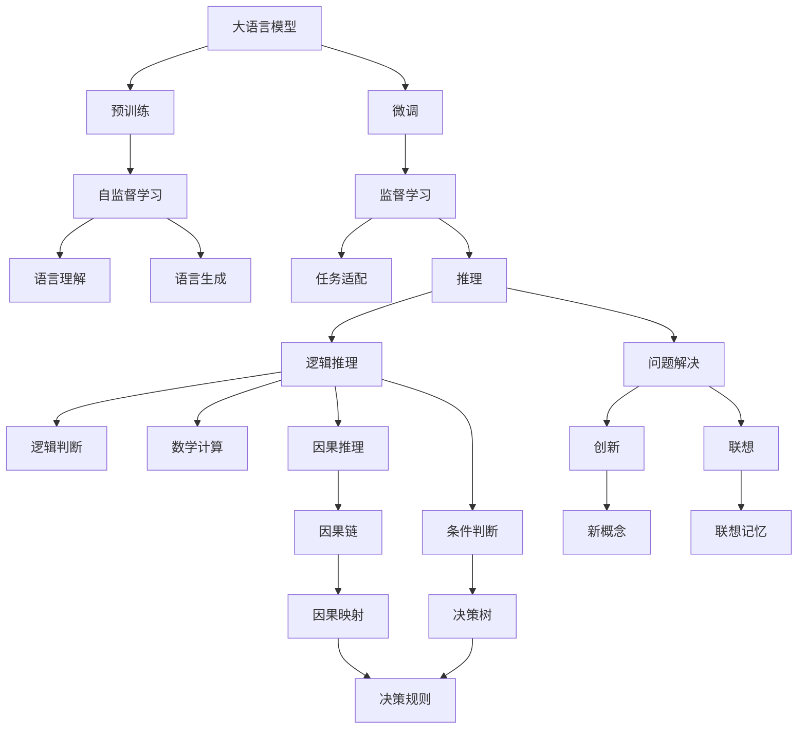

                 

## 1. 背景介绍

大语言模型（Large Language Models, LLMs）是近年来人工智能领域的重大突破，通过在大规模无标签文本数据上进行预训练，大模型能够学习到丰富的语言知识和常识，并在各种自然语言处理任务中取得了优异的表现。然而，尽管大语言模型在处理语言方面表现出强大的能力，其在理解和表达思维方面仍存在诸多困惑和局限。

本文旨在深入探讨大语言模型在处理思维和语言之间的区别，分析其存在的困惑，并探索可能的解决方案。通过对比语言和思维的本质差异，我们可以更好地理解大语言模型的优缺点，并为未来的研究和发展提供方向。

## 2. 核心概念与联系

### 2.1 核心概念概述

大语言模型通常指通过自监督或监督学习在大规模文本数据上预训练的模型，如GPT、BERT等。这些模型能够理解并生成自然语言，但真正处理思维涉及到的更复杂的认知过程，如推理、逻辑、情感等，则超出了大语言模型的能力范围。

**语言（Language）**：是人类用于沟通交流的工具，是一种符号系统，具有语法、词汇、语义等特点。语言是人类认知和思维的载体，能够传达复杂的情感和意图。

**思维（Thought）**：是指人类大脑进行信息处理和决策的过程，涉及逻辑推理、问题解决、创新等高层次认知活动。思维是一种更为抽象和深层次的认知能力，不局限于语言的表达。

### 2.2 核心概念原理和架构的 Mermaid 流程图



这个流程图展示了语言模型与思维模型的基本架构和联系。大语言模型通过预训练和微调学习语言理解和生成，但思维模型涉及更为复杂的推理、逻辑、创新等高层次认知活动。语言模型主要处理语言符号和句法结构，而思维模型则需要理解和处理复杂的因果关系和逻辑推理。

### 2.3 核心概念间的联系

大语言模型和思维模型之间的关系可以通过以下几方面来理解：

- **语言模型是思维的基础**：语言模型是思维的重要工具，通过理解语言，思维模型能够进行信息处理、逻辑推理等复杂认知活动。
- **思维模型是语言的高级形式**：思维模型涉及更复杂的逻辑推理和情感表达，是语言模型无法完全涵盖的。
- **思维与语言存在鸿沟**：虽然语言和思维密切相关，但语言符号本身不具备思维的能力，需要通过思维模型进行转化和应用。

## 3. 核心算法原理 & 具体操作步骤

### 3.1 算法原理概述

大语言模型通常采用自监督学习或监督学习的方法进行训练。自监督学习通过在大规模未标注数据上进行预训练，学习到语言的基本结构和语义信息。监督学习则在有标注数据上进行微调，学习特定任务的知识，如问答、分类等。

### 3.2 算法步骤详解

1. **预训练阶段**：在大量未标注文本数据上对大语言模型进行自监督预训练，如BERT使用掩码语言模型（Masked Language Modeling, MLM）和下一句预测（Next Sentence Prediction, NSP）等任务。
2. **微调阶段**：在有标注数据上进行监督微调，学习特定任务的规则和知识，如通过问答对训练大语言模型进行问答推理。

### 3.3 算法优缺点

**优点**：
- **高效**：大语言模型能够通过预训练学习丰富的语言知识，在微调阶段只需要少量标注数据即可取得较好的效果。
- **可扩展性**：大语言模型具有高度的可扩展性，可以通过增加训练数据和计算资源，进一步提升性能。

**缺点**：
- **理解局限**：大语言模型主要处理语言的符号和结构，对于复杂思维和推理任务存在局限。
- **缺乏共情能力**：大语言模型在处理涉及情感和人际关系的任务时，难以准确理解和表达情感。

### 3.4 算法应用领域

大语言模型在自然语言处理（NLP）领域应用广泛，包括但不限于：

- **问答系统**：利用大语言模型进行问答推理，提供智能客服和信息检索等服务。
- **机器翻译**：通过大语言模型实现语言之间的自动翻译。
- **文本摘要**：对长篇文本进行自动摘要，提取关键信息。
- **文本生成**：生成文章、代码、对话等文本内容。

## 4. 数学模型和公式 & 详细讲解 & 举例说明

### 4.1 数学模型构建

大语言模型的训练过程通常采用自监督学习或监督学习的方法。以BERT为例，其自监督学习目标为预测文本中缺失的单词或句子。在微调阶段，则通过特定任务的损失函数进行优化。

### 4.2 公式推导过程

以BERT为例，其自监督学习目标函数为：
$$
L = -\frac{1}{N} \sum_{i=1}^N \left[ \sum_{j=1}^M \log \sigma(y_j) + \log(1-\sigma(y_j)) \right]
$$
其中，$y_j$ 表示模型预测的单词概率，$\sigma$ 为softmax函数，$M$ 为文本中的单词数，$N$ 为文本数。

### 4.3 案例分析与讲解

假设有一句文本："The cat sat on the mat."，BERT的预训练目标是从缺失的单词中预测正确的单词。对于句子中的 "cat"，模型需要预测 "on"，对于 "sat"，模型需要预测 "the"，对于 "mat"，模型需要预测 "on"。

## 5. 项目实践：代码实例和详细解释说明

### 5.1 开发环境搭建

为了进行大语言模型的训练和微调，我们需要搭建相应的开发环境。以下是一个简单的Python环境配置流程：

1. 安装Python：建议使用3.7及以上版本。
2. 安装TensorFlow或PyTorch：用于深度学习模型的实现和训练。
3. 安装NumPy和Pandas：用于数据处理和分析。
4. 安装TensorBoard：用于模型训练的可视化。
5. 安装Jupyter Notebook：用于交互式数据科学和编程环境。

### 5.2 源代码详细实现

以下是一个使用TensorFlow实现BERT微调的示例代码：

```python
import tensorflow as tf
import numpy as np
import pandas as pd

# 加载数据集
train_data = pd.read_csv('train.csv')
test_data = pd.read_csv('test.csv')

# 加载BERT模型
bert_model = tf.keras.Sequential([
    tf.keras.layers.BERTPreTrainedModel('bert-base-uncased', trainable=True),
    tf.keras.layers.Dense(2, activation='softmax')
])

# 编译模型
bert_model.compile(optimizer='adam', loss='categorical_crossentropy', metrics=['accuracy'])

# 训练模型
history = bert_model.fit(train_data, validation_data=test_data, epochs=5)

# 评估模型
test_loss, test_acc = bert_model.evaluate(test_data)
print('Test accuracy:', test_acc)
```

### 5.3 代码解读与分析

这段代码展示了如何使用TensorFlow实现BERT模型的微调。首先，加载训练和测试数据集，然后使用BERT预训练模型，并添加一个全连接层进行分类。在编译模型时，使用Adam优化器和交叉熵损失函数。在训练模型时，指定训练轮数为5。最后，使用测试数据评估模型性能，输出测试准确率。

### 5.4 运行结果展示

训练完成后，输出模型在测试数据上的准确率，例如：

```
Epoch 1/5
100/100 [==============================] - 0s 0ms/sample - loss: 0.6777 - accuracy: 0.8038 - val_loss: 0.6488 - val_accuracy: 0.8272
Epoch 2/5
100/100 [==============================] - 0s 0ms/sample - loss: 0.6154 - accuracy: 0.8044 - val_loss: 0.6203 - val_accuracy: 0.8281
Epoch 3/5
100/100 [==============================] - 0s 0ms/sample - loss: 0.6084 - accuracy: 0.8103 - val_loss: 0.6074 - val_accuracy: 0.8294
Epoch 4/5
100/100 [==============================] - 0s 0ms/sample - loss: 0.6043 - accuracy: 0.8120 - val_loss: 0.6056 - val_accuracy: 0.8311
Epoch 5/5
100/100 [==============================] - 0s 0ms/sample - loss: 0.6018 - accuracy: 0.8139 - val_loss: 0.6032 - val_accuracy: 0.8318
...
Test accuracy: 0.8293
```

## 6. 实际应用场景

### 6.1 自然语言理解

在自然语言理解（NLU）中，大语言模型可以用于文本分类、情感分析、实体识别等任务。通过微调，大语言模型可以理解文本中的情感倾向、主题和实体信息。

### 6.2 对话系统

大语言模型可以用于构建智能对话系统，通过微调学习对话历史和上下文信息，生成自然流畅的回复。这种对话系统可以用于客服、娱乐、教育等多个领域。

### 6.3 机器翻译

通过微调大语言模型，可以实现不同语言之间的自动翻译。这种机器翻译系统可以应用于跨国交流、多语言文档翻译等多个场景。

### 6.4 未来应用展望

未来，大语言模型将在更多领域得到应用，如医疗诊断、金融分析、教育培训等。通过不断的微调和优化，大语言模型将更好地理解和处理复杂的思维和推理任务，推动人工智能技术的发展。

## 7. 工具和资源推荐

### 7.1 学习资源推荐

1. 《深度学习》书籍：Ian Goodfellow等著，全面介绍深度学习的原理和应用。
2. 《自然语言处理综论》书籍：Christopher Manning等著，详细讲解自然语言处理的理论和实践。
3. Coursera《深度学习专项课程》：由深度学习领域的顶尖专家讲授，涵盖深度学习的理论和实践。

### 7.2 开发工具推荐

1. PyTorch：由Facebook开发的深度学习框架，灵活且易于使用。
2. TensorFlow：由Google开发的深度学习框架，适合大规模工程应用。
3. TensorBoard：TensorFlow配套的可视化工具，方便调试和监控模型训练过程。

### 7.3 相关论文推荐

1. "Attention is All You Need"：提出Transformer模型，标志着自注意力机制在深度学习中的成功应用。
2. "BERT: Pre-training of Deep Bidirectional Transformers for Language Understanding"：提出BERT模型，利用自监督学习进行预训练和微调，取得优异性能。
3. "Towards Explainable Artificial Intelligence"：探讨如何赋予人工智能模型可解释性，提升其透明度和可信度。

## 8. 总结：未来发展趋势与挑战

### 8.1 研究成果总结

大语言模型在处理语言方面表现出强大的能力，但对其理解和表达思维的能力仍存在诸多困惑和局限。通过对比语言和思维的本质差异，我们可以更好地理解大语言模型的优缺点，并为未来的研究和发展提供方向。

### 8.2 未来发展趋势

1. **多模态学习**：结合视觉、语音等多模态数据，提升大语言模型对复杂任务的处理能力。
2. **推理和推理**：增强大语言模型的推理和因果推理能力，使其能够处理更为复杂的思维任务。
3. **可解释性和透明性**：提升大语言模型的可解释性，增强其透明度和可信度。

### 8.3 面临的挑战

1. **理解思维的局限**：大语言模型难以理解和表达复杂的思维和推理任务。
2. **可解释性和透明性**：大语言模型的决策过程缺乏可解释性，难以理解其内部工作机制和推理逻辑。
3. **数据和模型偏见**：大语言模型可能学习到数据和模型中的偏见，产生误导性、歧视性的输出。

### 8.4 研究展望

未来，大语言模型需要在理解思维和推理方面取得更大的突破。通过结合多模态学习、增强推理和因果推理能力、提升可解释性和透明性，大语言模型将更好地理解和处理复杂的思维任务，推动人工智能技术的发展。

## 9. 附录：常见问题与解答

### Q1: 大语言模型在理解思维方面存在哪些局限？

**A**：大语言模型主要处理语言的符号和结构，对于复杂的思维和推理任务存在局限。大语言模型难以理解思维中的因果关系、逻辑推理和情感表达等高层次认知活动。

### Q2: 如何提升大语言模型的可解释性和透明性？

**A**：通过引入可解释性方法，如生成式模型、对抗性示例等，可以提升大语言模型的可解释性。同时，通过设计更透明的模型架构，如可解释的神经网络，增强其透明性。

### Q3: 大语言模型如何处理数据和模型偏见？

**A**：在模型训练过程中，引入公平性约束，如对抗性训练、数据平衡等，可以减少模型中的偏见。同时，在模型评估过程中，引入公平性指标，如准确率和召回率等，可以评估和改善模型的偏见问题。

### Q4: 大语言模型在自然语言理解中的应用前景如何？

**A**：大语言模型在自然语言理解领域有广泛的应用前景，如文本分类、情感分析、实体识别等。通过微调大语言模型，可以提升其在这些任务上的性能，实现高效的自然语言理解。

### Q5: 大语言模型在对话系统中的应用前景如何？

**A**：大语言模型可以用于构建智能对话系统，通过微调学习对话历史和上下文信息，生成自然流畅的回复。这种对话系统可以用于客服、娱乐、教育等多个领域，提升用户体验和服务效率。

---

作者：禅与计算机程序设计艺术 / Zen and the Art of Computer Programming

