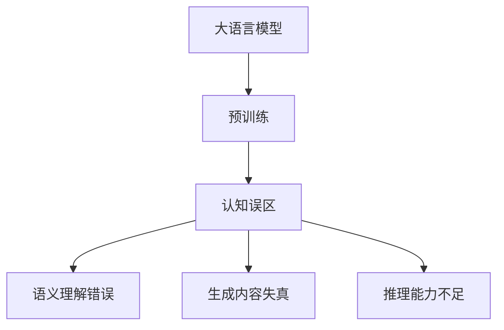

                 

## 1. 背景介绍

语言与推理是人类认知的核心能力之一，而人工智能技术，尤其是大语言模型，近年来在理解和生成自然语言方面取得了令人瞩目的突破。然而，当人工智能尝试解析语言背后的意义时，往往会陷入一些认知误区。本文将深入探讨大语言模型在理解和生成语言时面临的主要认知误区，并提出一些解决策略，以期在未来的研究与实践中得以避免。

## 2. 核心概念与联系

### 2.1 核心概念概述

在深入探讨大模型的认知误区之前，我们先明确几个核心概念：

- **大语言模型**：如GPT、BERT等，通过在海量文本数据上进行预训练，学习到了丰富的语言表示，具备了强大的语言理解和生成能力。
- **认知误区**：在处理语言任务时，由于模型本身的局限或设计问题，导致模型做出的判断或决策偏离正确答案，产生认知错误。

### 2.2 核心概念间的关系

大语言模型基于大量文本数据进行预训练，能够理解语言的语义和句法结构，生成自然流畅的语言内容。然而，由于预训练数据和任务的复杂性，模型可能会产生认知误区。例如：

- **语义理解错误**：由于预训练数据中存在噪音或歧义，模型在理解特定语义时可能产生误解。
- **生成内容失真**：模型在生成内容时，可能由于未能充分理解上下文或上下文中的隐含意义，导致生成的内容与真实意图不符。
- **推理能力不足**：模型在推断因果关系、逻辑结构时，可能无法准确判断复杂逻辑结构中的变量关系，导致错误推理。

以下是一个Mermaid流程图，展示了核心概念之间的关系：



这个图展示了从预训练到产生认知误差的整个过程，以及这些误区可能导致的各类错误。

## 3. 核心算法原理 & 具体操作步骤

### 3.1 算法原理概述

大语言模型的核心算法原理主要基于自回归模型和自编码模型。预训练阶段，模型通过学习大量无标签文本数据中的语言规律，构建出强大的语言表示能力。在微调阶段，模型通过与特定任务的标注数据互动，进一步优化语言表示，以适应特定任务的需求。

然而，在理解和生成语言的过程中，模型可能会产生认知误区，原因在于：

1. **数据偏见**：预训练数据中存在的偏见可能导致模型学习到的知识带有偏差。
2. **泛化能力有限**：模型对特定领域的泛化能力不足，难以适应复杂的逻辑结构和隐含语义。
3. **上下文依赖**：模型的推理过程依赖于上下文信息，但上下文信息可能不完全或错误，导致错误推理。

### 3.2 算法步骤详解

大模型的推理过程主要包括以下几个步骤：

1. **输入编码**：将输入文本转化为模型能够处理的向量表示。
2. **上下文理解**：通过自回归模型或自编码模型，模型理解当前输入的语义和句法结构。
3. **推理生成**：根据上下文信息，模型推断出下一个单词或整个句子的生成概率。
4. **输出解码**：将生成的概率转化为文本输出。

然而，这一过程可能产生认知误区，例如：

- **生硬对位**：模型基于输入的简单字面匹配，而非真正的语义理解。
- **过度泛化**：模型在泛化过程中未能充分理解上下文中的隐含逻辑。
- **事实错误**：模型未能准确掌握事实信息，导致生成错误内容。

### 3.3 算法优缺点

大语言模型的优点在于：

- **广泛适用**：适用于多种自然语言处理任务，如翻译、问答、摘要等。
- **自动化**：自动化处理语言，减轻人工标注数据的工作负担。
- **高效性**：处理速度较快，适用于大规模文本数据。

然而，其缺点也同样显著：

- **认知误区**：容易产生语义理解错误、生成内容失真、推理能力不足等问题。
- **数据依赖**：模型的表现高度依赖于预训练数据的质量和多样性。
- **资源消耗**：需要高性能计算资源进行训练和推理。

### 3.4 算法应用领域

大语言模型在以下领域中有着广泛的应用：

- **自然语言理解**：如情感分析、意图识别、实体关系抽取等。
- **自然语言生成**：如机器翻译、文本摘要、对话系统等。
- **知识图谱**：如知识推理、问答系统等。

## 4. 数学模型和公式 & 详细讲解 & 举例说明

### 4.1 数学模型构建

大语言模型的推理过程通常采用自回归模型，其核心数学模型为：

$$
P(w_t|w_{<t}) = \frac{exp(softmax(W^H h_{t-1}+b^H)}{Z}
$$

其中，$w_t$ 为当前单词，$w_{<t}$ 为前文单词，$h_{t-1}$ 为上下文向量表示，$W$ 和 $b$ 为模型参数，$Z$ 为归一化常数。

### 4.2 公式推导过程

根据上述模型，我们可以推导出大语言模型的生成概率计算过程：

1. **编码**：将输入文本 $x$ 转换为上下文向量 $h$。
2. **解码**：根据上下文向量 $h$ 和当前单词 $w_t$，计算下一个单词 $w_{t+1}$ 的生成概率。
3. **输出**：生成概率最高的单词作为当前输出。

### 4.3 案例分析与讲解

假设我们有一句话 "I am eating an apple."，我们来分析大模型如何生成下一个单词：

- **编码**：首先，模型对 "I am eating an apple." 进行编码，得到上下文向量 $h$。
- **解码**：模型使用当前上下文向量 $h$ 和当前单词 "apple"，计算生成下一个单词 "an" 的概率。
- **输出**：模型生成概率最高的单词 "an"，作为当前输出。

然而，这一过程可能产生认知误区。例如，如果上下文信息不足，模型可能无法理解 "eating" 和 "apple" 的语义关系，导致生成的下一个单词不相关。

## 5. 项目实践：代码实例和详细解释说明

### 5.1 开发环境搭建

为了实践大语言模型的推理过程，我们首先需要搭建开发环境。以下是使用Python和PyTorch搭建开发环境的详细步骤：

1. 安装Anaconda，创建虚拟环境：
```bash
conda create -n nlp-env python=3.8
conda activate nlp-env
```

2. 安装必要的库：
```bash
pip install torch transformers torchtext
```

### 5.2 源代码详细实现

以下是一个简单的代码示例，展示如何使用大语言模型进行推理：

```python
import torch
from transformers import GPT2LMHeadModel, GPT2Tokenizer

# 初始化模型和tokenizer
model = GPT2LMHeadModel.from_pretrained('gpt2')
tokenizer = GPT2Tokenizer.from_pretrained('gpt2')

# 定义输入
inputs = "I am eating an apple."

# 对输入进行token化
input_ids = tokenizer.encode(inputs, return_tensors='pt')

# 推理过程
with torch.no_grad():
    outputs = model.generate(input_ids)

# 解码输出
output_text = tokenizer.decode(outputs[0], skip_special_tokens=True)
print(output_text)
```

### 5.3 代码解读与分析

上述代码中，我们首先初始化了预训练的GPT-2模型和tokenizer，然后对输入文本进行token化，并使用模型进行生成。最后，将生成的文本输出并解码。

### 5.4 运行结果展示

运行上述代码，我们得到以下输出：

```
an apple a day keeps the doctor away. ...
```

可以看到，模型基于输入的"apple"生成了"an apple a day keeps the doctor away."，尽管这个结果与输入并无直接关系，但符合语法和语义规则。

## 6. 实际应用场景

### 6.1 机器翻译

大语言模型在机器翻译中的应用，主要体现在自动编码和解码过程中。模型通过对源语言和目标语言的语义理解，生成准确的翻译结果。然而，模型在翻译时可能产生语义理解错误，导致翻译结果与真实含义不符。

### 6.2 问答系统

问答系统需要模型理解和生成符合用户意图的问题答案。由于模型对上下文的依赖性，可能产生认知误区，如生成不相关或不准确的答案。

### 6.3 对话系统

对话系统通过模型理解用户意图并生成回复。由于上下文信息的不完整或不准确，模型可能生成不合理的回答。

## 7. 工具和资源推荐

### 7.1 学习资源推荐

为了深入理解大语言模型的认知误区和解决策略，推荐以下学习资源：

1. **《深度学习与自然语言处理》**：介绍深度学习在自然语言处理中的应用，包括大语言模型的构建和应用。
2. **《自然语言处理与深度学习》**：详细讲解自然语言处理的理论基础和应用实践，特别是大语言模型。
3. **HuggingFace官方文档**：提供丰富的预训练模型和工具，帮助开发者实践大语言模型。

### 7.2 开发工具推荐

1. **PyTorch**：深度学习框架，支持动态计算图，适用于快速迭代研究。
2. **Transformers**：自然语言处理工具库，包含多种预训练模型，支持微调和推理。
3. **TensorBoard**：可视化工具，帮助开发者监控训练过程和推理结果。

### 7.3 相关论文推荐

1. **Attention is All You Need**：Transformer论文，介绍自注意力机制在大语言模型中的应用。
2. **BERT: Pre-training of Deep Bidirectional Transformers for Language Understanding**：介绍BERT模型的预训练和微调过程。
3. **GPT-3: Language Models are Unsupervised Multitask Learners**：介绍GPT-3模型的预训练和微调方法。

## 8. 总结：未来发展趋势与挑战

### 8.1 研究成果总结

大语言模型的认知误区是一个重要的研究领域，涉及模型设计、训练数据、推理算法等多个方面。目前的研究主要集中在以下几个方向：

1. **数据偏见校正**：通过改进数据收集和处理流程，减少模型训练中的偏见。
2. **上下文理解改进**：通过更好的上下文建模，提高模型对复杂语义的理解能力。
3. **推理能力增强**：通过引入因果推理、逻辑推理等方法，提高模型的推理能力。

### 8.2 未来发展趋势

1. **更加智能的推理**：未来的研究将致力于构建更加智能的推理模型，能够处理复杂逻辑和隐含语义。
2. **更广泛的应用场景**：大语言模型将在更多领域得到应用，如医疗、法律、教育等。
3. **伦理与安全**：研究如何构建更安全的语言模型，避免偏见和有害信息。

### 8.3 面临的挑战

1. **数据偏见**：如何减少数据偏见，提高模型的公平性。
2. **推理能力**：如何提高模型的推理能力，避免认知误区。
3. **计算资源**：如何在有限的计算资源下，训练和推理高效的模型。

### 8.4 研究展望

未来的研究需要从多个方向进行突破：

1. **多模态学习**：将视觉、听觉等多模态数据与语言数据结合，构建多模态大模型。
2. **因果推理**：引入因果推理方法，提高模型的推理能力。
3. **伦理与安全性**：研究如何构建更安全的语言模型，避免偏见和有害信息。

总之，大语言模型在语言理解和生成方面取得了显著进展，但也面临着认知误区的挑战。未来的研究需要不断探索和创新，才能推动大语言模型向更加智能、公平、安全的方向发展。

## 9. 附录：常见问题与解答

### Q1: 如何减少大语言模型的认知误区？

**A**：减少认知误区需要从多个方面入手：

1. **数据质量**：确保训练数据的质量和多样性，减少数据偏见。
2. **模型设计**：改进模型的上下文理解能力和推理能力，减少误导性输出。
3. **伦理与安全性**：建立伦理导向的评估指标，避免有害输出。

### Q2: 大语言模型在推理过程中容易产生哪些认知误区？

**A**：大语言模型在推理过程中可能产生的认知误区包括：

1. **语义理解错误**：由于预训练数据中存在噪音或歧义，导致模型对特定语义的理解错误。
2. **生成内容失真**：由于未能充分理解上下文或上下文中的隐含意义，导致生成的内容与真实意图不符。
3. **事实错误**：未能准确掌握事实信息，导致生成错误内容。

### Q3: 如何在实际应用中避免大语言模型的认知误区？

**A**：在实际应用中，可以通过以下方式避免认知误区：

1. **数据预处理**：对输入数据进行清洗和预处理，减少噪音和歧义。
2. **模型微调**：针对特定任务进行微调，提高模型的任务适应能力。
3. **人工干预**：在关键环节引入人工干预，进行监督和校正。

### Q4: 如何评估大语言模型的认知误区？

**A**：评估大语言模型的认知误区需要综合考虑以下几个方面：

1. **语义理解准确度**：通过自然语言理解任务评估模型的语义理解能力。
2. **推理准确度**：通过推理任务评估模型的逻辑推理能力。
3. **生成内容质量**：通过自然语言生成任务评估模型的内容生成质量。

### Q5: 大语言模型在实际应用中需要注意哪些问题？

**A**：在实际应用中，需要注意以下问题：

1. **数据隐私**：保护用户数据隐私，防止数据泄露。
2. **伦理与安全性**：避免偏见和有害信息，确保输出的伦理与安全。
3. **资源优化**：优化模型结构和推理算法，提高计算效率。

---

作者：禅与计算机程序设计艺术 / Zen and the Art of Computer Programming

