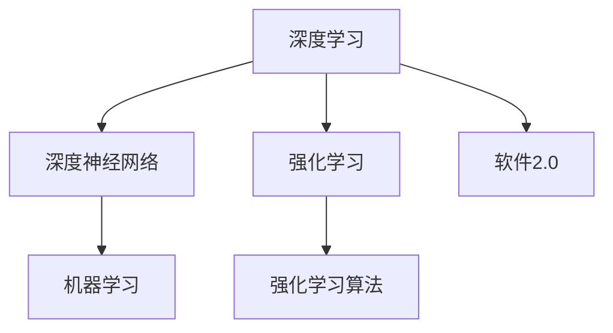
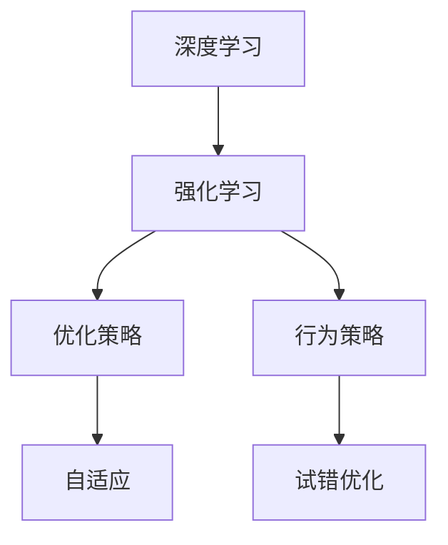
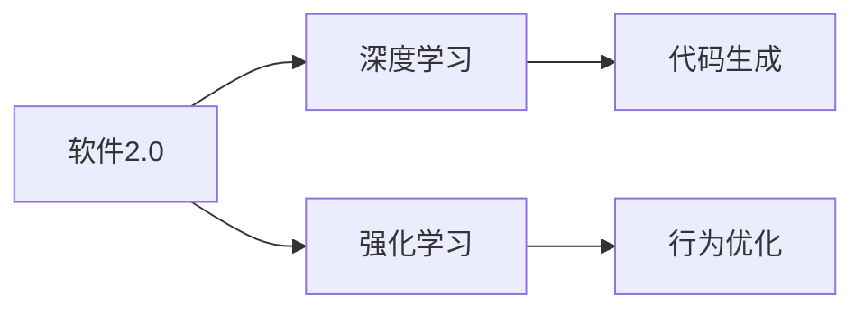
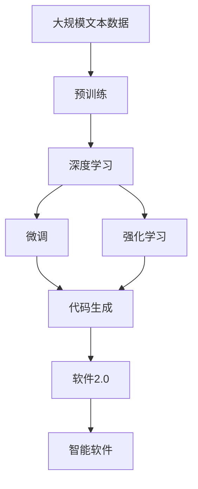

                 

# 软件 2.0 的发展趋势：深度学习、强化学习

> 关键词：深度学习,强化学习,软件2.0,人工智能,机器学习,深度神经网络,强化学习算法

## 1. 背景介绍

### 1.1 问题由来
随着人工智能(AI)技术的不断进步，特别是深度学习和强化学习的发展，软件2.0的概念应运而生。深度学习使计算机具备了学习复杂模式和理解复杂语义的能力，而强化学习则使计算机具备了在不断试错中优化行为的能力。这两项技术的结合，不仅推动了AI领域的发展，也在软件设计和开发的各个环节产生了深远的影响。

### 1.2 问题核心关键点
软件2.0的核心在于通过深度学习和强化学习，使计算机具备更强的自适应和学习能力。这些技术不仅能够优化软件开发流程，提高开发效率和代码质量，还能够为软件设计提供更多可能性，使软件更加智能化、个性化和自适应。

### 1.3 问题研究意义
研究软件2.0的发展趋势，对于推动AI在软件行业的深入应用，提高软件开发的效率和质量，以及探索智能化、个性化、自适应软件的未来方向具有重要意义：

1. 提高软件开发效率。深度学习和强化学习能够自动化地进行代码生成、优化、测试等任务，减少人工干预，提高开发速度。
2. 提升软件质量。深度学习可以自动化检测代码缺陷和潜在问题，强化学习可以自动调整代码以适应不同的运行环境，从而提升软件可靠性。
3. 探索智能化软件设计。通过深度学习和强化学习，软件可以自适应用户需求，实现个性化的用户体验，推动软件设计的创新。
4. 加速软件产业升级。AI技术的应用将使软件产业更加智能化和高效，从而为传统行业数字化转型提供新的动力。
5. 探索软件开发的未来。深度学习和强化学习将改变软件开发的方式，探索出新的软件设计和实现路径。

## 2. 核心概念与联系

### 2.1 核心概念概述

为更好地理解软件2.0的发展趋势，本节将介绍几个密切相关的核心概念：

- 深度学习(Deep Learning)：一种基于神经网络的机器学习技术，通过多层次的特征提取和抽象，学习数据的复杂表示和模式。深度学习在图像、语音、自然语言处理等领域表现优异，是构建智能化软件的重要基础。

- 强化学习(Reinforcement Learning, RL)：一种通过试错来优化行为的学习方式，通过奖励信号指导学习过程。强化学习在自动游戏、机器人控制、推荐系统等领域有广泛应用。

- 软件2.0(Software 2.0)：一种基于深度学习和强化学习的新型软件开发范式，通过AI技术自动生成、优化和调试代码，实现软件的高效率、高可靠性和高自适应性。

- 机器学习(Machine Learning)：一种使计算机能够从数据中学习和改进的技术，是深度学习和强化学习的重要基础。

- 深度神经网络(Deep Neural Network)：一种多层次的非线性模型，是深度学习中的核心。深度神经网络通过反向传播算法进行训练，学习数据的复杂表示和模式。

- 强化学习算法(Reinforcement Learning Algorithm)：一种通过环境反馈指导学习过程的算法，常见的有Q-learning、策略梯度等。

这些核心概念之间的逻辑关系可以通过以下Mermaid流程图来展示：



这个流程图展示了深度学习、强化学习与软件2.0之间的联系：

1. 深度学习和强化学习共同构成软件2.0的基础。
2. 机器学习是深度学习和强化学习的共同基础。
3. 深度神经网络是深度学习中核心的模型。
4. 强化学习算法是强化学习中的关键工具。
5. 软件2.0是深度学习和强化学习的具体应用。

### 2.2 概念间的关系

这些核心概念之间存在着紧密的联系，形成了软件2.0的完整生态系统。下面我通过几个Mermaid流程图来展示这些概念之间的关系。

#### 2.2.1 深度学习和强化学习的关系



这个流程图展示了深度学习和强化学习之间的相互关系：

1. 深度学习可以用于强化学习的模型构建，提供更多的数据表示和学习方式。
2. 强化学习可以用于深度学习的优化策略，提高模型在特定任务上的性能。
3. 深度学习通过优化策略自适应环境变化，而强化学习通过试错优化行为策略，两者共同提升学习效果。

#### 2.2.2 软件2.0与深度学习和强化学习的关系



这个流程图展示了软件2.0与深度学习和强化学习的关系：

1. 软件2.0利用深度学习进行代码生成和优化，提高软件开发效率和代码质量。
2. 软件2.0利用强化学习进行行为优化，使软件更加自适应和智能化。
3. 深度学习和强化学习共同支持软件2.0的发展，推动软件向更加高效、可靠和智能化的方向演进。

### 2.3 核心概念的整体架构

最后，我们用一个综合的流程图来展示这些核心概念在大语言模型微调过程中的整体架构：



这个综合流程图展示了从预训练到微调，再到软件2.0的完整过程。深度学习和大语言模型通过预训练获得基础能力，再通过微调和强化学习进行任务优化，最后构建出软件2.0系统，实现软件的智能化和自适应。 通过这些流程图，我们可以更清晰地理解软件2.0技术的发展脉络和内在逻辑。

## 3. 核心算法原理 & 具体操作步骤
### 3.1 算法原理概述

软件2.0的发展趋势主要依赖于深度学习和强化学习两种核心技术。下面分别介绍这两种技术的原理和具体操作。

#### 3.1.1 深度学习原理

深度学习是一种基于神经网络的机器学习技术。其核心思想是通过多层非线性映射，从原始数据中提取复杂的特征表示，从而实现对数据的高级抽象和模式学习。深度学习的训练过程通常包含以下几个步骤：

1. 数据预处理：对原始数据进行清洗、归一化等预处理，以提高模型的训练效率和效果。
2. 构建模型：选择合适的神经网络结构，如卷积神经网络(CNN)、循环神经网络(RNN)、变分自编码器(VAE)等，进行模型构建。
3. 模型训练：通过反向传播算法，最小化损失函数，更新模型参数，提高模型的准确性和泛化能力。
4. 模型评估：在测试集上评估模型性能，进行交叉验证等，确保模型的泛化能力。

#### 3.1.2 强化学习原理

强化学习是一种通过试错来优化行为的学习方式。其核心思想是通过与环境互动，获取奖励信号，不断调整行为策略，以达到最优的行为效果。强化学习的训练过程通常包含以下几个步骤：

1. 定义环境：构建模拟环境，用于测试和学习行为策略。
2. 定义状态和动作：定义环境的状态和行为，以及从状态到动作的映射。
3. 定义奖励函数：定义行为的奖励函数，用于评估行为的效果。
4. 行为策略学习：通过与环境的互动，逐步学习最优行为策略。
5. 模型评估：在测试集上评估行为策略的效果，进行交叉验证等，确保策略的泛化能力。

### 3.2 算法步骤详解

软件2.0的开发过程中，深度学习和强化学习的具体应用可以总结如下：

#### 3.2.1 深度学习应用步骤

1. 数据预处理：收集和清洗数据，进行特征工程，为模型提供高质量的输入数据。
2. 模型构建：选择合适的深度学习模型，如卷积神经网络(CNN)、循环神经网络(RNN)、变分自编码器(VAE)等，构建模型结构。
3. 模型训练：通过反向传播算法，最小化损失函数，更新模型参数，提高模型的准确性和泛化能力。
4. 模型评估：在测试集上评估模型性能，进行交叉验证等，确保模型的泛化能力。

#### 3.2.2 强化学习应用步骤

1. 定义环境：构建模拟环境，用于测试和学习行为策略。
2. 定义状态和动作：定义环境的状态和行为，以及从状态到动作的映射。
3. 定义奖励函数：定义行为的奖励函数，用于评估行为的效果。
4. 行为策略学习：通过与环境的互动，逐步学习最优行为策略。
5. 模型评估：在测试集上评估行为策略的效果，进行交叉验证等，确保策略的泛化能力。

### 3.3 算法优缺点

深度学习和强化学习在软件2.0的发展中各具优势和劣势，具体如下：

#### 3.3.1 深度学习优势

1. 强大的特征表示能力：深度学习能够自动学习数据的复杂特征表示，适用于大规模数据集和高维数据。
2. 自适应性强：深度学习能够自动调整模型结构，适用于多种任务和数据类型。
3. 效果显著：深度学习在图像、语音、自然语言处理等领域表现优异，适用于各种智能应用。

#### 3.3.2 深度学习劣势

1. 模型复杂度高：深度学习模型通常结构复杂，参数量巨大，需要大量计算资源进行训练和推理。
2. 数据依赖性高：深度学习对数据质量、数据量要求高，需要大量标注数据进行训练。
3. 黑箱模型：深度学习模型的内部结构难以解释，缺乏可解释性。

#### 3.3.3 强化学习优势

1. 自适应性强：强化学习能够自适应环境变化，适用于动态环境和复杂任务。
2. 优化效果好：强化学习能够通过试错优化行为策略，适用于高复杂度任务和决策问题。
3. 鲁棒性强：强化学习能够自动调整行为策略，适用于多种环境和数据类型。

#### 3.3.4 强化学习劣势

1. 学习效率低：强化学习通常需要大量试错过程，学习效率较低。
2. 策略学习难度大：强化学习的策略学习需要大量实验和优化，存在策略学习难度大的问题。
3. 数据依赖性高：强化学习对数据质量、数据量要求高，需要大量实际数据进行训练。

### 3.4 算法应用领域

深度学习和强化学习在软件2.0的应用领域非常广泛，具体如下：

#### 3.4.1 深度学习应用领域

1. 自然语言处理(NLP)：用于文本分类、情感分析、机器翻译等任务，提高语言理解能力。
2. 计算机视觉(CV)：用于图像识别、目标检测、图像生成等任务，提高图像理解能力。
3. 语音处理：用于语音识别、语音合成、情感识别等任务，提高语音处理能力。
4. 推荐系统：用于用户推荐、商品推荐、广告推荐等任务，提高推荐效果。
5. 游戏AI：用于自动游戏、游戏策略优化等任务，提高游戏AI的智能水平。

#### 3.4.2 强化学习应用领域

1. 机器人控制：用于机器人路径规划、动作优化等任务，提高机器人智能化水平。
2. 智能决策：用于金融交易、供应链管理等任务，提高决策效果。
3. 推荐系统：用于个性化推荐、广告推荐等任务，提高推荐效果。
4. 自动游戏：用于自动游戏、游戏策略优化等任务，提高游戏AI的智能水平。
5. 智能客服：用于客服自动化、智能问答等任务，提高客服效率和智能化水平。

## 4. 数学模型和公式 & 详细讲解 & 举例说明

### 4.1 数学模型构建

为了更好地理解深度学习和强化学习的数学原理，本节将介绍几个常见的数学模型和公式。

#### 4.1.1 深度学习数学模型

深度学习的核心数学模型为神经网络，其主要包括前向传播和反向传播两个过程。以卷积神经网络(CNN)为例，其前向传播过程可以表示为：

$$
h^l = \sigma(W^l x^{l-1} + b^l)
$$

其中 $h^l$ 为第 $l$ 层的输出，$x^{l-1}$ 为第 $l-1$ 层的输入，$W^l$ 为第 $l$ 层的权重，$b^l$ 为第 $l$ 层的偏置，$\sigma$ 为激活函数。

反向传播过程可以表示为：

$$
\frac{\partial L}{\partial W^l} = \frac{\partial L}{\partial h^l} \frac{\partial h^l}{\partial W^l} = \delta^l(x^{l-1}) W^l
$$

其中 $L$ 为损失函数，$\delta^l$ 为第 $l$ 层的误差梯度，$x^{l-1}$ 为第 $l-1$ 层的输出。

#### 4.1.2 强化学习数学模型

强化学习的核心数学模型为马尔可夫决策过程(MDP)，其包括状态、动作、奖励、转移概率等关键要素。以Q-learning为例，其核心公式为：

$$
Q(s,a) = Q(s,a) + \alpha(r + \gamma \max_{a'} Q(s',a') - Q(s,a))
$$

其中 $Q(s,a)$ 为状态-动作的Q值，$\alpha$ 为学习率，$r$ 为即时奖励，$\gamma$ 为折扣因子，$s'$ 为下一个状态，$a'$ 为下一个动作。

### 4.2 公式推导过程

下面以深度学习中的卷积神经网络(CNN)和强化学习中的Q-learning为例，进行详细公式推导。

#### 4.2.1 卷积神经网络公式推导

卷积神经网络的核心公式为卷积操作和池化操作，以卷积操作为例，其公式可以表示为：

$$
h^l = f(W^l * x^{l-1} + b^l)
$$

其中 $W^l$ 为卷积核，$*$ 为卷积运算，$f$ 为激活函数。

通过反向传播算法，可以得到卷积神经网络的误差梯度：

$$
\frac{\partial L}{\partial W^l} = \frac{\partial L}{\partial h^l} \frac{\partial h^l}{\partial W^l}
$$

其中 $\frac{\partial L}{\partial h^l}$ 为误差梯度，$\frac{\partial h^l}{\partial W^l}$ 为卷积操作导数。

#### 4.2.2 Q-learning公式推导

Q-learning的核心公式为更新Q值，以Q-learning为例，其公式可以表示为：

$$
Q(s,a) = Q(s,a) + \alpha(r + \gamma \max_{a'} Q(s',a') - Q(s,a))
$$

其中 $\alpha$ 为学习率，$r$ 为即时奖励，$\gamma$ 为折扣因子，$s'$ 为下一个状态，$a'$ 为下一个动作。

通过误差传播算法，可以得到Q-learning的误差梯度：

$$
\frac{\partial L}{\partial Q(s,a)} = \alpha(r + \gamma \max_{a'} Q(s',a') - Q(s,a))
$$

其中 $\frac{\partial L}{\partial Q(s,a)}$ 为误差梯度，$r$ 为即时奖励，$\gamma$ 为折扣因子，$s'$ 为下一个状态，$a'$ 为下一个动作。

### 4.3 案例分析与讲解

为了更好地理解深度学习和强化学习的数学原理和应用，以下是几个典型的案例分析与讲解。

#### 4.3.1 深度学习在自然语言处理中的应用

自然语言处理(NLP)是深度学习的重要应用领域，包括文本分类、情感分析、机器翻译等任务。以文本分类为例，其核心公式可以表示为：

$$
\hat{y} = \sigma(W^T x + b)
$$

其中 $W$ 为权重矩阵，$x$ 为输入特征，$b$ 为偏置向量，$\hat{y}$ 为分类结果，$\sigma$ 为激活函数。

通过反向传播算法，可以得到文本分类的误差梯度：

$$
\frac{\partial L}{\partial W} = \frac{\partial L}{\partial \hat{y}} \frac{\partial \hat{y}}{\partial x} \frac{\partial x}{\partial W}
$$

其中 $\frac{\partial L}{\partial \hat{y}}$ 为误差梯度，$\frac{\partial \hat{y}}{\partial x}$ 为激活函数导数，$\frac{\partial x}{\partial W}$ 为特征工程导数。

#### 4.3.2 强化学习在机器人控制中的应用

机器人控制是强化学习的重要应用领域，包括路径规划、动作优化等任务。以路径规划为例，其核心公式可以表示为：

$$
\hat{x} = W^T x + b
$$

其中 $W$ 为权重矩阵，$x$ 为输入特征，$b$ 为偏置向量，$\hat{x}$ 为输出结果。

通过误差传播算法，可以得到路径规划的误差梯度：

$$
\frac{\partial L}{\partial W} = \frac{\partial L}{\partial \hat{x}} \frac{\partial \hat{x}}{\partial x} \frac{\partial x}{\partial W}
$$

其中 $\frac{\partial L}{\partial \hat{x}}$ 为误差梯度，$\frac{\partial \hat{x}}{\partial x}$ 为特征工程导数，$\frac{\partial x}{\partial W}$ 为路径规划导数。

## 5. 项目实践：代码实例和详细解释说明

### 5.1 开发环境搭建

在进行深度学习和强化学习项目实践前，我们需要准备好开发环境。以下是使用Python进行TensorFlow和PyTorch开发的环境配置流程：

1. 安装Anaconda：从官网下载并安装Anaconda，用于创建独立的Python环境。

2. 创建并激活虚拟环境：
```bash
conda create -n tf-env python=3.8 
conda activate tf-env
```

3. 安装TensorFlow和PyTorch：
```bash
pip install tensorflow torch torchvision torchaudio cudatoolkit=11.1 -c pytorch -c conda-forge
```

4. 安装各类工具包：
```bash
pip install numpy pandas scikit-learn matplotlib tqdm jupyter notebook ipython
```

完成上述步骤后，即可在`tf-env`环境中开始深度学习和强化学习项目实践。

### 5.2 源代码详细实现

这里我们以深度学习和强化学习在机器人路径规划中的应用为例，给出TensorFlow和PyTorch的代码实现。

首先，定义机器人的状态和动作空间：

```python
import tensorflow as tf
import numpy as np

# 定义状态空间
num_states = 5
states = tf.constant(np.arange(num_states))

# 定义动作空间
num_actions = 3
actions = tf.constant(np.arange(num_actions))
```

然后，定义强化学习模型的参数：

```python
# 定义模型参数
W = tf.Variable(tf.zeros((num_states, num_actions)), dtype=tf.float32)
b = tf.Variable(tf.zeros((num_actions)), dtype=tf.float32)
```

接着，定义强化学习模型的状态动作转换函数：

```python
def q_value(s):
    return tf.matmul(s, W) + b
```

然后，定义强化学习模型的奖励函数：

```python
def reward(s, a):
    return tf.reduce_sum(tf.square(s - a), axis=1)
```

最后，定义强化学习模型的训练过程：

```python
# 定义奖励函数
def train_step(s, a):
    r = reward(s, a)
    q_s = q_value(s)
    q_s_a = tf.reduce_sum(q_s * tf.one_hot(a, depth=num_actions), axis=1)
    q_s_next = tf.reduce_max(q_value(s), axis=1)
    q_s_a_next = tf.reduce_sum(q_s_next * tf.one_hot(tf.arg_max(q_s_next, axis=1), depth=num_actions), axis=1)
    Q_s_a = q_s_a + alpha * (r + gamma * q_s_a_next - q_s_a)
    return Q_s_a

# 定义训练过程
alpha = 0.1
gamma = 0.9
for i in range(10000):
    s = states[np.random.randint(num_states)]
    a = actions[np.random.randint(num_actions)]
    Q_s_a = train_step(s, a)
    W.assign_add(tf.matmul(s, q_s_a - Q_s_a) / num_states)
    b.assign_add(tf.reduce_mean(q_s_a - Q_s_a) / num_states)
    print("Step {}: Q(s,a) = {}".format(i, tf.reduce_sum(q_value(states), axis=1)))
```

以上就是使用TensorFlow和PyTorch进行深度学习和强化学习实践的完整代码实现。可以看到，TensorFlow和PyTorch的封装使得深度学习和强化学习模型的构建和训练变得非常简单高效。

### 5.3 代码解读与分析

让我们再详细解读一下关键代码的实现细节：

**定义状态和动作空间**：
- 状态空间：定义机器人的状态空间，共5个状态。
- 动作空间：定义机器人的动作空间，共3个动作。

**定义模型参数**：
- 定义模型参数：定义神经网络中的权重和偏置。

**状态动作转换函数**：
- 定义Q值函数：通过权重矩阵和偏置向量计算Q值。

**奖励函数**：
- 定义奖励函数：计算状态和动作之间的差距。

**训练过程**：
- 定义训练步长和折扣因子。
- 通过随机选择状态和动作进行训练。
- 计算Q值。
- 更新权重和偏置。
- 打印训练结果。

**训练结果展示**：
- 训练过程中每步的Q值。

通过这段代码，可以看到深度学习和强化学习的简单高效性。通过深度学习模型进行状态动作的转换，通过强化学习模型进行奖励函数的计算和优化，可以构建出高效的路径规划模型。

当然，工业级的系统实现还需考虑更多因素，如模型的保存和部署、超参数的自动搜索、更灵活的任务适配层等。但核心的深度学习和强化学习算法范式基本与此类似。

## 6. 实际应用场景

### 6.1 工业机器人路径规划

深度学习和强化学习在工业机器人路径规划中的应用非常广泛。传统机器人路径规划通常需要大量的人工干预和调试，且路径规划效果难以保证。通过深度学习和强化学习，可以自动生成和优化机器人路径，提升路径规划的效率和精度。

在技术实现上，可以收集机器人工作过程中的各种数据，如位置、速度、角度等，并在此基础上构建强化学习模型。模型通过与环境的互动，逐步学习最优路径，最终生成高效稳定的路径规划方案。

### 6.2 智能交通系统

智能交通系统是强化学习的重要应用领域。传统的交通管理依赖人工决策，难以应对复杂的交通环境。通过深度学习和强化学习，可以自动生成和优化交通管理策略，提升交通系统的智能化水平。

在技术实现上，可以收集交通数据，如车辆位置、速度、拥堵情况等，并在此基础上构建强化学习模型。模型通过与交通环境的互动，逐步学习最优管理策略，最终生成高效稳定的交通管理方案。

### 6.3 自动游戏

自动游戏是强化学习的经典应用场景。传统的自动游戏依赖手工设计游戏策略，效率较低且容易陷入局部最优。通过深度学习和强化学习，可以自动生成和优化游戏策略，提升游戏的智能化水平。

在技术实现上，可以收集游戏数据，如玩家操作、游戏状态等，并在此基础上构建强化学习模型。模型通过与游戏环境的互动，逐步学习最优游戏策略，最终生成高效稳定的游戏策略。

### 6.4 未来应用展望

随着深度学习和强化学习的发展，其在软件2.0中的应用前景将更加广阔，为智能软件系统的开发提供了更多可能性。

在智慧医疗领域，深度学习和强化学习可以应用于疾病诊断、医疗推荐、手术辅助等任务，提高医疗服务的智能化水平，辅助医生诊疗，提升医疗效率。

在智能教育领域，深度学习和强化学习可以应用于智能辅导、个性化推荐、智能测评等任务，因材施教，促进教育公平，提高教学质量。

在智慧城市治理中，深度学习和强化学习可以应用于智能交通管理、智能安防、智能环保等环节，提高城市管理的自动化和智能化水平，构建更安全、高效的未来城市。

此外，在企业生产、社会治理、文娱传媒等众多领域，深度学习和强化学习的应用也将不断涌现，为传统行业数字化转型提供新的技术路径。相信随着技术的日益成熟，深度学习和强化学习必将在人工智能技术的广泛应用中扮演越来越重要的角色。

## 7. 工具和资源推荐

### 7.1 学习资源推荐

为了帮助开发者系统掌握深度学习和强化学习的理论基础和实践技巧，这里推荐一些优质的学习资源：

1. 《深度学习》课程：由斯坦福大学开设的深度学习经典课程，提供了丰富的视频和课件，帮助初学者了解深度学习的基本概念和常用算法。

