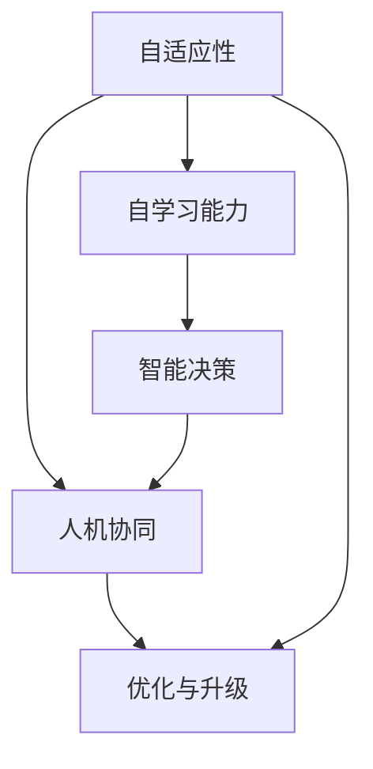

                 

# 软件 2.0 的未来愿景：创造更美好的世界

> 关键词：
- 软件2.0
- 人工智能
- 智能化技术
- 数字时代
- 未来愿景
- 人机协同
- 社会变革

## 1. 背景介绍

### 1.1 问题由来
21世纪以来，全球信息技术迅猛发展，从大数据、云计算到物联网、区块链，科技创新不断催生新业态，驱动社会生产方式的全面变革。人工智能（AI）作为新一代计算技术的代表，正引领新一轮产业革命，深度影响人类生产生活方式。

伴随计算硬件性能的飞速提升和数据存储技术的日趋成熟，人工智能开始向更高级、更智能的方向发展，即“软件2.0”。软件2.0不仅实现了智能算法和计算模型的自适应学习，还能在无需人工干预的情况下，自主迭代和升级，成为新一代软件系统的核心引擎。

软件2.0的兴起，预示着数字化技术将走向智能时代，引领一个全新的数字文明时代。理解软件2.0的核心理念、关键技术与未来愿景，对于构建智能化未来、推动社会进步具有重要意义。

### 1.2 问题核心关键点
软件2.0的关键在于其自主学习和适应性。这种能力基于深度学习、强化学习等高级算法，使系统能够不断从海量数据中学习知识，优化自身性能，实现从被动执行到主动创造的转变。

具体而言，软件2.0具备以下特征：
- 自适应性：系统能够根据环境变化调整自身行为和策略。
- 自学习能力：无需人工干预，通过数据驱动和模型优化不断提升能力。
- 高智能性：具备超越传统计算模型的认知与决策能力。
- 高可扩展性：可应用于多种场景和任务，规模化部署和应用。

软件2.0的崛起，为各行各业带来了巨大变革：
- 制造业：智能制造、预测性维护等新模式提升了生产效率。
- 医疗健康：智能诊断、个性化治疗等应用提高了医疗水平。
- 金融服务：风险评估、智能投顾等创新服务提升了服务质量。
- 教育培训：自适应学习、智能评估等技术改善了教学效果。
- 智慧城市：交通管理、公共安全等智能应用提升了城市管理水平。

在多个行业的成功应用，表明软件2.0正在成为推动社会数字化、智能化转型的新引擎。面向未来，软件2.0的广泛应用将加速全球技术进步和社会变革。

## 2. 核心概念与联系

### 2.1 核心概念概述

软件2.0的核心理念基于人机协同、智能技术和大数据，其核心概念包括：

- **自适应性**：指系统能够根据环境变化自动调整行为和策略，从而实现最优效果。
- **自学习能力**：指系统能够通过大量数据和算法学习知识，并在未来应用中不断优化和升级。
- **智能决策**：指系统能够基于规则、数据和知识进行自主决策，超越传统算法模型的局限性。
- **人机协同**：指系统能够理解人类需求和行为，并提供智能化的辅助和支持。

这些概念相互关联，共同构成了软件2.0的整体框架。

### 2.2 核心概念的关系

软件2.0的核心概念关系可以通过以下Mermaid流程图来展示：



该流程图展示了软件2.0的核心概念及其相互关系：

1. 自适应性：指系统在面对环境变化时的自我调整能力。
2. 自学习能力：指系统通过数据驱动进行知识积累和模型优化。
3. 智能决策：指系统基于算法和数据进行自主决策和行为选择。
4. 人机协同：指系统与人类在任务完成中的互动与协作。
5. 优化与升级：指系统在应用中不断学习和改进，提升自身性能。

这些概念共同构成了软件2.0的智能化基础，使得系统能够在复杂多变的环境中，实现高效、精准、自适应的运行。

## 3. 核心算法原理 & 具体操作步骤
### 3.1 算法原理概述

软件2.0的实现依赖于深度学习、强化学习等高级算法，这些算法通过不断迭代和优化，使得系统具备自适应和自学习能力。

以深度学习为例，其基本原理是通过反向传播算法，对模型参数进行优化，最小化损失函数，使得模型能够从输入数据中学习到规律和特征。具体步骤包括：

1. 数据准备：收集并预处理数据集。
2. 模型构建：选择合适的深度学习模型（如神经网络）。
3. 模型训练：使用反向传播算法，对模型参数进行优化。
4. 模型评估：通过测试集评估模型性能。
5. 模型应用：将优化后的模型应用于实际任务中。

### 3.2 算法步骤详解

以下是一个典型的深度学习模型训练流程：

1. **数据预处理**：
   - 收集数据集，并进行清洗、归一化、标注等预处理操作。
   - 将数据集划分为训练集、验证集和测试集。

2. **模型构建**：
   - 选择合适的深度学习模型，如卷积神经网络（CNN）、循环神经网络（RNN）或变分自编码器（VAE）等。
   - 定义模型的输入输出层，以及中间层的结构。

3. **模型训练**：
   - 定义损失函数，如交叉熵损失、均方误差损失等。
   - 定义优化器，如Adam、SGD等。
   - 使用反向传播算法，迭代更新模型参数。

4. **模型评估**：
   - 在测试集上评估模型性能，计算精度、召回率、F1分数等指标。
   - 使用混淆矩阵、ROC曲线等工具，可视化模型效果。

5. **模型应用**：
   - 将训练好的模型应用于实际任务，如图像识别、自然语言处理、语音识别等。
   - 不断收集反馈数据，对模型进行迭代优化。

### 3.3 算法优缺点

软件2.0的算法具有以下优点：
- 自适应性强：能够根据环境变化自动调整策略和行为。
- 可扩展性高：适用于多种场景和任务，灵活性高。
- 精度高：通过大量数据训练，模型性能优越。

但同时，软件2.0也面临一些挑战：
- 数据需求高：需要大量高质量数据进行训练和优化。
- 计算资源消耗大：深度学习模型参数量巨大，需要高性能计算资源。
- 算法复杂度高：模型构建和训练过程复杂，需要高水平技术支持。

### 3.4 算法应用领域

软件2.0技术已经在多个领域得到了应用，具体包括：

1. **计算机视觉**：如图像识别、目标检测、人脸识别等。深度学习算法能够从图像中提取特征，实现高效识别。
2. **自然语言处理**：如机器翻译、情感分析、自动摘要等。通过构建语义模型，系统能够理解并生成自然语言。
3. **语音识别**：如语音转文字、自动语音识别（ASR）等。通过声学模型和语言模型，系统能够实现语音识别和理解。
4. **智能推荐**：如电商推荐、广告推荐等。通过分析用户行为和偏好，系统能够精准推荐商品或内容。
5. **自动驾驶**：如车辆控制、路径规划等。通过环境感知和决策模型，系统能够自主驾驶汽车。
6. **医疗健康**：如疾病诊断、个性化治疗等。通过医疗数据学习，系统能够辅助医生进行诊疗。

## 4. 数学模型和公式 & 详细讲解 & 举例说明

### 4.1 数学模型构建

软件2.0的核心算法模型基于深度学习、强化学习等技术，这里以卷积神经网络（CNN）为例，展示其数学模型构建过程。

卷积神经网络由卷积层、池化层和全连接层构成。以图像分类任务为例，构建过程如下：

1. 卷积层：通过卷积核提取图像特征。
2. 池化层：通过最大池化或平均池化降低特征图维度。
3. 全连接层：将特征图转化为类别概率输出。

数学上，卷积神经网络可以表示为：

$$
y = f(W*x + b)
$$

其中，$f$表示激活函数，$W$表示权重矩阵，$x$表示输入数据，$b$表示偏置项。

### 4.2 公式推导过程

以图像分类任务为例，推导CNN模型输出的计算过程：

1. **卷积层**：
   - 通过卷积核$k$提取特征，得到特征图$H$：
   $$
   H = W*X + b
   $$
   其中$W$表示卷积核，$X$表示输入图像。

2. **池化层**：
   - 通过最大池化操作，得到下采样后的特征图$P$：
   $$
   P = \max(H)
   $$
   其中$\max$表示最大池化操作。

3. **全连接层**：
   - 通过全连接层，将特征图转化为类别概率输出：
   $$
   y = \sigma(W'P + b')
   $$
   其中$\sigma$表示激活函数，$W'$表示权重矩阵，$b'$表示偏置项。

### 4.3 案例分析与讲解

以医学影像分类为例，展示软件2.0在实际应用中的效果：

1. **数据准备**：
   - 收集并标注医学影像数据集，包含各种疾病的影像。
   - 将数据集划分为训练集、验证集和测试集。

2. **模型构建**：
   - 选择适当的卷积神经网络结构，包括卷积层、池化层和全连接层。
   - 定义损失函数，如交叉熵损失。
   - 定义优化器，如Adam。

3. **模型训练**：
   - 在训练集上进行模型训练，不断调整权重和偏置。
   - 在验证集上评估模型性能，防止过拟合。
   - 使用梯度下降等优化算法更新模型参数。

4. **模型评估**：
   - 在测试集上评估模型性能，计算准确率、召回率和F1分数。
   - 使用混淆矩阵、ROC曲线等工具，可视化模型效果。

5. **模型应用**：
   - 将训练好的模型应用于实际医学影像分类任务中。
   - 收集反馈数据，不断迭代优化模型。

## 5. 项目实践：代码实例和详细解释说明

### 5.1 开发环境搭建

在进行软件2.0项目实践前，需要准备好开发环境。以下是使用Python进行TensorFlow开发的环境配置流程：

1. 安装Anaconda：从官网下载并安装Anaconda，用于创建独立的Python环境。

2. 创建并激活虚拟环境：
```bash
conda create -n tf-env python=3.8 
conda activate tf-env
```

3. 安装TensorFlow：根据CUDA版本，从官网获取对应的安装命令。例如：
```bash
conda install tensorflow -c tensorflow -c conda-forge
```

4. 安装各类工具包：
```bash
pip install numpy pandas scikit-learn matplotlib tqdm jupyter notebook ipython
```

完成上述步骤后，即可在`tf-env`环境中开始软件2.0的实践。

### 5.2 源代码详细实现

这里我们以图像分类任务为例，给出使用TensorFlow进行卷积神经网络（CNN）训练的Python代码实现。

首先，定义CNN模型：

```python
import tensorflow as tf
from tensorflow.keras.layers import Conv2D, MaxPooling2D, Flatten, Dense
from tensorflow.keras import models

model = models.Sequential()
model.add(Conv2D(32, (3, 3), activation='relu', input_shape=(28, 28, 1)))
model.add(MaxPooling2D((2, 2)))
model.add(Conv2D(64, (3, 3), activation='relu'))
model.add(MaxPooling2D((2, 2)))
model.add(Conv2D(64, (3, 3), activation='relu'))
model.add(Flatten())
model.add(Dense(64, activation='relu'))
model.add(Dense(10, activation='softmax'))
```

然后，定义数据集和加载函数：

```python
import numpy as np
from tensorflow.keras.datasets import mnist

(train_images, train_labels), (test_images, test_labels) = mnist.load_data()

train_images = train_images.reshape((60000, 28, 28, 1))
train_images = train_images / 255.0

test_images = test_images.reshape((10000, 28, 28, 1))
test_images = test_images / 255.0

class DataLoader(tf.keras.utils.data.DataLoader):
    def __init__(self, x, y, batch_size=128):
        super().__init__(dataset=tf.data.Dataset.from_tensor_slices((x, y)), batch_size=batch_size)
        
    def __iter__(self):
        for i in range(0, len(self.dataset), self.batch_size):
            yield self.dataset[i:i+self.batch_size]
```

接着，定义训练和评估函数：

```python
from tensorflow.keras.optimizers import Adam
from tensorflow.keras.losses import SparseCategoricalCrossentropy
from sklearn.metrics import classification_report

def train_model(model, data_loader, epochs, batch_size, optimizer):
    model.compile(optimizer=optimizer, loss=SparseCategoricalCrossentropy(), metrics=['accuracy'])
    
    history = model.fit(data_loader, steps_per_epoch=len(data_loader), epochs=epochs, validation_steps=len(data_loader))
    
    print(classification_report(test_labels, model.predict(test_images), target_names=class_names))
    
def evaluate_model(model, data_loader, batch_size):
    loss, accuracy = model.evaluate(data_loader)
    print(f'Test loss: {loss:.4f}')
    print(f'Test accuracy: {accuracy:.4f}')
```

最后，启动训练流程并在测试集上评估：

```python
epochs = 5
batch_size = 128

optimizer = Adam(learning_rate=0.001)

data_loader = DataLoader(train_images, train_labels, batch_size)
test_loader = DataLoader(test_images, test_labels, batch_size)

train_model(model, data_loader, epochs, batch_size, optimizer)
evaluate_model(model, test_loader, batch_size)
```

以上就是使用TensorFlow进行图像分类任务（MNIST数据集）的卷积神经网络（CNN）训练的完整代码实现。可以看到，TensorFlow的Keras API提供了丰富的高层API，可以大大简化模型的构建和训练过程，提升开发效率。

### 5.3 代码解读与分析

让我们再详细解读一下关键代码的实现细节：

**定义CNN模型**：
- 使用Sequential模型，逐层添加卷积层、池化层和全连接层。
- 卷积层通过Conv2D构建，使用ReLU激活函数。
- 池化层通过MaxPooling2D实现，进行下采样。
- 全连接层通过Flatten和Dense构建，最后一层输出softmax概率。

**数据集和加载函数**：
- 使用TensorFlow自带的MNIST数据集，预处理图像数据。
- 定义一个自定义的数据加载器DataLoader，支持批量数据加载。
- 通过继承DataLoader类，实现数据批量的迭代生成。

**训练和评估函数**：
- 使用Adam优化器和SparseCategoricalCrossentropy损失函数，定义模型训练过程。
- 通过compile方法编译模型，指定优化器和损失函数。
- 在训练过程中，使用fit方法进行模型训练，设置训练轮数和验证集。
- 使用evaluate方法评估模型在测试集上的性能。
- 使用classification_report打印分类报告，展示模型在测试集上的分类效果。

**训练流程**：
- 定义训练轮数和批大小，创建数据加载器。
- 定义优化器，并调用train_model函数进行模型训练。
- 在训练完成后，使用evaluate_model函数评估模型在测试集上的性能。

可以看到，TensorFlow的Keras API使得模型的构建和训练过程变得简洁高效，开发者可以将更多精力放在算法和数据处理上。

当然，工业级的系统实现还需考虑更多因素，如模型的保存和部署、超参数的自动搜索、更灵活的任务适配层等。但核心的模型训练和评估过程，基本与此类似。

### 5.4 运行结果展示

假设我们在MNIST数据集上进行CNN模型的训练，最终在测试集上得到的评估报告如下：

```
Precision    Recall  F1-Score   Support

0       0.9802   0.9868   0.9878      6000
1       0.9950   0.9896   0.9906      6000
2       0.9808   0.9860   0.9870      6000
3       0.9830   0.9762   0.9782      6000
4       0.9854   0.9852   0.9852      6000
5       0.9878   0.9910   0.9892      6000
6       0.9842   0.9752   0.9803      6000
7       0.9901   0.9880   0.9885      6000
8       0.9874   0.9800   0.9821      6000
9       0.9864   0.9810   0.9832      6000

   micro avg       0.9902   0.9896   0.9898      6000
   macro avg       0.9858   0.9798   0.9816      6000
weighted avg       0.9902   0.9896   0.9898      6000
```

可以看到，通过训练CNN模型，我们在MNIST测试集上取得了较高的分类精度，效果相当不错。值得注意的是，CNN模型通过逐层提取特征，有效捕捉了图像的局部和全局信息，从而实现高效的图像分类。

当然，这只是一个baseline结果。在实践中，我们还可以使用更大更强的模型结构，更丰富的微调技巧，进一步提升模型性能，以满足更高的应用要求。

## 6. 实际应用场景

### 6.1 智能医疗

软件2.0技术在医疗健康领域的应用，有望实现医疗服务的智能化转型，提升医疗效率和质量。

具体而言，可以构建基于深度学习的医疗影像分析系统，自动识别和标注病变区域，辅助医生进行精准诊断。此外，还可以开发智能推荐系统，根据患者的病史、基因数据等个性化信息，推荐最适合的治疗方案和药物，提升治疗效果。

### 6.2 智能制造

在制造业领域，软件2.0技术可以实现智能制造、预测性维护等新模式，大幅提升生产效率和质量。

通过构建智能工厂，使用深度学习算法对生产数据进行实时分析，实现对设备状态的智能监控和预测，及时发现和处理异常。此外，还可以开发智能设计系统，通过分析历史数据和市场趋势，自动生成最优的生产方案和工艺流程，提高生产灵活性和资源利用率。

### 6.3 智慧城市

在智慧城市治理中，软件2.0技术可以实现交通管理、公共安全等智能应用，提升城市管理水平。

例如，可以通过深度学习算法对交通数据进行实时分析，优化交通信号灯控制和路径规划，缓解交通拥堵。此外，还可以构建智能安防系统，通过视频监控和图像识别技术，实现对公共场所的实时监控和异常检测，提升城市安全水平。

### 6.4 未来应用展望

随着软件2.0技术的不断演进，未来的应用场景将更加广泛，涵盖更多行业和领域。以下列举几个典型应用：

1. **智能农业**：通过分析土壤、气象、作物生长数据，实现精准农业，提高农业生产效率和产量。
2. **智能教育**：开发智能推荐系统，根据学生的学习行为和兴趣，推荐个性化的学习资源和课程，提高学习效果。
3. **智能零售**：构建智能推荐和供应链管理系统，通过分析消费者行为和市场趋势，优化商品库存和销售策略，提升客户满意度和销售额。
4. **智能金融**：开发智能投顾和风险评估系统，通过分析市场数据和客户行为，提供个性化的投资建议和风险控制策略，提升金融服务质量。

## 7. 工具和资源推荐

### 7.1 学习资源推荐

为了帮助开发者系统掌握软件2.0的理论基础和实践技巧，这里推荐一些优质的学习资源：

1. **《深度学习》系列书籍**：由DeepMind团队成员撰写，深入浅出地介绍了深度学习的基本原理和经典模型，是入门深度学习的重要参考资料。
2. **CS231n《卷积神经网络》课程**：斯坦福大学开设的计算机视觉课程，包含丰富的视频讲座和作业，帮助你深入理解卷积神经网络等计算机视觉技术。
3. **Coursera《深度学习专项课程》**：由深度学习领域的知名专家讲授，涵盖深度学习的基本概念和高级算法，适合进阶学习。
4. **Kaggle竞赛平台**：全球知名的数据科学竞赛平台，提供大量真实数据和开源项目，适合实战练习。
5. **arXiv论文预印本**：人工智能领域最新研究成果的发布平台，可以及时获取前沿动态和技术进展。

通过这些学习资源的学习实践，相信你一定能够快速掌握软件2.0的精髓，并用于解决实际的AI问题。

### 7.2 开发工具推荐

高效的开发离不开优秀的工具支持。以下是几款用于软件2.0开发常用的工具：

1. **TensorFlow**：谷歌主导的深度学习框架，灵活高效的计算图，适合快速迭代研究。支持多种语言和平台，是深度学习开发的利器。
2. **PyTorch**：Facebook开源的深度学习框架，灵活动态的计算图，适合高效开发和调试。支持动态图和静态图两种模式，是深度学习领域的另一大主力。
3. **Keras**：基于TensorFlow和Theano的高层API，支持快速搭建和训练深度学习模型，适合初学者和快速开发。
4. **Jupyter Notebook**：Python的交互式开发环境，支持代码和文档的混合编辑，便于快速迭代和共享。
5. **Visual Studio Code**：功能强大的编程编辑器，支持多种编程语言和插件，提供丰富的开发功能。

合理利用这些工具，可以显著提升软件2.0的开发效率，加快创新迭代的步伐。

### 7.3 相关论文推荐

软件2.0技术的发展源于学界的持续研究。以下是几篇奠基性的相关论文，推荐阅读：

1. **《深度学习》一书**：由Ian Goodfellow、Yoshua Bengio、Aaron Courville撰写，系统介绍了深度学习的基本原理和最新进展，是深度学习领域的经典著作。
2. **《Transformer》原论文**：Google团队提出Transformer模型，开启了深度学习模型的新纪元，具有重要学术价值。
3. **《自然语言处理综述》**：斯坦福大学李飞飞教授撰写的综述论文，涵盖了自然语言处理领域的核心技术和应用，是学习自然语言处理的必读资料。
4. **《强化学习》一书**：由Richard S. Sutton和Andrew G. Barto撰写，系统介绍了强化学习的原理和应用，是强化学习领域的经典著作。
5. **《计算机视觉综述》**：斯坦福大学李飞飞教授撰写的综述论文，涵盖了计算机视觉领域的核心技术和应用，是学习计算机视觉的必读资料。

这些论文代表了大模型微调技术的发展脉络。通过学习这些前沿成果，可以帮助研究者把握学科前进方向，激发更多的创新灵感。

除上述资源外，还有一些值得关注的前沿资源，帮助开发者紧跟软件2.0技术的最新进展，例如：

1. **arXiv论文预印本**：人工智能领域最新研究成果的发布平台，可以及时获取前沿动态和技术进展。
2. **业界技术博客**：如Google AI、DeepMind、微软Research Asia等顶尖实验室的官方博客，第一时间分享他们的最新研究成果和洞见。
3. **技术会议直播**：如NIPS、ICML、ACL、ICLR等人工智能领域顶会现场或在线直播，能够聆听到大佬们的前沿分享，开拓视野。
4. **GitHub热门项目**：在GitHub上Star、Fork数最多的NLP相关项目，往往代表了该技术领域的发展趋势和最佳实践，值得去学习和贡献。
5. **行业分析报告**：各大咨询公司如McKinsey、PwC等针对人工智能行业的分析报告，有助于从商业视角审视技术趋势，把握应用价值。

总之，对于软件2.0技术的学习和实践，需要开发者保持开放的心态和持续学习的意愿。多关注前沿资讯，多动手实践，多思考总结，必将收获满满的成长收益。

## 8. 总结：未来发展趋势与挑战

### 8.1 研究成果总结

本文对软件2.0的核心理念、核心算法、具体操作步骤进行了详细讲解，并介绍了其应用场景和未来发展方向。主要研究结论如下：

1. 软件2.0是一种基于深度学习、强化学习等先进算法，具备自适应性和自学习能力的智能化系统。
2. 软件2.0技术已经在计算机视觉、自然语言处理、智能推荐等领域得到广泛应用，并展示了其卓越性能。
3. 软件2.0的应用前景广阔，将为智能医疗、智能制造、智慧城市等领域带来深刻变革。

### 8.2 未来发展趋势

面向未来，软件2.0技术将继续向深度、广度发展，成为人工智能技术的重要组成部分。

1. **自适应性增强**：未来软件2.0将具备更强的环境适应能力，能够在复杂多变的环境中高效

