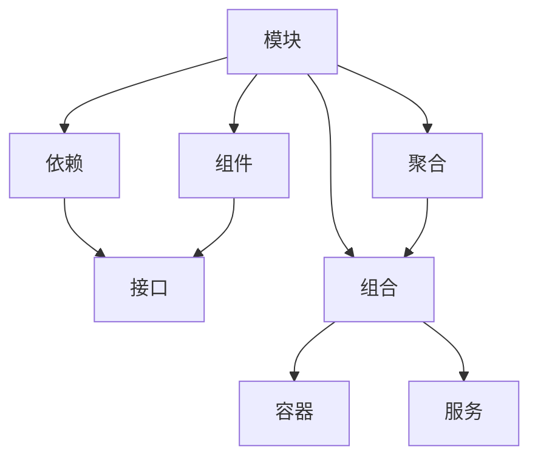
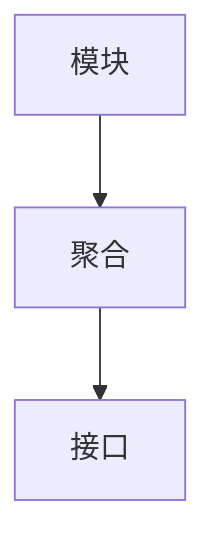
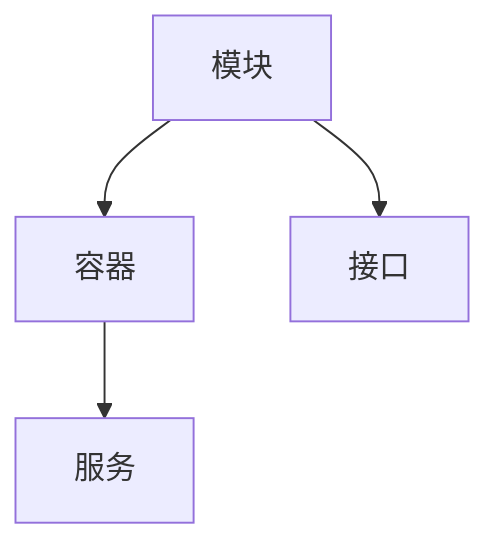
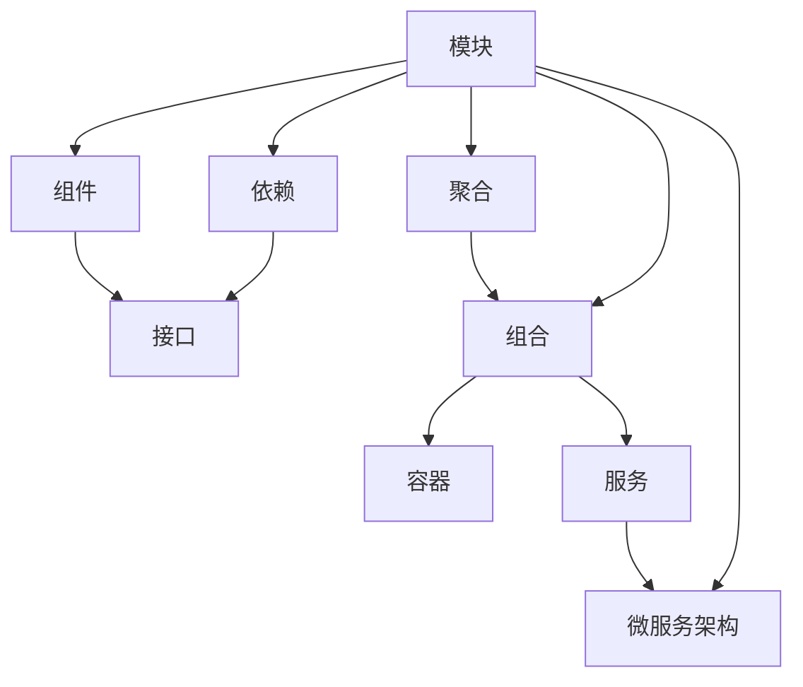

                 

# 软件 2.0 的模块化：融合成最佳整体

> 关键词：
1. 模块化设计
2. 组件化开发
3. 系统解耦
4. 微服务架构
5. 容器化部署
6. DevOps 实践
7. 持续集成与持续部署(CI/CD)

## 1. 背景介绍

### 1.1 问题由来

随着软件规模的不断扩大，传统单体应用带来的问题日益凸显。单点故障、扩展性差、部署复杂等问题严重影响软件系统的稳定性和可维护性。为应对这些挑战，软件工程领域逐步发展出模块化设计、组件化开发等思想和技术，致力于构建更加健壮、灵活、易于维护的软件系统。

软件 2.0（Software 2.0）的概念，源于软件工程专家Andy Pau在 2013 年的一篇文章中提出。他指出，软件系统应该像数据库系统一样，支持任意层级、任意粒度的模块组合，实现真正的模块化设计。这种模块化设计不仅能够降低开发成本、提高软件复用性，还能够提高系统的扩展性和可靠性。

### 1.2 问题核心关键点

软件 2.0 的核心思想是将软件系统拆分成多个独立、可复用的模块，并通过合理的设计和组合，实现最佳的系统性能和功能。模块化的关键点在于：

1. **模块粒度**：模块应该足够小，具有独立性，以便于复用和维护。同时，模块间的接口清晰、稳定，便于集成。
2. **模块解耦**：模块间通过接口通信，不依赖于具体的实现细节，实现高内聚、低耦合，提高系统的灵活性和可扩展性。
3. **组合灵活性**：模块可以任意组合、嵌套，实现复杂的系统功能，同时保持系统的清晰和易维护性。
4. **开发效率**：模块化设计可以并行开发，缩短开发周期，提高开发效率。
5. **持续演进**：模块化的系统更易于持续演进，能够快速适应业务需求的变化，保持系统的先进性和竞争力。

这些关键点构成了软件 2.0 模块化设计的基石，为构建高质量软件系统提供了指导思想和实践方法。

## 2. 核心概念与联系

### 2.1 核心概念概述

为更好地理解软件 2.0 的模块化设计，本节将介绍几个密切相关的核心概念：

- **模块（Module）**：指软件系统中的独立、可复用的功能单元。模块具有清晰的接口和明确的边界，能够与其他模块独立运行。
- **组件（Component）**：指由一组类、接口、资源等构成的可复用单元，通常是模块的子集。组件比模块更细粒度，但同样具有独立性和复用性。
- **依赖（Dependency）**：指模块或组件间的相互作用关系。依赖关系通过接口或服务实现，避免模块间直接的耦合。
- **聚合（Aggregation）**：指通过接口将多个模块组合成一个更高级别的模块或组件。聚合可以是静态的，也可以是动态的，实现系统的灵活扩展。
- **组合（Composition）**：指将多个模块或组件组合成一个系统，实现复杂功能。组合依赖于良好的接口设计和模块解耦。
- **容器（Container）**：指用于封装和管理模块或组件的运行环境。容器提供资源隔离、服务发现、健康检查等功能，提升系统的可靠性和可维护性。
- **服务（Service）**：指通过接口提供的功能模块，通常运行在独立的进程或容器中，实现松散耦合和灵活扩展。

这些核心概念之间的逻辑关系可以通过以下Mermaid流程图来展示：



这个流程图展示了几类核心概念之间的关系：

1. 模块由组件组成，通过接口实现依赖。
2. 组件可以聚合成模块，实现系统的灵活扩展。
3. 模块或组件组合成系统，实现复杂功能。
4. 模块或组件运行在容器中，提升系统的可靠性和可维护性。
5. 模块或组件提供服务，实现松散耦合和灵活扩展。

通过这个流程图，我们可以更清晰地理解软件 2.0 模块化设计的整体架构。

### 2.2 概念间的关系

这些核心概念之间存在着紧密的联系，形成了软件 2.0 模块化设计的完整生态系统。下面通过几个Mermaid流程图来展示这些概念之间的关系。

#### 2.2.1 模块与组件的关系


这个流程图展示了模块与组件的关系。模块由一组组件组成，通过接口实现依赖，组件可以灵活组合，实现复杂功能。

#### 2.2.2 模块与依赖的关系


这个流程图展示了模块与依赖的关系。模块通过接口与其他模块或组件通信，依赖关系明确、稳定，实现松散耦合。

#### 2.2.3 模块与聚合的关系



这个流程图展示了模块与聚合的关系。多个模块可以聚合成一个更高级别的模块，实现系统的灵活扩展。

#### 2.2.4 模块与组合的关系


这个流程图展示了模块与组合的关系。多个模块可以组合成一个系统，实现复杂功能，同时保持系统的清晰和易维护性。

#### 2.2.5 模块与容器和服务的联系



这个流程图展示了模块与容器和服务的联系。模块运行在容器中，提供服务，实现松散耦合和灵活扩展。

### 2.3 核心概念的整体架构

最后，我们用一个综合的流程图来展示这些核心概念在大语言模型微调过程中的整体架构：



这个综合流程图展示了从模块化设计到微服务架构的全过程。模块化设计通过组件、依赖、接口等实现，可以灵活组合、聚合，形成微服务架构。微服务架构通过容器和服务提供，实现松散耦合和灵活扩展。

## 3. 核心算法原理 & 具体操作步骤
### 3.1 算法原理概述

软件 2.0 的模块化设计，本质上是一种系统架构的设计思想。其核心思想是将软件系统拆分成多个独立、可复用的模块，并通过合理的设计和组合，实现最佳的系统性能和功能。

形式化地，假设软件系统由 $N$ 个模块 $M_1, M_2, ..., M_N$ 组成，每个模块有 $C_i$ 个组件，其中 $C_i$ 表示模块的粒度。模块之间通过接口 $I_{ij}$ 实现依赖关系，接口定义了模块间通信的方式和数据格式。模块可以聚合成更高层次的模块 $M_k$，也可以通过组合形成复杂的系统功能。

定义软件系统的总接口 $I_{tot}$ 为系统对外提供的服务接口，其功能可以通过模块的组合和聚合实现。系统功能可以表示为 $F_{tot} = F_1 \times F_2 \times ... \times F_N$，其中 $F_i$ 为模块 $M_i$ 的功能，$\times$ 表示模块间的功能组合和聚合。

### 3.2 算法步骤详解

软件 2.0 的模块化设计一般包括以下几个关键步骤：

**Step 1: 需求分析和设计**

- 分析软件系统的功能需求，确定模块的粒度和功能边界。
- 设计模块的接口，明确模块间依赖关系。
- 设计模块的组合和聚合方式，实现系统的灵活扩展。

**Step 2: 模块实现和测试**

- 实现每个模块的功能，确保模块的独立性和复用性。
- 对模块进行单元测试和集成测试，确保模块的稳定性和可靠性。
- 对模块的接口进行测试，验证接口的正确性和稳定性。

**Step 3: 模块组合和部署**

- 根据模块的功能需求，选择合适的组合和聚合方式，实现系统的复杂功能。
- 将模块部署到容器中，提供服务，实现松散耦合和灵活扩展。
- 对系统进行端到端测试，确保系统的完整性和稳定性。

**Step 4: 系统维护和演进**

- 对系统进行持续维护，及时修复模块和接口中的问题。
- 根据业务需求的变化，动态调整模块的组合和聚合方式，实现系统的持续演进。
- 采用持续集成与持续部署（CI/CD）实践，加快系统的迭代速度。

### 3.3 算法优缺点

软件 2.0 的模块化设计具有以下优点：

1. **灵活性高**：模块可以灵活组合和聚合，适应不同的业务需求和变化。
2. **可复用性强**：模块具有独立性，可以在多个系统中复用，减少开发成本。
3. **维护性高**：模块的独立性和接口的稳定性，使得系统的维护更加简单和高效。
4. **扩展性强**：模块的组合和聚合方式，实现系统的灵活扩展，满足复杂的业务需求。
5. **开发效率高**：模块的并行开发和组合方式，缩短开发周期，提高开发效率。

同时，软件 2.0 的模块化设计也存在一些缺点：

1. **接口复杂性高**：模块间依赖关系和接口复杂，需要额外的时间和精力进行设计和维护。
2. **模块间耦合性强**：虽然模块间松散耦合，但接口的依赖关系仍然可能导致耦合性过强。
3. **系统调试困难**：模块的组合和聚合方式可能带来系统的调试和排错难度。
4. **资源消耗大**：多个模块和服务的组合，可能带来资源的消耗和管理的复杂性。

尽管存在这些缺点，但通过合理的设计和实践，软件 2.0 的模块化设计仍然能够带来显著的性能和功能提升，为构建高质量软件系统提供有力保障。

### 3.4 算法应用领域

软件 2.0 的模块化设计已经广泛应用于软件工程的各个领域，包括但不限于：

- **企业级应用**：大型企业系统，如电商平台、ERP系统、CRM系统等，通过模块化设计实现系统的灵活扩展和高效维护。
- **云计算平台**：云计算平台，如AWS、Azure、阿里云等，通过模块化设计实现资源的灵活调度和服务的高可用性。
- **微服务架构**：微服务架构，如Netflix、Airbnb、支付宝等，通过模块化设计实现服务的灵活组合和高效部署。
- **DevOps 实践**：DevOps 实践，如CI/CD、自动化测试、持续集成等，通过模块化设计实现系统的自动化和高效运维。
- **大数据平台**：大数据平台，如Hadoop、Spark、Flink等，通过模块化设计实现数据的灵活处理和高效分析。

以上应用领域展示了软件 2.0 模块化设计的广泛适用性和巨大潜力，为构建高质量的软件系统提供了有力支持。

## 4. 数学模型和公式 & 详细讲解  
### 4.1 数学模型构建

本节将使用数学语言对软件 2.0 的模块化设计进行更加严格的刻画。

假设软件系统由 $N$ 个模块 $M_1, M_2, ..., M_N$ 组成，每个模块有 $C_i$ 个组件，其中 $C_i$ 表示模块的粒度。模块之间通过接口 $I_{ij}$ 实现依赖关系，接口定义了模块间通信的方式和数据格式。模块可以聚合成更高层次的模块 $M_k$，也可以通过组合形成复杂的系统功能。

定义软件系统的总接口 $I_{tot}$ 为系统对外提供的服务接口，其功能可以通过模块的组合和聚合实现。系统功能可以表示为 $F_{tot} = F_1 \times F_2 \times ... \times F_N$，其中 $F_i$ 为模块 $M_i$ 的功能，$\times$ 表示模块间的功能组合和聚合。

### 4.2 公式推导过程

以下我们以一个简单的模块化系统为例，推导系统功能的计算公式。

假设系统由两个模块 $M_1$ 和 $M_2$ 组成，每个模块有两个组件 $C_{1i}$ 和 $C_{2i}$，其中 $i \in \{1,2\}$ 表示组件编号。模块间通过接口 $I_{12}$ 实现依赖关系，接口定义了模块间通信的方式和数据格式。

模块 $M_1$ 的功能可以表示为 $F_1 = F_{11} \times F_{12}$，其中 $F_{11}$ 为组件 $C_{11}$ 的功能，$F_{12}$ 为组件 $C_{12}$ 的功能。模块 $M_2$ 的功能可以表示为 $F_2 = F_{21} \times F_{22}$，其中 $F_{21}$ 为组件 $C_{21}$ 的功能，$F_{22}$ 为组件 $C_{22}$ 的功能。

系统总功能 $F_{tot}$ 可以表示为 $F_{tot} = F_1 \times F_2$，其中 $F_1 = F_{11} \times F_{12}$，$F_2 = F_{21} \times F_{22}$。

### 4.3 案例分析与讲解

假设我们构建一个简单的模块化电商系统，该系统包括商品管理模块 $M_1$ 和订单管理模块 $M_2$。商品管理模块包含商品添加和商品查询两个组件，订单管理模块包含订单添加和订单查询两个组件。

定义商品添加组件的功能为 $F_{11} = C_{11}$，商品查询组件的功能为 $F_{12} = C_{12}$，订单添加组件的功能为 $F_{21} = C_{21}$，订单查询组件的功能为 $F_{22} = C_{22}$。

系统总功能 $F_{tot}$ 可以表示为 $F_{tot} = F_1 \times F_2$，其中 $F_1 = F_{11} \times F_{12} = C_{11} \times C_{12}$，$F_2 = F_{21} \times F_{22} = C_{21} \times C_{22}$。

假设系统需要同时支持商品添加、商品查询、订单添加和订单查询功能，则可以设计如下接口：

- 商品添加接口 $I_{11}$：接收商品信息，调用商品管理模块的添加组件。
- 商品查询接口 $I_{12}$：接收商品ID，调用商品管理模块的查询组件。
- 订单添加接口 $I_{21}$：接收订单信息，调用订单管理模块的添加组件。
- 订单查询接口 $I_{22}$：接收订单ID，调用订单管理模块的查询组件。

通过以上设计，商品管理模块和订单管理模块可以独立运行，同时通过接口实现依赖关系，组合形成完整的电商系统功能。

## 5. 项目实践：代码实例和详细解释说明
### 5.1 开发环境搭建

在进行模块化设计实践前，我们需要准备好开发环境。以下是使用Python进行Flask框架开发的环境配置流程：

1. 安装Anaconda：从官网下载并安装Anaconda，用于创建独立的Python环境。

2. 创建并激活虚拟环境：
```bash
conda create -n flask-env python=3.8 
conda activate flask-env
```

3. 安装Flask：
```bash
pip install Flask
```

4. 安装Flask-RESTful：
```bash
pip install Flask-RESTful
```

5. 安装Flask-Testing：
```bash
pip install Flask-Testing
```

完成上述步骤后，即可在`flask-env`环境中开始模块化设计实践。

### 5.2 源代码详细实现

下面我们以电商系统为例，给出使用Flask框架进行模块化设计的PyTorch代码实现。

首先，定义商品管理模块的接口和功能：

```python
from flask import Flask, request, jsonify

app = Flask(__name__)

@app.route('/product', methods=['POST', 'GET'])
def product():
    if request.method == 'POST':
        product_info = request.json
        # 调用商品添加组件，将商品信息添加到数据库中
        add_product(product_info)
        return jsonify({'status': 'success'})
    elif request.method == 'GET':
        product_id = request.args.get('id')
        # 调用商品查询组件，从数据库中查询商品信息
        product_info = query_product(product_id)
        return jsonify({'product': product_info})

def add_product(product_info):
    # 实现商品添加组件的功能
    pass

def query_product(product_id):
    # 实现商品查询组件的功能
    pass
```

然后，定义订单管理模块的接口和功能：

```python
@app.route('/order', methods=['POST', 'GET'])
def order():
    if request.method == 'POST':
        order_info = request.json
        # 调用订单添加组件，将订单信息添加到数据库中
        add_order(order_info)
        return jsonify({'status': 'success'})
    elif request.method == 'GET':
        order_id = request.args.get('id')
        # 调用订单查询组件，从数据库中查询订单信息
        order_info = query_order(order_id)
        return jsonify({'order': order_info})

def add_order(order_info):
    # 实现订单添加组件的功能
    pass

def query_order(order_id):
    # 实现订单查询组件的功能
    pass
```

最后，在`__init__.py`文件中初始化Flask应用，并启动服务：

```python
from product import add_product, query_product
from order import add_order, query_order

@app.before_request
def setup():
    setup_products()
    setup_orders()

@app.route('/')
def index():
    return 'Welcome to the Flask-based moduleized e-commerce system.'

if __name__ == '__main__':
    app.run(debug=True)
```

在`setup_products`和`setup_orders`函数中，实现模块初始化操作，如连接数据库、加载数据等。通过以上代码，我们构建了一个简单的模块化电商系统，实现了商品添加、商品查询、订单添加和订单查询功能。

### 5.3 代码解读与分析

让我们再详细解读一下关键代码的实现细节：

**Flask应用**：
- `__init__.py`文件：初始化Flask应用，定义全局变量和路由。
- `__main__.py`文件：启动Flask服务，接收HTTP请求。

**商品管理模块**：
- `product`函数：定义商品管理的接口，支持添加和查询功能。
- `add_product`函数：实现商品添加组件的功能，将商品信息添加到数据库中。
- `query_product`函数：实现商品查询组件的功能，从数据库中查询商品信息。

**订单管理模块**：
- `order`函数：定义订单管理的接口，支持添加和查询功能。
- `add_order`函数：实现订单添加组件的功能，将订单信息添加到数据库中。
- `query_order`函数：实现订单查询组件的功能，从数据库中查询订单信息。

**setup函数**：
- `setup_products`函数：实现模块初始化操作，如连接数据库、加载数据等。

通过以上代码，我们展示了使用Flask框架进行模块化设计的完整过程。可以看到，Flask框架的RESTful风格API设计，使得模块之间的接口清晰、稳定，便于组合和聚合。

当然，工业级的系统实现还需考虑更多因素，如模块的扩展性、容错性、安全性等。但核心的模块化设计思想和Flask框架的使用方法，能够显著提升系统的开发效率和可维护性。

## 6. 实际应用场景
### 6.1 智能客服系统

模块化设计的思想，可以广泛应用于智能客服系统的构建。传统客服往往需要配备大量人力，高峰期响应缓慢，且一致性和专业性难以保证。通过模块化设计，智能客服系统可以7x24小时不间断服务，快速响应客户咨询，用自然流畅的语言解答各类常见问题。

在技术实现上，可以收集企业内部的历史客服对话记录，将问题和最佳答复构建成监督数据，在此基础上对预训练语言模型进行微调。微调后的语言模型能够自动理解用户意图，匹配最合适的答案模板进行回复。对于客户提出的新问题，还可以接入检索系统实时搜索相关内容，动态组织生成回答。如此构建的智能客服系统，能大幅提升客户咨询体验和问题解决效率。

### 6.2 金融舆情监测

金融机构需要实时监测市场舆论动向，以便及时应对负面信息传播，规避金融风险。传统的人工监测方式成本高、效率低，难以应对网络时代海量信息爆发的挑战。通过模块化设计，金融舆情监测系统可以实现更加高效、灵活的自动化监测。

具体而言，可以收集金融领域相关的新闻、报道、评论等文本数据，并对其进行主题标注和情感标注。在此基础上对预训练语言模型进行微调，使其能够自动判断文本属于何种主题，情感倾向是正面、中性还是负面。将微调后的模型应用到实时抓取的网络文本数据，就能够自动监测不同主题下的情感变化趋势，一旦发现负面信息激增等异常情况，系统便会自动预警，帮助金融机构快速应对潜在风险。

### 6.3 个性化推荐系统

当前的推荐系统往往只依赖用户的历史行为数据进行物品推荐，无法深入理解用户的真实兴趣偏好。通过模块化设计，个性化推荐系统可以更好地挖掘用户行为背后的语义信息，从而提供更精准、多样的推荐内容。

在实践中，可以收集用户浏览、点击、评论、分享等行为数据，提取和用户交互的物品标题、描述、标签等文本内容。将文本内容作为模型输入，用户的后续行为（如是否点击、购买等）作为监督信号，在此基础上微调预训练语言模型。微调后的模型能够从文本内容中准确把握用户的兴趣点。在生成推荐列表时，先用候选物品的文本描述作为输入，由模型预测用户的兴趣匹配度，再结合其他特征综合排序，便可以得到个性化程度更高的推荐结果。

### 6.4 未来应用展望

随着模块化设计思想的发展和应用，软件 2.0 模块化设计必将在更多领域得到应用，为传统行业带来变革性影响。

在智慧医疗领域，模块化设计的思想可以应用于医疗问答、病历分析、药物研发等任务，提升医疗服务的智能化水平，辅助医生诊疗，加速新药开发进程。

在智能教育领域，模块化设计的思想可应用于作业批改、学情分析、知识推荐等方面，因材施教，促进教育公平，提高教学质量。

在智慧城市治理中，模块化设计的思想可以应用于城市事件监测、舆情分析、应急指挥等环节，提高城市管理的自动化和智能化水平，构建更安全、高效的未来城市。

此外，在企业生产、社会治理、文娱传媒等众多领域，模块化设计的思想也将不断涌现，为各行各业带来新的技术路径和应用场景。相信随着模块化设计思想的深入研究和应用，软件 2.0 模块化设计必将成为未来软件工程的重要方向。

## 7. 工具和资源推荐
### 7.1 学习资源推荐

为了帮助开发者系统掌握软件 2.0 的模块化设计思想和实践方法，这里推荐一些优质的学习资源：

1. 《软件 2.0 的崛起》系列博文：由软件 2.0 领域的知名专家撰写，深入浅出地介绍了软件 2.0 的概念、思想和应用。

2. 《微服务架构设计模式》书籍：介绍微服务架构的设计模式、最佳实践和挑战，适合软件开发人员参考。

3. 《软件架构之美》书籍：深入探讨软件架构的设计原则和设计模式，适合软件架构师和设计人员阅读。

4. 《设计模式：可复用面向对象软件的基础》书籍：介绍常用的设计模式及其应用场景，适合软件开发者学习。

5. 《敏捷软件开发：原则、模式与实践》书籍：介绍敏捷开发的原则和实践方法，适合软件开发人员参考。

通过对这些资源的学习实践，相信你一定能够快速掌握软件 2.0 模块化设计的精髓，并用于解决实际的系统问题。

### 7.2 开发工具推荐

高效的开发离不开优秀的工具支持。以下是几款用于模块化设计开发的常用工具：

1. Flask：基于Python的开源Web框架，支持RESTful风格API设计，适合模块化系统开发。

2. Django：基于Python的开源Web框架，支持MVC设计模式，适合企业级应用的开发。

3. Spring Boot：基于Java的开源Web框架，支持Spring生态系统的整合，适合企业级应用的开发。

4. Spring Cloud：基于Spring Boot的企业级微服务架构，支持服务发现、配置管理、负载均衡等功能。

5. Kubernetes：开源容器编排平台，支持容器化应用的管理和部署，适合微服务架构的扩展和运维。

6. Docker：开源容器技术，支持应用的无缝部署和迁移，适合微服务架构的构建和部署。

合理利用这些工具，可以显著提升模块化设计的开发效率，加快创新迭代的步伐。

### 7.3 相关论文推荐

软件 2.0 模块化设计的发展源于学界的持续研究。以下是几篇奠基性的相关论文，推荐阅读：

1. 《软件

