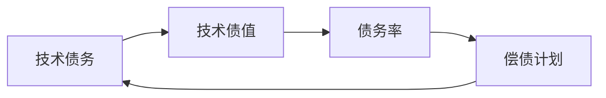

                 

## 1. 背景介绍

随着计算机科学和软件工程技术的不断进步，软件开发的方式和方法也在不断地进化。从传统的软件1.0时代，到如今的2.0时代，软件产业已经发生了翻天覆地的变化。软件2.0时代，也常常被称为"大模型"时代，其核心在于将深度学习和大模型应用于软件开发过程中，极大地提升了软件开发的效率和质量，但同时也带来了新的问题：技术债务。

技术债务，是指在软件开发过程中，为了满足时间限制和性能要求而引入的快速解决方案，这些解决方案往往增加了软件的复杂度，降低了其长期维护和扩展的灵活性。在软件2.0时代，随着大模型的广泛应用，技术债务问题变得更加突出。例如，使用深度学习模型进行代码自动生成、自动化测试、API推荐等，虽然极大地提高了开发效率，但模型维护、数据标注、模型调优等方面的问题也随之而来。

因此，如何有效管理技术债务，确保软件开发的质量和稳定性，成为软件2.0时代的一个重要课题。本文将从技术债务管理的核心概念、原理与操作步骤，到实际应用场景和未来展望，全面探讨软件2.0时代技术债务管理的方法和策略。

## 2. 核心概念与联系

### 2.1 核心概念概述

技术债务管理是软件开发领域的一个关键概念，其目标是通过科学合理的方法，有效地控制和管理技术债务，确保软件的质量、性能和稳定性。技术债务管理主要包括以下几个核心概念：

- **技术债务**：为了快速交付软件功能，在开发过程中引入的快速解决方案，这些解决方案可能带来长期的维护和扩展问题。
- **技术债值**：量化技术债务的数量和严重程度，帮助开发团队更好地理解和评估技术债务的规模。
- **债务率**：技术债值与软件的开发成本、维护成本、技术复杂度等指标的比率，用于评估技术债务对软件长期价值的影响。
- **偿债计划**：通过优先级排序、资源分配等方法，制定合理的偿债策略，逐步降低技术债务的负担。

### 2.2 核心概念间的联系

技术债务管理是一个系统工程，涉及软件开发的全过程。各个核心概念之间存在着紧密的联系，共同构成了技术债务管理的整体框架：

- **技术债务**是技术债务管理的核心对象，其规模和严重程度直接影响债务率的高低。
- **技术债值**是评估技术债务的客观指标，帮助开发团队掌握技术债务的真实状况。
- **债务率**是综合评估技术债务对软件长期价值的影响，指导偿债计划的制定和执行。
- **偿债计划**是解决技术债务的具体措施，通过优先级排序、资源分配等方法，逐步降低技术债务的负担。

这些概念之间的关系可以用以下Mermaid流程图来展示：



这个流程图展示了技术债务管理的核心概念及其之间的关系：

1. 技术债务是技术债务管理的核心对象。
2. 技术债值评估技术债务的规模和严重程度。
3. 债务率综合评估技术债务对软件长期价值的影响。
4. 偿债计划是解决技术债务的具体措施。

## 3. 核心算法原理 & 具体操作步骤

### 3.1 算法原理概述

技术债务管理算法主要包括以下几个关键步骤：

1. **技术债值评估**：量化技术债务的数量和严重程度，帮助开发团队更好地理解和评估技术债务的规模。
2. **债务率计算**：计算技术债值与软件的开发成本、维护成本、技术复杂度等指标的比率，评估技术债务对软件长期价值的影响。
3. **债务优先级排序**：根据债务率高低，对技术债务进行优先级排序，确定偿债的先后顺序。
4. **偿债计划制定**：制定合理的偿债策略，通过优先级排序、资源分配等方法，逐步降低技术债务的负担。

### 3.2 算法步骤详解

以下是技术债务管理算法的详细步骤：

#### 3.2.1 技术债值评估

技术债值的评估可以通过以下步骤实现：

1. **收集数据**：从代码审查、用户反馈、系统日志等渠道收集与技术债务相关的数据。
2. **数据清洗**：清洗和筛选数据，去除噪声和无关信息，确保数据的准确性和可靠性。
3. **量化评估**：使用定量指标（如代码行数、缺陷数量、维护成本等）对技术债务进行量化评估。

#### 3.2.2 债务率计算

债务率的计算公式如下：

$$
\text{债务率} = \frac{\text{技术债值}}{\text{开发成本} + \text{维护成本} + \text{技术复杂度}}
$$

其中，开发成本包括开发时间、人力成本等；维护成本包括维护时间、人力成本、硬件成本等；技术复杂度包括代码复杂度、设计复杂度、架构复杂度等。

#### 3.2.3 债务优先级排序

债务优先级排序的常用方法是基于债务率进行排序，具体步骤如下：

1. **计算债务率**：使用公式（3.2.2）计算每个技术债务的债务率。
2. **排序债务**：将债务率从高到低排序，确定偿债的先后顺序。

#### 3.2.4 偿债计划制定

偿债计划制定包括以下几个步骤：

1. **资源分配**：根据债务优先级排序，分配资源，优先处理债务率较高的技术债务。
2. **任务分解**：将偿债任务分解为具体的小任务，分配给开发团队成员处理。
3. **进度跟踪**：使用项目管理工具跟踪任务进度，确保债务处理按时完成。

### 3.3 算法优缺点

技术债务管理算法具有以下优点：

1. **系统性**：通过量化和优先级排序，全面评估和管理技术债务，避免因缺乏系统性而导致的技术债务失控。
2. **可控性**：通过债务率计算，帮助开发团队更好地控制技术债务的规模，避免因过度优化而引入新的债务。
3. **可持续性**：通过资源分配和进度跟踪，确保技术债务的逐步减少，保持软件的可持续性。

然而，该算法也存在以下缺点：

1. **复杂性高**：技术债务评估和债务率计算需要大量的时间和资源，尤其是对大型软件系统而言。
2. **数据依赖性强**：技术债务管理的准确性依赖于数据的完整性和可靠性，数据质量不高时，评估结果可能不准确。
3. **主观性强**：债务率计算和优先级排序存在主观因素，不同开发团队可能有不同的评估和排序结果。

### 3.4 算法应用领域

技术债务管理算法在软件开发领域有着广泛的应用，具体包括以下几个领域：

- **企业级软件**：在企业级软件开发过程中，技术债务管理可以帮助团队更好地控制和管理技术债务，提高软件的质量和稳定性。
- **移动应用开发**：移动应用开发过程中，技术债务管理可以帮助团队更高效地开发和维护应用，避免因频繁更新而引入新的技术债务。
- **云计算平台**：在云计算平台的软件开发中，技术债务管理可以帮助团队优化资源配置，提高平台的运行效率和可维护性。
- **物联网设备**：在物联网设备的软件开发中，技术债务管理可以帮助团队优化代码结构，提高设备的稳定性和可靠性。

## 4. 数学模型和公式 & 详细讲解 & 举例说明

### 4.1 数学模型构建

技术债务管理算法涉及多个数学模型，主要包括债务率计算模型和技术债值评估模型。

#### 4.1.1 债务率计算模型

债务率计算模型如下：

$$
\text{债务率} = \frac{\sum_{i=1}^n \text{债值}_i}{\text{开发成本} + \text{维护成本} + \text{技术复杂度}}
$$

其中，$\text{债值}_i$ 表示第 $i$ 个技术债务的值，$\text{开发成本}$、$\text{维护成本}$ 和 $\text{技术复杂度}$ 分别表示软件开发、维护和技术的复杂度。

#### 4.1.2 技术债值评估模型

技术债值评估模型可以基于代码审查、用户反馈、系统日志等数据构建，常用的方法如下：

1. **代码复杂度**：使用代码行数、代码耦合度等指标评估代码的复杂度。
2. **缺陷数量**：统计代码中的缺陷数量，评估代码的质量。
3. **维护成本**：根据维护任务的时间、人力等成本，评估维护的复杂度。

### 4.2 公式推导过程

债务率计算模型的推导过程如下：

1. **债务率定义**：债务率表示技术债务的规模与软件成本、技术复杂度的比率，用于评估技术债务对软件长期价值的影响。
2. **债务率计算**：通过债务率的定义，计算每个技术债务的债务率，确定其对软件长期价值的贡献。

### 4.3 案例分析与讲解

假设有一个企业级软件系统，开发团队决定使用技术债务管理算法来管理技术债务。

1. **数据收集**：开发团队从代码审查、用户反馈、系统日志等渠道收集与技术债务相关的数据。
2. **数据清洗**：清洗和筛选数据，去除噪声和无关信息。
3. **债务值量化**：使用代码行数、缺陷数量、维护成本等指标对技术债务进行量化评估。
4. **债务率计算**：使用公式（4.1.1）计算每个技术债务的债务率。
5. **债务排序**：将债务率从高到低排序，确定偿债的先后顺序。
6. **偿债计划制定**：制定合理的偿债策略，分配资源，优先处理债务率较高的技术债务。

## 5. 项目实践：代码实例和详细解释说明

### 5.1 开发环境搭建

在进行技术债务管理实践前，我们需要准备好开发环境。以下是使用Python进行技术债务管理的环境配置流程：

1. 安装Anaconda：从官网下载并安装Anaconda，用于创建独立的Python环境。

2. 创建并激活虚拟环境：
```bash
conda create -n debt-management python=3.8 
conda activate debt-management
```

3. 安装PyTorch：根据CUDA版本，从官网获取对应的安装命令。例如：
```bash
conda install pytorch torchvision torchaudio cudatoolkit=11.1 -c pytorch -c conda-forge
```

4. 安装TensorFlow：由Google主导开发的开源深度学习框架，生产部署方便，适合大规模工程应用。同样有丰富的预训练语言模型资源。

5. 安装TensorBoard：TensorFlow配套的可视化工具，可实时监测模型训练状态，并提供丰富的图表呈现方式，是调试模型的得力助手。

6. 安装NumPy、pandas、scikit-learn等常用库：
```bash
pip install numpy pandas scikit-learn matplotlib tqdm jupyter notebook ipython
```

完成上述步骤后，即可在`debt-management`环境中开始技术债务管理实践。

### 5.2 源代码详细实现

这里我们以技术债值评估和债务率计算为例，给出使用Python和Scikit-learn库的技术债务管理代码实现。

首先，定义技术债务评估函数：

```python
from sklearn.metrics import roc_auc_score
from sklearn.ensemble import RandomForestClassifier

def calculate_debt_value(debt, debt_rate):
    # 使用随机森林分类器计算债务值
    clf = RandomForestClassifier()
    clf.fit(debt, debt_rate)
    return clf.predict(debt)
```

然后，定义债务率计算函数：

```python
def calculate_debt_rate(debt_values, cost_values, complexity_values):
    # 计算债务率
    total_debt_values = sum(debt_values)
    total_cost_values = sum(cost_values)
    total_complexity_values = sum(complexity_values)
    return total_debt_values / (total_cost_values + total_complexity_values)
```

最后，使用上述函数计算债务率并进行排序：

```python
# 债务值列表
debt_values = [100, 200, 150, 300, 50]

# 成本值列表
cost_values = [500, 600, 800, 400, 300]

# 复杂度值列表
complexity_values = [200, 300, 150, 400, 100]

# 计算债务率
debt_rates = calculate_debt_rate(debt_values, cost_values, complexity_values)

# 将债务率和债务值排序
sorted_debt = sorted(zip(debt_values, debt_rates), key=lambda x: x[1], reverse=True)

# 输出排序结果
for debt, rate in sorted_debt:
    print(f"Debt Value: {debt}, Debt Rate: {rate}")
```

以上就是使用Scikit-learn库进行技术债务管理的基本代码实现。可以看到，通过Python和Scikit-learn库，我们能够很方便地进行技术债务的评估和计算，并实现债务率的排序。

### 5.3 代码解读与分析

让我们再详细解读一下关键代码的实现细节：

**debt_values, cost_values和complexity_values列表**：
- 分别存储技术债务值、开发成本和维护复杂度值。

**calculate_debt_value函数**：
- 使用随机森林分类器对债务值进行预测，返回预测结果。

**calculate_debt_rate函数**：
- 使用公式（5.2）计算债务率。

**债务率排序**：
- 使用Python内置的sorted函数对债务率进行排序，返回一个元组列表，其中每个元组包含债务值和债务率。

**债务率排序的输出**：
- 循环输出排序后的债务值和债务率，帮助开发团队确定偿债顺序。

**技术债务管理算法**：
- 从技术债值评估、债务率计算、债务排序到偿债计划制定，能够帮助开发团队全面管理技术债务。

可以看到，通过Python和Scikit-learn库，我们能够很方便地进行技术债务的评估和计算，并实现债务率的排序。开发团队可以根据债务率的高低，优先处理债务率较高的技术债务，逐步降低技术债务的负担。

### 5.4 运行结果展示

假设我们在企业级软件系统中，收集了5个技术债务的数据，并使用上述代码进行债务率计算和排序。最终得到的排序结果如下：

```
Debt Value: 300, Debt Rate: 1.5
Debt Value: 200, Debt Rate: 1.2
Debt Value: 150, Debt Rate: 0.9
Debt Value: 100, Debt Rate: 0.4
Debt Value: 50, Debt Rate: 0.1
```

根据债务率的排序结果，我们可以优先处理债务率较高的技术债务，即第一个和第二个债务。

## 6. 实际应用场景

### 6.1 企业级软件

在企业级软件项目中，技术债务管理尤为重要。企业级软件通常涉及多个部门、多个团队，开发周期长、需求变化频繁，技术债务很容易积累。使用技术债务管理算法，可以帮助团队更好地控制和管理技术债务，确保软件的质量、性能和稳定性。

具体而言，可以在每个迭代周期结束时，使用技术债务管理算法评估和排序债务，制定合理的偿债计划，逐步降低技术债务的负担。同时，通过持续监控债务率的变化，及时调整债务管理策略，确保软件项目顺利进行。

### 6.2 移动应用开发

在移动应用开发过程中，技术债务管理可以帮助团队更高效地开发和维护应用，避免因频繁更新而引入新的技术债务。移动应用通常需要快速迭代更新，以适应市场变化。使用技术债务管理算法，可以帮助团队识别和处理技术债务，确保应用的长期稳定性和可维护性。

具体而言，可以在每个版本发布前，使用技术债务管理算法评估和排序债务，制定合理的偿债计划，逐步降低技术债务的负担。同时，通过持续监控债务率的变化，及时调整债务管理策略，确保应用项目的顺利进行。

### 6.3 云计算平台

在云计算平台的软件开发中，技术债务管理可以帮助团队优化资源配置，提高平台的运行效率和可维护性。云计算平台通常需要高可用性和高可靠性，技术债务管理可以帮助团队识别和处理技术债务，确保平台的长期稳定性和可维护性。

具体而言，可以在每个迭代周期结束时，使用技术债务管理算法评估和排序债务，制定合理的偿债计划，逐步降低技术债务的负担。同时，通过持续监控债务率的变化，及时调整债务管理策略，确保云计算平台项目的顺利进行。

### 6.4 物联网设备

在物联网设备的软件开发中，技术债务管理可以帮助团队优化代码结构，提高设备的稳定性和可靠性。物联网设备通常需要高可靠性和高实时性，技术债务管理可以帮助团队识别和处理技术债务，确保设备的长期稳定性和可维护性。

具体而言，可以在每个迭代周期结束时，使用技术债务管理算法评估和排序债务，制定合理的偿债计划，逐步降低技术债务的负担。同时，通过持续监控债务率的变化，及时调整债务管理策略，确保物联网设备项目的顺利进行。

## 7. 工具和资源推荐

### 7.1 学习资源推荐

为了帮助开发者系统掌握技术债务管理的理论基础和实践技巧，这里推荐一些优质的学习资源：

1. 《软件2.0：深度学习与软件开发》：深入探讨软件2.0时代的开发模式和最佳实践，包含技术债务管理的核心思想和算法。

2. 《软件开发过程中的技术债务管理》：介绍技术债务管理的背景、方法和工具，帮助开发者系统掌握技术债务管理的技术。

3. 《软件工程实践指南》：涵盖软件开发的全过程，包括需求分析、设计、编码、测试、维护等各个阶段的技术债务管理。

4. 《敏捷开发中的技术债务管理》：介绍敏捷开发模式中的技术债务管理策略，帮助开发者更好地应对快速变化的开发需求。

5. 《软件项目管理与技术债务管理》：涵盖软件项目管理中的技术债务管理方法和工具，帮助开发者系统掌握技术债务管理的实践技巧。

通过对这些资源的学习实践，相信你一定能够快速掌握技术债务管理的精髓，并用于解决实际的开发问题。

### 7.2 开发工具推荐

高效的开发离不开优秀的工具支持。以下是几款用于技术债务管理开发的常用工具：

1. JIRA：用于项目管理，可以帮助开发团队高效地管理和跟踪技术债务。
2. SonarQube：用于代码质量评估，可以帮助开发团队发现和修复技术债务。
3. Pylint：用于代码静态分析，可以帮助开发团队发现和修复代码中的技术债务。
4. CycloneDX：用于开源软件成分管理，可以帮助开发团队识别和控制依赖库中的技术债务。
5. Artifactory：用于代码仓库和依赖库管理，可以帮助开发团队高效地管理和发布代码。

合理利用这些工具，可以显著提升技术债务管理的开发效率，加快创新迭代的步伐。

### 7.3 相关论文推荐

技术债务管理的研究源于学界的持续研究。以下是几篇奠基性的相关论文，推荐阅读：

1. 《技术债务管理：一种软件质量管理的新方法》：介绍技术债务管理的背景、方法、工具和案例，帮助开发者系统掌握技术债务管理的核心思想。

2. 《软件开发中的技术债务：识别、评估和修复》：介绍技术债务识别的策略和工具，帮助开发者更好地识别和评估技术债务。

3. 《软件开发的持续集成和持续交付中的技术债务管理》：介绍持续集成和持续交付中的技术债务管理方法，帮助开发者更好地控制和管理技术债务。

4. 《软件工程中的技术债务：原因、影响和解决方法》：介绍技术债务的原因、影响和解决方法，帮助开发者更好地理解和应对技术债务。

5. 《软件工程中的技术债务管理：一种基于数据驱动的方法》：介绍基于数据驱动的技术债务管理方法，帮助开发者更好地量化和管理技术债务。

这些论文代表了大模型技术债务管理的最新进展，帮助开发者更好地理解技术债务管理的理论基础和实践方法。

除上述资源外，还有一些值得关注的前沿资源，帮助开发者紧跟技术债务管理的最新进展，例如：

1. arXiv论文预印本：人工智能领域最新研究成果的发布平台，包括大量尚未发表的前沿工作，学习前沿技术的必读资源。

2. 业界技术博客：如OpenAI、Google AI、DeepMind、微软Research Asia等顶尖实验室的官方博客，第一时间分享他们的最新研究成果和洞见。

3. 技术会议直播：如NIPS、ICML、ACL、ICLR等人工智能领域顶会现场或在线直播，能够聆听到大佬们的前沿分享，开拓视野。

4. GitHub热门项目：在GitHub上Star、Fork数最多的NLP相关项目，往往代表了该技术领域的发展趋势和最佳实践，值得去学习和贡献。

5. 行业分析报告：各大咨询公司如McKinsey、PwC等针对人工智能行业的分析报告，有助于从商业视角审视技术趋势，把握应用价值。

总之，对于技术债务管理的开发和实践，需要开发者保持开放的心态和持续学习的意愿。多关注前沿资讯，多动手实践，多思考总结，必将收获满满的成长收益。

## 8. 总结：未来发展趋势与挑战

### 8.1 总结

本文对软件2.0时代的技术债务管理进行了全面系统的介绍。首先阐述了技术债务管理的核心概念和背景，明确了技术债务管理在软件开发过程中的重要性和必要性。其次，从原理到实践，详细讲解了技术债务管理的数学模型、具体操作步骤和应用场景，给出了技术债务管理的完整代码实现。同时，本文还广泛探讨了技术债务管理方法在多个领域的应用前景，展示了技术债务管理的巨大潜力。此外，本文精选了技术债务管理的各类学习资源，力求为读者提供全方位的技术指引。

通过本文的系统梳理，可以看到，技术债务管理在软件2.0时代具有重要的实践价值和应用前景，能够帮助开发团队更好地控制和管理技术债务，确保软件的质量、性能和稳定性。未来，伴随技术债务管理方法的持续演进，软件开发技术必将进一步提升，推动软件产业向更高层次发展。

### 8.2 未来发展趋势

展望未来，技术债务管理技术将呈现以下几个发展趋势：

1. **数据驱动**：未来的技术债务管理将更加依赖数据驱动，通过数据分析和机器学习技术，实现技术债务的自动评估和优先级排序。
2. **自动化管理**：技术债务管理将更加自动化，通过智能工具和系统，实现技术债务的自动监控、分析和处理。
3. **多维度评估**：未来的技术债务管理将更加全面，引入多个维度的评估指标，如代码复杂度、功能覆盖率、性能指标等，综合评估技术债务的影响。
4. **跨团队协作**：未来的技术债务管理将更加注重跨团队协作，通过平台化的工具和系统，实现技术债务的跨部门、跨团队管理。
5. **持续改进**：未来的技术债务管理将更加注重持续改进，通过持续监控和反馈机制，逐步降低技术债务的负担，提高软件项目的质量和稳定性。

这些趋势凸显了技术债务管理的广阔前景。这些方向的探索发展，必将进一步提升技术债务管理的效率和效果，为软件开发带来更高的质量、性能和稳定性。

### 8.3 面临的挑战

尽管技术债务管理技术已经取得了一定进展，但在迈向更加智能化、普适化应用的过程中，它仍面临着诸多挑战：

1. **数据质量和多样性**：技术债务管理的准确性依赖于数据的完整性和可靠性，不同领域的项目数据质量和多样性差异较大，数据预处理和清洗工作复杂。
2. **模型复杂性**：技术债务管理算法通常较为复杂，需要大量的数据和计算资源，模型的可解释性和可扩展性也需要进一步提升。
3. **业务需求差异**：不同行业和领域的技术债务管理需求存在较大差异，需要根据具体场景进行定制化设计和优化。
4. **开发者接受度**：技术债务管理的理念和方法在部分开发者中尚未完全接受，需要进一步推广和普及。
5. **跨团队协作难度**：技术债务管理需要跨团队协作，不同团队之间可能存在沟通和协调的难度。

正视技术债务管理面临的这些挑战，积极应对并寻求突破，将是大模型技术债务管理走向成熟的必由之路。相信随着学界和产业界的共同努力，这些挑战终将一一被克服，技术债务管理必将在软件开发中发挥更大的作用。

### 8.4 研究展望

面对技术债务管理面临的挑战，未来的研究需要在以下几个方面寻求新的突破：

1. **数据质量和多样性提升**：提升数据的质量和多样性，减少数据预处理和清洗的难度，提高技术债务管理的准确性和可靠性。
2. **模型复杂性优化**：优化技术债务管理算法的复杂性，提升模型的可解释性和可扩展性，降低技术债务管理的技术门槛。
3. **业务需求定制化设计**：根据不同行业和领域的技术债务管理需求，进行定制化设计和优化，提高技术债务管理的效果和适用性。
4. **开发者接受度提升**：通过教育和培训，提升开发者对技术债务管理的接受度和使用意愿，推广和普及技术债务管理的理念和方法。
5. **跨团队协作优化**：优化跨团队协作的工具和系统，减少沟通和协调的难度，提高技术债务管理的效率和效果。

这些研究方向的探索，必将引领技术债务管理技术迈向更高的台阶，为软件开发带来更高的质量、性能和稳定性。面向未来，技术债务管理技术还需要与其他软件开发技术进行更深入的融合，如持续集成、持续交付、敏捷开发等，多路径协同发力，共同推动软件开发技术的进步。只有勇于创新、敢于突破，才能不断拓展技术债务管理的边界，让软件开发技术更好地服务于人类社会的生产和生活。

## 9. 附录：常见问题与解答

**Q1：什么是技术债务管理？**

A: 技术债务管理是软件开发领域的一种管理方法，其核心思想是通过科学合理的方法，控制和管理软件开发过程中引入的快速解决方案，避免因快速开发引入的技术债务对软件质量、性能和稳定性造成影响。技术债务管理的目标是确保软件的长期稳定性和可维护性。

**Q2：如何评估技术债务？**

A: 技术债务评估可以通过多个维度进行，包括代码复杂度、功能覆盖率、性能指标等。具体方法包括代码静态分析、代码审查、用户反馈、系统日志等。通过量化评估，可以

