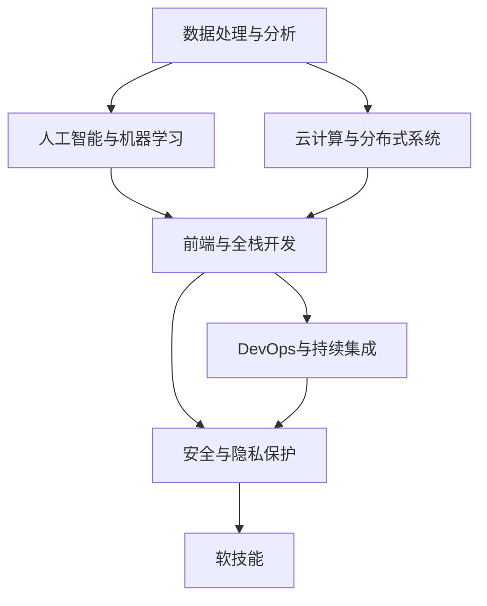
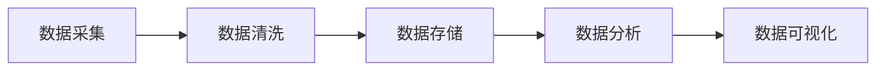
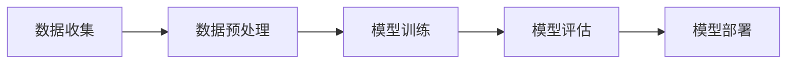
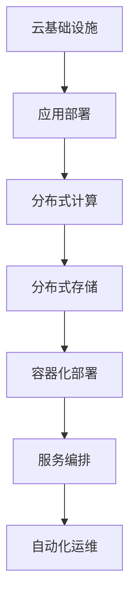
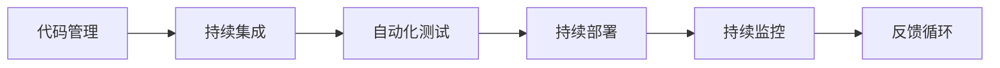
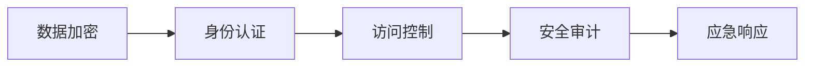
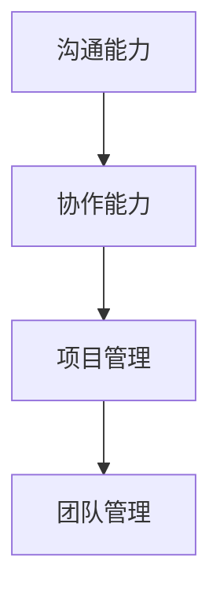

                 

# 软件2.0时代的程序员技能要求

## 1. 背景介绍

### 1.1 问题由来
随着科技的进步和社会的数字化转型，软件开发领域正经历着一场深刻的变革。传统1.0时代以代码为中心，程序员是主要的知识提供者；而2.0时代以数据为中心，数据驱动的智能应用开始成为主流。这种转变不仅要求程序员掌握更多的技术和工具，也对他们提出了更高的技能要求。

### 1.2 问题核心关键点
软件2.0时代，程序员需要具备以下关键技能：
1. 数据处理与分析：能够高效处理和分析大数据，提取有价值的信息。
2. 人工智能与机器学习：掌握机器学习算法和框架，实现智能应用。
3. 云计算与分布式系统：理解云计算平台和分布式系统，实现高可用、高扩展的应用。
4. 前端与全栈开发：具备前端和后端开发能力，实现全栈应用。
5. DevOps与持续集成：理解DevOps理念，实现高效的代码部署与维护。
6. 安全与隐私保护：掌握网络安全知识，保护应用程序和数据安全。
7. 软技能：具备良好的沟通、团队协作和项目管理能力。

### 1.3 问题研究意义
研究软件2.0时代的程序员技能要求，对于培养未来的高素质开发者、推动技术创新和应用落地具有重要意义：
1. 提升人才培养质量：明确技能要求，帮助教育机构和培训机构精准定位教学内容。
2. 加速技术创新：鼓励开发者学习新技术、掌握新工具，提升创新能力。
3. 促进产业升级：提升开发效率，加速企业数字化转型，推动产业升级。
4. 保障数据安全：确保开发者具备安全意识和技能，保护数据隐私和安全。
5. 推动社会进步：通过智能应用解决社会问题，推动社会进步。

## 2. 核心概念与联系

### 2.1 核心概念概述

为了更好地理解软件2.0时代程序员的技能要求，本节将介绍几个密切相关的核心概念：

- **数据处理与分析**：指对大规模数据进行采集、清洗、分析和可视化等操作，提取有价值的信息。
- **人工智能与机器学习**：指通过数据训练模型，实现对数据的学习和预测，构建智能应用。
- **云计算与分布式系统**：指利用云计算平台和分布式系统，实现应用程序的高可用性和高扩展性。
- **前端与全栈开发**：指具备前端开发和后端开发能力，实现全栈应用。
- **DevOps与持续集成**：指通过DevOps实践，实现代码的高效部署、测试和维护。
- **安全与隐私保护**：指具备网络安全知识，保护应用程序和数据的安全。
- **软技能**：指沟通、协作、项目管理等非技术性的软技能，对于团队合作和项目成功的关键。

这些核心概念之间存在着紧密的联系，形成了软件2.0时代程序员的完整技能体系。下面通过一个Mermaid流程图来展示这些概念之间的关系：

### 2.2 概念间的关系

这些核心概念之间存在着紧密的联系，形成了软件2.0时代程序员的完整技能体系。下面我们通过几个Mermaid流程图来展示这些概念之间的关系。

#### 2.2.1 数据处理与分析的核心步骤

这个流程图展示了数据处理与分析的主要步骤：先进行数据采集，然后进行数据清洗和存储，最后进行数据分析和可视化。

#### 2.2.2 人工智能与机器学习的关键过程

这个流程图展示了人工智能与机器学习的主要过程：先进行数据收集和预处理，然后进行模型训练和评估，最后进行模型部署和应用。

#### 2.2.3 云计算与分布式系统的基本架构

这个流程图展示了云计算与分布式系统的主要架构：先进行云基础设施搭建，然后进行应用部署和计算存储，最后进行容器化部署、服务编排和自动化运维。

#### 2.2.4 DevOps与持续集成的主要实践

这个流程图展示了DevOps与持续集成的主要实践：先进行代码管理和持续集成，然后进行自动化测试和持续部署，最后进行持续监控和反馈循环。

#### 2.2.5 安全与隐私保护的关键环节

这个流程图展示了安全与隐私保护的主要环节：先进行数据加密和身份认证，然后进行访问控制和安全审计，最后进行应急响应。

#### 2.2.6 软技能在团队合作中的作用

这个流程图展示了软技能在团队合作中的作用：先进行沟通和协作，然后进行项目管理，最后进行团队管理。

### 2.3 核心概念的整体架构

最后，我们用一个综合的流程图来展示这些核心概念在软件2.0时代程序员技能体系中的整体架构：

这个综合流程图展示了从数据处理与分析到软技能的完整过程，以及各技能之间的相互关系。

## 3. 核心算法原理 & 具体操作步骤
### 3.1 算法原理概述

软件2.0时代程序员的技能要求，涉及多种算法和技术原理。本节将从数据处理与分析、人工智能与机器学习、云计算与分布式系统、前端与全栈开发、DevOps与持续集成、安全与隐私保护和软技能等方面，详细讲解核心算法的原理。

### 3.2 算法步骤详解

#### 3.2.1 数据处理与分析算法

**算法步骤**：
1. 数据采集：从不同来源采集数据，包括结构化数据、非结构化数据、实时数据等。
2. 数据清洗：对采集的数据进行去重、去噪、缺失值处理等操作，保证数据质量。
3. 数据存储：将清洗后的数据存储到数据库或分布式文件系统中，方便后续处理。
4. 数据分析：使用统计分析、机器学习等技术，对数据进行挖掘和分析，提取有价值的信息。
5. 数据可视化：使用图表、地图等形式，将分析结果可视化展示，方便理解和决策。

#### 3.2.2 人工智能与机器学习算法

**算法步骤**：
1. 数据收集：从不同来源收集数据，构建训练数据集。
2. 数据预处理：对数据进行归一化、标准化等处理，减少噪声和偏差。
3. 模型训练：使用机器学习算法，如监督学习、无监督学习、强化学习等，对数据进行训练，构建预测模型。
4. 模型评估：使用测试集对训练好的模型进行评估，选择合适的模型和参数。
5. 模型部署：将训练好的模型部署到生产环境，实现智能应用。

#### 3.2.3 云计算与分布式系统算法

**算法步骤**：
1. 云基础设施搭建：使用云平台提供的计算、存储和网络资源，搭建云基础设施。
2. 应用部署：将应用程序部署到云基础设施上，实现高可用性和高扩展性。
3. 分布式计算：使用分布式计算框架，如Hadoop、Spark等，对大规模数据进行并行计算。
4. 分布式存储：使用分布式存储系统，如HDFS、Ceph等，对大规模数据进行存储和访问。
5. 容器化部署：使用容器技术，如Docker、Kubernetes等，实现应用程序的自动化部署和管理。
6. 服务编排：使用服务编排工具，如Kubernetes，实现微服务架构下的服务管理和调度。
7. 自动化运维：使用自动化运维工具，如Ansible、Puppet等，实现应用程序的自动化运维和监控。

#### 3.2.4 前端与全栈开发算法

**算法步骤**：
1. 前端开发：使用HTML、CSS、JavaScript等技术，开发前端界面和交互逻辑。
2. 后端开发：使用Java、Python、Node.js等技术，开发后端业务逻辑和数据处理。
3. 全栈开发：前后端技术整合，实现完整的应用功能。
4. 用户体验优化：优化界面设计和交互流程，提升用户体验。
5. 性能优化：使用缓存、CDN等技术，提升应用性能和响应速度。

#### 3.2.5 DevOps与持续集成算法

**算法步骤**：
1. 代码管理：使用版本控制系统，如Git、SVN等，管理代码版本和变更。
2. 持续集成：使用CI工具，如Jenkins、Travis CI等，自动化构建和测试代码。
3. 自动化测试：使用测试框架，如JUnit、Selenium等，自动化执行测试用例。
4. 持续部署：使用CD工具，如Jenkins、Kubernetes等，自动化部署代码到生产环境。
5. 持续监控：使用监控工具，如Prometheus、ELK Stack等，实时监控应用状态和性能。
6. 反馈循环：根据监控结果和用户反馈，不断优化代码和系统性能。

#### 3.2.6 安全与隐私保护算法

**算法步骤**：
1. 数据加密：使用加密算法，如AES、RSA等，保护数据的安全性。
2. 身份认证：使用认证机制，如OAuth、JWT等，验证用户身份。
3. 访问控制：使用权限控制机制，如RBAC、ACL等，限制用户对资源的访问。
4. 安全审计：使用安全审计工具，如SIEM、ELK Stack等，记录和分析安全事件。
5. 应急响应：建立应急响应机制，及时处理安全漏洞和攻击。

#### 3.2.7 软技能提升方法

**算法步骤**：
1. 沟通能力提升：参加培训和会议，学习沟通技巧，提升沟通效率。
2. 协作能力提升：组建团队，参与团队项目，学习协作技能，提升团队合作能力。
3. 项目管理提升：学习项目管理知识，使用项目管理工具，提升项目管理能力。
4. 团队管理提升：学习领导力，组建和领导团队，提升团队管理能力。

### 3.3 算法优缺点

#### 3.3.1 数据处理与分析算法

**优点**：
1. 能高效处理和分析大规模数据，提取有价值的信息。
2. 可实现数据可视化，方便理解和决策。

**缺点**：
1. 数据质量问题难以处理，影响分析结果。
2. 数据量大，处理和存储成本高。

#### 3.3.2 人工智能与机器学习算法

**优点**：
1. 能实现数据学习，构建智能应用。
2. 模型准确率高，预测能力强。

**缺点**：
1. 数据质量和特征选择问题影响模型效果。
2. 模型复杂度高，训练时间长。

#### 3.3.3 云计算与分布式系统算法

**优点**：
1. 实现高可用性和高扩展性。
2. 资源灵活调配，降低成本。

**缺点**：
1. 云服务成本较高。
2. 架构复杂，管理和维护难度大。

#### 3.3.4 前端与全栈开发算法

**优点**：
1. 实现完整应用功能，用户体验好。
2. 前后端技术整合，提高开发效率。

**缺点**：
1. 技术栈复杂，学习成本高。
2. 性能优化难度大。

#### 3.3.5 DevOps与持续集成算法

**优点**：
1. 自动化代码构建和测试，提高开发效率。
2. 持续监控和反馈循环，提高系统稳定性。

**缺点**：
1. 需要持续投入人力和资源。
2. 工具和流程复杂，容易出错。

#### 3.3.6 安全与隐私保护算法

**优点**：
1. 保护数据和应用的安全性。
2. 预防和应对安全事件。

**缺点**：
1. 安全技术和策略复杂，难以全面覆盖。
2. 安全事件应急响应难度大。

#### 3.3.7 软技能提升方法

**优点**：
1. 提升沟通、协作、管理和领导力。
2. 提升项目执行效率和质量。

**缺点**：
1. 提升难度大，需要持续投入时间和精力。
2. 效果难以量化，难以衡量。

### 3.4 算法应用领域

这些核心算法和技能在软件2.0时代的各个应用领域中都有广泛的应用。

#### 3.4.1 数据处理与分析

数据处理与分析广泛应用于各种领域，包括金融、医疗、电商、社交网络等。通过数据分析，可以发现市场趋势、用户行为、运营瓶颈等，从而优化业务决策。

#### 3.4.2 人工智能与机器学习

人工智能与机器学习广泛应用于智能推荐、智能客服、智能监控、智能医疗等。通过构建智能模型，可以实现自动化、智能化决策，提升用户体验和业务效率。

#### 3.4.3 云计算与分布式系统

云计算与分布式系统广泛应用于互联网应用、大数据处理、企业内部系统、云服务提供商等。通过云计算平台，可以实现高可用、高扩展、低成本的应用开发和部署。

#### 3.4.4 前端与全栈开发

前端与全栈开发广泛应用于Web应用、移动应用、企业内部系统等。通过全栈开发，可以实现高效、完整的应用开发，提升用户体验和开发效率。

#### 3.4.5 DevOps与持续集成

DevOps与持续集成广泛应用于软件开发、运维、云服务提供商等。通过自动化和持续集成，可以实现高效、可靠的代码部署和系统维护，提升开发效率和系统稳定性。

#### 3.4.6 安全与隐私保护

安全与隐私保护广泛应用于金融、医疗、社交网络、电商等。通过数据加密、身份认证、权限控制等技术，可以保护数据和应用的安全性，防止数据泄露和攻击。

#### 3.4.7 软技能

软技能广泛应用于项目管理、团队管理、领导力培训等。通过沟通、协作、管理和领导力提升，可以提升团队合作效率和项目执行质量，实现业务目标。

## 4. 数学模型和公式 & 详细讲解 & 举例说明

### 4.1 数学模型构建

本节将使用数学语言对软件2.0时代程序员所需掌握的核心算法进行更加严格的刻画。

#### 4.1.1 数据处理与分析模型

**数学模型**：
1. 数据采集模型：使用线性回归模型、时间序列模型等，描述数据采集过程。
2. 数据清洗模型：使用数据清洗算法，如缺失值处理、噪声过滤等，优化数据质量。
3. 数据存储模型：使用分布式文件系统、数据库系统等，描述数据存储和访问过程。
4. 数据分析模型：使用统计分析模型、机器学习模型等，描述数据分析和挖掘过程。
5. 数据可视化模型：使用图表模型、地图模型等，描述数据可视化过程。

#### 4.1.2 人工智能与机器学习模型

**数学模型**：
1. 数据收集模型：使用数据收集算法，如爬虫、API接口等，描述数据收集过程。
2. 数据预处理模型：使用数据预处理算法，如归一化、标准化等，优化数据质量。
3. 模型训练模型：使用监督学习、无监督学习、强化学习等算法，描述模型训练过程。
4. 模型评估模型：使用交叉验证、AUC-ROC等算法，描述模型评估过程。
5. 模型部署模型：使用服务编排工具、容器化部署工具等，描述模型部署过程。

#### 4.1.3 云计算与分布式系统模型

**数学模型**：
1. 云基础设施模型：使用云计算平台、分布式文件系统等，描述云基础设施搭建过程。
2. 应用部署模型：使用容器化部署工具、服务编排工具等，描述应用部署过程。
3. 分布式计算模型：使用分布式计算框架，如Hadoop、Spark等，描述分布式计算过程。
4. 分布式存储模型：使用分布式存储系统，如HDFS、Ceph等，描述分布式存储过程。
5. 容器化部署模型：使用容器化技术，如Docker、Kubernetes等，描述容器化部署过程。
6. 服务编排模型：使用服务编排工具，如Kubernetes等，描述服务编排过程。
7. 自动化运维模型：使用自动化运维工具，如Ansible、Puppet等，描述自动化运维过程。

#### 4.1.4 前端与全栈开发模型

**数学模型**：
1. 前端开发模型：使用HTML、CSS、JavaScript等技术，描述前端开发过程。
2. 后端开发模型：使用Java、Python、Node.js等技术，描述后端开发过程。
3. 全栈开发模型：前后端技术整合，实现完整应用功能。
4. 用户体验优化模型：使用用户体验优化算法，如A/B测试、用户反馈分析等，描述用户体验优化过程。
5. 性能优化模型：使用缓存技术、CDN技术等，描述性能优化过程。

#### 4.1.5 DevOps与持续集成模型

**数学模型**：
1. 代码管理模型：使用版本控制系统，如Git、SVN等，描述代码管理过程。
2. 持续集成模型：使用CI工具，如Jenkins、Travis CI等，描述持续集成过程。
3. 自动化测试模型：使用测试框架，如JUnit、Selenium等，描述自动化测试过程。
4. 持续部署模型：使用CD工具，如Jenkins、Kubernetes等，描述持续部署过程。
5. 持续监控模型：使用监控工具，如Prometheus、ELK Stack等，描述持续监控过程。
6. 反馈循环模型：根据监控结果和用户反馈，不断优化代码和系统性能。

#### 4.1.6 安全与隐私保护模型

**数学模型**：
1. 数据加密模型：使用加密算法，如AES、RSA等，描述数据加密过程。
2. 身份认证模型：使用认证机制，如OAuth、JWT等，描述身份认证过程。
3. 访问控制模型：使用权限控制机制，如RBAC、ACL等，描述访问控制过程。
4. 安全审计模型：使用安全审计工具，如SIEM、ELK Stack等，描述安全审计过程。
5. 应急响应模型：建立应急响应机制，及时处理安全漏洞和攻击。

#### 4.1.7 软技能提升模型

**数学模型**：
1. 沟通能力提升模型：参加培训和会议，学习沟通技巧，提升沟通效率。
2. 协作能力提升模型：组建团队，参与团队项目，学习协作技能，提升团队合作能力。
3. 项目管理提升模型：学习项目管理知识，使用项目管理工具，提升项目管理能力。
4. 团队管理提升模型：学习领导力，组建和领导团队，提升团队管理能力。

### 4.2 公式推导过程

#### 4.2.1 数据处理与分析公式

**公式推导**：
1. 数据采集公式：描述数据采集过程，如爬虫算法、API接口调用等。
2. 数据清洗公式：描述数据清洗过程，如缺失值处理、噪声过滤等。
3. 数据存储公式：描述数据存储和访问过程，如分布式文件系统、数据库系统等。
4. 数据分析公式：描述数据分析和挖掘过程，如统计分析、机器学习等算法。
5. 数据可视化公式：描述数据可视化过程，如图表、地图等模型。

#### 4.2.2 人工智能与机器学习公式

**公式推导**：
1. 数据收集公式：描述数据收集过程，如爬虫算法、API接口调用等。
2. 数据预处理公式：描述数据预处理过程，如归一化、标准化等算法。
3. 模型训练公式：描述模型训练过程，如监督学习、无监督学习、强化学习等算法。
4. 模型评估公式：描述模型评估过程，如交叉验证、AUC-ROC等算法。
5. 模型部署公式：描述模型部署过程，如服务编排工具、容器化部署工具等。

#### 4.2.3 云计算与分布式系统公式

**公式推导**：
1. 云基础设施公式：描述云基础设施搭建过程，如云计算平台、分布式文件系统等。
2. 应用部署公式：描述应用部署过程，如容器化部署工具、服务编排工具等。
3. 分布式计算公式：描述分布式计算过程，如Hadoop、Spark等算法。
4. 分布式存储公式：描述分布式存储过程，如HDFS、Ceph等算法。
5. 容器化部署公式：描述容器化部署过程，如Docker、Kubernetes等算法。
6. 服务编排公式：描述服务编排过程，如Kubernetes等工具。
7. 自动化运维公式：描述自动化运维过程，如Ansible、Puppet等工具。

#### 4.2.4 前端与全栈开发公式

**公式推导**：
1. 前端开发公式：描述前端开发过程，如HTML、CSS、JavaScript等技术。
2. 后端开发公式：描述后端开发过程，如Java、Python、Node.js等技术。
3. 全栈开发公式：前后端技术整合，实现完整应用功能。
4. 用户体验优化公式：描述用户体验优化过程，如A/B测试、用户反馈分析等算法。
5. 性能优化公式：描述性能优化过程，如缓存技术、CDN技术等算法。

#### 4.2.5 DevOps与持续集成公式

**公式推导**：
1. 代码管理公式：描述代码管理过程，如Git、SVN等系统。
2. 持续集成公式：描述持续集成过程，如Jenkins、Travis CI等工具。
3. 自动化测试公式：描述自动化测试过程，如JUnit、Selenium等框架。
4. 持续部署公式：描述持续部署过程，如Jenkins、Kubernetes等工具。
5. 持续监控公式：描述持续监控过程，如Prometheus、ELK Stack等工具。
6. 反馈循环公式：根据监控结果和用户反馈，不断优化代码和系统性能。

#### 4.2.6 安全与隐私保护公式

**公式推导**：
1. 数据加密公式：描述数据加密过程，如AES、RSA等算法。
2. 身份认证公式：描述身份认证过程，如OAuth、JWT等机制。
3. 访问控制公式：描述访问控制过程，如RBAC、ACL等机制。
4. 安全审计公式：描述安全审计过程，如SIEM、ELK Stack等工具。
5. 应急响应公式：建立应急响应机制，及时处理安全漏洞和攻击。

#### 4.2.7 软技能提升公式

**公式推导**：
1. 沟通能力提升公式：参加培训和会议，学习沟通技巧，提升沟通效率。
2. 协作能力提升公式：组建团队，参与团队项目，学习协作技能，提升团队合作能力。
3. 项目管理提升公式：学习项目管理知识，使用项目管理工具，提升项目管理能力。
4. 团队管理提升公式：学习领导力，组建和领导团队，提升团队管理能力。

### 4.3 案例分析与讲解

#### 4.3.1 数据处理与分析案例

**案例**：电商平台的销售数据分析

**讲解**：
1. 数据采集：从电商平台采集用户行为数据、销售数据等。
2. 数据清洗：处理缺失值、去除噪声数据等。
3. 数据分析：使用统计分析方法，如回归分析、聚类分析等，分析用户行为和销售趋势。
4. 数据可视化：使用图表、地图等形式，可视化展示分析结果，如销售趋势图、用户行为热力图等。

#### 4.3.2 人工智能与机器学习案例

**案例**：智能推荐系统的构建

**讲解**：
1. 数据收集：从电商网站收集用户行为数据、商品信息等。
2. 数据预处理：对数据进行归一化、标准化等处理。

