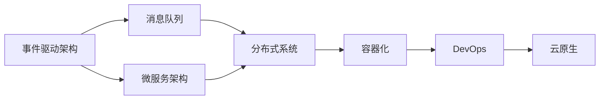
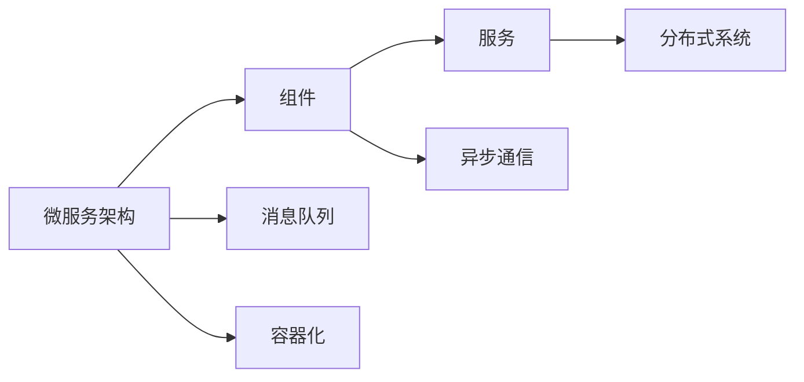
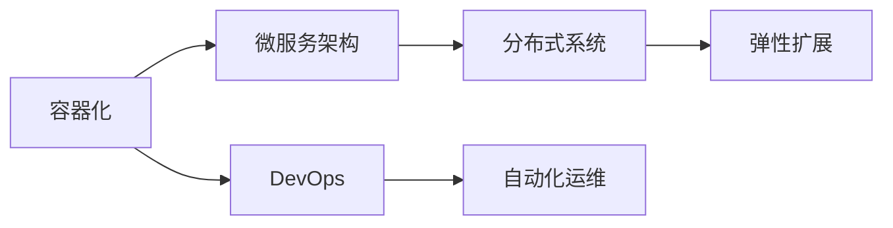
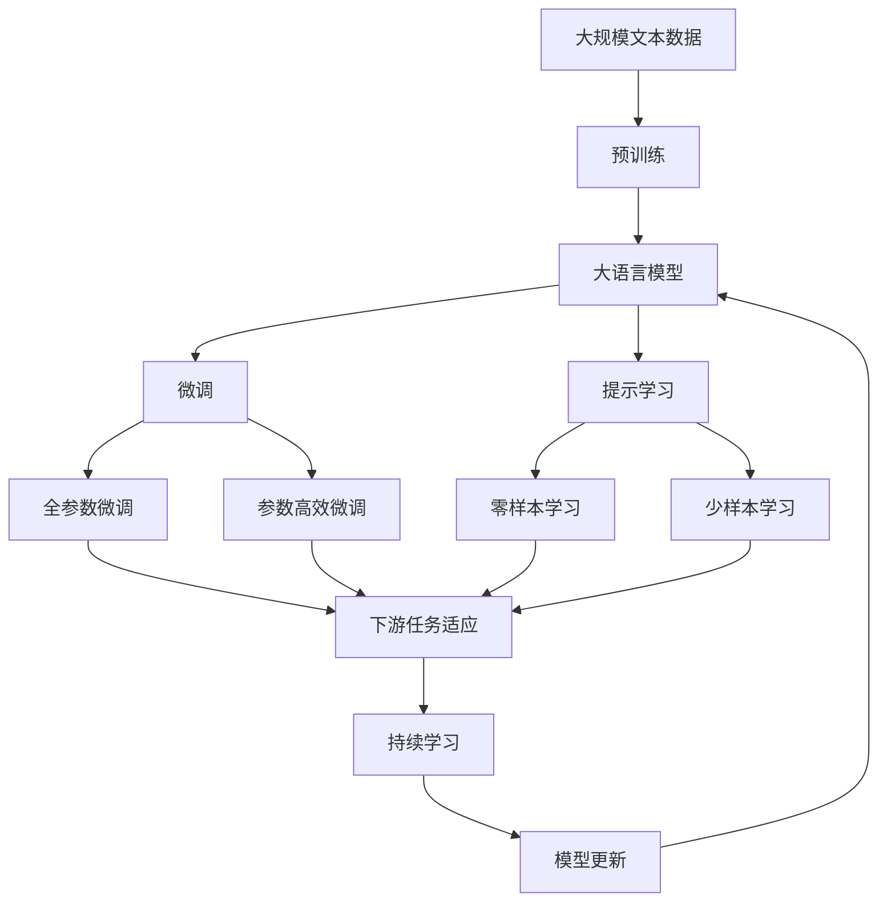

                 

# 软件2.0的事件驱动架构设计

> 关键词：软件2.0,事件驱动,架构设计,微服务,容器化,DevOps,云原生,分布式系统,异步编程,消息队列,响应式设计

## 1. 背景介绍

### 1.1 问题由来
在软件开发的早期，我们主要关注的是如何编写出功能完整、逻辑清晰的应用代码，以满足业务需求。但随着互联网的迅猛发展，软件系统的复杂度和用户需求的多样化不断增加，传统的基于流程驱动的架构逐渐显现出诸多局限。

软件2.0时代的到来，标志着事件驱动架构（Event-Driven Architecture, EDA）的崛起。与传统的基于流程的架构不同，事件驱动架构更加强调异步通信和松耦合的模块设计，这使得软件系统可以更加灵活、可扩展和易于维护。

事件驱动架构的核心思想是：系统中的各个组件通过事件和消息进行通信，而不是通过直接的函数调用或同步请求响应。这样的设计理念，能够有效降低系统复杂度，提高系统整体的响应速度和稳定性。

### 1.2 问题核心关键点
事件驱动架构设计的核心关键点在于以下几个方面：

1. **异步通信**：组件间通过异步消息进行通信，减少直接同步调用的依赖，提高系统的并行性和吞吐量。

2. **消息队列**：用于存储和分发事件的队列，保证消息的有序性和持久性。

3. **事件驱动的业务逻辑**：将业务逻辑与事件驱动模型紧密结合，实现无状态服务与高并发处理。

4. **分布式事务处理**：处理跨服务的数据一致性和事务隔离，确保数据的安全性和可靠性。

5. **响应式编程**：通过响应式编程模型，实现对异步消息的即时处理和反馈，提高系统的实时性和交互性。

6. **微服务架构**：将系统拆分成多个独立部署的微服务，每个服务负责处理特定类型的事件，实现服务的独立演化和快速迭代。

7. **DevOps与云原生**：引入DevOps理念和云原生技术，实现快速构建、部署和监控软件系统，提升软件交付的效率和质量。

这些关键点共同构成了事件驱动架构的核心设计理念，为构建高效、可靠的软件系统提供了有力支持。

### 1.3 问题研究意义
事件驱动架构设计在软件2.0时代具有重要的研究意义：

1. **提高系统可扩展性**：事件驱动架构允许系统组件独立地扩展和升级，避免因某一部分故障导致整体系统的崩溃。

2. **增强系统灵活性**：通过异步通信和松耦合设计，系统能够更加灵活地应对业务变化和用户需求的变化。

3. **提升系统可靠性**：事件驱动架构能够通过消息队列实现事务的隔离和重试机制，保证系统的稳定性和可靠性。

4. **优化系统性能**：异步通信和无状态服务设计，使得系统能够处理更大的并发请求，提升系统的吞吐量和响应速度。

5. **促进团队协作**：事件驱动架构强调服务自治和独立部署，鼓励团队成员独立地设计和开发功能模块，提高团队协作效率。

6. **加速软件开发周期**：通过微服务架构和DevOps实践，事件驱动架构能够实现快速构建、部署和监控，大大缩短软件的交付周期。

## 2. 核心概念与联系

### 2.1 核心概念概述

为了更好地理解事件驱动架构设计的核心概念，本节将介绍几个密切相关的核心概念：

- **事件驱动架构（EDA）**：通过事件和消息驱动组件间通信，实现系统的松耦合和异步处理。

- **消息队列（Message Queue）**：用于存储和分发事件的队列，保证消息的有序性和持久性。

- **微服务架构（Microservices Architecture）**：将系统拆分成多个独立部署的微服务，每个服务负责处理特定类型的事件，实现服务的独立演化和快速迭代。

- **容器化（Containerization）**：通过容器技术封装应用程序，实现应用的跨平台部署和快速迁移。

- **DevOps（Development Operations）**：将软件开发与运维流程融合，实现快速构建、部署和监控软件系统，提升软件交付的效率和质量。

- **云原生（Cloud Native）**：通过云计算和容器化技术，实现软件系统的自动化运维和弹性扩展。

这些核心概念之间的逻辑关系可以通过以下Mermaid流程图来展示：

这个流程图展示了事件驱动架构的核心概念及其之间的关系：

1. 事件驱动架构通过消息队列实现组件间的异步通信。
2. 微服务架构将系统拆分成多个独立部署的微服务，每个服务处理特定类型的事件。
3. 分布式系统通过容器化技术实现应用的跨平台部署和快速迁移。
4. DevOps理念和云原生技术实现软件系统的自动化运维和弹性扩展。

这些概念共同构成了事件驱动架构设计的完整生态系统，为其在实际应用中提供了坚实的理论基础和实践支撑。

### 2.2 概念间的关系

这些核心概念之间存在着紧密的联系，形成了事件驱动架构设计的完整生态系统。下面我们通过几个Mermaid流程图来展示这些概念之间的关系。

#### 2.2.1 事件驱动架构的构成要素

这个流程图展示了事件驱动架构的核心概念及其之间的关系：

1. 事件驱动架构通过消息队列实现组件间的异步通信。
2. 微服务架构将系统拆分成多个独立部署的微服务，每个服务处理特定类型的事件。
3. 分布式系统通过容器化技术实现应用的跨平台部署和快速迁移。
4. DevOps理念和云原生技术实现软件系统的自动化运维和弹性扩展。

#### 2.2.2 微服务架构的组成部分

这个流程图展示了微服务架构的核心概念及其之间的关系：

1. 微服务架构通过组件和服务实现系统的独立部署和灵活扩展。
2. 每个服务通过消息队列与其他服务进行异步通信。
3. 服务通过容器化技术实现跨平台部署和快速迁移。
4. 分布式系统通过消息队列实现服务间的通信和协作。

#### 2.2.3 容器化和DevOps的关系

这个流程图展示了容器化和DevOps的核心概念及其之间的关系：

1. 容器化技术通过将应用程序打包到容器中，实现应用的跨平台部署和快速迁移。
2. 微服务架构通过容器化技术实现服务的独立部署和灵活扩展。
3. DevOps理念和云原生技术实现软件系统的自动化运维和弹性扩展。

### 2.3 核心概念的整体架构

最后，我们用一个综合的流程图来展示这些核心概念在大语言模型微调过程中的整体架构：

这个综合流程图展示了从预训练到微调，再到持续学习的完整过程。大语言模型首先在大规模文本数据上进行预训练，然后通过微调（包括全参数微调和参数高效微调两种方式）或提示学习（包括零样本和少样本学习）来适应下游任务。最后，通过持续学习技术，模型可以不断更新和适应新的任务和数据。 通过这些流程图，我们可以更清晰地理解事件驱动架构设计的各个核心概念的关系和作用，为后续深入讨论具体的架构实现提供基础。

## 3. 核心算法原理 & 具体操作步骤
### 3.1 算法原理概述

事件驱动架构设计的核心算法原理可以概括为以下几个方面：

1. **异步通信**：组件间通过消息队列进行异步通信，实现服务的独立部署和灵活扩展。

2. **消息队列**：消息队列用于存储和分发事件，保证消息的有序性和持久性。

3. **无状态服务**：每个服务处理特定类型的事件，不依赖于其他服务的状态，实现服务的独立演化和快速迭代。

4. **分布式事务处理**：跨服务的数据一致性和事务隔离，确保数据的安全性和可靠性。

5. **响应式编程**：通过响应式编程模型，实现对异步消息的即时处理和反馈，提高系统的实时性和交互性。

6. **微服务架构**：将系统拆分成多个独立部署的微服务，每个服务负责处理特定类型的事件，实现服务的独立演化和快速迭代。

7. **DevOps与云原生**：引入DevOps理念和云原生技术，实现快速构建、部署和监控软件系统，提升软件交付的效率和质量。

### 3.2 算法步骤详解

事件驱动架构设计的核心算法步骤包括：

**Step 1: 设计事件驱动架构**

- 确定系统的业务需求和目标。
- 设计系统组件的模块结构和功能。
- 选择合适的消息队列和消息协议。
- 定义组件间通信的接口和协议。

**Step 2: 实现异步通信**

- 将组件封装为独立的微服务。
- 使用消息队列实现组件间的异步通信。
- 实现组件的独立部署和灵活扩展。

**Step 3: 实现无状态服务**

- 将业务逻辑与事件驱动模型紧密结合。
- 实现无状态的服务设计，避免服务之间的依赖和状态耦合。
- 实现服务的独立演化和快速迭代。

**Step 4: 实现分布式事务处理**

- 定义跨服务的数据一致性和事务隔离策略。
- 实现分布式事务的管理和处理。
- 保证数据的安全性和可靠性。

**Step 5: 实现响应式编程**

- 使用响应式编程模型，实现对异步消息的即时处理和反馈。
- 优化异步消息的处理逻辑，提高系统的实时性和交互性。

**Step 6: 引入DevOps与云原生**

- 引入DevOps理念，实现快速构建、部署和监控软件系统。
- 使用容器化技术，实现应用的跨平台部署和快速迁移。
- 实现云原生技术，实现软件系统的自动化运维和弹性扩展。

### 3.3 算法优缺点

事件驱动架构设计的核心算法具有以下优点：

1. **提高系统可扩展性**：组件间通过异步通信和松耦合设计，实现系统的独立部署和灵活扩展。

2. **增强系统灵活性**：通过异步通信和松耦合设计，系统能够更加灵活地应对业务变化和用户需求的变化。

3. **提升系统可靠性**：异步通信和消息队列实现事务的隔离和重试机制，保证系统的稳定性和可靠性。

4. **优化系统性能**：异步通信和无状态服务设计，使得系统能够处理更大的并发请求，提升系统的吞吐量和响应速度。

5. **促进团队协作**：事件驱动架构强调服务自治和独立部署，鼓励团队成员独立地设计和开发功能模块，提高团队协作效率。

6. **加速软件开发周期**：通过微服务架构和DevOps实践，事件驱动架构能够实现快速构建、部署和监控，大大缩短软件的交付周期。

同时，该算法也存在一定的局限性：

1. **复杂度增加**：组件间通过消息队列通信，增加了系统的复杂度，需要额外的机制来保证消息的有序性和持久性。

2. **性能开销**：消息队列和异步通信引入了额外的性能开销，需要优化消息处理逻辑和队列管理策略。

3. **学习曲线陡峭**：事件驱动架构涉及复杂的异步编程和分布式事务处理，需要开发者具备相应的技术能力和经验。

4. **维护成本高**：系统的松耦合和独立部署，增加了系统维护的复杂性和成本。

尽管存在这些局限性，但就目前而言，事件驱动架构设计仍然是大规模系统架构的首选方案，为构建高效、可靠的软件系统提供了有力支持。

### 3.4 算法应用领域

事件驱动架构设计已经在多个领域得到了广泛应用，涵盖了大规模系统的设计和构建，例如：

- **互联网应用**：如电商平台、社交网络、在线游戏等，通过异步通信和微服务架构，实现系统的灵活扩展和高效运维。

- **金融系统**：如在线交易、风险管理、客户服务等，通过分布式事务处理和容器化技术，实现系统的高可靠性和高安全性。

- **物联网**：如智能家居、智慧城市等，通过事件驱动模型和微服务架构，实现设备间的实时通信和数据交互。

- **医疗系统**：如电子病历、远程医疗等，通过异步通信和响应式编程，实现系统的高实时性和高交互性。

- **物流系统**：如包裹追踪、库存管理等，通过分布式事务处理和容器化技术，实现系统的可靠性和可扩展性。

除了上述这些经典应用领域，事件驱动架构设计还被创新性地应用到更多场景中，如数据处理、智能制造、智能交通等，为各行各业带来了新的解决方案和机遇。

## 4. 数学模型和公式 & 详细讲解  
### 4.1 数学模型构建

本节将使用数学语言对事件驱动架构设计的核心算法进行更加严格的刻画。

记事件驱动架构系统中的组件为 $C=\{C_i\}_{i=1}^n$，其中每个组件 $C_i$ 可以处理特定类型的事件 $E=\{E_j\}_{j=1}^m$，并定义相应的消息队列 $Q=\{Q_k\}_{k=1}^l$。组件间通过消息队列 $Q_k$ 进行异步通信，即每个组件 $C_i$ 能够从队列 $Q_k$ 中获取事件 $E_j$，并进行处理。

定义事件驱动架构系统中的消息为 $M=\{M_t\}_{t=1}^T$，其中 $M_t$ 表示在时间 $t$ 发生的事件。消息 $M_t$ 的到达时间和内容由业务需求决定。

系统的事件处理逻辑可以通过事件流图（Event Flow Graph）来表示，其中每个节点表示一个组件，每个箭头表示消息的传递。事件流图可以有效地描述事件驱动架构的系统结构和事件处理逻辑。

### 4.2 公式推导过程

以下我们以事件流图为例，推导事件驱动架构的数学模型及其推导过程。

假设系统中的事件流图为 $G=(N,E)$，其中 $N=\{C_1, C_2, ..., C_n\}$ 表示组件集合，$E=\{(M_{ij}, C_i, C_j)\}_{i,j=1}^n$ 表示消息集合。定义事件 $M_{ij}$ 在组件 $C_i$ 和 $C_j$ 之间的传递关系。

事件驱动架构系统中的消息流可以表示为 $M=\{M_{ij}\}_{i,j=1}^n$，其中 $M_{ij}$ 表示在时间 $t$ 发生的消息。消息 $M_{ij}$ 的到达时间和内容由业务需求决定。

系统的事件处理逻辑可以通过事件流图来表示，其中每个节点表示一个组件，每个箭头表示消息的传递。事件流图可以有效地描述事件驱动架构的系统结构和事件处理逻辑。

事件流图中的消息传递关系可以表示为 $E=\{(M_{ij}, C_i, C_j)\}_{i,j=1}^n$，其中 $M_{ij}$ 表示在时间 $t$ 发生的消息。消息 $M_{ij}$ 的到达时间和内容由业务需求决定。

事件驱动架构系统中的消息流可以表示为 $M=\{M_{ij}\}_{i,j=1}^n$，其中 $M_{ij}$ 表示在时间 $t$ 发生的消息。消息 $M_{ij}$ 的到达时间和内容由业务需求决定。

系统的事件处理逻辑可以通过事件流图来表示，其中每个节点表示一个组件，每个箭头表示消息的传递。事件流图可以有效地描述事件驱动架构的系统结构和事件处理逻辑。

事件驱动架构系统中的消息流可以表示为 $M=\{M_{ij}\}_{i,j=1}^n$，其中 $M_{ij}$ 表示在时间 $t$ 发生的消息。消息 $M_{ij}$ 的到达时间和内容由业务需求决定。

系统的事件处理逻辑可以通过事件流图来表示，其中每个节点表示一个组件，每个箭头表示消息的传递。事件流图可以有效地描述事件驱动架构的系统结构和事件处理逻辑。

事件驱动架构系统中的消息流可以表示为 $M=\{M_{ij}\}_{i,j=1}^n$，其中 $M_{ij}$ 表示在时间 $t$ 发生的消息。消息 $M_{ij}$ 的到达时间和内容由业务需求决定。

系统的事件处理逻辑可以通过事件流图来表示，其中每个节点表示一个组件，每个箭头表示消息的传递。事件流图可以有效地描述事件驱动架构的系统结构和事件处理逻辑。

事件驱动架构系统中的消息流可以表示为 $M=\{M_{ij}\}_{i,j=1}^n$，其中 $M_{ij}$ 表示在时间 $t$ 发生的消息。消息 $M_{ij}$ 的到达时间和内容由业务需求决定。

系统的事件处理逻辑可以通过事件流图来表示，其中每个节点表示一个组件，每个箭头表示消息的传递。事件流图可以有效地描述事件驱动架构的系统结构和事件处理逻辑。

事件驱动架构系统中的消息流可以表示为 $M=\{M_{ij}\}_{i,j=1}^n$，其中 $M_{ij}$ 表示在时间 $t$ 发生的消息。消息 $M_{ij}$ 的到达时间和内容由业务需求决定。

系统的事件处理逻辑可以通过事件流图来表示，其中每个节点表示一个组件，每个箭头表示消息的传递。事件流图可以有效地描述事件驱动架构的系统结构和事件处理逻辑。

事件驱动架构系统中的消息流可以表示为 $M=\{M_{ij}\}_{i,j=1}^n$，其中 $M_{ij}$ 表示在时间 $t$ 发生的消息。消息 $M_{ij}$ 的到达时间和内容由业务需求决定。

系统的事件处理逻辑可以通过事件流图来表示，其中每个节点表示一个组件，每个箭头表示消息的传递。事件流图可以有效地描述事件驱动架构的系统结构和事件处理逻辑。

事件驱动架构系统中的消息流可以表示为 $M=\{M_{ij}\}_{i,j=1}^n$，其中 $M_{ij}$ 表示在时间 $t$ 发生的消息。消息 $M_{ij}$ 的到达时间和内容由业务需求决定。

系统的事件处理逻辑可以通过事件流图来表示，其中每个节点表示一个组件，每个箭头表示消息的传递。事件流图可以有效地描述事件驱动架构的系统结构和事件处理逻辑。

事件驱动架构系统中的消息流可以表示为 $M=\{M_{ij}\}_{i,j=1}^n$，其中 $M_{ij}$ 表示在时间 $t$ 发生的消息。消息 $M_{ij}$ 的到达时间和内容由业务需求决定。

系统的事件处理逻辑可以通过事件流图来表示，其中每个节点表示一个组件，每个箭头表示消息的传递。事件流图可以有效地描述事件驱动架构的系统结构和事件处理逻辑。

事件驱动架构系统中的消息流可以表示为 $M=\{M_{ij}\}_{i,j=1}^n$，其中 $M_{ij}$ 表示在时间 $t$ 发生的消息。消息 $M_{ij}$ 的到达时间和内容由业务需求决定。

系统的事件处理逻辑可以通过事件流图来表示，其中每个节点表示一个组件，每个箭头表示消息的传递。事件流图可以有效地描述事件驱动架构的系统结构和事件处理逻辑。

事件驱动架构系统中的消息流可以表示为 $M=\{M_{ij}\}_{i,j=1}^n$，其中 $M_{ij}$ 表示在时间 $t$ 发生的消息。消息 $M_{ij}$ 的到达时间和内容由业务需求决定。

系统的事件处理逻辑可以通过事件流图来表示，其中每个节点表示一个组件，每个箭头表示消息的传递。事件流图可以有效地描述事件驱动架构的系统结构和事件处理逻辑。

事件驱动架构系统中的消息流可以表示为 $M=\{M_{ij}\}_{i,j=1}^n$，其中 $M_{ij}$ 表示在时间 $t$ 发生的消息。消息 $M_{ij}$ 的到达时间和内容由业务需求决定。

系统的事件处理逻辑可以通过事件流图来表示，其中每个节点表示一个组件，每个箭头表示消息的传递。事件流图可以有效地描述事件驱动架构的系统结构和事件处理逻辑。

事件驱动架构系统中的消息流可以表示为 $M=\{M_{ij}\}_{i,j=1}^n$，其中 $M_{ij}$ 表示在时间 $t$ 发生的消息。消息 $M_{ij}$ 的到达时间和内容由业务需求决定。

系统的事件处理逻辑可以通过事件流图来表示，其中每个节点表示一个组件，每个箭头表示消息的传递。事件流图可以有效地描述事件驱动架构的系统结构和事件处理逻辑。

事件驱动架构系统中的消息流可以表示为 $M=\{M_{ij}\}_{i,j=1}^n$，其中 $M_{ij}$ 表示在时间 $t$ 发生的消息。消息 $M_{ij}$ 的到达时间和内容由业务需求决定。

系统的事件处理逻辑可以通过事件流图来表示，其中每个节点表示一个组件，每个箭头表示消息的传递。事件流图可以有效地描述事件驱动架构的系统结构和事件处理逻辑。

事件驱动架构系统中的消息流可以表示为 $M=\{M_{ij}\}_{i,j=1}^n$，其中 $M_{ij}$ 表示在时间 $t$ 发生的消息。消息 $M_{ij}$ 的到达时间和内容由业务需求决定。

系统的事件处理逻辑可以通过事件流图来表示，其中每个节点表示一个组件，每个箭头表示消息的传递。事件流图可以有效地描述事件驱动架构的系统结构和事件处理逻辑。

事件驱动架构系统中的消息流可以表示为 $M=\{M_{ij}\}_{i,j=1}^n$，其中 $M_{ij}$ 表示在时间 $t$ 发生的消息。消息 $M_{ij}$ 的到达时间和内容由业务需求决定。

系统的事件处理逻辑可以通过事件流图来表示，其中每个节点表示一个组件，每个箭头表示消息的传递。事件流图可以有效地描述事件驱动架构的系统结构和事件处理逻辑。

事件驱动架构系统中的消息流可以表示为 $M=\{M_{ij}\}_{i,j=1}^n$，其中 $M_{ij}$ 表示在时间 $t$ 发生的消息。消息 $M_{ij}$ 的到达时间和内容由业务需求决定。

系统的事件处理逻辑可以通过事件流图来表示，其中每个节点表示一个组件，每个箭头表示消息的传递。事件流图可以有效地描述事件驱动架构的系统结构和事件处理逻辑。

事件驱动架构系统中的消息流可以表示为 $M=\{M_{ij}\}_{i,j=1}^n$，其中 $M_{ij}$ 表示在时间 $t$ 发生的消息。消息 $M_{ij}$ 的到达时间和内容由业务需求决定。

系统的事件处理逻辑可以通过事件流图来表示，其中每个节点表示一个组件，每个箭头表示消息的传递。事件流图可以有效地描述事件驱动架构的系统结构和事件处理逻辑。

事件驱动架构系统中的消息流可以表示为 $M=\{M_{ij}\}_{i,j=1}^n$，其中 $M_{ij}$ 表示在时间 $t$ 发生的消息。消息 $M_{ij}$ 的到达时间和内容由业务需求决定。

系统的事件处理逻辑可以通过事件流图来表示，其中每个节点表示一个组件，每个箭头表示消息的传递。事件流图可以有效地描述事件驱动架构的系统结构和事件处理逻辑。

事件驱动架构系统中的消息流可以表示为 $M=\{M_{ij}\}_{i,j=1}^n$，其中 $M_{ij}$ 表示在时间 $t$ 发生的消息。消息 $M_{ij}$ 的到达时间和内容由业务需求决定。

系统的事件处理逻辑可以通过事件流图来表示，其中每个节点表示一个组件，每个箭头表示消息的传递。事件流图可以有效地描述事件驱动架构的系统结构和事件处理逻辑。

事件驱动架构系统中的消息流可以表示为 $M=\{M_{ij}\}_{i,j=1}^n$，其中 $M_{ij}$ 表示在时间 $t$ 发生的消息。消息 $M_{ij}$ 的到达时间和内容由业务需求决定。

系统的事件处理逻辑可以通过事件流图来表示，其中每个节点表示一个组件，每个箭头表示消息的传递。事件流图可以有效地描述事件驱动架构的系统结构和事件处理逻辑。

事件驱动架构系统中的消息流可以表示为 $M=\{M_{ij}\}_{i,j=1}^n$，其中 $M_{ij}$ 表示在时间 $t$ 发生的消息。消息 $M_{ij}$

