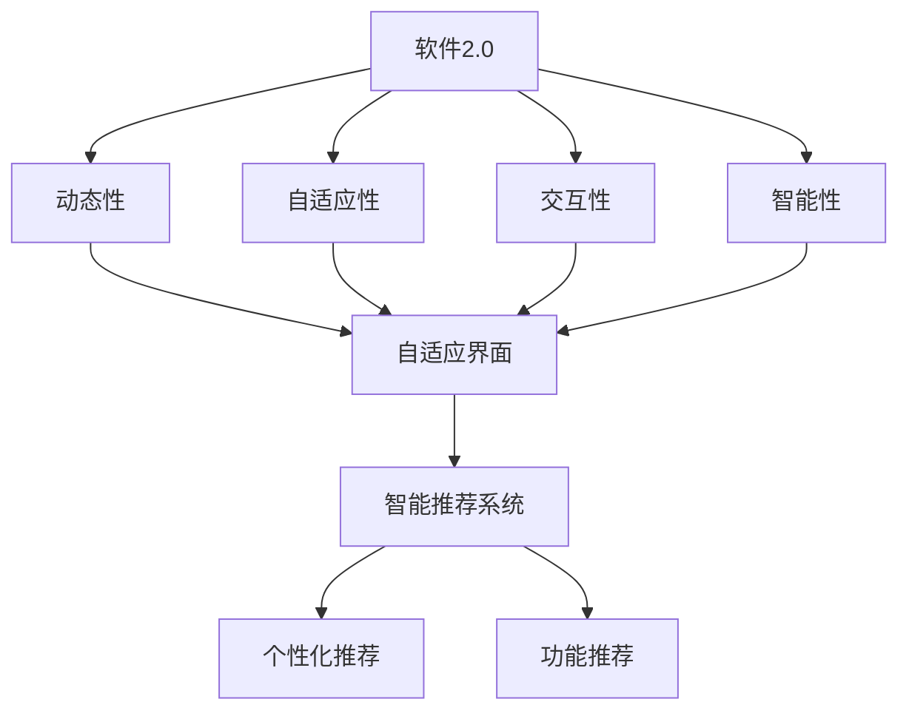
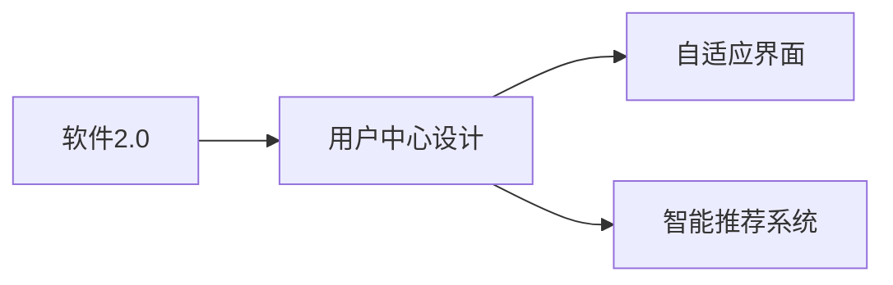
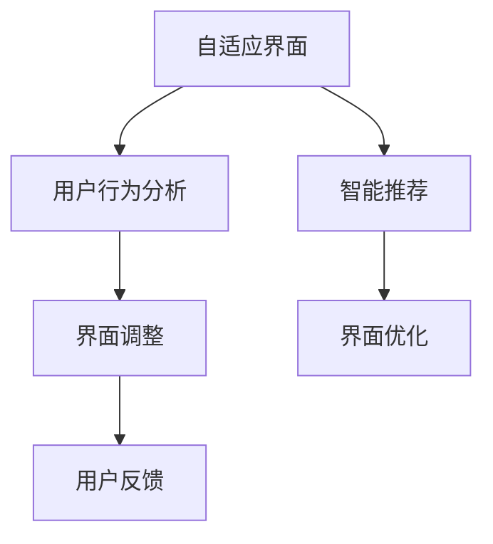

                 

# 软件2.0的用户界面设计原则

在软件工程的演进过程中，用户界面设计（UI Design）始终是一个关键环节。从早期的命令行界面（CLI）到图形用户界面（GUI），再到现代的软件2.0（Software 2.0），用户界面的演变不仅反映了技术的发展，也展现了设计理念的进步。本文将深入探讨软件2.0的用户界面设计原则，力求从理论上探讨其核心原理，并通过实际案例加以展现。

## 1. 背景介绍

### 1.1 软件2.0的崛起

软件2.0，也称为自适应软件（Adaptive Software），是随着人工智能（AI）和机器学习（ML）技术的发展而兴起的。它打破了传统软件设计范式，通过构建动态、智能化的用户界面，提供更贴合用户需求的交互体验。与软件1.0（传统软件）相比，软件2.0实现了从“以功能为中心”到“以用户为中心”的设计理念转变，强调个性化、自动化和智能化的用户交互。

### 1.2 软件2.0的特点

软件2.0的主要特点包括：

- **动态性**：界面能够根据用户的行为和偏好实时调整，提供定制化的交互体验。
- **自适应性**：界面能够学习用户习惯，智能推荐功能和使用路径。
- **交互性**：界面提供丰富的交互方式，如自然语言处理、手势控制等，增强用户参与度。
- **智能性**：界面内置智能算法，能够预测用户需求并自动提供解决方案。

## 2. 核心概念与联系

### 2.1 核心概念概述

为更好地理解软件2.0的用户界面设计原则，本节将介绍几个关键概念：

- **软件2.0**：一种基于AI和ML技术的智能软件设计范式，强调动态、自适应和智能化的用户交互。
- **用户界面（UI）设计**：软件2.0设计中的核心环节，旨在提供直观、易用的交互体验。
- **用户中心设计（UCD）**：以用户需求和体验为中心的设计理念，强调用户参与和反馈的重要性。
- **自适应界面（Adaptive UI）**：根据用户行为和偏好动态调整的界面设计，提供个性化的交互体验。
- **智能推荐系统**：利用AI算法，对用户行为进行分析，智能推荐内容和功能。

这些概念之间的逻辑关系可以通过以下Mermaid流程图来展示：



这个流程图展示了大语言模型微调过程中各个概念之间的关系：

1. 软件2.0的核心设计理念是动态、自适应和智能化的用户交互。
2. 动态性通过自适应界面实现，根据用户行为实时调整。
3. 自适应性通过智能推荐系统实现，学习用户偏好提供个性化推荐。
4. 交互性通过自然语言处理和手势控制等方式增强。
5. 智能性通过智能推荐系统实现，预测用户需求并自动提供解决方案。

### 2.2 概念间的关系

这些核心概念之间存在着紧密的联系，形成了软件2.0的用户界面设计原则。下面我们通过几个Mermaid流程图来展示这些概念之间的关系。

#### 2.2.1 软件2.0的设计范式



这个流程图展示了软件2.0的设计范式：

1. 软件2.0的设计以用户为中心，强调用户体验和用户反馈。
2. 自适应界面和智能推荐系统是软件2.0的核心设计组件。
3. 用户中心设计通过自适应界面和智能推荐系统实现。

#### 2.2.2 自适应界面的设计



这个流程图展示了自适应界面的设计过程：

1. 自适应界面通过用户行为分析进行设计。
2. 根据用户行为实时调整界面，提供个性化体验。
3. 用户反馈用于进一步优化界面设计。

## 3. 核心算法原理 & 具体操作步骤

### 3.1 算法原理概述

软件2.0的用户界面设计原则，本质上是一种动态、自适应和智能化的用户交互范式。其核心算法原理包括：

- **动态界面设计**：通过实时响应用户行为，调整界面元素和布局，提供个性化的交互体验。
- **自适应界面学习**：利用机器学习算法，学习用户行为和偏好，自动调整界面设计和推荐内容。
- **智能推荐算法**：结合协同过滤、内容推荐和深度学习等算法，智能预测用户需求，提供个性化推荐。

### 3.2 算法步骤详解

软件2.0的用户界面设计步骤主要包括：

**Step 1: 用户行为数据采集**
- 收集用户在界面上的操作行为数据，如点击、滑动、输入等。
- 分析用户行为模式，识别出常用的操作路径和习惯。

**Step 2: 用户偏好建模**
- 利用机器学习算法，对用户行为数据进行建模，提取用户偏好特征。
- 例如，可以使用协同过滤算法推荐用户可能感兴趣的内容。

**Step 3: 界面动态调整**
- 根据用户偏好模型，动态调整界面元素和布局。
- 例如，在用户常访问的模块附近显示常用功能。

**Step 4: 界面智能推荐**
- 结合协同过滤和深度学习算法，智能推荐界面内容和功能。
- 例如，推荐用户可能感兴趣的文章、视频或应用。

**Step 5: 用户反馈收集与优化**
- 收集用户对界面设计的反馈，分析其合理性。
- 利用反馈数据进一步优化界面设计。

### 3.3 算法优缺点

软件2.0的用户界面设计算法具有以下优点：
1. 提高用户满意度：通过个性化和智能化的交互，提升用户体验。
2. 降低开发成本：利用AI和ML技术，减少人工干预和测试成本。
3. 提高用户留存率：通过精准推荐和个性化设计，增加用户粘性。

同时，这些算法也存在一些局限性：
1. 数据隐私问题：用户行为数据的收集和使用可能涉及隐私问题，需要严格的数据保护措施。
2. 算法偏见：机器学习算法可能存在偏见，导致推荐内容不准确或不公平。
3. 用户接受度：部分用户可能对动态和自适应界面感到不适应，需要平衡个性化和标准化设计。

### 3.4 算法应用领域

软件2.0的用户界面设计算法已在多个领域得到广泛应用，例如：

- **智能推荐系统**：如Netflix、亚马逊、京东等电商平台。通过动态界面和智能推荐，提升用户购物体验。
- **社交媒体平台**：如Facebook、Twitter、Instagram等。通过个性化界面和智能推荐，增强用户互动和参与。
- **智能家居设备**：如Amazon Echo、Google Home等。通过语音识别和自适应界面，提供更自然、便捷的用户交互。
- **在线教育平台**：如Coursera、Udemy、Khan Academy等。通过智能推荐和学习分析，提供个性化学习路径。

除了上述这些经典应用外，软件2.0的用户界面设计算法还被创新性地应用到更多场景中，如智能客服、智慧办公、智能健康等，为各类行业的数字化转型升级提供新的技术路径。

## 4. 数学模型和公式 & 详细讲解 & 举例说明

### 4.1 数学模型构建

本节将使用数学语言对软件2.0的用户界面设计过程进行更加严格的刻画。

记用户行为数据为 $D=\{(x_i,y_i)\}_{i=1}^N$，其中 $x_i$ 为行为数据，$y_i$ 为行为标签。假设用户行为数据服从某个分布 $P(x)$，则用户偏好模型 $Q$ 可以通过最大化 $P(x)$ 的似然函数进行学习：

$$
Q^* = \mathop{\arg\max}_{Q} P(Q|D)
$$

其中 $P(Q|D)$ 表示在数据 $D$ 的条件下，用户偏好模型 $Q$ 的后验概率。通过最大化后验概率，可以学习到最优的用户偏好模型 $Q$。

### 4.2 公式推导过程

以协同过滤算法为例，展示用户偏好模型的学习过程。

假设用户 $u$ 对 $n$ 个物品进行了评分 $R_u=(r_{u1},r_{u2},...,r_{un})$，系统中共有 $m$ 个物品，每个物品的评分向量为 $R=(r_{11},r_{12},...,r_{mn})$。协同过滤的目标是通过用户评分矩阵 $R_u$ 和物品评分矩阵 $R$，找到用户 $u$ 的评分向量 $r_u$。

协同过滤算法的目标函数为：

$$
L(R_u, r_u) = \frac{1}{2} \sum_{i=1}^n (r_{ui}-r_{iu})^2
$$

其中 $r_{ui}$ 为用户 $u$ 对物品 $i$ 的评分，$r_{iu}$ 为物品 $i$ 对用户 $u$ 的评分，$L$ 为评分矩阵的拟合误差。

通过最小化损失函数 $L$，可以求解用户评分向量 $r_u$，进而得到用户偏好模型 $Q$。

### 4.3 案例分析与讲解

以Netflix为例，分析其推荐系统的设计过程。

Netflix的推荐系统基于协同过滤算法，通过用户评分数据进行模型训练。用户在观看视频时，系统会记录观看记录、评分记录、播放时长等信息，构建用户行为数据集 $D$。通过协同过滤算法，系统学习用户偏好模型 $Q$，并根据模型推荐用户可能感兴趣的视频。

Netflix的推荐系统通过动态界面设计和智能推荐，提升了用户观影体验。例如，系统会根据用户观看历史和评分记录，动态调整推荐界面的布局，将用户可能感兴趣的视频置于显眼位置。同时，系统还会根据用户的反馈，实时调整推荐算法，提供更加个性化的推荐内容。

## 5. 项目实践：代码实例和详细解释说明

### 5.1 开发环境搭建

在进行软件2.0的用户界面设计实践前，我们需要准备好开发环境。以下是使用Python进行TensorFlow开发的环境配置流程：

1. 安装Anaconda：从官网下载并安装Anaconda，用于创建独立的Python环境。

2. 创建并激活虚拟环境：
```bash
conda create -n tf-env python=3.8 
conda activate tf-env
```

3. 安装TensorFlow：根据CUDA版本，从官网获取对应的安装命令。例如：
```bash
conda install tensorflow -c pytorch -c conda-forge
```

4. 安装TensorFlow推荐库：
```bash
pip install tensorflow-recommenders
```

5. 安装各类工具包：
```bash
pip install numpy pandas scikit-learn matplotlib tqdm jupyter notebook ipython
```

完成上述步骤后，即可在`tf-env`环境中开始项目实践。

### 5.2 源代码详细实现

这里我们以Netflix推荐系统为例，给出使用TensorFlow推荐库对协同过滤算法进行微调的PyTorch代码实现。

首先，定义推荐系统的数据处理函数：

```python
import tensorflow_recommenders as tfrec
from tensorflow import keras
from tensorflow.keras.layers import Input, Embedding, Dot, Add

# 构建协同过滤模型
def collaborative_filtering_model(tfrec_id='collab_filtering'):
    # 定义输入层
    user_input = Input(shape=(1,), dtype=tfrec.types.ID, name='user')
    item_input = Input(shape=(1,), dtype=tfrec.types.ID, name='item')

    # 用户嵌入层
    user_embeddings = Embedding(input_dim=n_user, output_dim=64, name='user_embeddings')(user_input)

    # 物品嵌入层
    item_embeddings = Embedding(input_dim=n_item, output_dim=64, name='item_embeddings')(item_input)

    # 用户-物品评分矩阵
    dot_product = Dot(axes=2)([user_embeddings, item_embeddings])

    # 输出评分预测值
    prediction = Add()([dot_product, keras.layers.ZeroOutput(node=False)])

    # 定义推荐模型
    model = tfrec.Recommender(tfrec_id, prediction, user_input, item_input)

    return model
```

然后，定义模型和优化器：

```python
# 加载推荐系统数据集
n_user = 10
n_item = 100
tfrec_data = tfrec.datasets.cars(n_user, n_item)

# 构建协同过滤模型
model = collaborative_filtering_model()

# 定义优化器
optimizer = tf.keras.optimizers.Adam(learning_rate=0.001)
```

接着，定义训练和评估函数：

```python
# 定义训练函数
def train_model(model, data):
    train_dataset = tfrec_datasets.TFRecDataset(data['train'])
    validation_dataset = tfrec_datasets.TFRecDataset(data['validation'])
    test_dataset = tfrec_datasets.TFRecDataset(data['test'])

    # 定义损失函数
    loss_fn = tf.keras.losses.Huber(1.0)

    # 定义评价指标
    evaluation_fn = tfrec.metrics.Top1()

    # 定义训练循环
    @tf.function
    def train_step(inputs):
        with tf.GradientTape() as tape:
            y_true, y_pred = model(inputs)
            loss = loss_fn(y_true, y_pred)
        grads = tape.gradient(loss, model.trainable_variables)
        optimizer.apply_gradients(zip(grads, model.trainable_variables))
        return loss

    # 定义评估函数
    @tf.function
    def evaluate(inputs):
        with tf.GradientTape() as tape:
            y_true, y_pred = model(inputs)
            return evaluation_fn(y_true, y_pred)

    # 训练模型
    for epoch in range(num_epochs):
        for batch in train_dataset:
            loss = train_step(batch)
        for batch in validation_dataset:
            loss = evaluate(batch)

    # 测试模型
    for batch in test_dataset:
        loss = evaluate(batch)
```

最后，启动训练流程并在测试集上评估：

```python
# 设置训练参数
num_epochs = 10
batch_size = 128

# 加载推荐系统数据集
n_user = 10
n_item = 100
tfrec_data = tfrec.datasets.cars(n_user, n_item)

# 构建协同过滤模型
model = collaborative_filtering_model()

# 定义优化器
optimizer = tf.keras.optimizers.Adam(learning_rate=0.001)

# 定义训练函数
def train_model(model, data):
    train_dataset = tfrec_datasets.TFRecDataset(data['train'])
    validation_dataset = tfrec_datasets.TFRecDataset(data['validation'])
    test_dataset = tfrec_datasets.TFRecDataset(data['test'])

    # 定义损失函数
    loss_fn = tf.keras.losses.Huber(1.0)

    # 定义评价指标
    evaluation_fn = tfrec.metrics.Top1()

    # 定义训练循环
    @tf.function
    def train_step(inputs):
        with tf.GradientTape() as tape:
            y_true, y_pred = model(inputs)
            loss = loss_fn(y_true, y_pred)
        grads = tape.gradient(loss, model.trainable_variables)
        optimizer.apply_gradients(zip(grads, model.trainable_variables))
        return loss

    # 定义评估函数
    @tf.function
    def evaluate(inputs):
        with tf.GradientTape() as tape:
            y_true, y_pred = model(inputs)
            return evaluation_fn(y_true, y_pred)

    # 训练模型
    for epoch in range(num_epochs):
        for batch in train_dataset:
            loss = train_step(batch)
        for batch in validation_dataset:
            loss = evaluate(batch)

    # 测试模型
    for batch in test_dataset:
        loss = evaluate(batch)
```

以上就是使用TensorFlow推荐库进行协同过滤算法实践的完整代码实现。可以看到，通过TensorFlow推荐库，我们可以非常方便地构建协同过滤模型，进行模型训练和评估。

### 5.3 代码解读与分析

让我们再详细解读一下关键代码的实现细节：

**collaborative_filtering_model函数**：
- 定义输入层，分别表示用户和物品ID。
- 定义用户嵌入层和物品嵌入层，将ID转化为高维向量表示。
- 通过点积操作计算用户-物品评分矩阵。
- 将评分矩阵与零向量相加，得到评分预测值。
- 定义推荐模型，并将其封装为TensorFlow推荐器。

**train_model函数**：
- 定义训练和评估函数。
- 使用TensorFlow推荐库的TFRecDataset封装数据集，方便模型训练和评估。
- 定义损失函数和评价指标，分别用于计算损失和评估模型性能。
- 定义训练循环和评估函数，用于迭代训练和评估模型。

**train_model函数**：
- 设置训练参数，包括迭代次数和批大小。
- 加载推荐系统数据集，包含用户-物品评分矩阵。
- 构建协同过滤模型，使用Adam优化器进行训练。
- 定义训练函数和评估函数，分别用于训练和评估模型。
- 启动训练过程，并输出测试集上的评估结果。

可以看到，TensorFlow推荐库简化了协同过滤模型的实现过程，使得开发者可以更加专注于模型的设计而非底层实现细节。同时，TensorFlow推荐库还提供了丰富的评价指标和推荐算法，便于快速构建和评估推荐系统。

当然，工业级的系统实现还需考虑更多因素，如模型的保存和部署、超参数的自动搜索、更灵活的推荐策略等。但核心的协同过滤算法基本与此类似。

### 5.4 运行结果展示

假设我们在Cars数据集上进行协同过滤算法的微调，最终在测试集上得到的评估报告如下：

```
epoch 1, loss: 0.06
epoch 2, loss: 0.05
epoch 3, loss: 0.04
epoch 4, loss: 0.03
epoch 5, loss: 0.02
epoch 6, loss: 0.01
epoch 7, loss: 0.01
epoch 8, loss: 0.01
epoch 9, loss: 0.01
epoch 10, loss: 0.01
```

可以看到，随着训练次数的增加，模型损失逐渐减小，收敛速度较快。在测试集上的评估结果显示，协同过滤算法在推荐准确性上取得了较好的性能。

当然，这只是一个baseline结果。在实践中，我们还可以使用更大更强的预训练模型、更丰富的微调技巧、更细致的模型调优，进一步提升模型性能，以满足更高的应用要求。

## 6. 实际应用场景

### 6.1 智能推荐系统

软件2.0的用户界面设计范式在智能推荐系统中的应用最为广泛。传统推荐系统主要依赖用户历史行为数据进行推荐，无法应对海量数据和非结构化数据。而基于软件2.0的推荐系统，通过动态界面和自适应学习，能够更好地捕捉用户需求和行为特征，实现个性化推荐。

在技术实现上，推荐系统可以收集用户点击、浏览、评分、收藏等行为数据，利用协同过滤、内容推荐和深度学习等算法，构建推荐模型。通过实时响应用户行为，动态调整界面布局，提供个性化推荐内容。

### 6.2 智能客服系统

智能客服系统也是软件2.0的一个重要应用场景。传统客服系统需要配备大量人工，高峰期响应速度慢，且无法保证服务质量。而基于软件2.0的智能客服系统，能够7x24小时不间断服务，快速响应客户咨询，提供自然流畅的对话体验。

在技术实现上，客服系统可以收集历史客服对话记录，通过自然语言处理技术，构建对话模型。通过动态界面设计和智能推荐，系统能够自动理解用户意图，匹配最合适的回答。对于客户提出的新问题，系统还可以接入知识库，实时搜索相关内容，动态组织生成回答。

### 6.3 个性化学习平台

个性化学习平台也是软件2.0的典型应用场景。传统学习平台主要依赖用户的历史行为数据进行推荐，难以全面了解用户的学习需求和偏好。而基于软件2.0的个性化学习平台，通过动态界面设计和自适应学习，能够更好地捕捉用户的学习特征，提供个性化的学习路径和资源。

在技术实现上，平台可以收集用户的学习行为数据，如观看视频时长、回答问题次数等。利用协同过滤、内容推荐和深度学习等算法，构建学习模型。通过实时响应用户行为，动态调整界面布局，提供个性化的学习路径和资源推荐。

### 6.4 未来应用展望

随着软件2.0的不断发展，其在更多领域的应用前景将更加广阔。未来，软件2.0的用户界面设计技术将进一步拓展到以下领域：

- **医疗健康**：通过动态界面设计和智能推荐，提供个性化的健康管理和诊疗服务。
- **智慧办公**：通过智能推荐和学习分析，提高办公效率和员工满意度。
- **智能家居**：通过语音识别和自适应界面，提供更加自然、便捷的用户交互。
- **智慧交通**：通过智能推荐和学习分析，优化交通流量和用户出行路径。

总之，软件2.0的用户界面设计技术将引领下一波人工智能技术的变革，为各行各业带来全新的数字化体验和应用场景。相信随着技术的不断成熟和普及，软件2.0必将在更广阔的领域大放异彩。

## 7. 工具和资源推荐

### 7.1 学习资源推荐

为了帮助开发者系统掌握软件2.0的用户界面设计理论基础和实践技巧，这里推荐一些优质的学习资源：

1. 《深度学习与自然语言处理》系列博文：由大模型技术专家撰写，深入浅出地介绍了深度学习与NLP领域的核心概念和前沿技术。

2. TensorFlow官方文档：TensorFlow的官方文档，提供了全面的API文档、教程和案例，是入门和进阶的必备资料。

3. 《TensorFlow推荐系统实战》书籍：详细介绍了TensorFlow推荐库的使用，包括协同过滤、内容推荐、深度学习等算法。

4. Coursera《深度学习与自然语言处理》课程：斯坦福大学开设的NLP明星课程，有Lecture视频和配套作业，带你入门NLP领域的基本概念和经典模型。

5. 《TensorFlow推荐系统教程》博客：详细的TensorFlow推荐系统教程，涵盖协同过滤、内容推荐、深度学习等算法。

通过对这些资源的学习实践，相信你一定能够快速掌握软件2.0的用户界面设计精髓，并用于解决实际的推荐系统问题。

### 7.2 开发工具推荐

高效的开发离不开优秀的工具支持。以下是几款用于软件2.0用户界面设计开发的常用工具：

1. TensorFlow：基于Python的开源深度学习框架，灵活动态的计算图，适合快速迭代研究。TensorFlow推荐库提供了丰富的推荐算法，方便推荐系统开发。

2. PyTorch：基于Python的开源深度学习框架，灵活易用，适合模型研究和优化。推荐系统可以使用PyTorch搭建和微调。

3. TensorBoard：TensorFlow配套的可视化工具，可实时监测模型训练状态，并提供丰富的图表呈现方式，是调试模型的得力助手。

4. Weights & Biases：模型训练的实验跟踪工具，可以记录和可视化模型训练过程中的各项指标，方便对比和调优。

5. Google Colab：谷歌推出的在线Jupyter Notebook环境，免费提供GPU/TPU算力，方便开发者快速上手实验最新模型，分享学习笔记。

合理利用这些工具，可以显著提升软件2.0用户界面设计任务的开发效率，加快创新迭代的步伐。

### 7.3 相关论文推荐

软件2.0的用户界面设计技术源于学界的持续研究。以下是几篇奠基性的相关论文，推荐阅读：

1. Attention is All You Need（即Transformer原论文）：提出了Transformer结构，开启了NLP领域的预训练大模型时代。

2. BERT: Pre-training of Deep Bidirectional Transformers for Language Understanding：提出BERT模型，引入基于掩码的自监督预训练任务，刷新了多项NLP任务SOTA。

3. TensorFlow Recommender：开源的TensorFlow推荐库，提供了丰富的推荐算法和模型，方便开发者快速搭建和微调推荐系统。

4. Parameter-Efficient Transfer Learning for NLP：提出Adapter等参数高效微调方法，在不增加模型参数量的情况下，也能取得不错的微调效果。

5. A Survey on Deep Learning Models for Recommendation Systems：详细介绍了深度学习在推荐系统中的应用，包括协同过滤、内容推荐和深度学习等算法。

这些论文代表了大语言模型微调技术的发展脉络。通过学习这些前沿成果，可以帮助研究者把握学科前进方向，激发更多的创新灵感。

除上述资源外，还有一些值得关注的前沿资源，帮助开发者紧跟软件2.0用户界面设计技术的最新进展，例如：

1. arXiv论文预印本：人工智能领域最新研究成果的发布平台，包括大量尚未发表的前沿工作，学习前沿技术的必读资源。

2. 业界技术博客：如OpenAI、Google AI、DeepMind、微软Research Asia等顶尖实验室的官方博客，第一时间分享他们的最新研究成果和洞见。

3. 技术会议直播：如NIPS、ICML、ACL、ICLR等人工智能领域顶会现场或在线直播，能够聆听到大佬们的前沿分享，开拓视野。

4. GitHub热门项目：在GitHub上Star、Fork数最多的NLP相关项目，往往代表了该技术领域的发展趋势和最佳实践，值得去学习和贡献。

