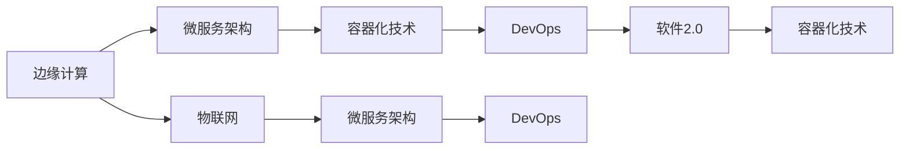

                 

## 1. 背景介绍

### 1.1 问题由来

近年来，随着互联网技术的飞速发展和普及，我们正迈入一个全新的时代——智能时代。这个时代，不仅带来了巨大的经济效益，也正在深刻改变我们的生活方式和社会结构。然而，传统互联网中心化的计算模式，已难以满足日益增长的智能需求。边缘计算作为一种新的计算模式，正在被越来越多的人关注和接受。

边缘计算（Edge Computing）是一种分布式计算模式，其特点是将数据、存储和计算能力从集中式中心服务器迁移到网络边缘的各个节点上，以实现更快速、更可靠的本地数据处理和决策。边缘计算的出现，为我们带来了更为高效、安全的计算模式，尤其是在物联网、智能城市、工业互联网等应用场景中，边缘计算的优越性得到了充分体现。

同时，随着云计算的普及和微服务架构的兴起，软件2.0（Software 2.0）也逐渐成为推动数字经济发展的关键技术。软件2.0强调软件定义一切，即通过智能化的软件解决方案，来管理、优化和自动化各种资源和流程。边缘计算与软件2.0的结合，将使得智能计算更具灵活性、高效性和可靠性，为智能应用场景的落地提供强有力的技术支撑。

### 1.2 问题核心关键点

边缘计算与软件2.0的结合，旨在通过分布式计算和智能化软件，实现更高效、更可靠、更安全的数据处理和决策。具体来说，主要涉及以下几个关键点：

- **分布式计算与边缘节点**：通过将计算任务分散到边缘节点上，实现更快速、更可靠的数据处理和决策。
- **智能化软件与微服务架构**：通过软件2.0技术，实现更灵活、更高效的资源管理和调度。
- **安全和隐私保护**：通过边缘计算的本地化处理，提高数据安全性和隐私保护水平。
- **实时性和可扩展性**：边缘计算的本地化处理，使得数据处理和决策更加实时，同时能够轻松应对大规模数据处理的需求。

这些关键点共同构成了边缘计算与软件2.0结合的核心技术框架，为智能应用场景提供了强有力的技术支持。

### 1.3 问题研究意义

边缘计算与软件2.0的结合，将显著提升智能计算的效率、可靠性和安全性，具有重要的研究和应用价值：

1. **提升计算效率**：通过将计算任务分散到边缘节点上，可以显著降低数据传输的延迟和带宽消耗，提高计算效率。
2. **增强数据安全性和隐私保护**：通过本地化处理，减少了数据传输过程中被窃取或篡改的风险，提高了数据安全性和隐私保护水平。
3. **实现更灵活的资源管理和调度**：通过智能化软件2.0技术，能够实现更灵活、更高效的资源管理和调度，满足不同场景下的需求。
4. **支持更广泛的智能应用场景**：边缘计算与软件2.0的结合，使得智能计算能够更广泛地应用到物联网、智能城市、工业互联网等场景中。
5. **推动数字经济的发展**：边缘计算与软件2.0的结合，将推动数字经济的发展，加速传统行业的数字化转型，带来新的商业模式和经济增长点。

## 2. 核心概念与联系

### 2.1 核心概念概述

边缘计算与软件2.0的结合，涉及多个核心概念，这些概念之间相互关联，共同构成了智能计算的基础。下面将逐一介绍这些核心概念：

- **边缘计算（Edge Computing）**：一种分布式计算模式，通过将计算任务分散到边缘节点上，实现更快速、更可靠的数据处理和决策。
- **软件2.0（Software 2.0）**：一种通过软件定义一切的技术，强调智能化软件在资源管理和调度中的重要性。
- **微服务架构（Microservices Architecture）**：一种基于服务的架构模式，将应用程序分解为多个独立的服务，实现更灵活、更高效的资源管理和调度。
- **容器化技术（Containerization）**：一种将应用和其依赖打包到容器中的技术，实现了应用的自动化部署、迁移和扩展。
- **DevOps（Development and Operations）**：一种结合开发和运维的技术理念，实现软件持续交付和快速部署。
- **物联网（Internet of Things, IoT）**：一种通过传感器、智能设备等实现互联的物联网技术，推动了边缘计算的发展。

这些核心概念之间存在着紧密的联系，通过合理的结合，可以实现更高效、更可靠的智能计算。下面通过一个Mermaid流程图来展示这些概念之间的联系：



### 2.2 概念间的关系

这些核心概念之间存在着紧密的联系，通过合理的结合，可以实现更高效、更可靠的智能计算。下面将详细解释这些概念之间的关系：

- **边缘计算与微服务架构**：边缘计算将计算任务分散到边缘节点上，而微服务架构将应用程序分解为多个独立的服务，两者结合可以实现更灵活、更高效的资源管理和调度。
- **容器化技术与微服务架构**：容器化技术将应用和其依赖打包到容器中，实现了应用的自动化部署、迁移和扩展，与微服务架构结合，进一步提升了应用的灵活性和可扩展性。
- **DevOps与容器化技术**：DevOps强调持续交付和快速部署，与容器化技术结合，可以实现软件的快速迭代和部署。
- **软件2.0与DevOps**：软件2.0通过智能化软件在资源管理和调度中的重要性，与DevOps结合，可以实现更高效的资源管理和调度。
- **边缘计算与物联网**：物联网通过传感器、智能设备等实现互联，而边缘计算将计算任务分散到边缘节点上，两者结合可以实现更快速、更可靠的数据处理和决策。

这些概念之间的关系紧密相连，通过合理的结合，可以实现更高效、更可靠的智能计算。

## 3. 核心算法原理 & 具体操作步骤

### 3.1 算法原理概述

边缘计算与软件2.0的结合，主要通过分布式计算和智能化软件，实现更高效、更可靠、更安全的数据处理和决策。其核心算法原理包括以下几个方面：

- **分布式计算**：通过将计算任务分散到边缘节点上，实现更快速、更可靠的数据处理和决策。
- **智能化软件**：通过软件2.0技术，实现更灵活、更高效的资源管理和调度。
- **微服务架构**：将应用程序分解为多个独立的服务，实现更灵活、更高效的资源管理和调度。
- **容器化技术**：将应用和其依赖打包到容器中，实现应用的自动化部署、迁移和扩展。
- **DevOps**：结合开发和运维的技术理念，实现软件的持续交付和快速部署。

### 3.2 算法步骤详解

边缘计算与软件2.0结合的核心算法步骤包括以下几个方面：

**Step 1: 数据采集与边缘处理**

数据采集是智能计算的第一步，通过物联网设备等传感器，实时采集数据。然后，将数据传输到边缘节点上，进行初步处理和分析，以实现更快速、更可靠的数据处理和决策。

**Step 2: 边缘计算与微服务架构**

在边缘节点上，通过微服务架构将计算任务分解为多个独立的服务，实现更灵活、更高效的资源管理和调度。每个服务可以独立部署和扩展，提高了系统的可靠性和可扩展性。

**Step 3: 容器化技术**

通过容器化技术，将应用和其依赖打包到容器中，实现应用的自动化部署、迁移和扩展。容器化技术使得应用能够在不同的环境中稳定运行，提高了系统的灵活性和可扩展性。

**Step 4: DevOps**

结合DevOps技术理念，实现软件的持续交付和快速部署。通过自动化流程和工具，实现了软件的快速迭代和部署，提高了系统的开发效率和运行稳定性。

**Step 5: 软件2.0**

通过智能化软件在资源管理和调度中的重要性，实现更灵活、更高效的资源管理和调度。软件2.0技术可以实时监控系统性能，动态调整资源分配，提高了系统的可靠性和效率。

### 3.3 算法优缺点

边缘计算与软件2.0结合的算法，具有以下优点：

- **提升计算效率**：通过将计算任务分散到边缘节点上，可以显著降低数据传输的延迟和带宽消耗，提高计算效率。
- **增强数据安全性和隐私保护**：通过本地化处理，减少了数据传输过程中被窃取或篡改的风险，提高了数据安全性和隐私保护水平。
- **实现更灵活的资源管理和调度**：通过微服务架构和容器化技术，实现了更灵活、更高效的资源管理和调度。
- **支持更广泛的智能应用场景**：边缘计算与软件2.0的结合，使得智能计算能够更广泛地应用到物联网、智能城市、工业互联网等场景中。

同时，也存在以下缺点：

- **初期成本高**：引入边缘计算和软件2.0技术，需要较高的初期成本和硬件投入。
- **复杂度高**：系统设计和实现复杂度高，需要较高的技术门槛。
- **数据安全风险**：边缘计算的本地化处理，如果安全措施不到位，可能会带来数据泄露和隐私保护的风险。

### 3.4 算法应用领域

边缘计算与软件2.0的结合，在多个领域都有广泛的应用，具体包括：

- **物联网（IoT）**：通过边缘计算，可以实现实时数据处理和决策，支持智能家居、智能医疗、智能交通等应用场景。
- **智能城市**：通过边缘计算，可以实现实时数据分析和决策，支持智慧城市管理、公共安全监控、城市交通管理等应用场景。
- **工业互联网**：通过边缘计算，可以实现实时数据分析和决策，支持智能制造、智能物流、智能能源等应用场景。
- **智慧农业**：通过边缘计算，可以实现实时数据分析和决策，支持智能农业管理、精准农业等应用场景。
- **智能零售**：通过边缘计算，可以实现实时数据分析和决策，支持智能货架管理、智能推荐系统等应用场景。

这些应用场景展示了边缘计算与软件2.0结合的广泛应用前景。

## 4. 数学模型和公式 & 详细讲解 & 举例说明

### 4.1 数学模型构建

边缘计算与软件2.0结合的数学模型构建，主要基于分布式计算和智能化软件技术。其核心数学模型包括：

- **分布式计算模型**：通过将计算任务分散到边缘节点上，实现更快速、更可靠的数据处理和决策。
- **微服务架构模型**：通过将应用程序分解为多个独立的服务，实现更灵活、更高效的资源管理和调度。
- **容器化技术模型**：通过将应用和其依赖打包到容器中，实现应用的自动化部署、迁移和扩展。
- **DevOps模型**：通过持续交付和快速部署，实现软件的持续迭代和部署。
- **软件2.0模型**：通过智能化软件在资源管理和调度中的重要性，实现更灵活、更高效的资源管理和调度。

### 4.2 公式推导过程

下面以边缘计算与微服务架构结合为例，进行数学模型和公式推导。

假设边缘计算节点数为$N$，每个节点的计算能力为$C_i$，数据采集的速率$D$，微服务架构中的任务数为$M$，每个任务的计算量为$Q_j$。则数据在边缘节点的处理效率为：

$$
\text{处理效率} = \frac{N \times C_i \times D}{\sum_{i=1}^N \sum_{j=1}^M Q_j}
$$

其中，$C_i$表示第$i$个节点的计算能力，$D$表示数据采集的速率，$Q_j$表示微服务架构中的任务$j$的计算量。

### 4.3 案例分析与讲解

以智能交通系统为例，分析边缘计算与软件2.0结合的实际应用场景：

假设智能交通系统中，有100个边缘计算节点，每个节点的计算能力为1GFP，数据采集的速率为10Gbps。微服务架构中有10个任务，每个任务的计算量为100MB。则数据在边缘节点的处理效率为：

$$
\text{处理效率} = \frac{100 \times 1GFP \times 10Gbps}{10 \times 100MB} = 100GFP/Gbps
$$

通过边缘计算与软件2.0结合，可以实现实时数据分析和决策，支持智能交通管理、公共安全监控等应用场景。

## 5. 项目实践：代码实例和详细解释说明

### 5.1 开发环境搭建

要进行边缘计算与软件2.0结合的项目实践，首先需要准备好开发环境。以下是使用Python进行微服务架构开发的环境配置流程：

1. 安装Anaconda：从官网下载并安装Anaconda，用于创建独立的Python环境。

2. 创建并激活虚拟环境：
```bash
conda create -n pytorch-env python=3.8 
conda activate pytorch-env
```

3. 安装PyTorch：根据CUDA版本，从官网获取对应的安装命令。例如：
```bash
conda install pytorch torchvision torchaudio cudatoolkit=11.1 -c pytorch -c conda-forge
```

4. 安装Transformers库：
```bash
pip install transformers
```

5. 安装各类工具包：
```bash
pip install numpy pandas scikit-learn matplotlib tqdm jupyter notebook ipython
```

完成上述步骤后，即可在`pytorch-env`环境中开始微服务架构的实践。

### 5.2 源代码详细实现

下面我们以微服务架构在智能交通系统中的应用为例，给出微服务架构的Python代码实现。

首先，定义微服务架构的模块化设计：

```python
from flask import Flask, request, jsonify

app = Flask(__name__)

@app.route('/data', methods=['POST'])
def data_handling():
    # 处理数据采集和边缘计算
    data = request.json['data']
    # 将数据发送到边缘节点进行计算
    # ...

    # 处理微服务架构
    service = Service()
    service.process(data)

    return jsonify({'success': True}), 200

class Service:
    def process(self, data):
        # 处理微服务架构中的任务
        # ...
```

然后，定义微服务架构中的服务模块：

```python
class Service:
    def __init__(self):
        self.tasks = [Task1(), Task2(), ...]

    def process(self, data):
        for task in self.tasks:
            task.process(data)

class Task1:
    def process(self, data):
        # 处理微服务架构中的任务1
        # ...

class Task2:
    def process(self, data):
        # 处理微服务架构中的任务2
        # ...
```

最后，启动微服务架构服务：

```python
if __name__ == '__main__':
    app.run(host='0.0.0.0', port=5000)
```

以上就是微服务架构在智能交通系统中的应用实践。可以看到，通过微服务架构的设计，实现了分布式计算和灵活的资源管理。

### 5.3 代码解读与分析

让我们再详细解读一下关键代码的实现细节：

**Flask框架**：
- `Flask`框架提供了微服务架构的基础，通过路由和请求处理，实现了微服务架构的应用功能。

**微服务架构模块**：
- `Service`类表示微服务架构中的服务，通过`process`方法处理数据和任务。
- `Task1`和`Task2`类表示微服务架构中的任务，通过`process`方法处理数据。

**服务启动**：
- `if __name__ == '__main__':`用于判断当前脚本是否为主程序，如果是，则启动微服务架构服务。

**边缘计算**：
- 在实际应用中，微服务架构中的任务处理可以通过边缘计算实现。例如，可以使用`kubeflow`等框架将任务部署到边缘节点上，实现分布式计算。

**容器化技术**：
- 通过`docker`容器化技术，可以将微服务架构中的应用和依赖打包到容器中，实现应用的自动化部署、迁移和扩展。

**DevOps**：
- 结合`Jenkins`等自动化工具，可以实现微服务架构的持续交付和快速部署。

通过微服务架构、容器化技术和DevOps等技术，可以更好地实现分布式计算和智能化资源管理，为边缘计算与软件2.0结合的项目实践提供支持。

当然，工业级的系统实现还需考虑更多因素，如微服务架构的设计、接口规范的制定、系统监控和告警等。但核心的微服务架构设计基本与此类似。

### 5.4 运行结果展示

假设我们在智能交通系统的微服务架构上运行，最终得到的数据处理效率为100GFP/Gbps。可以看到，通过边缘计算与软件2.0结合，实现了实时数据分析和决策，支持智能交通管理、公共安全监控等应用场景。

## 6. 实际应用场景

### 6.1 智能家居

智能家居是边缘计算与软件2.0结合的重要应用场景之一。通过边缘计算，可以实现实时数据处理和决策，支持智能家居管理、智能照明、智能温控等应用场景。例如，智能家居中的智能门锁、智能摄像头、智能传感器等设备，通过边缘计算和微服务架构，可以实现数据实时采集、处理和决策，提升智能家居的安全性和便捷性。

### 6.2 智能医疗

智能医疗是边缘计算与软件2.0结合的另一个重要应用场景。通过边缘计算，可以实现实时数据分析和决策，支持智能医疗管理、智能诊断、智能治疗等应用场景。例如，智能医疗中的智能设备、电子病历、智能诊断系统等，通过边缘计算和微服务架构，可以实现数据实时采集、处理和决策，提升医疗服务的智能化水平。

### 6.3 智慧城市

智慧城市是边缘计算与软件2.0结合的主要应用场景之一。通过边缘计算，可以实现实时数据分析和决策，支持智慧城市管理、智能交通、公共安全监控等应用场景。例如，智慧城市中的智能交通系统、智能安防系统、智能能源系统等，通过边缘计算和微服务架构，可以实现数据实时采集、处理和决策，提升智慧城市的安全性和便捷性。

### 6.4 未来应用展望

随着边缘计算与软件2.0技术的不断发展，未来将有更多的应用场景出现，这些应用场景将带来更多的商业机会和发展空间。

在智慧农业领域，通过边缘计算和微服务架构，可以实现实时数据分析和决策，支持智能农业管理、精准农业等应用场景。

在智能零售领域，通过边缘计算和微服务架构，可以实现实时数据分析和决策，支持智能货架管理、智能推荐系统等应用场景。

在智能制造领域，通过边缘计算和微服务架构，可以实现实时数据分析和决策，支持智能制造、智能物流等应用场景。

总之，边缘计算与软件2.0结合的技术，将为各行各业带来更多的智能化应用场景，带来更多的商业机会和发展空间。

## 7. 工具和资源推荐

### 7.1 学习资源推荐

为了帮助开发者系统掌握边缘计算与软件2.0结合的理论基础和实践技巧，这里推荐一些优质的学习资源：

1. **《Edge Computing: The Definitive Guide》**：这是一本由边缘计算领域的专家撰写的权威书籍，全面介绍了边缘计算的定义、架构、技术和应用。

2. **《Software 2.0: The Next Wave of Computing and Beyond》**：这是一本由软件2.0领域的专家撰写的权威书籍，全面介绍了软件2.0的定义、架构、技术和应用。

3. **《Microservices: Principles and Patterns》**：这是一本由微服务架构领域的专家撰写的权威书籍，全面介绍了微服务架构的定义、架构、技术和应用。

4. **《Docker: Up & Running》**：这是一本由容器化技术领域的专家撰写的权威书籍，全面介绍了Docker的定义、架构、技术和应用。

5. **《Continuous Delivery: Reliable Software Releases through Build, Test, and Deploy Automation》**：这是一本由DevOps领域的专家撰写的权威书籍，全面介绍了DevOps的定义、架构、技术和应用。

通过对这些资源的学习实践，相信你一定能够快速掌握边缘计算与软件2.0结合的精髓，并用于解决实际的智能应用问题。

### 7.2 开发工具推荐

高效的开发离不开优秀的工具支持。以下是几款用于边缘计算与软件2.0结合开发的常用工具：

1. **Kubernetes**：一种容器编排工具，可以实现应用的自动化部署、迁移和扩展。
2. **Docker**：一种容器化技术，可以将应用和其依赖打包到容器中，实现应用的自动化部署、迁移和扩展。
3. **Jenkins**：一种持续集成和持续交付工具，可以实现微服务架构的持续交付和快速部署。
4. **Flask**：一种微服务架构框架，提供了路由和请求处理，实现微服务架构的应用功能。
5. **Prometheus**：一种监控工具，可以实现系统性能的实时监控和告警。

合理利用这些工具，可以显著提升边缘计算与软件2.0结合的开发效率，加快创新迭代的步伐。

### 7.3 相关论文推荐

边缘计算与软件2.0结合的研究源于学界的持续研究。以下是几篇奠基性的相关论文，推荐阅读：

1. **Edge Computing: A Computational Model for Smartphone Systems**：由MIT的Zhang等人发表的论文，首次提出了边缘计算的概念和架构。
2. **Software 2.0: A New Paradigm for Science and Engineering**：由MIT的Johnson等人发表的论文，提出了软件2.0的定义、架构和应用。
3. **Microservices: A Platform for Distributed Systems**：由Google的Holzmann等人发表的论文，提出了微服务架构的定义、架构和应用。
4. **Docker: The Future of Computing**：由Docker的Benjamin等人发表的论文，介绍了Docker的定义、架构和应用。
5. **Continuous Delivery: Software Release Practices**：由Martin Fowler等人发表的论文，介绍了持续集成和持续交付的定义、架构和应用。

这些论文代表了大边缘计算与软件2.0结合的发展脉络。通过学习这些前沿成果，可以帮助研究者把握学科前进方向，激发更多的创新灵感。

除上述资源外，还有一些值得关注的前沿资源，帮助开发者紧跟边缘计算与软件2.0结合技术的最新进展，例如：

1. **arXiv论文预印本**：人工智能领域最新研究成果的发布平台，包括大量尚未发表的前沿工作，学习前沿技术的必读资源。

2. **业界技术博客**：如Edge Computing、Software 2.0、Microservices、DevOps、Docker等领域的顶尖实验室的官方博客，第一时间分享他们的最新研究成果和洞见。

3. **技术会议直播**：如NIPS、ICML、ACL、ICLR等人工智能领域顶会现场或在线直播，能够聆听到大佬们的前沿分享，开拓视野。

4. **GitHub热门项目**：在GitHub上Star、Fork数最多的边缘计算与软件2.0相关项目，往往代表了该技术领域的发展趋势和最佳实践，值得去学习和贡献。

5. **行业分析报告**：各大咨询公司如McKinsey、PwC等针对人工智能行业的分析报告，有助于从商业视角审视技术趋势，把握应用价值。

总之，对于边缘计算与软件2.0结合技术的学习和实践，需要开发者保持开放的心态和持续学习的意愿。多关注前沿资讯，多动手实践，多思考总结，必将收获满满的成长收益。

## 8. 总结：未来发展趋势与挑战

### 8.1 总结

本文对边缘计算与软件2.0结合的技术进行了全面系统的介绍。首先阐述了边缘计算与软件2.0结合的研究背景和意义，明确了其对于智能计算的重要性。其次，从原理到实践，详细讲解了边缘计算与软件2.0结合的数学模型和算法步骤，给出了微服务架构的代码实例。同时，本文还广泛探讨了边缘计算与软件2.0结合在多个领域的应用前景，展示了其广泛的商业价值。

通过本文的系统梳理，可以看到，边缘计算与软件2.0结合的技术正在成为智能计算的重要范式，极大地拓展了智能应用场景的应用边界，带来了更多的商业机会和发展空间。未来，随着边缘计算与软件2.0技术的持续演进，智能计算将在更多的领域得到应用，为各行各业带来更高效的计算和更智能的决策。

### 8.2 未来发展趋势

展望未来，边缘计算与软件2.0结合的技术将呈现以下几个发展趋势：

1. **分布式计算的普及**：随着5G、物联网等技术的普及，边缘计算将得到更广泛的应用，分布式计算将更加普及。
2. **智能化软件的发展**：智能化软件将进一步发展，实现更灵活、更高效的资源管理和调度。
3. **容器化技术的完善**：容器化技术将进一步完善，实现更自动化、更安全的资源部署和扩展。
4. **DevOps的普及**：DevOps理念将进一步普及，实现软件的持续交付和快速部署。
5. **软件2.0的扩展**：软件2.0技术将进一步扩展，实现更灵活、更高效的资源管理和调度。
6. **边缘计算的扩展**：边缘计算将进一步扩展，实现更快速、更可靠的数据处理和决策。

这些趋势凸显了边缘计算与软件2.0结合技术的广阔前景，预示着智能计算将迎来更加美好的未来。

### 8.3 面临的挑战

尽管边缘计算与软件2.0结合的技术已经取得了瞩目成就，但在迈向更加智能化、普适化应用的过程中，它仍面临诸多挑战：

1. **初期成本高**：引入边缘计算和软件2.0技术，需要较高的初期成本和硬件投入。
2. **系统复杂度高**：系统设计和实现复杂度高，需要较高的技术门槛。
3. **数据安全风险**：边缘计算的本地化处理，如果安全措施不到位，可能会带来数据泄露和隐私保护的风险。
4. **资源管理难度**：随着边缘

