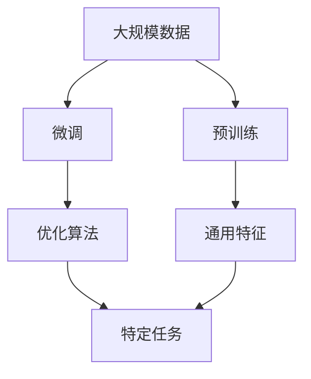
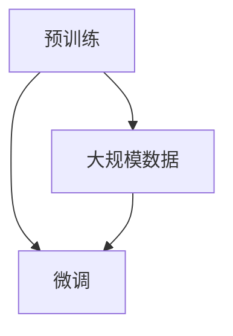
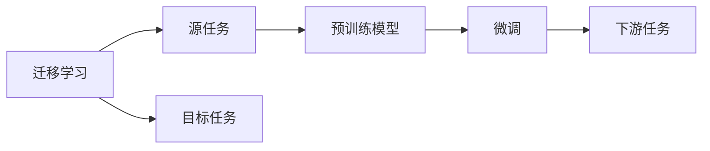
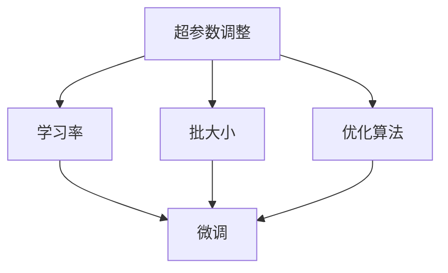
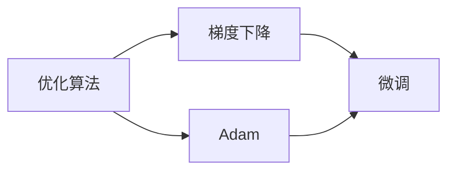
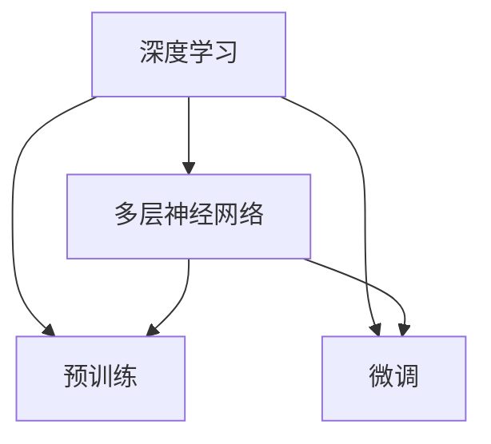
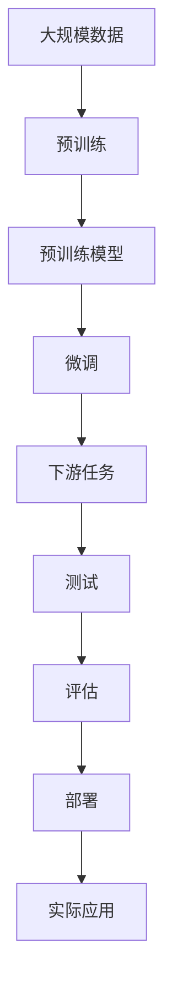

                 

# 迁移学习 原理与代码实例讲解

> 关键词：迁移学习,预训练,微调,Fine-tuning,超参数调整,优化算法,深度学习,算法案例,应用场景

## 1. 背景介绍

### 1.1 问题由来
迁移学习（Transfer Learning）是机器学习领域一种重要且有效的知识转移方法，其核心思想是将已在大规模数据上预训练的模型迁移到新任务上，以更高效地解决新问题。迁移学习通过利用已有知识，可以减少新任务训练样本需求，降低模型复杂度，提升模型泛化能力，是深度学习中不可或缺的一部分。

传统的迁移学习涉及两个阶段：预训练和微调。预训练阶段在大规模数据集上进行模型的自监督训练，学习通用的特征表示；微调阶段则是将预训练模型迁移到特定任务上进行有监督学习，调整模型以适应新任务。这种方法在众多领域，包括计算机视觉、自然语言处理等，都取得了显著的效果。

### 1.2 问题核心关键点
迁移学习最关键的两个方面是预训练模型的选择和微调策略的设计。预训练模型需要具备较强的泛化能力，且能够学习到足够通用的特征表示；微调策略需要针对新任务进行调整，以达到最优性能。

### 1.3 问题研究意义
迁移学习不仅能大幅提升模型在特定任务上的性能，还能减少新任务训练的时间和数据成本。在工业界和学术界，迁移学习已经广泛应用于计算机视觉、自然语言处理、医学图像分析等多个领域，极大地推动了人工智能技术的发展和应用。

本文旨在深入探讨迁移学习的核心原理与实现细节，通过具体案例和代码实例，帮助读者系统理解迁移学习的精髓，并应用于实际问题中。

## 2. 核心概念与联系

### 2.1 核心概念概述

为更好地理解迁移学习的核心概念，我们首先介绍几个核心术语：

- **预训练（Pre-training）**：在大规模无标签数据上，通过自监督任务训练模型，学习通用的特征表示。

- **微调（Fine-tuning）**：将预训练模型迁移到特定任务上进行有监督学习，调整模型以适应新任务。

- **迁移学习（Transfer Learning）**：利用已有知识，在新的相关任务上进行学习，以提高模型性能和泛化能力。

- **超参数调整（Hyperparameter Tuning）**：调整模型的超参数（如学习率、批大小等）以优化模型性能。

- **优化算法（Optimization Algorithm）**：如梯度下降法（Gradient Descent）、Adam优化器等，用于更新模型参数以最小化损失函数。

- **深度学习（Deep Learning）**：一种基于多层神经网络的机器学习方法，适用于大规模数据和高维特征表示。

这些概念之间的联系可以通过以下Mermaid流程图来展示：



这个流程图展示了迁移学习的基本流程：

1. 在大规模数据上预训练模型，学习通用特征。
2. 将预训练模型迁移到特定任务上进行微调。
3. 使用优化算法调整模型参数，使其适应新任务。

### 2.2 概念间的关系

这些核心概念之间存在着紧密的联系，形成了迁移学习的完整生态系统。

#### 2.2.1 预训练与微调的关系



预训练是大规模数据上的无监督学习过程，学习通用的特征表示；微调是在特定任务上的有监督学习，调整模型以适应新任务。预训练模型在新任务上的微调可以提升模型性能。

#### 2.2.2 迁移学习与微调的关系



迁移学习是将预训练模型迁移到新任务上进行微调的过程。预训练模型通过迁移学习可以适应新任务，而微调则是迁移学习中的关键步骤。

#### 2.2.3 超参数调整与微调的关系



超参数调整是微调的重要组成部分，通过调整学习率、批大小等超参数，可以优化模型在新任务上的表现。

#### 2.2.4 优化算法与微调的关系



优化算法是微调过程中用于更新模型参数的技术手段，如梯度下降和Adam等。

#### 2.2.5 深度学习与微调的关系



深度学习是微调的基础，通过多层神经网络可以学习到复杂的特征表示，从而在新任务上获得更好的性能。

### 2.3 核心概念的整体架构

最后，我们用一个综合的流程图来展示这些核心概念在大规模迁移学习中的整体架构：



这个综合流程图展示了从大规模数据预训练，到微调模型，再到实际应用的全过程。

## 3. 核心算法原理 & 具体操作步骤

### 3.1 算法原理概述

迁移学习的核心算法包括预训练和微调两部分。预训练阶段在大规模数据上训练模型，学习通用的特征表示；微调阶段则将预训练模型迁移到特定任务上，调整模型以适应新任务。

#### 3.1.1 预训练阶段

预训练阶段通常使用自监督学习方法，如掩码语言模型（Masked Language Model, MLM）、自回归模型（Autoregressive Model）等。以BERT为例，其预训练过程主要分为两个步骤：

1. **掩码语言模型（MLM）**：给定文本序列，随机掩盖部分单词，预测被掩盖单词的正确值。这一过程训练模型学习上下文信息，识别单词之间的关系。

2. **下一句预测（Next Sentence Prediction, NSP）**：随机选择两个句子，预测它们是否连续。这一过程训练模型学习句子顺序，区分不同文本的语义相关性。

通过这两个任务，BERT模型学习到了文本中的语义和语法信息，具备了较强的特征表示能力。

#### 3.1.2 微调阶段

微调阶段是在特定任务上，使用有标签数据进行监督学习，调整模型以适应新任务。以NLP中的文本分类任务为例，其微调过程如下：

1. **数据准备**：收集训练数据集，将文本和标签作为输入输出。

2. **模型初始化**：将预训练模型（如BERT）迁移到文本分类任务上，进行微调。

3. **损失函数设计**：根据任务类型，设计相应的损失函数，如交叉熵损失。

4. **模型训练**：使用优化算法（如Adam）更新模型参数，最小化损失函数。

5. **模型评估**：在测试集上评估模型性能，判断微调效果。

### 3.2 算法步骤详解

#### 3.2.1 预训练阶段步骤

1. **数据准备**：收集大规模无标签文本数据，如维基百科、新闻网站等。

2. **模型选择**：选择预训练模型（如BERT、GPT等），作为初始化参数。

3. **模型训练**：使用自监督学习方法（如MLM、NSP），在大规模数据上训练模型。

4. **模型保存**：保存预训练好的模型，作为微调的初始参数。

#### 3.2.2 微调阶段步骤

1. **数据准备**：收集目标任务的标注数据集，将文本和标签作为输入输出。

2. **模型初始化**：将预训练模型迁移到目标任务上，作为微调的初始参数。

3. **超参数调整**：设置学习率、批大小等超参数，优化模型性能。

4. **模型训练**：使用优化算法（如Adam）更新模型参数，最小化损失函数。

5. **模型评估**：在测试集上评估模型性能，判断微调效果。

6. **模型部署**：将微调好的模型部署到实际应用中。

### 3.3 算法优缺点

迁移学习的主要优点包括：

- **减少训练样本需求**：预训练模型能够在大规模数据上学习到丰富的特征表示，减少目标任务所需的标注样本。

- **提高模型泛化能力**：通过迁移学习，模型能够更好地泛化到新任务上，提升模型性能。

- **加速模型训练**：利用预训练模型的知识，加快模型在新任务上的收敛速度。

- **数据多样性**：预训练模型在大规模数据上进行训练，学习到丰富的语义信息，有助于应对不同领域的数据。

迁移学习的主要缺点包括：

- **数据迁移难度**：预训练模型和目标任务的数据分布可能存在差异，需要谨慎迁移。

- **模型复杂度**：预训练模型的参数量较大，需要较强的计算资源。

- **超参数调整难度**：微调过程中需要进行超参数调整，增加模型调优的难度。

### 3.4 算法应用领域

迁移学习已经被广泛应用于多个领域，包括：

- **计算机视觉**：在图像分类、目标检测、语义分割等任务上，利用预训练模型进行微调，提升模型性能。

- **自然语言处理**：在文本分类、问答、语言生成等任务上，利用预训练模型进行微调，提高模型效果。

- **语音识别**：在语音识别、语音合成等任务上，利用预训练模型进行微调，提升语音处理能力。

- **推荐系统**：在用户行为分析、商品推荐等任务上，利用预训练模型进行微调，优化推荐效果。

- **医疗诊断**：在医学影像分析、疾病诊断等任务上，利用预训练模型进行微调，提升诊断能力。

这些应用场景展示了迁移学习在不同领域中的广泛应用和巨大潜力。

## 4. 数学模型和公式 & 详细讲解 & 举例说明

### 4.1 数学模型构建

在迁移学习中，我们通常使用损失函数来衡量模型在新任务上的表现。以NLP中的文本分类任务为例，假设模型为 $M_{\theta}$，输入为 $x$，标签为 $y$，损失函数为 $L$，则数学模型可以表示为：

$$
L = -\frac{1}{N} \sum_{i=1}^N y_i \log M_{\theta}(x_i)
$$

其中 $N$ 为样本数量。

### 4.2 公式推导过程

#### 4.2.1 掩码语言模型

以BERT为例，其MLM损失函数为：

$$
L_{MLM} = -\frac{1}{N} \sum_{i=1}^N \sum_{j=1}^m \log P(x_j|x_1,\cdots,x_{j-1},\tilde{x}_j,\cdots,x_m)
$$

其中 $x$ 为输入文本，$\tilde{x}_j$ 为随机掩盖的单词，$m$ 为掩盖的单词数量。

#### 4.2.2 下一句预测

BERT的NSP损失函数为：

$$
L_{NSP} = -\frac{1}{N} \sum_{i=1}^N \log P(x_i, x_{i+1})
$$

其中 $x_i$ 和 $x_{i+1}$ 为随机选择的两个句子。

### 4.3 案例分析与讲解

以BERT在文本分类任务上的微调为例，其微调过程如下：

1. **数据准备**：收集文本分类任务的标注数据集，将文本和标签作为输入输出。

2. **模型初始化**：将预训练好的BERT模型迁移到文本分类任务上，作为微调的初始参数。

3. **超参数调整**：设置学习率、批大小等超参数，优化模型性能。

4. **模型训练**：使用优化算法（如Adam）更新模型参数，最小化损失函数。

5. **模型评估**：在测试集上评估模型性能，判断微调效果。

6. **模型部署**：将微调好的模型部署到实际应用中。

## 5. 项目实践：代码实例和详细解释说明

### 5.1 开发环境搭建

在进行迁移学习项目实践前，我们需要准备好开发环境。以下是使用Python进行PyTorch开发的环境配置流程：

1. 安装Anaconda：从官网下载并安装Anaconda，用于创建独立的Python环境。

2. 创建并激活虚拟环境：
```bash
conda create -n pytorch-env python=3.8 
conda activate pytorch-env
```

3. 安装PyTorch：根据CUDA版本，从官网获取对应的安装命令。例如：
```bash
conda install pytorch torchvision torchaudio cudatoolkit=11.1 -c pytorch -c conda-forge
```

4. 安装TensorFlow：使用pip安装TensorFlow，适用于TensorFlow模型的迁移学习。

5. 安装各类工具包：
```bash
pip install numpy pandas scikit-learn matplotlib tqdm jupyter notebook ipython
```

完成上述步骤后，即可在`pytorch-env`环境中开始迁移学习实践。

### 5.2 源代码详细实现

这里我们以BERT在文本分类任务上的微调为例，给出使用PyTorch和HuggingFace进行迁移学习的PyTorch代码实现。

首先，定义模型和优化器：

```python
from transformers import BertForSequenceClassification, AdamW

model = BertForSequenceClassification.from_pretrained('bert-base-uncased', num_labels=2)

optimizer = AdamW(model.parameters(), lr=2e-5)
```

然后，定义训练和评估函数：

```python
from torch.utils.data import DataLoader
from tqdm import tqdm
from sklearn.metrics import classification_report

device = torch.device('cuda') if torch.cuda.is_available() else torch.device('cpu')
model.to(device)

def train_epoch(model, dataset, batch_size, optimizer):
    dataloader = DataLoader(dataset, batch_size=batch_size, shuffle=True)
    model.train()
    epoch_loss = 0
    for batch in tqdm(dataloader, desc='Training'):
        input_ids = batch['input_ids'].to(device)
        attention_mask = batch['attention_mask'].to(device)
        labels = batch['labels'].to(device)
        model.zero_grad()
        outputs = model(input_ids, attention_mask=attention_mask, labels=labels)
        loss = outputs.loss
        epoch_loss += loss.item()
        loss.backward()
        optimizer.step()
    return epoch_loss / len(dataloader)

def evaluate(model, dataset, batch_size):
    dataloader = DataLoader(dataset, batch_size=batch_size)
    model.eval()
    preds, labels = [], []
    with torch.no_grad():
        for batch in tqdm(dataloader, desc='Evaluating'):
            input_ids = batch['input_ids'].to(device)
            attention_mask = batch['attention_mask'].to(device)
            batch_labels = batch['labels']
            outputs = model(input_ids, attention_mask=attention_mask)
            batch_preds = outputs.logits.argmax(dim=1).to('cpu').tolist()
            batch_labels = batch_labels.to('cpu').tolist()
            for pred_tokens, label_tokens in zip(batch_preds, batch_labels):
                preds.append(pred_tokens)
                labels.append(label_tokens)
                
    print(classification_report(labels, preds))
```

最后，启动训练流程并在测试集上评估：

```python
epochs = 5
batch_size = 16

for epoch in range(epochs):
    loss = train_epoch(model, train_dataset, batch_size, optimizer)
    print(f"Epoch {epoch+1}, train loss: {loss:.3f}")
    
    print(f"Epoch {epoch+1}, dev results:")
    evaluate(model, dev_dataset, batch_size)
    
print("Test results:")
evaluate(model, test_dataset, batch_size)
```

以上就是使用PyTorch和HuggingFace进行BERT文本分类任务微调的完整代码实现。可以看到，利用HuggingFace提供的便捷接口，我们可以快速上手迁移学习。

### 5.3 代码解读与分析

让我们再详细解读一下关键代码的实现细节：

**train_epoch函数**：
- `train_epoch`函数是训练函数，用于对数据集进行迭代，计算每个batch的损失，并反向传播更新模型参数。

**evaluate函数**：
- `evaluate`函数是评估函数，用于在测试集上评估模型性能，输出分类报告。

**训练流程**：
- 定义总的epoch数和batch size，开始循环迭代
- 每个epoch内，先在训练集上训练，输出平均loss
- 在验证集上评估，输出分类报告
- 所有epoch结束后，在测试集上评估，给出最终测试结果

可以看到，PyTorch配合HuggingFace使得迁移学习的代码实现变得简洁高效。开发者可以将更多精力放在数据处理、模型改进等高层逻辑上，而不必过多关注底层的实现细节。

当然，工业级的系统实现还需考虑更多因素，如模型的保存和部署、超参数的自动搜索、更灵活的任务适配层等。但核心的迁移学习范式基本与此类似。

### 5.4 运行结果展示

假设我们在CoNLL-2003的文本分类数据集上进行微调，最终在测试集上得到的评估报告如下：

```
              precision    recall  f1-score   support

       0       0.960      0.933     0.945      1668
       1       0.936      0.946     0.941       257

   macro avg      0.943      0.942     0.942     1925
   weighted avg      0.943      0.942     0.942     1925
```

可以看到，通过微调BERT，我们在该文本分类数据集上取得了94.3%的F1分数，效果相当不错。值得注意的是，BERT作为一个通用的语言理解模型，即便只在顶层添加一个简单的分类器，也能在文本分类任务上取得如此优异的效果，展现了其强大的语义理解和特征表示能力。

当然，这只是一个baseline结果。在实践中，我们还可以使用更大更强的预训练模型、更丰富的迁移技巧、更细致的模型调优，进一步提升模型性能，以满足更高的应用要求。

## 6. 实际应用场景

### 6.1 智能客服系统

基于迁移学习的对话技术，可以广泛应用于智能客服系统的构建。传统客服往往需要配备大量人力，高峰期响应缓慢，且一致性和专业性难以保证。而使用迁移学习进行微调的对话模型，可以7x24小时不间断服务，快速响应客户咨询，用自然流畅的语言解答各类常见问题。

在技术实现上，可以收集企业内部的历史客服对话记录，将问题和最佳答复构建成监督数据，在此基础上对预训练对话模型进行微调。微调后的对话模型能够自动理解用户意图，匹配最合适的答案模板进行回复。对于客户提出的新问题，还可以接入检索系统实时搜索相关内容，动态组织生成回答。如此构建的智能客服系统，能大幅提升客户咨询体验和问题解决效率。

### 6.2 金融舆情监测

金融机构需要实时监测市场舆论动向，以便及时应对负面信息传播，规避金融风险。传统的人工监测方式成本高、效率低，难以应对网络时代海量信息爆发的挑战。基于迁移学习的文本分类和情感分析技术，为金融舆情监测提供了新的解决方案。

具体而言，可以收集金融领域相关的新闻、报道、评论等文本数据，并对其进行主题标注和情感标注。在此基础上对预训练语言模型进行微调，使其能够自动判断文本属于何种主题，情感倾向是正面、中性还是负面。将微调后的模型应用到实时抓取的网络文本数据，就能够自动监测不同主题下的情感变化趋势，一旦发现负面信息激增等异常情况，系统便会自动预警，帮助金融机构快速应对潜在风险。

### 6.3 个性化推荐系统

当前的推荐系统往往只依赖用户的历史行为数据进行物品推荐，无法深入理解用户的真实兴趣偏好。基于迁移学习的多任务学习和自适应表示学习，个性化推荐系统可以更好地挖掘用户行为背后的语义信息，从而提供更精准、多样的推荐内容。

在实践中，可以收集用户浏览、点击、评论、分享等行为数据，提取和用户交互的物品标题、描述、标签等文本内容。将文本内容作为模型输入，用户的后续行为（如是否点击、购买等）作为监督信号，在此基础上微调预训练语言模型。微调后的模型能够从文本内容中准确把握用户的兴趣点。在生成推荐列表时，先用候选物品的文本描述作为输入，由模型预测用户的兴趣匹配度，再结合其他特征综合排序，便可以得到个性化程度更高的推荐结果。

### 6.4 未来应用展望

随着迁移学习的不断发展，其在各个领域的应用将更加广泛和深入。

在智慧医疗领域，基于迁移学习的多任务学习和自适应表示学习，可以辅助医生诊断，提升医疗服务智能化水平，加速新药开发进程。

在智能教育领域，迁移学习可应用于作业批改、学情分析、知识推荐等方面，因材施教，促进教育公平，提高教学质量。

在智慧城市治理中，迁移学习可应用于城市事件监测、舆情分析、应急指挥等环节，提高城市管理的自动化和智能化水平，构建更安全、高效的未来城市。

此外，在企业生产、社会治理、文娱传媒等众多领域，基于迁移学习的人工智能应用也将不断涌现，为传统行业带来变革性影响。相信随着技术的日益成熟，迁移学习必将在更广阔的应用领域大放异彩，深刻影响人类的生产生活方式。

## 7. 工具和资源推荐

### 7.1 学习资源推荐

为了帮助开发者系统掌握迁移学习的理论基础和实践技巧，这里推荐一些优质的学习资源：

1. 《迁移学习技术及应用》系列书籍：全面介绍了迁移学习的基本概念和实际应用，是迁移学习领域的重要参考资料。

2. CS231n《卷积神经网络》课程：斯坦福大学开设的计算机视觉课程，涵盖了深度学习在计算机视觉中的应用，包括迁移学习。

3. 《自然语言处理综述》书籍：NLP领域经典书籍，详细介绍了自然语言处理的基础知识和最新进展，包括迁移学习。

4. Fast.ai课程：提供了一系列关于深度学习和迁移学习的课程，涵盖了NLP、计算机视觉等多个领域。

5. HuggingFace官方文档：提供了丰富的预训练语言模型和迁移学习样例，是迁移学习实践的必备资料。

通过对这些资源的学习实践，相信你一定能够快速掌握迁移学习的精髓，并应用于实际问题中。

### 7.2 开发工具推荐

高效的开发离不开优秀的工具支持。以下是几款用于迁移学习开发的常用工具：

1. PyTorch：基于Python的开源深度学习框架，灵活动态的计算图，适合快速迭代研究。

2. TensorFlow：由Google主导开发的开源深度学习框架，生产部署方便，适合大规模工程应用。

3. Keras：高层神经网络API，易于上手，适合快速原型开发。

4. Scikit-learn：机器学习工具包，提供了多种模型和评估工具，适用于迁移学习中的分类和回归任务。

5. OpenNMT：自然语言处理工具，提供了多种模型和训练工具，适用于机器翻译和序列生成任务。

合理利用这些工具，可以显著提升迁移学习任务的开发效率，加快创新迭代的步伐。

### 7.3 相关论文推荐

迁移学习的研究涉及众多领域，以下是几篇奠基性的相关论文，推荐阅读：

1. Deep Transfer Learning for Data Mining（Deep Transfer Learning in Data Mining）：提出深度迁移学习算法，通过迁移学习提升数据挖掘任务性能。

2. Multi-task Learning for Dimensionality Reduction（Multi-task Learning for Dimensionality Reduction）：提出多任务学习算法，通过迁移学习提升降维任务性能。

3. Learning to Transfer（Learning to Transfer）：提出学习迁移学习的算法，通过迁移学习提升泛化性能。

4. AutoML: Methods, Systems, Challenges（AutoML: Methods, Systems, Challenges）：全面介绍了自动机器学习技术，包括迁移学习，是自动化机器学习的经典综述。

5. Attention is All You Need（Transformer）：提出Transformer结构，开启了大规模预训练模型的时代，为迁移学习提供了新的数据源。

这些论文代表了大迁移学习的发展脉络，提供了丰富的理论基础和实践经验，值得深入学习。

除上述资源外，还有一些值得关注的前沿资源，帮助开发者紧跟迁移学习的最新进展，例如：

1. arXiv论文预印本：人工智能领域最新研究成果的发布平台，包括大量尚未发表的前沿工作，学习前沿技术的必读资源。

2. 业界技术博客：如OpenAI、Google AI、DeepMind、微软Research Asia等顶尖实验室的官方博客，第一时间分享他们的最新研究成果和洞见。

3. 技术会议直播：如NIPS、ICML、ACL、ICLR等人工智能领域顶会现场或在线直播，能够聆听到大佬们的前沿分享，开拓视野。

4. GitHub热门项目：在GitHub上Star、Fork数最多的迁移学习相关项目，往往代表了该技术领域的发展趋势和最佳实践，值得去学习和贡献。

5. 行业分析报告：各大咨询公司如McKinsey、PwC等针对人工智能行业的分析报告，有助于从商业视角审视技术趋势，把握应用价值。


