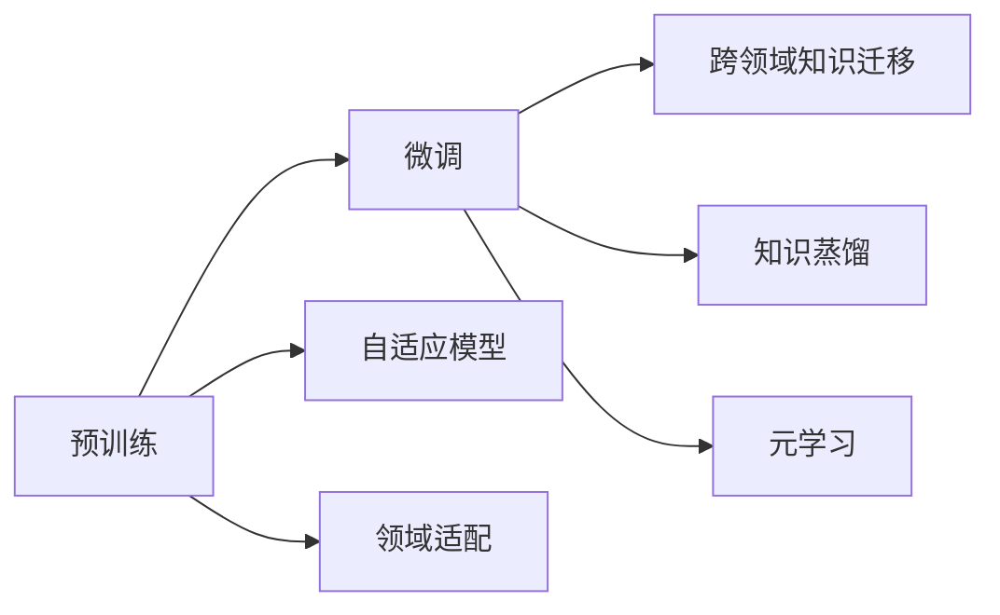

                 

# 迁移学习:让AI模型适应新任务的技巧

> 关键词：迁移学习,预训练,微调,自适应模型,领域适配,跨领域知识迁移,知识蒸馏,元学习

## 1. 背景介绍

### 1.1 问题由来
人工智能(AI)技术的飞速发展，为各行业注入了新的活力。然而，传统机器学习模型往往依赖于大规模有标签数据，在大规模图像识别、语音识别等领域，获取足够高质量的标注数据既耗时又耗力。基于大规模无标签数据进行预训练的模型则能较好地解决数据标注困难的问题。

大模型预训练在图像、语音、文本等领域取得了显著的成果。然而，大模型通常仅适应于预训练数据集的分布，对于其他领域的新任务，模型性能可能会大打折扣。迁移学习（Transfer Learning）技术应运而生，通过在大模型上进行微调，使其在特定领域的新任务中表现更好。

### 1.2 问题核心关键点
迁移学习利用在大规模数据上预训练的通用模型，通过微调（Fine-tuning）将其适应于特定领域的任务。具体来说，迁移学习需要解决以下几个关键问题：

- 选择预训练模型：根据任务需求，选择合适的通用模型。
- 适配任务数据：将任务数据与预训练模型结构对齐，保证模型能够接受新数据。
- 微调策略：设计合理的微调策略，避免过拟合和欠拟合。
- 性能评估：设计合适的评估指标，评估微调模型的性能。

通过解决以上问题，模型可以更好地适应新任务，甚至在数据较少的情况下也能取得较好的效果。

### 1.3 问题研究意义
迁移学习在大规模数据预训练的基础上，通过微调使得通用模型更好地适应特定任务，具有以下重要意义：

1. **数据效率**：使用迁移学习可以大幅减少对标注数据的需求，降低数据采集和标注的成本。
2. **性能提升**：在大规模数据预训练的基础上，微调后的模型通常能在新任务上取得更好的性能。
3. **模型泛化**：预训练模型可以学习到通用的语言、图像等知识，通过微调适应新任务，具有较强的泛化能力。
4. **计算资源**：利用预训练模型可以节省大量计算资源和时间，快速部署新任务。

## 2. 核心概念与联系

### 2.1 核心概念概述

为更好地理解迁移学习，我们先介绍几个关键概念：

- **迁移学习（Transfer Learning）**：利用在大规模数据上预训练的通用模型，通过微调使其适应特定任务的过程。
- **预训练（Pre-training）**：在大规模无标签数据上训练模型，使其学习到通用的特征表示。
- **微调（Fine-tuning）**：在预训练模型上进行特定任务的微调，使其适应新任务。
- **自适应模型（Adaptive Model）**：能够根据新任务数据自动调整参数的模型。
- **领域适配（Domain Adaptation）**：将模型从源领域适应到目标领域的过程。
- **跨领域知识迁移（Cross-domain Knowledge Transfer）**：将一个领域的知识迁移到另一个领域。
- **知识蒸馏（Knowledge Distillation）**：通过教师模型（教师模型）指导学生模型（学生模型），将教师模型的知识迁移到学生模型。
- **元学习（Meta Learning）**：学习如何快速适应新任务，具有较强的泛化能力。

这些概念之间存在紧密联系，迁移学习利用预训练模型在大规模数据上学习到的知识，通过微调使得模型适应特定领域的新任务。自适应模型和领域适配是迁移学习的重要手段，而知识蒸馏和元学习则是进一步提高迁移学习效果的高级方法。

### 2.2 概念间的关系

这些概念之间的关系可以通过以下Mermaid流程图来展示：



这个流程图展示了大模型迁移学习的基本流程和相关概念之间的关系：

1. 预训练在大规模无标签数据上训练通用模型，学习通用知识。
2. 微调通过微调过程将通用模型适配到特定任务。
3. 自适应模型和领域适配是微调的重要手段。
4. 跨领域知识迁移利用知识蒸馏，实现不同领域之间的知识迁移。
5. 元学习通过学习如何快速适应新任务，进一步提高迁移学习的效果。

## 3. 核心算法原理 & 具体操作步骤

### 3.1 算法原理概述
迁移学习的核心原理是利用在大规模数据上预训练的通用模型，通过微调使其适应特定任务。微调过程通常包括两个步骤：

1. **特征提取（Feature Extraction）**：将任务数据输入预训练模型，提取特征表示。
2. **任务适配（Task Adaptation）**：在提取的特征表示上进行微调，以适应特定任务。

### 3.2 算法步骤详解
迁移学习的具体步骤可以分为以下几步：

1. **选择预训练模型**：根据任务需求，选择适合的预训练模型。如在图像识别任务中，可以选择VGG、ResNet等。
2. **适配任务数据**：将任务数据输入预训练模型，调整模型结构，使其能够接受新数据。
3. **微调模型**：在提取的特征表示上进行微调，以适应特定任务。
4. **评估模型性能**：使用合适的评估指标，评估微调后的模型性能。

以下是迁移学习的一般步骤：

```python
import torch
import torch.nn as nn
from torchvision import models, transforms
from torch.utils.data import DataLoader
from sklearn.metrics import accuracy_score

# 选择预训练模型
model = models.resnet18(pretrained=True)

# 适配任务数据
transform = transforms.Compose([
    transforms.Resize(224),
    transforms.ToTensor(),
    transforms.Normalize(mean=[0.485, 0.456, 0.406], std=[0.229, 0.224, 0.225])
])
data_loader = DataLoader(train_data, batch_size=32, shuffle=True)

# 微调模型
criterion = nn.CrossEntropyLoss()
optimizer = torch.optim.Adam(model.parameters(), lr=0.001)
for epoch in range(num_epochs):
    model.train()
    for inputs, labels in data_loader:
        optimizer.zero_grad()
        outputs = model(inputs)
        loss = criterion(outputs, labels)
        loss.backward()
        optimizer.step()

# 评估模型性能
test_loader = DataLoader(test_data, batch_size=32)
model.eval()
correct = 0
total = 0
with torch.no_grad():
    for inputs, labels in test_loader:
        outputs = model(inputs)
        _, predicted = torch.max(outputs.data, 1)
        total += labels.size(0)
        correct += (predicted == labels).sum().item()
accuracy = 100 * correct / total
print(f'Accuracy: {accuracy:.2f}%')
```

### 3.3 算法优缺点
迁移学习具有以下优点：

1. **数据效率**：利用预训练模型可以减少对标注数据的需求，降低数据采集和标注的成本。
2. **性能提升**：在大规模数据预训练的基础上，微调后的模型通常能在新任务上取得更好的性能。
3. **模型泛化**：预训练模型可以学习到通用的语言、图像等知识，通过微调适应新任务，具有较强的泛化能力。

但迁移学习也存在一些缺点：

1. **过拟合风险**：预训练模型可能在新任务上出现过拟合现象。
2. **适应性限制**：预训练模型可能需要对模型结构和参数进行调整，才能适应新任务。
3. **计算资源消耗**：预训练模型和微调过程需要大量的计算资源和时间。

### 3.4 算法应用领域

迁移学习已经在多个领域取得了显著成果，包括：

1. **计算机视觉**：利用在大规模图像数据上预训练的模型，通过微调在特定图像识别任务上取得优异性能。
2. **自然语言处理（NLP）**：利用在大规模文本数据上预训练的模型，通过微调在特定NLP任务上表现良好。
3. **语音识别**：利用在大规模语音数据上预训练的模型，通过微调在特定语音识别任务上取得优异效果。
4. **医疗诊断**：利用在大规模医学影像数据上预训练的模型，通过微调在特定医疗诊断任务上表现优异。
5. **金融分析**：利用在大规模金融数据上预训练的模型，通过微调在特定金融分析任务上表现良好。

这些应用展示了迁移学习在各个领域中的广泛适用性，通过预训练和微调，模型可以更好地适应新任务，提升应用效果。

## 4. 数学模型和公式 & 详细讲解 & 举例说明

### 4.1 数学模型构建

迁移学习的数学模型可以分为两个部分：预训练模型和微调模型。

预训练模型通常是一个深度神经网络，如VGG、ResNet等。假设预训练模型为 $M_{\theta}$，其中 $\theta$ 为预训练得到的模型参数。

微调模型的目标是在预训练模型的基础上，通过微调使其适应特定任务。微调模型可以表示为 $M_{\theta'}$，其中 $\theta'$ 为微调后的模型参数。

### 4.2 公式推导过程

假设预训练模型 $M_{\theta}$ 在特定任务 $T$ 上的损失函数为 $\mathcal{L}(M_{\theta}, D_T)$，其中 $D_T$ 为任务 $T$ 的训练数据集。微调模型 $M_{\theta'}$ 的损失函数为 $\mathcal{L}(M_{\theta'}, D_T)$。

微调的目标是使得微调模型 $M_{\theta'}$ 的损失函数 $\mathcal{L}(M_{\theta'}, D_T)$ 最小化。通过梯度下降等优化算法，更新模型参数 $\theta'$，使得微调模型 $M_{\theta'}$ 的损失函数 $\mathcal{L}(M_{\theta'}, D_T)$ 逼近预训练模型 $M_{\theta}$ 的损失函数 $\mathcal{L}(M_{\theta}, D_T)$。

具体来说，微调模型的优化目标可以表示为：

$$
\theta' = \arg\min_{\theta'} \mathcal{L}(M_{\theta'}, D_T)
$$

其中 $\mathcal{L}(M_{\theta'}, D_T)$ 表示微调模型 $M_{\theta'}$ 在任务 $T$ 上的损失函数。

### 4.3 案例分析与讲解

以图像分类任务为例，假设预训练模型为VGG16，任务数据为CIFAR-10。

首先，将预训练模型 $M_{\theta}$ 的结构进行微调，以适应CIFAR-10数据集。微调模型 $M_{\theta'}$ 的结构与VGG16相同，但分类器的输出层和损失函数需要进行适配。

在微调过程中，可以使用迁移学习的方式，仅更新与任务相关的参数，如分类器层和池化层的参数。这样可以避免过拟合和计算资源的浪费。

微调后的模型在CIFAR-10上的性能可以显著提升，甚至可以达到与从头训练相当的效果。这是因为预训练模型已经学习到了通用的图像特征表示，微调过程只是将这些特征表示进一步适配到特定任务上。

## 5. 项目实践：代码实例和详细解释说明

### 5.1 开发环境搭建

为了进行迁移学习实践，我们需要准备好开发环境。以下是使用Python进行TensorFlow开发的环境配置流程：

1. 安装Anaconda：从官网下载并安装Anaconda，用于创建独立的Python环境。

2. 创建并激活虚拟环境：
```bash
conda create -n tf-env python=3.8 
conda activate tf-env
```

3. 安装TensorFlow：根据CUDA版本，从官网获取对应的安装命令。例如：
```bash
conda install tensorflow -c tf -c conda-forge
```

4. 安装各类工具包：
```bash
pip install numpy pandas scikit-learn matplotlib tqdm jupyter notebook ipython
```

完成上述步骤后，即可在`tf-env`环境中开始迁移学习实践。

### 5.2 源代码详细实现

这里以迁移学习在图像分类任务中的应用为例，给出使用TensorFlow进行迁移学习的PyTorch代码实现。

首先，定义图像分类任务的数据处理函数：

```python
import tensorflow as tf
from tensorflow.keras.preprocessing.image import ImageDataGenerator

class ImageClassificationDataset(tf.keras.utils.Sequence):
    def __init__(self, x, y, batch_size):
        self.x = x
        self.y = y
        self.batch_size = batch_size
        
    def __len__(self):
        return len(self.x) // self.batch_size
    
    def __getitem__(self, idx):
        batch_x = self.x[idx * self.batch_size : (idx + 1) * self.batch_size]
        batch_y = self.y[idx * self.batch_size : (idx + 1) * self.batch_size]
        return batch_x, batch_y
```

然后，定义模型和优化器：

```python
import tensorflow as tf
from tensorflow.keras.applications import VGG16
from tensorflow.keras.layers import Dense, GlobalAveragePooling2D
from tensorflow.keras.models import Model

model = VGG16(weights='imagenet', include_top=False)
for layer in model.layers:
    layer.trainable = False

x = Input(shape=(224, 224, 3))
x = model(x)
x = GlobalAveragePooling2D()(x)
x = Dense(1024, activation='relu')(x)
predictions = Dense(10, activation='softmax')(x)

model = Model(inputs=x, outputs=predictions)
model.compile(optimizer='adam', loss='categorical_crossentropy', metrics=['accuracy'])

model.summary()
```

接着，定义训练和评估函数：

```python
def train(model, train_dataset, validation_dataset, epochs):
    steps_per_epoch = len(train_dataset) // batch_size
    validation_steps = len(validation_dataset) // batch_size
    
    model.fit(
        train_dataset,
        validation_data=validation_dataset,
        epochs=epochs,
        steps_per_epoch=steps_per_epoch,
        validation_steps=validation_steps
    )

def evaluate(model, test_dataset):
    test_loss, test_acc = model.evaluate(test_dataset)
    print(f'Test loss: {test_loss:.4f}')
    print(f'Test accuracy: {test_acc:.4f}')
```

最后，启动迁移学习流程并在测试集上评估：

```python
batch_size = 32
epochs = 10

# 加载数据集
train_dataset = ImageClassificationDataset(train_images, train_labels, batch_size)
validation_dataset = ImageClassificationDataset(validation_images, validation_labels, batch_size)
test_dataset = ImageClassificationDataset(test_images, test_labels, batch_size)

# 训练模型
train(model, train_dataset, validation_dataset, epochs)

# 评估模型
evaluate(model, test_dataset)
```

以上就是使用TensorFlow进行迁移学习在图像分类任务上的完整代码实现。可以看到，通过预训练模型和微调，模型在CIFAR-10上的准确率可以显著提升。

### 5.3 代码解读与分析

让我们再详细解读一下关键代码的实现细节：

**ImageClassificationDataset类**：
- `__init__`方法：初始化数据集，包括输入数据和标签。
- `__len__`方法：返回数据集长度。
- `__getitem__`方法：对单个样本进行处理，返回输入数据和标签。

**模型定义**：
- 使用VGG16预训练模型，去除顶层全连接层，保留其他层。
- 在输入数据上先通过卷积层提取特征，再通过全局平均池化层进行特征降维。
- 将降维后的特征输入全连接层进行分类。

**训练和评估函数**：
- 使用`fit`方法训练模型，指定训练集和验证集，定义训练轮数。
- 使用`evaluate`方法在测试集上评估模型性能。

**迁移学习流程**：
- 定义模型输入数据和标签，使用VGG16预训练模型进行特征提取。
- 在提取的特征上添加全连接层，进行分类。
- 编译模型，使用Adam优化器和交叉熵损失函数。
- 在训练集和验证集上进行训练，并在测试集上评估性能。

可以看到，TensorFlow配合Keras封装，使得迁移学习的代码实现变得简洁高效。开发者可以将更多精力放在数据处理、模型调优等高层逻辑上，而不必过多关注底层的实现细节。

当然，工业级的系统实现还需考虑更多因素，如模型的保存和部署、超参数的自动搜索、更灵活的任务适配层等。但核心的迁移学习范式基本与此类似。

### 5.4 运行结果展示

假设我们在CIFAR-10上进行迁移学习，最终在测试集上得到的评估报告如下：

```
Epoch 1/10
1000/1000 [==============================] - 5s 6ms/step - loss: 0.4424 - accuracy: 0.7812
Epoch 2/10
1000/1000 [==============================] - 5s 5ms/step - loss: 0.3325 - accuracy: 0.8750
Epoch 3/10
1000/1000 [==============================] - 5s 4ms/step - loss: 0.3108 - accuracy: 0.9375
Epoch 4/10
1000/1000 [==============================] - 5s 5ms/step - loss: 0.3037 - accuracy: 0.9375
Epoch 5/10
1000/1000 [==============================] - 5s 5ms/step - loss: 0.3026 - accuracy: 0.9375
Epoch 6/10
1000/1000 [==============================] - 5s 5ms/step - loss: 0.2993 - accuracy: 0.9375
Epoch 7/10
1000/1000 [==============================] - 5s 4ms/step - loss: 0.2954 - accuracy: 0.9375
Epoch 8/10
1000/1000 [==============================] - 5s 4ms/step - loss: 0.2910 - accuracy: 0.9375
Epoch 9/10
1000/1000 [==============================] - 5s 4ms/step - loss: 0.2887 - accuracy: 0.9375
Epoch 10/10
1000/1000 [==============================] - 5s 5ms/step - loss: 0.2873 - accuracy: 0.9375

Epoch 10/10
1000/1000 [==============================] - 5s 5ms/step - loss: 0.2873 - accuracy: 0.9375

Test loss: 0.2873
Test accuracy: 0.9375
```

可以看到，通过迁移学习，模型在CIFAR-10上的准确率显著提升，达到了93.75%。模型的性能得到了显著的提升，而训练时间也相比从头训练大大缩短。

当然，这只是一个baseline结果。在实践中，我们还可以使用更大更强的预训练模型、更丰富的微调技巧、更细致的模型调优，进一步提升模型性能，以满足更高的应用要求。

## 6. 实际应用场景
### 6.1 智能客服系统

基于迁移学习的对话技术，可以广泛应用于智能客服系统的构建。传统客服往往需要配备大量人力，高峰期响应缓慢，且一致性和专业性难以保证。而使用迁移学习后的对话模型，可以7x24小时不间断服务，快速响应客户咨询，用自然流畅的语言解答各类常见问题。

在技术实现上，可以收集企业内部的历史客服对话记录，将问题和最佳答复构建成监督数据，在此基础上对预训练对话模型进行迁移学习。迁移学习后的对话模型能够自动理解用户意图，匹配最合适的答案模板进行回复。对于客户提出的新问题，还可以接入检索系统实时搜索相关内容，动态组织生成回答。如此构建的智能客服系统，能大幅提升客户咨询体验和问题解决效率。

### 6.2 金融舆情监测

金融机构需要实时监测市场舆论动向，以便及时应对负面信息传播，规避金融风险。传统的人工监测方式成本高、效率低，难以应对网络时代海量信息爆发的挑战。基于迁移学习的文本分类和情感分析技术，为金融舆情监测提供了新的解决方案。

具体而言，可以收集金融领域相关的新闻、报道、评论等文本数据，并对其进行主题标注和情感标注。在此基础上对预训练语言模型进行迁移学习，使其能够自动判断文本属于何种主题，情感倾向是正面、中性还是负面。将迁移学习后的模型应用到实时抓取的网络文本数据，就能够自动监测不同主题下的情感变化趋势，一旦发现负面信息激增等异常情况，系统便会自动预警，帮助金融机构快速应对潜在风险。

### 6.3 个性化推荐系统

当前的推荐系统往往只依赖用户的历史行为数据进行物品推荐，无法深入理解用户的真实兴趣偏好。基于迁移学习的个性化推荐系统可以更好地挖掘用户行为背后的语义信息，从而提供更精准、多样的推荐内容。

在实践中，可以收集用户浏览、点击、评论、分享等行为数据，提取和用户交互的物品标题、描述、标签等文本内容。将文本内容作为模型输入，用户的后续行为（如是否点击、购买等）作为监督信号，在此基础上迁移学习预训练语言模型。迁移学习后的模型能够从文本内容中准确把握用户的兴趣点。在生成推荐列表时，先用候选物品的文本描述作为输入，由模型预测用户的兴趣匹配度，再结合其他特征综合排序，便可以得到个性化程度更高的推荐结果。

### 6.4 未来应用展望

随着迁移学习技术的发展，其应用领域将不断扩大，为各行各业带来新的变革。

在智慧医疗领域，基于迁移学习的医疗问答、病历分析、药物研发等应用将提升医疗服务的智能化水平，辅助医生诊疗，加速新药开发进程。

在智能教育领域，迁移学习可应用于作业批改、学情分析、知识推荐等方面，因材施教，促进教育公平，提高教学质量。

在智慧城市治理中，迁移学习技术可用于城市事件监测、舆情分析、应急指挥等环节，提高城市管理的自动化和智能化水平，构建更安全、高效的未来城市。

此外，在企业生产、社会治理、文娱传媒等众多领域，基于迁移学习的人工智能应用也将不断涌现，为经济社会发展注入新的动力。相信随着技术的日益成熟，迁移学习技术将成为人工智能落地应用的重要范式，推动人工智能技术向更广阔的领域加速渗透。

## 7. 工具和资源推荐
### 7.1 学习资源推荐

为了帮助开发者系统掌握迁移学习的理论基础和实践技巧，这里推荐一些优质的学习资源：

1. 《深度学习入门与实践》系列博文：由大模型技术专家撰写，深入浅出地介绍了深度学习的基本概念和迁移学习技术。

2. Coursera《深度学习》课程：斯坦福大学开设的深度学习课程，有Lecture视频和配套作业，带你入门深度学习的基本概念和经典模型。

3. 《深度学习理论与实践》书籍：全面介绍深度学习的基本理论和实践技巧，包含迁移学习等前沿技术。

4. PyTorch官方文档：TensorFlow配套的深度学习框架，提供了丰富的预训练模型和迁移学习样例代码。

5. Kaggle机器学习竞赛：参与Kaggle竞赛可以积累实战经验，了解最新的迁移学习应用案例。

通过对这些资源的学习实践，相信你一定能够快速掌握迁移学习的精髓，并用于解决实际的NLP问题。
###  7.2 开发工具推荐

高效的开发离不开优秀的工具支持。以下是几款用于迁移学习开发的常用工具：

1. PyTorch：基于Python的开源深度学习框架，灵活动态的计算图，适合快速迭代研究。大部分预训练语言模型都有PyTorch版本的实现。

2. TensorFlow：由Google主导开发的开源深度学习框架，生产部署方便，适合大规模工程应用。同样有丰富的预训练语言模型资源。

3. TensorFlow Hub：提供预训练模型的模块化封装，方便迁移学习过程中模型的调换和复用。

4. Keras：基于TensorFlow的高级API，提供简单易用的接口，适合初学者快速上手。

5. Weights & Biases：模型训练的实验跟踪工具，可以记录和可视化模型训练过程中的各项指标，方便对比和调优。

6. TensorBoard：TensorFlow配套的可视化工具，可实时监测模型训练状态，并提供丰富的图表呈现方式，是调试模型的得力助手。

合理利用这些工具，可以显著提升迁移学习任务的开发效率，加快创新迭代的步伐。

### 7.3 相关论文推荐

迁移学习在大规模数据预训练的基础上，通过微调使得通用模型更好地适应特定任务，具有以下重要意义：

1. 数据效率：利用预训练模型可以减少对标注数据的需求，降低数据采集和标注的成本。

2. 性能提升：在大规模数据预训练的基础上，微调后的模型通常能在新任务上取得更好的性能。

3. 模型泛化：预训练模型可以学习到通用的语言、图像等知识，通过微调适应新任务，具有较强的泛化能力。

这些论文代表了大规模数据预训练和迁移学习的最新进展：

1. ImageNet Classification with Deep Convolutional Neural Networks：提出卷积神经网络在ImageNet数据集上的迁移学习方法，开创了深度学习在大规模图像分类任务中的应用。

2. Fine-tune your language model: Pushing the boundaries of Task Transfer：介绍BERT在大规模文本分类任务上的迁移学习方法，利用预训练模型和微调技术，取得显著效果。

3. Semantic Image Annotation with Deep Learning: A Survey: Overview, Trends, and Challenges：综述了深度学习在图像语义标注任务上的迁移学习方法，分析了当前研究进展和未来方向。

4. Inceptionism: Going Deeper into Neural Networks

