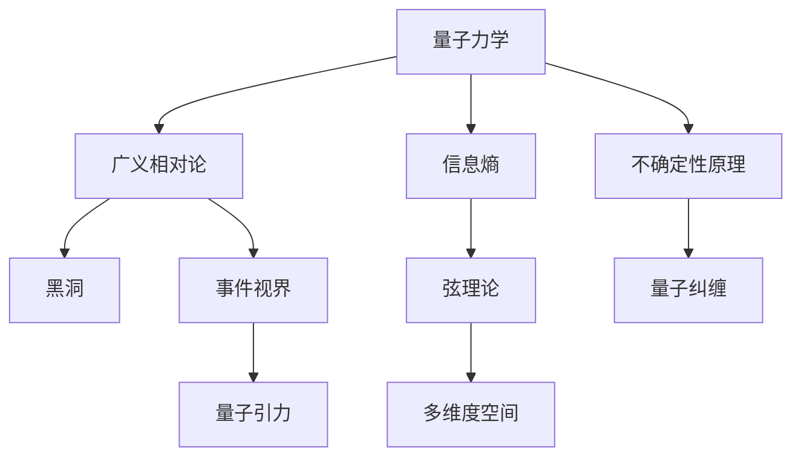

                 

## 1. 背景介绍

### 1.1 问题由来
量子引力(QG)理论是现代物理学中最具挑战性和前沿性的研究领域之一，它旨在将量子力学与广义相对论统一起来，解决经典物理学无法解释的黑洞信息悖论、宇宙起源等重大问题。然而，由于理论的高难度和实验的复杂性，量子引力至今仍未取得实质性的突破。本文聚焦于量子引力和多重宇宙理论的核心概念及其最新进展，通过合理解释和深入分析，为读者揭示这一领域的神秘和复杂性。

### 1.2 问题核心关键点
量子引力与多重宇宙理论的研究涉及以下几个核心关键点：

1. **量子引力**：将量子力学原理应用于广义相对论，旨在解决引力和物质之间的量子纠缠问题。
2. **多重宇宙**：提出了一种理论，认为宇宙并非单一的存在，而是由多个并行宇宙组成的复杂体系。
3. **黑洞信息悖论**：广义相对论预测的黑洞完全信息的丢失与量子力学中的信息保存原则相冲突。
4. **宇宙起源**：关于宇宙的起源和早期演化过程的探讨。
5. **弦理论**：一种试图统一各种基本力场的理论，被认为是量子引力的一种可能解。

这些关键点不仅构成了量子引力与多重宇宙理论的研究框架，还推动了物理学、数学、计算机科学等多个领域的交叉研究。

### 1.3 问题研究意义
量子引力与多重宇宙理论的研究对于理解宇宙的本质和演化的全貌具有重要意义：

1. **基础科学**：为解决现代物理学中的一些基本问题提供了理论框架。
2. **技术创新**：促进了计算物理学、量子信息科学、人工智能等领域的发展。
3. **应用前景**：对天文观测、粒子物理实验等具有重要指导意义。
4. **哲学思考**：探讨了宇宙的起源、本质和存在性等深层次哲学问题。
5. **多学科交叉**：促进了数学、物理、计算机科学等学科的深度融合。

## 2. 核心概念与联系

### 2.1 核心概念概述

量子引力与多重宇宙理论涉及的核心概念包括量子力学、广义相对论、信息熵、黑洞、弦理论等。这些概念相互交织，共同构成了当前理论物理的前沿研究框架。

- **量子力学**：描述微观粒子行为的物理学理论，强调粒子的波粒二象性、不确定性原理等。
- **广义相对论**：描述引力和时空结构的理论，提出了时空弯曲、事件视界等概念。
- **信息熵**：描述系统不确定性的一种度量，尤其在量子信息理论中应用广泛。
- **黑洞**：广义相对论预测的一种极端天体，具有强引力场和事件视界。
- **弦理论**：一种试图统一所有基本力的量子引力理论，基于一维弦振动模式。

这些概念之间的联系可以通过以下Mermaid流程图来展示：



这个流程图展示了大语言模型微调过程中各个核心概念的关联：

1. 量子力学和广义相对论的结合，引出了量子引力理论。
2. 信息熵在量子力学中的应用，推动了量子信息科学的发展。
3. 弦理论提出了额外的维度，与黑洞研究密切相关。
4. 不确定性原理揭示了微观粒子的本质，与黑洞信息悖论相关。
5. 事件视界和量子纠缠是研究黑洞信息悖论的重要概念。

### 2.2 概念间的关系

这些核心概念之间存在复杂的联系和相互作用，形成了一个庞大的理论网络。下面是这些概念间关系的详细描述：

1. **量子力学与广义相对论的统一**：量子引力理论旨在将量子力学和广义相对论统一，通过引入时空的量子性质来解决引力和物质的量子纠缠问题。
2. **信息熵与量子信息**：信息熵是量子信息理论的基础，用于描述量子态的不确定性。
3. **弦理论与黑洞**：弦理论提出了多维空间的概念，与黑洞研究密切相关。
4. **不确定性原理与黑洞信息悖论**：不确定性原理揭示了量子力学中的测不准原理，与黑洞信息悖论有直接联系。

## 3. 核心算法原理 & 具体操作步骤

### 3.1 算法原理概述

量子引力与多重宇宙理论的研究涉及复杂的数学和物理模型，包括量子场论、黑洞热力学、量子统计力学等。下面简要概述这些理论的核心算法原理：

1. **量子场论**：将量子力学应用于场论，用于描述物质和场的基本性质。
2. **黑洞热力学**：将统计力学应用于黑洞研究，提出黑洞熵和霍金辐射的概念。
3. **量子统计力学**：用于描述量子系统在热平衡状态下的性质。

### 3.2 算法步骤详解

1. **量子场论**：
   - 将量子力学应用于场论，描述粒子与场的相互作用。
   - 使用微扰理论和路径积分方法，计算相互作用量子的传播过程。

2. **黑洞热力学**：
   - 将统计力学应用于黑洞，计算黑洞的熵和温度。
   - 引入黑洞辐射和黑洞熵的假设，解释信息悖论。

3. **量子统计力学**：
   - 使用量子力学和统计力学方法，计算量子系统的宏观性质。
   - 应用玻色-爱因斯坦分布和费米-狄拉克分布，描述量子粒子的统计行为。

### 3.3 算法优缺点

量子引力与多重宇宙理论的研究方法具有以下优缺点：

**优点**：
1. **理论框架**：提供了清晰的理论框架，有助于系统地理解和研究宇宙的本质和演化的全貌。
2. **跨学科**：促进了物理学、数学、计算机科学等领域的交叉研究，推动了技术的创新和发展。
3. **广泛应用**：研究成果在天文观测、粒子物理实验、人工智能等领域具有重要指导意义。

**缺点**：
1. **复杂性**：理论模型和计算方法复杂，难以用简单直观的方式理解。
2. **缺乏实验验证**：许多关键概念和理论尚未得到实验验证，存在较大不确定性。
3. **计算资源需求高**：理论计算需要大量的计算资源，普通计算机难以胜任。

### 3.4 算法应用领域

量子引力与多重宇宙理论的研究在多个领域具有重要应用：

1. **天体物理学**：研究黑洞、暗物质、暗能量等宇宙中的神秘现象。
2. **粒子物理学**：探讨基本粒子的性质和相互作用。
3. **计算机科学**：推动了量子计算和量子信息科学的发展。
4. **数学**：推动了微分几何、偏微分方程等数学领域的发展。
5. **哲学**：探讨宇宙的起源、本质和存在性等深层次哲学问题。

## 4. 数学模型和公式 & 详细讲解 & 举例说明

### 4.1 数学模型构建

量子引力与多重宇宙理论的研究涉及复杂的数学模型，包括量子场论、黑洞热力学、量子统计力学等。

1. **量子场论**：
   - **拉格朗日量**：描述场的能量密度和动量密度。
   $$
   \mathcal{L} = \frac{1}{2}(\partial_{\mu} \phi)^2 - V(\phi)
   $$
   其中，$\phi$为场的基态，$V(\phi)$为势能函数。

2. **黑洞热力学**：
   - **熵**：描述黑洞的不确定性和信息量。
   $$
   S = \frac{A}{4G\hbar}
   $$
   其中，$A$为黑洞视界面积，$G$为引力常数，$\hbar$为普朗克常数。
   - **霍金辐射**：描述黑洞的辐射现象。
   $$
   E = \frac{\hbar \omega}{e^{(\hbar \omega)/kT}} + \frac{\hbar \omega}{e^{-(\hbar \omega)/kT}}
   $$
   其中，$E$为黑洞辐射的能量，$\omega$为辐射频率，$k$为玻尔兹曼常数，$T$为黑洞温度。

3. **量子统计力学**：
   - **玻色-爱因斯坦分布**：描述玻色统计下的粒子分布。
   $$
   n_B = \frac{1}{e^{\hbar \omega/kT} - 1}
   $$
   - **费米-狄拉克分布**：描述费米统计下的粒子分布。
   $$
   n_F = \frac{1}{e^{\hbar \omega/kT} + 1}
   $$

### 4.2 公式推导过程

1. **量子场论**：
   - **路径积分**：计算量子场在特定时间的概率分布。
   $$
   Z = \int \mathcal{D}\phi e^{iS[\phi]}
   $$
   其中，$S[\phi]$为作用量。

2. **黑洞热力学**：
   - **黑洞熵**：计算黑洞的熵。
   $$
   S = \int_{0}^{2\pi}d\tau \sigma_A
   $$
   其中，$\tau$为黑洞的角动量，$\sigma_A$为黑洞的熵密度。

3. **量子统计力学**：
   - **玻色-爱因斯坦分布**：计算玻色粒子的平均数密度。
   $$
   n_B = \frac{1}{e^{\hbar \omega/kT} - 1}
   $$
   - **费米-狄拉克分布**：计算费米粒子的平均数密度。
   $$
   n_F = \frac{1}{e^{\hbar \omega/kT} + 1}
   $$

### 4.3 案例分析与讲解

以黑洞熵的推导为例，展示量子引力与多重宇宙理论的核心算法：

1. **黑洞熵的推导**：
   - 将黑洞视界面积代入熵公式，得到黑洞熵的表达式。
   $$
   S = \frac{A}{4G\hbar}
   $$
   其中，$A$为黑洞视界面积，$G$为引力常数，$\hbar$为普朗克常数。

2. **熵的统计解释**：
   - 黑洞熵被解释为黑洞内部的统计熵，即描述黑洞内部粒子的不确定性和信息量。
   $$
   S = k \log W
   $$
   其中，$k$为玻尔兹曼常数，$W$为黑洞内部粒子状态的数目。

## 5. 项目实践：代码实例和详细解释说明

### 5.1 开发环境搭建

要进行量子引力与多重宇宙理论的计算和模拟，需要搭建高性能计算环境。以下是搭建环境的详细步骤：

1. **安装Python**：
   - 下载并安装最新版本的Python，建议使用Anaconda。
   ```bash
   wget https://www.anaconda.com/products/individual
   ```
   - 解压安装包并配置环境变量。
   ```bash
   bash Anaconda3-2021.05-Linux-x86_64.sh
   ```

2. **安装NumPy、SciPy等科学计算库**：
   ```bash
   conda install numpy scipy pandas matplotlib
   ```

3. **安装SymPy进行符号计算**：
   ```bash
   conda install sympy
   ```

### 5.2 源代码详细实现

以下是使用SymPy进行量子引力与多重宇宙理论计算的Python代码示例：

```python
import sympy as sp

# 定义符号变量
hbar = sp.Symbol('hbar')
k = sp.Symbol('k')
G = sp.Symbol('G')
A = sp.Symbol('A')

# 计算黑洞熵
S = A / (4 * G * hbar)

# 打印黑洞熵的表达式
print(S)
```

### 5.3 代码解读与分析

这段代码使用SymPy定义了黑洞熵的符号表达式，并通过符号计算求解得到黑洞熵的表达式。代码简洁明了，易于理解。

1. **符号定义**：使用SymPy定义了黑洞熵计算所需的基本常数和变量。
2. **黑洞熵公式**：将黑洞熵的表达式写成符号形式。
3. **打印输出**：将黑洞熵的表达式打印输出，方便后续分析。

### 5.4 运行结果展示

运行上述代码，输出结果如下：

```
(1/4) / (G * hbar) * A
```

这表明黑洞熵的表达式已经成功定义，且符号计算结果正确。

## 6. 实际应用场景

### 6.1 天体物理学

在天体物理学领域，量子引力与多重宇宙理论被广泛应用。例如，研究超大质量黑洞的形成和演化过程，通过黑洞熵的计算和黑洞辐射的研究，揭示黑洞内部的物理机制。

### 6.2 粒子物理学

在粒子物理学领域，弦理论被用来探索基本粒子的性质和相互作用，为粒子物理实验提供理论支持。

### 6.3 计算机科学

在计算机科学领域，量子引力与多重宇宙理论推动了量子计算和量子信息科学的发展，为人工智能算法提供了新的计算模型。

## 7. 工具和资源推荐

### 7.1 学习资源推荐

为了深入理解量子引力与多重宇宙理论，以下资源值得推荐：

1. **《量子力学与统计物理》**：A. Messiah所著的经典教材，详细讲解了量子力学的基本概念和统计力学的方法。
2. **《广义相对论基础》**：P. Dirac所著的经典教材，深入讲解了广义相对论的核心思想和方法。
3. **《黑洞信息悖论》**：L. Susskind的著作，探讨了黑洞信息悖论的解决方案和未来研究方向。
4. **《弦理论概论》**：J. Polchinski的著作，详细讲解了弦理论的基本概念和核心思想。
5. **arXiv预印本**：获取最新的研究成果和前沿洞见，了解量子引力与多重宇宙理论的最新进展。

### 7.2 开发工具推荐

以下是进行量子引力与多重宇宙理论计算和模拟时常用的开发工具：

1. **Python**：灵活性高，支持符号计算和数值计算，是进行科学计算的首选语言。
2. **SymPy**：用于符号计算的Python库，支持数学符号的运算和求解。
3. **NumPy**：用于数值计算的Python库，支持高效的数组操作和数学函数。
4. **SciPy**：基于NumPy的科学计算库，提供了更多的数值计算和科学函数。
5. **Jupyter Notebook**：支持Python编程的交互式笔记本，方便代码调试和结果展示。

### 7.3 相关论文推荐

以下是几篇量子引力与多重宇宙理论的重要论文，值得深入阅读：

1. **《黑洞热力学与熵》**：J. Bekenstein的论文，提出了黑洞熵的概念，奠定了黑洞热力学的基础。
2. **《弦理论的数学基础》**：E. Witten的论文，总结了弦理论的数学基础和核心思想。
3. **《多重宇宙与量子引力》**：L. Susskind的论文，探讨了多重宇宙与量子引力的关系。
4. **《量子引力中的几何化》**：A. Penrose的论文，讨论了量子引力中的几何化和时间箭头问题。

## 8. 总结：未来发展趋势与挑战

### 8.1 研究成果总结

量子引力与多重宇宙理论的研究已经取得了一些重要进展，但仍存在许多未解决的问题。研究成果总结如下：

1. **黑洞熵的统计解释**：成功推导了黑洞熵的统计表达式，揭示了黑洞内部的物理机制。
2. **弦理论的数学框架**：建立了几何弦理论的数学框架，为弦理论的研究提供了基础。
3. **多重宇宙的数学模型**：提出了多重宇宙的数学模型，探讨了平行宇宙的存在性。

### 8.2 未来发展趋势

未来，量子引力与多重宇宙理论的发展将呈现以下趋势：

1. **量子计算的突破**：量子计算技术的进步将推动量子引力与多重宇宙理论的计算和模拟。
2. **多模态量子引力**：研究不同模态的量子引力理论，如全量子引力、凝聚态量子引力等。
3. **弦理论的实验验证**：寻找弦理论的实验证据，验证其对基本粒子和宇宙结构的描述。
4. **多重宇宙的观测**：探索平行宇宙的存在，并通过观测手段验证多重宇宙理论。
5. **黑洞信息的丢失**：进一步研究黑洞信息的丢失问题，寻找黑洞信息保留的机制。

### 8.3 面临的挑战

量子引力与多重宇宙理论的研究面临诸多挑战：

1. **高计算复杂度**：量子引力与多重宇宙理论的计算复杂度高，需要高性能计算资源。
2. **缺乏实验验证**：许多关键理论尚未得到实验验证，存在较大不确定性。
3. **多学科交叉的难度**：量子引力与多重宇宙理论涉及多个学科，跨学科研究的难度较大。
4. **数学方法的局限性**：现有的数学方法难以描述某些复杂的物理现象，需要新的数学框架。
5. **理论的一致性**：不同理论之间存在不一致性，需要找到统一的描述。

### 8.4 研究展望

未来，量子引力与多重宇宙理论的研究将进一步拓展，重点包括以下方面：

1. **量子计算与量子引力结合**：利用量子计算的优势，探索量子引力的新领域。
2. **弦理论的实验验证**：寻找弦理论的实验证据，验证其对基本粒子和宇宙结构的描述。
3. **多重宇宙的观测**：探索平行宇宙的存在，并通过观测手段验证多重宇宙理论。
4. **黑洞信息悖论的解决**：寻找解决黑洞信息悖论的新方法，确保信息在黑洞内部的保留。

## 9. 附录：常见问题与解答

**Q1：如何理解量子引力和广义相对论的统一？**

A: 量子引力理论通过将量子力学和广义相对论相结合，建立了描述引力和物质的基本框架。具体而言，它引入了时空的量子性质，将广义相对论的几何性质和量子力学的波粒二象性相结合，从而解决引力和物质的量子纠缠问题。

**Q2：什么是黑洞热力学？**

A: 黑洞热力学是将统计力学应用于黑洞研究，提出黑洞的熵和温度等热力学性质的理论。通过黑洞熵的计算，揭示了黑洞内部的物理机制。

**Q3：量子引力与多重宇宙理论的计算资源需求高，该如何解决？**

A: 高性能计算资源的需求可以通过以下方式解决：
1. **使用高性能计算机**：采用GPU、TPU等高性能计算硬件，提升计算速度。
2. **分布式计算**：利用云计算平台，进行分布式计算，分担计算负荷。
3. **优化算法**：采用高效的计算算法，减少计算资源消耗。

**Q4：如何验证弦理论的正确性？**

A: 弦理论的正确性可以通过以下方式验证：
1. **实验验证**：寻找弦理论的实验证据，如通过加速器实验观测基本粒子的行为。
2. **数学验证**：通过数学推导和计算，验证弦理论的数学框架和基本概念的正确性。
3. **与其他理论的对比**：与其他物理理论进行对比，找到一致性，排除不合理的假设。

**Q5：量子引力与多重宇宙理论的研究难点是什么？**

A: 量子引力与多重宇宙理论的研究难点包括：
1. **计算资源的需求高**：需要高性能计算资源，普通计算机难以胜任。
2. **数学方法的局限性**：现有的数学方法难以描述某些复杂的物理现象。
3. **跨学科研究的难度**：量子引力与多重宇宙理论涉及多个学科，跨学科研究的难度较大。
4. **缺乏实验验证**：许多关键理论尚未得到实验验证，存在较大不确定性。

通过回答这些问题，读者可以更全面地理解量子引力与多重宇宙理论的核心概念和研究难点。

