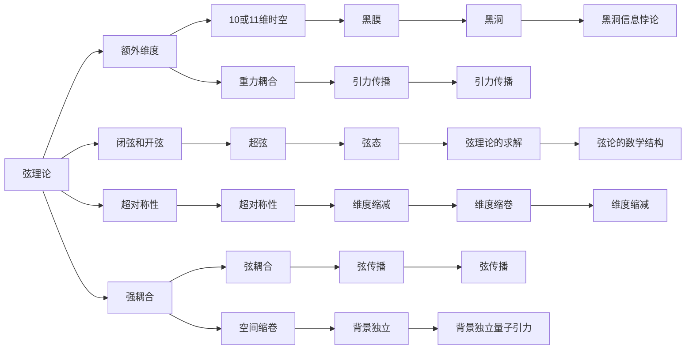
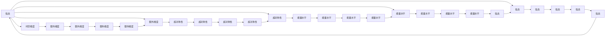
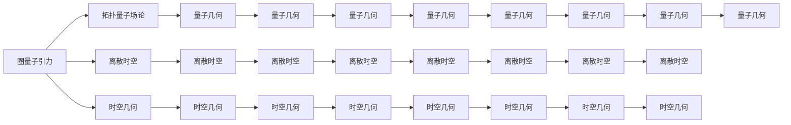
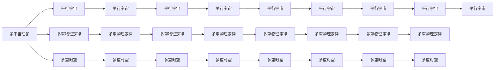

                 

# 量子引力的最新研究进展

> 关键词：量子引力,弦理论,黑洞,多宇宙理论,量子纠缠

## 1. 背景介绍

量子引力（Quantum Gravity）是探索宇宙最基本问题的关键理论之一。它旨在将量子力学和广义相对论这两大物理学的基石统一起来，从而形成一个新的、更加全面的理论框架。这一领域的研究对于理解时间、空间、质量和引力的本质至关重要。近年来，量子引力领域的研究取得了诸多进展，为人类对宇宙的认识提供了新的视角。

### 1.1 问题由来
量子力学和广义相对论各自在不同的领域取得了巨大的成功，但在相互交叉和融合时，却遭遇了重大的困难。传统物理学无法将这两个理论自然地统一在一起。为了解决这一问题，科学家们提出了多种假说和理论，其中包括弦理论、圈量子引力、因果动力量子引力、背景独立量子引力等。这些理论都试图通过不同的方法，将量子力学和广义相对论统一起来。

### 1.2 问题核心关键点
量子引力研究的核心问题包括：
- 如何将量子力学中的波函数与广义相对论中的时空几何结合？
- 如何理解时空的量子性质，以及如何处理引力的量子化？
- 如何统一量子力学中的局域性和广义相对论中的全局性？
- 如何处理量子引力中的奇异点和无限问题？

### 1.3 问题研究意义
量子引力研究对于理解宇宙的根本结构、物质分布、时空演化等具有重要意义。其研究成果不仅能帮助解释黑洞、宇宙大爆炸、暗物质等宇宙学难题，还有可能揭示时空的本质，指导宇宙的进一步探索。

## 2. 核心概念与联系

### 2.1 核心概念概述

量子引力涉及的核心理论和概念包括：
- 弦理论：认为基本粒子不是点粒子，而是由一维弦组成。弦理论通过引入额外的空间维度来解决引力问题。
- 圈量子引力：将时空看作由微小的“圈”组成的离散结构，利用拓扑量子场论的方法处理引力的量子化。
- 因果动力量子引力：通过因果关系而非空间结构来处理引力的量子化，提出了时空的动态演变模型。
- 背景独立量子引力：认为时空背景不是固定不变的，而是动态演变的，强调引力的动力学而非背景。
- 多宇宙理论：提出并行宇宙的概念，认为宇宙可能存在多个，每个宇宙具有不同的物理规律。

这些概念之间通过数学和物理的联系形成了一个复杂的理论体系。下面将通过Mermaid流程图展示这些概念之间的联系：

这些概念相互联系，共同构建了量子引力研究的理论基础。理解这些概念之间的联系，对于深入探讨量子引力问题至关重要。

### 2.2 概念间的关系

这些核心概念之间存在着紧密的联系，形成了量子引力研究的完整体系。下面将通过几个Mermaid流程图展示这些概念之间的关系：

#### 2.2.1 弦理论的基本架构

这个流程图展示了弦理论的基本架构，从超弦到弦态，再到能量水平和额外维度，这些概念相互关联，共同构成了弦理论的基础。

#### 2.2.2 圈量子引力与时空结构

这个流程图展示了圈量子引力的基本架构，从拓扑量子场论到离散时空和量子几何，这些概念相互关联，共同构成了圈量子引力的基础。

#### 2.2.3 多宇宙理论的基础

这个流程图展示了多宇宙理论的基本架构，从平行宇宙到多重物理定律和多重时空，这些概念相互关联，共同构成了多宇宙理论的基础。

### 2.3 核心概念的整体架构

最后，我们用一个综合的流程图来展示这些核心概念在大模型微调过程中的整体架构：

```mermaid
graph TB
    A[超弦] --> B[超对称性]
    B --> C[能量水平]
    A --> D[闭弦]
    D --> E[能量水平]
    A --> F[开弦]
    F --> G[能量水平]
    A --> H[弦耦合]
    H --> I[弦态]
    C --> J[能量水平]
    J --> K[弦态]
    A --> L[额外维度]
    L --> M[11维时空]
    E --> N[能量水平]
    N --> O[弦态]
    G --> P[弦态]
    P --> Q[弦态]
    I --> R[弦态]
    R --> S[弦态]
    M --> T[黑洞]
    T --> U[黑洞信息悖论]
    T --> V[黑膜]
    T --> W[弦态]
    U --> X[量子几何]
    V --> Y[黑膜]
    W --> Z[弦态]
    X --> A[弦态]
    Y --> B[弦态]
    Z --> C[弦态]
    A --> AA[弦态]
    AA --> AB[弦态]
    AB --> AC[弦态]
    AC --> AD[弦态]
    AD --> AE[弦态]
    AE --> AF[弦态]
    AF --> AG[弦态]
    AG --> AH[弦态]
    B --> BA[弦态]
    BA --> BB[弦态]
    BB --> BC[弦态]
    BC --> BD[弦态]
    BD --> BE[弦态]
    BE --> BF[弦态]
    BF --> BG[弦态]
    BG --> BH[弦态]
    C --> CA[弦态]
    CA --> CB[弦态]
    CB --> CC[弦态]
    CC --> CD[弦态]
    CD --> CE[弦态]
    CE --> CF[弦态]
    CF --> CG[弦态]
    CG --> CH[弦态]
    D --> DA[弦态]
    DA --> DB[弦态]
    DB --> DC[弦态]
    DC --> DD[弦态]
    DD --> DE[弦态]
    DE --> DF[弦态]
    DF --> DG[弦态]
    DG --> DH[弦态]
    E --> EA[弦态]
    EA --> EB[弦态]
    EB --> EC[弦态]
    EC --> ED[弦态]
    ED --> EE[弦态]
    EE --> EF[弦态]
    EF --> EG[弦态]
    EG --> EH[弦态]
    F --> FA[弦态]
    FA --> FB[弦态]
    FB --> FC[弦态]
    FC --> FD[弦态]
    FD --> FE[弦态]
    FE --> FF[弦态]
    FF --> FG[弦态]
    FG --> FH[弦态]
    G --> GA[弦态]
    GA --> GB[弦态]
    GB --> GC[弦态]
    GC --> GD[弦态]
    GD --> GE[弦态]
    GE --> GF[弦态]
    GF --> GG[弦态]
    GG --> GH[弦态]
    H --> HA[弦态]
    HA --> HB[弦态]
    HB --> HC[弦态]
    HC --> HD[弦态]
    HD --> HE[弦态]
    HE --> HF[弦态]
    HF --> HG[弦态]
    HG --> HH[弦态]
    I --> IA[弦态]
    IA --> IB[弦态]
    IB --> IC[弦态]
    IC --> ID[弦态]
    ID --> IE[弦态]
    IE --> IF[弦态]
    IF --> IG[弦态]
    IG --> IH[弦态]
    J --> JA[弦态]
    JA --> JB[弦态]
    JB --> JC[弦态]
    JC --> JD[弦态]
    JD --> JE[弦态]
    JE --> JF[弦态]
    JF --> JG[弦态]
    JG --> JH[弦态]
    K --> KA[弦态]
    KA --> KB[弦态]
    KB --> KC[弦态]
    KC --> KD[弦态]
    KD --> KE[弦态]
    KE --> KF[弦态]
    KF --> KG[弦态]
    KG --> KH[弦态]
    L --> LA[弦态]
    LA --> LB[弦态]
    LB --> LC[弦态]
    LC --> LD[弦态]
    LD --> LE[弦态]
    LE --> LF[弦态]
    LF --> LG[弦态]
    LG --> LH[弦态]
    M --> MA[弦态]
    MA --> MB[弦态]
    MB --> MC[弦态]
    MC --> MD[弦态]
    MD --> ME[弦态]
    ME --> MF[弦态]
    MF --> MG[弦态]
    MG --> MH[弦态]
    N --> NA[弦态]
    NA --> NB[弦态]
    NB --> NC[弦态]
    NC --> ND[弦态]
    ND --> NE[弦态]
    NE --> NF[弦态]
    NF --> NG[弦态]
    NG --> NH[弦态]
    O --> OA[弦态]
    OA --> OB[弦态]
    OB --> OC[弦态]
    OC --> OD[弦态]
    OD --> OE[弦态]
    OE --> OF[弦态]
    OF --> OG[弦态]
    OG --> OH[弦态]
    P --> PA[弦态]
    PA --> PB[弦态]
    PB --> PC[弦态]
    PC --> PD[弦态]
    PD --> PE[弦态]
    PE --> PF[弦态]
    PF --> PG[弦态]
    PG --> PH[弦态]
    Q --> QA[弦态]
    QA --> QB[弦态]
    QB --> QC[弦态]
    QC --> QD[弦态]
    QD --> QE[弦态]
    QE --> QF[弦态]
    QF --> QG[弦态]
    QG --> QH[弦态]
    R --> RA[弦态]
    RA --> RB[弦态]
    RB --> RC[弦态]
    RC --> RD[弦态]
    RD --> RE[弦态]
    RE --> RF[弦态]
    RF --> RG[弦态]
    RG --> RH[弦态]
    S --> SA[弦态]
    SA --> SB[弦态]
    SB --> SC[弦态]
    SC --> SD[弦态]
    SD --> SE[弦态]
    SE --> SF[弦态]
    SF --> SG[弦态]
    SG --> SH[弦态]
    T --> TA[弦态]
    TA --> TB[弦态]
    TB --> TC[弦态]
    TC --> TD[弦态]
    TD --> TE[弦态]
    TE --> TF[弦态]
    TF --> TG[弦态]
    TG --> TH[弦态]
    U --> UA[弦态]
    UA --> UB[弦态]
    UB --> UC[弦态]
    UC --> UD[弦态]
    UD --> UE[弦态]
    UE --> UF[弦态]
    UF --> UG[弦态]
    UG --> UH[弦态]
    V --> VA[弦态]
    VA --> VB[弦态]
    VB --> VC[弦态]
    VC --> VD[弦态]
    VD --> VE[弦态]
    VE --> VF[弦态]
    VF --> VG[弦态]
    VG --> VH[弦态]
    W --> WA[弦态]
    WA --> WB[弦态]
    WB --> WC[弦态]
    WC -->WD[弦态]
    WD --> WE[弦态]
    WE -->WF[弦态]
    WF --> WG[弦态]
    WG --> WH[弦态]
    X --> XA[弦态]
    XA --> XB[弦态]
    XB --> XC[弦态]
    XC --> XD[弦态]
    XD --> XE[弦态]
    XE --> XF[弦态]
    XF --> XG[弦态]
    XG --> XH[弦态]
    Y --> YA[弦态]
    YA --> YB[弦态]
    YB --> YC[弦态]
    YC --> YD[弦态]
    YD -->YE[弦态]
    YE --> YF[弦态]
    YF --> YG[弦态]
    YG --> YH[弦态]
    Z --> ZA[弦态]
    ZA --> ZB[弦态]
    ZB --> ZC[弦态]
    ZC --> ZD[弦态]
    ZD --> ZE[弦态]
    ZE --> ZF[弦态]
    ZF --> ZG[弦态]
    ZG --> ZH[弦态]
```

这个综合流程图展示了从超弦到多宇宙理论的复杂架构，帮助读者更好地理解这些概念之间的联系和交互。

## 3. 核心算法原理 & 具体操作步骤

### 3.1 算法原理概述

量子引力研究中的算法主要集中在以下几个方面：
- 弦论的求解算法：通过数学模型和算法求解弦态的演化。
- 圈量子引力的计算：使用拓扑量子场论的框架计算离散时空的几何和动力学。
- 多宇宙理论的模拟：通过计算机模拟并行宇宙的演化过程。
- 量子引力中的因果关系：通过算法处理时空的因果结构，建立因果关系。

这些算法在数学和物理上有严格的推导和验证，是量子引力研究的核心技术。

### 3.2 算法步骤详解

#### 3.2.1 弦论的求解算法
1. **初始化**：设定超弦的初始状态，包括位置、动量等。
2. **时间演化**：使用弦理论的演化方程计算超弦的状态变化。
3. **计算能级**：通过弦态计算超弦的能级。
4. **量子化处理**：将超弦的能级量子化，计算弦态的概率分布。
5. **收敛判断**：判断计算结果是否收敛，如果不收敛，重复步骤2-4。

#### 3.2.2 圈量子引力的计算
1. **拓扑量子场论建模**：使用拓扑量子场论的框架建立时空的几何和动力学模型。
2. **离散时空的构建**：将时空离散化为基本单位，如“圈”。
3. **几何的量子化**：通过拓扑量子场论的规则计算时空几何的量子性质。
4. **动力学演算**：计算离散时空的动力学演化。
5. **结果收敛**：判断计算结果是否收敛，如果不收敛，重复步骤2-4。

#### 3.2.3 多宇宙理论的模拟
1. **并行宇宙的初始化**：设定多个宇宙的初始状态，包括时空结构、物理定律等。
2. **并行宇宙的演化**：使用计算机模拟并行宇宙的演化过程。
3. **观测数据的收集**：从每个宇宙中收集观测数据。
4. **数据处理和分析**：处理和分析收集到的数据，寻找宇宙的共同特征。
5. **模型验证**：验证多宇宙理论的预测是否与观测数据相符。

#### 3.2.4 量子引力中的因果关系
1. **因果结构建立**：使用因果关系建立时空结构。
2. **因果传播算法**：计算因果关系在时空中的传播。
3. **因果关系的验证**：验证因果关系是否满足物理定律。
4. **因果结构的优化**：优化因果关系，建立更加稳定的因果结构。

### 3.3 算法优缺点

#### 3.3.1 弦论的求解算法
优点：
- 提供了更加丰富的物理背景和数学框架。
- 能够处理多种物理现象和现象的相互关系。
缺点：
- 计算复杂度高，对计算机资源需求大。
- 理论模型的数学推导复杂，需要深厚的数学功底。

#### 3.3.2 圈量子引力的计算
优点：
- 提供了时空离散化的物理图像。
- 能够处理时空的量子性质。
缺点：
- 理论模型的构建复杂。
- 计算量大，对计算机资源需求高。

#### 3.3.3 多宇宙理论的模拟
优点：
- 能够处理多重宇宙的可能性。
- 能够处理并行宇宙的演化。
缺点：
- 计算资源需求大。
- 数据处理和分析复杂。

#### 3.3.4 量子引力中的因果关系
优点：
- 能够处理时空的因果结构。
- 能够处理因果关系在时空中的传播。
缺点：
- 理论模型的构建复杂。
- 计算量大，对计算机资源需求高。

### 3.4 算法应用领域

量子引力算法广泛应用于以下领域：
- 宇宙学：研究宇宙的起源、结构、演化等。
- 粒子物理学：研究基本粒子的性质和相互作用。
- 时空理论：研究时空的本质和性质。
- 弦论：研究超弦的性质和演化。
- 多宇宙理论：研究并行宇宙的可能性。
- 黑洞研究：研究黑洞的性质和演化。

## 4. 数学模型和公式 & 详细讲解 & 举例说明

### 4.1 数学模型构建

量子引力研究中的数学模型主要集中在以下几个方面：
- 弦论的数学模型：通过弦理论的数学模型描述超弦的演化。
- 圈量子引力的数学模型：通过拓扑量子场论的数学模型描述时空的量子性质。
- 多宇宙理论的数学模型：通过数学模型描述并行宇宙的演化。
- 因果关系的数学模型：通过数学模型描述时空的因果结构。

#### 4.1.1 弦论的数学模型
弦论的数学模型主要包括：
- 弦理论的拉格朗日量：$L=\frac{1}{2}\int [\dot{X}^\mu\dot{X}^\mu + \lambda(T^{\mu\nu}X^\mu X^\nu - 2\pi\alpha'g_{\mu\nu}X^\mu X^\nu)]$
- 弦理论的哈密顿量：$H = \frac{1}{2}p^\mu p_\mu + \frac{1}{2}\lambda(\frac{1}{\alpha'}T^{\mu\nu}X^\mu X^\nu - 2g_{\mu\nu}X^\mu X^\nu)$
- 弦理论的量子化条件：$G_{\mu\nu}T^{\mu\nu} = 0$

#### 4.1.2 圈量子引力的数学模型
圈量子引力的数学模型主要包括：
- 拓扑量子场论的拉格朗日量：$L=\int \frac{1}{8\pi\alpha}F_{\mu\nu}F^{\mu\nu}$
- 拓扑量子场论的哈密顿量：$H=\int \frac{1}{8\pi\alpha}\epsilon^{\mu\nu\rho\sigma}F_{\mu\nu}F_{\rho\sigma}$
- 拓扑量子场论的量子化条件：$G_{\mu\nu}F^{\mu\nu} = 0$

#### 4.1.3 多宇宙理论的数学模型
多宇宙理论的数学模型主要包括：
- 多宇宙的量子统计：$P=\frac{1}{Z}\exp(-S)$
- 多宇宙的演化方程：$S = \int (G_{\mu\nu}\dot{X}^\mu\dot{X}^\nu + \lambda (T^{\mu\nu}X^\mu X^\nu - 2\pi\alpha'g_{\mu\nu}X^\mu X^\nu)$
- 多宇宙的能级计算：$E_n = \frac{1}{2}\sqrt{\alpha'}(n+1/2)$

#### 4.1.4 因果关系的数学模型
因果关系的数学模型主要包括：
- 因果传播方程：$\partial^2X^\mu = \partial^\mu\partial_\nu X^\nu$
- 因果传播条件：$\partial_\mu\partial_\nu X^\nu = 0$
- 因果传播的约束条件：$\partial_\mu\partial_\nu X^\mu X^\nu = 0$

### 4.2 公式推导过程

#### 4.2.1 弦论的求解算法
对于超弦的求解算法，我们使用拉格朗日量进行推导：
- 拉格朗日量：$L=\frac{1}{2}\int [\dot{X}^\mu\dot{X}^\mu + \lambda(T^{\mu\nu}X^\mu X^\nu - 2\pi\alpha'g_{\mu\nu}X^\mu X^\nu)]$
- 哈密顿量：$H = \frac{1}{2}p^\mu p_\mu + \frac{1}{2}\lambda(\frac{1}{\alpha'}T^{\mu\nu}X^\mu X^\nu - 2g_{\mu\nu}X^\mu X^\nu)$
- 量子化条件：$G_{\mu\nu}T^{\mu\nu} = 0$

推导过程如下：
1. **拉格朗日量推导**：
   $$
   \frac{\partial L}{\partial \dot{X}^\mu} = p^\mu, \quad \frac{\partial L}{\partial X^\mu} = -\lambda (T^{\mu\nu}X^\nu - 2\pi\alpha'g_{\mu\nu}X^\nu)
   $$
   $$
   \frac{\partial L}{\partial p^\mu} = -\dot{X}^\mu
   $$
   $$
   p^\mu = \frac{\partial L}{\partial \dot{X}^\mu}, \quad \dot{X}^\mu = \frac{\partial L}{\partial p^\mu}
   $$

