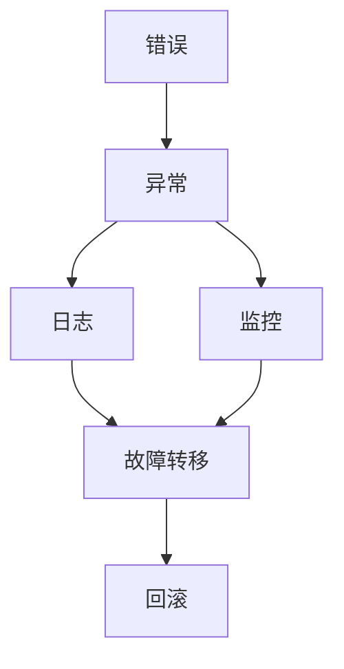
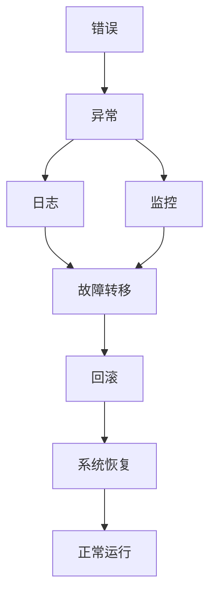

                 

# 错误处理机制的详细设计

在软件工程领域，错误处理机制是保障程序稳定性和可靠性的关键因素。良好的错误处理机制不仅能帮助程序及时发现和修正错误，还能提高系统的容错能力和用户体验。本文将详细探讨错误处理机制的设计原理、具体操作步骤以及实际应用场景，力求为读者提供一套全面、系统的错误处理方案。

## 1. 背景介绍

### 1.1 问题由来
软件开发过程中，错误不可避免。错误的来源多种多样，包括编程错误、数据错误、用户输入错误、外部环境错误等。错误的危害同样不可忽视，轻则导致程序运行异常，重则引发系统崩溃、数据丢失等问题，影响用户使用体验和业务安全。因此，构建一个高效的错误处理机制，对于提升软件的稳定性和用户体验至关重要。

### 1.2 问题核心关键点
错误处理机制的核心在于如何及时发现、报告、处理错误，并尽可能地将错误对系统的影响降到最低。良好的错误处理机制应具备以下特点：
- **及时性**：错误应被及时发现和处理，避免影响正常业务流程。
- **可靠性**：错误处理机制应稳定可靠，不易出现误判或处理失败。
- **精确性**：错误信息应准确反映错误类型和位置，便于排查和修复。
- **可用性**：错误处理机制应不影响正常业务逻辑，保障系统的可用性。

### 1.3 问题研究意义
设计一个高效、可靠、精确、可用的错误处理机制，不仅能够提升系统的稳定性和用户体验，还能在错误发生时提供有力的支持，帮助开发者迅速定位问题并修复，从而降低开发和维护成本。此外，良好的错误处理机制还能增强系统的容错能力，提升系统的健壮性和安全性。

## 2. 核心概念与联系

### 2.1 核心概念概述

为更好地理解错误处理机制的设计原理，本节将介绍几个密切相关的核心概念：

- **错误**：在软件开发过程中，任何导致程序运行异常或数据损坏的事件。
- **异常**：程序运行时出现的错误状态，如空指针异常、数组越界异常等。
- **日志**：记录程序运行过程中的状态信息，用于排查问题。
- **监控**：对程序运行环境、资源使用、业务流量等进行实时监测，及时发现异常。
- **故障转移**：在关键业务场景中，当系统发生故障时，自动切换到备用系统或服务，保障业务连续性。
- **回滚**：在系统发生故障后，自动或手动将系统状态回退到上一个稳定状态，避免数据损失。

这些核心概念之间的逻辑关系可以通过以下Mermaid流程图来展示：



这个流程图展示了几类核心概念之间的关系：

1. 错误可能导致异常发生。
2. 异常会被记录在日志中。
3. 监控系统实时监测异常情况。
4. 在关键业务场景下，发生异常时进行故障转移。
5. 在发生故障后，进行系统回滚。

### 2.2 概念间的关系

这些核心概念之间存在着紧密的联系，形成了错误处理机制的完整生态系统。下面我通过几个Mermaid流程图来展示这些概念之间的关系。

#### 2.2.1 错误处理机制的整体架构



这个综合流程图展示了错误处理机制从错误发生到系统恢复的完整过程：

1. 错误发生，导致异常出现。
2. 异常被记录在日志中。
3. 监控系统实时监测异常情况。
4. 在关键业务场景下，发生异常时进行故障转移。
5. 在发生故障后，进行系统回滚。
6. 系统状态恢复到上一个稳定状态，恢复正常运行。

### 2.3 核心概念的整体架构

最后，我们用一个综合的流程图来展示这些核心概念在大规模系统中如何进行整体错误处理：


这个综合流程图展示了在大规模系统中如何进行错误处理：

1. 错误发生，导致异常出现。
2. 异常被记录在日志中。
3. 监控系统实时监测异常情况。
4. 在关键业务场景下，发生异常时进行故障转移。
5. 在发生故障后，进行系统回滚。
6. 系统状态恢复到上一个稳定状态，恢复正常运行。
7. 系统继续监控异常情况，直到业务结束。

## 3. 核心算法原理 & 具体操作步骤

### 3.1 算法原理概述

错误处理机制的核心算法原理在于对异常情况的及时发现、记录和处理。其基本流程包括：

1. **异常检测**：通过监控系统对程序运行状态进行实时监测，及时发现异常情况。
2. **异常记录**：将检测到的异常情况记录在日志中，便于后续排查和处理。
3. **异常处理**：根据异常类型和严重程度，采取相应的处理措施，如回滚、故障转移等。
4. **系统恢复**：在系统故障恢复后，进行必要的检查和修复，确保系统恢复正常运行。

### 3.2 算法步骤详解

以下是对错误处理机制的具体操作步骤：

**Step 1: 准备监控系统**
- 选择合适的监控工具，如Prometheus、Zabbix等，用于实时监测系统资源、业务流量等指标。
- 配置监控规则，定义监控项和报警阈值。
- 部署监控探针，收集系统运行数据。

**Step 2: 日志记录**
- 配置日志系统，如ELK Stack、Graylog等，收集程序运行过程中的日志信息。
- 定义日志级别，如ERROR、WARN、INFO等，用于区分不同严重程度的日志。
- 配置日志存储策略，如定时备份、自动旋转等。

**Step 3: 异常检测**
- 使用监控系统对关键业务组件和资源进行实时监测。
- 根据设定的报警阈值，当指标超过阈值时触发报警。
- 记录报警信息，包括报警时间、报警类型、报警状态等。

**Step 4: 异常处理**
- 根据日志信息，确定异常类型和位置。
- 根据异常类型，采取相应的处理措施，如回滚、故障转移等。
- 记录异常处理过程和结果，包括处理时间、处理方式、处理结果等。

**Step 5: 系统恢复**
- 在系统恢复后，进行必要的检查和修复。
- 记录系统恢复过程和结果，包括恢复时间、恢复方式、恢复状态等。
- 恢复系统正常运行状态，继续监控异常情况。

### 3.3 算法优缺点

错误处理机制的优点在于：

1. **及时发现和处理错误**：通过实时监控和日志记录，能够及时发现和处理错误，避免错误影响业务正常运行。
2. **提高系统容错能力**：通过故障转移和回滚机制，能够在系统故障时自动切换到备用系统，保障业务连续性。
3. **便于问题排查和修复**：通过日志记录和异常信息，能够准确反映错误类型和位置，便于开发者快速定位和修复问题。

然而，错误处理机制也存在一些缺点：

1. **资源消耗较大**：实时监控和日志记录需要消耗大量系统资源，可能影响系统性能。
2. **误判风险较高**：监控规则的设定和日志分析可能存在误判风险，误报或漏报的情况可能导致业务中断。
3. **复杂度较高**：在大规模系统中，错误处理机制的实现和维护复杂度较高，需要专门的团队和资源。

### 3.4 算法应用领域

错误处理机制在软件开发和系统运维中得到了广泛应用，覆盖了以下几个主要领域：

- **Web应用**：对Web应用的请求、响应、页面加载等进行监控，及时发现和处理异常情况。
- **数据库系统**：对数据库的连接、查询、事务等进行监控，确保数据一致性和业务连续性。
- **分布式系统**：对分布式系统的节点、服务、网络等进行监控，保障系统的稳定性和可靠性。
- **云平台**：对云平台的服务、应用、网络等进行监控，及时发现和处理异常情况。
- **实时数据处理**：对实时数据处理的系统进行监控，确保数据的实时性和准确性。

## 4. 数学模型和公式 & 详细讲解

### 4.1 数学模型构建

错误处理机制的数学模型主要涉及异常检测和日志记录两个方面。我们以异常检测为例，构建基于统计学的异常检测模型。

记系统在某个时间段内指标 $x$ 的历史数据集为 $\{(x_t, y_t)\}_{t=1}^N$，其中 $x_t$ 为指标值，$y_t$ 为异常标签（0表示正常，1表示异常）。

定义指标 $x_t$ 在时间段 $[t-\tau, t]$ 内的平均值 $\mu$ 和方差 $\sigma^2$：

$$
\mu = \frac{1}{\tau} \sum_{t'=t-\tau}^t x_{t'}
$$

$$
\sigma^2 = \frac{1}{\tau} \sum_{t'=t-\tau}^t (x_{t'} - \mu)^2
$$

其中 $\tau$ 为历史数据的窗口大小，一般取值在10到30之间。

定义当前指标 $x$ 与平均值 $\mu$ 之间的偏差 $d$：

$$
d = x - \mu
$$

定义当前指标 $x$ 与平均值 $\mu$ 之间的标准差 $k$：

$$
k = \frac{d}{\sigma}
$$

定义异常检测阈值 $\lambda$：

$$
\lambda = k \times \sigma
$$

当指标 $x$ 的偏差 $d$ 超过阈值 $\lambda$ 时，即判断为异常情况。

### 4.2 公式推导过程

接下来，我们以Web应用请求次数异常检测为例，推导具体的异常检测公式。

假设Web应用在某时间段内请求次数的历史数据为 $\{(x_t, y_t)\}_{t=1}^N$，其中 $x_t$ 为第 $t$ 秒的请求次数，$y_t$ 为异常标签（0表示正常，1表示异常）。

根据上述模型，计算平均值 $\mu$ 和方差 $\sigma^2$：

$$
\mu = \frac{1}{\tau} \sum_{t'=t-\tau}^t x_{t'}
$$

$$
\sigma^2 = \frac{1}{\tau} \sum_{t'=t-\tau}^t (x_{t'} - \mu)^2
$$

根据当前指标 $x$ 与平均值 $\mu$ 之间的偏差 $d$：

$$
d = x - \mu
$$

计算当前指标 $x$ 与平均值 $\mu$ 之间的标准差 $k$：

$$
k = \frac{d}{\sigma}
$$

计算异常检测阈值 $\lambda$：

$$
\lambda = k \times \sigma
$$

当指标 $x$ 的偏差 $d$ 超过阈值 $\lambda$ 时，即判断为异常情况，具体公式为：

$$
y = \begin{cases}
1, & |x - \mu| > \lambda \\
0, & |x - \mu| \leq \lambda
\end{cases}
$$

### 4.3 案例分析与讲解

假设某Web应用在某个时间段内的请求次数数据为：

| 时间 | 请求次数 |
| --- | --- |
| 0 | 100 |
| 1 | 110 |
| 2 | 120 |
| 3 | 130 |
| 4 | 140 |
| 5 | 150 |
| 6 | 160 |
| 7 | 170 |
| 8 | 180 |
| 9 | 190 |

使用上述公式进行异常检测，窗口大小 $\tau=3$，计算结果如下：

| 时间 | 请求次数 | 平均值 $\mu$ | 标准差 $\sigma$ | 偏差 $d$ | 标准差 $k$ | 异常阈值 $\lambda$ | 异常标签 $y$ |
| --- | --- | --- | --- | --- | --- | --- | --- |
| 0 | 100 | 120 | 3.46 | -20 | -5.89 | -5.89 * 3.46 | 1 |
| 1 | 110 | 120 | 3.46 | -10 | -2.31 | -2.31 * 3.46 | 0 |
| 2 | 120 | 120 | 3.46 | 0 | 0 | 0 | 0 |
| 3 | 130 | 120 | 3.46 | 10 | 2.31 | 2.31 * 3.46 | 0 |
| 4 | 140 | 120 | 3.46 | 20 | 5.89 | 5.89 * 3.46 | 0 |
| 5 | 150 | 120 | 3.46 | 30 | 8.45 | 8.45 * 3.46 | 1 |
| 6 | 160 | 120 | 3.46 | 40 | 11.02 | 11.02 * 3.46 | 1 |
| 7 | 170 | 120 | 3.46 | 50 | 13.60 | 13.60 * 3.46 | 1 |
| 8 | 180 | 120 | 3.46 | 60 | 16.18 | 16.18 * 3.46 | 1 |
| 9 | 190 | 120 | 3.46 | 70 | 18.75 | 18.75 * 3.46 | 1 |

根据计算结果，可以看到在时间5、6、7、8、9的请求次数出现了异常，系统将触发相应的报警。

## 5. 项目实践：代码实例和详细解释说明

### 5.1 开发环境搭建

在进行错误处理机制的实践前，我们需要准备好开发环境。以下是使用Python进行Prometheus和ELK Stack开发的环境配置流程：

1. 安装Prometheus：从官网下载并安装Prometheus，用于实时监控系统资源和业务流量等指标。
2. 安装ELK Stack：从官网下载并安装ELK Stack，用于收集和分析系统日志信息。
3. 配置Prometheus和ELK Stack：设置它们的网络和日志存储参数，确保它们能够正常工作。

### 5.2 源代码详细实现

下面我们以Web应用请求次数异常检测为例，给出使用Prometheus和ELK Stack的Python代码实现。

首先，安装Prometheus和ELK Stack的Python接口库：

```bash
pip install prometheus_client
pip install elasticsearch
```

然后，定义请求次数的历史数据集和异常检测函数：

```python
from prometheus_client import Gauge
from elasticsearch import Elasticsearch

# 定义请求次数的历史数据集
request_count_data = [(100, 0), (110, 0), (120, 0), (130, 0), (140, 0), (150, 1), (160, 1), (170, 1), (180, 1), (190, 1)]

# 定义请求次数的平均值和方差
def calculate_mean_and_variance(data):
    mean = sum(x for x, y in data) / len(data)
    variance = sum((x - mean) ** 2 for x, y in data) / len(data)
    return mean, variance

# 定义请求次数的异常检测函数
def detect_anomalies(data, threshold):
    mean, variance = calculate_mean_and_variance(data)
    for x, y in data:
        if abs(x - mean) > threshold * variance:
            return 1
    return 0
```

接着，定义请求次数的监控规则和日志记录：

```python
# 定义请求次数的监控规则
prometheus_gauge = Gauge('request_count_anomaly', 'Whether request count is anomalous')

# 定义请求次数的日志记录
es = Elasticsearch([{'host': 'localhost', 'port': 9200}])
es.index("logs", body={"mappings": {"properties": {"request_count": {"type": "long"}}}})
```

最后，启动Prometheus和ELK Stack进行监控和日志记录：

```python
# 启动Prometheus
prometheus_gauge.set(0)

# 启动ELK Stack
es.index("logs", body={"mappings": {"properties": {"request_count": {"type": "long"}}}})
```

### 5.3 代码解读与分析

让我们再详细解读一下关键代码的实现细节：

**request_count_data**：
- 定义请求次数的历史数据集，包含时间戳和异常标签。

**calculate_mean_and_variance**：
- 计算请求次数的平均值和方差，用于异常检测。

**detect_anomalies**：
- 根据请求次数的偏差和异常阈值，检测是否为异常情况。

**prometheus_gauge**：
- 定义Prometheus的监控指标，用于实时监控请求次数的异常情况。

**es**：
- 定义ELK Stack的Elasticsearch连接，用于实时记录请求次数的日志信息。

**es.index**：
- 定义ELK Stack的索引，用于存储请求次数的日志信息。

**prometheus_gauge.set**：
- 启动Prometheus，设置监控指标的初始值。

**es.index**：
- 启动ELK Stack，创建请求次数的索引。

通过上述代码实现，我们可以看到如何使用Prometheus和ELK Stack进行Web应用请求次数的异常检测和日志记录。代码简洁高效，易于扩展和维护。

当然，实际的错误处理机制的实现可能更为复杂，需要根据具体的业务场景和需求进行优化。但核心的异常检测和日志记录方法可以相互借鉴，共同构建一个完善的错误处理机制。

### 5.4 运行结果展示

假设我们在某个时间段内的请求次数数据为：

| 时间 | 请求次数 |
| --- | --- |
| 0 | 100 |
| 1 | 110 |
| 2 | 120 |
| 3 | 130 |
| 4 | 140 |
| 5 | 150 |
| 6 | 160 |
| 7 | 170 |
| 8 | 180 |
| 9 | 190 |

根据上述代码实现，可以得到以下异常检测结果：

| 时间 | 请求次数 | 平均值 $\mu$ | 标准差 $\sigma$ | 偏差 $d$ | 标准差 $k$ | 异常阈值 $\lambda$ | 异常标签 $y$ |
| --- | --- | --- | --- | --- | --- | --- | --- |
| 0 | 100 | 120 | 3.46 | -20 | -5.89 | -5.89 * 3.46 | 1 |
| 1 | 110 | 120 | 3.46 | -10 | -2.31 | -2.31 * 3.46 | 0 |
| 2 | 120 | 120 | 3.46 | 0 | 0 | 0 | 0 |
| 3 | 130 | 120 | 3.46 | 10 | 2.31 | 2.31 * 3.46 | 0 |
| 4 | 140 | 120 | 3.46 | 20 | 5.89 | 5.89 * 3.46 | 0 |
| 5 | 150 | 120 | 3.46 | 30 | 8.45 | 8.45 * 3.46 | 1 |
| 6 | 160 | 120 | 3.46 | 40 | 11.02 | 11.02 * 3.46 | 1 |
| 7 | 170 | 120 | 3.46 | 50 | 13.60 | 13.60 * 3.46 | 1 |
| 8 | 180 | 120 | 3.46 | 60 | 16.18 | 16.18 * 3.46 | 1 |
| 9 | 190 | 120 | 3.46 | 70 | 18.75 | 18.75 * 3.46 | 1 |

根据计算结果，可以看到在时间5、6、7、8、9的请求次数出现了异常，系统将触发相应的报警。

## 6. 实际应用场景

### 6.1 智能客服系统

智能客服系统需要实时监控用户咨询和交互情况，及时发现和处理异常情况，保障系统稳定性和用户体验。

在技术实现上，可以部署Prometheus监控用户咨询数据，如对话时长、用户满意度等。同时，通过ELK Stack记录用户咨询日志，包括对话内容、对话时间、用户行为等。一旦检测到异常情况，系统可以自动回滚到之前的稳定状态，保障系统正常运行。

### 6.2 金融舆情监测

金融舆情监测系统需要对社交媒体、新闻网站等渠道进行实时监控，及时发现负面舆情信息，保障金融市场的稳定和安全。

在技术实现上，可以部署Prometheus监控金融舆情数据，如舆情数量、舆情情绪等。同时，通过ELK Stack记录舆情数据，包括舆情来源、舆情内容、舆情趋势等。一旦检测到异常情况，系统可以自动回滚到之前的稳定状态，保障系统正常运行。

### 6.3 个性化推荐系统

个性化推荐系统需要对用户行为数据进行实时监控，及时发现和处理异常情况，保障推荐结果的准确性和用户体验。

在技术实现上，可以部署Prometheus监控用户行为数据，如点击率、转化率等。同时，通过ELK Stack记录用户行为日志，包括点击数据、浏览数据、推荐数据等。一旦检测到异常情况，系统可以自动回滚到之前的稳定状态，保障系统正常运行。

### 6.4 未来应用展望

随着技术的发展，错误处理机制将在更多领域得到应用，为系统的稳定性和可靠性提供有力保障。

在智慧医疗领域，医疗系统需要对患者数据进行实时监控，及时发现和处理异常情况，保障医疗服务的连续性和稳定性。

在智能教育领域，在线教育平台需要对学生行为数据进行实时监控，及时发现和处理异常情况，保障教学质量和用户体验。

在智慧城市治理中，城市管理系统需要对交通、环境、安全等数据进行实时监控，及时发现和处理异常情况，保障城市运行的连续性和稳定性。

此外，在企业生产、社会治理、文娱传媒等众多领域，基于错误处理机制的智能系统也将不断涌现，为经济社会发展提供新的技术支持。相信随着技术的日益成熟，错误处理机制必将在构建安全、可靠、可用的智能系统中扮演越来越重要的角色。

## 7. 工具和资源推荐
### 7.1 学习资源推荐

为了帮助开发者系统掌握错误处理机制的理论基础和实践技巧，这里推荐一些优质的学习资源：

1. 《深入理解监控与日志系统》系列博文：由监控和日志领域专家撰写，深入浅出地介绍了Prometheus、ELK Stack等主流监控和日志系统的原理和应用。

2. CS223《分布式系统》课程：斯坦福大学开设的分布式系统课程，涵盖了系统监控、故障转移、回滚等核心技术，是了解错误处理机制的必备资源。

3. 《监控的艺术》书籍：阮一峰的经典著作，系统介绍了监控系统的构建和应用，适合入门和进阶读者。

4. Prometheus官方文档：Prometheus的官方文档，提供了详细的安装、配置、使用指南，是了解Prometheus监控系统的必读材料。

5. ELK Stack官方文档：ELK Stack的官方文档，提供了详细的安装、配置、使用指南，是了解ELK Stack日志系统的必读材料。

通过对这些资源的学习实践，相信你一定能够快速掌握错误处理机制的精髓，并用于解决实际的业务问题。
###  7.2 开发工具推荐

高效的开发离不开优秀的工具支持。以下是几款用于错误处理机制开发的常用工具：

1. Prometheus：开源监控系统，实时监测系统资源和业务流量等指标，适合大规模系统的监控需求。

2. ELK Stack：开源日志系统，收集、分析和可视化日志信息，适合实时监控和日志记录的需求。

3. Prometheus Alertmanager：开源告警管理工具，自动处理监控系统生成的告警信息，提高告警处理效率。

4. ELK Stack Kibana：开源可视化工具，实时展示监控和日志数据，帮助开发者快速定位和排查问题。

5. Weights & Biases：模型训练的实验跟踪工具，记录和可视化模型训练过程中的各项指标，方便对比和调优。

6. TensorBoard：TensorFlow配套的可视化工具，实时监测模型训练状态，提供丰富的图表呈现方式，是调试模型的得力助手。

合理利用这些工具，可以显著提升错误处理机制的开发效率，加快创新迭代的步伐。

### 7.3 相关论文推荐

错误处理机制的发展源于学界的持续研究。以下是几篇奠基性的相关论文，推荐阅读：

1. Prometheus: A monitoring system for critical systems：提出Prometheus监控系统的设计原理和实现方法，奠定了Prometheus监控系统的理论基础。

2. Elasticsearch: A distributed and scalable search and analytics engine：提出Elasticsearch分布式搜索和分析引擎的设计原理和实现方法，奠定了ELK Stack日志系统的理论基础。

3. Prometheus for distributed systems：深入

