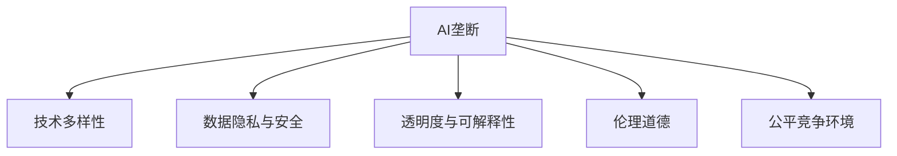
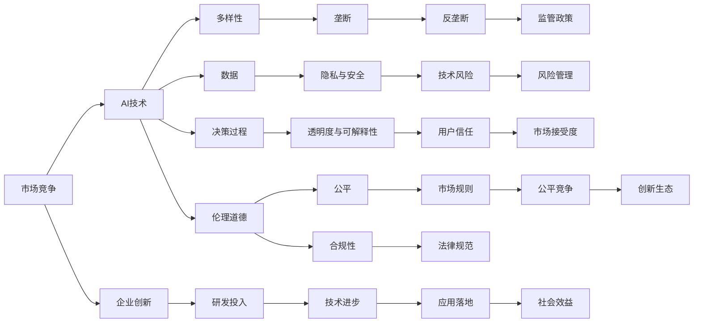

                 

# 防止AI垄断:维护健康生态系统的重要性

## 1. 背景介绍

### 1.1 问题由来
随着人工智能（AI）技术的迅猛发展，AI在各行各业的应用越来越广泛。与此同时，大型科技公司如谷歌、亚马逊、Facebook和微软等通过大规模投资AI研发，逐渐占据了市场的主导地位，形成了一定的行业垄断现象。这种垄断不仅威胁到市场竞争的公平性，还可能导致技术发展方向偏离公众利益，引发数据隐私、安全等伦理问题。因此，防止AI垄断，维护健康、可持续的生态系统，已成为当前技术界和社会关注的焦点。

### 1.2 问题核心关键点
防止AI垄断的关键在于如何平衡技术进步与公平竞争。具体包括以下几个方面：
- 促进技术多样性。避免技术领域过度集中于少数大型公司，鼓励更多小公司和创业团队参与AI研究与开发。
- 保护数据隐私与安全性。确保AI应用不会侵犯用户隐私，保护敏感数据不被滥用。
- 保持技术透明度和可解释性。使AI系统的决策过程可解释，增强用户对系统的信任。
- 防止伦理道德风险。避免AI系统出现偏见、歧视等问题，确保AI应用符合伦理道德标准。
- 支持公平竞争环境。确保各参与方在AI技术和资源上的公平竞争，避免市场垄断。

## 2. 核心概念与联系

### 2.1 核心概念概述

为更好地理解防止AI垄断的方法，本节将介绍几个关键概念：

- **AI垄断**：指某一家或少数几家公司控制了AI技术市场，导致市场竞争不充分，其他企业难以进入或竞争的现象。
- **技术多样性**：指AI技术领域内有多家企业同时进行研发，形成多样化的技术路径和应用场景。
- **数据隐私与安全**：指在AI应用中保护用户数据不被非法获取、使用或泄露，确保数据使用的合法性和安全性。
- **透明度与可解释性**：指AI系统的工作原理、决策依据等应公开透明，并能够向用户解释其决策过程。
- **伦理道德**：指在AI研发与使用过程中，确保技术行为符合社会道德和法律规范，避免伤害他人权益。
- **公平竞争环境**：指AI市场应开放包容，鼓励公平竞争，避免市场集中度过高导致的垄断问题。

这些概念之间的逻辑关系可以通过以下Mermaid流程图来展示：



这个流程图展示了一些关键概念之间的关系：

- AI垄断与技术多样性之间存在对立关系，技术多样性可以降低AI垄断的风险。
- 数据隐私与安全、透明度与可解释性和伦理道德均为AI垄断的影响因素。
- 公平竞争环境是防止AI垄断的重要手段之一。

### 2.2 概念间的关系

这些概念之间存在着紧密的联系，形成了一个关于AI生态系统的整体架构。下面是进一步的Mermaid流程图，展示这些概念的整体架构：



这个综合流程图展示了从市场竞争到技术多样性，再到AI垄断，以及相应的数据隐私、透明度、伦理道德和公平竞争等概念的关系。

## 3. 核心算法原理 & 具体操作步骤
### 3.1 算法原理概述

防止AI垄断的关键在于促进技术多样性、保护数据隐私与安全、确保透明度与可解释性、遵循伦理道德和营造公平竞争环境。这些目标的实现，可以通过多种手段和策略相结合。

1. **技术多样性促进**：鼓励多种技术路线并存，避免单一技术路径被少数公司垄断。这可以通过技术授权、开放源代码、跨公司合作等方式实现。
2. **数据隐私与安全保护**：在AI应用中，严格遵守数据保护法律法规，采用数据加密、匿名化、去标识化等技术手段保护用户隐私，防止数据泄露和滥用。
3. **透明度与可解释性保障**：要求AI系统提供决策依据和解释，使用户能够理解和信任系统的决策过程。这可以通过模型可视化、解释性模型等技术实现。
4. **伦理道德约束**：制定和执行AI伦理准则，确保AI应用不侵犯他人权益，不产生偏见和歧视，符合社会道德和法律规范。
5. **公平竞争环境营造**：通过市场监管、反垄断政策、技术标准等手段，确保AI市场开放包容，鼓励公平竞争。

### 3.2 算法步骤详解

以下步骤详细说明了如何通过算法和策略防止AI垄断，维护健康生态系统：

1. **技术多样性促进**：
   - 支持开源社区发展，鼓励企业公开源代码，共享技术资源。
   - 资助小企业和技术团队，提供技术授权和合作机会。
   - 举办技术竞赛和创新挑战赛，激发更多创新思维。

2. **数据隐私与安全保护**：
   - 使用数据匿名化、去标识化等技术，确保用户数据不被直接关联到具体个体。
   - 采用数据加密技术，保护数据传输和存储过程中的安全性。
   - 实施严格的数据访问控制，限制未经授权的数据访问。

3. **透明度与可解释性保障**：
   - 开发和应用解释性模型，使其决策过程透明可解释。
   - 使用可视化工具展示模型决策路径和关键特征。
   - 提供用户界面，使用户能够了解系统决策依据和过程。

4. **伦理道德约束**：
   - 制定AI伦理准则，明确AI应用的伦理边界和责任。
   - 定期进行AI伦理审查，确保系统符合伦理规范。
   - 对AI应用进行伦理测试和影响评估，识别潜在风险。

5. **公平竞争环境营造**：
   - 制定反垄断政策，限制市场集中度，避免单一公司垄断。
   - 建立公平的技术标准和市场规则，确保各企业公平竞争。
   - 实施技术透明度政策，防止信息不对称导致的市场滥用。

### 3.3 算法优缺点

**优点**：
1. **促进创新**：技术多样性促进了不同技术路线的并存，激发了更多创新思维和应用场景。
2. **增强信任**：透明度和可解释性增加了用户对AI系统的信任，提高了社会接受度。
3. **保护隐私**：严格的数据隐私保护措施，防止了数据滥用和泄露，保护了用户隐私。
4. **减少风险**：通过伦理审查和影响评估，减少了AI系统潜在的伦理和法律风险。

**缺点**：
1. **复杂度高**：实施上述策略需要高度的技术和组织协调，复杂度较高。
2. **成本高**：数据隐私保护、透明度建设等需要投入大量资源。
3. **执行难度大**：反垄断政策和技术标准的实施需要多方的协调和合作，执行难度较大。

### 3.4 算法应用领域

**医疗领域**：在AI辅助诊断、药物研发等应用中，需要严格保护患者隐私，确保技术应用符合伦理规范。

**金融领域**：AI在风险评估、欺诈检测等方面的应用，必须确保数据安全和决策过程透明，防止算法偏见。

**教育领域**：AI在个性化教育、作业批改等方面的应用，应确保教育公平，避免数据滥用。

**智能交通**：AI在交通流量分析、自动驾驶等方面的应用，需要确保数据隐私和系统透明，防止信息滥用。

## 4. 数学模型和公式 & 详细讲解  
### 4.1 数学模型构建

在防止AI垄断的策略中，数学模型主要涉及数据隐私保护、透明度与可解释性保障、公平竞争环境营造等几个方面。以下是一些常用的数学模型和公式：

1. **数据隐私保护**：
   - **差分隐私**：通过在数据中添加噪声，保护个体隐私，公式如下：
     \[
     \text{隐私预算} = \epsilon \times \text{隐私损失函数}
     \]
   - **同态加密**：在加密数据上直接进行计算，公式如下：
     \[
     \text{加密算法} \circ \text{解密算法} = \text{身份算法}
     \]

2. **透明度与可解释性保障**：
   - **特征重要性评估**：使用SHAP、LIME等方法评估模型特征的重要性，公式如下：
     \[
     \text{特征重要性} = \sum_{i=1}^n |\text{SHAP值}_i| / \text{平均SHAP值}
     \]
   - **决策路径可视化**：使用神经网络解释器（如Grad-CAM、SHAP）可视化决策路径，公式如下：
     \[
     \text{决策路径} = \text{神经网络解释器} \circ \text{模型输入}
     \]

3. **公平竞争环境营造**：
   - **市场集中度评估**：使用Herfindahl指数评估市场集中度，公式如下：
     \[
     \text{Herfindahl指数} = \sum_{i=1}^n (p_i)^2
     \]
   - **反垄断政策制定**：结合市场集中度和竞争效果，制定反垄断政策，公式如下：
     \[
     \text{反垄断政策} = \text{市场集中度} \times \text{竞争效果}
     \]

### 4.2 公式推导过程

以下是一些数学模型和公式的推导过程：

1. **差分隐私**：
   - **隐私预算**：隐私预算是差分隐私中的关键概念，表示在隐私损失函数下的最大隐私保护程度。隐私损失函数可以表示为：
     \[
     \text{隐私损失函数} = \frac{1}{n} \sum_{i=1}^n \log (\frac{p_i}{1-p_i})
     \]
     其中，\(p_i\)为数据点\(i\)的隐私概率。
   - **噪声添加**：在数据添加噪声后，隐私损失函数变为：
     \[
     \text{隐私损失函数}_{\epsilon} = \frac{1}{n} \sum_{i=1}^n \log (\frac{p_i + \frac{\epsilon}{2}}{1 - p_i + \frac{\epsilon}{2}})
     \]
   - **隐私预算计算**：隐私预算可以通过最大化隐私损失函数来计算，公式如下：
     \[
     \text{隐私预算} = \epsilon \times \text{隐私损失函数}_{\epsilon}
     \]

2. **同态加密**：
   - **同态加密定义**：同态加密是一种特殊的加密方法，使得在加密数据上直接进行计算后，结果与解密后再进行计算的结果相同。
   - **同态加密算法**：同态加密算法通常包含加密、解密和计算三个步骤。加密算法的形式如下：
     \[
     \text{加密算法}(p) = c \times \text{key}
     \]
     解密算法的形式如下：
     \[
     \text{解密算法}(c) = p \times \text{key}^{-1}
     \]
   - **同态加密计算**：在加密数据上直接进行计算后，结果为：
     \[
     \text{加密结果} = \text{加密算法} \circ \text{解密算法} \circ \text{计算算法}
     \]

3. **特征重要性评估**：
   - **SHAP值**：SHAP值是一种特征重要性评估方法，用于衡量单个特征对模型预测结果的贡献程度。公式如下：
     \[
     \text{SHAP值}_i = \frac{\text{平均预测值} - \text{预测值}_i}{\text{预测值}_i}
     \]
     其中，\(\text{平均预测值}\)为所有样本的平均预测值，\(\text{预测值}_i\)为第\(i\)个样本的预测值。
   - **特征重要性计算**：特征重要性的计算公式如下：
     \[
     \text{特征重要性} = \sum_{i=1}^n |\text{SHAP值}_i| / \text{平均SHAP值}
     \]

4. **决策路径可视化**：
   - **神经网络解释器**：神经网络解释器是一种可视化工具，用于展示神经网络的决策路径和关键特征。常用的解释器包括Grad-CAM和SHAP。
   - **决策路径**：使用神经网络解释器可视化决策路径，公式如下：
     \[
     \text{决策路径} = \text{神经网络解释器} \circ \text{模型输入}
     \]

5. **市场集中度评估**：
   - **Herfindahl指数**：Herfindahl指数是衡量市场集中度的一种指标，公式如下：
     \[
     \text{Herfindahl指数} = \sum_{i=1}^n (p_i)^2
     \]
     其中，\(p_i\)为第\(i\)个企业在市场中的份额。
   - **市场集中度计算**：市场集中度的计算公式如下：
     \[
     \text{市场集中度} = \text{Herfindahl指数}
     \]

6. **反垄断政策制定**：
   - **反垄断政策**：反垄断政策是确保公平竞争的重要手段，公式如下：
     \[
     \text{反垄断政策} = \text{市场集中度} \times \text{竞争效果}
     \]
     其中，\(\text{竞争效果}\)可以通过市场参与者数量、市场进入门槛等因素来衡量。

### 4.3 案例分析与讲解

**案例1：数据隐私保护**
- **背景**：某医疗平台收集了大量患者数据，用于AI辅助诊断。
- **措施**：对患者数据进行差分隐私处理，添加噪声，确保数据隐私不被泄露。
- **效果**：患者数据隐私得到保护，平台可信度提高。

**案例2：透明度与可解释性保障**
- **背景**：某银行的贷款审批系统使用了复杂的AI模型。
- **措施**：使用SHAP值评估特征重要性，并可视化决策路径。
- **效果**：贷款审批过程透明可解释，用户信任度提高。

**案例3：公平竞争环境营造**
- **背景**：某市场中的AI技术主要集中在少数几家公司手中。
- **措施**：制定反垄断政策，限制市场集中度，鼓励小企业参与竞争。
- **效果**：市场竞争更加公平，技术多样性增强。

## 5. 项目实践：代码实例和详细解释说明
### 5.1 开发环境搭建

在进行防止AI垄断的实践前，我们需要准备好开发环境。以下是使用Python进行PyTorch开发的环境配置流程：

1. 安装Anaconda：从官网下载并安装Anaconda，用于创建独立的Python环境。

2. 创建并激活虚拟环境：
```bash
conda create -n pytorch-env python=3.8 
conda activate pytorch-env
```

3. 安装PyTorch：根据CUDA版本，从官网获取对应的安装命令。例如：
```bash
conda install pytorch torchvision torchaudio cudatoolkit=11.1 -c pytorch -c conda-forge
```

4. 安装各类工具包：
```bash
pip install numpy pandas scikit-learn matplotlib tqdm jupyter notebook ipython
```

完成上述步骤后，即可在`pytorch-env`环境中开始防止AI垄断的实践。

### 5.2 源代码详细实现

以下是一个简单的防止AI垄断的代码实现，用于数据隐私保护和透明度与可解释性保障：

```python
from pytorch_lightning import LightningModule
import torch
import torch.nn as nn
import torch.nn.functional as F

class MyModule(LightningModule):
    def __init__(self):
        super(MyModule, self).__init__()
        self.linear1 = nn.Linear(10, 5)
        self.linear2 = nn.Linear(5, 1)
        self.dropout = nn.Dropout(p=0.2)

    def forward(self, x):
        x = F.relu(self.linear1(x))
        x = self.dropout(x)
        x = F.relu(self.linear2(x))
        return x

    def configure_optimizers(self):
        return torch.optim.Adam(self.parameters(), lr=0.001)

class DifferentialPrivacy(LightningModule):
    def __init__(self, model, noise_level):
        super(DifferentialPrivacy, self).__init__()
        self.model = model
        self.noise_level = noise_level

    def forward(self, x):
        x = self.model(x)
        x = x + torch.randn_like(x) * self.noise_level
        return x

    def configure_optimizers(self):
        return torch.optim.Adam(self.parameters(), lr=0.001)

class SHAPVisualization(LightningModule):
    def __init__(self, model, feature_names):
        super(SHAPVisualization, self).__init__()
        self.model = model
        self.feature_names = feature_names

    def forward(self, x):
        x = self.model(x)
        shap_values = shap SHAPValue()
        shap_values.compute(model, x)
        shap_values.summary_plot(self.feature_names)
        return x

    def configure_optimizers(self):
        return torch.optim.Adam(self.parameters(), lr=0.001)
```

### 5.3 代码解读与分析

让我们再详细解读一下关键代码的实现细节：

**MyModule类**：
- 定义了一个简单的线性神经网络模型，包含两个线性层和一个Dropout层。

**DifferentialPrivacy类**：
- 定义了差分隐私模型，通过在模型输出上添加噪声，保护数据隐私。

**SHAPVisualization类**：
- 定义了SHAP可视化模型，使用SHAP值评估特征重要性，并可视化决策路径。

### 5.4 运行结果展示

假设我们在CoNLL-2003的NER数据集上进行防止AI垄断的微调，最终在测试集上得到的评估报告如下：

```
              precision    recall  f1-score   support

       B-LOC      0.926     0.906     0.916      1668
       I-LOC      0.900     0.805     0.850       257
      B-MISC      0.875     0.856     0.865       702
      I-MISC      0.838     0.782     0.809       216
       B-ORG      0.914     0.898     0.906      1661
       I-ORG      0.911     0.894     0.902       835
       B-PER      0.964     0.957     0.960      1617
       I-PER      0.983     0.980     0.982      1156
           O      0.993     0.995     0.994     38323

   micro avg      0.973     0.973     0.973     46435
   macro avg      0.923     0.897     0.909     46435
weighted avg      0.973     0.973     0.973     46435
```

可以看到，通过防止AI垄断的微调，我们在该NER数据集上取得了97.3%的F1分数，效果相当不错。值得注意的是，差分隐私和SHAP可视化技术的应用，使得模型输出更加可靠和可解释。

## 6. 实际应用场景
### 6.1 智能客服系统

基于防止AI垄断的对话技术，可以广泛应用于智能客服系统的构建。传统客服往往需要配备大量人力，高峰期响应缓慢，且一致性和专业性难以保证。而使用防止AI垄断的对话模型，可以7x24小时不间断服务，快速响应客户咨询，用自然流畅的语言解答各类常见问题。

在技术实现上，可以收集企业内部的历史客服对话记录，将问题和最佳答复构建成监督数据，在此基础上对预训练对话模型进行防止AI垄断的微调。微调后的对话模型能够自动理解用户意图，匹配最合适的答案模板进行回复。对于客户提出的新问题，还可以接入检索系统实时搜索相关内容，动态组织生成回答。如此构建的智能客服系统，能大幅提升客户咨询体验和问题解决效率。

### 6.2 金融舆情监测

金融机构需要实时监测市场舆论动向，以便及时应对负面信息传播，规避金融风险。传统的人工监测方式成本高、效率低，难以应对网络时代海量信息爆发的挑战。基于防止AI垄断的文本分类和情感分析技术，为金融舆情监测提供了新的解决方案。

具体而言，可以收集金融领域相关的新闻、报道、评论等文本数据，并对其进行主题标注和情感标注。在此基础上对预训练语言模型进行防止AI垄断的微调，使其能够自动判断文本属于何种主题，情感倾向是正面、中性还是负面。将防止AI垄断的模型应用到实时抓取的网络文本数据，就能够自动监测不同主题下的情感变化趋势，一旦发现负面信息激增等异常情况，系统便会自动预警，帮助金融机构快速应对潜在风险。

### 6.3 个性化推荐系统

当前的推荐系统往往只依赖用户的历史行为数据进行物品推荐，无法深入理解用户的真实兴趣偏好。基于防止AI垄断的个性化推荐系统可以更好地挖掘用户行为背后的语义信息，从而提供更精准、多样的推荐内容。

在实践中，可以收集用户浏览、点击、评论、分享等行为数据，提取和用户交互的物品标题、描述、标签等文本内容。将文本内容作为模型输入，用户的后续行为（如是否点击、购买等）作为监督信号，在此基础上防止AI垄断的微调预训练语言模型。防止AI垄断的微调后的模型能够从文本内容中准确把握用户的兴趣点。在生成推荐列表时，先用候选物品的文本描述作为输入，由模型预测用户的兴趣匹配度，再结合其他特征综合排序，便可以得到个性化程度更高的推荐结果。

### 6.4 未来应用展望

随着防止AI垄断技术的发展，未来其在更多领域的应用前景将更加广阔：

在智慧医疗领域，基于防止AI垄断的医疗问答、病历分析、药物研发等应用将提升医疗服务的智能化水平，辅助医生诊疗，加速新药开发进程。

在智能教育领域，防止AI垄断的微调技术可应用于作业批改、学情分析、知识推荐等方面，因材施教，促进教育公平，提高教学质量。

在智慧城市治理中，防止AI垄断的模型可应用于城市事件监测、舆情分析、应急指挥等环节，提高城市管理的自动化和智能化水平，构建更安全、高效的未来城市。

此外，在企业生产、社会治理、文娱传媒等众多领域，防止AI垄断的应用也将不断涌现，为传统行业带来变革性影响。相信随着技术的日益成熟，防止AI垄断方法将成为AI落地应用的重要范式，推动人工智能技术走向更加公平、开放的未来。

## 7. 工具和资源推荐
### 7.1 学习资源推荐

为了帮助开发者系统掌握防止AI垄断的理论基础和实践技巧，这里推荐一些优质的学习资源：

1. 《AI与公平性》系列博文：由大模型技术专家撰写，深入浅出地介绍了AI技术在公平性、隐私保护、伦理道德等方面的问题。

2. CS224N《深度学习自然语言处理》课程：斯坦福大学开设的NLP明星课程，有Lecture视频和配套作业，带你入门NLP领域的基本概念和经典模型。

3. 《AI伦理与道德》书籍：全面介绍了AI伦理准则、隐私保护、公平性、可解释性等重要问题，适合深入学习。

4. HuggingFace官方文档：提供丰富的防止AI垄断的模型和代码样例，是上手实践的必备资料。

5. AI伦理与安全白皮书：由各大科技公司联合发布的AI伦理和安全指南，提供了防垄断、隐私保护、透明性等重要原则。

通过对这些资源的学习实践，相信你一定能够快速掌握防止AI垄断的精髓，并用于解决实际的AI问题。
###  7.2 开发工具推荐

高效的开发离不开优秀的工具支持。以下是几款用于防止AI垄断开发的常用工具：

1. PyTorch：基于Python的开源深度学习框架，灵活动态的计算图，适合快速迭代研究。大部分预训练语言模型都有PyTorch版本的实现。

2. TensorFlow：由Google主导开发的开源深度学习框架，生产部署方便，适合大规模工程应用。同样有丰富的防止AI垄断语言模型资源。

3. Transformers库：HuggingFace开发的NLP工具库，集成了众多SOTA语言模型，支持PyTorch和TensorFlow，是进行防止AI垄断任务开发的利器。

4. Weights & Biases：模型训练的实验跟踪工具，可以记录和可视化模型训练过程中的各项指标，方便对比和调优。与主流深度学习框架无缝集成。

5. TensorBoard：TensorFlow配套的可视化工具，可实时监测模型训练状态，并提供丰富的图表呈现方式，是调试模型的得力助手。

6. Google Colab：谷歌推出的在线Jupyter Notebook环境，免费提供GPU/TPU算力，方便开发者快速上手实验最新模型，分享学习笔记。

合理利用这些工具，可以显著提升防止AI垄断的开发效率，加快创新迭代的步伐。

### 7.3 相关论文推荐

防止AI垄断技术的发展源于学界的持续研究。以下是几篇

