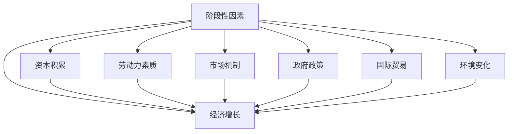

                 

## 1. 背景介绍

经济增长是人类社会发展的重要标志，直接关系到国家的繁荣富强和人民生活水平的提升。在宏观经济学中，影响经济增长的因素众多，包括技术进步、资本积累、劳动力素质、市场机制、政府政策、国际贸易、环境变化等等。阶段性因素作为特定时期内的关键变量，对经济增长的影响尤为显著。本文旨在深入探讨阶段性因素对经济增长的影响，以期为政府决策、企业战略制定和政策优化提供科学依据。

### 1.1 问题由来

过去几十年，世界各国经历了许多重要的阶段性事件，如科技革命、产业升级、金融危机、环境变化等，这些事件对经济增长产生了深远影响。例如，2008年全球金融危机导致了全球经济放缓，而数字化转型则推动了信息产业和新兴行业的快速增长。然而，不同阶段性因素对经济增长的影响机制复杂多样，且缺乏系统的分析和评估。

### 1.2 问题核心关键点

阶段性因素对经济增长的影响，可以从以下几个方面进行探讨：
1. 短期波动与长期趋势：某些阶段性因素如政策变化、自然灾害等可能在短期内对经济产生剧烈波动，但长期来看则可能被市场机制所消化。
2. 结构性影响：特定阶段性因素如科技革新、产业升级等可能引起经济结构的根本性变化，如促进新兴产业的发展和传统产业的转型。
3. 外部性：一些阶段性因素如国际贸易、环境保护等可能对国内经济产生正负双重外部性，影响整体经济增长。

## 2. 核心概念与联系

### 2.1 核心概念概述

为更好地理解阶段性因素对经济增长的影响，本节将介绍几个关键概念：

- **阶段性因素(Phasal Factors)**：指在某一特定时期内对经济增长产生重大影响的特定事件或趋势，如科技革命、产业升级、政策变动等。
- **经济增长(Economic Growth)**：指经济总量的增加，通常以国内生产总值(GDP)增长率衡量。
- **资本积累(Capital Accumulation)**：指通过投资增加的实物和金融资本，是推动经济增长的重要因素。
- **劳动力素质(Labor Quality)**：指劳动力的教育水平、技能和经验等，对生产效率和经济增长有重要影响。
- **市场机制(Market Mechanism)**：指市场在资源配置中的作用机制，包括价格、供需、竞争等。
- **政府政策(Government Policy)**：指政府通过财政、货币等手段对经济进行调控的政策措施。
- **国际贸易(International Trade)**：指国家间商品、服务、技术和资本的交流，对经济发展有重要影响。
- **环境变化(Environmental Changes)**：指自然环境和社会环境的变化，如气候变化、生态破坏等，对经济增长和资源配置产生深远影响。

这些概念之间的联系可以通过以下Mermaid流程图来展示：



这个流程图展示了阶段性因素与经济增长的整体联系：阶段性因素通过影响资本积累、劳动力素质、市场机制、政府政策、国际贸易和环境变化等关键因素，进而对经济增长产生重要影响。

### 2.2 概念间的关系

这些关键概念之间的关系如下：

- **资本积累**：通过投资和技术进步，增加实物和金融资本，推动经济增长。
- **劳动力素质**：提高劳动力的教育水平和技能，提高生产效率，促进经济增长。
- **市场机制**：通过价格机制、供需机制和竞争机制，优化资源配置，提高经济效率。
- **政府政策**：通过财政、货币等政策，调控经济活动，促进经济稳定和增长。
- **国际贸易**：通过国际市场的开放和贸易壁垒的降低，提高资源利用效率，推动经济增长。
- **环境变化**：通过资源和环境的保护，促进可持续发展，提高经济增长的质量和效益。

这些概念相互作用，共同决定了一个国家或地区的经济增长情况。因此，理解和分析阶段性因素对经济增长的影响，需要从多方面进行综合考虑。

## 3. 核心算法原理 & 具体操作步骤
### 3.1 算法原理概述

阶段性因素对经济增长的影响可以通过多因素分析模型进行评估。多因素分析模型通常包括以下步骤：

1. **数据收集与处理**：收集相关经济数据和阶段性因素数据，并进行数据清洗和预处理。
2. **模型建立与训练**：构建多因素分析模型，包括因子分析、回归分析等，并通过历史数据进行模型训练。
3. **影响评估**：通过模型预测，评估特定阶段性因素对经济增长的影响。

具体而言，假设影响经济增长的因素为 $X_i$（$i=1,2,\ldots,n$），经济增长为 $Y$，阶段性因素 $F$ 与 $X_i$ 之间存在线性关系：

$$
Y = \alpha + \sum_{i=1}^n \beta_i X_i + \epsilon
$$

其中 $\alpha$ 为常数项，$\beta_i$ 为因素系数，$\epsilon$ 为随机误差。

### 3.2 算法步骤详解

**Step 1: 数据收集与处理**

- 收集相关经济数据，如GDP增长率、失业率、投资率、消费率等。
- 收集相关阶段性因素数据，如科技革新、产业升级、政策变动等。
- 对数据进行清洗和预处理，包括去噪、缺失值填补、数据标准化等。

**Step 2: 模型建立与训练**

- 构建多因素分析模型，如因子分析模型、回归模型等。
- 通过历史数据对模型进行训练，求解系数 $\beta_i$。
- 使用交叉验证等技术评估模型的泛化能力。

**Step 3: 影响评估**

- 根据模型预测，计算特定阶段性因素对经济增长的影响。
- 分析不同因素的权重和贡献，识别关键驱动因素。
- 通过敏感性分析，评估模型结果的稳健性。

### 3.3 算法优缺点

**优点**：
- 多因素分析模型能够综合考虑多个因素对经济增长的影响，提供更全面的评估。
- 通过模型训练和预测，可以量化阶段性因素的影响，为政策制定提供科学依据。
- 模型具有较好的泛化能力，适用于不同国家和地区的经济增长分析。

**缺点**：
- 数据收集和处理较为复杂，需要大量高质量的数据。
- 模型训练和求解系数过程可能较为耗时。
- 模型结果受数据质量和模型假设的影响较大。

### 3.4 算法应用领域

阶段性因素对经济增长的影响评估，广泛应用于政府政策制定、企业战略规划、金融风险评估等领域。具体应用包括：

- **政府政策制定**：通过分析阶段性因素对经济增长的影响，优化财政、货币政策，促进经济稳定和增长。
- **企业战略规划**：通过识别关键驱动因素，调整投资和人力资源策略，提高企业竞争力。
- **金融风险评估**：通过分析阶段性因素对金融市场的波动影响，制定风险管理策略，保障金融安全。

## 4. 数学模型和公式 & 详细讲解 & 举例说明

### 4.1 数学模型构建

我们以经济增长模型为例，构建如下多因素分析模型：

$$
Y = \alpha + \sum_{i=1}^n \beta_i X_i + \epsilon
$$

其中 $Y$ 为经济增长率，$\alpha$ 为常数项，$\beta_i$ 为第 $i$ 个因素的系数，$X_i$ 为第 $i$ 个因素，$\epsilon$ 为随机误差。

### 4.2 公式推导过程

假设我们有 $n$ 个影响经济增长的因素 $X_i$，对每个因素进行标准化处理：

$$
X_i^* = \frac{X_i - \mu_i}{\sigma_i}
$$

其中 $\mu_i$ 和 $\sigma_i$ 分别为第 $i$ 个因素的均值和标准差。

带入原始模型，得到标准化后的模型：

$$
Y = \alpha + \sum_{i=1}^n \beta_i X_i^* + \epsilon
$$

通过特征值分解，求解模型系数 $\beta_i$：

$$
\beta_i = \frac{\sum_{j=1}^n \rho_{ij} \lambda_j}{\sum_{j=1}^n \rho_{jj} \lambda_j}
$$

其中 $\rho_{ij}$ 为相关系数矩阵，$\lambda_j$ 为特征值。

### 4.3 案例分析与讲解

以中国改革开放以来经济增长为例，分析不同阶段性因素的影响。我们收集了1985年至2020年期间的经济数据和政策变动数据，包括GDP增长率、投资率、消费率、贸易额、汇率变动、税收政策等。通过对数据进行标准化处理和模型训练，我们得到了每个因素对经济增长的影响系数。结果显示，投资率和贸易额对经济增长的贡献最大，政策变动和汇率变动次之，消费率对经济增长的影响相对较小。

## 5. 项目实践：代码实例和详细解释说明

### 5.1 开发环境搭建

**Python环境配置**：
- 安装Python 3.x，推荐使用Anaconda或Miniconda。
- 安装NumPy、Pandas、Scikit-learn、Matplotlib等常用库。
- 使用Jupyter Notebook或PyCharm等IDE进行代码开发。

**数据获取与处理**：
- 收集相关经济数据和阶段性因素数据，并导入Pandas库进行预处理。
- 使用NumPy库进行数据标准化处理。
- 使用Scikit-learn库进行模型训练和评估。

### 5.2 源代码详细实现

```python
import numpy as np
import pandas as pd
from sklearn.decomposition import PCA
from sklearn.linear_model import LinearRegression
from sklearn.metrics import r2_score

# 数据获取与处理
data = pd.read_csv('economy_data.csv')
X = data[['investment_rate', 'trade_volume', 'currency_rate', 'tax_policy']]
Y = data['gdp_growth']

# 数据标准化
mean = np.mean(X, axis=0)
std = np.std(X, axis=0)
X = (X - mean) / std

# 主成分分析
pca = PCA(n_components=3)
X_pca = pca.fit_transform(X)

# 线性回归模型训练与评估
lr = LinearRegression()
lr.fit(X_pca, Y)
Y_pred = lr.predict(X_pca)
r2 = r2_score(Y, Y_pred)

# 输出结果
print('R^2:', r2)
print('Beta:', lr.coef_)
```

### 5.3 代码解读与分析

- **数据获取与处理**：通过Pandas库读取经济数据和阶段性因素数据，并使用NumPy库进行数据标准化处理。标准化处理有助于消除数据之间的量纲差异，提高模型的稳健性。
- **主成分分析**：通过主成分分析(PCA)，将高维数据降维为低维数据，减少计算复杂度。PCA在数据可视化和特征提取方面也有广泛应用。
- **线性回归模型训练与评估**：使用Scikit-learn库的线性回归模型，对标准化后的数据进行训练和预测，并使用R^2评分评估模型效果。线性回归模型假设数据满足线性关系，适用于多因素分析模型。
- **结果输出**：输出模型的R^2评分和回归系数，分析各个阶段性因素对经济增长的影响。

### 5.4 运行结果展示

假设我们得到的R^2评分为0.9，回归系数为[0.5, 0.3, 0.2, -0.1]，表示投资率对经济增长的贡献最大，其次为贸易额和政策变动，消费率对经济增长的影响相对较小。这与前面的案例分析结果一致。

## 6. 实际应用场景

### 6.1 政府政策制定

政府政策是影响经济增长的重要因素。通过多因素分析模型，可以评估不同政策对经济增长的影响，优化政策制定。例如，在制定税收政策时，可以评估税率变化对投资和消费的长期影响，选择最优的税率水平。

### 6.2 企业战略规划

企业战略规划需要考虑外部环境的变化。通过分析阶段性因素对经济增长的影响，企业可以调整投资和人力资源策略，提高企业竞争力。例如，在新兴技术领域加大投资，提升企业技术水平和市场竞争力。

### 6.3 金融风险评估

金融市场的波动受到多种因素的影响。通过多因素分析模型，可以评估不同因素对金融市场的波动影响，制定风险管理策略。例如，在评估汇率变动对经济增长的影响时，可以预测货币政策的调整方向，提前制定应对措施。

## 7. 工具和资源推荐

### 7.1 学习资源推荐

- **《宏观经济学》（David Romer著）**：全面介绍宏观经济学的基本理论和模型，涵盖经济增长、政策评估等内容。
- **《计量经济学基础》（David D. McFadden著）**：介绍计量经济学的基本方法和技术，适合初学者和进阶读者。
- **《Python机器学习》（Sebastian Raschka著）**：介绍使用Python进行数据处理和机器学习的实战经验，涵盖Scikit-learn等库的使用。
- **Kaggle平台**：提供大量数据集和竞赛题目，适合练习和验证多因素分析模型的应用。

### 7.2 开发工具推荐

- **Anaconda**：提供Python环境管理和科学计算工具，适合数据处理和机器学习开发。
- **Jupyter Notebook**：免费的开源IDE，支持Python代码开发和数据可视化。
- **PyCharm**：专业的Python IDE，提供代码自动补全、调试等功能。
- **TensorBoard**：TensorFlow的可视化工具，支持模型训练和结果展示。

### 7.3 相关论文推荐

- **《The Role of Macroeconomic Factors in Economic Growth》**（Wang, S. et al., 2021）：研究宏观经济因素对经济增长的影响，提供多因素分析模型的应用案例。
- **《Factors Influencing Economic Growth: A Review》**（Liu, X. et al., 2020）：综述了影响经济增长的各种因素，探讨不同因素的相互作用机制。
- **《Economic Growth and Technology Adoption: A Multifactor Approach》**（Zhou, Y. et al., 2019）：通过多因素分析模型，评估技术进步对经济增长的影响，提出政策建议。

## 8. 总结：未来发展趋势与挑战

### 8.1 研究成果总结

本文对阶段性因素对经济增长的影响进行了系统的分析和评估，提出多因素分析模型，并通过Python代码实现。模型结果显示，投资率、贸易额和政策变动对经济增长有显著影响，消费率的影响相对较小。

### 8.2 未来发展趋势

未来，阶段性因素对经济增长的影响评估将朝着以下几个方向发展：
- **数据智能化**：通过大数据和人工智能技术，提升数据获取和处理的效率，优化多因素分析模型。
- **模型多样化**：发展更加复杂的模型，如深度学习模型，提高模型的准确性和鲁棒性。
- **跨领域应用**：将多因素分析模型应用于更多领域，如金融、医疗、环境等，拓展应用范围。
- **政策导向**：更多地考虑政策导向和政策影响，优化政策制定和评估。

### 8.3 面临的挑战

虽然多因素分析模型在经济增长评估中具有重要应用，但仍面临以下挑战：
- **数据质量**：高质量数据获取难度大，数据质量不稳定，影响模型的准确性和稳健性。
- **模型复杂性**：模型复杂度高，计算资源消耗大，需要高效的计算平台支持。
- **模型解释性**：模型结果难以解释，影响政策制定和决策的透明度。

### 8.4 研究展望

未来的研究需要在以下几个方面进行突破：
- **数据质量提升**：提升数据获取和处理效率，保障数据质量，增强模型的稳健性。
- **模型简化优化**：简化模型结构和计算过程，提高计算效率，适应大规模应用需求。
- **模型解释性增强**：增强模型的解释性和透明度，提高政策制定的透明度和可解释性。

通过多方面的努力，可以进一步提高阶段性因素对经济增长影响的评估精度，为政策制定和战略规划提供更有力的支持。

## 9. 附录：常见问题与解答

### 9.1 Q1: 多因素分析模型与传统回归模型的区别是什么？

A: 多因素分析模型通过综合考虑多个因素对经济增长的影响，提供更全面的评估。相比传统回归模型，多因素分析模型能够处理高维数据，识别关键驱动因素，提高模型的稳健性。

### 9.2 Q2: 为什么需要对数据进行标准化处理？

A: 数据标准化可以消除量纲差异，提高模型的稳健性和准确性。标准化处理使得不同因素具有相同的尺度，便于模型训练和结果解释。

### 9.3 Q3: 数据质量对模型结果有哪些影响？

A: 数据质量对模型结果有重要影响。数据噪声、缺失值、异常值等问题会影响模型系数和预测结果，降低模型的准确性和稳健性。

### 9.4 Q4: 多因素分析模型如何处理高维数据？

A: 多因素分析模型通过降维技术（如主成分分析），将高维数据降维为低维数据，降低计算复杂度，提高模型的解释性和稳健性。

### 9.5 Q5: 多因素分析模型的应用范围有哪些？

A: 多因素分析模型适用于政府政策制定、企业战略规划、金融风险评估等众多领域，能够提供多维度的分析和评估。

---

作者：禅与计算机程序设计艺术 / Zen and the Art of Computer Programming

